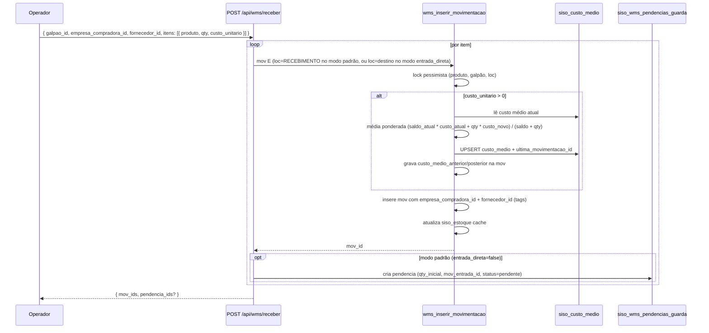

# Architecture and Flows

> System architecture and business flow documentation for SISO / WMS.
> For detailed visual diagrams per module, see `docs/fluxos/`.
> For API contracts, see `docs/api-reference-complete.md`.
> For database schema, see `docs/database-schema.md`.

---

## Ledger Simplificado 3D (2026-05-20)

Estoque deixou de ser 4D (produto × dona × galpão × loc) e virou **3D** (produto × galpão × loc). Empresa não é mais coordenada física — viaja como TAG na movimentação quando há NF (compradora/vendedora/referência), permitindo apuração contábil por empresa via report sem fragmentar o estoque físico.

### Propriedades

- **`siso_estoque.UNIQUE (produto_id, galpao_id, localizacao_id)`** — peças idênticas no mesmo endereço são fungíveis. Não há mais "estoque da NetAir" vs "estoque da NetParts" na mesma loc.
- **`siso_movimentacoes`** carrega 9 colunas de metadata (todas nullable): `empresa_compradora_id`, `empresa_vendedora_id`, `empresa_referencia_id`, `fornecedor_id`, `motivo`, `cliente_nome`, `custo_unitario`, `custo_medio_anterior`, `custo_medio_posterior`.
- **`siso_custo_medio`** — cache global por produto (PK `produto_id`). Atualizado pelo RPC `wms_inserir_movimentacao` em toda entrada com `custo_unitario` via média ponderada.
- **Empréstimo entre empresas, swap N×N e mini-swap intra-galpão foram arquivados.** Código preservado em `src/lib/wms/_archive/`. Algoritmos não fazem sentido sem dona física.
- **Apuração por empresa = report** em `/api/wms/relatorios/*` (3 endpoints: movs-por-empresa, historico-custo, saldos-por-empresa).

### Stock check no pedido (cross-empresa do mesmo grupo)

Quando o webhook chega:

1. Identifica empresa pelo CNPJ → resolve grupo (via `siso_grupo_empresas`).
2. **NÃO** itera por empresa — pool físico é fungível por galpão. Consulta `siso_estoque` agregado por (produto, galpão).
3. Decide entre `propria` (mesmo galpão da origem) / `transferencia` (galpão diferente, todos os itens cobertos) / `oc` (sem cobertura).
4. Auto-aprova apenas `propria`; demais vão pro operador.
5. Na dedução pós-aprovação, a mov S vai com `empresa_vendedora_id` = empresa origem do pedido (a empresa que emite a NF).

---

## Recebimento (entrada com NF + metadata 3D)



### Side effects do RPC

- Lock pessimista por (produto, galpão, loc) — bloqueia até resolver.
- Atualiza saldo no `siso_estoque` (UNIQUE 3D).
- Em E com `custo_unitario`: recalcula `siso_custo_medio` globalmente e populates `custo_medio_anterior/posterior` na mov pra rastreio histórico.
- Tags `empresa_compradora_id` + `fornecedor_id` ficam na mov pra apuração via `/api/wms/relatorios/movs-por-empresa`.

### Interface de Recebimento (Fase B, 2026-06-09)

A aba "Receber" em `/wms/compras` unifica OC (`siso_ordens_compra` status=comprado com itens pendentes) + compras manuais (`siso_compras_manuais` status=comprado|parcial com itens pendentes), agrupadas por fornecedor. Cada documento leva flag `origem` (oc|manual) e link pra página rica: `/wms/receber/oc/[id]` (OC) ou `/wms/receber/manual/[id]` (manual). Documentos ordenados por `criado_em` (mais antigo = mais urgente). Interfere-se com transferências inter-galpão (recebimento separado em `/wms/receber/transferencia`).

**Página única rica — todos os fluxos (Fase D, 2026-06-09):** os 4 fluxos de recebimento (avulso / OC / manual / transferência) renderizam a **mesma página completa** pré-preenchida com os dados do documento. O componente `<ReceberLote>` (`src/components/wms/recebimento/receber-lote.tsx`) é config-driven: cada fluxo fornece um adapter (`buildOcPayload`, `buildManualPayload`, `buildTransferenciaPayload`, `buildAvulsoPayload` em `receber-lote-adapters.ts`) que monta o payload do seu endpoint. Todos os fluxos têm acesso a: sugestão de localização, plano de guarda, entrada direta, etiquetas e anúncio. Linhas pré-definidas exibem "era pra vir N" e ficam bloqueadas por `backendItemId`; itens extras recebidos acima do esperado (OC e manual) entram como `ajuste_manual` via `POST /api/wms/receber`. Transferências não têm custo nem extras (qty fixa). Criação de nova compra manual é feita em `/wms/compras/nova` (página dedicada, modal removido).

---

## Devolução de Cliente (classificação A/B/C/D, 3D)

```mermaid
flowchart TD
  NFe[NF de devolução chega via webhook] --> Pend[siso_devolucoes_pendentes status=aguardando_classificacao]
  Pend --> UI[Operador abre /wms/devolucoes/[id]]
  UI -->|Body: { classificacao, produto_id, qty, galpao_id, localizacao_id, empresa_referencia_id?, fornecedor_id? }| API[POST /api/wms/devolucoes/[id]/classificar]
  API --> Branch{classificacao}

  Branch -->|A — íntegro| A[mov E origem=devolucao_cliente_integra<br/>+ empresa_referencia_id<br/>+ RPC recalcula siso_custo_medio]
  Branch -->|B — avariado| B[mov E origem=devolucao_cliente_avariada<br/>+ par S+E transferindo pra QUARENTENA<br/>custo médio NÃO recalcula]
  Branch -->|C — garantia/RMA| C[mov E origem=devolucao_cliente_integra<br/>+ mov S origem=devolucao_fornecedor_enviada<br/>+ fornecedor_id em ambas]
  Branch -->|D — troca SKU| D[mov E origem=devolucao_cliente_integra<br/>+ troca real fica no SISO por enquanto]

  A --> Fim[siso_devolucoes_pendentes.status=classificada]
  B --> Fim
  C --> Fim
  D --> Fim
```

### Notas

- `empresa_referencia_id` (tag) substitui o antigo `empresa_dona_destino_id` — não muda coordenada física, só registra qual empresa "originou" a devolução pra apuração.
- `fornecedor_id` é obrigatório em classificação `C` (garantia → RMA) pra emissão da NF de saída pro fornecedor.
- Custo médio só recalcula em entrada com peça íntegra (A, C-entry). Avaria não entra na média.

---

## Reconciliação temporal (estoque online, 3D)

Inventário roda em paralelo com operação (picking, recebimento, ajustes). Não há freeze. Cada contagem grava `criado_em` em `siso_inventario_contagens`. No fechamento da sessão, `computarDivergencias` faz:

1. Snapshot `cutoff_em = now()` (imutável durante a execução).
2. Para cada **tripla** `(loc, produto, galpão)` contada (3D — não há mais `dona` no DISTINCT), calcula `T_ref = max(contado_em)`.
3. Busca em `siso_movimentacoes` a primeira mov "efetiva" na tripla com `criado_em > T_ref AND criado_em <= cutoff_em`. "Efetiva" = não estornada (nem é estorno) e não é da própria sessão.
4. `saldo_esperado` = `saldo_anterior` dessa mov, ou `saldo_atual` se não houver.
5. `delta = qty_contada - saldo_esperado`.

Locs visitadas com saldo > 0 mas sem contagens geram divergência `qty=0` apenas se o saldo já existia antes de `contagem_finalizada_em`. Entrada após a visita não conta.

Movs criadas após `cutoff_em` ficam para a próxima sessão (princípio: aprovação congela o universo).

Implementação:
- Função pura: `src/lib/wms/inventario-reconciliacao.ts` (testada em `inventario-reconciliacao.test.ts`)
- Wrapper com I/O: `src/lib/wms/inventario.ts::computarDivergencias`

### Inventário com operação viva — o que é garantido vs soft (2026-06-12)

Três camadas sustentam "contar sem parar a operação":

1. **Locks soft** (`siso_localizacao_locks`, agora com `sessao_id` de dono — INV-06): tiram as locs da sessão do roteamento de pedidos novos, da sugestão de pick, do reconciliador-OC, do cascade do parcial, do fallback de loc (`buscarLocComMaiorSaldoNoGalpao`) e da sugestão de put-away (INV-07). Liberação é **per-loc no `finalizarLoc`** (loc contada volta pro roteamento na hora) com backstop em aprovar/cancelar/aplicar.
2. **Reconciliação temporal** (acima): absorve movs que acontecem mesmo assim — picks de **reservas pré-existentes** seguem permitidos por design (`wms_pick_item_atomico` NÃO checa lock; bloquear pararia a separação). A matemática por tripla com `T_ref` cobre pick antes/depois do bipe, put-away durante a sessão e estornos.
3. **Aplicação por delta** (`wms_aplicar_sessao_inventario`): aplica E/S do delta sobre o saldo atual — movs entre contagem e aplicação não corrompem. Preflight INV-02/04 aborta nomeando a divergência se uma perda colidir com saldo/reserva (badge "⚠ reserva" na UI de divergências avisa antes).

**Residual aceito (físico, inerente):** janela de segundos entre o picker tirar a peça da prateleira e a mov ser gravada — se bipes do MESMO SKU intercalam esse intervalo, há ambiguidade que nenhum modelo de ledger resolve. Com os locks dos pontos INV-07 fechados, picks novos não são mais direcionados pra locs em contagem, encolhendo a exposição.

**Retomada (INV-05):** `wms_inventario_proxima_loc` tem FASE 0 — loc `em_contagem` do próprio operador retorna com `retomada=true` + `bipes`; `p_somente_retomar` permite o frontend perguntar sem claimar (refresh não pula mais de loc).

---

*Last updated: 2026-06-12 — Inventário operação-viva: retomada pós-refresh (INV-05), locks com dono + per-loc (INV-06), furos de lock fechados (INV-07), órfãs antes do computar (INV-08).*

---

## Roles & Permissões

Controle de acesso é via RBAC dinâmico desde 2026-05-21.

### Fluxo de check

1. **Registry (`src/lib/permissions.ts`):** lista canônica de 31 permissões em 8 módulos. Permissões são contratos com o código — cada `userCan(session, "X")` precisa ter X no registry.
2. **Roles (`siso_roles`):** agrupamentos editáveis pelo admin. 6 roles sistema (`admin`, `operador`, `operador_cwb`, `operador_sp`, `comprador`, `vendedor`) não-deletáveis; outras criadas dinamicamente.
3. **Atribuição (`siso_usuario_roles`):** usuário tem 1..N roles. Permissões efetivas = união dos `siso_role_permissoes` das roles ativas.
4. **Sessão:** `getSessionUser()` carrega `permissoes: Set<string>` em cada request (1 query JOIN, ~ms). Fallback: se usuário não tem `siso_usuario_roles`, busca por `cargos[]`.
5. **Check:** `userCan(session, "compras.executar")` em backend; `usePermissoes().can(...)` em client.

### Defesa em camadas
- **UI esconde** items da sidebar e botões via `requires` / `can()`.
- **API valida** a maioria dos endpoints sensíveis com `userCan`; defesa em profundidade vai sendo aplicada conforme cleanup. Helpers compartilhados (`requireAdmin`, `requireWarehouseAccess`) também checam permissões.
- **DB protege** anti-lockout via RPC `wms_role_delete` + validação no endpoint `/usuarios/[id]/roles`.

### Compat legado
`siso_usuarios.cargo` e `.cargos[]` continuam existindo (nullable, espelhados por trigger `trg_sync_cargos_after_roles`). Código novo nunca lê esses campos — só permissoes. Remoção definitiva planejada para ~1 mês após Fase 3 estabilizar.

---

## Quadro de Tarefas Pendentes — home /wms (P5, 2026-05-26)

A home `/wms` é PageHeader + `<QuadroTarefas>`. O quadro divide o que o operador precisa enxergar em 3 zonas:

### 1. Pipeline do pedido (3 cards horizontais no topo)

| Card | Contador | Split |
|---|---|---|
| Aprovação | `aprovacao.count` | `marketplace` vs `manual` (P5) |
| Separação | `separacao.count` | avatares ao vivo via presença WMS |
| Embalagem | `embalagem.count` | avatares ao vivo |

### 2. Kanban operacional (3 colunas)

- **Guarda** — `siso_wms_pendencias_guarda` em `pendente`/`em_guarda`. Cards individuais com SKU + qty + idade + avatar.
- **Inventário** — sessões `em_andamento` com progresso `locs_contadas / locs_total` e party ativa.
- **Compras** — agrupado por fornecedor: `a_comprar` (itens) + `a_receber` (ordens).

### 3. Seção Exceções (P5)

Abaixo do kanban, a seção `<SecaoExcecoes>` agrupa 6 categorias de pendência que quebram o fluxo normal e exigem ação operacional. Default expandido se qualquer contador > 0; colapsável manualmente (estado perde no F5 intencionalmente — primeira impressão importa).

| # | Card | Trigger |
|---|---|---|
| 1 | **Devoluções pendentes** | `siso_devolucoes_pendentes.status='aguardando_classificacao'` |
| 2 | **Transferências em trânsito** | `siso_transferencias_galpao.status='em_transito'`. Idade visível (>48h fica vermelho). |
| 3 | **Inventário em revisão** | `siso_inventario_sessoes.status='revisao'` + divergências pendentes contadas |
| 4 | **Reservas órfãs** | Mov R com `origem_tipo='reserva_pedido'`, pedido cancelado, sem estorno. Alerta vermelho >5. |
| 5 | **Retroativos pendentes** | Movs `origem_tipo='lancamento_retroativo'` não-estornadas |
| 6 | **Saldo órfão em RECEBIMENTO** | `siso_estoque` em loc tipo='recebimento' com saldo > 0 sem pendência viva |

### Realtime

Hook `useDashboardTarefasRealtime(galpaoId)` subscribe a 8 tabelas via Supabase Realtime. Invalidates são **debounced em 250ms** pra coalesce eventos rapid-fire. Fallback: `staleTime=0 + refetchInterval=30_000` no useQuery.

Tabelas assinadas (devem estar na publication `supabase_realtime` — verificada em P1):

1. `siso_pedidos`
2. `siso_wms_pendencias_guarda`
3. `siso_inventario_sessoes`
4. `siso_inventario_operadores`
5. `siso_pedido_itens`
6. `siso_devolucoes_pendentes` (P5)
7. `siso_transferencias_galpao` (P5)
8. `siso_movimentacoes` filtrado `tipo=eq.R` (P5)

### Fix de galpão filter (P5)

Bug 0.5/5.8: filtro `galpao_id` aplicava `eq('separacao_galpao_id', galpao_id)` em pedidos pendentes, mas pedidos pendentes **ainda não aprovados** têm `separacao_galpao_id IS NULL` — escondia ~69% dos pendentes em prod. Fix: para `status='pendente'`, usar `OR(separacao_galpao_id.eq.X, separacao_galpao_id.is.null)`. Para fluxos pós-aprovação (separacao/embalagem) a invariante `separacao_galpao_id IS NOT NULL` é mantida pelo `pedidos/aprovar`.

---

## Reverse paritária (P3 — 2026-05-27)

Princípio: **toda ação que insere movs no ledger deve ter uma contraparte de reversão**.
Antes do P3, várias operações WMS eram "one-way": confirmavam saldo no ledger mas não tinham
botão pra desfazer (operador precisava abrir ticket pra admin executar SQL manual). P3 fecha
essa lacuna com 7 endpoints reverse e ajustes pra preservar invariantes do ledger.

| Ação forward | Endpoint reverso (P3) | Estorna que? |
|---|---|---|
| `POST /api/wms/inventario/[id]/aplicar` (gera movs `inventario_perda/ganho` por divergência) | `POST /api/wms/inventario/[id]/estornar` **(admin)** | Para cada divergência `aplicada`, estorna a mov gerada e volta divergência pra `pendente`. Sessão volta pra `revisao`. |
| `POST /api/wms/guarda/[id]/confirmar` (par S+E RECEBIMENTO→loc destino) | `POST /api/wms/guarda/[id]/desfazer` | Estorna a última confirmação (S+E), decrementa `qty_guardada`, restaura status da pendência. |
| `POST /api/wms/devolucoes/[id]/classificar` (E + transferência opcional pra QUARENTENA + RMA) | `POST /api/wms/devolucoes/[id]/desclassificar` | Match por janela temporal ±60s da `classificada_em` + origem_tipo + (NF/produto quando disponíveis). Estorna todas as movs e volta pra `aguardando_classificacao`. |
| `POST /api/wms/replenishment` (S+E intra-galpão) | `POST /api/wms/replenishment/[origem_id]/reverter` | Estorna ambas as legs (idempotente — chamadas repetidas pulam movs já estornadas). |
| `POST /api/wms/ajuste` (mov manual S ou E; saída pode realocar R de pedido) | `POST /api/wms/ajuste/[mov_id]/estornar` | Estorna a mov; valida `origem_tipo='ajuste_manual'` antes (recusa estornar movs de outras origens por esse endpoint). A reserva eventualmente realocada permanece numa posição válida. |
| `POST /api/wms/vendas/criar` (baixa_direta gera S por item; modo separação gera R) | `POST /api/wms/vendas/[id]/cancelar` | Estorna movs S (idempotente) ou libera R conforme o status atual. Rejeita 400 se status_separacao ∈ {em_separacao,separado,embalado,conferido} — operador deve `voltar-etapa` primeiro. |
| `POST /api/wms/transferencias/[id]/receber` (E destino) | `POST /api/wms/transferencias/[id]/desfazer-recebimento` | Estorna **só a leg E** + reset itens + header volta pra `em_transito`. A leg S continua (estoque continua em trânsito). Permite re-receber. |

### Atomicidade reforçada (RPCs)

Migrations P3 movem 2 fluxos multi-step do TS pra RPC SQL atômica:
- `wms_replenishment_intra_galpao` — S+E numa transação única. Antes, crash entre S e E
  deixava saldo evaporando. Endpoint `/api/wms/replenishment` consome via `replenishmentIntraGalpao()`.
- `wms_ajustar_estoque_realocando_reservas` — quando a contagem real ficaria abaixo do
  reservado, move a `R reserva_pedido` inteira para outra posição com capacidade e só então
  grava a `S ajuste_manual`; L+R+S fazem rollback juntas se qualquer etapa falhar.
- `wms_confirmar_guarda_atomico` — S+E + UPDATE de `siso_wms_pendencias_guarda` (`qty_guardada`,
  `status`) numa transação única. Antes, crash entre mov e UPDATE deixava saldo movido mas
  pendência não atualizada (estado fantasma). Endpoint `/api/wms/guarda/[id]/confirmar` consome.

### Idempotência (UNIQUE constraint)

`aplicar` em duas requisições paralelas competia pra inserir 2 movs com o mesmo `origem_id`
(divergencia_id). UNIQUE partial index `uniq_movs_inventario_divergencia` (`origem_id`,
`origem_tipo`) WHERE `origem_tipo IN ('inventario_perda','inventario_ganho')` em
`siso_movimentacoes` garante que o 2º recebe **SQLSTATE 23505** (traduzido como
ConflictError `{ code: 'DIVERGENCIA_JA_APLICADA' }`) e o caller pula a div, continua com as demais.

### Anti-race em fluxos críticos

- **`iniciarGuarda`** (#5.2): UPDATE condicional `WHERE status='pendente'`; 2º operador recebe **409 PENDENCIA_OUTRA_GUARDA**.
- **`registrarContagem`** (#4.3): exige `siso_inventario_localizacoes.bloqueada_por = caller`; sem lock retorna **409 LOC_NAO_BLOQUEADA**.
- **`receberTransferencia`** (#8.10): claim lock via `siso_transferencias_galpao.recebimento_em_andamento_por`; 2º operador recebe **409 TRANSFERENCIA_OUTRO_RECEBIMENTO**.
- **`computarDivergencias` / `aprovarSessao`** (#4.5/#4.6): retorna **409 OPERADORES_ATIVOS** se há ops bipando; supervisor pode bypassar via `force: true`.
- **`marcar-item` desmarcar** (#2.7): estorna leg S **antes** da leg L, preservando invariante I2 (saldo_anterior + delta = saldo_posterior) durante o estorno em par.

### Estado fantasma fix (#2.10)

`reiniciar` com `etapa='embalagem'` agora invoca `reverterCutoverDoPedido` em
`src/lib/wms/cutover.ts` — estorna as movs `'L'` (liberação reserva) e `'S'` (saída) emitidas
no cutover anterior + recria as reservas R com saldo. Antes, voltar etapa de embalagem
deixava saldo permanentemente saído sem caminho de volta (estado fantasma).

### Reconciliação OC por saldo tardio (item OC vira normal)

`reconciliarEntradaEstoque` (`src/lib/wms/reconciliador-oc.ts`) rebaixa um item OC
para separação normal quando aparece saldo livre que cobre — CLAIM atômico
(compare-and-swap em `compra_status`) + reserva FIFO + `decisao_final='propria'`.

Gatilhos: (a) gancho de mov `E` em `ledger.ts` (entrada de estoque); (b) confirmar
put-away; (c) **clique SEPARAR** — `separacao/iniciar` chama o reconciliador por
`(produto_uuid, galpão)` dos itens OC, após promover a `em_separacao` e antes de
consolidar o checklist (helper puro `paresProdutoGalpao`, `sku→uuid`).

`STATUS_PEDIDO_OC` inclui `validacao_oc | aguardando_compra | em_separacao`. Em
`em_separacao`, `transicionarPedidoSeReconciliado` só marca `decisao_final='propria'`
(não regride status) — o item vira linha normal na wave atual; a NF é gerada
depois, na embalagem (`confirmar-item-embalagem` / `bipar-embalagem-oc` enfileiram
`lancar_estoque`). Hoje só conta saldo em loc `tipo='picking'` (saldo em recebimento
exige put-away; estender a recebimento é Fase 2, coordenando com a guarda p/ não
violar `reservado<=saldo`).

### `lancamento-retroativo/[id]/reconciliar` (#8.6)

Endpoint agora valida UUID format de `[id]` e `compra_mov_id` (regex) **antes** de chamar a
RPC, e SELECT verifica existência das duas movs. Antes, caller podia passar string vazia/uuid
inexistente e receber 23502/23503 cripticamente.

## Conferência de Embalagem (2026-06-11)

Etapa opcional entre `embalado` e `expedido`, operada por bip da **etiqueta de envio** (ML/Shopee) na bancada (`/wms/separacao/conferencia`).

```
separado → [checklist bipa PRODUTOS, imprime etiquetas] → embalado
         → embalador bipa ETIQUETA (modo embalar)   grava embalado_real_por/em — status NÃO muda
         → conferente bipa ETIQUETA (modo conferir) embalado → conferido (claim atômico)
         → expedir                                  aceita embalado OU conferido (não bloqueia)
```

### Resolução do bip (lib/wms/conferencia.ts)

1. `etiqueta_barcodes @> [codigo]` — array gravado na hora em que o ZPL é persistido (`agrupamento-service.salvarEtiqueta` + fallback do `etiqueta-service`): valores extraídos do ZPL (`lib/etiqueta-barcode.ts`, comandos `^BC`/`^BQ`/etc com normalização de escapes Code128) + `codigoRastreio` da expedição Tiny.
2. `chave_acesso_nf` quando o código tem 44 dígitos (barcode da DANFE).
3. `id_pedido_ecommerce` (escopo separado/embalado/conferido).
4. ILIKE no `etiqueta_zpl` bruto (janela 30d) com **self-heal** (persiste os barcodes no hit).

> **Shopee é raster (`~DG`)** — o ZPL não tem comandos de barcode; a cobertura vem do `codigoRastreio` (e dos fallbacks).

### Regras

- Conferência é **visual** (sem bipar produto a produto): o bip mostra os itens esperados; bipar a próxima etiqueta = OK da anterior (zero clique). Divergência = botão (tipo + obs), conferente arruma fisicamente na bancada; o registro conta contra o embalador.
- **Auto-conferência permitida** (mesmo usuário pode embalar e conferir — decisão D5 2026-06-11).
- `conferido` está em `FORWARD_STATES` do cutover (embalado→conferido NÃO reverte estoque).
- `voltar-etapa` pra ≤`embalado` limpa conferência+divergência; pra ≤`separado` limpa também `embalado_real_*`.
- Métricas em `/wms/relatorios/conferencia`: taxa de acerto por embalador (breakdown por tipo), % conferido, volume por conferente.

---

## Cross & Troca de Equivalência (redesign 2026-06-19)

Cross é a camada de equivalência **ÚNICA** — o caderno `siso_cross_equivalencias` (pares DIRETOS de SKU, `status` `sugestao`|`confirmado`|`bloqueado`, **zero auto-merge, sem transitividade** — nada de cluster A=C via ponte B). O velho catálogo sujo (OEMs/veículos/links + cluster recursivo, lidos do Tiny) foi removido (migrations `20260619b/c/d`).

- **Estoque exibido no cross vem do ledger** (`aggregateLiveStockBySku`), **nunca do Tiny** — não mente "zero" quando o Tiny cai.
- **A troca de equivalência lê o caderno via `buscarParVerificacao`** (antes lia `siso_equivalencias_verificadas`): `confirmado`→"verificado", `bloqueado`→"bloqueado", `sugestao`→null (palpite não habilita troca). Auto-troca só com par `confirmado` + mesmo `tier_qualidade`.

### Fluxo de curadoria

1. Operador liga 2 peças (`POST /cross/ligar`) → cria palpite (`status='sugestao'`).
2. Curador valida na fila (`/wms/cross`, aba Fila — `GET /cross/fila`) → confirma ou bloqueia (`POST /cross/[id]/decidir`).
3. Par `confirmado` passa a habilitar troca livre (sujeito à regra de tier); `bloqueado` = nunca trocar.
