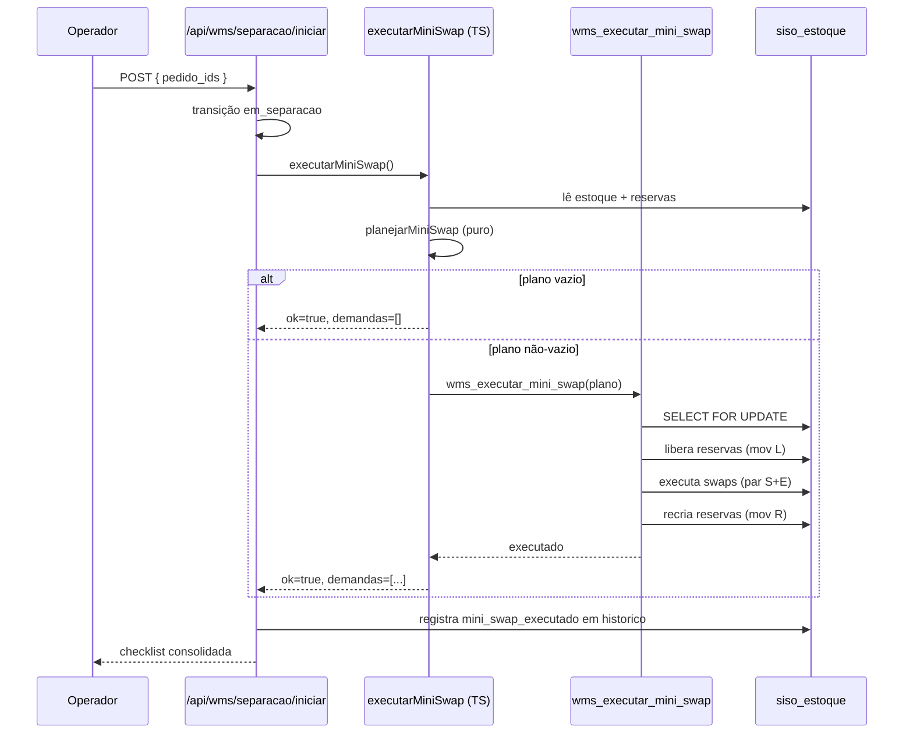

# Architecture and Flows

> System architecture and business flow documentation for SISO / WMS.
> For detailed visual diagrams per module, see `docs/fluxos/`.
> For API contracts, see `docs/api-reference-complete.md`.
> For database schema, see `docs/database-schema.md`.

---

## Wave Picking + Mini-Swap Intra-Galpão

### Overview

When an operator selects orders for a wave and calls `POST /api/wms/separacao/iniciar`, the system:

1. Transitions the orders to `em_separacao`
2. Optionally runs the **mini-swap** optimization (if enabled for the operator's galpão)
3. Returns the consolidated product checklist for wave picking

The mini-swap step consolidates stock from multiple empresas in the same galpão into a single canonical location before the operator starts picking. This eliminates in-wave stock fragmentation without creating inter-galpão debt.

### Sequence Diagram

### Key Properties

- **Disparo:** 1× por wave, síncrono dentro de `POST /api/wms/separacao/iniciar`, antes de retornar a checklist.
- **Falha graceful:** qualquer exceção no mini-swap é capturada silenciosamente — a wave segue normalmente sem otimização. O evento `mini_swap_executado` só é registrado se o RPC completar com sucesso.
- **Toggle por galpão:** configurável em `/wms/configuracoes/otimizacoes` (admin only). Lido de `siso_wms_mini_swap_config`.
- **Atomicidade:** o RPC `wms_executar_mini_swap` aplica liberar-reservas + swaps + recriar-reservas numa única transação Postgres com lock pessimista em `siso_estoque`.
- **Sem dívida:** swaps (origem_tipo='swap') são trocas simétricas — saldo total por empresa preservado. Empréstimos (origem_tipo='emprestimo') são limitados ao que o algoritmo de roteamento planejou para o pedido.

### Files

| File | Purpose |
|---|---|
| `src/lib/wms/mini-swap-types.ts` | Tipos: `SaldoLinha`, `Demanda`, `PlanoMiniSwap`, `MiniSwapConfig` |
| `src/lib/wms/mini-swap.ts` | `planejarMiniSwap()` (algoritmo puro, sem I/O) + `executarMiniSwap()` (orchestrator) |
| `src/app/api/wms/separacao/iniciar/route.ts` | Ponto de integração — chama `executarMiniSwap()` após transição |
| `src/app/api/wms/mini-swap/config/route.ts` | `GET` lista config por galpão |
| `src/app/api/wms/mini-swap/config/[galpaoId]/route.ts` | `PATCH` toggle ativo (admin) |
| `src/app/api/wms/mini-swap/simular/route.ts` | `POST` dry-run sem DB writes |
| `src/app/wms/configuracoes/otimizacoes/page.tsx` | UI de toggle por galpão |
| `supabase/migrations/20260514_wms_mini_swap*.sql` | Schema: `siso_wms_mini_swap_config` + RPC `wms_executar_mini_swap` |

### Related

- Spec completa: `docs/superpowers/specs/2026-05-14-mini-swap-intra-galpao-design.md`
- Fluxo de separação: `docs/fluxos/05-separacao-wave-picking.md`
- RPC de swap base: `wms_executar_swap` (documentada em `docs/database-schema.md`)

---

*Last updated: 2026-05-18 — paths atualizados pra refletir cutover `/api/wms/*` (commit f8b7dbb).*

### Reconciliação temporal (estoque online)

Inventário roda em paralelo com operação (picking, recebimento, ajustes). Não há freeze. Cada contagem grava `criado_em` em `siso_inventario_contagens`. No fechamento da sessão, `computarDivergencias` faz:

1. Snapshot `cutoff_em = now()` (imutável durante a execução).
2. Para cada quádrupla `(loc, produto, dona)` contada, calcula `T_ref = max(contado_em)`.
3. Busca em `siso_movimentacoes` a primeira mov "efetiva" na quádrupla com `criado_em > T_ref AND criado_em <= cutoff_em`. "Efetiva" = não estornada (nem é estorno) e não é da própria sessão.
4. `saldo_esperado` = `saldo_anterior` dessa mov, ou `saldo_atual` se não houver.
5. `delta = qty_contada - saldo_esperado`.

Locs visitadas (operador confirmou no modal "está vazia" ou bipou ao menos uma peça) com saldo > 0 mas sem contagens geram divergência `qty=0` **apenas se** o saldo já existia antes de `contagem_finalizada_em`. Entrada após a visita não conta.

Locs não visitadas (`contagem_finalizada_em IS NULL`) são totalmente ignoradas.

Movs criadas após `cutoff_em` ficam para a próxima sessão (princípio: aprovação congela o universo).

Implementação:
- Função pura: `src/lib/wms/inventario-reconciliacao.ts` (testada em `inventario-reconciliacao.test.ts`)
- Wrapper com I/O: `src/lib/wms/inventario.ts::computarDivergencias`
