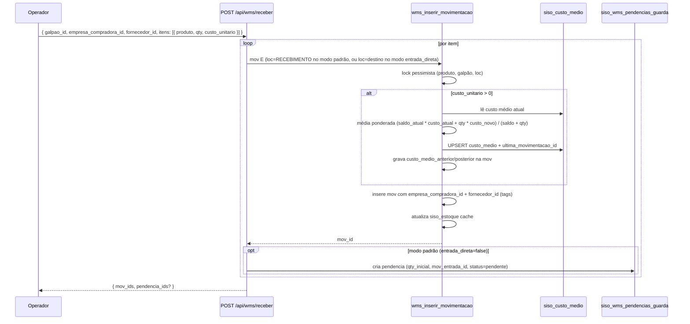

# Architecture and Flows

> System architecture and business flow documentation for SISO / WMS.
> For detailed visual diagrams per module, see `docs/fluxos/`.
> For API contracts, see `docs/api-reference-complete.md`.
> For database schema, see `docs/database-schema.md`.

---

## Ledger Simplificado 3D (2026-05-20)

Estoque deixou de ser 4D (produto × dona × galpão × loc) e virou **3D** (produto × galpão × loc). Empresa não é mais coordenada física — viaja como TAG na movimentação quando há NF (compradora/vendedora/referência), permitindo apuração contábil por empresa via report sem fragmentar o estoque físico.

### Propriedades

- **`siso_estoque.UNIQUE (produto_id, galpao_id, localizacao_id)`** — peças idênticas no mesmo endereço são fungíveis. Não há mais "estoque da NetAir" vs "estoque da NetParts" na mesma loc.
- **`siso_movimentacoes`** carrega 9 colunas de metadata (todas nullable): `empresa_compradora_id`, `empresa_vendedora_id`, `empresa_referencia_id`, `fornecedor_id`, `motivo`, `cliente_nome`, `custo_unitario`, `custo_medio_anterior`, `custo_medio_posterior`.
- **`siso_custo_medio`** — cache global por produto (PK `produto_id`). Atualizado pelo RPC `wms_inserir_movimentacao` em toda entrada com `custo_unitario` via média ponderada.
- **Empréstimo entre empresas, swap N×N e mini-swap intra-galpão foram arquivados.** Código preservado em `src/lib/wms/_archive/`. Algoritmos não fazem sentido sem dona física.
- **Apuração por empresa = report** em `/api/wms/relatorios/*` (3 endpoints: movs-por-empresa, historico-custo, saldos-por-empresa).

### Stock check no pedido (cross-empresa do mesmo grupo)

Quando o webhook chega:

1. Identifica empresa pelo CNPJ → resolve grupo (via `siso_grupo_empresas`).
2. **NÃO** itera por empresa — pool físico é fungível por galpão. Consulta `siso_estoque` agregado por (produto, galpão).
3. Decide entre `propria` (mesmo galpão da origem) / `transferencia` (galpão diferente, todos os itens cobertos) / `oc` (sem cobertura).
4. Auto-aprova apenas `propria`; demais vão pro operador.
5. Na dedução pós-aprovação, a mov S vai com `empresa_vendedora_id` = empresa origem do pedido (a empresa que emite a NF).

---

## Recebimento (entrada com NF + metadata 3D)



### Side effects do RPC

- Lock pessimista por (produto, galpão, loc) — bloqueia até resolver.
- Atualiza saldo no `siso_estoque` (UNIQUE 3D).
- Em E com `custo_unitario`: recalcula `siso_custo_medio` globalmente e populates `custo_medio_anterior/posterior` na mov pra rastreio histórico.
- Tags `empresa_compradora_id` + `fornecedor_id` ficam na mov pra apuração via `/api/wms/relatorios/movs-por-empresa`.

---

## Devolução de Cliente (classificação A/B/C/D, 3D)

```mermaid
flowchart TD
  NFe[NF de devolução chega via webhook] --> Pend[siso_devolucoes_pendentes status=aguardando_classificacao]
  Pend --> UI[Operador abre /wms/devolucoes/[id]]
  UI -->|Body: { classificacao, produto_id, qty, galpao_id, localizacao_id, empresa_referencia_id?, fornecedor_id? }| API[POST /api/wms/devolucoes/[id]/classificar]
  API --> Branch{classificacao}

  Branch -->|A — íntegro| A[mov E origem=devolucao_cliente_integra<br/>+ empresa_referencia_id<br/>+ RPC recalcula siso_custo_medio]
  Branch -->|B — avariado| B[mov E origem=devolucao_cliente_avariada<br/>+ par S+E transferindo pra QUARENTENA<br/>custo médio NÃO recalcula]
  Branch -->|C — garantia/RMA| C[mov E origem=devolucao_cliente_integra<br/>+ mov S origem=devolucao_fornecedor_enviada<br/>+ fornecedor_id em ambas]
  Branch -->|D — troca SKU| D[mov E origem=devolucao_cliente_integra<br/>+ troca real fica no SISO por enquanto]

  A --> Fim[siso_devolucoes_pendentes.status=classificada]
  B --> Fim
  C --> Fim
  D --> Fim
```

### Notas

- `empresa_referencia_id` (tag) substitui o antigo `empresa_dona_destino_id` — não muda coordenada física, só registra qual empresa "originou" a devolução pra apuração.
- `fornecedor_id` é obrigatório em classificação `C` (garantia → RMA) pra emissão da NF de saída pro fornecedor.
- Custo médio só recalcula em entrada com peça íntegra (A, C-entry). Avaria não entra na média.

---

## Reconciliação temporal (estoque online, 3D)

Inventário roda em paralelo com operação (picking, recebimento, ajustes). Não há freeze. Cada contagem grava `criado_em` em `siso_inventario_contagens`. No fechamento da sessão, `computarDivergencias` faz:

1. Snapshot `cutoff_em = now()` (imutável durante a execução).
2. Para cada **tripla** `(loc, produto, galpão)` contada (3D — não há mais `dona` no DISTINCT), calcula `T_ref = max(contado_em)`.
3. Busca em `siso_movimentacoes` a primeira mov "efetiva" na tripla com `criado_em > T_ref AND criado_em <= cutoff_em`. "Efetiva" = não estornada (nem é estorno) e não é da própria sessão.
4. `saldo_esperado` = `saldo_anterior` dessa mov, ou `saldo_atual` se não houver.
5. `delta = qty_contada - saldo_esperado`.

Locs visitadas com saldo > 0 mas sem contagens geram divergência `qty=0` apenas se o saldo já existia antes de `contagem_finalizada_em`. Entrada após a visita não conta.

Movs criadas após `cutoff_em` ficam para a próxima sessão (princípio: aprovação congela o universo).

Implementação:
- Função pura: `src/lib/wms/inventario-reconciliacao.ts` (testada em `inventario-reconciliacao.test.ts`)
- Wrapper com I/O: `src/lib/wms/inventario.ts::computarDivergencias`

---

*Last updated: 2026-05-20 — Ledger Simplificado 3D rollout (drop dona física, empresa como tag em movs).*
