# SISO Architecture and Flows

Complete reference for the system architecture, data flows, and business logic of the Sistema Inteligente de Separacao de Ordens (SISO).

## Table of Contents

1. [System Architecture Overview](#system-architecture-overview)
2. [Webhook Pipeline](#webhook-pipeline)
3. [Order Lifecycle](#order-lifecycle)
4. [Separation Flow](#separation-flow)
5. [Purchase Order Flow](#purchase-order-flow)
6. [Inventory Flow](#inventory-flow)
7. [Transfer Flow](#transfer-flow)
8. [Authentication & Authorization](#authentication--authorization)
9. [Tiny ERP Integration](#tiny-erp-integration)
10. [Label Printing](#label-printing)
11. [Error Handling & Observability](#error-handling--observability)
12. [Real-time Features](#real-time-features)

---

## System Architecture Overview

### High-Level Component Diagram


```mermaid
graph TB
    subgraph External["External Systems"]
        TinyERP["Tiny ERP API v3<br/>(OAuth2 Keycloak)"]
        PrintNode["PrintNode API<br/>(Label Printing)"]
        Marketplaces["Marketplaces<br/>(Mercado Livre, Shopee)"]
    end

    subgraph SISO["SISO Application"]
        Webhook["Webhook Receiver<br/>/api/webhook/tiny"]
        Processor["Webhook Processor<br/>(webhook-processor.ts)"]
        NfHandler["NF Handler<br/>(nf-webhook-handler.ts)"]
        Worker["Execution Worker<br/>(execution-worker.ts)"]

        Dashboard["Dashboard<br/>/siso"]
        Separacao["Separation Module<br/>/separacao"]
        Compras["Purchase Module<br/>/compras"]
        Inventario["Inventory Module<br/>/inventario"]
        Transferencia["Transfer Module<br/>/transferencias"]
        Etiquetas["Label Module<br/>/etiquetas"]

        Auth["Auth System<br/>(PIN-based)"]
    end

    subgraph Supabase["Supabase Database"]
        Pedidos["siso_pedidos<br/>(Orders)"]
        PedidoItens["siso_pedido_itens<br/>(Order Items)"]
        ItemEstoques["siso_pedido_item_estoques<br/>(Normalized Stock)"]
        FilaExec["siso_fila_execucao<br/>(Execution Queue)"]

        Galpoes["siso_galpoes<br/>(Warehouses)"]
        Empresas["siso_empresas<br/>(Companies)"]
        Grupos["siso_grupos<br/>(Business Groups)"]
        GrupoEmpresas["siso_grupo_empresas<br/>(Group Membership)"]

        OrdensCompra["siso_ordens_compra<br/>(Purchase Orders)"]
        Inventarios["siso_inventarios<br/>(Inventory Sessions)"]
        Transferencias["siso_transferencias<br/>(Transfers)"]

        WebhookLogs["siso_webhook_logs<br/>(Webhook Dedup)"]
        Logs["siso_logs<br/>(Application Logs)"]
        Erros["siso_erros<br/>(Error Tracking)"]
    end

    TinyERP -->|Webhook| Webhook
    Marketplaces -->|Order Data| TinyERP

    Webhook -->|Process| Processor
    Webhook -->|Handle NF| NfHandler

    Processor -->|Enrich Stock| ItemEstoques
    Processor -->|Save Order| Pedidos
    Processor -->|Enqueue Job| FilaExec

    Worker -->|Execute Job| FilaExec
    Worker -->|Post Stock| TinyERP
    Worker -->|Generate NF| TinyERP

    Dashboard -->|Approve Order| FilaExec

    Separacao -->|Start/Update| FilaExec
    Separacao -->|Print Label| PrintNode

    Compras -->|Track Items| OrdensCompra
    Inventario -->|Process Stock| TinyERP
    Transferencia -->|Move Stock| TinyERP
    Etiquetas -->|Print Labels| PrintNode

    Auth -->|Validate Session| Pedidos
```

### Core Hierarchy: Galpão > Empresa > Grupo

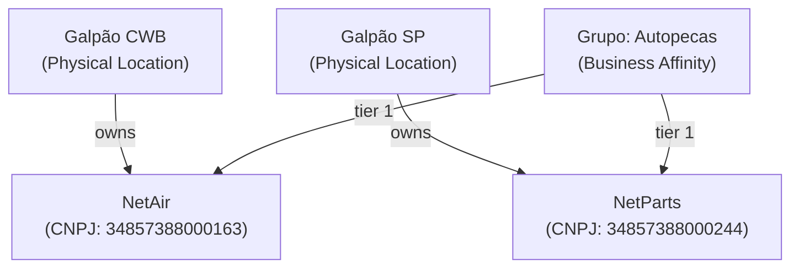
```mermaid
graph TD
    Galpao1["Galpão CWB<br/>(Physical Location)"]
    Galpao2["Galpão SP<br/>(Physical Location)"]

    Emp1["NetAir<br/>(CNPJ: 34857388000163)"]
    Emp2["NetParts<br/>(CNPJ: 34857388000244)"]

    Grupo1["Grupo: Autopecas<br/>(Business Affinity)"]

    Galpao1 -->|owns| Emp1
    Galpao2 -->|owns| Emp2

    Grupo1 -->|tier 1| Emp1
    Grupo1 -->|tier 1| Emp2
```

**Key Concepts:**

- **Galpão**: Physical warehouse location (CWB, SP). Can have multiple empresas.
- **Empresa**: Tiny ERP account with own CNPJ. Foreign key to galpão.
- **Grupo**: Business affinity group. Empresas in same grupo check stock across each other.
- **Tier**: Deduction priority within a grupo. Origin empresa gets tier 1 override at runtime.

### Technology Stack

| Component | Technology |
|-----------|-----------|
| **Framework** | Next.js 16.1.6 (App Router) |
| **Runtime** | Node.js 20+ |
| **Frontend** | React 19 + TypeScript |
| **Styling** | Tailwind CSS 4 (no component library) |
| **Database** | Supabase (PostgreSQL) |
| **State** | TanStack React Query (client-only) |
| **Real-time** | Supabase Realtime (WebSocket) |
| **ERP** | Tiny ERP API v3 + Keycloak OAuth2 |
| **Printing** | PrintNode API (ZPL + PDF) |
| **UI Components** | Custom (Lucide icons, Sonner toasts) |
| **Logging** | Structured JSON + Supabase tables |

---

## Webhook Pipeline

Detailed flow from Tiny ERP webhook to order ready for processing.

### Entry Point: `/api/webhook/tiny`

**Location:** `src/app/api/webhook/tiny/route.ts`

```mermaid
sequenceDiagram
    participant Tiny as Tiny ERP
    participant Webhook as Webhook Receiver
    participant DB as Supabase
    participant Processor as Webhook Processor
    participant Worker as Execution Worker

    Tiny->>Webhook: POST /api/webhook/tiny<br/>{tipo, cnpj, dados}

    activate Webhook
    Webhook->>Webhook: Parse payload
    Webhook->>Webhook: Validate fields (tipo, cnpj, dados)

    Webhook->>DB: Lookup empresa by CNPJ
    DB-->>Webhook: EmpresaInfo

    alt Unknown CNPJ
        Webhook-->>Tiny: 400 Unknown CNPJ
        deactivate Webhook
    end

    alt nota_fiscal webhook
        Webhook->>Processor: handleNfWebhook(async)
        Webhook-->>Tiny: 200 OK (queued)
        deactivate Webhook

        activate Processor
        Processor->>DB: Dedup by unique key
        Processor->>DB: Match NF to pedido
        Processor->>DB: Update pedido.nota_fiscal_id + chave_acesso_nf
        Processor->>DB: Transition aguardando_nf → aguardando_separacao
        Processor->>Processor: criarAgrupamentoFase1 (fire-and-forget)<br/>if nota_fiscal_id + chave_acesso_nf both persisted
        deactivate Processor
    else atualizacao_pedido / inclusao_pedido
        Webhook->>Webhook: Filter by situacao (aprovado/cancelado)

        alt cancelado
            Webhook->>DB: Update pedido → cancelado
            Webhook->>DB: Clear compra fields (if in compras flow)
            Webhook->>DB: Dequeue execution jobs
            Webhook-->>Tiny: 200 OK (cancelled)
            deactivate Webhook
        else aprovado
            Webhook->>DB: Insert webhook log (dedup)

            alt Duplicate detected
                Webhook-->>Tiny: 200 OK (duplicate)
                deactivate Webhook
            end

            Webhook->>Processor: processWebhook(async)
            Webhook-->>Tiny: 200 OK (queued)
            deactivate Webhook

            activate Processor
            Processor->>DB: Mark webhook log → processando
            Processor->>DB: Fetch all empresas in grupo
            Processor->>Tiny: Get pedido details (origin empresa)

            alt Non-marketplace order
                Processor->>DB: Mark webhook log → ignorado
                deactivate Processor
            end

            Processor->>Tiny: Get stock for all items (multi-empresa)
            Processor->>Processor: Calculate decision (propria/transferencia/oc)
            Processor->>DB: Save siso_pedidos row
            Processor->>DB: Save siso_pedido_itens + stock enrichment

            alt Auto-approve (propria + origin covers 100%)
                Processor->>DB: Enqueue execution job with tipo=lancar_estoque
                Processor->>Worker: Kick worker (async)
                Processor->>DB: Mark webhook log → concluido
                deactivate Processor

                activate Worker
                Worker->>Tiny: Insert marcadores on order
                Worker->>Tiny: Generate NF (propria)
                Worker->>Tiny: Post stock from NF
                Worker->>DB: Update pedido → concluido
                Worker->>DB: Mark job → concluido
                Worker->>Worker: criarAgrupamentoFase1 (fire-and-forget)<br/>after stock persisted
                deactivate Worker
            else Manual review (transferencia/oc or partial)
                Processor->>DB: Save suggestion in siso_pedidos
                Processor->>DB: Mark webhook log → concluido
                Processor->>DB: Set status → pendente (for operator panel)
                deactivate Processor
            end
        end
    end
```

### Decision Logic Algorithm

**Location:** `src/lib/webhook-processor.ts` (lines 300-450)

Evaluates stock across all empresas in a group and calculates the optimal decision:

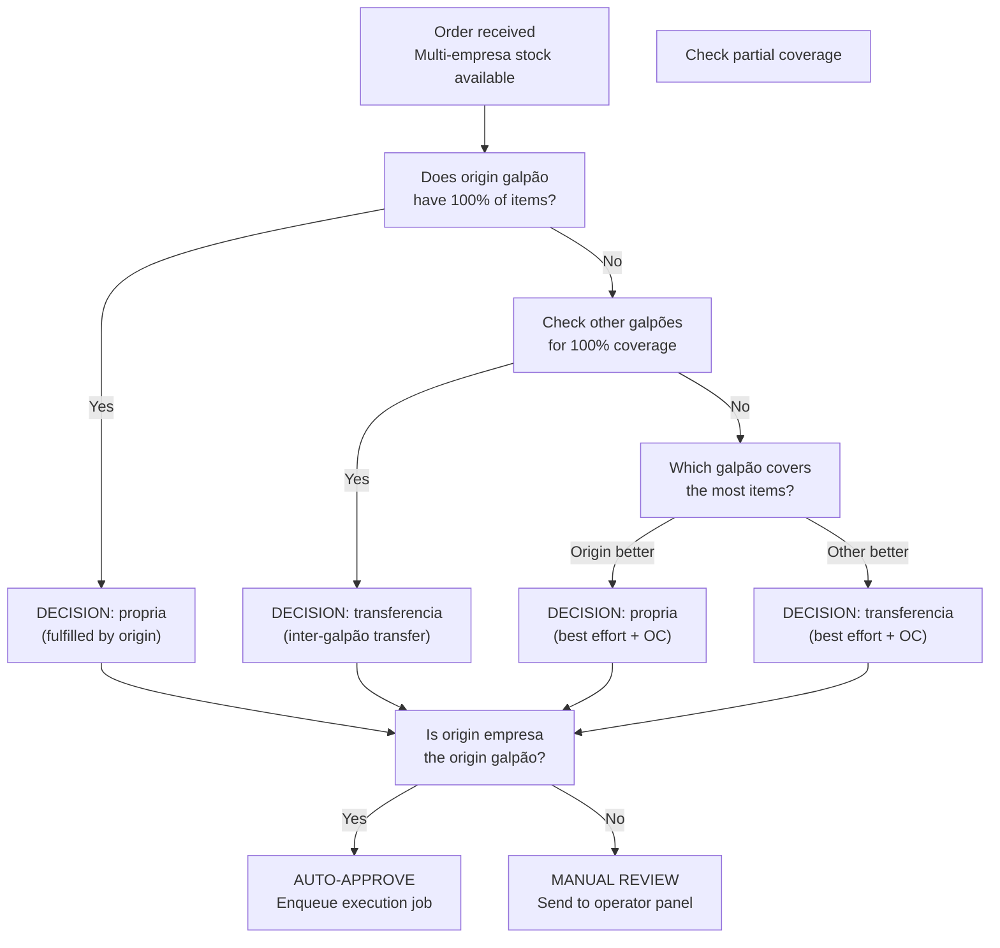
```mermaid
flowchart TD
    Start["Order received<br/>Multi-empresa stock available"]

    CheckOrigin["Does origin galpão<br/>have 100% of items?"]

    OriginYes["DECISION: propria<br/>(fulfilled by origin)"]
    OriginNo["Check other galpões<br/>for 100% coverage"]

    OtherYes["DECISION: transferencia<br/>(inter-galpão transfer)"]
    OtherNo["Check partial coverage"]

    PartialCheck["Which galpão covers<br/>the most items?"]

    PartialPropria["DECISION: propria<br/>(best effort + OC)"]
    PartialTransf["DECISION: transferencia<br/>(best effort + OC)"]

    AutoApprove["Is origin empresa<br/>the origin galpão?"]

    ApproveYes["AUTO-APPROVE<br/>Enqueue execution job"]
    ApproveNo["MANUAL REVIEW<br/>Send to operator panel"]

    Start --> CheckOrigin
    CheckOrigin -->|Yes| OriginYes
    CheckOrigin -->|No| OriginNo
    OriginNo -->|Yes| OtherYes
    OriginNo -->|No| PartialCheck
    PartialCheck -->|Origin better| PartialPropria
    PartialCheck -->|Other better| PartialTransf

    OriginYes --> AutoApprove
    OtherYes --> AutoApprove
    PartialPropria --> AutoApprove
    PartialTransf --> AutoApprove

    AutoApprove -->|Yes| ApproveYes
    AutoApprove -->|No| ApproveNo
```

**Key Rules:**

1. **Propria (Same Galpão):** Origin galpão has ≥100% of all items
2. **Transferencia (Inter-Galpão):** Another galpão has 100% of items (origin galpão does not)
3. **OC (Purchase Order):** Neither galpão has everything; at least one item must be purchased
4. **Auto-approval:** Only `propria` decisions + origin empresa = automatic entry into execution queue
5. **Everything else:** Goes to operator panel at `/siso` for manual review

### Deduplication

**Unique Constraint:** `siso_webhook_logs(dedup_key)`

Generated column: `dedup_key = (tiny_pedido_id || ':' || tipo || ':' || codigo_situacao)`

- Prevents duplicate webhook processing
- Webhooks for same order + same event type are automatically deduplicated
- If duplicate detected, webhook receiver returns `200 OK { status: "duplicate" }` without processing

---

## Order Lifecycle

Complete state machine for order statuses and separation phases.

### Order Status (siso_pedidos.status)

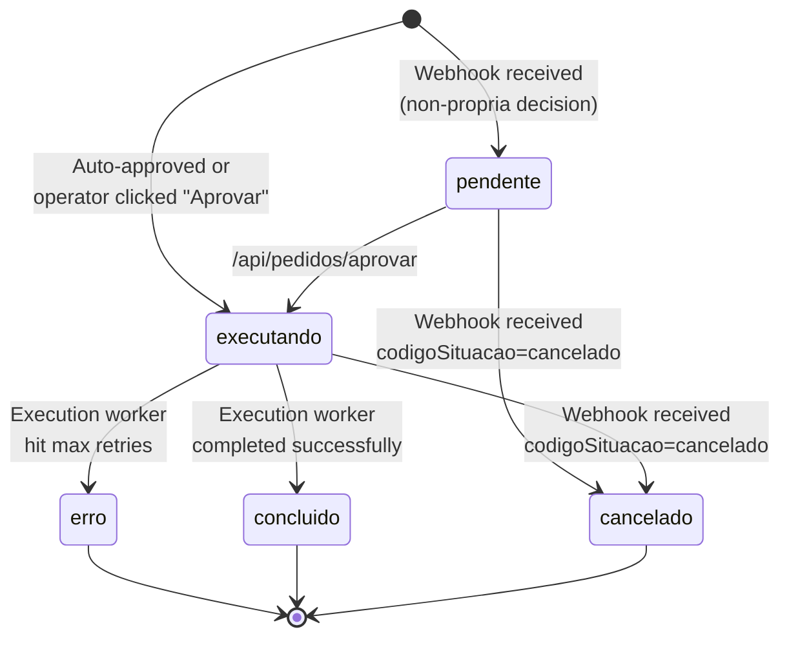
```mermaid
stateDiagram-v2
    [*] --> pendente: Webhook received<br/>(non-propria decision)
    [*] --> executando: Auto-approved or<br/>operator clicked "Aprovar"

    pendente --> executando: /api/pedidos/aprovar

    executando --> concluido: Execution worker<br/>completed successfully
    executando --> erro: Execution worker<br/>hit max retries

    pendente --> cancelado: Webhook received<br/>codigoSituacao=cancelado
    executando --> cancelado: Webhook received<br/>codigoSituacao=cancelado

    erro --> [*]
    concluido --> [*]
    cancelado --> [*]
```

### Separation Status (siso_pedidos.status_separacao)

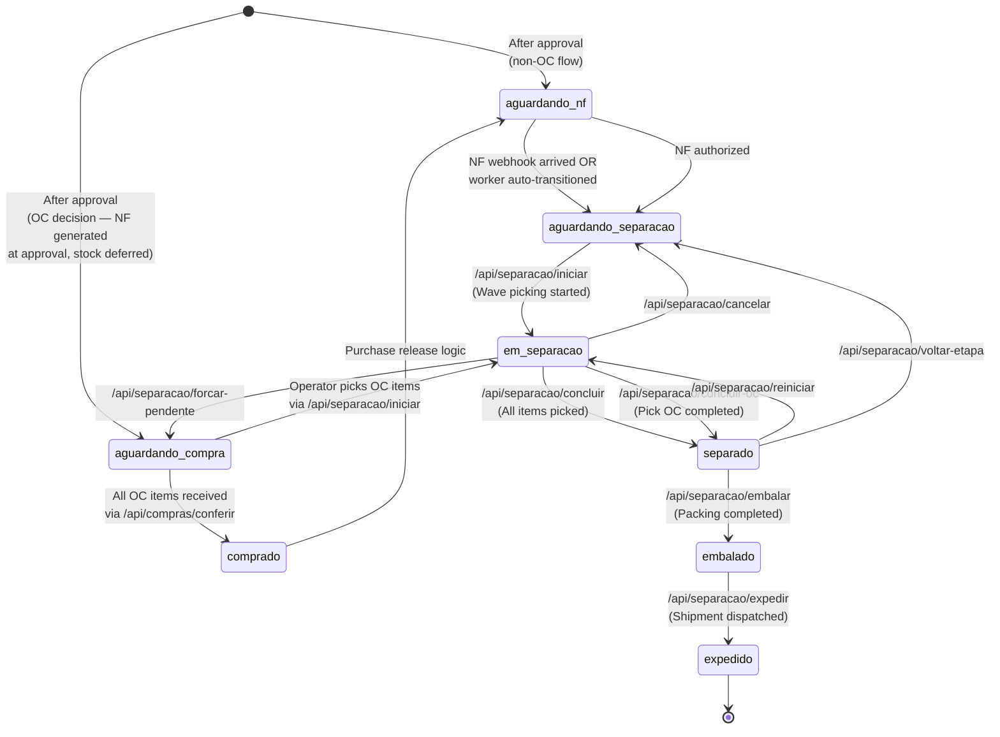
```mermaid
stateDiagram-v2
    [*] --> aguardando_nf: After approval<br/>(non-OC flow)
    [*] --> aguardando_compra: After approval<br/>(OC decision — NF generated<br/>at approval, stock deferred)

    aguardando_nf --> aguardando_separacao: NF webhook arrived OR<br/>worker auto-transitioned

    aguardando_compra --> comprado: All OC items received<br/>via /api/compras/conferir
    comprado --> aguardando_nf: Purchase release logic
    aguardando_compra --> em_separacao: Operator picks OC items<br/>via /api/separacao/iniciar
    aguardando_nf --> aguardando_separacao: NF authorized

    aguardando_separacao --> em_separacao: /api/separacao/iniciar<br/>(Wave picking started)
    em_separacao --> separado: /api/separacao/concluir<br/>(All items picked)
    em_separacao --> separado: /api/separacao/concluir-oc<br/>(Pick OC completed)

    separado --> embalado: /api/separacao/embalar<br/>(Packing completed)

    embalado --> expedido: /api/separacao/expedir<br/>(Shipment dispatched)

    em_separacao --> aguardando_separacao: /api/separacao/cancelar
    em_separacao --> aguardando_compra: /api/separacao/forcar-pendente
    separado --> em_separacao: /api/separacao/reiniciar
    separado --> aguardando_separacao: /api/separacao/voltar-etapa

    expedido --> [*]
```

### Status Transition Matrix

| Current Status | Trigger | Next Status | Handler |
|---|---|---|---|
| `pendente` | Operator clicks "Aprovar" | `executando` | `/api/pedidos/aprovar` |
| `executando` | Worker posts stock + NF + fase-1 agrupamento | `concluido` | `execution-worker.ts` |
| `executando` | Worker hits max retries | `erro` | `execution-worker.ts` |
| `pendente` / `executando` | Webhook tipo=cancelado | `cancelado` | `/api/webhook/tiny/route.ts` |
| `aguardando_nf` | NF webhook arrives | `aguardando_separacao` | `nf-webhook-handler.ts` (+ fase-1 agrupamento fire-and-forget) |
| `aguardando_nf` | Worker detects NF authorized | `aguardando_separacao` | `execution-worker.ts` (+ fase-1 agrupamento fire-and-forget) |
| `aguardando_compra` | All OC items received | `comprado` | `/api/compras/conferir` |
| `comprado` | Release logic runs | `aguardando_nf` | `compras-release.ts` |
| `aguardando_compra` | Operator picks OC items | `em_separacao` | `/api/separacao/iniciar` (pick OC mode) |
| `aguardando_separacao` | Operator clicks "Iniciar Separação" | `em_separacao` | `/api/separacao/iniciar` |
| `em_separacao` | Operator clicks "Concluir" (normal) | `separado` | `/api/separacao/concluir` |
| `em_separacao` | Operator clicks "Concluir OC" (pick OC) | `separado` + `executando` | `/api/separacao/concluir-oc` |
| `em_separacao` | Operator cancels | `aguardando_separacao` | `/api/separacao/cancelar` |
| `em_separacao` | Force back to pending | `aguardando_compra` | `/api/separacao/forcar-pendente` |
| `separado` | Operator clicks "Embalar" | `embalado` | `/api/separacao/embalar` |
| `embalado` | Operator clicks "Expedir" | `expedido` | `/api/separacao/expedir` |

---

## Separation Flow

Wave picking, packing, and label printing integration.

### Separation Module Overview

**Location:** `src/app/separacao/`

The separation module handles the post-approval workflow: picking (`em_separacao`) → packing (`embalado`) → shipment (`expedido`).

### Wave Picking Process

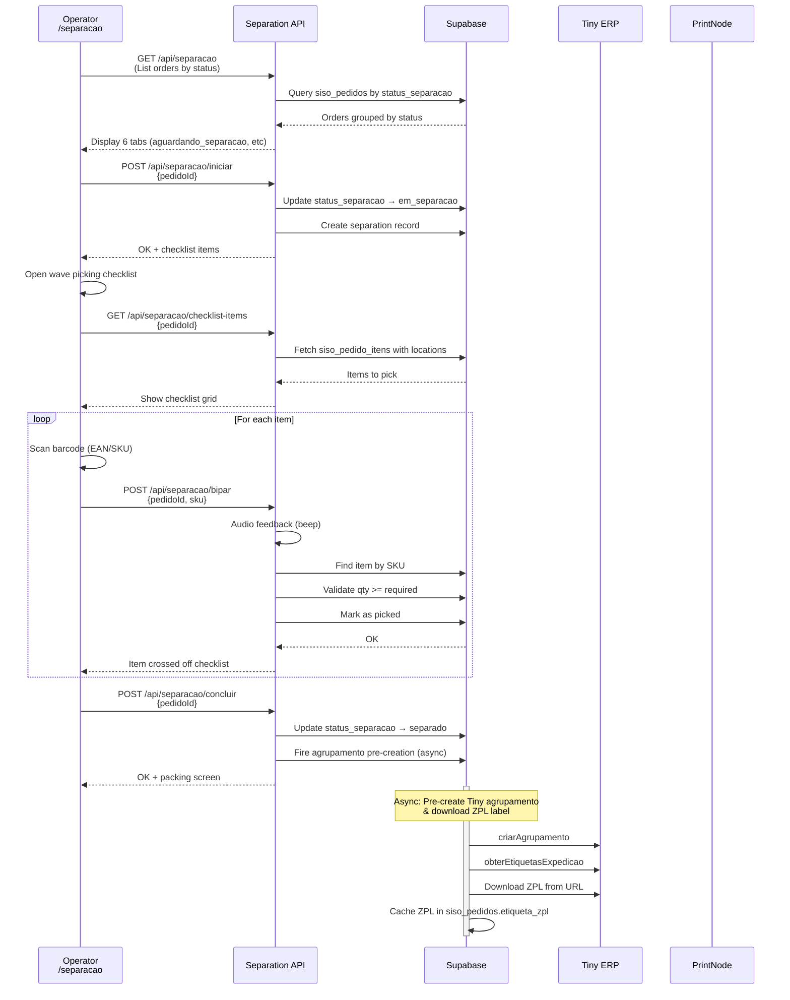
```mermaid
sequenceDiagram
    participant Op as Operator<br/>/separacao
    participant API as Separation API
    participant DB as Supabase
    participant Tiny as Tiny ERP
    participant PrintNode as PrintNode

    Op->>API: GET /api/separacao<br/>(List orders by status)
    API->>DB: Query siso_pedidos by status_separacao
    DB-->>API: Orders grouped by status
    API-->>Op: Display 6 tabs (aguardando_separacao, etc)

    Op->>API: POST /api/separacao/iniciar<br/>{pedidoId}
    API->>DB: Update status_separacao → em_separacao
    API->>DB: Create separation record
    API-->>Op: OK + checklist items

    Op->>Op: Open wave picking checklist
    Op->>API: GET /api/separacao/checklist-items<br/>{pedidoId}
    API->>DB: Fetch siso_pedido_itens with locations
    DB-->>API: Items to pick
    API-->>Op: Show checklist grid

    loop For each item
        Op->>Op: Scan barcode (EAN/SKU)
        Op->>API: POST /api/separacao/bipar<br/>{pedidoId, sku}
        API->>API: Audio feedback (beep)
        API->>DB: Find item by SKU
        API->>DB: Validate qty >= required
        API->>DB: Mark as picked
        DB-->>API: OK
        API-->>Op: Item crossed off checklist
    end

    Op->>API: POST /api/separacao/concluir<br/>{pedidoId}
    API->>DB: Update status_separacao → separado
    API->>DB: Fire agrupamento pre-creation (async)
    API-->>Op: OK + packing screen

    activate DB
    note over DB: Async: Pre-create Tiny agrupamento<br/>& download ZPL label
    DB->>Tiny: criarAgrupamento
    DB->>Tiny: obterEtiquetasExpedicao
    DB->>Tiny: Download ZPL from URL
    DB->>DB: Cache ZPL in siso_pedidos.etiqueta_zpl
    deactivate DB
```

### Packing & Label Printing

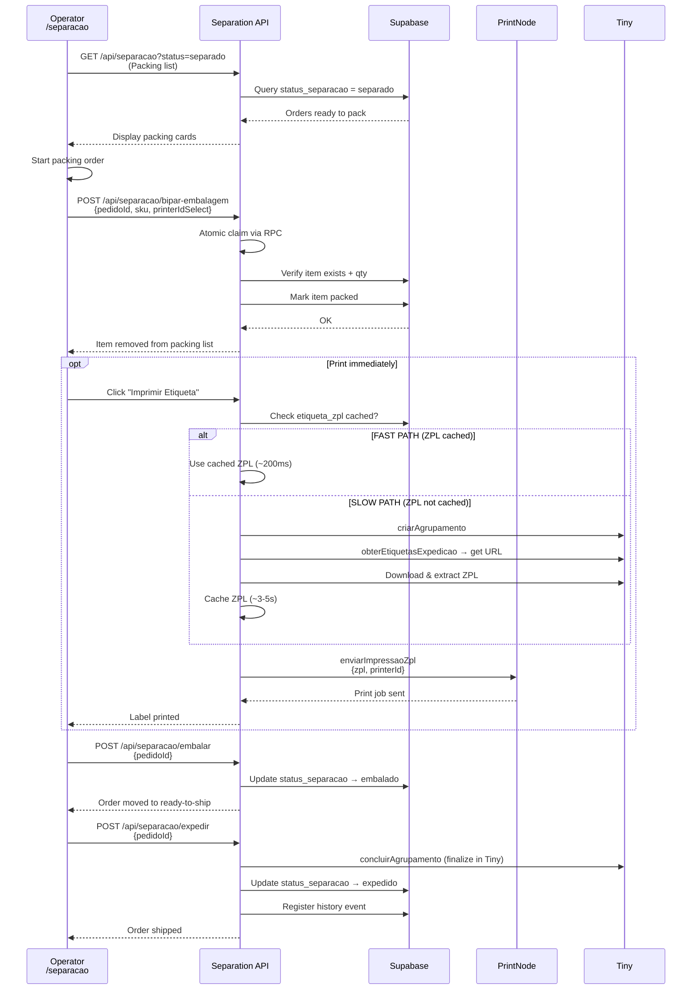
```mermaid
sequenceDiagram
    participant Op as Operator<br/>/separacao
    participant API as Separation API
    participant DB as Supabase
    participant PrintNode as PrintNode

    Op->>API: GET /api/separacao?status=separado<br/>(Packing list)
    API->>DB: Query status_separacao = separado
    DB-->>API: Orders ready to pack
    API-->>Op: Display packing cards

    Op->>Op: Start packing order
    Op->>API: POST /api/separacao/bipar-embalagem<br/>{pedidoId, sku, printerIdSelect}
    API->>API: Atomic claim via RPC
    API->>DB: Verify item exists + qty
    API->>DB: Mark item packed
    DB-->>API: OK
    API-->>Op: Item removed from packing list

    opt Print immediately
        Op->>API: Click "Imprimir Etiqueta"
        API->>DB: Check etiqueta_zpl cached?

        alt FAST PATH (ZPL cached)
            API->>API: Use cached ZPL (~200ms)
        else SLOW PATH (ZPL not cached)
            API->>Tiny: criarAgrupamento
            API->>Tiny: obterEtiquetasExpedicao → get URL
            API->>Tiny: Download & extract ZPL
            API->>API: Cache ZPL (~3-5s)
        end

        API->>PrintNode: enviarImpressaoZpl<br/>{zpl, printerId}
        PrintNode-->>API: Print job sent
        API-->>Op: Label printed
    end

    Op->>API: POST /api/separacao/embalar<br/>{pedidoId}
    API->>DB: Update status_separacao → embalado
    API-->>Op: Order moved to ready-to-ship

    Op->>API: POST /api/separacao/expedir<br/>{pedidoId}
    API->>Tiny: concluirAgrupamento (finalize in Tiny)
    API->>DB: Update status_separacao → expedido
    API->>DB: Register history event
    API-->>Op: Order shipped
```

### Barcode Scanning Flow

**Location:** `src/lib/session.ts` (rate limiting), `src/components/separacao/scan-input.tsx`

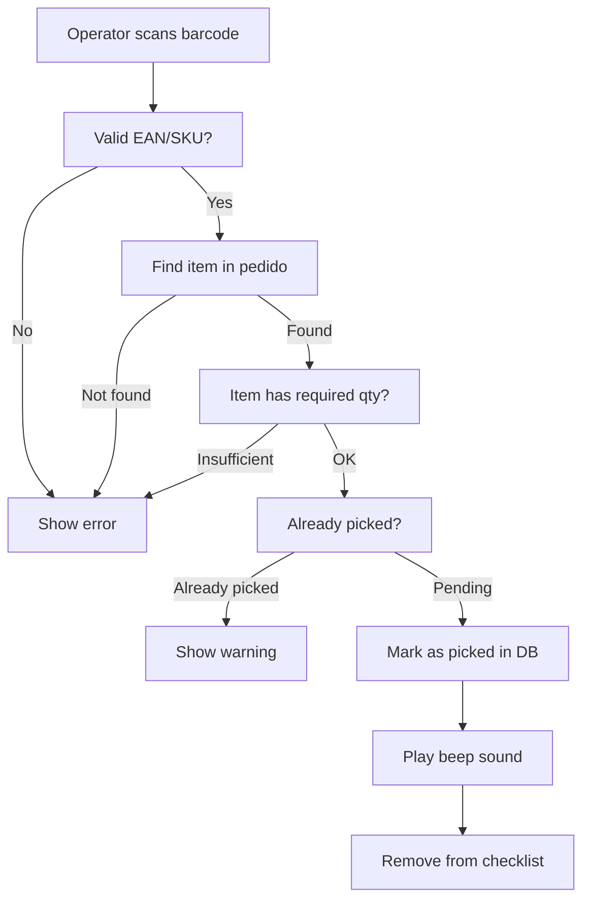
```mermaid
flowchart TD
    Scan["Operator scans barcode"]
    Validate["Valid EAN/SKU?"]
    Lookup["Find item in pedido"]
    CheckQty["Item has required qty?"]
    CheckMark["Already picked?"]

    UpdateDB["Mark as picked in DB"]
    Audio["Play beep sound"]
    UI["Remove from checklist"]

    Invalid["Show error"]
    AlreadyPicked["Show warning"]

    Scan --> Validate
    Validate -->|No| Invalid
    Validate -->|Yes| Lookup
    Lookup -->|Not found| Invalid
    Lookup -->|Found| CheckQty
    CheckQty -->|Insufficient| Invalid
    CheckQty -->|OK| CheckMark
    CheckMark -->|Already picked| AlreadyPicked
    CheckMark -->|Pending| UpdateDB

    UpdateDB --> Audio
    Audio --> UI
```

**Rate Limiting:**

- Max 2 scans/second per session (configured in `session.ts`)
- Prevents accidental double-scans
- Returned to frontend as `{ allowed: false, retryAfterMs: N }`

### Pick OC Flow (Purchase Order Early Picking)

**Location:** `src/app/api/separacao/iniciar/route.ts`, `/api/separacao/concluir-oc`

When items ordered via purchase order are physically available in the warehouse before formal purchase order completion, operators can separate them directly. This flow bypasses normal purchase order confirmation and automatically resolves compra items as received.

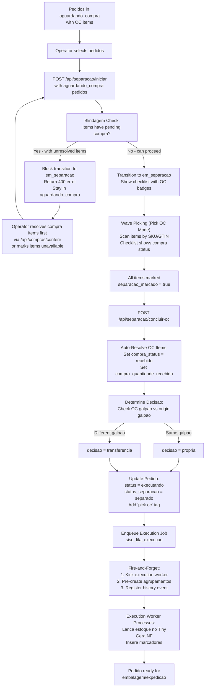
```mermaid
flowchart TD
    A["Pedidos in aguardando_compra<br/>with OC items"] --> B["Operator selects pedidos"]
    B --> C["POST /api/separacao/iniciar<br/>with aguardando_compra pedidos"]

    C --> D["Blindagem Check:<br/>Items have pending compra?"]
    D -->|Yes - with unresolved items| E["Block transition to em_separacao<br/>Return 400 error<br/>Stay in aguardando_compra"]
    D -->|No - can proceed| F["Transition to em_separacao<br/>Show checklist with OC badges"]

    E --> Z["Operator resolves compra items first<br/>via /api/compras/conferir<br/>or marks items unavailable"]
    Z --> C

    F --> G["Wave Picking (Pick OC Mode)<br/>Scan items by SKU/GTIN<br/>Checklist shows compra status"]

    G --> H["All items marked<br/>separacao_marcado = true"]
    H --> I["POST /api/separacao/concluir-oc"]

    I --> J["Auto-Resolve OC Items:<br/>Set compra_status = recebido<br/>Set compra_quantidade_recebida"]

    J --> K["Determine Decisao:<br/>Check OC galpao vs origin galpao"]
    K -->|Same galpao| L["decisao = propria"]
    K -->|Different galpao| M["decisao = transferencia"]

    L --> N["Update Pedido:<br/>status = executando<br/>status_separacao = separado<br/>Add 'pick oc' tag"]
    M --> N

    N --> O["Enqueue Execution Job<br/>siso_fila_execucao"]

    O --> P["Fire-and-Forget:<br/>1. Kick execution worker<br/>2. Pre-create agrupamentos<br/>3. Register history event"]

    P --> Q["Execution Worker Processes:<br/>Lanca estoque no Tiny<br/>Gera NF<br/>Insere marcadores"]

    Q --> R["Pedido ready for<br/>embalagem/expedicao"]
```

**Key Rules:**

- **Blindagem (Protection):** Orders with ANY pending compra items (`compra_status IN ('aguardando_compra', 'comprado')`) cannot transition to `em_separacao` during normal flow
- **Pick OC Bypass:** Even with pending compra items, operator can use `/api/separacao/iniciar` with `aguardando_compra` orders if they manually resolve them first
- **Auto-Resolution:** `/api/separacao/concluir-oc` automatically marks all OC items as `recebido` with full quantity
- **Decision Resolution:** Uses OC's `galpao_id` to determine if transfer is needed
- **Tag Assignment:** All pick OC completions get the `pick oc` tag for audit trail

---

## Purchase Order Flow

Management of purchase orders (OC) from decision through receiving.

### OC Creation & Tracking

**Location:** `src/lib/execution-worker.ts` (OC decision logic), `/api/compras/`

When an order has decision `oc`, the execution worker calculates which items need to be purchased and creates purchase order entries.

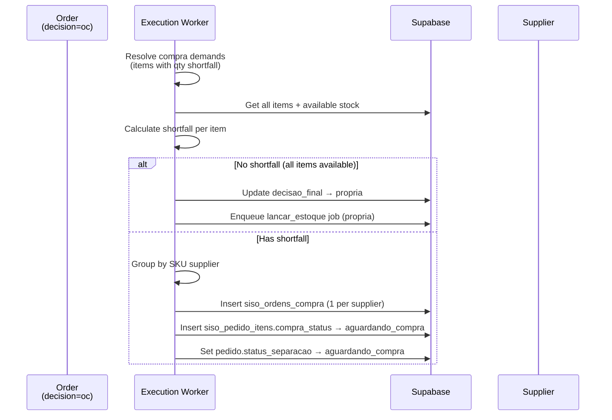
```mermaid
sequenceDiagram
    participant Order as Order<br/>(decision=oc)
    participant Worker as Execution Worker
    participant DB as Supabase
    participant Supplier as Supplier

    Worker->>Worker: Resolve compra demands<br/>(items with qty shortfall)
    Worker->>DB: Get all items + available stock
    Worker->>Worker: Calculate shortfall per item

    alt No shortfall (all items available)
        Worker->>DB: Update decisao_final → propria
        Worker->>DB: Enqueue lancar_estoque job (propria)
    else Has shortfall
        Worker->>Worker: Group by SKU supplier
        Worker->>DB: Insert siso_ordens_compra (1 per supplier)
        Worker->>DB: Insert siso_pedido_itens.compra_status → aguardando_compra
        Worker->>DB: Set pedido.status_separacao → aguardando_compra
    end
```

### Compras Module Interface

**Location:** `src/app/compras/page.tsx`, `/api/compras/`

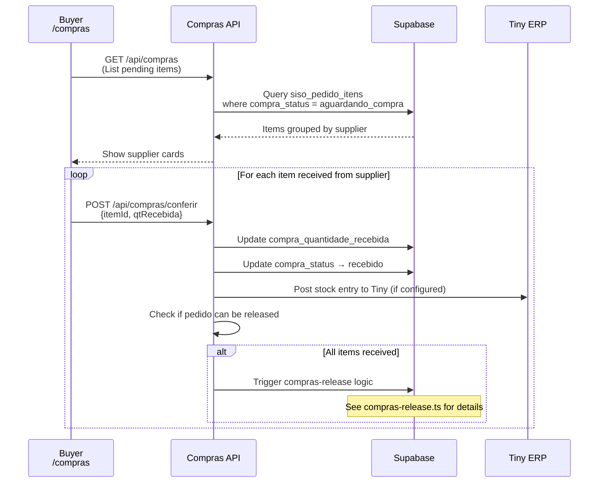
```mermaid
sequenceDiagram
    participant Comprador as Buyer<br/>/compras
    participant API as Compras API
    participant DB as Supabase
    participant Tiny as Tiny ERP

    Comprador->>API: GET /api/compras<br/>(List pending items)
    API->>DB: Query siso_pedido_itens<br/>where compra_status = aguardando_compra
    DB-->>API: Items grouped by supplier
    API-->>Comprador: Show supplier cards

    loop For each item received from supplier
        Comprador->>API: POST /api/compras/conferir<br/>{itemId, qtRecebida}
        API->>DB: Update compra_quantidade_recebida
        API->>DB: Update compra_status → recebido
        API->>Tiny: Post stock entry to Tiny (if configured)
        API->>API: Check if pedido can be released

        alt All items received
            API->>DB: Trigger compras-release logic
            note over DB: See compras-release.ts for details
        end
    end
```

### Purchase Release Logic

**Location:** `src/lib/compras-release.ts`

When all OC items for a pedido are received or cancelled, the pedido is released for picking.

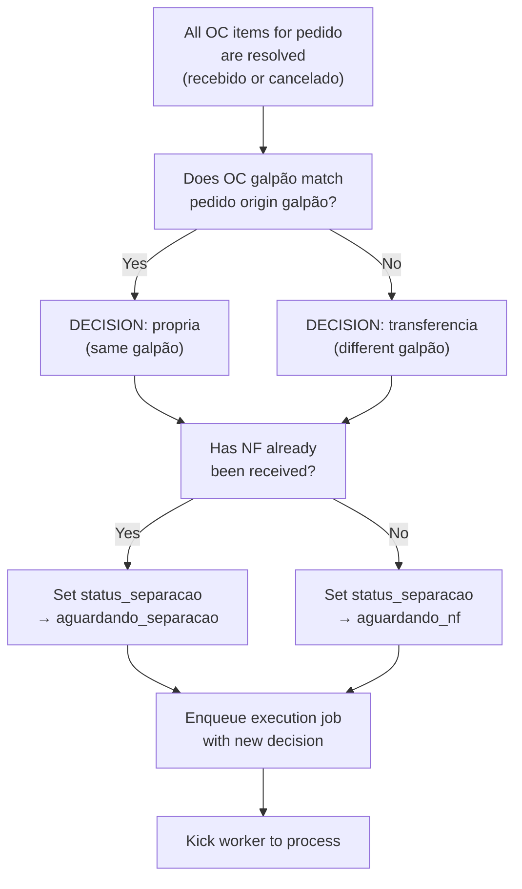
```mermaid
flowchart TD
    Start["All OC items for pedido<br/>are resolved<br/>(recebido or cancelado)"]

    CheckGalpao["Does OC galpão match<br/>pedido origin galpão?"]

    Same["DECISION: propria<br/>(same galpão)"]
    Diff["DECISION: transferencia<br/>(different galpão)"]

    CheckNF["Has NF already<br/>been received?"]

    NFYes["Set status_separacao<br/>→ aguardando_separacao"]
    NFNo["Set status_separacao<br/>→ aguardando_nf"]

    Enqueue["Enqueue execution job<br/>with new decision"]
    Kick["Kick worker to process"]

    Start --> CheckGalpao
    CheckGalpao -->|Yes| Same
    CheckGalpao -->|No| Diff
    Same --> CheckNF
    Diff --> CheckNF
    CheckNF -->|Yes| NFYes
    CheckNF -->|No| NFNo
    NFYes --> Enqueue
    NFNo --> Enqueue
    Enqueue --> Kick
```

**Key Rules:**

- Release only if at least one active item remains
- Use OC galpão, not pedido origin galpão, for execution routing
- If NF already arrived, skip directly to `aguardando_separacao`
- Enqueue new execution job with the calculated decision

---

## Pick OC Flow

Shortcut for operators to physically pick OC items before the formal purchase order cycle completes. The operator picks items from the shelf (they're physically available), and the system auto-resolves the compra bureaucracy in the background.

### When to Use

When an order is in `aguardando_compra` but the items are physically available in the warehouse (e.g., supplier delivered early, items were found during picking), the operator can skip the formal compra receiving flow and go straight to separation.

### Pick OC Process

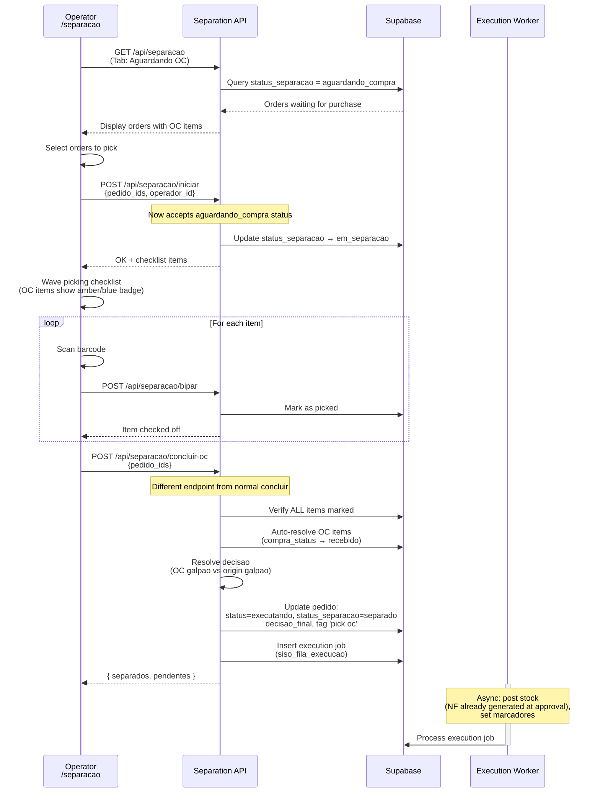
```mermaid
sequenceDiagram
    participant Op as Operator<br/>/separacao
    participant API as Separation API
    participant DB as Supabase
    participant Worker as Execution Worker

    Op->>API: GET /api/separacao<br/>(Tab: Aguardando OC)
    API->>DB: Query status_separacao = aguardando_compra
    DB-->>API: Orders waiting for purchase
    API-->>Op: Display orders with OC items

    Op->>Op: Select orders to pick
    Op->>API: POST /api/separacao/iniciar<br/>{pedido_ids, operador_id}
    Note over API: Now accepts aguardando_compra status
    API->>DB: Update status_separacao → em_separacao
    API-->>Op: OK + checklist items

    Op->>Op: Wave picking checklist<br/>(OC items show amber/blue badge)
    loop For each item
        Op->>Op: Scan barcode
        Op->>API: POST /api/separacao/bipar
        API->>DB: Mark as picked
        API-->>Op: Item checked off
    end

    Op->>API: POST /api/separacao/concluir-oc<br/>{pedido_ids}
    Note over API: Different endpoint from normal concluir

    API->>DB: Verify ALL items marked
    API->>DB: Auto-resolve OC items<br/>(compra_status → recebido)
    API->>API: Resolve decisao<br/>(OC galpao vs origin galpao)
    API->>DB: Update pedido:<br/>status=executando, status_separacao=separado<br/>decisao_final, tag 'pick oc'
    API->>DB: Insert execution job<br/>(siso_fila_execucao)
    API-->>Op: { separados, pendentes }

    activate Worker
    Note over Worker: Async: post stock<br/>(NF already generated at approval),<br/>set marcadores
    Worker->>DB: Process execution job
    deactivate Worker
```

> **With early agrupamento:** OC orders now have NF generated at approval time (via `executarMarcadoresOnly`). If NF persistence was complete, fase-1 agrupamento was also created. This means pick OC pedidos typically arrive at `concluir-oc` with agrupamento already existing, enabling the etiqueta fast path (~200ms) instead of the slow path (~3-5s).

### Key Differences from Normal Separation

| Aspect | Normal Flow | Pick OC Flow |
|---|---|---|
| Starting status | `aguardando_separacao` | `aguardando_compra` |
| Concluir endpoint | `POST /api/separacao/concluir` | `POST /api/separacao/concluir-oc` |
| Compra items | N/A (no OC items) | Auto-resolved as received |
| Decisao | Already set from approval | Resolved at concluir time (propria vs transferencia) |
| Execution job | Already enqueued | Created at concluir time |
| Tag | None | `pick oc` appended to `separacao_tags` |

### Decisao Resolution

The `concluir-oc` endpoint determines the final decision by comparing the OC galpão with the pedido's origin galpão:

1. **No OC linked or same galpão** → `propria` (items are in the origin warehouse)
2. **Different galpão** → `transferencia` (items came from another warehouse)

The execution worker then processes the job normally: posting stock to Tiny, generating NF, and setting marcadores.

---

## Inventory Flow

Stock adjustment sessions for physical inventory counts.

### Inventory Session Lifecycle

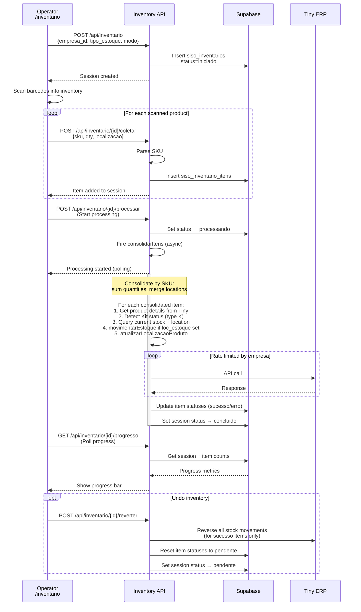
```mermaid
sequenceDiagram
    participant Op as Operator<br/>/inventario
    participant API as Inventory API
    participant DB as Supabase
    participant Tiny as Tiny ERP

    Op->>API: POST /api/inventario<br/>{empresa_id, tipo_estoque, modo}
    API->>DB: Insert siso_inventarios<br/>status=iniciado
    API-->>Op: Session created

    Op->>Op: Scan barcodes into inventory
    loop For each scanned product
        Op->>API: POST /api/inventario/{id}/coletar<br/>{sku, qty, localizacao}
        API->>API: Parse SKU
        API->>DB: Insert siso_inventario_itens
        API-->>Op: Item added to session
    end

    Op->>API: POST /api/inventario/{id}/processar<br/>(Start processing)
    API->>DB: Set status → processando
    API->>API: Fire consolidarItens (async)
    API-->>Op: Processing started (polling)

    activate API
    note over API: Consolidate by SKU:<br/>sum quantities, merge locations
    API->>API: For each consolidated item:<br/>1. Get product details from Tiny<br/>2. Detect Kit status (type K)<br/>3. Query current stock + location<br/>4. movimentarEstoque if loc_estoque set<br/>5. atualizarLocalizacaoProduto

    loop Rate limited by empresa
        API->>Tiny: API call
        Tiny-->>API: Response
    end

    API->>DB: Update item statuses (sucesso/erro)
    API->>DB: Set session status → concluido
    deactivate API

    Op->>API: GET /api/inventario/{id}/progresso<br/>(Poll progress)
    API->>DB: Get session + item counts
    DB-->>API: Progress metrics
    API-->>Op: Show progress bar

    opt Undo inventory
        Op->>API: POST /api/inventario/{id}/reverter
        API->>Tiny: Reverse all stock movements<br/>(for sucesso items only)
        API->>DB: Reset item statuses to pendente
        API->>DB: Set session status → pendente
    end
```

### Inventory Processor Details

**Location:** `src/lib/inventario-processor.ts`

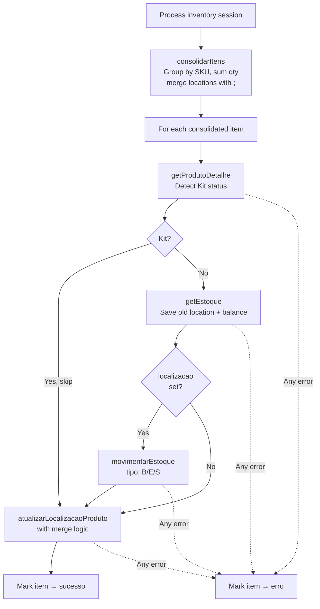
```mermaid
flowchart TD
    Start["Process inventory session"]

    Consolidate["consolidarItens<br/>Group by SKU, sum qty<br/>merge locations with ;"]

    ForEach["For each consolidated item"]

    GetDetail["getProdutoDetalhe<br/>Detect Kit status"]

    GetStock["getEstoque<br/>Save old location + balance"]

    IsKit{Kit?}
    IsLocSet{localizacao<br/>set?}

    Moviment["movimentarEstoque<br/>tipo: B/E/S"]

    UpdateLoc["atualizarLocalizacaoProduto<br/>with merge logic"]

    Success["Mark item → sucesso"]
    Error["Mark item → erro"]

    Start --> Consolidate
    Consolidate --> ForEach
    ForEach --> GetDetail
    GetDetail --> IsKit
    IsKit -->|Yes, skip| UpdateLoc
    IsKit -->|No| GetStock
    GetStock --> IsLocSet
    IsLocSet -->|Yes| Moviment
    IsLocSet -->|No| UpdateLoc
    Moviment --> UpdateLoc
    UpdateLoc --> Success

    GetDetail -.->|Any error| Error
    GetStock -.->|Any error| Error
    Moviment -.->|Any error| Error
    UpdateLoc -.->|Any error| Error
```

---

## Transfer Flow

Inter-warehouse stock transfers between empresas.

### Transfer Session Lifecycle

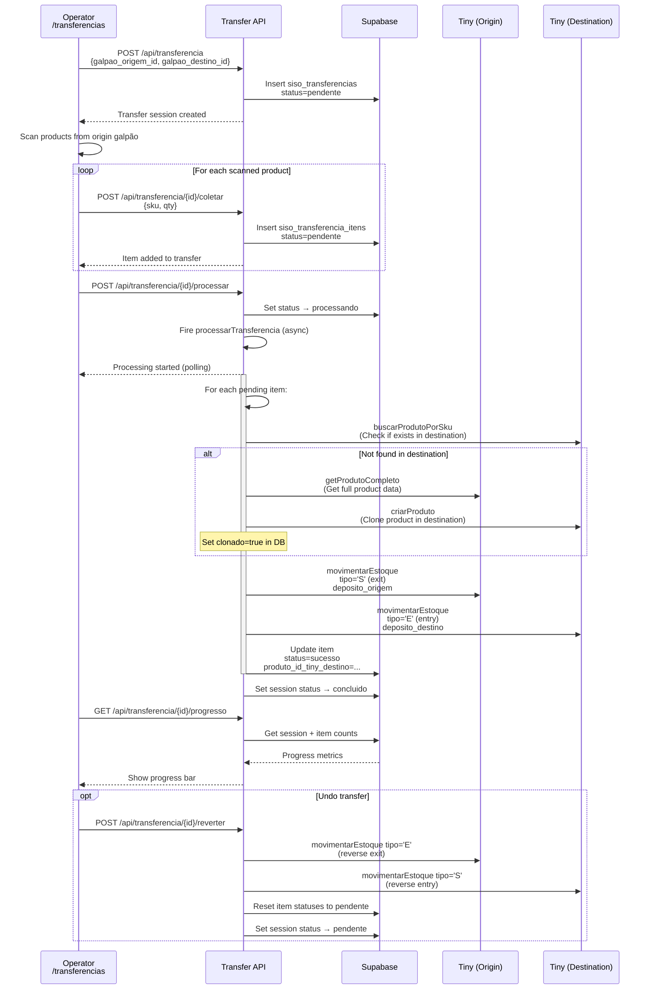
```mermaid
sequenceDiagram
    participant Op as Operator<br/>/transferencias
    participant API as Transfer API
    participant DB as Supabase
    participant TinyOrig as Tiny (Origin)
    participant TinyDest as Tiny (Destination)

    Op->>API: POST /api/transferencia<br/>{galpao_origem_id, galpao_destino_id}
    API->>DB: Insert siso_transferencias<br/>status=pendente
    API-->>Op: Transfer session created

    Op->>Op: Scan products from origin galpão
    loop For each scanned product
        Op->>API: POST /api/transferencia/{id}/coletar<br/>{sku, qty}
        API->>DB: Insert siso_transferencia_itens<br/>status=pendente
        API-->>Op: Item added to transfer
    end

    Op->>API: POST /api/transferencia/{id}/processar
    API->>DB: Set status → processando
    API->>API: Fire processarTransferencia (async)
    API-->>Op: Processing started (polling)

    activate API
    API->>API: For each pending item:

    API->>TinyDest: buscarProdutoPorSku<br/>(Check if exists in destination)

    alt Not found in destination
        API->>TinyOrig: getProdutoCompleto<br/>(Get full product data)
        API->>TinyDest: criarProduto<br/>(Clone product in destination)
        note over API: Set clonado=true in DB
    end

    API->>TinyOrig: movimentarEstoque<br/>tipo='S' (exit)<br/>deposito_origem
    API->>TinyDest: movimentarEstoque<br/>tipo='E' (entry)<br/>deposito_destino

    API->>DB: Update item<br/>status=sucesso<br/>produto_id_tiny_destino=...
    deactivate API

    API->>DB: Set session status → concluido

    Op->>API: GET /api/transferencia/{id}/progresso
    API->>DB: Get session + item counts
    DB-->>API: Progress metrics
    API-->>Op: Show progress bar

    opt Undo transfer
        Op->>API: POST /api/transferencia/{id}/reverter
        API->>TinyOrig: movimentarEstoque tipo='E'<br/>(reverse exit)
        API->>TinyDest: movimentarEstoque tipo='S'<br/>(reverse entry)
        API->>DB: Reset item statuses to pendente
        API->>DB: Set session status → pendente
    end
```

### Product Cloning

When a product doesn't exist in the destination empresa, it is automatically cloned:

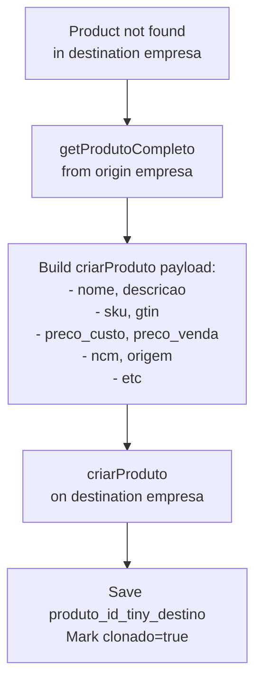
```mermaid
flowchart TD
    Start["Product not found<br/>in destination empresa"]

    GetFull["getProdutoCompleto<br/>from origin empresa"]

    Build["Build criarProduto payload:<br/>- nome, descricao<br/>- sku, gtin<br/>- preco_custo, preco_venda<br/>- ncm, origem<br/>- etc"]

    Create["criarProduto<br/>on destination empresa"]

    SaveId["Save produto_id_tiny_destino<br/>Mark clonado=true"]

    Start --> GetFull
    GetFull --> Build
    Build --> Create
    Create --> SaveId
```

---

## Authentication & Authorization

PIN-based authentication with role-based access control.

### Login Flow

**Location:** `src/app/login/page.tsx`, `/api/auth/login`

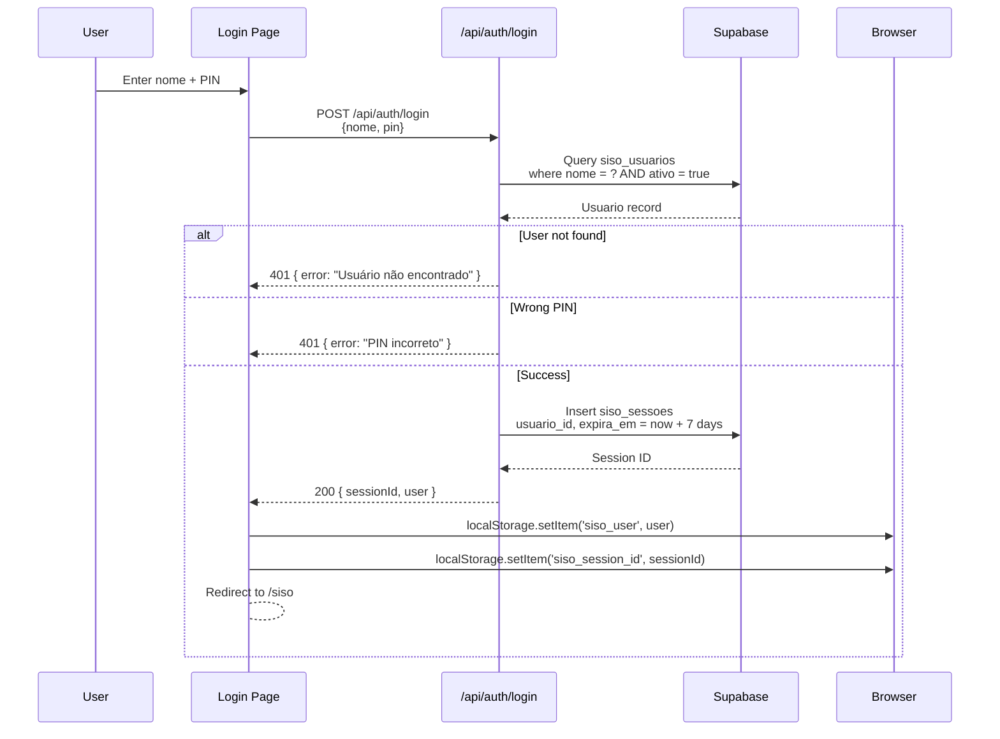
```mermaid
sequenceDiagram
    participant User as User
    participant Frontend as Login Page
    participant API as /api/auth/login
    participant DB as Supabase
    participant Client as Browser

    User->>Frontend: Enter nome + PIN
    Frontend->>API: POST /api/auth/login<br/>{nome, pin}

    API->>DB: Query siso_usuarios<br/>where nome = ? AND ativo = true
    DB-->>API: Usuario record

    alt User not found
        API-->>Frontend: 401 { error: "Usuário não encontrado" }
    else Wrong PIN
        API-->>Frontend: 401 { error: "PIN incorreto" }
    else Success
        API->>DB: Insert siso_sessoes<br/>usuario_id, expira_em = now + 7 days
        DB-->>API: Session ID
        API-->>Frontend: 200 { sessionId, user }
        Frontend->>Client: localStorage.setItem('siso_user', user)
        Frontend->>Client: localStorage.setItem('siso_session_id', sessionId)
        Frontend-->Frontend: Redirect to /siso
    end
```

### Session Management

**Location:** `src/lib/session.ts`, `src/lib/auth-context.tsx`

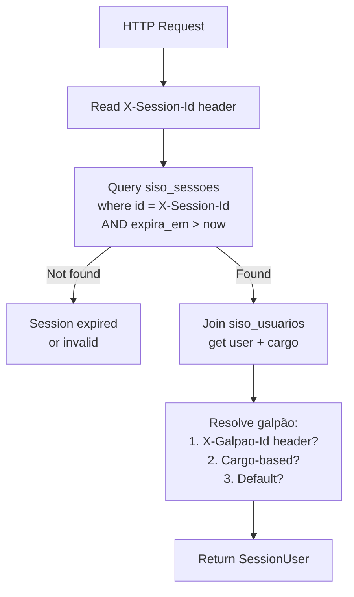
```mermaid
graph TD
    Request["HTTP Request"]

    Header["Read X-Session-Id header"]

    Lookup["Query siso_sessoes<br/>where id = X-Session-Id<br/>AND expira_em > now"]

    NotFound["Session expired<br/>or invalid"]

    Found["Join siso_usuarios<br/>get user + cargo"]

    ResolveGalpao["Resolve galpão:<br/>1. X-Galpao-Id header?<br/>2. Cargo-based?<br/>3. Default?"]

    Return["Return SessionUser"]

    Request --> Header
    Header --> Lookup
    Lookup -->|Not found| NotFound
    Lookup -->|Found| Found
    Found --> ResolveGalpao
    ResolveGalpao --> Return
```

### Role-Based Access Control

**User Roles (Cargo):**

| Role | Access | Use Case |
|------|--------|----------|
| `admin` | All pages + settings | System administration |
| `operador_cwb` | CWB orders only | Curitiba warehouse operator |
| `operador_sp` | SP orders only | São Paulo warehouse operator |
| `comprador` | Purchase orders only | Purchasing agent |

**Route Protection:** `src/components/app-shell.tsx`

```typescript
// Pseudo-code
const protectedRoutes: Record<string, string[]> = {
  "/admin/*": ["admin"],
  "/configuracoes": ["admin"],
  "/siso": ["admin", "operador_cwb", "operador_sp"],
  "/separacao": ["admin", "operador_cwb", "operador_sp"],
  "/compras": ["admin", "comprador"],
  "/inventario": ["admin", "operador_cwb", "operador_sp"],
  "/transferencias": ["admin", "operador_cwb", "operador_sp"],
};

if (!user.cargos.some(c => protectedRoutes[path].includes(c))) {
  redirect("/login");
}
```

**Galpão Filtering:**

- `operador_cwb` automatically sees CWB orders only
- `operador_sp` automatically sees SP orders only
- `admin` can view/filter by galpão via dropdown
- All queries filtered by user's allowed galpões

---

## Tiny ERP Integration

OAuth2-based integration with Tiny ERP API v3.

### OAuth2 Flow (Keycloak)

**Location:** `/api/tiny/oauth/route.ts`, `/api/tiny/oauth/callback/route.ts`

```mermaid
sequenceDiagram
    participant Admin as Admin
    participant SISO as SISO<br/>/configuracoes
    participant API as /api/tiny/oauth
    participant Keycloak as Keycloak<br/>(Tiny OAuth2)
    participant Tiny as Tiny ERP API

    Admin->>SISO: Click "Connect Tiny Account"
    SISO->>API: GET /api/tiny/oauth/route.ts?empresa_id=...

    API->>API: Generate state token
    API->>API: Build authorize URL:<br/>client_id, redirect_uri, scope=openid
    API-->>SISO: Redirect to Keycloak

    SISO->>Keycloak: User logs in with Tiny account
    Keycloak-->>API: Redirect with code + state
    API->>API: Validate state

    API->>Keycloak: Exchange code for tokens<br/>POST /token<br/>grant_type=authorization_code
    Keycloak-->>API: { access_token, refresh_token, expires_in }

    API->>DB: Save connection:<br/>empresa_id, access_token,<br/>refresh_token, token_expires_at
    API-->>SISO: 200 OK (connection saved)
    SISO-->>Admin: Success message
```

### Token Refresh Strategy

**Location:** `src/lib/tiny-oauth.ts` (getValidTokenByEmpresa)

```mermaid
flowchart TD
    GetToken["getValidTokenByEmpresa<br/>(empresaId)"]

    Lookup["Query siso_tiny_connections<br/>for this empresa"]

    NotFound["Throw: No connection found"]

    Found["Check if token expired<br/>(with 60s buffer)"]

    Valid["Token is valid"]
    Return["Return token"]

    Expired["Token expired"]

    Refresh["Call refreshAccessToken<br/>POST /token<br/>grant_type=refresh_token"]

    RefreshOK["Update siso_tiny_connections<br/>with new tokens"]

    RefreshFail["Throw: Refresh failed<br/>(user must re-authorize)"]

    GetToken --> Lookup
    Lookup -->|Not found| NotFound
    Lookup -->|Found| Found
    Found -->|Valid| Valid
    Found -->|Expired| Expired
    Valid --> Return
    Expired --> Refresh
    Refresh -->|Success| RefreshOK
    Refresh -->|Failure| RefreshFail
    RefreshOK --> Return
```

### Key API Calls

**Location:** `src/lib/tiny-api.ts`

| Endpoint | Purpose | Called By |
|----------|---------|-----------|
| `GET /pedidos/{id}` | Fetch order details | webhook-processor |
| `GET /estoque/{idProduto}` | Get product stock across all depositos | webhook-processor |
| `GET /produtos/{id}` | Get product details (tipo, gtin, imagem) | webhook-processor |
| `GET /produtos/{id}/componentes` | Get kit components | webhook-processor |
| `POST /pedidos/{id}/marcadores` | Add order markers/tags | execution-worker |
| `POST /notas-fiscais` | Generate invoice | execution-worker |
| `POST /notas-fiscais/{id}/lancamentos` | Post stock from invoice | execution-worker |
| `POST /estoque/movimentacoes` | Move stock (entry/exit) | execution-worker, inventario-processor, transferencia-processor |
| `POST /agrupamentos` | Create shipment grouping | agrupamento-service |
| `GET /agrupamentos/{id}/etiquetas` | Get shipping labels (ZPL URL) | agrupamento-service, etiqueta-service |
| `POST /agrupamentos/{id}/conclusao` | Finalize shipment in Tiny | separation concluder |

### Rate Limiting

**Location:** `src/lib/rate-limiter.ts`

- **Limit:** 55 calls/minute per empresa (5-call buffer under Tiny's 60 limit)
- **Tracking:** `siso_api_calls` table with call timestamps
- **Per-empresa:** Each Tiny account (empresa_id) has independent bucket
- **Used by:** webhook-processor, execution-worker, inventario-processor, transferencia-processor

```mermaid
flowchart TD
    BeforeCall["Before Tiny API call"]

    Check["Check rate limit<br/>for empresa"]

    Allowed["Remaining calls > 0?"]

    Yes["Proceed with call"]
    Register["Register call<br/>in siso_api_calls"]
    Call["Make Tiny API request"]

    No["Rate limited"]
    Wait["Wait (exponential backoff)"]
    Retry["Retry check"]

    BeforeCall --> Check
    Check --> Allowed
    Allowed -->|Yes| Yes
    Allowed -->|No| No
    Yes --> Register
    Register --> Call
    No --> Wait
    Wait --> Retry
    Retry --> Check
```

---

## Label Printing

PrintNode integration for ZPL shipping labels.

### Early Agrupamento (Fase 1)

**Location:** `src/lib/agrupamento-service.ts` (`criarAgrupamentoFase1`)

As soon as NF persistence is complete (`nota_fiscal_id` + `chave_acesso_nf` both persisted), fase-1 agrupamento is created via the shared `criarAgrupamentoFase1(pedidoId)` helper. This happens well before the pedido reaches `separado`, so the agrupamento (and therefore etiqueta) are ready early.

**Entrypoints that call `criarAgrupamentoFase1`:**

| Entrypoint | When | Pattern |
|---|---|---|
| `executarSaidaPropria` | After stock persisted | `await` (fire-and-forget — helper never throws) |
| `executarSaidaTransferencia` | After stock persisted | `await` (fire-and-forget) |
| `executarMarcadoresOnly` | After NF generated (before compra items) | `await` (fire-and-forget) |
| `nf-webhook-handler.ts` | After `nota_fiscal_id` + `chave_acesso_nf` saved | `.catch(() => {})` non-blocking |
| `webhook-processor.ts` (NF reconciliation) | After reconciling saved NF | `.catch(() => {})` non-blocking |
| `forcar-pendente/route.ts` (batch) | After verifying/persisting `chave_acesso_nf` | `.catch(() => {})` non-blocking |
| `[pedidoId]/forcar-pendente/route.ts` (single) | After verifying/persisting `chave_acesso_nf` | `.catch(() => {})` non-blocking |

**Helper semantics:**

1. Re-fetches pedido and verifies `nota_fiscal_id` + `chave_acesso_nf` both present
2. Checks idempotency: skips if `agrupamento_expedicao_id` is already valid
3. Recovers stale `pending` rows (>5 min) via `recuperarPendingTravados`
4. Atomic claim via `siso_claim_pedidos_para_agrupamento` RPC (sets `agrupamento_expedicao_id = 'pending'`)
5. Creates agrupamento in Tiny, attempts `concluirAgrupamento` (non-fatal), then `obterAgrupamento` to get `expedicao_id`
6. Saves `agrupamento_expedicao_id` and `expedicao_id` on success
7. Clears both fields on failure (leaves pedido eligible for retry)
8. Does NOT fetch etiqueta/ZPL — that is fase 2

**Failure isolation:** The helper never throws. Callers do not need try/catch. Agrupamento failure after stock posting never causes job retry.

### Agrupamento Fallback at Separado (Fase 2)

**Location:** `src/lib/agrupamento-service.ts` (`preCriarAgrupamentosEmLote`)

For pedidos that reach `separado` without agrupamento (old orders, failed fase-1, etc.), `preCriarAgrupamentosEmLote` remains the fallback. It only attempts creation when NF persistence is complete. It is called fire-and-forget alongside `recarregarEtiquetasFaltantes` (fast path for label recovery).

**Four orchestration points call both primitives:**

| Endpoint | Fallback (create) | Fast path (label) |
|---|---|---|
| `POST /api/separacao/concluir` | `preCriarAgrupamentosEmLote` | `recarregarEtiquetasFaltantes` |
| `POST /api/separacao/concluir-oc` | `preCriarAgrupamentosEmLote` | `recarregarEtiquetasFaltantes` |
| `POST /api/separacao/retry-etiqueta` | `preCriarAgrupamentosEmLote` | `recarregarEtiquetasFaltantes` |
| `compras-embalagem.ts` | `preCriarAgrupamentosEmLote` | `recarregarEtiquetasFaltantes` |

```mermaid
sequenceDiagram
    participant Sep as Separation<br/>Module
    participant Agrup as Agrupamento<br/>Service
    participant DB as Supabase
    participant Tiny as Tiny ERP

    Sep->>Agrup: preCriarAgrupamentosEmLote<br/>(fallback — async, fire-and-forget)
    Sep->>Agrup: recarregarEtiquetasFaltantes<br/>(fast path — async, fire-and-forget)
    Sep-->>Sep: Return immediately

    activate Agrup
    note over Agrup: FALLBACK: pedidos without agrupamento
    Agrup->>DB: Pre-filter: only pedidos with nota_fiscal_id + chave_acesso_nf
    Agrup->>DB: Atomic claim pedidos<br/>(set agrupamento_expedicao_id = 'pending')
    Agrup->>Agrup: Group by empresa

    loop For each empresa's pedidos
        Agrup->>Tiny: criarAgrupamento per pedido
        Agrup->>Tiny: obterEtiquetasExpedicao<br/>(get ZPL download URL)
        Agrup->>Agrup: baixarZpl<br/>(download + extract labels)
        Agrup->>DB: Cache ZPL in siso_pedidos.etiqueta_zpl<br/>Set agrupamento_expedicao_id = id
    end

    note over Agrup: FAST PATH: pedidos with agrupamento but missing ZPL
    Agrup->>DB: Find pedidos with agrupamento_expedicao_id but no etiqueta_zpl
    loop For each
        Agrup->>Tiny: obterEtiquetasExpedicao
        Agrup->>Agrup: baixarZpl
        Agrup->>DB: Cache ZPL
    end
    deactivate Agrup
```

### Label Printing Flow

**Location:** `src/lib/etiqueta-service.ts`

```mermaid
sequenceDiagram
    participant Op as Operator<br/>Packing screen
    participant API as Etiqueta API
    participant DB as Supabase
    participant Tiny as Tiny ERP
    participant Node as PrintNode

    Op->>API: POST /api/separacao/bipar-embalagem<br/>{pedidoId, sku, printerId}
    API->>DB: Mark item as packed<br/>(atomic claim)
    API-->>Op: Item marked

    Op->>API: POST /api/separacao/expedir?imprimir=true<br/>{pedidoId, printerId}

    API->>DB: Atomic claim etiqueta<br/>(via RPC siso_claim_etiqueta)

    alt Claim failed
        API-->>Op: { skipped: true }
        note over Op: Another concurrent call<br/>is already printing
    else Claim succeeded
        API->>DB: Check etiqueta_zpl cached?

        alt ZPL cached (FAST PATH)
            API->>API: Use cached ZPL
            note over API: ~200ms
        else ZPL not cached (SLOW PATH)
            API->>Tiny: criarAgrupamento
            API->>Tiny: obterEtiquetasExpedicao → URL
            API->>Tiny: Download ZPL from URL
            API->>DB: Cache for future reprints
            note over API: ~3-5s
        end

        API->>Node: enviarImpressaoZpl<br/>{zpl, printerId}
        Node-->>API: Print job queued
        API->>DB: Set etiqueta_status = 'impresso'
        API-->>Op: { success: true }
    end
```

### Fast Path vs Slow Path

**Fast Path (Normal case, ~200ms):**
1. ZPL label pre-cached — either by early fase-1 agrupamento (at approval/NF time) or by fase-2 fallback at separado
2. Just call PrintNode with cached ZPL
3. Minimal latency

**Slow Path (Fallback, ~3-5s):**
1. ZPL not cached (agrupamento not yet created, fase-1 failed, old pedido, etc)
2. Create agrupamento in Tiny
3. Fetch label URL
4. Download ZPL from Tiny
5. Extract individual labels from ZIP
6. Call PrintNode
7. Cache for future reprints

> **With early agrupamento:** Most pedidos arrive at `separado` with agrupamento already created (via fase-1 at approval or second-chance entrypoints). The fast path is the expected case. The slow path remains as safety net for edge cases and old pedidos.

---

## Error Handling & Observability

Comprehensive logging and error tracking system.

### Logging Architecture

**Location:** `src/lib/logger.ts`

Three-tier logging system:

1. **Console (stdout):** Structured JSON for log aggregation (Easypanel)
2. **siso_logs table:** Application logs (info/warn/error)
3. **siso_erros table:** Rich error tracking with diagnostics

```mermaid
flowchart TD
    Code["Application code<br/>logger.info() or logger.logError()"]

    Console["Write structured JSON<br/>to stdout"]

    ConsoleConsume["Log aggregator<br/>(Easypanel)"]

    Logs["Insert into siso_logs<br/>(fire-and-forget)"]

    Error["Is it an error?<br/>logger.logError()?"]

    Erros["Insert into siso_erros<br/>with rich diagnostics<br/>(stack trace, category,<br/>correlation ID, etc)"]

    Monitor["Monitoring Dashboard<br/>queries siso_erros"]

    Code --> Console
    Code --> Error
    Console --> ConsoleConsume
    Error -->|No| Logs
    Error -->|Yes| Erros
    Erros --> Monitor
```

### Error Categories

Error classification for systematic tracking:

| Category | Examples |
|----------|----------|
| `validation` | Invalid input, missing fields, type mismatch |
| `database` | Supabase query errors, constraint violations |
| `external_api` | Tiny ERP API failures, PrintNode failures |
| `auth` | OAuth2 failures, token expiration, invalid credentials |
| `config` | Missing configuration, invalid settings |
| `business_logic` | Decision logic errors, workflow violations |
| `infrastructure` | Rate limiting, timeout, connectivity |
| `unknown` | Uncategorized errors |

### Correlation IDs

**Generated at webhook entry** (`generateCorrelationId()`) and automatically attached to all subsequent log entries in the same request chain.

```mermaid
flowchart TD
    Webhook["Webhook arrives<br/>POST /api/webhook/tiny"]

    GenId["Generate correlation ID<br/>format: timestamp-random"]

    Processor["Enqueue processWebhook async<br/>include correlationId"]

    Worker["Execution worker processes<br/>job references same correlationId"]

    Logs["All logs from this chain<br/>tagged with same ID"]

    Search["Search logs by correlation ID<br/>to trace entire request lifecycle"]

    Webhook --> GenId
    GenId --> Processor
    Processor --> Worker
    Worker --> Logs
    Logs --> Search
```

### Monitoring Dashboard

**Location:** `/api/monitoring`, `/monitoramento`

Queries `siso_erros` table to display:

- Error rate by category
- Top errors (most frequent)
- Recent critical errors
- Error trends over time
- Orders in error status

### Encaminhar Reroute Contract

**Location:** `src/app/api/separacao/encaminhar/route.ts`

When a pedido is rerouted to another galpao, the encaminhar flow explicitly separates NF preservation from shipping artifact clearing:

- **Preserved (NF fields):** `nota_fiscal_id`, `chave_acesso_nf`, `url_danfe` — these are omitted from the update payload, keeping them intact. The re-approved pedido will go through the full worker flow again, which detects the existing NF via `gerarNotaFiscalPedido` idempotency
- **Cleared (shipping artifacts):** `agrupamento_expedicao_id`, `expedicao_id`, `etiqueta_url`, `etiqueta_zpl`, `etiqueta_status` — explicitly set to null. The worker will create a new agrupamento via `criarAgrupamentoFase1` after NF enrichment

This contract is critical for early agrupamento safety: NF remains valid across reroute, but the agrupamento must be recreated for the new galpao's shipping context.

---

## Validation Matrix (Early Agrupamento)

Minimum executable validation matrix for the early agrupamento behavior:

| Scenario | Expected Behavior |
|---|---|
| **Propria approval** | Worker: marcadores → NF → stock → `criarAgrupamentoFase1`. Agrupamento created if NF persistence complete. Stock unchanged |
| **Transferencia approval** | Worker: marcadores → NF → stock → `criarAgrupamentoFase1`. Agrupamento created if NF persistence complete. Stock unchanged |
| **OC approval** | Worker: marcadores → NF (no stock) → `criarAgrupamentoFase1` → compra item resolution. NF creates Tiny reservation. Stock deferred to Ciclo 2 |
| **OC with NF pending SEFAZ** | NF generated but `chave_acesso_nf` not yet available. Worker proceeds to compra items. Agrupamento created later via second-chance entrypoint (NF webhook or forcar-pendente) |
| **OC with NF generation failure** | NF fails, compra flow proceeds normally. NF + agrupamento created in Ciclo 2 when worker re-enqueues |
| **Ciclo 2 worker (after compras-release)** | Worker detects existing NF via `gerarNotaFiscalPedido` idempotency, skips NF generation, proceeds to stock deduction. Agrupamento likely already exists |
| **Helper failure after stock posting** | `criarAgrupamentoFase1` is fire-and-forget. Job does NOT retry. Pedido left eligible for fase-2 fallback at separado |
| **Stale pending recovery** | `recuperarPendingTravados` unsticks rows with `agrupamento_expedicao_id = 'pending'` for >5 min. Available to all fase-1 entrypoints and fase-2 fallback |
| **Late NF via webhook** | `nf-webhook-handler.ts` calls `criarAgrupamentoFase1` after persisting `nota_fiscal_id` + `chave_acesso_nf`. Non-blocking (`.catch(() => {})`) |
| **Late NF via forcar-pendente** | Both batch and single forcar-pendente routes call `criarAgrupamentoFase1` after verifying/persisting `chave_acesso_nf`. Non-blocking |
| **Old pedido with agrupamento but no etiqueta** | `recarregarEtiquetasFaltantes` (fast path) fetches ZPL without recreating agrupamento |
| **Old pedido without agrupamento** | `preCriarAgrupamentosEmLote` (fallback) creates agrupamento + ZPL at separado time |
| **Rerouted pedido after early agrupamento** | NF preserved, shipping artifacts (agrupamento, etiqueta) cleared. Worker recreates agrupamento on re-approval |

---

## Real-time Features

WebSocket-based real-time updates using Supabase Realtime.

### Separation Updates

**Location:** `src/hooks/use-realtime-separacao.ts`

Separation module subscribes to real-time changes on pedidos in `separado` or `embalado` status.

```mermaid
sequenceDiagram
    participant Sep as Separation<br/>Module
    participant React as React Component
    participant Realtime as Supabase Realtime
    participant DB as Supabase

    Sep->>React: Mount /separacao page
    React->>Realtime: supabase.channel('separacao')<br/>.on('*', callback)
    React->>Realtime: subscribe()

    alt Order status updated
        DB->>Realtime: REPLICATION: siso_pedidos UPDATE
        Realtime->>React: Broadcast to subscribed clients
        React->>React: Update local state
        React->>Sep: Re-render checklist/packing cards
    end

    alt Item marked as picked
        DB->>Realtime: REPLICATION: siso_pedido_itens UPDATE
        Realtime->>React: Broadcast update
        React->>Sep: Cross off item in checklist
    end
```

### Polling (Fallback)

Dashboard at `/siso` uses polling (no real-time) to check order counts:

- **Interval:** 30 seconds
- **Endpoint:** `GET /api/dashboard/counts`
- **Response:** Counts by status (pendente, concluido, auto-approved, etc)

---

## Data Model Reference

### Core Tables

#### siso_pedidos

```sql
id                      text primary key
numero                  text unique               -- Tiny order number
empresa_origem_id       uuid fk → siso_empresas
galpao_origem_id        uuid fk → siso_galpoes
grupo_id                uuid fk → siso_grupos

-- Decision logic
decisao_sugerida        text                      -- propria | transferencia | oc
decisao_final           text                      -- set after approval
score_propria           int                       -- Coverage % for propria decision

-- Status tracking
status                  text                      -- pendente | executando | concluido | cancelado | erro
status_separacao        text                      -- aguardando_nf | aguardando_separacao | em_separacao | separado | embalado | expedido | aguardando_compra | comprado
processado_em           timestamptz

-- NF & invoicing
nota_fiscal_id          bigint fk → Tiny NF ID
url_danfe               text
chave_acesso_nf         text
estoque_lancado         boolean                   -- true when stock posted to Tiny

-- Shipment
agrupamento_expedicao_id uuid                    -- Tiny agrupamento ID (can be 'pending')
etiqueta_zpl            text                      -- Cached ZPL label
etiqueta_url            text
etiqueta_status         text                      -- pendente | impresso | falhou

-- User-created tags (separate from Tiny marcadores)
separacao_tags          text[]
observacoes             text

-- Routing for OC flows
separacao_galpao_id     uuid fk → siso_galpoes   -- OC receiving galpão
```

#### siso_pedido_itens

```sql
id                      uuid primary key
pedido_id               text fk → siso_pedidos
produto_id              int                       -- Tiny product ID
sku                     text
descricao               text
quantidade_pedida       int

-- Legacy columns (deprecated, still written for backwards compat)
estoque_cwb_saldo       int
estoque_cwb_disponivel  int
estoque_sp_saldo        int
estoque_sp_disponivel   int
localizacao_cwb         text
localizacao_sp          text

-- Compras (purchase order flow)
compra_status           text                      -- aguardando_compra | recebido | cancelado
compra_quantidade_solicitada int
compra_quantidade_recebida int
compra_solicitada_em    timestamptz
ordem_compra_id         uuid fk → siso_ordens_compra

-- Separation
estoque_saida_lancada   boolean                   -- true when stock exit posted (transferencia only)
empresa_deducao_id      uuid fk → siso_empresas   -- which empresa stock was deducted from

-- Picked items tracking
separacao_data_inicio   timestamptz
separacao_hora_conclusao timestamptz
separacao_picked        boolean
```

#### siso_pedido_item_estoques

Normalized stock per empresa (one row per item per empresa):

```sql
pedido_id               text fk → siso_pedidos
produto_id              int
empresa_id              uuid fk → siso_empresas
deposito_id             int                       -- Tiny deposit ID
deposito_nome           text
saldo                   int                       -- Total balance
reservado               int                       -- Reserved qty
disponivel              int                       -- saldo - reservado
localizacao             text
produto_id_na_empresa   int                       -- Product ID in this empresa (for transfers)
```

#### siso_fila_execucao

```sql
id                      uuid primary key
pedido_id               text fk → siso_pedidos
tipo                    text                      -- lancar_estoque (only type for now)
empresa_id              uuid fk → siso_empresas   -- which empresa to execute as
decisao                 text                      -- propria | transferencia | oc

-- Job state
status                  text                      -- pendente | executando | concluido | erro | cancelado
tentativas              int default 0
max_tentativas          int default 3
erro                    text

-- Timing
criado_em               timestamptz default now()
atualizado_em           timestamptz
executado_em            timestamptz
proximo_retry_em        timestamptz

-- Priority for job ordering
prioridade              int default 0
```

#### siso_webhook_logs

```sql
id                      uuid primary key
tiny_pedido_id          text                      -- Order or NF ID from Tiny
cnpj                    text
tipo                    text                      -- atualizacao_pedido | inclusao_pedido | nota_fiscal
codigo_situacao         text                      -- aprovado | cancelado | etc
filial                  text                      -- Legacy, use empresa_id instead
empresa_id              uuid fk → siso_empresas
payload                 jsonb                     -- Full webhook payload
status                  text                      -- pendente | processando | concluido | ignorado | aguardando_pedido | erro

-- Deduplication: unique constraint on dedup_key (generated column)
dedup_key               text generated            -- tiny_pedido_id || ':' || tipo || ':' || codigo_situacao
processado_em           timestamptz
erro                    text

unique (dedup_key)
```

---

## Deployment & Monitoring

### Environment Setup

Required environment variables:

```bash
NEXT_PUBLIC_SUPABASE_URL=https://wrbrbhuhsaaupqsimkqz.supabase.co
NEXT_PUBLIC_SUPABASE_ANON_KEY=<anon-key>
SUPABASE_SERVICE_ROLE_KEY=<service-role-key>
WORKER_SECRET=<secret-for-POST-/api/worker/processar>
```

Tiny ERP OAuth2 credentials are stored in `siso_tiny_connections` table, not env vars.
PrintNode API key is stored in `siso_configuracoes` KV store, not env vars.

### Build & Start

```bash
npm run dev       # Development (turbopack)
npm run build     # Production build
npm run start     # Start production server
npm run lint      # ESLint check
```

### Execution Worker Trigger

The execution worker is triggered via:

1. **Auto-trigger:** `kickWorker()` called after each webhook processed or OC items received
2. **Manual trigger:** `POST /api/worker/processar` (requires `WORKER_SECRET`)
3. **Scheduled:** (Optional) cron job calling manual trigger every N minutes

### Execution Worker Stock Posting (per decisao)

**Propria:** Origin empresa has stock, ships directly.
1. Insert marcadores on Tiny order
2. Generate NF on origin empresa
3. `lancarEstoqueNota` on origin → clears Tiny reservation, deducts saldo

**Transferencia:** Another empresa ships on behalf of origin.
1. Insert marcadores on Tiny order (origin)
2. Generate NF on origin empresa
3. `lancarEstoqueNota` on origin → clears Tiny reservation, deducts saldo on origin
4. Per item: `movimentarEstoque(E)` on origin → compensates saldo (net zero on origin)
5. Per item: `movimentarEstoque(S)` on support empresa → physical stock exit

The reservation clearing (steps 3-4) ensures Tiny's `reservado` field doesn't accumulate ghost reservations from orders fulfilled by other empresas. Without this, `disponivel` (saldo - reservado) would drift lower over time.

**OC:** No stock available, purchase needed.
1. Insert marcadores on Tiny order
2. Calculate shortfall per item, create purchase orders (`siso_ordens_compra`)
3. No NF or stock posting — waits for compras module to receive items
4. After all items received → `compras-release.ts` re-evaluates as propria or transferencia

---

## File Reference Guide

### Core Processing

| File | Purpose |
|------|---------|
| `src/app/api/webhook/tiny/route.ts` | Webhook receiver, entry point |
| `src/lib/webhook-processor.ts` | Multi-empresa stock enrichment, decision calculation |
| `src/lib/nf-webhook-handler.ts` | Invoice webhook handling, status transitions |
| `src/lib/execution-worker.ts` | Stock posting, NF generation, transfer logic |
| `src/lib/compras-release.ts` | OC release logic when all items received |

### Support Libraries

| File | Purpose |
|------|---------|
| `src/lib/empresa-lookup.ts` | CNPJ → Empresa resolution (cached) |
| `src/lib/grupo-resolver.ts` | Grupo membership, deduction order, stock aggregation |
| `src/lib/tiny-api.ts` | Tiny ERP API v3 client |
| `src/lib/tiny-oauth.ts` | OAuth2 token management + auto-refresh |
| `src/lib/tiny-queue.ts` | Rate limiting wrapper for Tiny calls |
| `src/lib/rate-limiter.ts` | API call budget tracking per empresa |

### Label Printing

| File | Purpose |
|------|---------|
| `src/lib/agrupamento-service.ts` | Pre-create agrupamentos, cache ZPL |
| `src/lib/etiqueta-service.ts` | Print labels (fast/slow paths) |
| `src/lib/etiqueta-download.ts` | Download + extract ZPL from Tiny |
| `src/lib/printnode.ts` | PrintNode API client |
| `src/lib/zpl-endereco.ts` | Address label ZPL generation |

### Inventory & Transfer

| File | Purpose |
|------|---------|
| `src/lib/inventario-processor.ts` | Inventory consolidation + Tiny sync |
| `src/lib/transferencia-processor.ts` | Inter-warehouse transfers + product cloning |

### Auth & Infrastructure

| File | Purpose |
|------|---------|
| `src/lib/auth-context.tsx` | Client-side auth provider |
| `src/lib/session.ts` | Server-side session validation |
| `src/lib/logger.ts` | Structured logging (stdout + DB) |
| `src/lib/supabase-server.ts` | Service-role Supabase client |
| `src/lib/supabase.ts` | Browser Supabase client |

---

## Notes on Design Patterns

### Fire-and-Forget

Many operations return 200 immediately, then process async:

- Webhook receiver returns 200, then calls `processWebhook()` async
- Agrupamento pre-creation fires when separation completes
- Webhook logs use async inserts

All errors are logged (never thrown), so request/response is never blocked.

### Idempotency

Critical operations use database uniqueness constraints or conditional updates:

- Webhook dedup via `siso_webhook_logs.dedup_key`
- Etiqueta printing via atomic `UPDATE ... WHERE etiqueta_status IS NULL`
- Agrupamento pre-creation via atomic `siso_claim_pedidos_para_agrupamento` RPC
- Stock posting checks `estoque_lancado` flag

Safe to retry without duplicating side effects.

### Rate Limiting

All Tiny ERP calls go through `runWithEmpresa()` which enforces per-empresa rate limiting. System can sustain ~500 orders/day across 2 empresas without hitting Tiny's 60 req/min limit.

### Multi-Step Transactions

Complex flows (propria/transferencia/oc) are split into atomic steps with intermediate persistence:

1. Fetch order + enrich stock (webhook)
2. Calculate decision + save (webhook)
3. Create execution job + enqueue (webhook)
4. Execute job → post stock → update status (worker)

If any step fails, system can resume from last checkpoint.

---

## Key Insights

### Decision Transparency

Stock coverage is fully calculated and saved in `siso_pedidos` for audit trail:

```sql
decisao_sugerida: "propria"  -- What SISO calculated
decisao_final: "transferencia"  -- What operator chose (may differ)
score_propria: 100  -- Origin galpão coverage %
```

### Stock Enrichment at Webhook Time

Stock snapshots are captured and saved in `siso_pedido_item_estoques` at the moment the order is received. This prevents stale stock data from affecting decisions later.

### Tier-Based Deduction Order

`getOrdemDeducao()` returns empresas in priority order:

1. Origin empresa (tier 1 override)
2. Same galpão, by tier
3. Other galpões, by tier

This ensures deterministic, reproducible deduction sequencing for transfers.

### NF Reconciliation

Both webhooks and worker handle NF authorization race conditions:

- If NF arrives before worker generates it → webhook saves data + transitions status
- If NF arrives after worker generates it → worker detects authorization + transitions
- If NF is delayed → worker waits in `aguardando_nf` status until webhook arrives

No manual intervention needed for race conditions.

---

## Testing Considerations

### Webhook Testing

Use `POST /api/webhook/reprocessar` to manually retry webhooks (useful for development):

```json
{
  "pedidoIds": ["12345"],
  "tipo": "atualizacao_pedido"
}
```

### Mock Data

Development mode includes mock order data in `src/data/mock.ts` for UI testing without webhook traffic.

### Database Snapshots

Supabase has built-in snapshots. For testing, create a snapshot before testing destructive operations (inventory/transfer processing).

---

## Future Enhancements

### Currently Unimplemented

1. **Real-time Notifications:** Dashboard currently polls every 30s. Could use Realtime subscriptions for instant updates.
2. **Cleanup Deprecated Columns:** Remove `estoque_cwb_*` / `estoque_sp_*` from `siso_pedido_itens` after backfill complete.
3. **Remove Legacy Code:** `cnpj-filial.ts` and old OAuth2 patterns can be removed after full migration to new empresa model.

### Potential Improvements

1. **Batch Label Printing:** Print multiple labels in one PrintNode job
2. **Tiny Stock Sync:** Periodic reconciliation to catch missed stock updates
3. **Mobile App:** Native app for warehouse operators (barcode scanning)
4. **Predictive Inventory:** ML model to suggest optimal stock levels
5. **Multi-language UI:** Support Portuguese + English

---

**Document Version:** 1.0
**Last Updated:** 2026-03-25
**Stack:** Next.js 16, React 19, Supabase, Tiny ERP API v3
