# SISO — Diagramas de Fluxos Completos

Todos os fluxos da plataforma SISO documentados com diagramas Mermaid.

---

## Indice

1. [Visao Geral do Sistema](#1-visao-geral-do-sistema)
2. [Arquitetura de Componentes](#2-arquitetura-de-componentes)
3. [Hierarquia Organizacional](#3-hierarquia-organizacional)
4. [Pipeline de Webhook](#4-pipeline-de-webhook)
5. [Processamento de Webhook (Detalhado)](#5-processamento-de-webhook-detalhado)
6. [Webhook de Nota Fiscal](#6-webhook-de-nota-fiscal)
7. [Logica de Decisao de Estoque](#7-logica-de-decisao-de-estoque)
8. [Aprovacao de Pedidos](#8-aprovacao-de-pedidos)
9. [Execution Worker](#9-execution-worker)
10. [Fluxo Propria (Execution Worker)](#10-fluxo-propria-execution-worker)
11. [Fluxo Transferencia (Execution Worker)](#11-fluxo-transferencia-execution-worker)
12. [Fluxo OC (Execution Worker)](#12-fluxo-oc-execution-worker)
13. [Separacao — Wave Picking Completo](#13-separacao--wave-picking-completo)
14. [Separacao — Maquina de Estados](#14-separacao--maquina-de-estados)
15. [Bipagem durante Picking](#15-bipagem-durante-picking)
16. [Embalagem (Packing)](#16-embalagem-packing)
17. [Expedicao](#17-expedicao)
18. [Pick OC — Atalho de Separacao](#18-pick-oc--atalho-de-separacao)
19. [Acoes Especiais na Separacao](#19-acoes-especiais-na-separacao)
20. [Compras — Fluxo Completo](#20-compras--fluxo-completo)
21. [Compras — Maquina de Estados (Item)](#21-compras--maquina-de-estados-item)
22. [Compras — Maquina de Estados (OC)](#22-compras--maquina-de-estados-oc)
23. [Compras — Excecoes e Alternativas](#23-compras--excecoes-e-alternativas)
24. [Compras — Equivalente SKU](#24-compras--equivalente-sku)
25. [Compras — Cancelamento](#25-compras--cancelamento)
26. [Compras — Release (Liberacao de Pedidos)](#26-compras--release-liberacao-de-pedidos)
27. [Compras — Preparar Embalagem](#27-compras--preparar-embalagem)
28. [Inventario — Fluxo Completo](#28-inventario--fluxo-completo)
29. [Inventario — Maquina de Estados](#29-inventario--maquina-de-estados)
30. [Inventario — Processamento](#30-inventario--processamento)
31. [Transferencia — Fluxo Completo](#31-transferencia--fluxo-completo)
32. [Transferencia — Maquina de Estados](#32-transferencia--maquina-de-estados)
33. [Transferencia — Processamento](#33-transferencia--processamento)
34. [Impressao de Etiquetas (Shipping Labels)](#34-impressao-de-etiquetas-shipping-labels)
35. [Etiquetas de Endereco](#35-etiquetas-de-endereco)
36. [Autenticacao e Sessoes](#36-autenticacao-e-sessoes)
37. [Controle de Acesso por Cargo](#37-controle-de-acesso-por-cargo)
38. [Status do Pedido — Maquina de Estados](#38-status-do-pedido--maquina-de-estados)
39. [Status da Separacao — Maquina de Estados Completa](#39-status-da-separacao--maquina-de-estados-completa)
40. [Webhook Logs — Maquina de Estados](#40-webhook-logs--maquina-de-estados)
41. [Fila de Execucao — Maquina de Estados](#41-fila-de-execucao--maquina-de-estados)
42. [Retry com Backoff Exponencial](#42-retry-com-backoff-exponencial)
43. [Modelo de Dados (ER Diagram)](#43-modelo-de-dados-er-diagram)
44. [Sequence Diagram — Pedido Happy Path](#44-sequence-diagram--pedido-happy-path)
45. [Sequence Diagram — Pedido com OC](#45-sequence-diagram--pedido-com-oc)
46. [Sequence Diagram — Transferencia](#46-sequence-diagram--transferencia)
47. [Reconciliacao de Webhooks](#47-reconciliacao-de-webhooks)
48. [Produto Esgotado durante Separacao](#48-produto-esgotado-durante-separacao)
49. [Encaminhamento entre Galpoes](#49-encaminhamento-entre-galpoes)
50. [Integracao com Tiny ERP](#50-integracao-com-tiny-erp)
51. [Fluxo de Token OAuth2](#51-fluxo-de-token-oauth2)
52. [Pedidos Tracking — Rastreamento Universal](#52-pedidos-tracking--rastreamento-universal)
53. [Embalagem Direta OC (bipar-embalagem-oc)](#53-embalagem-direta-oc-bipar-embalagem-oc)
54. [Backfill Agrupamentos (Admin)](#54-backfill-agrupamentos-admin)

---

## 1. Visao Geral do Sistema

Macro flow mostrando todos os modulos e como se conectam.

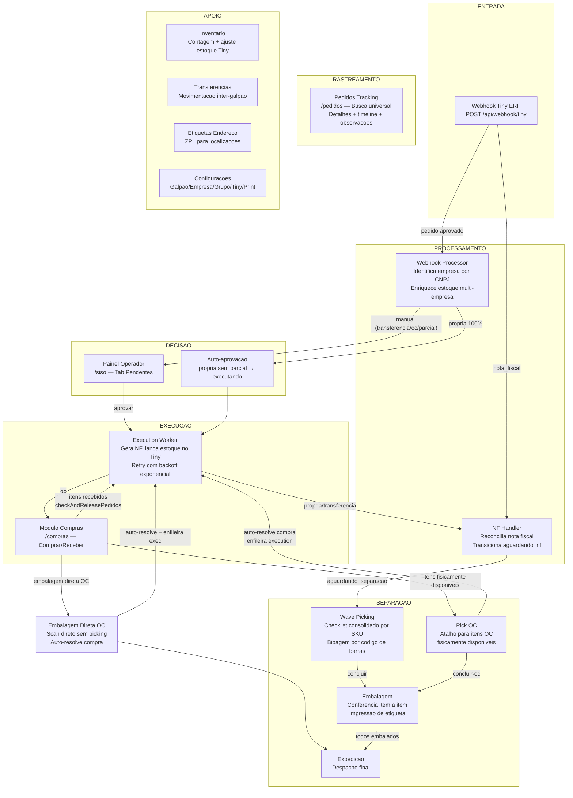

---

## 2. Arquitetura de Componentes

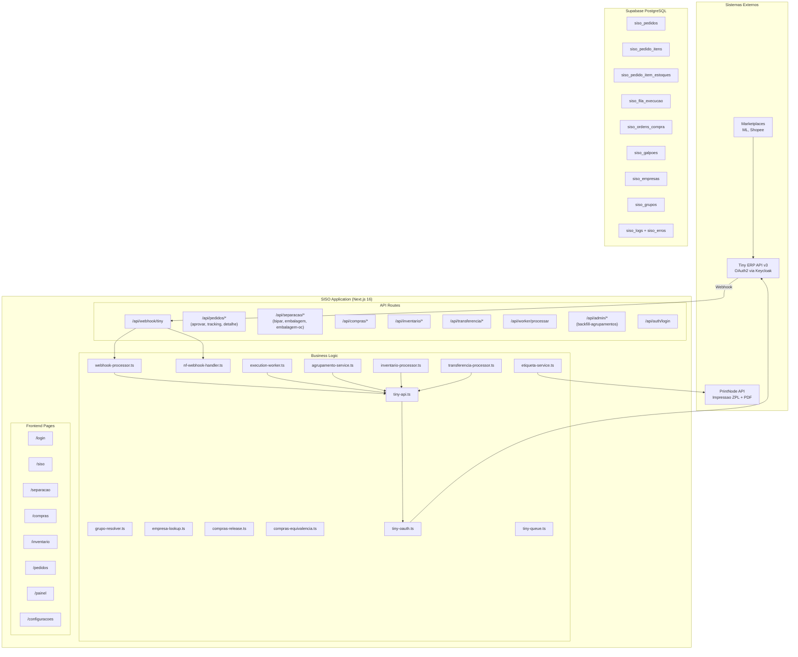

---

## 3. Hierarquia Organizacional

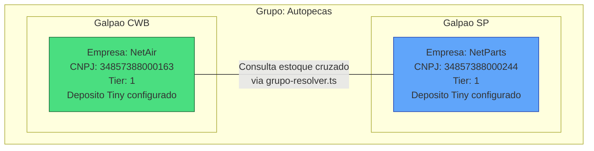

### Logica de consulta cruzada

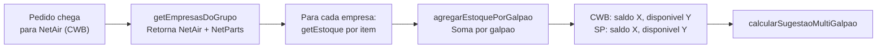

---

## 4. Pipeline de Webhook

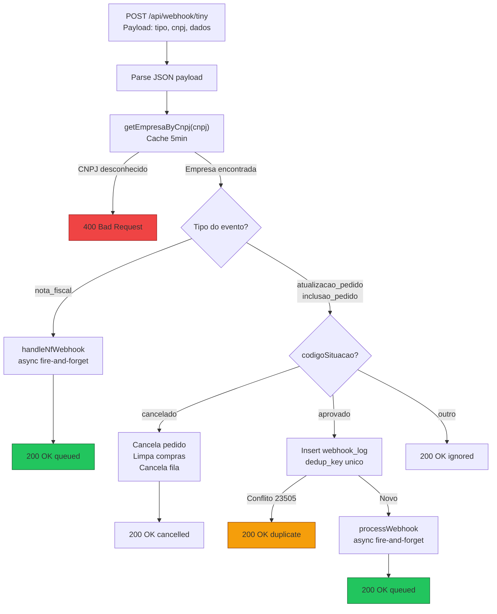

---

## 5. Processamento de Webhook (Detalhado)

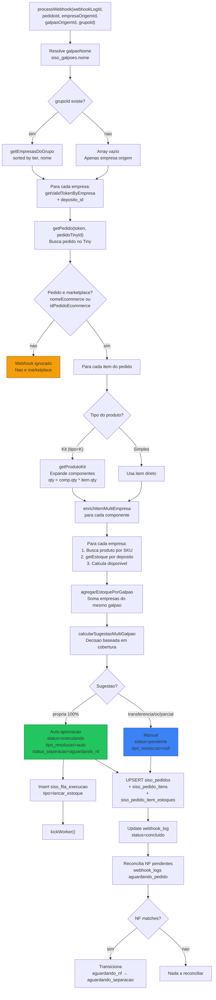

---

## 6. Webhook de Nota Fiscal

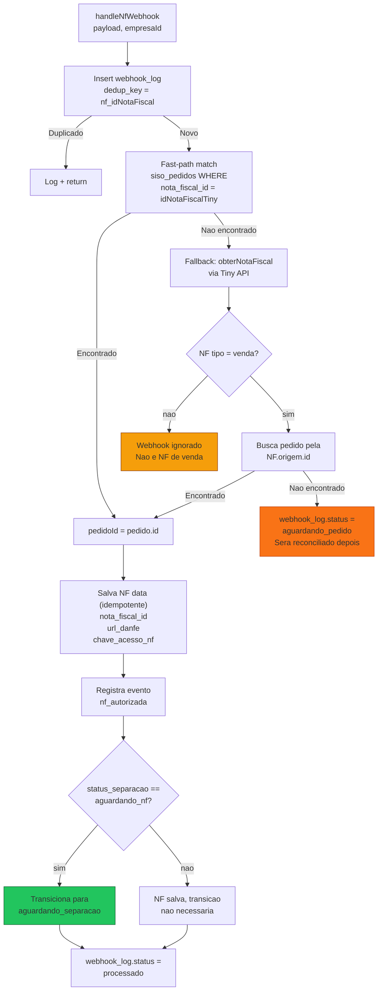

---

## 7. Logica de Decisao de Estoque

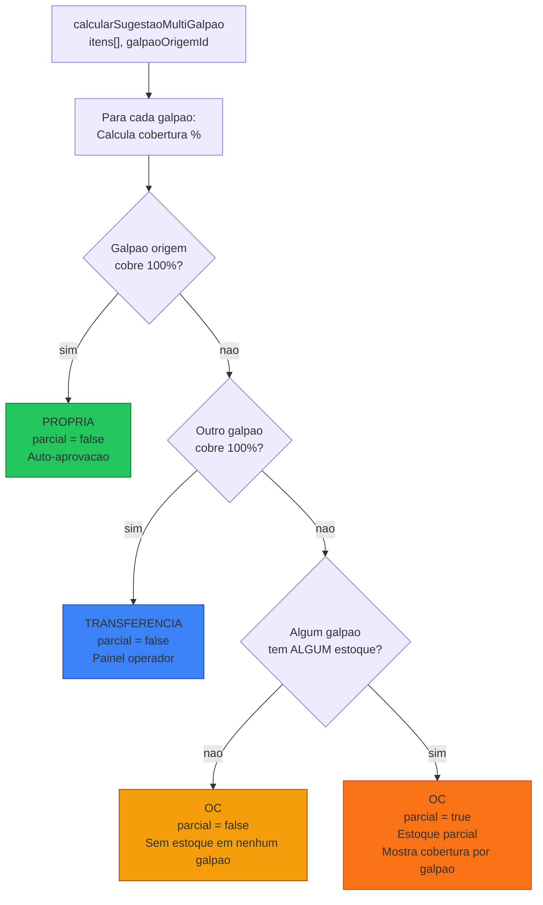

### Tabela de decisao

| Cenario | Sugestao | Parcial | Auto? | Resolucao |
|---|---|---|---|---|
| Origem cobre 100% | `propria` | false | Sim | `auto` |
| Outro galpao cobre 100% | `transferencia` | false | Nao | `manual` |
| Nenhum cobre, parcial | `oc` | true | Nao | `manual` |
| Nenhum tem estoque | `oc` | false | Nao | `manual` |

---

## 8. Aprovacao de Pedidos

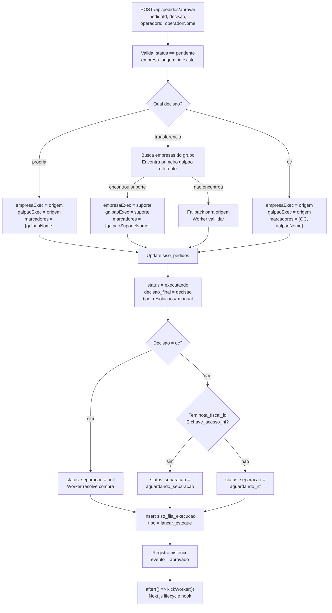

---

## 9. Execution Worker

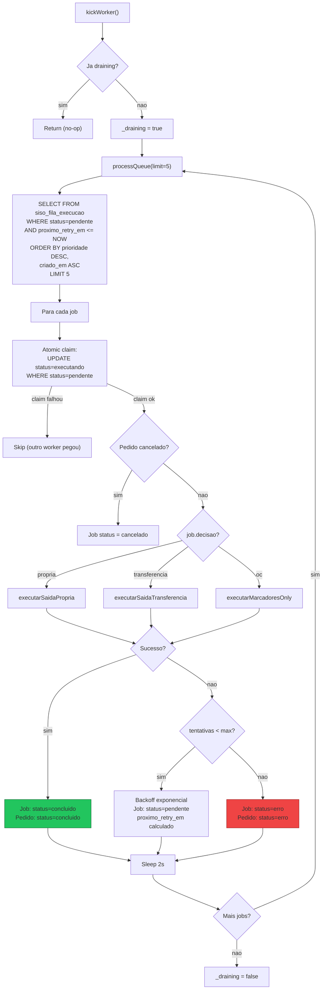

---

## 10. Fluxo Propria (Execution Worker)

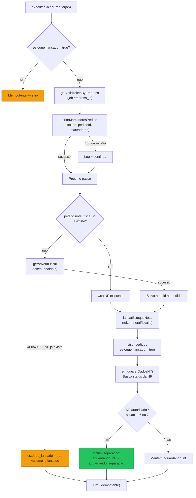

---

## 11. Fluxo Transferencia (Execution Worker)

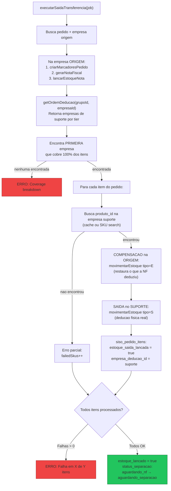

---

## 12. Fluxo OC (Execution Worker)

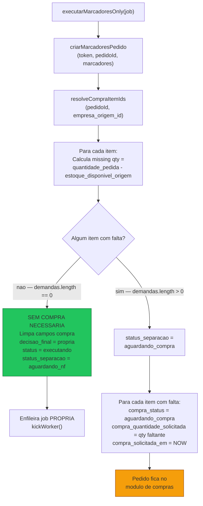

---

## 13. Separacao — Wave Picking Completo

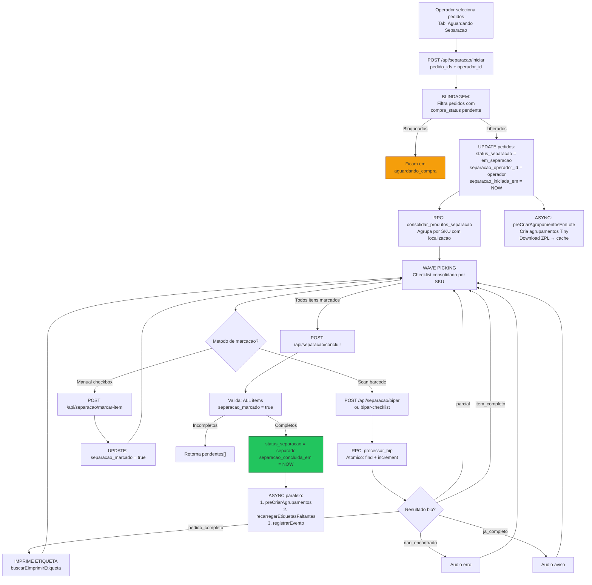

---

## 14. Separacao — Maquina de Estados

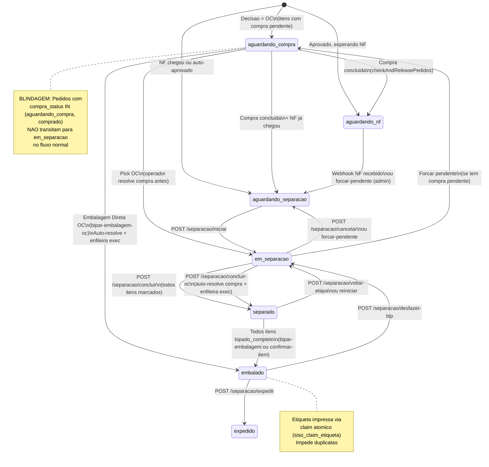

---

## 15. Bipagem durante Picking

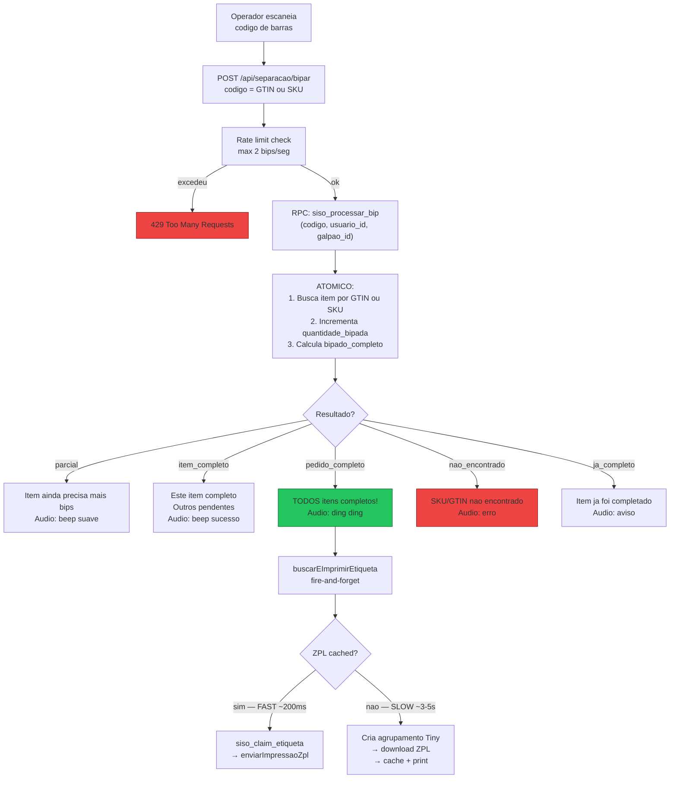

---

## 16. Embalagem (Packing)

Embalagem normal para pedidos em status `separado`. Para embalagem direta de itens OC (sem picking), ver [Embalagem Direta OC (#53)](#53-embalagem-direta-oc-bipar-embalagem-oc).

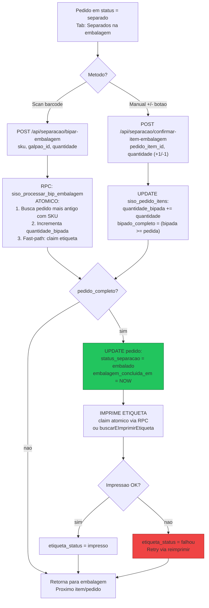

---

## 17. Expedicao

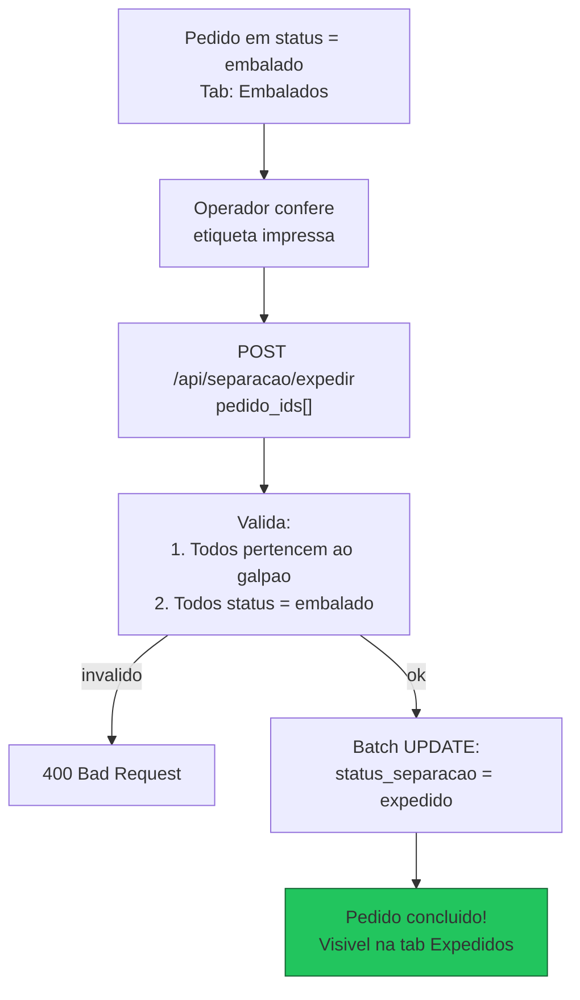

---

## 18. Pick OC — Atalho de Separacao

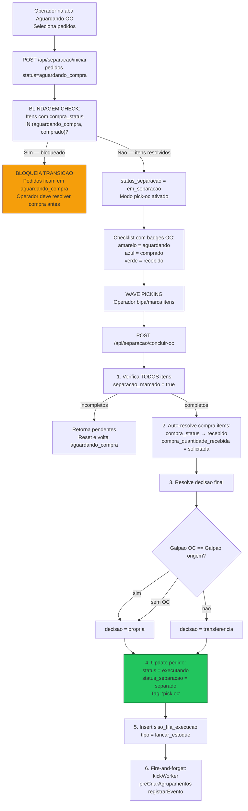

---

## 19. Acoes Especiais na Separacao

```mermaid
flowchart TD
    subgraph "Desfazer Bip"
        DB1["POST /separacao/desfazer-bip<br/>pedido_id, produto_id"]
        DB2["Decrementa quantidade_bipada<br/>Recalcula bipado_completo"]
        DB3["Se embalado → em_separacao<br/>Se tudo zerado → aguardando_separacao"]
        DB1 --> DB2 --> DB3
    end

    subgraph "Cancelar Separacao"
        CS1["POST /separacao/cancelar<br/>pedido_ids[]"]
        CS2["Reset: separacao_marcado=false<br/>separacao_marcado_em=null"]
        CS3["Se tem compra pendente → aguardando_compra<br/>Senao → aguardando_separacao"]
        CS1 --> CS2 --> CS3
    end

    subgraph "Reiniciar"
        RE1["POST /separacao/reiniciar<br/>pedido_ids[], etapa"]
        RE2{"Etapa?"}
        RE3["separacao: reset marcacoes"]
        RE4["embalagem: reset bipagens"]
        RE1 --> RE2
        RE2 -->|separacao| RE3
        RE2 -->|embalagem| RE4
    end

    subgraph "Voltar Etapa (Admin)"
        VE1["POST /separacao/voltar-etapa<br/>pedido_ids[], novo_status"]
        VE2["Backward: limpa dados futuros<br/>Forward: auto-marca itens"]
        VE3["Registra evento<br/>status_revertido"]
        VE1 --> VE2 --> VE3
    end

    subgraph "Forcar Pendente (Admin)"
        FP1["POST /separacao/forcar-pendente<br/>pedido_ids[]"]
        FP2["Verifica NF no Tiny<br/>situacao 6 ou 7"]
        FP3["aguardando_nf → aguardando_separacao"]
        FP1 --> FP2 --> FP3
    end

    subgraph "Tags"
        TG1["GET/POST /separacao/tags"]
        TG2["add: adiciona tag (dedup)<br/>remove: remove tag<br/>set: substitui todas"]
        TG1 --> TG2
    end
```

---

## 20. Compras — Fluxo Completo

```mermaid
flowchart TD
    A["Pedido com decisao = oc<br/>status_separacao = aguardando_compra<br/>Itens com compra_status = aguardando_compra"] --> B["GET /api/compras?tab=comprar<br/>Lista itens agrupados por fornecedor"]

    B --> C["Operador revisa itens<br/>Agrupa por fornecedor + SKU"]

    C --> D["POST /api/compras/ordens<br/>Cria OC por fornecedor + galpao"]

    D --> E["POST /api/compras/comprar<br/>SKU + quantidade_comprada"]

    E --> F["Distribui quantidade<br/>oldest-first (por aging)<br/>compra_status → comprado<br/>comprado_em = NOW"]

    F --> G["Fornecedor envia produtos<br/>(processo manual externo)"]

    G --> H["GET /api/compras?tab=receber<br/>ou /conferencia/[ocId]"]

    H --> I["POST /api/compras/receber<br/>SKU + quantidade_recebida"]

    I --> J["Distribui recebimentos<br/>oldest-first<br/>Incrementa compra_quantidade_recebida"]

    J --> K{"Item totalmente recebido?<br/>recebida >= solicitada"}
    K -->|sim| L["compra_status = recebido"]
    K -->|parcial| M["Continua parcial"]

    L --> N["checkAndReleasePedidos"]
    M --> N

    N --> O{"TODOS itens OC do pedido<br/>resolvidos (recebido ou cancelado)?"}
    O -->|nao| P["Pedido continua<br/>aguardando_compra"]
    O -->|sim| Q["LIBERA PEDIDO<br/>→ Ver fluxo Release (#26)"]

    style Q fill:#22c55e,stroke:#166534
```

---

## 21. Compras — Maquina de Estados (Item)

```mermaid
stateDiagram-v2
    [*] --> aguardando_compra: Execution worker\ncria demanda OC

    aguardando_compra --> comprado: POST /compras/comprar\nOperador marca como comprado
    comprado --> recebido: POST /compras/receber\nQuantidade totalmente recebida

    aguardando_compra --> indisponivel: POST /itens/{id}/indisponivel\nFornecedor nao tem
    comprado --> indisponivel: POST /itens/{id}/indisponivel

    aguardando_compra --> equivalente_pendente: POST /itens/{id}/equivalente\nPropoe SKU alternativo
    comprado --> equivalente_pendente: POST /itens/{id}/equivalente
    equivalente_pendente --> aguardando_compra: POST /itens/{id}/equivalente/confirmar\nConfirma SKU novo, volta pra fila

    aguardando_compra --> cancelamento_pendente: POST /itens/{id}/cancelamento\nPropoe cancelamento
    comprado --> cancelamento_pendente: POST /itens/{id}/cancelamento
    cancelamento_pendente --> cancelado: POST /itens/{id}/cancelamento/confirmar\nConfirma cancelamento

    comprado --> aguardando_compra: POST /itens/{id}/devolver\nDevolve item pra fila

    recebido --> [*]: Item resolvido\ncheckAndReleasePedidos
    cancelado --> [*]: Item resolvido\ncheckAndReleasePedidos

    note right of equivalente_pendente
        SKU trocado, estoque atualizado
        Item volta para fila de compra
        com novo fornecedor
    end note

    note right of indisponivel
        Se TODOS itens terminal
        (indisponivel + cancelado)
        → Pedido cancelado
    end note
```

---

## 22. Compras — Maquina de Estados (OC)

```mermaid
stateDiagram-v2
    [*] --> aguardando_compra: OC criada\n(draft)

    aguardando_compra --> comprado: POST /compras/ordens\n(compra efetivada)

    comprado --> parcialmente_recebido: Alguns itens recebidos
    comprado --> recebido: TODOS itens recebidos
    parcialmente_recebido --> recebido: Restantes recebidos

    comprado --> cancelado: Sem itens vinculados\n(cancelOcIfEmpty)
    parcialmente_recebido --> cancelado: Sem itens vinculados

    note right of cancelado
        OC cancelada quando
        todos itens removidos
        (indisponivel, cancelado, devolvido)
    end note
```

---

## 23. Compras — Excecoes e Alternativas

```mermaid
flowchart TD
    A["Item com problema"] --> B{"Qual excecao?"}

    B -->|"Indisponivel"| C["POST /itens/{id}/indisponivel<br/>motivo opcional"]
    C --> D["compra_status = indisponivel<br/>Remove vinculo OC"]
    D --> E["cancelOcIfEmpty"]
    E --> F["checkAndCancelPedidoIfAllTerminal<br/>Se TODOS itens terminal → cancela pedido"]

    B -->|"Equivalente"| G["POST /itens/{id}/equivalente<br/>sku_equivalente, observacao"]
    G --> H["Busca produto no Tiny<br/>Valida que existe"]
    H --> I["compra_status = equivalente_pendente<br/>Salva dados do equivalente"]
    I --> J["Operador confirma"]
    J --> K["POST /itens/{id}/equivalente/confirmar"]
    K --> L["Troca SKU, descricao, imagem<br/>Atualiza estoque normalizado<br/>compra_status → aguardando_compra"]

    B -->|"Cancelamento"| M["POST /itens/{id}/cancelamento<br/>motivo"]
    M --> N["compra_status = cancelamento_pendente"]
    N --> O["Operador confirma"]
    O --> P["POST /itens/{id}/cancelamento/confirmar"]
    P --> Q["compra_status = cancelado<br/>Remove estoque<br/>Reset separacao"]
    Q --> R["checkAndCancelPedidoIfAllTerminal<br/>checkAndReleasePedidos"]

    B -->|"Devolver"| S["POST /itens/{id}/devolver"]
    S --> T["compra_status → aguardando_compra<br/>Remove vinculo OC<br/>Volta pra fila"]

    B -->|"Trocar SKU"| U["POST /compras/trocar-sku<br/>item_ids[], novo_sku"]
    U --> V["Busca produto em todas empresas<br/>Atualiza SKU + estoque"]
```

---

## 24. Compras — Equivalente SKU

```mermaid
flowchart TD
    A["POST /itens/{id}/equivalente<br/>sku_equivalente, observacao"] --> B{"Tem estoque ja recebido?<br/>compra_quantidade_recebida > 0"}
    B -->|sim| C["400: Nao pode trocar<br/>Ja tem estoque lancado"]
    B -->|nao| D["Busca SKU equivalente<br/>no Tiny da empresa"]

    D -->|"nao encontrou"| E["404: Produto nao encontrado"]
    D -->|"encontrou"| F["Salva dados equivalente:<br/>compra_equivalente_sku<br/>compra_equivalente_descricao<br/>compra_equivalente_produto_id_tiny<br/>compra_equivalente_fornecedor"]

    F --> G["compra_status =<br/>equivalente_pendente"]

    G --> H["Operador revisa e confirma"]

    H --> I["POST /itens/{id}/equivalente/confirmar"]

    I --> J["carregarDadosEquivalentePorSku<br/>Busca em TODAS empresas do grupo"]

    J --> K["1. Delete estoque antigo<br/>2. Upsert estoque novo<br/>3. Atualiza SKU/descricao/imagem<br/>4. compra_status → aguardando_compra"]

    K --> L["Item volta para fila<br/>com novo SKU/fornecedor"]

    style C fill:#ef4444,stroke:#991b1b
    style L fill:#22c55e,stroke:#166534
```

---

## 25. Compras — Cancelamento

```mermaid
flowchart TD
    A["POST /itens/{id}/cancelamento<br/>motivo"] --> B["compra_status =<br/>cancelamento_pendente<br/>Salva motivo + solicitante"]

    B --> C["Operador confirma<br/>externamente"]

    C --> D["POST /itens/{id}/cancelamento/confirmar"]

    D --> E["1. Delete siso_pedido_item_estoques<br/>(remove estoque snapshot)"]

    E --> F["2. compra_status = cancelado<br/>Reset separacao campos<br/>(marcado, bipado, etc)"]

    F --> G["3. checkAndCancelPedidoIfAllTerminal"]
    G --> H{"TODOS itens do pedido<br/>sao indisponivel ou cancelado?"}
    H -->|sim| I["Pedido cancelado"]
    H -->|nao| J["4. checkAndReleasePedidos<br/>Se restantes resolvidos → libera"]

    style I fill:#ef4444,stroke:#991b1b
    style J fill:#22c55e,stroke:#166534
```

---

## 26. Compras — Release (Liberacao de Pedidos)

```mermaid
flowchart TD
    A["checkAndReleasePedidos<br/>(itemIds[])"] --> B["Identifica pedido_ids<br/>distintos dos items"]

    B --> C["Para cada pedido:"]
    C --> D["Busca TODOS itens<br/>com compra_status NOT NULL"]

    D --> E{"Todos resolvidos?<br/>(recebido ou cancelado)"}
    E -->|nao| F["Pedido continua<br/>aguardando_compra"]

    E -->|sim| G{"Existe ao menos 1<br/>item nao-cancelado?"}
    G -->|nao| H["Pedido sem itens validos<br/>→ cancelar"]

    G -->|sim| I["Resolve galpao da OC<br/>vs galpao do pedido"]

    I --> J{"Mesmo galpao?"}
    J -->|sim| K["decisao = propria"]
    J -->|nao| L["decisao = transferencia"]

    K --> M{"NF ja chegou?<br/>nota_fiscal_id existe"}
    L --> M

    M -->|sim| N["status_separacao =<br/>aguardando_separacao"]
    M -->|nao| O["status_separacao =<br/>aguardando_nf"]

    N --> P["UPDATE pedido:<br/>status = executando<br/>decisao_final = decisao<br/>separacao_galpao_id = OC galpao"]
    O --> P

    P --> Q["Insert siso_fila_execucao<br/>tipo = lancar_estoque"]
    Q --> R["kickWorker()"]

    style F fill:#f59e0b,stroke:#92400e
    style R fill:#22c55e,stroke:#166534
```

---

## 27. Compras — Preparar Embalagem

```mermaid
flowchart TD
    A["POST /compras/preparar-embalagem<br/>ordem_compra_ids[]"] --> B["Busca pedidos vinculados<br/>as OCs (exceto cancelados)"]

    B --> C["Categoriza por status_separacao"]

    C --> D["Invalidos: aguardando_nf<br/>→ ignorados (precisa NF)"]
    C --> E["Validos: aguardando_separacao<br/>em_separacao, separado"]

    E --> F{"Todos no mesmo galpao?"}
    F -->|nao| G["400: Galpoes inconsistentes"]
    F -->|sim| H["Split:"]

    H --> I["jaSeparados: status=separado<br/>→ nada a fazer"]
    H --> J["paraPreparar: aguardando_separacao<br/>ou em_separacao"]

    J --> K["UPDATE pedidos:<br/>status_separacao = separado<br/>separacao_concluida_em = NOW"]

    K --> L["UPDATE itens:<br/>separacao_marcado = true<br/>separacao_marcado_em = NOW"]

    L --> M["ASYNC:<br/>preCriarAgrupamentosEmLote<br/>recarregarEtiquetasFaltantes<br/>registrarEventos"]

    I --> N["Retorna resultado"]
    M --> N

    style G fill:#ef4444,stroke:#991b1b
    style N fill:#22c55e,stroke:#166534
```

---

## 28. Inventario — Fluxo Completo

```mermaid
flowchart TD
    A["Operador acessa /inventario"] --> B["POST /api/inventario<br/>empresa_id, galpao_id,<br/>tipo_estoque, modo"]

    B --> C["Cria sessao<br/>status = em_andamento"]

    C --> D["COLETA<br/>Operador escaneia codigos"]

    D --> E["POST /api/inventario/{id}/coletar<br/>codigo, localizacao, quantidade"]

    E --> F["1. Busca produto no Tiny<br/>por SKU ou GTIN"]
    F -->|"nao encontrou"| G["404: Produto nao encontrado"]
    F -->|"encontrou"| H["Insert siso_inventario_itens<br/>status = pendente"]

    H --> I{"Ja escaneado<br/>nessa localizacao?"}
    I -->|sim| J["ja_escaneado = true<br/>(alerta duplicata)"]
    I -->|nao| K["ja_escaneado = false"]

    J --> D
    K --> D

    D -->|"Coleta completa"| L["POST /api/inventario/{id}/processar"]

    L --> M["CAS: em_andamento → processando<br/>(optimistic lock)"]
    M -->|"409"| N["Ja processando"]
    M -->|"ok"| O["Fire-and-forget:<br/>processarInventario(id)"]

    O --> P["Consolida itens por SKU<br/>Soma quantidades<br/>Merge localizacoes"]

    P --> Q["Para cada item consolidado:<br/>→ Ver Processamento (#30)"]

    Q --> R["status = concluido"]

    R --> S{"Precisa reverter?"}
    S -->|sim| T["POST /api/inventario/{id}/reverter<br/>Desfaz todas alteracoes"]
    S -->|nao| U["Inventario finalizado!"]

    style R fill:#22c55e,stroke:#166534
```

---

## 29. Inventario — Maquina de Estados

```mermaid
stateDiagram-v2
    [*] --> em_andamento: POST /api/inventario\nCria sessao

    em_andamento --> processando: POST /processar\nCAS atomico
    em_andamento --> cancelado: PATCH (cancelar)

    processando --> concluido: Todos itens processados

    concluido --> revertido: POST /reverter\nDesfaz alteracoes

    state em_andamento {
        [*] --> coletando: Operador escaneia
        coletando --> coletando: Novo item
    }

    state processando {
        [*] --> item_processando
        item_processando --> item_sucesso: Tiny OK
        item_processando --> item_erro: Tiny falhou
        item_sucesso --> item_processando: Proximo item
        item_erro --> item_processando: Proximo item
    }
```

---

## 30. Inventario — Processamento

```mermaid
flowchart TD
    A["processarInventario(id)"] --> B["Fetch itens pendentes<br/>Agrupa por SKU"]

    B --> C["Para cada SKU consolidado:"]

    C --> D["getValidTokenByEmpresa"]
    D --> E["getProdutoDetalhe<br/>Detecta Kit (tipo=K)"]

    E --> F["getEstoque<br/>Salva localizacao antiga + saldo atual"]

    F --> G{"Tem loc_estoque<br/>E NAO e Kit?"}

    G -->|sim| H["movimentarEstoque tipo=B<br/>(balance/ajuste)"]
    G -->|nao| I["Skip movimentacao"]

    H --> J["atualizarLocalizacaoProduto"]
    I --> J

    J --> K{"manter_localizacao_antiga?"}
    K -->|sim| L["Merge: antiga + nova"]
    K -->|nao| M["Substitui localizacao"]

    L --> N["Item status = sucesso"]
    M --> N

    N -->|"erro em qualquer passo"| O["Item status = erro<br/>erro_msg = mensagem"]

    O --> C
    N --> C

    C -->|"todos processados"| P["Sessao status = concluido"]

    style P fill:#22c55e,stroke:#166534
    style O fill:#ef4444,stroke:#991b1b
```

---

## 31. Transferencia — Fluxo Completo

```mermaid
flowchart TD
    A["Operador acessa /transferencias"] --> B["POST /api/transferencia<br/>empresa_origem, empresa_destino,<br/>galpao_origem, galpao_destino"]

    B --> C["Cria sessao<br/>status = em_andamento"]

    C --> D["COLETA<br/>Operador escaneia da ORIGEM"]

    D --> E["POST /api/transferencia/{id}/coletar<br/>codigo, quantidade"]

    E --> F["Busca produto no Tiny da ORIGEM<br/>por SKU ou GTIN"]
    F -->|"nao encontrou"| G["404"]
    F -->|"encontrou"| H["Insert siso_transferencia_itens<br/>status = pendente"]

    H --> D

    D -->|"Coleta completa"| I["POST /api/transferencia/{id}/processar"]

    I --> J["CAS: em_andamento → processando"]
    J --> K["Fire-and-forget:<br/>processarTransferencia(id)"]

    K --> L["Para cada item:<br/>→ Ver Processamento (#33)"]

    L --> M["status = concluido"]

    M --> N{"Precisa reverter?"}
    N -->|sim| O["POST /reverter<br/>Desfaz movimentacoes"]
    N -->|nao| P["Transferencia finalizada!"]

    style M fill:#22c55e,stroke:#166534
```

---

## 32. Transferencia — Maquina de Estados

```mermaid
stateDiagram-v2
    [*] --> em_andamento: POST /api/transferencia\nCria sessao

    em_andamento --> processando: POST /processar\nCAS atomico
    em_andamento --> cancelado: PATCH (cancelar)

    processando --> concluido: Todos itens transferidos

    concluido --> revertido: POST /reverter\nDesfaz movimentacoes

    state processando {
        [*] --> transferindo
        transferindo --> sucesso: Origem + Destino OK
        transferindo --> erro: Falha na movimentacao
        sucesso --> transferindo: Proximo item
        erro --> transferindo: Proximo item
    }
```

---

## 33. Transferencia — Processamento

```mermaid
flowchart TD
    A["processarTransferencia(id)"] --> B["Fetch itens pendentes"]

    B --> C["Para cada item:"]

    C --> D["Busca produto no DESTINO<br/>por SKU"]

    D -->|"encontrou"| E["Usa produto existente"]
    D -->|"nao encontrou"| F["CLONE: getProdutoCompleto<br/>da ORIGEM → criarProduto no DESTINO"]

    E --> G["SAFE ORDER - Entrada primeiro!"]
    F --> G

    G --> H["1. ENTRADA no DESTINO<br/>movimentarEstoque tipo=E<br/>Obs: Transferencia de {ORIGEM}"]

    H --> I["2. SAIDA na ORIGEM<br/>movimentarEstoque tipo=S<br/>Obs: Transferencia para {DESTINO}"]

    I --> J["Item status = sucesso<br/>produto_id_tiny_destino salvo"]

    H -->|"erro"| K["Item status = erro<br/>Estoque NAO perdido<br/>(entrada ja fez no destino)"]
    I -->|"erro"| L["Item status = erro<br/>Produto no destino, origem nao saiu<br/>(manual fix necessario)"]

    J --> C
    K --> C
    L --> C

    C -->|"todos processados"| M["status = concluido"]

    style M fill:#22c55e,stroke:#166534
    style K fill:#f59e0b,stroke:#92400e
    style L fill:#ef4444,stroke:#991b1b
```

### Seguranca da ordem de operacoes

```mermaid
flowchart LR
    A["ENTRADA no destino<br/>PRIMEIRO"] -->|"Se falhar aqui"| B["Nenhum estoque perdido<br/>Item marcado como erro"]
    A -->|"Se sucesso"| C["SAIDA na origem<br/>SEGUNDO"]
    C -->|"Se falhar aqui"| D["Estoque duplicado temporario<br/>Precisa fix manual"]
    C -->|"Se sucesso"| E["Transferencia completa!"]

    style B fill:#22c55e,stroke:#166534
    style D fill:#f59e0b,stroke:#92400e
    style E fill:#22c55e,stroke:#166534
```

---

## 34. Impressao de Etiquetas (Shipping Labels)

```mermaid
flowchart TD
    A["Trigger: pedido completo<br/>(picking ou embalagem)"] --> B{"ZPL ja cacheado<br/>em etiqueta_zpl?"}

    B -->|"SIM — FAST PATH ~200ms"| C["siso_claim_etiqueta<br/>Claim atomico"]
    B -->|"NAO — SLOW PATH ~3-5s"| D["Cria agrupamento no Tiny<br/>→ Conclui agrupamento<br/>→ Download ZIP<br/>→ Extrai ZPL<br/>→ Cache no DB"]

    C --> E{"Claim OK?"}
    E -->|"nao (outro operador)"| F["Skip — evita duplicata"]
    E -->|"sim"| G["resolverImpressora<br/>Priority: user > galpao"]

    D --> H["Cache: etiqueta_zpl no DB"]
    H --> C

    G --> I["GET PrintNode API key<br/>de siso_configuracoes"]
    I --> J["enviarImpressaoZpl<br/>POST /printjobs<br/>content = base64(ZPL)"]

    J --> K{"PrintNode OK?"}
    K -->|sim| L["etiqueta_status = impresso<br/>impresso_em = NOW<br/>registrarEvento('etiqueta_impressa')"]
    K -->|nao| M["etiqueta_status = falhou<br/>registrarEvento('etiqueta_falhou')"]

    M --> N["Retry posterior via:<br/>reimprimir ou retry-etiqueta"]

    style F fill:#f59e0b,stroke:#92400e
    style L fill:#22c55e,stroke:#166534
    style M fill:#ef4444,stroke:#991b1b
```

### Pre-criacao assincrona de agrupamentos

```mermaid
flowchart LR
    A["Ao iniciar separacao<br/>ou concluir picking"] --> B["preCriarAgrupamentosEmLote"]
    B --> C["siso_claim_pedidos_para_agrupamento<br/>(atomico, sets 'pending')"]
    C --> D["Agrupa por empresa"]
    D --> E["Para cada pedido:<br/>1. Cria agrupamento Tiny<br/>2. Conclui agrupamento<br/>3. Busca expedicao<br/>4. Download ZPL<br/>5. Cache etiqueta_zpl"]
    E --> F["Quando bipagem completar<br/>→ ZPL ja esta cacheado<br/>→ Fast path ~200ms"]
```

---

## 35. Etiquetas de Endereco

```mermaid
flowchart TD
    A["Operador acessa /etiquetas<br/>Define range de enderecos"] --> B["POST /etiquetas-endereco/preview<br/>corredor_inicio/fim<br/>horizontal_inicio/fim<br/>vertical_inicio/fim"]

    B --> C["gerarEnderecos<br/>Format: CORREDOR-HH-V"]
    C --> D["Retorna preview + contagem"]

    D --> E["Operador seleciona tipo<br/>e impressora"]

    E --> F["POST /etiquetas-endereco/imprimir<br/>tipo: pequena | grande"]

    F --> G{"Tipo?"}
    G -->|"pequena (100x23mm)"| H["2 enderecos por etiqueta<br/>QR code + Code128"]
    G -->|"grande (4x6 inch)"| I["1 endereco por etiqueta<br/>Rotated 90deg<br/>Fonte 250pt"]

    H --> J["Resolve impressora<br/>+ API key"]
    I --> J

    J --> K["enviarImpressaoZpl<br/>via PrintNode"]
    K --> L["Retorna job_id"]
```

---

## 36. Autenticacao e Sessoes

```mermaid
flowchart TD
    A["Pagina /login<br/>Nome + PIN 4 digitos"] --> B["POST /api/auth/login"]

    B --> C["Query siso_usuarios<br/>WHERE nome = input<br/>AND ativo = true"]

    C --> D{"Encontrado + PIN OK?"}
    D -->|nao| E["401 Unauthorized"]
    D -->|sim| F["Busca galpoes permitidos<br/>siso_usuario_galpoes"]

    F --> G["Cria sessao<br/>siso_sessoes<br/>expira_em = NOW + 8h"]

    G --> H["Retorna: usuario +<br/>sessionId + galpoes"]

    H --> I["Cliente salva:<br/>localStorage siso_user<br/>siso_active_galpao"]

    I --> J["Toda request usa sisoFetch<br/>Headers: X-Session-Id<br/>X-Galpao-Id"]

    J --> K["Servidor: getSessionUser()"]
    K --> L{"Sessao valida?"}
    L -->|nao| M["401 → /login"]
    L -->|sim| N{"Cargo tem permissao?"}
    N -->|nao| O["403 Forbidden"]
    N -->|sim| P["Processa request"]

    style E fill:#ef4444,stroke:#991b1b
    style M fill:#ef4444,stroke:#991b1b
    style O fill:#ef4444,stroke:#991b1b
    style P fill:#22c55e,stroke:#166534
```

---

## 37. Controle de Acesso por Cargo

```mermaid
graph TD
    subgraph "admin"
        A1["Tudo: SISO, Separacao,<br/>Compras, Inventario,<br/>Transferencias, Etiquetas,<br/>Configuracoes, Usuarios,<br/>Painel Gerencial"]
    end

    subgraph "operador_cwb"
        B1["Pedidos CWB<br/>Separacao CWB"]
        B2["Galpao filter:<br/>empresa_origem_id in CWB"]
    end

    subgraph "operador_sp"
        C1["Pedidos SP<br/>Separacao SP"]
        C2["Galpao filter:<br/>empresa_origem_id in SP"]
    end

    subgraph "comprador"
        D1["Modulo Compras<br/>Pedidos com decisao=oc"]
    end

    style A1 fill:#22c55e,stroke:#166534
    style B1 fill:#3b82f6,stroke:#1e40af
    style C1 fill:#8b5cf6,stroke:#5b21b6
    style D1 fill:#f59e0b,stroke:#92400e
```

---

## 38. Status do Pedido — Maquina de Estados

```mermaid
stateDiagram-v2
    [*] --> pendente: Webhook recebido\n(nao auto-aprovado)

    [*] --> executando: Auto-aprovado\n(propria 100%, sem parcial)

    pendente --> executando: POST /pedidos/aprovar\n(operador aprova)

    executando --> concluido: Worker executou com sucesso\n(estoque lancado)

    executando --> erro: Worker falhou\n(max retries excedido)

    pendente --> cancelado: Webhook de cancelamento
    executando --> cancelado: Webhook de cancelamento

    note right of pendente
        tipo_resolucao = null
        Aguarda decisao humana
    end note

    note right of executando
        tipo_resolucao = auto | manual
        Worker processando
    end note

    note right of erro
        3 tentativas esgotadas
        Intervencao admin necessaria
    end note
```

---

## 39. Status da Separacao — Maquina de Estados Completa

```mermaid
stateDiagram-v2
    direction TB

    [*] --> null_status: Pedido pendente\n(aguardando aprovacao)

    null_status --> aguardando_compra: Decisao OC\n(execution worker)
    null_status --> aguardando_nf: Aprovado\n(sem NF ainda)
    null_status --> aguardando_separacao: Auto-aprovado\n+ NF simultanea

    aguardando_compra --> aguardando_nf: checkAndReleasePedidos\n(todos itens recebidos)
    aguardando_compra --> aguardando_separacao: Release + NF ja chegou
    aguardando_compra --> em_separacao: Pick OC\n(blindagem pass)
    aguardando_compra --> embalado: Embalagem Direta OC\n(bipar-embalagem-oc)

    aguardando_nf --> aguardando_separacao: Webhook NF\nou forcar-pendente

    aguardando_separacao --> em_separacao: iniciar separacao

    em_separacao --> separado: concluir\n(todos marcados)
    em_separacao --> separado: concluir-oc\n(auto-resolve + exec)

    separado --> embalado: Todos itens\nbipado_completo

    embalado --> expedido: expedir

    em_separacao --> aguardando_separacao: cancelar\nforcar-pendente
    em_separacao --> aguardando_compra: cancelar\n(se tem compra pendente)
    separado --> em_separacao: voltar-etapa\nreiniciar
    embalado --> em_separacao: desfazer-bip

    aguardando_separacao --> aguardando_compra: produto-esgotado\n(acao=oc)
```

---

## 40. Webhook Logs — Maquina de Estados

```mermaid
stateDiagram-v2
    [*] --> pendente: Insert inicial

    pendente --> processando: Webhook processor inicia
    processando --> concluido: Processado com sucesso
    processando --> erro: Falha no processamento
    processando --> ignorado: Filtrado\n(nao e marketplace, nao e venda)

    pendente --> duplicate: Dedup detectado\n(conflito 23505)

    pendente --> aguardando_pedido: NF chegou antes do pedido\n(race condition)
    aguardando_pedido --> processado: Reconciliado durante\nprocessamento do pedido

    note right of aguardando_pedido
        Race condition:
        NF webhook chega
        ANTES do pedido ser salvo
        Reconciliado na Step 12
        do webhook processor
    end note
```

---

## 41. Fila de Execucao — Maquina de Estados

```mermaid
stateDiagram-v2
    [*] --> pendente: Job enfileirado\n(aprovacao ou release)

    pendente --> executando: Worker claim atomico\nUPDATE WHERE status=pendente

    executando --> concluido: Execucao OK\nEstoque lancado
    executando --> pendente: Falha + retry disponivel\nproximo_retry_em = NOW + backoff
    executando --> erro: Falha + max tentativas\nPedido vai pra status=erro

    pendente --> cancelado: Pedido cancelado\n(webhook de cancelamento)

    note right of pendente
        Backoff exponencial:
        T1: 30s
        T2: 60s
        T3: 120s
    end note

    note right of erro
        Pedido status = erro
        Intervencao manual
    end note
```

---

## 42. Retry com Backoff Exponencial

```mermaid
flowchart TD
    A["Job falhou"] --> B["tentativas++"]

    B --> C{"tentativas >= max_tentativas?<br/>(padrao: 3)"}

    C -->|nao| D["Calcula delay:<br/>min(30000 * 2^(tent-1), 120000)"]
    D --> E["T1: 30s<br/>T2: 60s<br/>T3: 120s"]
    E --> F["Job: status = pendente<br/>proximo_retry_em = NOW + delay"]

    C -->|sim| G["Job: status = erro<br/>proximo_retry_em = null"]
    G --> H["Pedido: status = erro<br/>erro = mensagem"]

    F --> I["Worker reprocessa<br/>quando proximo_retry_em <= NOW"]

    style G fill:#ef4444,stroke:#991b1b
    style I fill:#3b82f6,stroke:#1e40af
```

---

## 43. Modelo de Dados (ER Diagram)

```mermaid
erDiagram
    siso_galpoes ||--o{ siso_empresas : "tem N empresas"
    siso_empresas }o--|| siso_grupo_empresas : "pertence a 1 grupo"
    siso_grupo_empresas }o--|| siso_grupos : "grupo"

    siso_pedidos }o--|| siso_empresas : "empresa_origem"
    siso_pedidos }o--o| siso_galpoes : "separacao_galpao"
    siso_pedidos ||--o{ siso_pedido_itens : "tem N itens"
    siso_pedido_itens ||--o{ siso_pedido_item_estoques : "estoque por empresa"
    siso_pedido_item_estoques }o--|| siso_empresas : "empresa"

    siso_pedidos ||--o{ siso_pedido_historico : "audit trail"
    siso_pedidos ||--o| siso_fila_execucao : "job de execucao"
    siso_pedido_itens }o--o| siso_ordens_compra : "OC vinculada"

    siso_empresas ||--o| siso_tiny_connections : "conexao OAuth2"
    siso_usuarios ||--o{ siso_sessoes : "sessoes ativas"
    siso_usuarios ||--o{ siso_usuario_galpoes : "galpoes permitidos"
    siso_usuario_galpoes }o--|| siso_galpoes : "galpao"

    siso_inventarios }o--|| siso_empresas : "empresa"
    siso_inventarios }o--|| siso_galpoes : "galpao"
    siso_inventarios ||--o{ siso_inventario_itens : "itens escaneados"

    siso_transferencias }o--|| siso_empresas : "empresa_origem"
    siso_transferencias }o--|| siso_galpoes : "galpao_origem"
    siso_transferencias }o--|| siso_galpoes : "galpao_destino"
    siso_transferencias ||--o{ siso_transferencia_itens : "itens transferidos"

    siso_galpoes {
        uuid id PK
        string nome UK
        string descricao
        boolean ativo
        jsonb printnode_config
    }

    siso_empresas {
        uuid id PK
        string nome
        string cnpj UK
        uuid galpao_id FK
        boolean ativo
    }

    siso_grupos {
        uuid id PK
        string nome UK
    }

    siso_grupo_empresas {
        uuid empresa_id FK_UK
        uuid grupo_id FK
        int tier
    }

    siso_pedidos {
        uuid id PK
        bigint numero
        string status
        string status_separacao
        string sugestao
        string decisao_final
        string tipo_resolucao
        uuid empresa_origem_id FK
        uuid separacao_galpao_id FK
        bigint nota_fiscal_id
        string etiqueta_status
        text etiqueta_zpl
        text separacao_tags
        boolean estoque_lancado
    }

    siso_pedido_itens {
        uuid id PK
        uuid pedido_id FK
        bigint produto_id
        string sku
        int quantidade_pedida
        boolean separacao_marcado
        int quantidade_bipada
        boolean bipado_completo
        string compra_status
        uuid ordem_compra_id FK
        boolean estoque_saida_lancada
        uuid empresa_deducao_id FK
    }

    siso_pedido_item_estoques {
        uuid pedido_id FK
        bigint produto_id
        uuid empresa_id FK
        float saldo
        float reservado
        float disponivel
        bigint produto_id_na_empresa
    }

    siso_ordens_compra {
        uuid id PK
        string fornecedor
        uuid galpao_id FK
        uuid empresa_id FK
        string status
    }

    siso_fila_execucao {
        uuid id PK
        uuid pedido_id FK
        uuid empresa_id FK
        string tipo
        string decisao
        string status
        int tentativas
        timestamp proximo_retry_em
    }

    siso_inventarios {
        uuid id PK
        uuid empresa_id FK
        uuid galpao_id FK
        string status
        string modo
        string tipo_estoque
    }

    siso_transferencias {
        uuid id PK
        uuid empresa_origem_id FK
        uuid empresa_destino_id FK
        uuid galpao_origem_id FK
        uuid galpao_destino_id FK
        string status
    }

    siso_usuarios {
        uuid id PK
        string nome UK
        string pin
        string cargo
        boolean ativo
    }
```

---

## 44. Sequence Diagram — Pedido Happy Path

Auto-aprovacao com estoque proprio.

```mermaid
sequenceDiagram
    participant Tiny as Tiny ERP
    participant WH as Webhook Handler
    participant WP as Webhook Processor
    participant DB as Supabase
    participant Worker as Execution Worker
    participant Op as Operador
    participant Sep as Separacao Module
    participant PN as PrintNode

    Tiny->>WH: POST /webhook/tiny (pedido aprovado)
    WH->>DB: getEmpresaByCnpj (cache 5min)
    WH->>DB: Insert webhook_log (dedup)
    WH-->>Tiny: 200 OK (queued)

    WH->>WP: processWebhook (async)
    WP->>Tiny: getPedido
    WP->>Tiny: getEstoque (todas empresas grupo)
    WP->>WP: calcularSugestaoMultiGalpao

    Note over WP: Origem tem 100% → PROPRIA AUTO

    WP->>DB: UPSERT pedidos (status=executando)
    WP->>DB: UPSERT itens + estoques
    WP->>DB: Insert fila_execucao

    Worker->>DB: Claim job (atomico)
    Worker->>Tiny: criarMarcadoresPedido
    Worker->>Tiny: gerarNotaFiscal
    Worker->>Tiny: lancarEstoqueNota
    Worker->>DB: estoque_lancado = true

    Tiny->>WH: POST /webhook/tiny (nota_fiscal)
    WH->>DB: aguardando_nf → aguardando_separacao

    Op->>Sep: Seleciona pedidos
    Sep->>DB: iniciar (em_separacao)
    Sep->>Tiny: preCriarAgrupamentos (async)

    Op->>Sep: Bipa codigos de barras
    Sep->>DB: processar_bip (atomico)

    Op->>Sep: Concluir picking
    Sep->>DB: separado

    Op->>Sep: Bipa embalagem
    Sep->>DB: processar_bip_embalagem

    Note over Sep: Pedido completo!

    Sep->>DB: embalado
    Sep->>PN: Imprime etiqueta ZPL

    Op->>Sep: Expedir
    Sep->>DB: expedido
```

---

## 45. Sequence Diagram — Pedido com OC

Pedido que precisa comprar itens.

```mermaid
sequenceDiagram
    participant WH as Webhook
    participant WP as Processor
    participant DB as Supabase
    participant Worker as Worker
    participant Comp as Comprador
    participant Compras as Compras Module
    participant Tiny as Tiny ERP
    participant Op as Operador

    WH->>WP: processWebhook
    WP->>WP: Nenhum galpao cobre 100%
    Note over WP: Sugestao = OC

    WP->>DB: status=pendente

    Op->>DB: Aprovar (decisao=oc)
    DB->>Worker: Job enfileirado

    Worker->>Worker: executarMarcadoresOnly
    Worker->>Tiny: criarMarcadoresPedido
    Worker->>Worker: resolveCompraItemIds
    Note over Worker: Itens com falta detectados

    Worker->>DB: compra_status = aguardando_compra
    Worker->>DB: status_separacao = aguardando_compra

    Comp->>Compras: GET /compras?tab=comprar
    Comp->>Compras: POST /compras/ordens (cria OC)
    Comp->>Compras: POST /compras/comprar (marca comprado)

    Note over Comp: Fornecedor entrega

    Comp->>Compras: POST /compras/receber
    Compras->>DB: compra_status = recebido

    Compras->>Compras: checkAndReleasePedidos
    Note over Compras: Todos itens resolvidos!

    Compras->>DB: status=executando, decisao_final
    Compras->>DB: Insert fila_execucao
    Compras->>Worker: kickWorker

    Worker->>Tiny: Lanca estoque
    Worker->>DB: concluido

    Note over Op: Pedido disponivel para separacao
```

---

## 46. Sequence Diagram — Transferencia

Pedido atendido por outro galpao.

```mermaid
sequenceDiagram
    participant WP as Processor
    participant DB as Supabase
    participant Op as Operador
    participant Worker as Worker
    participant TinyO as Tiny (Origem)
    participant TinyS as Tiny (Suporte)

    WP->>WP: Origem nao tem, SP tem 100%
    Note over WP: Sugestao = TRANSFERENCIA

    WP->>DB: status=pendente

    Op->>DB: Aprovar (decisao=transferencia)
    Note over Op: empresaExec = suporte (SP)

    DB->>Worker: Job enfileirado

    Worker->>Worker: executarSaidaTransferencia

    Worker->>TinyO: criarMarcadoresPedido
    Worker->>TinyO: gerarNotaFiscal
    Worker->>TinyO: lancarEstoqueNota
    Note over Worker: NF deduz estoque na ORIGEM

    Worker->>Worker: getOrdemDeducao(grupo)
    Note over Worker: Empresa suporte = SP

    loop Para cada item
        Worker->>TinyO: movimentarEstoque tipo=E (COMPENSACAO)
        Note over TinyO: Restaura saldo que NF deduziu
        Worker->>TinyS: movimentarEstoque tipo=S (SAIDA)
        Note over TinyS: Deducao fisica no suporte
    end

    Worker->>DB: estoque_lancado = true
    Worker->>DB: status_separacao = aguardando_separacao
```

---

## 47. Reconciliacao de Webhooks

```mermaid
flowchart TD
    subgraph "Race Condition: NF antes do Pedido"
        A["NF Webhook chega"] --> B["Busca pedido no DB"]
        B -->|"nao existe"| C["webhook_log.status =<br/>aguardando_pedido"]

        D["Pedido Webhook chega<br/>(depois)"] --> E["Processa normalmente"]
        E --> F["Step 12: Reconcilia NF pendentes"]
        F --> G["Busca webhook_logs<br/>status = aguardando_pedido"]
        G --> H["Para cada NF pendente:<br/>Verifica match via Tiny API"]
        H -->|"match"| I["Transiciona pedido<br/>aguardando_nf → aguardando_separacao"]
    end

    subgraph "Stuck Webhooks"
        J["reconciliar()"] --> K["Busca webhook_logs<br/>status = processando<br/>ha mais de 5 min"]
        K --> L["Re-submete para<br/>webhook processor"]
    end
```

---

## 48. Produto Esgotado durante Separacao

```mermaid
flowchart TD
    A["POST /separacao/produto-esgotado<br/>sku"] --> B{"Qual acao?"}

    B -->|"preview (sem acao)"| C["Retorna:<br/>pedidos_afetados<br/>itens_afetados<br/>galpoes_alternativos (com estoque)"]

    B -->|"encaminhar"| D["Para pedidos afetados:<br/>1. Reset separacao state<br/>2. Move para novo galpao<br/>3. aguardando_separacao"]

    B -->|"oc"| E["Para pedidos afetados:<br/>1. Marca itens: compra_status=aguardando_compra<br/>2. Reset separacao state<br/>3. Cria/encontra OC para fornecedor<br/>4. status = aguardando_compra"]

    D --> F["Pedidos disponiveis<br/>no galpao destino"]
    E --> G["Pedidos entram<br/>no modulo de compras"]
```

---

## 49. Encaminhamento entre Galpoes

```mermaid
flowchart TD
    A["POST /separacao/encaminhar<br/>pedido_ids[], galpao_destino_id"] --> B["Valida:<br/>status = aguardando_separacao<br/>ou em_separacao"]

    B --> C["Para cada pedido:"]

    C --> D{"estoque_lancado<br/>+ decisao_final?"}

    D -->|"propria + lancado"| E["Estorna estoque no Tiny<br/>(reversa NF)"]
    D -->|"transferencia"| F["Reversa movimentacoes<br/>por item"]
    D -->|"nao lancado"| G["Skip estorno"]

    E --> H["Reset pedido:<br/>status = pendente<br/>status_separacao = null<br/>sugestao = transferencia<br/>Limpa: galpao, operador, etiqueta"]
    F --> H
    G --> H

    H --> I["Reset itens:<br/>separacao_marcado = false<br/>quantidade_bipada = 0<br/>estoque_saida_lancada = false"]

    I --> J["registrarEvento(encaminhado)"]
    J --> K["Pedido visivel no<br/>galpao destino como pendente"]

    style K fill:#22c55e,stroke:#166534
```

---

## 50. Integracao com Tiny ERP

```mermaid
flowchart TD
    subgraph "Rate Limiting"
        A["runWithEmpresa(empresaId, fn)"]
        B["Fila por empresa_id<br/>tiny-queue.ts"]
        C["rate-limiter.ts<br/>Controla requests/segundo"]
        A --> B --> C
    end

    subgraph "APIs Usadas"
        D["getPedido<br/>/pedidos/{id}"]
        E["getEstoque<br/>/estoque/{produtoId}"]
        F["getProdutoDetalhe<br/>/produtos/{id}"]
        G["buscarProdutoPorSku<br/>/produtos?pesquisa=sku"]
        H["gerarNotaFiscal<br/>/notas-fiscais"]
        I["lancarEstoqueNota<br/>/notas-fiscais/{id}/lancar-estoque"]
        J["movimentarEstoque<br/>/estoque/movimentar"]
        K["criarMarcadoresPedido<br/>/pedidos/{id}/marcadores"]
        L["criarAgrupamento<br/>/agrupamentos"]
        M["obterNotaFiscal<br/>/notas-fiscais/{id}"]
        N["atualizarLocalizacaoProduto<br/>/produtos/{id}"]
        O["criarProduto<br/>/produtos"]
    end

    subgraph "Contextos de Uso"
        P["Webhook Processor<br/>D, E, F, G, M"]
        Q["Execution Worker<br/>H, I, J, K"]
        R["Separacao<br/>L, M"]
        S["Inventario<br/>E, F, G, J, N"]
        T["Transferencia<br/>E, F, G, J, N, O"]
    end
```

---

## 51. Fluxo de Token OAuth2

```mermaid
flowchart TD
    A["getValidTokenByEmpresa(empresaId)"] --> B["Busca siso_tiny_connections<br/>WHERE empresa_id = id"]

    B --> C{"Token existe?"}
    C -->|nao| D["Erro: sem conexao Tiny"]

    C -->|sim| E{"Token valido?<br/>expira_em > NOW + 60s"}
    E -->|sim| F["Retorna access_token"]

    E -->|nao| G["Refresh token via Keycloak<br/>POST /token<br/>grant_type=refresh_token"]

    G -->|sucesso| H["Salva novo token<br/>+ refresh_token<br/>+ nova expiracao"]
    H --> F

    G -->|falha| I["Erro: token refresh falhou<br/>Requer re-autenticacao OAuth2"]

    style F fill:#22c55e,stroke:#166534
    style D fill:#ef4444,stroke:#991b1b
    style I fill:#ef4444,stroke:#991b1b
```

### OAuth2 Setup (primeira vez)

```mermaid
sequenceDiagram
    participant Admin as Admin
    participant SISO as SISO App
    participant KC as Keycloak (Tiny)
    participant DB as Supabase

    Admin->>SISO: GET /api/tiny/oauth?empresa_id=X
    SISO->>KC: Redirect → authorization URL
    KC->>Admin: Login page Tiny
    Admin->>KC: Credenciais
    KC->>SISO: GET /api/tiny/oauth/callback?code=ABC
    SISO->>KC: POST /token (code → tokens)
    KC-->>SISO: access_token + refresh_token
    SISO->>DB: Upsert siso_tiny_connections
    SISO-->>Admin: Redirect → /configuracoes (sucesso)
```

---

## 52. Pedidos Tracking — Rastreamento Universal

Modulo de rastreamento universal de pedidos. Permite busca textual, filtros por status/decisao/empresa, e visualizacao detalhada com timeline e observacoes.

### Paginas

| Pagina | Funcao |
|---|---|
| `/pedidos` | Lista universal com abas Pedidos/Expedidos, busca e filtros |
| `/pedidos/[id]` | Detalhe consolidado: itens + estoque por galpao, timeline, observacoes, acoes |

### Fluxo de Busca e Listagem

```mermaid
flowchart TD
    A["GET /api/pedidos/tracking<br/>page, limit, busca, status,<br/>status_separacao, decisao,<br/>empresa_origem_id, tab"] --> B{"Cargo do usuario?"}

    B -->|admin| C["Sem filtro de galpao"]
    B -->|operador_cwb/sp| D["Filtra por empresa_origem_id<br/>do galpao do operador"]
    B -->|comprador| E["Filtra decisao_final = oc"]

    C --> F{"busca preenchida?"}
    D --> F
    E --> F

    F -->|sim| G["Pre-fetch: busca SKU<br/>em siso_pedido_itens<br/>Retorna pedido_ids matchados"]
    G --> H["Query principal:<br/>numero ILIKE OR<br/>id_pedido_ecommerce ILIKE OR<br/>cliente_nome ILIKE OR<br/>id IN (pedido_ids do SKU)"]

    F -->|nao| I["Query sem filtro de busca"]

    H --> J["Aplica filtros:<br/>status, status_separacao,<br/>decisao, empresa_origem_id,<br/>data_inicio/data_fim, marketplace"]
    I --> J

    J --> K{"tab?"}
    K -->|pedidos| L["Exclui: expedido,<br/>embalado+impresso, cancelado"]
    K -->|expedidos| M["Inclui: embalado+impresso<br/>OU expedido OU cancelado"]

    L --> N["JOIN siso_empresas<br/>+ siso_galpoes<br/>Paginacao + contagem"]
    M --> N

    N --> O["Retorna: pedidos[], total,<br/>page, totalPages"]
```

### Fluxo de Detalhe do Pedido

```mermaid
flowchart TD
    A["GET /api/pedidos/[id]/detalhe"] --> B["getSessionUser<br/>Valida sessao + cargo"]

    B --> C["Busca pedido base<br/>+ empresa + galpao names"]

    C --> D{"Cargo pode ver?"}
    D -->|"operador sem acesso ao galpao"| E["403 Forbidden"]
    D -->|"comprador e decisao != oc"| E
    D -->|"autorizado"| F["Busca itens do pedido"]

    F --> G["Busca estoques normalizados<br/>siso_pedido_item_estoques<br/>JOIN empresas + galpoes"]

    G --> H["Agrega estoque por galpao:<br/>produto_id → galpao_nome →<br/>{saldo, reservado, disponivel,<br/>localizacao, atende}"]

    H --> I["Busca historico<br/>siso_pedido_historico"]

    I --> J["Busca observacoes<br/>siso_pedido_observacoes"]

    J --> K["Retorna: pedido, itens<br/>(com estoques map),<br/>historico, observacoes"]
```

---

## 53. Embalagem Direta OC (bipar-embalagem-oc)

Atalho que permite embalar pedidos OC diretamente sem passar pelo picking. Operador escaneia itens na embalagem, o sistema auto-resolve a compra e enfileira execucao.

### Diferenca entre modos

| Aspecto | Embalagem Normal | Embalagem Direta OC |
|---|---|---|
| Status de entrada | `separado` | `aguardando_compra` |
| Endpoint | `/api/separacao/bipar-embalagem` | `/api/separacao/bipar-embalagem-oc` |
| Payload scan | `{ sku, galpao_id, quantidade }` | `{ sku, pedido_ids[], quantidade }` |
| Resolve compra? | Nao | Sim (auto-resolve todos itens OC) |
| Enfileira execucao? | Nao | Sim (lancar_estoque) |
| Tag aplicada | — | `embalagem direta` |

### Fluxo Completo

```mermaid
flowchart TD
    A["Operador na aba Aguardando OC<br/>Clica 'Embalar'"] --> B["/separacao/embalagem?modo=embalagem-oc<br/>Pagina dedicada de embalagem"]

    B --> C["Carrega pedidos<br/>status_separacao = aguardando_compra<br/>do galpao do operador"]

    C --> D["SCAN: Operador bipa codigo"]

    D --> E["POST /api/separacao/bipar-embalagem-oc<br/>{ sku, pedido_ids[], quantidade }"]

    E --> F["Busca pedido mais antigo<br/>com SKU pendente<br/>(oldest-first por data_pedido)"]

    F -->|"nao encontrou"| G["Erro: SKU nao encontrado<br/>nos pedidos selecionados"]
    F -->|"encontrou"| H["Optimistic lock:<br/>UPDATE quantidade_bipada<br/>WHERE quantidade_bipada = expected"]

    H -->|"lock falhou"| I["409: Conflito de concorrencia"]
    H -->|"ok"| J["Marca bipado_completo<br/>se bipada >= pedida"]

    J --> K{"Todos itens do pedido<br/>bipado_completo?"}
    K -->|nao| L["Retorna: parcial<br/>Proximo scan"]
    L --> D

    K -->|sim| M["PEDIDO COMPLETO"]

    M --> N["1. Auto-resolve compra:<br/>compra_status → recebido<br/>compra_quantidade_recebida = solicitada"]

    N --> O["2. Resolve decisao final"]
    O --> P{"Galpao OC == Galpao empresa?"}
    P -->|sim| Q["decisao = propria"]
    P -->|nao| R["decisao = transferencia<br/>(busca empresa ativa no galpao OC)"]
    P -->|"sem OC"| Q

    Q --> S["3. Update pedido:<br/>status = executando<br/>status_separacao = embalado<br/>embalagem_concluida_em = NOW<br/>Tag: 'embalagem direta'"]
    R --> S

    S --> T["4. Insert siso_fila_execucao<br/>tipo = lancar_estoque"]

    T --> U["5. Fire-and-forget:<br/>kickWorker<br/>imprimirEtiqueta<br/>registrarEvento"]

    U --> V["Pedido embalado!<br/>Pronto para expedicao"]

    style G fill:#ef4444,stroke:#991b1b
    style V fill:#22c55e,stroke:#166534
```

### Transicao de estados

```mermaid
stateDiagram-v2
    aguardando_compra --> embalado: bipar-embalagem-oc\n(todos itens bipados)\nAuto-resolve compra\nEnfileira execution

    note right of embalado
        Pula picking inteiro
        Vai direto para expedicao
        Tag 'embalagem direta' aplicada
    end note
```

---

## 54. Backfill Agrupamentos (Admin)

Rota administrativa para criar agrupamentos fase-1 em lote para pedidos que tem NF completa mas sem agrupamento.

```mermaid
flowchart TD
    A["GET /api/admin/backfill-agrupamentos<br/>?limit=20&dryrun=false"] --> B["Valida: cargo == admin"]

    B -->|"nao admin"| C["403 Forbidden"]
    B -->|admin| D["Query pedidos elegiveis:<br/>1. nota_fiscal_id + chave_acesso_nf presentes<br/>2. agrupamento_expedicao_id IS NULL ou 'pending'<br/>3. status_separacao IN<br/>(aguardando_compra, aguardando_nf,<br/>aguardando_separacao, em_separacao, separado)"]

    D --> E{"dryrun = true?"}
    E -->|sim| F["Retorna lista de elegiveis<br/>sem processar"]

    E -->|nao| G["Para cada pedido:"]
    G --> H["criarAgrupamentoFase1(pedidoId)<br/>2s delay entre pedidos<br/>(rate limit Tiny)"]

    H -->|sucesso| I["processed++"]
    H -->|ja tem agrupamento| J["skipped++"]
    H -->|erro| K["errors++"]

    I --> L{"Mais pedidos?"}
    J --> L
    K --> L

    L -->|sim| G
    L -->|nao| M["Retorna: { total,<br/>processed, skipped,<br/>errors, pedidos[] }"]

    style C fill:#ef4444,stroke:#991b1b
    style M fill:#22c55e,stroke:#166534
```

---

## Resumo de Tabelas de Referencia

### Todas as transicoes de status_separacao

| De | Para | Trigger | Endpoint |
|---|---|---|---|
| null | aguardando_compra | Execution worker (OC) | Worker interno |
| null | aguardando_nf | Aprovacao (propria/transferencia) | /pedidos/aprovar |
| null | aguardando_separacao | Auto-aprovacao + NF | Webhook processor |
| aguardando_compra | aguardando_nf | checkAndReleasePedidos | /compras/receber |
| aguardando_compra | aguardando_separacao | Release + NF ja chegou | /compras/receber |
| aguardando_compra | em_separacao | Pick OC (blindagem pass) | /separacao/iniciar |
| aguardando_compra | embalado | Embalagem Direta OC (todos bipados) | /separacao/bipar-embalagem-oc |
| aguardando_nf | aguardando_separacao | Webhook NF | /webhook/tiny |
| aguardando_nf | aguardando_separacao | Admin force | /separacao/forcar-pendente |
| aguardando_separacao | em_separacao | Operador inicia | /separacao/iniciar |
| aguardando_separacao | aguardando_compra | Produto esgotado (oc) | /separacao/produto-esgotado |
| em_separacao | separado | Concluir picking | /separacao/concluir |
| em_separacao | separado | Concluir OC | /separacao/concluir-oc |
| em_separacao | aguardando_separacao | Cancelar / Forcar | /separacao/cancelar |
| em_separacao | aguardando_compra | Cancelar (compra pending) | /separacao/cancelar |
| separado | embalado | Todos bipado_completo | /separacao/bipar-embalagem |
| separado | em_separacao | Voltar etapa | /separacao/voltar-etapa |
| embalado | expedido | Despachar | /separacao/expedir |
| embalado | em_separacao | Desfazer bip | /separacao/desfazer-bip |

### Eventos do historico (audit trail)

| Evento | Quando |
|---|---|
| recebido | Webhook processado |
| auto_aprovado | Auto-aprovacao (propria 100%) |
| aprovado | Operador aprovou |
| nf_autorizada | NF verificada |
| separacao_iniciada | Wave picking comecou |
| separacao_concluida | Picking completo |
| separacao_oc_concluida | Pick OC completo |
| embalagem_oc_concluida | Embalagem direta OC completa |
| embalagem_concluida | Packing completo |
| etiqueta_impressa | Label enviado para impressora |
| etiqueta_falhou | Falha na impressao |
| encaminhado | Pedido movido entre galpoes |
| status_revertido | Admin mudou status |
| cancelado | Pedido cancelado |

### Sistemas externos integrados

| Sistema | Protocolo | Funcao |
|---|---|---|
| Tiny ERP v3 | REST API + OAuth2 (Keycloak) | Pedidos, NF, estoque, agrupamentos, produtos |
| Supabase | PostgreSQL + Realtime + RPCs | Banco de dados, subscriptions, operacoes atomicas |
| PrintNode | REST API | Impressao termica (ZPL raw + PDF) |
| Marketplaces | Via Tiny ERP | Mercado Livre, Shopee (origem dos pedidos) |
