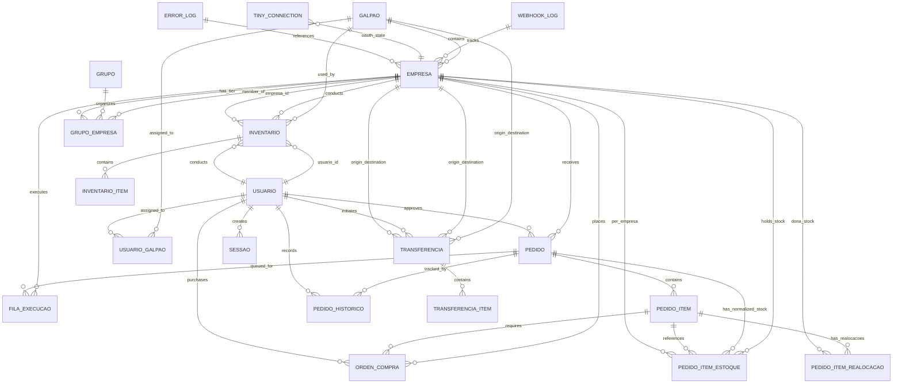

# SISO Database Schema Reference

Comprehensive schema documentation for the SISO (Sistema Inteligente de Separacao de Ordens) PostgreSQL database on Supabase project `wrbrbhuhsaaupqsimkqz`.

All tables are prefixed with `siso_`. This document covers all tables, columns, relationships, and lifecycle patterns.

---

## Table of Contents

1. [Core Business Tables](#core-business-tables)
2. [Hierarchy Tables (Galpão/Empresa/Grupo)](#hierarchy-tables)
3. [Stock & Inventory Tables](#stock--inventory-tables)
4. [Separation & Packing Tables](#separation--packing-tables)
5. [Purchase Orders (Compras) Tables](#purchase-orders-compras-tables)
6. [Inventory & Transfer Modules](#inventory--transfer-modules)
7. [WMS — Guarda (put-away)](#wms--guarda-put-away)
8. [Infrastructure Tables](#infrastructure-tables)
9. [Authentication & Sessions](#authentication--sessions)
10. [Cross (módulo de catálogo e equivalência)](#cross-módulo-de-catálogo-e-equivalência)
11. [Entity-Relationship Diagram](#entity-relationship-diagram)
12. [Data Lifecycle Patterns](#data-lifecycle-patterns)
13. [Important Queries & Access Patterns](#important-queries--access-patterns)
14. [Migration History Summary](#migration-history-summary)

---

## Core Business Tables

### siso_pedidos

**Purpose:** Orders from Tiny ERP e-commerce webhooks. Central table for the order lifecycle.

| Column | Type | Nullable | Default | Description |
|--------|------|----------|---------|-------------|
| `id` | text | NO | (PK) | Order ID from Tiny ERP |
| `numero` | text | NO | | Display number (e.g., "#123456") |
| `data` | timestamptz | NO | | Order date from Tiny |
| `filial_origem` | text | NO | | Origin branch code (legacy; use `empresa_origem_id`) |
| `empresa_origem_id` | uuid | YES | FK | Empresa that received the order |
| `idPedidoEcommerce` | text | YES | | E-commerce order ID (Mercado Livre, Shopee) |
| `nomeEcommerce` | text | YES | | E-commerce name |
| `cliente_nome` | text | YES | | Customer name |
| `cliente_cpf_cnpj` | text | YES | | Customer CPF/CNPJ |
| `forma_envio_id` | text | YES | | Tiny shipping method ID |
| `forma_envio_descricao` | text | YES | | Tiny shipping method name |
| `forma_frete_id` | text | YES | | Tiny freight form ID |
| `transportador_id` | text | YES | | Tiny carrier ID |
| `status` | text | NO | 'pendente' | Order processing status: `pendente`, `executando`, `concluido`, `cancelado`, `erro` |
| `sugestao` | text | YES | | System suggestion: `propria`, `transferencia`, `oc` |
| `sugestao_motivo` | text | YES | | Explanation of suggestion |
| `decisao_final` | text | YES | | Operator decision (same values as sugestao) |
| `tipo_resolucao` | text | YES | | `auto` (auto-approved) or `manual` (operator review) |
| `operador_id` | uuid | YES | FK | User who processed (if manual) |
| `operador_nome` | text | YES | | User name (denormalized) |
| `processado_em` | timestamptz | YES | | When operator approved/rejected |
| `marcadores` | text[] | YES | | Tiny order markers/tags |
| `separacao_tags` | text[] | YES | `{}` | User-created tags in separation module |
| `erro` | text | YES | | Error message if status = 'erro' |
| `estoque_lancado` | boolean | NO | false | Flag: stock already deducted in Tiny |
| `compra_estoque_lancado_alerta` | boolean | NO | false | Flag: alert if stock entered before cancellation |
| `status_separacao` | text | YES | | Separation status: `aguardando_compra`, `aguardando_nf`, `aguardando_separacao`, `em_separacao`, `pendente_realocacao`, `separado`, `embalado` |
| `separacao_galpao_id` | uuid | YES | FK | Galpão where separation happens |
| `separacao_operador_id` | uuid | YES | FK | User performing separation |
| `separacao_iniciada_em` | timestamptz | YES | | When wave picking started |
| `separacao_concluida_em` | timestamptz | YES | | When picking completed |
| `embalagem_concluida_em` | timestamptz | YES | | When packing completed |
| `embalagem_operador_id` | uuid | YES | FK | User who packed the order (may differ from separacao_operador_id) |
| `etiqueta_status` | text | YES | | Shipping label status: `pendente`, `imprimindo`, `impresso`, `falhou` |
| `etiqueta_url` | text | YES | | Shipping label URL (PrintNode receipt) |
| `etiqueta_zpl` | text | YES | | Raw ZPL content cached at separation |
| `url_danfe` | text | YES | | DANFE (NF invoice) URL |
| `chave_acesso_nf` | text | YES | | NF access key (unique NFe identifier) |
| `nota_fiscal_id` | bigint | YES | | Tiny NF ID |
| `agrupamento_tiny_id` | bigint | YES | | Deprecated: Tiny agrupamento (grouping) ID |
| `agrupamento_expedicao_id` | text | YES | | Tiny expedition grouping ID (used for label printing) |
| `expedicao_id` | text | YES | | Tiny expedition ID within agrupamento |
| `prazo_envio` | text | YES | | Shipping deadline string |
| `encaminhado_de` | text | YES | | Name of origin galpão when manually forwarded to another galpão |
| `criado_em` | timestamptz | NO | now() | Record creation timestamp |
| `atualizado_em` | timestamptz | YES | | Last update timestamp |

**Primary Key:** `id`

**Foreign Keys:**
- `empresa_origem_id` → `siso_empresas(id)`
- `separacao_galpao_id` → `siso_galpoes(id)`
- `separacao_operador_id` → `siso_usuarios(id)`
- `operador_id` → `siso_usuarios(id)`

**Indexes:**
- `idx_pedidos_separacao_galpao` (separacao_galpao_id, status_separacao) WHERE status_separacao IN ('aguardando_separacao', 'em_separacao')
- `idx_pedidos_separacao_aguardando` (separacao_galpao_id) WHERE status_separacao = 'aguardando_nf'
- `idx_pedidos_separacao_embalado` (separacao_galpao_id) WHERE status_separacao = 'embalado'
- `idx_pedidos_separacao_data` (separacao_galpao_id, data ASC) WHERE status_separacao IN ('aguardando_separacao', 'em_separacao')
- `idx_siso_pedidos_separacao_tags` GIN index on separacao_tags

**Constraints:**
- `CHECK (status IN ('pendente', 'executando', 'concluido', 'cancelado', 'erro'))`
- `CHECK (status_separacao IS NULL OR status_separacao IN ('aguardando_compra', 'aguardando_nf', 'aguardando_separacao', 'em_separacao', 'pendente_realocacao', 'separado', 'embalado'))`
- `CHECK (etiqueta_status IS NULL OR etiqueta_status IN (...))`

**Notes:**
- `filial_origem` is legacy (text like "CWB", "SP") — prefer `empresa_origem_id` in new code
- Stock is stored in normalized `siso_pedido_item_estoques`, not in `siso_pedidos`
- `marcadores` come from Tiny API; `separacao_tags` are user-created in the UI
- Column `imagem_url` removed (now joined via `siso_pedido_itens`)

---

### siso_pedido_itens

**Purpose:** Line items for each order, with barcode tracking and purchase information.

| Column | Type | Nullable | Default | Description |
|--------|------|----------|---------|-------------|
| `id` | uuid | NO | (PK) | Unique item ID |
| `pedido_id` | text | NO | FK | Order ID |
| `produto_id` | bigint | NO | | Tiny product ID (in origin empresa) |
| `sku` | text | NO | | Product SKU |
| `descricao` | text | YES | | Product description |
| `quantidade_pedida` | integer | NO | | Ordered quantity |
| `quantidade` | integer | YES | | Current quantity (used in some contexts) |
| `imagem_url` | text | YES | | Product image URL (from Tiny) |
| `gtin` | text | YES | | EAN/GTIN barcode |
| `quantidade_bipada` | integer | NO | 0 | Quantity scanned during wave picking |
| `bipado_completo` | boolean | NO | false | Flag: all items picked for this product |
| `bipado_em` | timestamptz | YES | | When last item was scanned |
| `bipado_por` | uuid | YES | FK | User who scanned (last) |
| `separacao_marcado` | boolean | NO | false | Deprecated flag |
| `separacao_marcado_em` | timestamptz | YES | | Deprecated timestamp |
| `estoque_saida_lancada` | boolean | NO | false | Flag: stock deduction posted in Tiny (idempotency) |
| `produto_id_suporte` | bigint | YES | | Tiny product ID in support branch (if transferencia) |
| `produto_id_tiny` | bigint | YES | | Tiny product ID for direct API calls |
| `empresa_deducao_id` | uuid | YES | FK | Empresa where stock was deducted |
| `fornecedor_oc` | text | YES | | Supplier code for purchase order (SKU prefix match) |
| **Purchase-related columns:** | | | | |
| `ordem_compra_id` | uuid | YES | FK | Purchase order ID |
| `compra_status` | text | YES | | Item purchase status: `aguardando_compra`, `comprado`, `recebido`, `indisponivel`, `equivalente_pendente`, `cancelamento_pendente`, `cancelado` |
| `compra_quantidade_solicitada` | integer | NO | 0 | Quantity requested for purchase |
| `compra_quantidade_comprada` | integer | YES | | Quantity actually ordered by buyer (may differ from needed) |
| `compra_quantidade_recebida` | integer | NO | 0 | Quantity already received |
| `compra_solicitada_em` | timestamptz | YES | | When purchase was requested |
| `comprado_em` | timestamptz | YES | | When item was purchased |
| `comprado_por` | uuid | YES | FK | User who purchased |
| `comprado_por_nome` | text | YES | | Buyer name (denormalized for display) |
| `recebido_em` | timestamptz | YES | | When received at warehouse |
| `recebido_por` | uuid | YES | FK | User who received |
| **Equivalence handling:** | | | | |
| `compra_equivalente_sku` | text | YES | | Alternative SKU approved |
| `compra_equivalente_descricao` | text | YES | | Alternative product description |
| `compra_equivalente_produto_id_tiny` | bigint | YES | | Alternative Tiny product ID |
| `compra_equivalente_fornecedor` | text | YES | | Alternative supplier |
| `compra_equivalente_imagem_url` | text | YES | | Alternative product image |
| `compra_equivalente_gtin` | text | YES | | Alternative GTIN |
| `compra_equivalente_observacao` | text | YES | | Notes on equivalence |
| `compra_equivalente_definido_em` | timestamptz | YES | | When equivalence was set |
| `compra_equivalente_definido_por` | uuid | YES | FK | User who set equivalence |
| `compra_equivalente_sku_original` | text | YES | | Original SKU (before equivalence) |
| `compra_equivalente_descricao_original` | text | YES | | Original description |
| `compra_equivalente_produto_id_original` | bigint | YES | | Original Tiny product ID |
| **Short pick (parcial) columns:** | | | | |
| `quantidade_pega` | integer | YES | null | Qty actually picked in a partial pick |
| `separacao_parcial` | boolean | NO | false | Flag: item had a short pick |
| `parcial_motivo` | text | YES | null | Reason text for the short pick |
| `parcial_em` | timestamptz | YES | null | When the short pick was registered |
| `parcial_por` | uuid | YES | FK | User who registered the short pick |
| `mov_saida_id` | uuid | YES | FK | WMS movement ID for the saida created on mark/parcial |
| `mov_ajuste_loc_zerou_id` | uuid | YES | FK | WMS movement ID for loc_zerou physical adjustment |
| **Cancellation handling:** | | | | |
| `compra_cancelamento_motivo` | text | YES | | Reason for cancellation |
| `compra_cancelamento_solicitado_em` | timestamptz | YES | | When cancellation was requested |
| `compra_cancelamento_solicitado_por` | uuid | YES | FK | User who requested cancellation |
| `compra_cancelado_em` | timestamptz | YES | | When cancellation was confirmed |
| `compra_cancelado_por` | uuid | YES | FK | User who confirmed |

**Primary Key:** `id`

**Foreign Keys:**
- `pedido_id` → `siso_pedidos(id)` ON DELETE CASCADE
- `bipado_por` → `siso_usuarios(id)`
- `empresa_deducao_id` → `siso_empresas(id)`
- `ordem_compra_id` → `siso_ordens_compra(id)`
- `comprado_por` → `siso_usuarios(id)`
- `recebido_por` → `siso_usuarios(id)`
- `parcial_por` → `siso_usuarios(id)`
- `mov_saida_id` → `siso_movimentacoes(id)`
- `mov_ajuste_loc_zerou_id` → `siso_movimentacoes(id)`
- And similar FKs for equivalence and cancellation user references

**Indexes:**
- `idx_pedido_itens_gtin` (gtin) WHERE gtin IS NOT NULL AND bipado_completo = false
- `idx_pedido_itens_sku` (sku) WHERE bipado_completo = false
- `idx_pedido_itens_compra_status` (compra_status) WHERE compra_status IS NOT NULL
- `idx_pedido_itens_fornecedor_oc` (fornecedor_oc) WHERE fornecedor_oc IS NOT NULL
- `idx_pedido_itens_ordem_compra_id` (ordem_compra_id) WHERE ordem_compra_id IS NOT NULL
- `idx_pedido_itens_compra_equivalente_sku` (compra_equivalente_sku) WHERE compra_equivalente_sku IS NOT NULL
- `idx_pedido_itens_compra_cancelado` (pedido_id) WHERE compra_status = 'cancelado'
- `idx_pedido_itens_compra_solicitada_em` (compra_solicitada_em) WHERE compra_status IS NOT NULL

**Notes:**
- Unique constraint (pedido_id, produto_id) is implicit because each product appears once per order
- `bipado_*` columns track wave picking progress
- `estoque_saida_lancada` prevents double-deduction on job retries
- Purchase columns support full lifecycle: request → buy → receive → exceptions (equivalence, cancellation)

---

### siso_pedido_item_estoques

**Purpose:** Normalized stock per empresa for each order item. Replaces hardcoded per-galpão columns.

| Column | Type | Nullable | Default | Description |
|--------|------|----------|---------|-------------|
| `id` | uuid | NO | (PK) | Unique row ID |
| `pedido_id` | text | NO | | Order ID |
| `produto_id` | bigint | NO | | Product ID in origin empresa |
| `empresa_id` | uuid | NO | FK | Empresa holding this stock |
| `produto_id_na_empresa` | bigint | YES | | Product ID in this specific empresa (may differ from produto_id) |
| `deposito_id` | integer | YES | | Tiny deposit (warehouse) ID |
| `deposito_nome` | text | YES | | Deposit name (cached) |
| `saldo` | numeric | NO | 0 | Available balance |
| `reservado` | numeric | NO | 0 | Reserved quantity |
| `disponivel` | numeric | NO | 0 | Available after reservation |
| `localizacao` | text | YES | | Product location in warehouse |
| `criado_em` | timestamptz | NO | now() | Record creation |

**Primary Key:** `id`

**Foreign Keys:**
- `pedido_id` → `siso_pedidos(id)` ON DELETE CASCADE
- `empresa_id` → `siso_empresas(id)`

**Unique Constraint:**
- `(pedido_id, produto_id, empresa_id)`

**Indexes:**
- `idx_item_estoques_unique` (pedido_id, produto_id, empresa_id)
- `idx_item_estoques_pedido` (pedido_id)

**Notes:**
- One row per (pedido, produto, empresa) combination
- API aggregates by galpão for dynamic stock display
- `produto_id_na_empresa` added in migration 20260324 to support cloning products to other empresas
- Replaces deprecated `estoque_cwb_*` / `estoque_sp_*` columns in `siso_pedido_itens`

---

### siso_pedido_item_realocacoes

**Purpose:** Re-allocation candidates created when a short pick zeroes a location. Each row points to an alternate location (possibly in another empresa via empréstimo) where remaining qty can be picked.

| Column | Type | Nullable | Default | Description |
|--------|------|----------|---------|-------------|
| `id` | uuid | NO | (PK) | Realocacao ID |
| `pedido_item_id` | bigint | NO | FK | Parent item in `siso_pedido_itens` |
| `empresa_dona_id` | uuid | NO | FK | Empresa that owns the stock in the alternate location |
| `empresa_nome` | text | NO | | Empresa name (denormalized for display) |
| `localizacao_id` | uuid | NO | FK | WMS location UUID |
| `localizacao_codigo` | text | NO | | Location code (e.g., "A1-2-3") — denormalized for display |
| `quantidade` | integer | NO | | Qty to be picked from this location (CHECK > 0) |
| `is_emprestimo` | boolean | NO | false | Whether this requires an inter-empresa empréstimo movement |
| `empresa_devedora_id` | uuid | YES | FK | Empresa that will owe stock if empréstimo (required iff is_emprestimo=true) |
| `status` | text | NO | 'aguardando_picking' | Status: `aguardando_picking`, `picado`, `cancelado` |
| `mov_id` | uuid | YES | FK | WMS movement ID after picking (set on `marcar-realocacao`) |
| `operador_id` | uuid | YES | FK | User who picked this realocacao |
| `picado_em` | timestamptz | YES | | When this realocacao was picked |
| `cancelado_em` | timestamptz | YES | | When this realocacao was cancelled |
| `criado_em` | timestamptz | NO | now() | Record creation |

**Primary Key:** `id`

**Foreign Keys:**
- `pedido_item_id` → `siso_pedido_itens(id)` ON DELETE CASCADE
- `empresa_dona_id` → `siso_empresas(id)`
- `empresa_devedora_id` → `siso_empresas(id)`
- `localizacao_id` → `siso_localizacoes(id)`
- `mov_id` → `siso_movimentacoes(id)`
- `operador_id` → `siso_usuarios(id)`

**Indexes:**
- Partial index on `(pedido_item_id)` WHERE `status = 'aguardando_picking'`

**Constraints:**
- `CHECK (quantidade > 0)`
- `CHECK ((is_emprestimo = true AND empresa_devedora_id IS NOT NULL) OR (is_emprestimo = false AND empresa_devedora_id IS NULL))`
- `CHECK (status IN ('aguardando_picking', 'picado', 'cancelado'))`

**Notes:**
- Created by `POST /api/wms/separacao/parcial` when the re-allocation cascade finds coverage
- Picked via `POST /api/wms/separacao/marcar-realocacao` (creates WMS movement)
- Cancelled via `DELETE /api/wms/separacao/realocacao/[id]` (no movement — nothing was picked)
- All rows cancelled automatically when parent item is desfazer-parcial'd or onda is cancelled
- `checklist-items` endpoint returns only `aguardando_picking` rows in `item.realocacoes[]`

---

## Hierarchy Tables

### siso_galpoes

**Purpose:** Physical warehouse locations.

| Column | Type | Nullable | Default | Description |
|--------|------|----------|---------|-------------|
| `id` | uuid | NO | (PK) | Galpão ID |
| `nome` | text | NO | UNIQUE | Display name (e.g., "CWB", "SP") |
| `descricao` | text | YES | | Description |
| `ativo` | boolean | NO | true | Active flag |
| `printnode_printer_id` | bigint | YES | | Default PrintNode printer ID (etiqueta de envio) |
| `printnode_printer_nome` | text | YES | | Printer name (cached) |
| `printnode_printer_id_produto` | bigint | YES | | Dedicated PrintNode printer pra etiqueta de produto (recebimento/guarda). NULL → fallback pra `printnode_printer_id`. |
| `printnode_printer_nome_produto` | text | YES | | Cached name da impressora de produto |
| `criado_em` | timestamptz | NO | now() | Creation timestamp |
| `atualizado_em` | timestamptz | NO | now() | Last update |

**Primary Key:** `id`

**Unique Constraint:** `nome`

**Notes:**
- Seeded with "CWB" and "SP" but flexible for additional locations
- Multiple empresas can belong to one galpão
- Migration `20260514_wms_guarda_pendencias` adicionou os campos `_produto` + auto-criou 1 `siso_localizacoes` tipo='recebimento' (codigo='RECEBIMENTO') por galpão ativo

---

### siso_empresas

**Purpose:** Tiny ERP accounts, one per CNPJ.

| Column | Type | Nullable | Default | Description |
|--------|------|----------|---------|-------------|
| `id` | uuid | NO | (PK) | Empresa ID |
| `nome` | text | NO | | Display name (e.g., "NetAir", "NetParts") |
| `cnpj` | text | NO | UNIQUE | 14-digit CNPJ |
| `galpao_id` | uuid | NO | FK | Physical location |
| `ativo` | boolean | NO | true | Active flag |
| `criado_em` | timestamptz | NO | now() | Creation |
| `atualizado_em` | timestamptz | NO | now() | Last update |

**Primary Key:** `id`

**Foreign Keys:**
- `galpao_id` → `siso_galpoes(id)`

**Unique Constraint:** `cnpj`

**Indexes:**
- `idx_empresas_galpao` (galpao_id)
- `idx_empresas_cnpj` (cnpj)

**Notes:**
- One CNPJ = one Tiny ERP account = one empresa
- CNPJ is used to identify orders in webhooks
- Multiple empresas can share a galpão

---

### siso_grupos

**Purpose:** Business affinity groups for cross-empresa stock sharing.

| Column | Type | Nullable | Default | Description |
|--------|------|----------|---------|-------------|
| `id` | uuid | NO | (PK) | Grupo ID |
| `nome` | text | NO | UNIQUE | Display name (e.g., "Autopeças") |
| `descricao` | text | YES | | Description |
| `criado_em` | timestamptz | NO | now() | Creation |
| `atualizado_em` | timestamptz | NO | now() | Last update |

**Primary Key:** `id`

**Unique Constraint:** `nome`

**Notes:**
- Seeded with "Autopeças" but can have multiple grupos
- Empresas in same grupo check stock across each other

---

### siso_grupo_empresas

**Purpose:** N:M relationship between grupos and empresas with deduction tier.

| Column | Type | Nullable | Default | Description |
|--------|------|----------|---------|-------------|
| `id` | uuid | NO | (PK) | Relation ID |
| `grupo_id` | uuid | NO | FK | Grupo |
| `empresa_id` | uuid | NO | FK | Empresa |
| `tier` | integer | NO | 1 | Deduction priority (1 = highest, origin always gets override) |
| `criado_em` | timestamptz | NO | now() | Creation |

**Primary Key:** `id`

**Foreign Keys:**
- `grupo_id` → `siso_grupos(id)` ON DELETE CASCADE
- `empresa_id` → `siso_empresas(id)` ON DELETE CASCADE

**Unique Constraint:** `(empresa_id)` — each empresa in at most one grupo

**Indexes:**
- `idx_grupo_empresas_grupo` (grupo_id)

**Notes:**
- Execution worker deducts stock in tier order: tier 1 first, then tier 2, etc.
- Origin empresa gets automatic tier 1 override at runtime regardless of table value
- CHECK constraint: `tier > 0`

---

## Stock & Inventory Tables

### siso_fila_execucao

**Purpose:** Execution queue for approved orders. Jobs post stock to Tiny ERP with retry logic.

| Column | Type | Nullable | Default | Description |
|--------|------|----------|---------|-------------|
| `id` | uuid | NO | (PK) | Job ID |
| `pedido_id` | text | NO | | Order ID |
| `tipo` | text | NO | 'lancar_estoque' | Job type (currently only 'lancar_estoque') |
| `filial_execucao` | text | YES | | Legacy: branch code |
| `empresa_id` | uuid | YES | FK | Empresa for this job |
| `decisao` | text | NO | | Decision: `propria`, `transferencia`, `oc` |
| `status` | text | NO | 'pendente' | Queue status: `pendente`, `executando`, `concluido`, `erro`, `cancelado` |
| `tentativas` | integer | NO | 0 | Retry count |
| `max_tentativas` | integer | NO | 3 | Max retries allowed |
| `prioridade` | boolean | NO | false | High-priority flag: processed before normal jobs |
| `erro` | text | YES | | Error message on failure |
| `operador_id` | text | YES | | User who approved |
| `operador_nome` | text | YES | | User name (denormalized) |
| `executado_em` | timestamptz | YES | | When job completed |
| `proximo_retry_em` | timestamptz | YES | | Exponential backoff: next retry time |
| `criado_em` | timestamptz | NO | now() | Creation |
| `atualizado_em` | timestamptz | NO | now() | Last update |

**Primary Key:** `id`

**Foreign Keys:**
- `empresa_id` → `siso_empresas(id)`

**Indexes:**
- `idx_fila_status_retry` (status, proximo_retry_em) WHERE status = 'pendente'
- `idx_fila_pedido` (pedido_id)
- `idx_fila_empresa` (empresa_id)
- `idx_fila_prioridade` (prioridade DESC, criado_em ASC) WHERE status = 'pendente'

**Constraints:**
- `CHECK (tipo IN ('lancar_estoque'))`
- `CHECK (decisao IN ('propria', 'transferencia', 'oc'))`
- `CHECK (status IN ('pendente', 'executando', 'concluido', 'erro', 'cancelado'))`

**Notes:**
- Fire-and-forget: webhook returns 200, queue processes async
- Exponential backoff on retry: 60s → 300s → 1800s
- Max 3 retries, then transitions to `erro` status
- `filial_execucao` is legacy; prefer `empresa_id`

---

## Separation & Packing Tables

### siso_pedido_historico

**Purpose:** Immutable audit trail of order lifecycle events.

| Column | Type | Nullable | Default | Description |
|--------|------|----------|---------|-------------|
| `id` | uuid | NO | (PK) | Event ID |
| `pedido_id` | text | NO | FK | Order ID |
| `evento` | text | NO | | Event type (see notes) |
| `usuario_id` | uuid | YES | FK | User who triggered event |
| `usuario_nome` | text | YES | | User name (denormalized) |
| `detalhes` | jsonb | NO | '{}' | Structured event data |
| `criado_em` | timestamptz | NO | now() | Event timestamp |

**Primary Key:** `id`

**Foreign Keys:**
- `pedido_id` → `siso_pedidos(id)` ON DELETE CASCADE
- `usuario_id` → `siso_usuarios(id)`

**Indexes:**
- `idx_pedido_historico_pedido` (pedido_id, criado_em ASC)

**Event Types (documented, not enforced for flexibility):**
- `recebido` — webhook received, order created
- `auto_aprovado` — auto-approved (propria, no review)
- `aprovado` — manually approved by operator
- `aguardando_nf` — waiting for NF authorization
- `nf_autorizada` — NF authorized via webhook
- `aguardando_separacao` — ready for wave picking
- `separacao_iniciada` — wave picking started
- `item_separado` — individual item scanned
- `separacao_concluida` — all items separated
- `embalagem_iniciada` — packing started
- `item_embalado` — item confirmed in packing
- `embalagem_concluida` — all items packed
- `etiqueta_impressa` — shipping label printed
- `etiqueta_falhou` — label print failed
- `cancelado` — order cancelled
- `erro` — processing error
- `parcial_loc_zerou` — short pick registered; 1-2 WMS movements created
- `realocacao_picada` — re-allocation picked from alternate location
- `realocacao_cancelada` — pending re-allocation cancelled (no pick)
- `realocacao_sem_cobertura_galpao` — short pick with no re-allocation coverage; pedido moved to `pendente_realocacao`
- `parcial_desfeito` — short pick fully undone; all movements estorned

**Notes:**
- Write via `registrarEvento()` in historico-service.ts
- Fire-and-forget safe (async)
- `detalhes` JSONB field can contain arbitrary context

---

## Purchase Orders (Compras) Tables

### siso_ordens_compra

**Purpose:** Purchase orders grouped by supplier.

| Column | Type | Nullable | Default | Description |
|--------|------|----------|---------|-------------|
| `id` | uuid | NO | (PK) | PO ID |
| `fornecedor` | text | NO | | Supplier name |
| `empresa_id` | uuid | NO | FK | Empresa placing the order |
| `galpao_id` | uuid | YES | FK | Galpão receiving goods |
| `status` | text | NO | 'comprado' | PO status: `aguardando_compra`, `comprado`, `parcialmente_recebido`, `recebido`, `cancelado` |
| `observacao` | text | YES | | Notes |
| `comprado_por` | uuid | YES | FK | User who purchased |
| `comprado_em` | timestamptz | YES | | When purchase was made |
| `created_at` | timestamptz | NO | now() | Record creation |

**Primary Key:** `id`

**Foreign Keys:**
- `empresa_id` → `siso_empresas(id)`
- `galpao_id` → `siso_galpoes(id)`
- `comprado_por` → `siso_usuarios(id)`

**Indexes:**
- `idx_ordens_compra_status` (status)
- `idx_ordens_compra_fornecedor` (fornecedor)

**Notes:**
- PO created when an order item needs purchase (`decisao = 'oc'`)
- Multiple items can belong to same PO if from same supplier
- Status transitions: waiting → purchased → partially/fully received
- Items linked via `siso_pedido_itens.ordem_compra_id`

---

## Inventory & Transfer Modules

### siso_inventarios

**Purpose:** Inventory audit sessions (stock count or movements).

| Column | Type | Nullable | Default | Description |
|--------|------|----------|---------|-------------|
| `id` | uuid | NO | (PK) | Session ID |
| `empresa_id` | uuid | NO | FK | Conducting empresa |
| `galpao_id` | uuid | NO | FK | Galpão being counted |
| `usuario_id` | uuid | NO | FK | User conducting inventory |
| `deposito_id` | integer | YES | | Tiny deposit to process |
| `modo` | text | NO | | Mode: `loc_only` (location only) or `loc_estoque` (location + stock count) |
| `tipo_estoque` | text | YES | | Movement type: `B` (balance), `E` (entry), `S` (exit) |
| `manter_localizacao_antiga` | boolean | NO | false | Keep old location if not overwriting |
| `status` | text | NO | 'em_andamento' | Session status: `em_andamento`, `processando`, `concluido`, `cancelado`, `erro`, `revertendo`, `revertido` |
| `observacoes` | text | YES | | User notes |
| `created_at` | timestamptz | NO | now() | Session creation |
| `processado_em` | timestamptz | YES | | When processing started |
| `concluido_em` | timestamptz | YES | | When processing completed |

**Primary Key:** `id`

**Foreign Keys:**
- `empresa_id` → `siso_empresas(id)`
- `galpao_id` → `siso_galpoes(id)`
- `usuario_id` → `siso_usuarios(id)`

**Indexes:**
- `idx_inventarios_status` (status)
- `idx_inventarios_empresa` (empresa_id)
- `idx_inventarios_usuario` (usuario_id)

**Notes:**
- `modo` determines what data is collected: location only, or location + quantity
- `tipo_estoque` specifies the type of inventory movement (Balanço, Entrada, Saída)
- Status lifecycle: em_andamento → processando → concluido (or error/revert paths)

---

### siso_inventario_itens

**Purpose:** Scanned items within an inventory session.

| Column | Type | Nullable | Default | Description |
|--------|------|----------|---------|-------------|
| `id` | uuid | NO | (PK) | Item ID |
| `inventario_id` | uuid | NO | FK | Parent session |
| `produto_id_tiny` | integer | YES | | Tiny product ID (resolved during processing) |
| `sku` | text | NO | | Scanned SKU |
| `nome_produto` | text | YES | | Product name (from Tiny) |
| `ean` | text | YES | | EAN/GTIN |
| `localizacao` | text | NO | | Scanned location (e.g., "A1-2-3") |
| `quantidade` | integer | NO | 1 | Counted/scanned quantity |
| `status` | text | NO | 'pendente' | Item status: `pendente`, `processando`, `sucesso`, `erro` |
| `erro_msg` | text | YES | | Error on processing |
| `localizacao_antiga_tiny` | text | YES | | Previous location in Tiny (snapshot before update) |
| `saldo_anterior_tiny` | numeric | YES | | Previous balance (snapshot before movement) |
| `created_at` | timestamptz | NO | now() | Item scanned time |

**Primary Key:** `id`

**Foreign Keys:**
- `inventario_id` → `siso_inventarios(id)` ON DELETE CASCADE

**Indexes:**
- `idx_inventario_itens_inv` (inventario_id)
- `idx_inventario_itens_sku` (inventario_id, sku)

**Notes:**
- No unique constraint — same SKU can appear multiple times per session
- `localizacao_antiga_tiny` and `saldo_anterior_tiny` filled during processing before update
- `status` tracks processing state; `erro_msg` captures Tiny API errors

---

### siso_transferencias

**Purpose:** Inter-galpão stock transfer sessions.

| Column | Type | Nullable | Default | Description |
|--------|------|----------|---------|-------------|
| `id` | uuid | NO | (PK) | Transfer session ID |
| `empresa_origem_id` | uuid | NO | FK | Source empresa |
| `empresa_destino_id` | uuid | NO | FK | Destination empresa |
| `galpao_origem_id` | uuid | NO | FK | Source galpão |
| `galpao_destino_id` | uuid | NO | FK | Destination galpão |
| `usuario_id` | uuid | NO | FK | User initiating transfer |
| `deposito_origem_id` | integer | YES | | Source deposit |
| `deposito_destino_id` | integer | YES | | Destination deposit |
| `status` | text | NO | 'em_andamento' | Session status: `em_andamento`, `processando`, `concluido`, `cancelado`, `erro`, `revertendo`, `revertido` |
| `observacoes` | text | YES | | Notes |
| `created_at` | timestamptz | NO | now() | Creation |
| `processado_em` | timestamptz | YES | | When processing started |
| `concluido_em` | timestamptz | YES | | When completed |

**Primary Key:** `id`

**Foreign Keys:**
- `empresa_origem_id` → `siso_empresas(id)`
- `empresa_destino_id` → `siso_empresas(id)`
- `galpao_origem_id` → `siso_galpoes(id)`
- `galpao_destino_id` → `siso_galpoes(id)`
- `usuario_id` → `siso_usuarios(id)`

**Indexes:**
- `idx_transferencias_status` (status)
- `idx_transferencias_empresa_o` (empresa_origem_id)
- `idx_transferencias_empresa_d` (empresa_destino_id)
- `idx_transferencias_usuario` (usuario_id)

**Notes:**
- Source and destination empresas (can be same galpão but different empresas)
- Status lifecycle mirrors inventario table
- Items tracked in `siso_transferencia_itens`

---

### siso_transferencia_itens

**Purpose:** Individual items within a transfer session.

| Column | Type | Nullable | Default | Description |
|--------|------|----------|---------|-------------|
| `id` | uuid | NO | (PK) | Item ID |
| `transferencia_id` | uuid | NO | FK | Parent transfer session |
| `produto_id_tiny_origem` | integer | NO | | Product ID in source empresa |
| `produto_id_tiny_destino` | integer | YES | | Product ID in destination empresa (resolved during processing) |
| `sku` | text | NO | | Scanned SKU |
| `nome_produto` | text | YES | | Product name |
| `ean` | text | YES | | EAN/GTIN |
| `quantidade` | integer | NO | 1 | Transfer quantity |
| `clonado` | boolean | NO | false | Flag: product was cloned to destination empresa during processing |
| `status` | text | NO | 'pendente' | Item status: `pendente`, `processando`, `sucesso`, `erro` |
| `erro_msg` | text | YES | | Error message if processing failed |
| `created_at` | timestamptz | NO | now() | Scanned time |

**Primary Key:** `id`

**Foreign Keys:**
- `transferencia_id` → `siso_transferencias(id)` ON DELETE CASCADE

**Indexes:**
- `idx_transferencia_itens_tr` (transferencia_id)

**Notes:**
- `produto_id_tiny_origem` is always set at scan time
- `produto_id_tiny_destino` may differ due to product cloning
- `clonado` = true if producto had to be created in destination empresa

---

## WMS — Guarda (put-away)

Tabela introduzida em 2026-05-14 pelo split do recebimento em 2 etapas (dock + guarda). As outras tabelas WMS (siso_produtos, siso_estoque, siso_movimentacoes, siso_localizacoes, etc.) estão documentadas em [`CLAUDE.md`](../CLAUDE.md) na seção "WMS Tables".

### siso_wms_pendencias_guarda

**Purpose:** Fila de pendências de put-away. 1 linha por linha de recebimento (preserva rastreio NF/lote). Criada pelo `POST /api/wms/receber`, consumida pela tela `/wms/guarda` (tablet).

| Column | Type | Nullable | Default | Description |
|--------|------|----------|---------|-------------|
| `id` | uuid | NO | gen_random_uuid() | PK |
| `produto_id` | uuid | NO | FK | → `siso_produtos(id)` |
| `empresa_dona_id` | uuid | NO | FK | → `siso_empresas(id)` |
| `galpao_id` | uuid | NO | FK | → `siso_galpoes(id)` |
| `localizacao_origem_id` | uuid | NO | FK | → `siso_localizacoes(id)` — loc tipo='recebimento' (dock) |
| `mov_entrada_id` | uuid | NO | FK | → `siso_movimentacoes(id)` da entrada que gerou a pendência |
| `nf_referencia` | text | YES | | NF de origem (rastreio) |
| `origem_tipo` | text | NO | | Herdado da mov: `compra_manual`, `nf_compra`, `nf_devolucao_cliente`, `lancamento_retroativo` etc. |
| `custo_unitario` | numeric(14,4) | YES | | Custo unitário declarado no recebimento |
| `qty_inicial` | numeric(14,4) | NO | | Quantidade original a guardar (CHECK > 0) |
| `qty_guardada` | numeric(14,4) | NO | 0 | Quantidade já guardada (CHECK ≥ 0, ≤ qty_inicial) |
| `qty_pendente` | numeric(14,4) | NO | GENERATED | `qty_inicial - qty_guardada` (STORED — não editável) |
| `status` | text | NO | 'pendente' | `pendente \| em_guarda \| guardada \| cancelada` |
| `iniciada_em` | timestamptz | YES | | Quando operador clicou no card |
| `iniciada_por` | uuid | YES | FK → siso_usuarios | |
| `guardada_em` | timestamptz | YES | | Setado quando qty_pendente=0 |
| `cancelada_em` | timestamptz | YES | | |
| `cancelada_por` | uuid | YES | FK → siso_usuarios | |
| `motivo_cancelamento` | text | YES | | Obrigatório (≥3 chars) quando status='cancelada' |
| `observacoes` | text | YES | | |
| `criada_em` | timestamptz | NO | now() | |
| `atualizada_em` | timestamptz | NO | now() | Atualizado por trigger |

**Primary Key:** `id`

**Foreign Keys:** `produto_id`, `empresa_dona_id`, `galpao_id`, `localizacao_origem_id`, `mov_entrada_id`, `iniciada_por`, `cancelada_por`

**Indexes:**
- `idx_pendencias_guarda_fila` (galpao_id, status, criada_em) WHERE status IN ('pendente','em_guarda') — feed da lista ativa
- `idx_pendencias_guarda_mov` (mov_entrada_id) — rastreio inverso (mov → pendência)
- `idx_pendencias_guarda_produto` (produto_id, empresa_dona_id, galpao_id) — dashboards por produto

**Check Constraints:**
- `qty_inicial > 0`
- `qty_guardada >= 0`
- `qty_guardada <= qty_inicial`
- status='guardada' exige `qty_guardada = qty_inicial AND guardada_em IS NOT NULL`
- status='cancelada' exige `cancelada_em IS NOT NULL`

**Triggers:**
- `trg_pendencias_guarda_touch` (BEFORE UPDATE) → atualiza `atualizada_em`

**State Machine:**
```
pendente ──iniciar──> em_guarda ──confirmar (parcial)──> pendente (qty_pendente > 0)
                              ──confirmar (total)─────> guardada (terminal)
                              ──cancelar──────────────> cancelada (terminal)
```

**Notes:**
- Cancelamento NÃO move estoque — a peça continua em `siso_estoque` na loc origem. Saída física é fluxo separado (ajuste manual ou devolução fornecedor).
- Confirmação dispara `replenishmentIntraGalpao` (2 movs `transferencia_localizacao` com mesmo `origem_id`) saindo da loc RECEBIMENTO. Custo médio é propagado da loc origem pra loc destino antes da mov.
- Guarda parcial é o caso comum quando a loc destino lota: pendência fica aberta com `qty_pendente` decrescido.

---

## WMS — Mini-Swap Intra-Galpão

### siso_wms_mini_swap_config

**Purpose:** Toggle on/off do mini-swap intra-galpão por galpão. Criada em 2026-05-14 junto com `src/lib/wms/mini-swap.ts`.

| Column | Type | Nullable | Default | Description |
|--------|------|----------|---------|-------------|
| `galpao_id` | uuid | NO | | PK + FK → `siso_galpoes(id)` ON DELETE CASCADE |
| `ativo` | boolean | NO | true | Mini-swap habilitado para este galpão |
| `atualizado_em` | timestamptz | NO | now() | Última atualização |
| `atualizado_por` | uuid | YES | FK → `siso_usuarios(id)` | Usuário que alterou |

**Primary Key:** `galpao_id`

**Foreign Keys:** `galpao_id` → `siso_galpoes(id)`, `atualizado_por` → `siso_usuarios(id)`

**Seed:** 1 row por galpão ativo, todos com `ativo=true`.

**Notes:**
- Lida por `executarMiniSwap()` antes de cada wave picking (via `POST /api/wms/separacao/iniciar`)
- Toggle via `PATCH /api/wms/mini-swap/config/[galpaoId]` (admin only)

### RPC `wms_executar_mini_swap`

```sql
wms_executar_mini_swap(
  p_plano   jsonb,       -- PlanoMiniSwap serializado (output de planejarMiniSwap)
  p_pedido_ids uuid[],   -- IDs dos pedidos da wave
  p_galpao_id  uuid,     -- Galpão onde o mini-swap ocorre
  p_usuario_id uuid DEFAULT NULL
) RETURNS jsonb
```

**Purpose:** Aplica o plano pré-computado pelo TypeScript de forma atômica.

**Behavior:**
- Lock pessimista via `SELECT FOR UPDATE` em `siso_estoque` do galpão para os SKUs do plano
- Cancela reservas existentes dos pedidos (mov tipo='L' — liberação)
- Executa swaps (par S+E via `wms_inserir_movimentacao` com origem_tipo='swap')
- Recria reservas (mov tipo='R') já na nova posição consolidada
- Retorna jsonb array dos planos executados com IDs das movimentações geradas

**Atomicity:** Toda a operação ocorre numa única transação Postgres. Falha em qualquer mov reverte tudo.

---

## Infrastructure Tables

### siso_logs

**Purpose:** Structured application logging for debugging and monitoring.

| Column | Type | Nullable | Default | Description |
|--------|------|----------|---------|-------------|
| `id` | uuid | NO | (PK) | Log entry ID |
| `timestamp` | timestamptz | NO | now() | When event occurred |
| `level` | text | NO | | Log level: `info`, `warn`, `error` |
| `source` | text | NO | | Source module (e.g., "webhook", "oauth", "processor") |
| `message` | text | NO | | Log message |
| `metadata` | jsonb | NO | '{}' | Additional structured data |
| `pedido_id` | text | YES | | Optional order reference |
| `filial` | text | YES | | Optional branch reference (legacy) |
| `created_at` | timestamptz | NO | now() | Record creation |

**Primary Key:** `id`

**Indexes:**
- `idx_siso_logs_timestamp` (timestamp DESC)
- `idx_siso_logs_level` (level)
- `idx_siso_logs_source` (source)
- `idx_siso_logs_pedido` (pedido_id) WHERE pedido_id IS NOT NULL

**Notes:**
- Written via `logger.info/warn/error()` throughout codebase
- `metadata` JSONB allows flexible context capture
- Used for audit trail and debugging

---

### siso_erros

**Purpose:** Dedicated error tracking with diagnostics and resolution tracking.

| Column | Type | Nullable | Default | Description |
|--------|------|----------|---------|-------------|
| `id` | uuid | NO | (PK) | Error record ID |
| `timestamp` | timestamptz | NO | now() | When error occurred |
| `source` | text | NO | | Source: "webhook", "api", "oauth", "processor", etc. |
| `category` | text | NO | 'unknown' | Category: `validation`, `database`, `external_api`, `auth`, `config`, `business_logic`, `infrastructure`, `unknown` |
| `severity` | text | NO | 'error' | Level: `warning`, `error`, `critical` |
| `message` | text | NO | | Error message |
| `stack_trace` | text | YES | | Full stack trace |
| `error_code` | text | YES | | Searchable error code (e.g., "TINY_AUTH_FAILED") |
| `pedido_id` | text | YES | | Optional order reference |
| `empresa_id` | uuid | YES | FK | Optional empresa reference |
| `empresa_nome` | text | YES | | Empresa name (denormalized) |
| `galpao_nome` | text | YES | | Galpão name (denormalized) |
| `correlation_id` | text | YES | | Request correlation ID for tracing |
| `request_path` | text | YES | | API path (e.g., "/api/wms/webhook/tiny") |
| `request_method` | text | YES | | HTTP method |
| `metadata` | jsonb | NO | '{}' | Structured context |
| `resolved` | boolean | NO | false | Resolution status |
| `resolved_at` | timestamptz | YES | | When resolved |
| `resolved_by` | text | YES | | Who resolved it (user name/ID) |
| `resolution_notes` | text | YES | | How it was resolved |
| `created_at` | timestamptz | NO | now() | Record creation |

**Primary Key:** `id`

**Foreign Keys:**
- `empresa_id` → `siso_empresas(id)`

**Indexes:**
- `idx_siso_erros_timestamp` (timestamp DESC)
- `idx_siso_erros_source` (source)
- `idx_siso_erros_category` (category)
- `idx_siso_erros_severity` (severity)
- `idx_siso_erros_pedido` (pedido_id) WHERE pedido_id IS NOT NULL
- `idx_siso_erros_empresa` (empresa_id) WHERE empresa_id IS NOT NULL
- `idx_siso_erros_correlation` (correlation_id) WHERE correlation_id IS NOT NULL
- `idx_siso_erros_resolved` (resolved) WHERE resolved = false
- `idx_siso_erros_error_code` (error_code) WHERE error_code IS NOT NULL
- `idx_siso_erros_unresolved_by_source` (source, timestamp DESC) WHERE resolved = false

**Notes:**
- Richer structure than `siso_logs` for diagnostics
- Written via `logger.logError(opts)` which writes to both siso_logs and siso_erros
- `correlation_id` generated per webhook request for tracing
- Used for post-mortem analysis and documentation in `erros-conhecidos.yaml`

---

### siso_configuracoes

**Purpose:** Key-value store for system configuration.

| Column | Type | Nullable | Default | Description |
|--------|------|----------|---------|-------------|
| `chave` | text | NO | (PK) | Configuration key |
| `valor` | text | NO | | Configuration value |
| `atualizado_em` | timestamptz | NO | now() | Last update |

**Primary Key:** `chave`

**Current Keys:**
- `printnode_api_key` — PrintNode API key (secret)

**Notes:**
- Managed via `/api/wms/admin/printnode/api-key` endpoints
- Accessed via `getConfig(chave)` and `setConfig(chave, valor)`
- Used for credentials and system-wide settings

---

### siso_webhook_logs

**Purpose:** Webhook deduplication and processing tracking.

| Column | Type | Nullable | Default | Description |
|--------|------|----------|---------|-------------|
| `id` | uuid | NO | (PK) | Log entry ID |
| `dedup_key` | text | NO | UNIQUE | Dedup key (webhook payload hash or ID) |
| `cnpj` | text | YES | | Tiny account CNPJ (legacy) |
| `empresa_id` | uuid | YES | FK | Empresa (replaces cnpj) |
| `tipo` | text | YES | | Webhook type: `pedido`, `nota_fiscal` |
| `pedido_tiny_id` | text | YES | | Tiny order ID |
| `status` | text | NO | 'pendente' | Processing status: `pendente`, `processando`, `concluido`, `erro`, `ignorado` |
| `payload` | jsonb | YES | | Full webhook payload |
| `processado_em` | timestamptz | YES | | When processing completed |
| `erro` | text | YES | | Error message if any |
| `criado_em` | timestamptz | NO | now() | Record creation |

**Primary Key:** `id`

**Foreign Keys:**
- `empresa_id` → `siso_empresas(id)`

**Unique Constraint:** `dedup_key`

**Notes:**
- Prevents duplicate webhook processing
- `cnpj` is legacy; prefer `empresa_id`
- `status` tracks: pending processing, processing, completed, error, ignored (non-marketplace)
- Payload stored for debugging

---

### siso_api_calls

**Purpose:** Rate limiter tracking for Tiny API calls per empresa.

| Column | Type | Nullable | Default | Description |
|--------|------|----------|---------|-------------|
| `id` | uuid | NO | (PK) | Call record ID |
| `filial` | text | YES | | Legacy: branch code |
| `endpoint` | text | YES | | Tiny API endpoint |
| `empresa_id` | uuid | YES | FK | Empresa (replaces filial) |
| `called_at` | timestamptz | NO | now() | When called |

**Primary Key:** `id`

**Foreign Keys:**
- `empresa_id` → `siso_empresas(id)`

**Indexes:**
- `idx_api_calls_rate` (filial, called_at DESC)
- `idx_api_calls_empresa` (empresa_id, called_at DESC)

**Notes:**
- Used by rate-limiter.ts to enforce 60 req/min per empresa
- Rows auto-cleanup via migration cronjob (older than 2 hours)
- `filial` is legacy; prefer `empresa_id`

---

### siso_tiny_connections

**Purpose:** Tiny ERP OAuth2 connection state per empresa.

| Column | Type | Nullable | Default | Description |
|--------|------|----------|---------|-------------|
| `id` | uuid | NO | (PK) | Connection ID |
| `cnpj` | text | YES | | Account CNPJ (legacy identifier) |
| `empresa_id` | uuid | YES | FK | Empresa |
| `access_token` | text | YES | | Current OAuth2 access token |
| `refresh_token` | text | YES | | OAuth2 refresh token |
| `token_expira_em` | timestamptz | YES | | Token expiration |
| `deposito_id` | integer | YES | | Configured Tiny deposit (warehouse) ID |
| `deposito_nome` | text | YES | | Deposit name (cached) |
| `ativo` | boolean | NO | true | Active flag |

**Primary Key:** `id`

**Foreign Keys:**
- `empresa_id` → `siso_empresas(id)`

**Indexes:**
- `idx_tiny_connections_empresa` (empresa_id)

**Notes:**
- One row per empresa with OAuth2 state
- Tokens auto-refreshed with 60s buffer before expiry
- `deposito_id` selects which Tiny warehouse to use for stock operations
- `cnpj` is legacy; prefer `empresa_id`

---

## Authentication & Sessions

### siso_usuarios

**Purpose:** User accounts with PIN-based authentication.

| Column | Type | Nullable | Default | Description |
|--------|------|----------|---------|-------------|
| `id` | uuid | NO | (PK) | User ID |
| `nome` | text | NO | | Display name |
| `pin` | text | NO | | 4-digit PIN (not hashed — simple system) |
| `cargo` | text | YES | | Legacy: single role |
| `cargos` | text[] | NO | '{}' | Array of roles: `admin`, `operador`, `operador_cwb`, `operador_sp`, `comprador` |
| `ativo` | boolean | NO | true | Active flag |
| `printnode_printer_id` | bigint | YES | | Per-user PrintNode printer override (etiqueta de envio) |
| `printnode_printer_nome` | text | YES | | Printer name (cached) |
| `printnode_printer_id_produto` | bigint | YES | | Per-user override pra impressora de etiqueta de produto. Prioridade: user._produto > galpao._produto > user._printer_id > galpao._printer_id. |
| `printnode_printer_nome_produto` | text | YES | | Printer name (cached) |
| `criado_em` | timestamptz | NO | now() | Creation |
| `atualizado_em` | timestamptz | NO | now() | Last update |

**Primary Key:** `id`

**Notes:**
- PIN is 4 digits, unencrypted (suitable for warehouse environment)
- `cargos` array replaces legacy `cargo` column (new code uses array)
- Seed user: Eryk / 1234 / admin
- `printnode_printer_id` (envio) e `printnode_printer_id_produto` (recebimento) são independentes — operador pode ter 1 impressora pra cada finalidade ou usar fallback

---

### siso_usuario_galpoes

**Purpose:** N:M association between users and galpões (access control).

| Column | Type | Nullable | Default | Description |
|--------|------|----------|---------|-------------|
| `usuario_id` | uuid | NO | FK | User |
| `galpao_id` | uuid | NO | FK | Galpão |

**Primary Key:** `(usuario_id, galpao_id)`

**Foreign Keys:**
- `usuario_id` → `siso_usuarios(id)`
- `galpao_id` → `siso_galpoes(id)`

**Notes:**
- Controls which galpões each user can see/operate
- Fetched in user API to populate UI filtering
- Currently used for informational purposes; not enforced in API

---

### siso_sessoes

**Purpose:** Server-side session tracking for active users.

| Column | Type | Nullable | Default | Description |
|--------|------|----------|---------|-------------|
| `id` | uuid | NO | (PK) | Session ID |
| `usuario_id` | uuid | NO | FK | User |
| `criado_em` | timestamptz | NO | now() | Session creation |
| `expira_em` | timestamptz | NO | now() + 12h | Expiration |

**Primary Key:** `id`

**Foreign Keys:**
- `usuario_id` → `siso_usuarios(id)`

**Indexes:**
- `idx_sessoes_expira` (expira_em)

**Notes:**
- Created on login, sent to client as `X-Session-Id` header
- Client persists session in localStorage (`siso_user` key)
- Validated server-side on protected endpoints via `getSessionUser()`
- Expires after 12 hours or manual logout

---

## Cross (módulo de catálogo e equivalência)

Cache desnormalizado de produtos do Tiny ERP, com OEMs e compatibilidade veicular como fontes de verdade em tabelas próprias e denormalização automática via trigger. Permite busca universal por SKU/OEM/nome e descoberta de equivalências entre SKUs que compartilham OEMs.

### siso_produtos_catalogo

**Purpose:** Cache desnormalizado de produtos do Tiny. Mirror local atualizado por lazy fetch ou refresh manual.

| Column | Type | Nullable | Default | Description |
|--------|------|----------|---------|-------------|
| `id` | uuid | NO | (PK) | Row ID |
| `sku` | text | NO | UNIQUE | SKU do produto (chave de negócio) |
| `tiny_id` | bigint | YES | UNIQUE | ID do produto no Tiny ERP (nullable — produto pode existir no catálogo antes de ter sido sincronizado) |
| `nome` | text | NO | | Nome do produto |
| `descricao` | text | YES | | Descrição completa (fonte para extração de OEMs) |
| `fornecedor` | text | YES | | Fornecedor (mapeado por prefixo de SKU) |
| `marca` | text | YES | | Marca |
| `imagem_url` | text | YES | | URL da imagem principal |
| `gtin` | text | YES | | GTIN/EAN |
| `oem` | text[] | NO | `{}` | Lista denormalizada de OEMs (recomputada via trigger a partir de `siso_produto_oems`) |
| `compatibility_v2` | jsonb | NO | `'{}'::jsonb` | JSON denormalizado de compatibilidade veicular (recomputado via trigger a partir de `siso_produto_veiculos`) |
| `sincronizado_em` | timestamptz | YES | | Última sincronização com o Tiny |
| `criado_em` | timestamptz | NO | now() | Criação do registro |
| `atualizado_em` | timestamptz | NO | now() | Última atualização |

**Primary Key:** `id`

**Unique Constraints:** `sku`, `tiny_id`

**Indexes:**
- `idx_produtos_catalogo_oem_gin` GIN em `oem`
- `idx_produtos_catalogo_nome_trgm` GIN trigram em `nome`
- `idx_produtos_catalogo_sku_trgm` GIN trigram em `sku`
- (busca por SKU exato usa o índice UNIQUE da própria coluna `sku`)

**Notes:**
- `oem` e `compatibility_v2` são derivados — nunca escreva diretamente; insira em `siso_produto_oems` / `siso_produto_veiculos` e deixe os triggers atualizarem
- Lazy fetch via `produto-fetcher.ts` quando o SKU é consultado pela primeira vez
- Migração: `supabase/migrations/20260506_create_cross_module.sql`

---

### siso_produto_oems

**Purpose:** Fonte de verdade dos códigos OEM por produto, com origem (extração automática vs manual) e audit trail.

| Column | Type | Nullable | Default | Description |
|--------|------|----------|---------|-------------|
| `id` | bigserial | NO | (PK) | Row ID |
| `produto_sku` | text | NO | FK | SKU do produto (CASCADE em delete) |
| `oem_code` | text | NO | | Código OEM (uppercase, ex.: `90915-YZZE2`) |
| `origem` | text | NO | | `extracao_tiny` ou `manual` |
| `adicionado_por` | uuid | YES | FK | Usuário que cadastrou (NULL para `extracao_tiny`) |
| `adicionado_em` | timestamptz | NO | now() | Quando foi cadastrado |

**Primary Key:** `id`

**Foreign Keys:**
- `produto_sku` → `siso_produtos_catalogo(sku)` ON DELETE CASCADE
- `adicionado_por` → `siso_usuarios(id)`

**Unique Constraint:** `(produto_sku, oem_code)`

**Constraints:**
- `CHECK (origem IN ('extracao_tiny', 'manual'))`

**Triggers:**
- `AFTER INSERT/UPDATE/DELETE`: recomputa `siso_produtos_catalogo.oem` (text[]) para o `produto_sku` afetado

**Notes:**
- Extração automática roda no `produto-fetcher.ts` ao buscar/atualizar do Tiny
- Adições manuais ficam preservadas em refreshes (apenas novos OEMs extraídos são inseridos)

---

### siso_produto_veiculos

**Purpose:** Fonte de verdade da compatibilidade veicular por produto, com audit trail.

| Column | Type | Nullable | Default | Description |
|--------|------|----------|---------|-------------|
| `id` | bigserial | NO | (PK) | Row ID |
| `produto_sku` | text | NO | FK | SKU do produto (CASCADE em delete) |
| `marca` | text | NO | | Marca do veículo |
| `modelo` | text | NO | | Modelo |
| `ano_inicio` | integer | YES | | Ano inicial (range 1900–2100 validado na API, não no banco) |
| `ano_fim` | integer | YES | | Ano final (range 1900–2100 validado na API, não no banco) |
| `variante` | text | YES | | Variante/motor (ex.: "1.0 8V Flex") |
| `adicionado_por` | uuid | YES | FK | Usuário que cadastrou |
| `adicionado_em` | timestamptz | NO | now() | Quando foi cadastrado |

**Primary Key:** `id`

**Foreign Keys:**
- `produto_sku` → `siso_produtos_catalogo(sku)` ON DELETE CASCADE
- `adicionado_por` → `siso_usuarios(id)`

**Unique Constraint:** `(produto_sku, marca, modelo, ano_inicio, ano_fim, variante)`

**Constraints:**
- (Não há CHECK no banco para ano_inicio/ano_fim — a validação 1900–2100 é feita apenas na camada de API, em `POST /api/wms/cross/produtos/[sku]/veiculos`)

**Triggers:**
- `AFTER INSERT/UPDATE/DELETE`: recomputa `siso_produtos_catalogo.compatibility_v2` (jsonb) para o `produto_sku` afetado

**Notes:**
- Autocomplete de marca/modelo é feito por `GET /api/wms/cross/sugestoes/marcas` e `GET /api/wms/cross/sugestoes/modelos`

---

### siso_cross_logs

**Purpose:** Telemetria de buscas no módulo Cross.

| Column | Type | Nullable | Default | Description |
|--------|------|----------|---------|-------------|
| `id` | bigserial | NO | (PK) | Row ID |
| `query_tipo` | text | NO | | Tipo da busca: `sku`, `oem`, `nome`, `auto` |
| `query_texto` | text | NO | | Texto consultado |
| `resultado_count` | integer | NO | 0 | Quantidade de resultados retornados |
| `usuario_id` | uuid | YES | FK | Usuário que executou a busca |
| `criado_em` | timestamptz | NO | now() | Quando ocorreu a busca |

**Primary Key:** `id`

**Foreign Keys:**
- `usuario_id` → `siso_usuarios(id)`

**Constraints:**
- `CHECK (query_tipo IN ('sku', 'oem', 'nome', 'auto'))`

**Indexes:**
- `idx_cross_logs_criado_em` (criado_em DESC)

**Notes:**
- Inserção é fire-and-forget no endpoint de search — não bloqueia a resposta
- Útil para identificar buscas frequentes sem resultado (oportunidade de cadastrar OEMs/equivalentes)

---

## Entity-Relationship Diagram



**Key Relationships:**

1. **Galpão → Empresa (1:N):** One physical location can have multiple businesses
2. **Empresa → Grupo (N:M):** via `siso_grupo_empresas` with tier
3. **Pedido → Empresa:** Order received by origin empresa
4. **Pedido → PedidoItem (1:N):** One order has multiple line items
5. **PedidoItem → PedidoItemEstoque (1:N):** One item has stock in multiple empresas
5a. **PedidoItem → PedidoItemRealocacao (1:N):** Re-allocation candidates after a short pick
6. **Pedido → FilaExecucao (1:1):** After approval, queued for stock posting
7. **Usuario → Galpão (N:M):** via `siso_usuario_galpoes`
8. **Usuario → Sessao (1:N):** Active sessions per user
9. **Inventario → InventarioItem (1:N):** Session contains scanned items
10. **Transferencia → TransferenciaItem (1:N):** Session contains transfer items
11. **PedidoItem → OrdenCompra (N:1):** Multiple items per purchase order
12. **PedidoItem → PedidoHistorico:** Audit trail events

---

## Data Lifecycle Patterns

### Order Lifecycle (siso_pedidos)

```
1. WEBHOOK RECEIVED
   ├─ siso_webhook_logs created (dedup_key, status='pendente')
   ├─ siso_pedidos created (status='pendente')
   ├─ siso_pedido_itens created (one per product)
   └─ siso_pedido_item_estoques created (one per empresa per product)

2. DECISION LOGIC (webhook processor)
   ├─ Fetch stock across all empresas in grupo
   ├─ Aggregate by galpão
   ├─ Calculate suggestion (propria/transferencia/oc)
   └─ If propria + auto-approval: status='executando', decision='propria', tipo_resolucao='auto'
      Else: status='pendente', awaiting operator

3. OPERATOR REVIEW (if manual)
   ├─ GET /api/wms/pedidos returns order with stock + suggestion
   ├─ Operator chooses decision (propria/transferencia/oc)
   └─ POST /api/wms/pedidos/aprovar sets decision_final, operador_id, status='executando'

4. EXECUTION QUEUE
   ├─ siso_fila_execucao row created (status='pendente')
   ├─ POST /api/wms/worker/processar async worker starts
   ├─ Worker deducts stock item-by-item from Tiny following tier order
   └─ On success: siso_pedidos.status='concluido', estoque_lancado=true

5. SEPARATION (if not cancelled)
   ├─ NF webhook arrives (or manual authorization)
   ├─ siso_pedidos.status_separacao='aguardando_separacao'
   ├─ GET /api/wms/separacao lists ready orders
   ├─ POST /api/wms/separacao/iniciar starts wave picking
   └─ Operator scans products (GTIN/SKU) via /api/wms/separacao/bipar
      - siso_pedido_itens.quantidade_bipada incremented
      - When all items complete: status_separacao='embalado'

6. PACKING & DISPATCH
   ├─ Operator scans items again via /api/wms/separacao/bipar-embalagem
   └─ On completion: status_separacao='embalado', label printed

7. COMPLETION
   └─ Order removed from active views, available in history
```

**Status Transitions:**
- `pendente` → `executando` (approval)
- `executando` → `concluido` (execution complete) or `erro` (retry exhausted)
- `concluido` (final)
- `cancelado` (via webhook or operator)

**Separation Status Transitions:**
- NULL (initial)
- `aguardando_compra` (if needs purchase)
- `aguardando_nf` (waiting for invoice)
- `aguardando_separacao` (ready for picking)
- `em_separacao` (picking in progress)
- `separado` → `embalado` (picking done)

---

### Purchase Order Lifecycle

```
1. CREATION
   └─ When order item status='oc', siso_ordens_compra created

2. PURCHASE MANAGEMENT
   ├─ Operator views pending items per supplier
   ├─ Sets compra_status='comprado', comprado_em=now(), comprado_por=usuario_id
   └─ PO status transitions: aguardando_compra → comprado

3. RECEIVING
   ├─ POST /api/wms/compras/conferir marks items received
   ├─ compra_quantidade_recebida incremented
   ├─ recebido_em, recebido_por recorded
   └─ When all items received: compra_status='recebido'

4. EXECUTION RESUME
   ├─ compras-release.ts checks if all OC items received
   ├─ If yes: resumes execution, updates siso_fila_execucao
   └─ Stock posted to Tiny (propria decision)

5. EXCEPTIONS (optional)
   ├─ Mark item as indisponivel: compra_status='indisponivel'
   ├─ Or set equivalente: compra_equivalente_sku, etc.
   ├─ Or request cancelamento: compra_cancelamento_motivo
   └─ Status transitions handled manually
```

---

### Inventory Session Lifecycle

> ⚠️ **Lifecycle abaixo é OBSOLETO (Tiny-based, removido em 2026-05-18 commit `f8b7dbb`)**. O fluxo atual é o **WMS Plano 4 v2** (pull queue + slots OP1-OP5 + claim hierárquico, escrita no ledger imutável). Endpoints atuais em `/api/wms/inventario/*`. Detalhes em `CLAUDE.md` seção "WMS Plano 4 v2".

```
LEGACY (removido):
1. CREATION    → POST /api/inventario              (apagado)
2. SCANNING    → POST /api/inventario/[id]/coletar (apagado)
3. PROCESSING  → POST /api/inventario/[id]/processar (fire-and-forget, escrevia no Tiny)
4. COMPLETION  → GET  /api/inventario/[id]/progresso
5. REVERT      → POST /api/inventario/[id]/reverter
```

---

## Important Queries & Access Patterns

### Get Order with Stock

```sql
SELECT p.*, p.siso_empresas(nome) AS empresa_origem,
       array_agg(pi.id) AS item_ids
FROM siso_pedidos p
LEFT JOIN siso_empresas ON p.empresa_origem_id = siso_empresas.id
LEFT JOIN siso_pedido_itens pi ON pi.pedido_id = p.id
WHERE p.id = $1
GROUP BY p.id;

-- Get stock per empresa
SELECT pie.*, e.nome, g.nome
FROM siso_pedido_item_estoques pie
JOIN siso_empresas e ON pie.empresa_id = e.id
JOIN siso_galpoes g ON e.galpao_id = g.id
WHERE pie.pedido_id = $1
GROUP BY pie.pedido_id, pie.produto_id, g.nome;
```

### Pending Orders by Galpão

```sql
SELECT p.id, p.numero, p.data, COUNT(pi.id) AS item_count,
       SUM(CASE WHEN pi.bipado_completo THEN 0 ELSE 1 END) AS items_pending
FROM siso_pedidos p
JOIN siso_pedido_itens pi ON pi.pedido_id = p.id
WHERE p.separacao_galpao_id = $1
  AND p.status_separacao IN ('aguardando_separacao', 'em_separacao')
  AND p.status != 'cancelado'
GROUP BY p.id
ORDER BY p.data ASC;
```

### Purchase Items Grouped by Supplier

```sql
SELECT pi.fornecedor_oc, COUNT(*) AS item_count,
       array_agg(DISTINCT pi.pedido_id) AS pedido_ids
FROM siso_pedido_itens pi
WHERE pi.compra_status = 'aguardando_compra'
  AND pi.ordem_compra_id IS NULL
GROUP BY pi.fornecedor_oc
ORDER BY item_count DESC;
```

### Recent Errors by Source

```sql
SELECT source, category, COUNT(*) AS count
FROM siso_erros
WHERE resolved = false
  AND timestamp > now() - interval '24 hours'
GROUP BY source, category
ORDER BY count DESC;
```

### Ordem Histórico (Timeline)

```sql
SELECT evento, usuario_nome, detalhes, criado_em
FROM siso_pedido_historico
WHERE pedido_id = $1
ORDER BY criado_em ASC;
```

### Rate Limit Check

```sql
SELECT COUNT(*) AS call_count
FROM siso_api_calls
WHERE empresa_id = $1
  AND called_at > now() - interval '1 minute'
LIMIT 61;  -- Fail if > 60
```

---

## Migration History Summary

Migrations are stored in `supabase/migrations/` in chronological order:

| Date | Migration | Purpose |
|------|-----------|---------|
| 2026-03-09 | `create_execution_queue.sql` | siso_fila_execucao + rate limit tracking |
| 2026-03-09 | `create_siso_logs.sql` | Application logging table |
| 2026-03-09 | `add_estoque_saida_lancada.sql` | Idempotency flags for stock deduction |
| 2026-03-09 | `add_deposito_columns.sql` | Deposit selection per Tiny connection |
| 2026-03-10 | `create_galpao_empresa_grupo.sql` | Hierarchy tables + seeding |
| 2026-03-10 | `create_siso_api_calls.sql` | Rate limiter tracking |
| 2026-03-11 | `create_siso_sessoes.sql` | Server-side session table |
| 2026-03-11 | `add_separacao_columns.sql` | Wave picking tracking columns |
| 2026-03-11 | `add_printnode_config.sql` | Printer config columns |
| 2026-03-11 | `add_etiqueta_zpl.sql` | ZPL label caching |
| 2026-03-11 | `create_pedido_historico.sql` | Audit trail table |
| 2026-03-11 | `modulo_compras.sql` | siso_ordens_compra + purchase columns |
| 2026-03-11 | `create_siso_configuracoes.sql` | KV config store |
| 2026-03-11 | `add_compra_estoque_lancado_alerta.sql` | Alert flag for cancelled orders |
| 2026-03-11 | `add_nota_fiscal_id.sql` | NF tracking column |
| 2026-03-11 | Various PL/pgSQL functions | siso_processar_bip, siso_processar_bip_embalagem, etc. |
| 2026-03-16 | `create_siso_erros_table.sql` | Dedicated error tracking |
| 2026-03-16 | `add_cargos_array.sql` | Multi-role support for users |
| 2026-03-16 | `add_shipping_group_columns.sql` | forma_frete_id, transportador_id |
| 2026-03-16 | `add_updated_at_to_siso_pedidos.sql` | Timestamp tracking |
| 2026-03-17 | `add_expedicao_id_to_pedidos.sql` | Expedition caching |
| 2026-03-17 | `add_prazo_envio.sql` | Shipping deadline tracking |
| 2026-03-18 | `compras_excecoes.sql` | Equivalence + cancellation handling |
| 2026-03-18 | `compras_quantidade_operacao.sql` | Partial purchase tracking |
| 2026-03-19 | `oc_galpao_recebimento.sql` | PO galpão selection |
| 2026-03-23 | `modulo_inventario_transferencia.sql` | Inventory and transfer modules |
| 2026-03-24 | `add_separacao_tags.sql` | User-created order tags |
| 2026-03-24 | `add_produto_id_na_empresa.sql` | Per-empresa product ID tracking |
| 2026-03-24 | `worker_heartbeat_cron.sql` | CRON job for worker monitoring |
| 2026-03-24 | `compras_v2_missing_columns.sql` | Additional purchase columns (compra_quantidade_comprada, comprado_por_nome, prioridade) |
| 2026-03-26 | `add_encaminhado_de.sql` | Forward tracking: origin galpão name when order manually transferred |
| 2026-05-06 | `20260506_create_cross_module.sql` | Cross module: siso_produtos_catalogo, siso_produto_oems, siso_produto_veiculos, siso_cross_logs + triggers de denormalização |
| 2026-05-08 | `20260508_wms_foundation.sql` | WMS Fase 0: siso_produtos, siso_localizacoes, siso_estoque (4D), siso_movimentacoes (ledger) + RPC wms_inserir_movimentacao |
| 2026-05-22 | `20260522_wms_roteamento.sql` | WMS Plano 3: siso_fornecedores, siso_produto_fornecedores, siso_emprestimo_regras, siso_localizacao_locks + RPC wms_reservar_atomico + wms_saldos_devedores |
| 2026-05-12 | `20260512_wms_receber_oc_atomico.sql` | **WMS Plano 3:** RPC `wms_receber_oc_atomico(p_produto, p_dona, p_galpao, p_localizacao, p_qty, p_pedido, p_ttl_horas, p_custo_unitario, p_usuario, p_observacoes) RETURNS TABLE(mov_entrada_id uuid, mov_reserva_id uuid)` — entrada + reserva atômicas no recebimento de OC. Delega a `wms_inserir_movimentacao` duas vezes na mesma transação (atomicidade garantida pelo Postgres) |
| 2026-05-13 | `20260513_wms_swap.sql` | **WMS Plano 4:** adiciona `'swap'` ao CHECK constraint `siso_movimentacoes_origem_tipo_check`. RPC `wms_executar_swap(p_produto, p_empresa_a, p_empresa_b, p_galpao_a, p_galpao_b, p_localizacao_a, p_localizacao_b, p_qty, p_pedido, p_usuario, p_observacoes) RETURNS TABLE(4 mov uuids)` — 4 movs (S+E em galpao_a, S+E em galpao_b) numa transação trocando dona entre 2 galpões. Saldo total por empresa preservado, sem saldo devedor (vs empréstimo). |
| 2026-05-14 | `20260514_wms_guarda_pendencias.sql` | **Recebimento em 2 etapas:** cria `siso_wms_pendencias_guarda` (fila de put-away), adiciona `printnode_printer_id_produto`/`printnode_printer_nome_produto` em `siso_galpoes` e `siso_usuarios` (impressora dedicada pra etiqueta de produto, com fallback pra impressora de envio), auto-cria 1 `siso_localizacoes` tipo='recebimento' (codigo='RECEBIMENTO') por galpão ativo que não tenha. Trigger `trg_pendencias_guarda_touch` atualiza `atualizada_em` a cada UPDATE. |
| 2026-05-14 | `20260514_wms_mini_swap*.sql` | **Mini-Swap Intra-Galpão:** cria `siso_wms_mini_swap_config` (toggle por galpão, seed `ativo=true` para todos os galpões ativos) + RPC `wms_executar_mini_swap` (aplica plano sob lock pessimista: libera reservas → executa swaps → recria reservas, tudo atômico). |

**Key Phases:**
1. **Phase 1 (Mar 9-11):** Core tables + execution queue + logging
2. **Phase 2 (Mar 10):** Galpão/Empresa/Grupo hierarchy
3. **Phase 3 (Mar 11):** Separation module + purchases
4. **Phase 4 (Mar 16-19):** Error tracking + exceptions
5. **Phase 5 (Mar 23-24):** Inventory + transfer modules
6. **Phase 6 (May 6):** Cross module — catálogo cacheado + equivalência por OEM/veículo
7. **Phase 7 (May 8-22):** WMS Fase 0 — catálogo unificado, ledger imutável, roteamento por galpão, reservas atômicas
8. **Phase 8 (May 12 — Plano 3):** Reservas residuais — cancel libera/estorna, OC recebimento atômico, encaminhar move reservas, admin override liberar-reserva, cron cleanup
9. **Phase 9 (May 13 — Plano 4):** Fulfillment com swap — origem_tipo 'swap', RPC `wms_executar_swap`, rotearPedido tenta swap entre direta e empréstimo, webhook executa swaps antes das reservas, DecisaoLabel ganha tooltip swap
10. **Phase 10 (May 14 — Recebimento em 2 etapas):** dock RECEBIMENTO + tabela `siso_wms_pendencias_guarda` + impressora dedicada de etiqueta de produto. `/wms/receber` registra entradas na loc tipo='recebimento' (auto-criada por galpão) e cria pendências; `/wms/guarda` (tablet) consome a fila com bipe de QR + impressão 2-por-folha + replenishment_intra pra loc destino.
11. **Phase 11 (May 14 — Mini-Swap Intra-Galpão):** antes de iniciar wave picking, consolida estoque das empresas no mesmo galpão via swap (zero dívida) + empréstimo. `siso_wms_mini_swap_config` + RPC `wms_executar_mini_swap`. Toggle por galpão. Graceful failure.

---

## Notes for Developers

### Adding a New Column

1. Create a migration file: `supabase/migrations/YYYYMMDD_description.sql`
2. Use `ALTER TABLE table_name ADD COLUMN IF NOT EXISTS ...`
3. Add comments and indexes as needed
4. Update `src/types/index.ts` if the type interface changes
5. Update `docs/database-schema.md`

### Updating API Documentation

If a migration changes request/response shapes:
1. Update `docs/api-reference.md` with new field documentation
2. Update TypeScript types in `src/types/index.ts`
3. Update the table documentation in this file

### Querying Across Galpões

Never hardcode "CWB" or "SP" in queries. Always join through:
```sql
siso_empresas.galpao_id → siso_galpoes.nome
```

This ensures the schema scales to new galpões without code changes.

### Stock Aggregation

Stock is stored normalized in `siso_pedido_item_estoques` (one per empresa). Always aggregate by galpão:
```sql
GROUP BY galpao_nome
```

See `/api/wms/pedidos` for reference implementation.

### Session Management

Sessions are validated server-side. Client sends `X-Session-Id` header:
```typescript
const user = await getSessionUser();  // throws if expired
```

Sessions expire after 12 hours or manual logout.

### Error Tracking

Use `logger.logError(opts)` for actual errors:
```typescript
logger.logError({
  category: 'external_api',
  source: 'tiny-api',
  message: 'Failed to fetch order',
  error: err,
  pedidoId: '12345',
  correlationId: getCorrelationId(),
});
```

This writes to both `siso_logs` and `siso_erros`.

---

**Schema Last Updated:** 2026-05-07
**Database Version:** PostgreSQL 14+ (Supabase)
**Supabase Project:** `wrbrbhuhsaaupqsimkqz`

---

## Recent Updates (2026-03-24 to 2026-03-26)

### March 24: Compras v2 Columns
Added three columns to support improved purchase order workflow:
- `siso_pedido_itens.compra_quantidade_comprada` — tracks actual quantity ordered (distinct from quantity needed)
- `siso_pedido_itens.comprado_por_nome` — denormalized buyer name for UI display
- `siso_fila_execucao.prioridade` — flag for high-priority jobs, processed before normal jobs with dedicated index

### March 24: Product ID per Empresa
Added `siso_pedido_item_estoques.produto_id_na_empresa` to support product cloning across empresas. Enables transferencia and inventory modules to use correct product IDs in destination empresas.

### March 24: Order Tags
Added `siso_pedidos.separacao_tags` (text[] with GIN index) for user-created tags in separation module, separate from Tiny's native marcadores.

### March 26: Forward Tracking
Added `siso_pedidos.encaminhado_de` (text) to track the name of the origin galpão when an order is manually forwarded to another galpão during separation.
