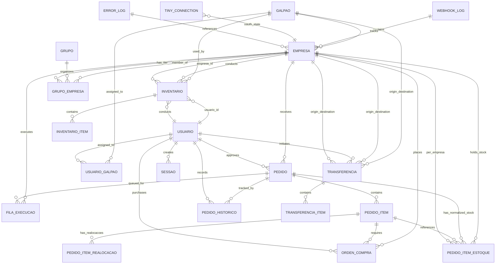

# SISO Database Schema Reference

Comprehensive schema documentation for the SISO (Sistema Inteligente de Separacao de Ordens) PostgreSQL database on Supabase project `wrbrbhuhsaaupqsimkqz`.

All tables are prefixed with `siso_`. This document covers all tables, columns, relationships, and lifecycle patterns.

---

## Table of Contents

1. [Core Business Tables](#core-business-tables)
2. [Hierarchy Tables (Galpão/Empresa/Grupo)](#hierarchy-tables)
3. [Stock & Inventory Tables](#stock--inventory-tables)
4. [Separation & Packing Tables](#separation--packing-tables)
5. [Purchase Orders (Compras) Tables](#purchase-orders-compras-tables)
6. [Inventory & Transfer Modules](#inventory--transfer-modules)
7. [WMS — Guarda (put-away)](#wms--guarda-put-away)
8. [Infrastructure Tables](#infrastructure-tables)
9. [Authentication & Sessions](#authentication--sessions)
10. [Cross (módulo de catálogo e equivalência)](#cross-módulo-de-catálogo-e-equivalência)
11. [Entity-Relationship Diagram](#entity-relationship-diagram)
12. [Data Lifecycle Patterns](#data-lifecycle-patterns)
13. [Important Queries & Access Patterns](#important-queries--access-patterns)
14. [Migration History Summary](#migration-history-summary)

---

## Core Business Tables

### siso_pedidos

**Purpose:** Orders from Tiny ERP e-commerce webhooks. Central table for the order lifecycle.

| Column | Type | Nullable | Default | Description |
|--------|------|----------|---------|-------------|
| `id` | text | NO | (PK) | Order ID from Tiny ERP |
| `numero` | text | NO | | Display number (e.g., "#123456") |
| `data` | timestamptz | NO | | Order date from Tiny |
| `filial_origem` | text | NO | | Origin branch code (legacy; use `empresa_origem_id`) |
| `empresa_origem_id` | uuid | YES | FK | Empresa that received the order |
| `idPedidoEcommerce` | text | YES | | E-commerce order ID (Mercado Livre, Shopee) |
| `nomeEcommerce` | text | YES | | E-commerce name |
| `cliente_nome` | text | YES | | Customer name |
| `cliente_cpf_cnpj` | text | YES | | Customer CPF/CNPJ |
| `forma_envio_id` | text | YES | | Tiny shipping method ID |
| `forma_envio_descricao` | text | YES | | Tiny shipping method name |
| `forma_frete_id` | text | YES | | Tiny freight form ID |
| `transportador_id` | text | YES | | Tiny carrier ID |
| `status` | text | NO | 'pendente' | Order processing status: `pendente`, `executando`, `concluido`, `cancelado`, `erro` |
| `sugestao` | text | YES | | System suggestion: `propria`, `transferencia`, `oc` |
| `sugestao_motivo` | text | YES | | Explanation of suggestion |
| `decisao_final` | text | YES | | Operator decision (same values as sugestao) |
| `tipo_resolucao` | text | YES | | `auto` (auto-approved) or `manual` (operator review) |
| `operador_id` | uuid | YES | FK | User who processed (if manual) |
| `operador_nome` | text | YES | | User name (denormalized) |
| `processado_em` | timestamptz | YES | | When operator approved/rejected |
| `marcadores` | text[] | YES | | Tiny order markers/tags |
| `separacao_tags` | text[] | YES | `{}` | User-created tags in separation module |
| `erro` | text | YES | | Error message if status = 'erro' |
| `estoque_lancado` | boolean | NO | false | Flag: stock already deducted in Tiny |
| `compra_estoque_lancado_alerta` | boolean | NO | false | Flag: alert if stock entered before cancellation |
| `status_separacao` | text | YES | | Separation status: `aguardando_compra`, `aguardando_nf`, `aguardando_separacao`, `em_separacao`, `pendente_realocacao`, `separado`, `embalado` |
| `separacao_galpao_id` | uuid | YES | FK | Galpão where separation happens |
| `separacao_operador_id` | uuid | YES | FK | User performing separation |
| `separacao_iniciada_em` | timestamptz | YES | | When wave picking started |
| `separacao_concluida_em` | timestamptz | YES | | When picking completed |
| `separacao_reenfileirado_em` | timestamptz | YES | null | **Fase 3 #3:** set when a partial pick with shelf stock left (loc_zerou=false + residual) sends the whole order back to the END of the separation queue. NULL = never re-queued (ordered by `data`); listing sorts NULL first by `data`, then re-queued by this timestamp. |
| `embalagem_concluida_em` | timestamptz | YES | | When packing completed |
| `embalagem_operador_id` | uuid | YES | FK | User who packed the order (may differ from separacao_operador_id) |
| `etiqueta_status` | text | YES | | Shipping label status: `pendente`, `imprimindo`, `impresso`, `falhou` |
| `etiqueta_url` | text | YES | | Shipping label URL (PrintNode receipt) |
| `etiqueta_zpl` | text | YES | | Raw ZPL content cached at separation |
| `url_danfe` | text | YES | | DANFE (NF invoice) URL |
| `chave_acesso_nf` | text | YES | | NF access key (unique NFe identifier) |
| `nota_fiscal_id` | bigint | YES | | Tiny NF ID |
| `agrupamento_tiny_id` | bigint | YES | | Deprecated: Tiny agrupamento (grouping) ID |
| `agrupamento_expedicao_id` | text | YES | | Tiny expedition grouping ID (used for label printing) |
| `expedicao_id` | text | YES | | Tiny expedition ID within agrupamento |
| `prazo_envio` | text | YES | | Shipping deadline string |
| `encaminhado_de` | text | YES | | Name of origin galpão when manually forwarded to another galpão |
| `vendedor_id` | uuid | YES | FK | Sales rep (vendedor cargo) responsible for the order — NULL for marketplaces unless manually assigned |
| `vendedor_nome` | text | YES | | Denormalized vendedor name. Auto-set to `"{nome_ecommerce} {empresa_nome}"` for ML/Shopee (e.g., "Mercado Livre EasyPeasy") |
| `origem_pedido` | text | NO | 'webhook' | `webhook` (Tiny/marketplace) or `manual` (inserted in /wms/vendas) |
| `canal_venda` | text | YES | | Sales channel for manual orders: `Balcão`, `WhatsApp`, `Telefone`, or free text. NULL for webhook orders |
| `criado_em` | timestamptz | NO | now() | Record creation timestamp |
| `atualizado_em` | timestamptz | YES | | Last update timestamp |

**Primary Key:** `id`

**Foreign Keys:**
- `empresa_origem_id` → `siso_empresas(id)`
- `separacao_galpao_id` → `siso_galpoes(id)`
- `separacao_operador_id` → `siso_usuarios(id)`
- `operador_id` → `siso_usuarios(id)`
- `vendedor_id` → `siso_usuarios(id) ON DELETE SET NULL`

**Indexes:**
- `idx_pedidos_separacao_galpao` (separacao_galpao_id, status_separacao) WHERE status_separacao IN ('aguardando_separacao', 'em_separacao')
- `idx_pedidos_separacao_aguardando` (separacao_galpao_id) WHERE status_separacao = 'aguardando_nf'
- `idx_pedidos_separacao_embalado` (separacao_galpao_id) WHERE status_separacao = 'embalado'
- `idx_pedidos_separacao_data` (separacao_galpao_id, data ASC) WHERE status_separacao IN ('aguardando_separacao', 'em_separacao')
- `idx_pedidos_reenfileirado` (separacao_reenfileirado_em) WHERE separacao_reenfileirado_em IS NOT NULL — **Fase 3 #3:** acelera ordenação "fim da fila" de parciais re-enfileirados
- `idx_siso_pedidos_separacao_tags` GIN index on separacao_tags
- `idx_pedidos_vendedor_id` (vendedor_id) WHERE vendedor_id IS NOT NULL — acelera filtro "Meus pedidos" do vendedor
- `idx_pedidos_vendas_diretas` (status, criado_em DESC) WHERE origem_pedido = 'manual' OR nome_ecommerce IN ('Mercado Livre','Shopee') — acelera listagem /wms/vendas

**Constraints:**
- `CHECK (status IN ('pendente', 'executando', 'concluido', 'cancelado', 'erro'))`
- `CHECK (status_separacao IS NULL OR status_separacao IN ('aguardando_compra', 'aguardando_nf', 'aguardando_separacao', 'em_separacao', 'pendente_realocacao', 'separado', 'embalado'))`
- `CHECK (etiqueta_status IS NULL OR etiqueta_status IN (...))`
- `siso_pedidos_origem_pedido_chk` — `CHECK (origem_pedido IN ('webhook','manual'))`

**Notes:**
- `filial_origem` is legacy (text like "CWB", "SP") — prefer `empresa_origem_id` in new code
- Stock is stored in normalized `siso_pedido_item_estoques`, not in `siso_pedidos`
- `marcadores` come from Tiny API; `separacao_tags` are user-created in the UI
- Column `imagem_url` removed (now joined via `siso_pedido_itens`)
- `origem_pedido='manual'` uses `id = "MAN-{uuid8}-{ts36}"` (e.g., "MAN-a1b2c3d4-l9k7"). `payload_original` may contain `{idempotency_key, manual: true}` for retry idempotency.
- `vendedor_nome` is auto-populated by `webhook-processor.ts` for Mercado Livre / Shopee. Manual assignment via `PATCH /api/wms/vendas/[id]/vendedor` is preserved across webhook re-deliveries (the upsert only overwrites if existing `vendedor_id IS NULL`).

---

### siso_pedido_itens

**Purpose:** Line items for each order, with barcode tracking and purchase information.

> **Fase 2.3 (2026-05-30) — colunas legadas 2-galpão DROPADAS.** `estoque_cwb_saldo/reservado/disponivel/deposito_id/deposito_nome`, `estoque_sp_*` (idem), `cwb_atende`, `sp_atende`, `localizacao_cwb`, `localizacao_sp` foram removidas (14 colunas). Herdadas do schema pré-WMS (estoque hardcoded a CWB|SP); estoque hoje é 3D em `siso_estoque`. Zero leitura no código; writes mortos removidos. Migration: `20260530_drop_legacy_2galpao_cols`.

| Column | Type | Nullable | Default | Description |
|--------|------|----------|---------|-------------|
| `id` | uuid | NO | (PK) | Unique item ID |
| `pedido_id` | text | NO | FK | Order ID |
| `produto_id` | bigint | NO | | Tiny product ID (in origin empresa) |
| `sku` | text | NO | | Product SKU |
| `descricao` | text | YES | | Product description |
| `quantidade_pedida` | integer | NO | | Ordered quantity |
| `quantidade` | integer | YES | | Current quantity (used in some contexts) |
| `imagem_url` | text | YES | | Product image URL (from Tiny) |
| `gtin` | text | YES | | EAN/GTIN barcode |
| `quantidade_bipada` | integer | NO | 0 | Quantity scanned during wave picking |
| `bipado_completo` | boolean | NO | false | Flag: all items picked for this product |
| `bipado_em` | timestamptz | YES | | When last item was scanned |
| `bipado_por` | uuid | YES | FK | User who scanned (last) |
| `separacao_marcado` | boolean | NO | false | Deprecated flag |
| `separacao_marcado_em` | timestamptz | YES | | Deprecated timestamp |
| `estoque_saida_lancada` | boolean | NO | false | Flag: stock deduction posted in Tiny (idempotency) |
| `produto_id_suporte` | bigint | YES | | Tiny product ID in support branch (if transferencia) |
| `produto_id_tiny` | bigint | YES | | Tiny product ID for direct API calls |
| `empresa_deducao_id` | uuid | YES | FK | Empresa where stock was deducted |
| `fornecedor_oc` | text | YES | | Supplier code for purchase order (SKU prefix match) |
| **Purchase-related columns:** | | | | |
| `ordem_compra_id` | uuid | YES | FK | Purchase order ID |
| `compra_status` | text | YES | | Item purchase status: `aguardando_compra`, `comprado`, `recebido`, `indisponivel`, `equivalente_pendente`, `cancelamento_pendente`, `cancelado` |
| `compra_quantidade_solicitada` | integer | NO | 0 | Quantity requested for purchase |
| `compra_quantidade_comprada` | integer | YES | | Quantity actually ordered by buyer (may differ from needed) |
| `compra_quantidade_recebida` | integer | NO | 0 | Quantity already received |
| `compra_solicitada_em` | timestamptz | YES | | When purchase was requested |
| `comprado_em` | timestamptz | YES | | When item was purchased |
| `comprado_por` | uuid | YES | FK | User who purchased |
| `comprado_por_nome` | text | YES | | Buyer name (denormalized for display) |
| `recebido_em` | timestamptz | YES | | When received at warehouse |
| `recebido_por` | uuid | YES | FK | User who received |
| **Equivalence handling:** | | | | |
| `compra_equivalente_sku` | text | YES | | Alternative SKU approved |
| `compra_equivalente_descricao` | text | YES | | Alternative product description |
| `compra_equivalente_produto_id_tiny` | bigint | YES | | Alternative Tiny product ID |
| `compra_equivalente_fornecedor` | text | YES | | Alternative supplier |
| `compra_equivalente_imagem_url` | text | YES | | Alternative product image |
| `compra_equivalente_gtin` | text | YES | | Alternative GTIN |
| `compra_equivalente_observacao` | text | YES | | Notes on equivalence |
| `compra_equivalente_definido_em` | timestamptz | YES | | When equivalence was set |
| `compra_equivalente_definido_por` | uuid | YES | FK | User who set equivalence |
| `compra_equivalente_sku_original` | text | YES | | Original SKU (before equivalence) |
| `compra_equivalente_descricao_original` | text | YES | | Original description |
| `compra_equivalente_produto_id_original` | bigint | YES | | Original Tiny product ID |
| **Short pick (parcial) columns:** | | | | |
| `quantidade_pega` | integer | YES | null | Qty actually picked in a partial pick (preserved across re-queue — Fase 3 #3) |
| `separacao_parcial` | boolean | NO | false | Flag: short pick **com `loc_zerou=true`** (cascade/encaminhar/OC; item fica marcado). **NÃO** é setado no caso "prateleira ainda tem" (Fase 3 #3): lá o item fica aberto (flag=false) pra poder ser re-pickado — `marcar-item`/`parcial`/`bipar-checklist` rejeitam `separacao_parcial=true`. O badge "Parcial X/Y" do checklist deriva de `quantidade_pega` (0 < pega < pedida && !marcado), não do flag. |
| `parcial_motivo` | text | YES | null | Reason: `loc_zerou` (cascade/encaminhar/OC). |
| `parcial_em` | timestamptz | YES | null | When the short pick was registered |
| `parcial_por` | uuid | YES | FK | User who registered the short pick |
| `mov_saida_id` | uuid | YES | FK | WMS movement ID for the saida created on mark/parcial |
| `mov_ajuste_loc_zerou_id` | uuid | YES | FK | WMS movement ID for loc_zerou physical adjustment |
| **Cancellation handling:** | | | | |
| `compra_cancelamento_motivo` | text | YES | | Reason for cancellation |
| `compra_cancelamento_solicitado_em` | timestamptz | YES | | When cancellation was requested |
| `compra_cancelamento_solicitado_por` | uuid | YES | FK | User who requested cancellation |
| `compra_cancelado_em` | timestamptz | YES | | When cancellation was confirmed |
| `compra_cancelado_por` | uuid | YES | FK | User who confirmed |

**Primary Key:** `id`

**Foreign Keys:**
- `pedido_id` → `siso_pedidos(id)` ON DELETE CASCADE
- `bipado_por` → `siso_usuarios(id)`
- `empresa_deducao_id` → `siso_empresas(id)`
- `ordem_compra_id` → `siso_ordens_compra(id)`
- `comprado_por` → `siso_usuarios(id)`
- `recebido_por` → `siso_usuarios(id)`
- `parcial_por` → `siso_usuarios(id)`
- `mov_saida_id` → `siso_movimentacoes(id)`
- `mov_ajuste_loc_zerou_id` → `siso_movimentacoes(id)`
- And similar FKs for equivalence and cancellation user references

**Indexes:**
- `idx_pedido_itens_gtin` (gtin) WHERE gtin IS NOT NULL AND bipado_completo = false
- `idx_pedido_itens_sku` (sku) WHERE bipado_completo = false
- `idx_pedido_itens_compra_status` (compra_status) WHERE compra_status IS NOT NULL
- `idx_pedido_itens_fornecedor_oc` (fornecedor_oc) WHERE fornecedor_oc IS NOT NULL
- `idx_pedido_itens_ordem_compra_id` (ordem_compra_id) WHERE ordem_compra_id IS NOT NULL
- `idx_pedido_itens_compra_equivalente_sku` (compra_equivalente_sku) WHERE compra_equivalente_sku IS NOT NULL
- `idx_pedido_itens_compra_cancelado` (pedido_id) WHERE compra_status = 'cancelado'
- `idx_pedido_itens_compra_solicitada_em` (compra_solicitada_em) WHERE compra_status IS NOT NULL

**Notes:**
- Unique constraint (pedido_id, produto_id) is implicit because each product appears once per order
- `bipado_*` columns track wave picking progress
- `estoque_saida_lancada` prevents double-deduction on job retries
- Purchase columns support full lifecycle: request → buy → receive → exceptions (equivalence, cancellation)

---

### siso_pedido_item_estoques — ⚠️ DROPADA (Fase 1.4 · 2026-05-28)

> **REMOVIDA.** Era um snapshot congelado do estoque no momento do webhook. Virou
> a raiz do loop de OC (decisões por saldo estale, pedido 937933727) e da loc-de-pick
> errada (937979990). Todos os ~13 consumidores foram migrados pra ler estoque **VIVO**
> de `siso_estoque` / da reserva `R` viva do ledger. Migration: `20260528_drop_siso_pedido_item_estoques`.
> A documentação histórica das colunas abaixo é mantida só pra referência.

**Purpose (histórico):** Normalized stock per empresa for each order item. Replaces hardcoded per-galpão columns.

| Column | Type | Nullable | Default | Description |
|--------|------|----------|---------|-------------|
| `id` | uuid | NO | (PK) | Unique row ID |
| `pedido_id` | text | NO | | Order ID |
| `produto_id` | bigint | NO | | Product ID in origin empresa |
| `empresa_id` | uuid | NO | FK | Empresa holding this stock |
| `produto_id_na_empresa` | bigint | YES | | Product ID in this specific empresa (may differ from produto_id) |
| `deposito_id` | integer | YES | | Tiny deposit (warehouse) ID |
| `deposito_nome` | text | YES | | Deposit name (cached) |
| `saldo` | numeric | NO | 0 | Available balance |
| `reservado` | numeric | NO | 0 | Reserved quantity |
| `disponivel` | numeric | NO | 0 | Available after reservation |
| `localizacao` | text | YES | | Product location in warehouse |
| `criado_em` | timestamptz | NO | now() | Record creation |

**Primary Key:** `id`

**Foreign Keys:**
- `pedido_id` → `siso_pedidos(id)` ON DELETE CASCADE
- `empresa_id` → `siso_empresas(id)`

**Unique Constraint:**
- `(pedido_id, produto_id, empresa_id)`

**Indexes:**
- `idx_item_estoques_unique` (pedido_id, produto_id, empresa_id)
- `idx_item_estoques_pedido` (pedido_id)

**Notes:**
- One row per (pedido, produto, empresa) combination
- API aggregates by galpão for dynamic stock display
- `produto_id_na_empresa` added in migration 20260324 to support cloning products to other empresas
- Replaces deprecated `estoque_cwb_*` / `estoque_sp_*` columns in `siso_pedido_itens`

---

### siso_pedido_item_realocacoes

**Purpose:** Re-allocation candidates created when a short pick zeroes a location. Each row points to an alternate location where the remaining qty can be picked.

> **3D refactor (2026-05-20):** as colunas `empresa_dona_id`, `empresa_nome`, `is_emprestimo` e `empresa_devedora_id` foram preservadas no schema mas **deixaram de ser populadas** — empresa não é mais coordenada física e empréstimo entre empresas foi arquivado. Inserts novos via `POST /api/wms/separacao/parcial` deixam esses campos como NULL/false/legacy.

| Column | Type | Nullable | Default | Description |
|--------|------|----------|---------|-------------|
| `id` | uuid | NO | (PK) | Realocacao ID |
| `pedido_item_id` | bigint | NO | FK | Parent item in `siso_pedido_itens` |
| `empresa_dona_id` | uuid | NO | FK | **LEGACY (3D)** — não populado em inserts novos. |
| `empresa_nome` | text | NO | | **LEGACY (3D)** — denormalizado, não populado em inserts novos. |
| `localizacao_id` | uuid | NO | FK | WMS location UUID |
| `localizacao_codigo` | text | NO | | Location code (e.g., "A1-2-3") — denormalized for display |
| `quantidade` | integer | NO | | Qty to be picked from this location (CHECK > 0) |
| `is_emprestimo` | boolean | NO | false | **LEGACY (3D)** — sempre `false` em inserts novos (empréstimo arquivado). |
| `empresa_devedora_id` | uuid | YES | FK | **LEGACY (3D)** — sempre NULL em inserts novos. |
| `status` | text | NO | 'aguardando_picking' | Status: `aguardando_picking`, `picado`, `picado_parcial`, `cancelado` |
| `mov_id` | uuid | YES | FK | WMS movement ID after picking (set on `marcar-realocacao` or modo realocação do parcial) |
| `operador_id` | uuid | YES | FK | User who picked this realocacao |
| `picado_em` | timestamptz | YES | | When this realocacao was picked |
| `cancelado_em` | timestamptz | YES | | When this realocacao was cancelled |
| `criado_em` | timestamptz | NO | now() | Record creation |
| `parent_realocacao_id` | uuid | YES | FK | Self-ref. NULL = realocação raiz (criada direto pelo parcial do item); não-NULL = nó da chain de cascade. |
| `quantidade_pega` | integer | YES | | Qty efetivamente pega (pode ser < `quantidade` quando houve parcial; NULL no fluxo legado via `marcar-realocacao`). |
| `parcial` | boolean | NO | false | true se a realocação foi parcial e gerou cascade (ou sem cobertura). |
| `parcial_motivo` | text | YES | | `cascade_parcial` \| `cascade_loc_zerou` (legado: `loc_zerou` na raiz criada pelo modo item). |
| `parcial_em` | timestamptz | YES | | Quando o parcial foi registrado. |
| `parcial_por` | uuid | YES | FK | Usuário que registrou o parcial. |
| `mov_ajuste_loc_zerou_id` | uuid | YES | FK | Referência à mov `ajuste_pick_zerou` gerada quando a loc zerou no picking da realocação. |

**Primary Key:** `id`

**Foreign Keys:**
- `pedido_item_id` → `siso_pedido_itens(id)` ON DELETE CASCADE
- `empresa_dona_id` → `siso_empresas(id)`
- `empresa_devedora_id` → `siso_empresas(id)`
- `localizacao_id` → `siso_localizacoes(id)`
- `mov_id` → `siso_movimentacoes(id)`
- `operador_id` → `siso_usuarios(id)`
- `parent_realocacao_id` → `siso_pedido_item_realocacoes(id)` (self-ref)
- `parcial_por` → `siso_usuarios(id)`
- `mov_ajuste_loc_zerou_id` → `siso_movimentacoes(id)`

**Indexes:**
- Partial index on `(pedido_item_id)` WHERE `status = 'aguardando_picking'`
- `idx_realoc_parent` em `parent_realocacao_id` — suporta navegação da chain pra debug e reconciliação

**Constraints:**
- `CHECK (quantidade > 0)`
- `CHECK ((is_emprestimo = true AND empresa_devedora_id IS NOT NULL) OR (is_emprestimo = false AND empresa_devedora_id IS NULL))`
- `CHECK (status IN ('aguardando_picking', 'picado', 'picado_parcial', 'cancelado'))`

**Status (transições terminais):**
- `picado_parcial` (terminal): `quantidade_pega < quantidade`, sistema disparou cascade (criou descendente OU marcou pedido `pendente_realocacao` por sem_cobertura).
- `picado` (terminal, sucesso): `quantidade_pega == quantidade` ou via `marcar-realocacao` endpoint (sem modal).
- `cancelado` (terminal): cancelada via `DELETE /api/wms/separacao/realocacao/[id]` (sem mov).

**Notes:**
- Created by `POST /api/wms/separacao/parcial` when the re-allocation cascade finds coverage (modo item ou modo realocação)
- Picked via `POST /api/wms/separacao/marcar-realocacao` (creates WMS movement, fluxo simples) ou via `POST /api/wms/separacao/parcial` modo realocação (parcial com cascade)
- Cancelled via `DELETE /api/wms/separacao/realocacao/[id]` (no movement — nothing was picked)
- All rows cancelled automatically when parent item is desfazer-parcial'd or onda is cancelled
- `checklist-items` endpoint returns realocações em **todos os status** em `item.realocacoes[]` — UI exibe ativas como interativas e terminais como histórico (read-only com badges semânticos)
- Spec: `docs/superpowers/specs/2026-05-18-realocacao-cascateavel-design.md`

---

## Hierarchy Tables

### siso_galpoes

**Purpose:** Physical warehouse locations.

| Column | Type | Nullable | Default | Description |
|--------|------|----------|---------|-------------|
| `id` | uuid | NO | (PK) | Galpão ID |
| `nome` | text | NO | UNIQUE | Display name (e.g., "CWB", "SP") |
| `descricao` | text | YES | | Description |
| `ativo` | boolean | NO | true | Active flag |
| `printnode_printer_id` | bigint | YES | | Default PrintNode printer ID (etiqueta de envio) |
| `printnode_printer_nome` | text | YES | | Printer name (cached) |
| `printnode_account_id` | uuid | YES | FK | Conta PrintNode dona da impressora de envio. ON DELETE SET NULL → `resolverImpressora` retorna null. |
| `printnode_printer_id_produto` | bigint | YES | | Dedicated PrintNode printer pra etiqueta de produto (recebimento/guarda). NULL → fallback pra `printnode_printer_id`. |
| `printnode_printer_nome_produto` | text | YES | | Cached name da impressora de produto |
| `printnode_account_id_produto` | uuid | YES | FK | Conta PrintNode dona da impressora de produto. ON DELETE SET NULL. |
| `criado_em` | timestamptz | NO | now() | Creation timestamp |
| `atualizado_em` | timestamptz | NO | now() | Last update |

**Primary Key:** `id`

**Unique Constraint:** `nome`

**Foreign Keys:**
- `printnode_account_id` → `siso_printnode_contas(id)` ON DELETE SET NULL
- `printnode_account_id_produto` → `siso_printnode_contas(id)` ON DELETE SET NULL

**Notes:**
- Seeded with "CWB" and "SP" but flexible for additional locations
- Multiple empresas can belong to one galpão
- Migration `20260514_wms_guarda_pendencias` adicionou os campos `_produto` + auto-criou 1 `siso_localizacoes` tipo='recebimento' (codigo='RECEBIMENTO') por galpão ativo
- Migration `20260519_printnode_multi_contas` adicionou `printnode_account_id` + `_produto` pra suportar múltiplas contas PrintNode (uma key por conta)

---

### siso_empresas

**Purpose:** Tiny ERP accounts, one per CNPJ.

| Column | Type | Nullable | Default | Description |
|--------|------|----------|---------|-------------|
| `id` | uuid | NO | (PK) | Empresa ID |
| `nome` | text | NO | | Display name (e.g., "NetAir", "NetParts") |
| `cnpj` | text | NO | UNIQUE | 14-digit CNPJ |
| `galpao_id` | uuid | NO | FK | Physical location |
| `ativo` | boolean | NO | true | Active flag |
| `criado_em` | timestamptz | NO | now() | Creation |
| `atualizado_em` | timestamptz | NO | now() | Last update |

**Primary Key:** `id`

**Foreign Keys:**
- `galpao_id` → `siso_galpoes(id)`

**Unique Constraint:** `cnpj`

**Indexes:**
- `idx_empresas_galpao` (galpao_id)
- `idx_empresas_cnpj` (cnpj)

**Notes:**
- One CNPJ = one Tiny ERP account = one empresa
- CNPJ is used to identify orders in webhooks
- Multiple empresas can share a galpão

---

### siso_grupos

**Purpose:** Business affinity groups for cross-empresa stock sharing.

| Column | Type | Nullable | Default | Description |
|--------|------|----------|---------|-------------|
| `id` | uuid | NO | (PK) | Grupo ID |
| `nome` | text | NO | UNIQUE | Display name (e.g., "Autopeças") |
| `descricao` | text | YES | | Description |
| `criado_em` | timestamptz | NO | now() | Creation |
| `atualizado_em` | timestamptz | NO | now() | Last update |

**Primary Key:** `id`

**Unique Constraint:** `nome`

**Notes:**
- Seeded with "Autopeças" but can have multiple grupos
- Empresas in same grupo check stock across each other

---

### siso_grupo_empresas

**Purpose:** N:M relationship between grupos and empresas with deduction tier.

| Column | Type | Nullable | Default | Description |
|--------|------|----------|---------|-------------|
| `id` | uuid | NO | (PK) | Relation ID |
| `grupo_id` | uuid | NO | FK | Grupo |
| `empresa_id` | uuid | NO | FK | Empresa |
| `tier` | integer | NO | 1 | Deduction priority (1 = highest, origin always gets override) |
| `criado_em` | timestamptz | NO | now() | Creation |

**Primary Key:** `id`

**Foreign Keys:**
- `grupo_id` → `siso_grupos(id)` ON DELETE CASCADE
- `empresa_id` → `siso_empresas(id)` ON DELETE CASCADE

**Unique Constraint:** `(empresa_id)` — each empresa in at most one grupo

**Indexes:**
- `idx_grupo_empresas_grupo` (grupo_id)

**Notes:**
- Execution worker deducts stock in tier order: tier 1 first, then tier 2, etc.
- Origin empresa gets automatic tier 1 override at runtime regardless of table value
- CHECK constraint: `tier > 0`

---

## Stock & Inventory Tables

### siso_fila_execucao

**Purpose:** Execution queue for approved orders. Jobs post stock to Tiny ERP with retry logic.

| Column | Type | Nullable | Default | Description |
|--------|------|----------|---------|-------------|
| `id` | uuid | NO | (PK) | Job ID |
| `pedido_id` | text | NO | | Order ID |
| `tipo` | text | NO | 'lancar_estoque' | Job type: `lancar_estoque`, `lancar_estoque_pos_nf`, `varredura_pos_entrada`, `reconciliar_oc_retry` (últimos 2 = jobs de manutenção, Fase 5) |
| `filial_execucao` | text | YES | | Legacy: branch code (`CWB`/`SP`; jobs de manutenção usam sentinela `MAINT`) |
| `empresa_id` | uuid | YES | FK | Empresa for this job |
| `decisao` | text | NO | | Decision: `propria`, `transferencia`, `oc` (jobs de manutenção usam sentinela `manutencao`) |
| `status` | text | NO | 'pendente' | Queue status: `pendente`, `executando`, `concluido`, `erro`, `cancelado` |
| `tentativas` | integer | NO | 0 | Retry count |
| `max_tentativas` | integer | NO | 3 | Max retries allowed |
| `prioridade` | boolean | NO | false | High-priority flag: processed before normal jobs |
| `erro` | text | YES | | Error message on failure |
| `operador_id` | text | YES | | User who approved |
| `operador_nome` | text | YES | | User name (denormalized) |
| `executado_em` | timestamptz | YES | | When job completed |
| `proximo_retry_em` | timestamptz | YES | | Exponential backoff: next retry time |
| `criado_em` | timestamptz | NO | now() | Creation |
| `atualizado_em` | timestamptz | NO | now() | Last update |
| `payload` | jsonb | NO | `'{}'::jsonb` | Extra job data. Added by fix-pack 2026-05-18. Currently usado por `lancar_estoque` e `lancar_estoque_pos_nf` para carregar `itens_ja_lancados: number[]` — IDs dos `siso_pedido_itens` cujo estoque já foi deduzido via realocação/parcial. O worker pula esses itens. |

**Primary Key:** `id`

**Foreign Keys:**
- `empresa_id` → `siso_empresas(id)`

**Indexes:**
- `idx_fila_status_retry` (status, proximo_retry_em) WHERE status = 'pendente'
- `idx_fila_pedido` (pedido_id)
- `idx_fila_empresa` (empresa_id)
- `idx_fila_prioridade` (prioridade DESC, criado_em ASC) WHERE status = 'pendente'

**Constraints:**
- `chk_fila_tipo`: `CHECK (tipo IN ('lancar_estoque', 'lancar_estoque_pos_nf', 'varredura_pos_entrada', 'reconciliar_oc_retry'))` — Fase 5 (`20260611_fila_jobs_manutencao.sql`) adicionou os 2 tipos de manutenção.
- `chk_fila_decisao`: `CHECK (decisao IN ('propria', 'transferencia', 'oc', 'manutencao'))` — Fase 5 adicionou o sentinela `manutencao`.
- `chk_fila_filial`: `CHECK (filial_execucao IN ('CWB', 'SP', 'MAINT'))` — **Fase 5 CRIOU este CHECK** (não existia em staging antes); o `MAINT` é o sentinela dos jobs de manutenção.
- `CHECK (status IN ('pendente', 'executando', 'concluido', 'erro', 'cancelado'))`

**Notes:**
- Fire-and-forget: webhook returns 200, queue processes async
- Exponential backoff on retry: 60s → 300s → 1800s
- Max 3 retries, then transitions to `erro` status
- `filial_execucao` is legacy; prefer `empresa_id`
- `payload.itens_ja_lancados` (fix-pack 2026-05-18): array de IDs dos itens cuja saída já foi gerada no ledger via parcial/realocação — o worker pula esses itens pra não duplicar deduções. Default `[]` (sem itens pré-lançados).
- **Jobs de manutenção (Fase 5):** os tipos `varredura_pos_entrada`/`reconciliar_oc_retry` dão durabilidade ao reconciliador OC + varredura pós-entrada (antes fire-and-forget na app, perdiam-se em queda). Eles **não** usam as colunas legadas `filial_execucao`/`decisao` — gravam os sentinelas `MAINT`/`manutencao` e carregam a info real em `payload`.

---

## Separation & Packing Tables

### siso_pedido_historico

**Purpose:** Immutable audit trail of order lifecycle events.

| Column | Type | Nullable | Default | Description |
|--------|------|----------|---------|-------------|
| `id` | uuid | NO | (PK) | Event ID |
| `pedido_id` | text | NO | FK | Order ID |
| `evento` | text | NO | | Event type (see notes) |
| `usuario_id` | uuid | YES | FK | User who triggered event |
| `usuario_nome` | text | YES | | User name (denormalized) |
| `detalhes` | jsonb | NO | '{}' | Structured event data |
| `criado_em` | timestamptz | NO | now() | Event timestamp |

**Primary Key:** `id`

**Foreign Keys:**
- `pedido_id` → `siso_pedidos(id)` ON DELETE CASCADE
- `usuario_id` → `siso_usuarios(id)`

**Indexes:**
- `idx_pedido_historico_pedido` (pedido_id, criado_em ASC)

**Event Types (documented, not enforced for flexibility):**
- `recebido` — webhook received, order created
- `auto_aprovado` — auto-approved (propria, no review)
- `aprovado` — manually approved by operator
- `aguardando_nf` — waiting for NF authorization
- `nf_autorizada` — NF authorized via webhook
- `aguardando_separacao` — ready for wave picking
- `separacao_iniciada` — wave picking started
- `item_separado` — individual item scanned
- `separacao_concluida` — all items separated
- `embalagem_iniciada` — packing started
- `item_embalado` — item confirmed in packing
- `embalagem_concluida` — all items packed
- `etiqueta_impressa` — shipping label printed
- `etiqueta_falhou` — label print failed
- `cancelado` — order cancelled
- `erro` — processing error
- `parcial_loc_zerou` — short pick registered; 1-2 WMS movements created
- `realocacao_picada` — re-allocation picked from alternate location
- `realocacao_cancelada` — pending re-allocation cancelled (no pick)
- `realocacao_sem_cobertura_galpao` — short pick with no re-allocation coverage; pedido moved to `pendente_realocacao`
- `parcial_desfeito` — short pick fully undone; all movements estorned

**Notes:**
- Write via `registrarEvento()` in historico-service.ts
- Fire-and-forget safe (async)
- `detalhes` JSONB field can contain arbitrary context

---

## Purchase Orders (Compras) Tables

### siso_ordens_compra

**Purpose:** Purchase orders grouped by supplier.

| Column | Type | Nullable | Default | Description |
|--------|------|----------|---------|-------------|
| `id` | uuid | NO | (PK) | PO ID |
| `fornecedor` | text | NO | | Supplier name |
| `empresa_id` | uuid | NO | FK | Empresa placing the order |
| `galpao_id` | uuid | YES | FK | Galpão receiving goods |
| `status` | text | NO | 'comprado' | PO status: `aguardando_compra`, `comprado`, `parcialmente_recebido`, `recebido`, `cancelado` |
| `observacao` | text | YES | | Notes |
| `comprado_por` | uuid | YES | FK | User who purchased |
| `comprado_em` | timestamptz | YES | | When purchase was made |
| `created_at` | timestamptz | NO | now() | Record creation |

**Primary Key:** `id`

**Foreign Keys:**
- `empresa_id` → `siso_empresas(id)`
- `galpao_id` → `siso_galpoes(id)`
- `comprado_por` → `siso_usuarios(id)`

**Indexes:**
- `idx_ordens_compra_status` (status)
- `idx_ordens_compra_fornecedor` (fornecedor)

**Notes:**
- PO created when an order item needs purchase (`decisao = 'oc'`)
- Multiple items can belong to same PO if from same supplier
- Status transitions: waiting → purchased → partially/fully received
- Items linked via `siso_pedido_itens.ordem_compra_id`

---

## Inventory & Transfer Modules

> **Dropadas na Fase 0 (2026-05-28).** As tabelas legadas `siso_inventarios`,
> `siso_inventario_itens`, `siso_transferencias` e `siso_transferencia_itens`
> (inventário v1 + modelo de transferência antigo) foram removidas — estavam
> com 0 linhas e sem leitura no código. Os modelos ativos são:
>
> - **Inventário:** `siso_inventario_sessoes` / `siso_inventario_localizacoes` /
>   `siso_inventario_contagens` / `siso_inventario_divergencias` (v2 pull queue,
>   documentado em [`CLAUDE.md`](../CLAUDE.md) seção "WMS Tables (Plano 4)").
> - **Transferência inter-galpão:** `siso_transferencias_galpao` (ledger 3D).
>
> Migration: `supabase/migrations/20260606_drop_tabelas_legadas_superadas.sql`.

> **`siso_inventario_sessoes.continua boolean DEFAULT false` (acerto de prateleira, Fase 1).**
> Marca a sessão operacional contínua (1 por galpão, índice único parcial
> `uniq_sessao_continua_galpao`) que hospeda as contagens inline do pick — a
> reconciliação de saldo disparada pelo `acao='encontrei'` + `qty_contada` em
> `POST /api/wms/separacao/validar-oc-item`. Não é uma sessão de ciclo normal:
> fica sempre aberta e acumula contagens avulsas conforme o operador acerta
> prateleiras durante a separação.

---

## WMS — Guarda (put-away)

Tabela introduzida em 2026-05-14 pelo split do recebimento em 2 etapas (dock + guarda). As outras tabelas WMS (siso_produtos, siso_estoque, siso_movimentacoes, siso_localizacoes, siso_custo_medio, etc.) estão documentadas em [`CLAUDE.md`](../CLAUDE.md) na seção "WMS Tables".

### siso_wms_pendencias_guarda

**Purpose:** Fila de pendências de put-away. 1 linha por linha de recebimento (preserva rastreio NF/lote). Criada pelo `POST /api/wms/receber`, consumida pela tela `/wms/guarda` (tablet).

> **3D (2026-05-20):** coluna `empresa_dona_id` foi dropada (migration `20260520g_drop_dona_pendencias.sql`). Empresa compradora vive em `siso_movimentacoes.empresa_compradora_id` da `mov_entrada_id`. Índice `idx_pendencias_guarda_produto` recriado sem dona como `(produto_id, galpao_id)`.

| Column | Type | Nullable | Default | Description |
|--------|------|----------|---------|-------------|
| `id` | uuid | NO | gen_random_uuid() | PK |
| `produto_id` | uuid | NO | FK | → `siso_produtos(id)` |
| `galpao_id` | uuid | NO | FK | → `siso_galpoes(id)` |
| `localizacao_origem_id` | uuid | NO | FK | → `siso_localizacoes(id)` — loc tipo='recebimento' (dock) |
| `mov_entrada_id` | uuid | NO | FK | → `siso_movimentacoes(id)` da entrada que gerou a pendência |
| `nf_referencia` | text | YES | | NF de origem (rastreio) |
| `origem_tipo` | text | NO | | Herdado da mov (CHECK: enum de 18 valores em `siso_movimentacoes_origem_tipo_check`). |
| `custo_unitario` | numeric(14,4) | YES | | Custo unitário declarado no recebimento |
| `qty_inicial` | numeric(14,4) | NO | | Quantidade original a guardar (CHECK > 0) |
| `qty_guardada` | numeric(14,4) | NO | 0 | Quantidade já guardada (CHECK ≥ 0, ≤ qty_inicial) |
| `qty_pendente` | numeric(14,4) | NO | GENERATED | `qty_inicial - qty_guardada` (STORED — não editável) |
| `status` | text | NO | 'pendente' | `pendente \| em_guarda \| guardada \| cancelada` |
| `iniciada_em` | timestamptz | YES | | Quando operador clicou no card |
| `iniciada_por` | uuid | YES | FK → siso_usuarios | |
| `guardada_em` | timestamptz | YES | | Setado quando qty_pendente=0 |
| `cancelada_em` | timestamptz | YES | | |
| `cancelada_por` | uuid | YES | FK → siso_usuarios | |
| `motivo_cancelamento` | text | YES | | Obrigatório (≥3 chars) quando status='cancelada' |
| `observacoes` | text | YES | | |
| `tracking_origem_ids` | text[] | YES | | **Fix-Final B (2026-05-28)** — scaffolding futuro para vincular a pendência a múltiplos IDs de NF/tracking. Population adiada — não há campo no payload do webhook atual. Coluna adicionada por `20260528_pendencias_tracking_origem_ids.sql`. |
| `criada_em` | timestamptz | NO | now() | |
| `atualizada_em` | timestamptz | NO | now() | Atualizado por trigger |

**Primary Key:** `id`

**Foreign Keys:** `produto_id`, `galpao_id`, `localizacao_origem_id`, `mov_entrada_id`, `iniciada_por`, `cancelada_por`

**Indexes:**
- `idx_pendencias_guarda_fila` (galpao_id, status, criada_em) WHERE status IN ('pendente','em_guarda') — feed da lista ativa
- `idx_pendencias_guarda_mov` (mov_entrada_id) — rastreio inverso (mov → pendência)
- `idx_pendencias_guarda_produto` (produto_id, galpao_id) — dashboards por produto (recriado sem dona em 2026-05-20)

**Check Constraints:**
- `qty_inicial > 0`
- `qty_guardada >= 0`
- `qty_guardada <= qty_inicial`
- status='guardada' exige `qty_guardada = qty_inicial AND guardada_em IS NOT NULL`
- status='cancelada' exige `cancelada_em IS NOT NULL`

**Triggers:**
- `trg_pendencias_guarda_touch` (BEFORE UPDATE) → atualiza `atualizada_em`

**State Machine:**
```
pendente ──iniciar──> em_guarda ──confirmar (parcial)──> pendente (qty_pendente > 0)
                              ──confirmar (total)─────> guardada (terminal)
                              ──cancelar──────────────> cancelada (terminal)
```

**Notes:**
- Cancelamento NÃO move estoque — a peça continua em `siso_estoque` na loc origem. Saída física é fluxo separado (ajuste manual ou devolução fornecedor).
- Confirmação dispara `replenishmentIntraGalpao` (2 movs `transferencia_localizacao` com mesmo `origem_id`) saindo da loc RECEBIMENTO. Custo médio é propagado da loc origem pra loc destino antes da mov.
- Guarda parcial é o caso comum quando a loc destino lota: pendência fica aberta com `qty_pendente` decrescido.

---

## WMS — Mini-Swap / Swap Inter-Empresa (ARQUIVADO em 2026-05-20)

> Tabela `siso_wms_mini_swap_config` **dropada** com o ledger simplificado 3D (migration `20260520_ledger_simplificado.sql`). RPCs `wms_executar_mini_swap`, `wms_executar_swap` e `wms_saldos_devedores` também foram dropadas. Razão: empresa deixou de ser coordenada física — não há mais "trocar dona" no estoque. Apuração por empresa virou report (`/api/wms/relatorios/*`) sobre tags de movs. Código TypeScript preservado em `src/lib/wms/_archive/` pra referência histórica.
>
> O valor `'swap'` foi também **removido** do CHECK constraint `siso_movimentacoes_origem_tipo_check` (lista de 18 valores válidos agora — ver descrição de `siso_movimentacoes` em CLAUDE.md).

---

## WMS — Realocação Fix-Pack (2026-05-18)

Objetos introduzidos pelo fix-pack da realocação cascateável (24 achados de auditoria fechados em 36 tasks). Spec/plano: `docs/superpowers/specs/2026-05-18-realocacao-cascateavel-fix-pack-design.md`, `docs/superpowers/plans/2026-05-18-realocacao-cascateavel-fix-pack.md`.

### siso_pedido_item_mov_links

**Purpose:** Bridge table N:M entre `siso_pedido_itens` e `siso_movimentacoes`. Necessária porque em wave consolidado **uma única mov S pode atender N itens** (mesma quádrupla escolhida pra múltiplos pedidos da wave). Sem a bridge, estornar 1 item exigia ou estornar a mov inteira (errado — afeta outros itens) ou perder o rastreio. Cada linha registra a fatia que aquele (item, realocação?) consumiu da mov, permitindo `wms_estornar_parcial_movimentacao` estornar proporcionalmente.

| Column | Type | Nullable | Default | Description |
|--------|------|----------|---------|-------------|
| `id` | uuid | NO | `gen_random_uuid()` | PK |
| `pedido_item_id` | bigint | NO | FK | → `siso_pedido_itens(id)` ON DELETE CASCADE |
| `realocacao_id` | uuid | YES | FK | → `siso_pedido_item_realocacoes(id)` ON DELETE CASCADE. NULL = mov da raiz do parcial (modo item); não-NULL = mov de pick de uma realocação |
| `mov_id` | uuid | NO | FK | → `siso_movimentacoes(id)` (sem cascade — ledger é imutável) |
| `qty` | integer | NO | | Quantidade que esta linha (item, realocação?) consumiu da mov. `CHECK (qty > 0)` |
| `tipo_link` | text | NO | | `'saida'` (mov S de venda/empréstimo) ou `'ajuste_loc_zerou'` (mov S de `ajuste_pick_zerou` quando a loc zerou). `CHECK (tipo_link IN ('saida','ajuste_loc_zerou'))` |
| `criado_em` | timestamptz | NO | `now()` | Criação |

**Primary Key:** `id`

**Foreign Keys:**
- `pedido_item_id` → `siso_pedido_itens(id)` ON DELETE CASCADE
- `realocacao_id` → `siso_pedido_item_realocacoes(id)` ON DELETE CASCADE
- `mov_id` → `siso_movimentacoes(id)` (no cascade)

**Indexes:**
- `idx_mov_links_mov` (mov_id) — descobrir todos os consumidores de uma mov (suporta `wms_estornar_parcial_movimentacao`)
- `idx_mov_links_item` (pedido_item_id) — descobrir todas as movs de um item (suporta `desfazer-parcial` e `cancelar`)
- `idx_mov_links_realoc` (realocacao_id) WHERE realocacao_id IS NOT NULL — descobrir mov de uma realocação específica (suporta cascade DELETE)

**Constraints:**
- UNIQUE `(pedido_item_id, realocacao_id, mov_id, tipo_link)` — evita duplicação de link

**Populado por:**
- `POST /api/wms/separacao/marcar-realocacao` — 1 linha (tipo_link='saida', realocacao_id=NN)
- `POST /api/wms/separacao/parcial` (modo item) — 1-2 linhas (tipo_link='saida' + opcional 'ajuste_loc_zerou', realocacao_id=NULL)
- `POST /api/wms/separacao/parcial` (modo realocação) — N linhas (1 por realocacao_id, tipo_link='saida' + opcional 'ajuste_loc_zerou')
- `POST /api/wms/separacao/marcar-item` — 1 linha (tipo_link='saida', realocacao_id=NULL)

**Consumido por:**
- `POST /api/wms/separacao/desfazer-parcial` — lê links onde `realocacao_id IS NULL` e estorna proporcionalmente
- `POST /api/wms/separacao/cancelar` — lê todos os links dos itens e estorna via Set dedupado de mov_ids
- `DELETE /api/wms/separacao/realocacao/[id]` — cascade pelo FK quando a realocação é cancelada (mas só pra rows ON DELETE CASCADE — se a realocação já foi pickada, o DELETE é bloqueado pelo 409)

---

### siso_movimentacoes.qty_estornada (new column)

**Coluna adicionada por fix-pack 2026-05-18.**

| Column | Type | Nullable | Default | Description |
|--------|------|----------|---------|-------------|
| `qty_estornada` | numeric(14,4) | NO | 0 | Quantidade acumulada já estornada desta movimentação. `CHECK (qty_estornada >= 0)`. Permite estornos proporcionais sucessivos quando a mov é compartilhada entre múltiplos itens (wave consolidado). |

**Backfill:** A migration setou `qty_estornada = quantidade` para todas as movs que tinham um par `estorno_de` existente — preservando contabilidade pré-fix-pack (estornos antigos eram sempre totais).

**Invariantes:**
- `qty_estornada <= quantidade` (mov não pode ser estornada além de seu próprio total)
- Movs com `tipo='E'` ou `'L'` ou que sejam elas mesmas estornos (`estorno_de IS NOT NULL`) **nunca** têm `qty_estornada` incrementada — o estorno-de-estorno é vedado pela RPC

**Consumido por:**
- `wms_estornar_parcial_movimentacao` — incrementa após gerar mov contrária

---

### siso_movimentacoes.devolucao_id (new column — Fix-Final B 2026-05-28)

**Coluna adicionada por `20260528_movs_devolucao_id.sql`.**

| Column | Type | Nullable | Default | Description |
|--------|------|----------|---------|-------------|
| `devolucao_id` | uuid | YES | NULL | FK → `siso_devolucoes_pendentes(id)` ON DELETE SET NULL. Populada por `classificarDevolucao` via UPDATE-after-insert (após inserir movs do RPC). Permite lookup determinístico na desclassificação (`desclassificarDevolucao`) em vez de janela temporal ±60s. |

**Index:** `ix_siso_movimentacoes_devolucao_id` — partial index em `(devolucao_id) WHERE devolucao_id IS NOT NULL`. Garante busca O(1) ao estornar movs de uma devolução.

**Populating:** `classificarDevolucao` em `src/lib/wms/devolucoes.ts` faz `UPDATE siso_movimentacoes SET devolucao_id = $devolucao_id WHERE id = ANY($mov_ids)` após inserir. RPC `wms_inserir_movimentacao` não conhece `devolucao_id` — link é feito na camada de aplicação.

**Consumido por:**
- `desclassificarDevolucao` (`POST /api/wms/devolucoes/[id]/desclassificar`) — busca `SELECT id FROM siso_movimentacoes WHERE devolucao_id = $id` e estorna cada mov determinística, sem janela temporal.

---

### siso_movimentacoes.idempotency_key (new column — Raio-X Fase 5 P072)

**Coluna adicionada por `20260607b_movimentacoes_idempotency_key.sql`.**

| Column | Type | Nullable | Default | Description |
|--------|------|----------|---------|-------------|
| `idempotency_key` | uuid | YES | NULL | Token client-gerado pra deduplicar **picks sem reserva**. Nullable — não afeta movs legadas. |

**Index:** `uq_mov_idempotency_key` — UNIQUE **parcial** em `(idempotency_key) WHERE idempotency_key IS NOT NULL`. O 2º INSERT com a mesma key estoura `SQLSTATE 23505`; mas o caminho normal nem chega lá — `wms_inserir_movimentacao` checa a key ANTES de mutar e retorna a mov existente (no-op idempotente).

**Consumido por:**
- `wms_inserir_movimentacao` (param `p_idempotency_key`, `20260607c`): antes de qualquer mutação, se já existe mov com essa key, retorna a mov existente — fecha o duplo-pick sem-reserva sob concorrência.
- `wms_pick_item_atomico` (param `p_idempotency_key`, `20260607d`): propaga o token pra S **apenas** no ramo sem-reserva (`p_reserva_id IS NULL`); com reserva, a R `FOR UPDATE` já serializa.
- `POST /api/wms/separacao/marcar-item` (body `idempotency_key`): passa o token só quando não há reserva viva.

---

### Índices de performance P0 (`20260531_perf_p0_indexes.sql`)

Adicionados pela auditoria de performance 2026-05-31 (cobrem predicados de hot paths que faziam Seq Scan).

| Index | Tabela | Definição | Cobre |
|-------|--------|-----------|-------|
| `idx_produtos_sku_trgm` | `siso_produtos` | `gin (sku gin_trgm_ops)` | Busca `sku ILIKE '%termo%'` (era Seq Scan em 46k linhas, ~1043ms → ~3,5ms) |
| `idx_produtos_descricao_trgm` | `siso_produtos` | `gin (descricao gin_trgm_ops)` | Busca `descricao ILIKE '%termo%'` (mesma busca de produtos/estoque) |
| `idx_mov_saldos_empresa` | `siso_movimentacoes` | `(galpao_id) WHERE estorno_de IS NULL AND tipo IN ('E','S')` | Relatório `saldos-por-empresa` (varria o ledger inteiro) — preventivo p/ escala |
| `idx_mov_criado_em` | `siso_movimentacoes` | `(criado_em) WHERE estorno_de IS NULL` | Relatório `movs-por-empresa` (range de data) — preventivo p/ escala |

> `pg_trgm` já estava habilitado (a tabela `siso_produtos_catalogo` do módulo Cross já usava trigram). Os 2 índices de `siso_movimentacoes` são latentes em staging (poucos movs) — valem na escala de produção.

---

### RPC `wms_detectar_pedidos_inconsistentes` (Fase 2.1 — safety net)

```sql
wms_detectar_pedidos_inconsistentes()
RETURNS TABLE(padrao text, pedido_id text, produto_id text,
              status_separacao text, estoque_lancado boolean, detalhe text)
```

Detecta os 3 padrões de inconsistência do fluxo Pedido→Separação→Estoque que a
Fase 1 (pick atômico fail-loud) tornou impossíveis daqui pra frente, mas que
podem existir em histórico ou reaparecer se uma feature reintroduzir baixa paralela:
- `A_marcado_sem_saida` — item `separacao_marcado=true` com `quantidade_pega>0` mas `mov_saida_id IS NULL`.
- `B_saida_sem_estoque_lancado` — pedido FORWARD (`separado/embalado/expedido`) com mov S `nf_venda` viva mas `estoque_lancado=false` (filtro forward evita falso-positivo em pedidos em meio de separação — a S nasce no pick, antes do cutover flipar o flag).
- `C_forward_com_reserva_viva` — pedido `separado/embalado/expedido` com reserva R sem L estornando.

`LANGUAGE sql STABLE` (read-only). Consumido por `GET /api/wms/reconciliacao-pedidos`
(worker-secret, cron-friendly). Migration: `20260530_wms_detectar_pedidos_inconsistentes`.

---

### RPC `wms_pick_item_atomico` (Fase 1.1)

```sql
wms_pick_item_atomico(p_reserva_id uuid, p_produto_id uuid, p_galpao_id uuid,
  p_localizacao_id uuid, p_qty numeric, p_pedido_id text, p_empresa_vendedora_id uuid,
  p_usuario_id uuid, p_nota_fiscal_id uuid, p_motivo text, p_origem_detalhes jsonb)
RETURNS jsonb
```

Baixa atômica do pick: L (libera a R) + S (saída `nf_venda`) numa única transação
plpgsql. **Fail-loud:** se a S falhar (saldo insuficiente), a transação inteira faz
rollback — inclusive a L. Garante o invariante "S sempre criada junto com seu L, ou
nada". `marcar-item` retorna 409 e NÃO marca o item se isto lançar. Dois modos:
`p_reserva_id != NULL` → loc derivada da R viva, L+S pareados; `p_reserva_id = NULL`
→ S-only na tripla passada (item sem reserva). Migration: `20260528_wms_pick_item_atomico`.

---

### RPC `wms_acumular_qty_pega`

```sql
wms_acumular_qty_pega(
  p_item_id  bigint,
  p_delta    integer  -- pode ser negativo (estorno) mas resultado não pode ficar < 0
) RETURNS integer  -- retorna nova quantidade_pega
```

**Purpose:** UPDATE atômico de `siso_pedido_itens.quantidade_pega += p_delta`. Substitui o padrão anterior (read-modify-write em 2 queries) que era vulnerável a race em wave consolidado — múltiplos endpoints (`marcar-realocacao`, `parcial`, etc.) podem rodar em paralelo apontando pro mesmo item.

**Behavior:**
- `SELECT quantidade_pega FROM siso_pedido_itens WHERE id=p_item_id FOR UPDATE` (lock pessimista)
- Calcula `novo = COALESCE(quantidade_pega, 0) + p_delta`
- RAISE se `novo < 0` (proteção contra over-estorno)
- `UPDATE … SET quantidade_pega = novo`
- Retorna `novo`

**Raises:**
- `'item_nao_encontrado'` se nenhuma row corresponde a `p_item_id`
- `'quantidade_pega_negativa'` se delta levaria a valor negativo

---

### RPC `wms_estornar_parcial_movimentacao`

```sql
wms_estornar_parcial_movimentacao(
  p_mov_id       uuid,
  p_qty          numeric,
  p_usuario_id   uuid    DEFAULT NULL,
  p_observacoes  text    DEFAULT NULL
) RETURNS siso_movimentacoes  -- a mov contrária criada
```

**Purpose:** Estorna **parcialmente** uma movimentação criando uma mov contrária com qty < quantidade total da fonte. Necessária pra wave consolidado: 1 mov S compartilhada por N itens; cancelar 1 item estorna só sua fatia, deixando o restante íntegro.

**Behavior:**
1. `SELECT FOR UPDATE` da mov fonte em `siso_movimentacoes`
2. Validações:
   - Mov existe (`'mov_nao_encontrada'`)
   - Mov **não é** um estorno (`estorno_de IS NULL` — `'mov_e_estorno'` caso contrário)
   - `p_qty > 0` (`'qty_invalida'`)
   - `qty_estornada + p_qty <= quantidade` (`'qty_excede_saldo_estornavel'`)
3. Determina tipo contrário via `CASE`: `S` → `E`, `E` → `S`, `R` → `L`, `L` → `R`
4. Insere mov contrária via `wms_inserir_movimentacao` (named params, captura o uuid retornado) com:
   - Mesmo `produto_id`, `galpao_id`, `localizacao_id`
   - `quantidade = p_qty`
   - `tipo` invertido
   - `origem_tipo = 'estorno'`, `origem_id = p_mov_id`
   - `origem_detalhes = { estorno_de, parcial: true, mov_original_origem }`
   - `estorno_de = p_mov_id`
   - `motivo = p_observacoes`
5. `UPDATE siso_movimentacoes SET qty_estornada = qty_estornada + p_qty WHERE id = p_mov_id`
6. `SELECT` da linha contrária e retorna (mantém o contrato `RETURNS siso_movimentacoes`)

**Atomicity:** Toda a operação numa única transação. Falha em qualquer passo reverte tudo (incluindo o UPDATE em `qty_estornada`).

**Idempotência:** **Não** é idempotente — chamar duas vezes com mesmo `p_qty` gera dois estornos parciais (ou raise no segundo se exceder saldo). Caller deve dedupar (ex.: `cancelar` usa `Set<mov_id>`).

**⚠️ Reparada na Raio-X Fase 4 (P078):** a versão de `20260518` chamava `wms_inserir_movimentacao` **posicionalmente** passando `v_original.empresa_dona_id` (coluna dropada no 3D) na ordem antiga da assinatura → `42703` em **toda** chamada (estorno parcial e `separacao/desfazer-parcial` quebrados em runtime). `20260605_fix_rpc_estornar_parcial_movimentacao.sql` troca só a chamada (named params na assinatura atual + captura do uuid); o resto (FOR UPDATE, guards, `qty_estornada`) é idêntico. **O índice `uq_mov_estorno_unico` passou a EXCLUIR estornos parciais** (`20260608`, ver seção de índices) — antes ele matava o 2º chunk parcial com `23505`.

---

### RPC `siso_processar_bip_embalagem` (extended)

Função pré-existente, **estendida pelo fix-pack 2026-05-18 (I6)** com novo parâmetro:

```sql
siso_processar_bip_embalagem(
  p_sku                text,
  p_galpao_id          uuid,
  p_quantidade         integer,
  p_operador_id        uuid,
  p_strict_qty_pega    boolean DEFAULT false  -- NOVO
) RETURNS jsonb
```

**Comportamento alterado quando `p_strict_qty_pega = true`:**
- Antes: teto da bipagem = `siso_pedido_itens.quantidade` (qty pedida).
- Agora: se item tem `separacao_parcial = true`, teto = **qty pega real** = `item.quantidade_pega + Σ realocs.quantidade_pega (em status 'picado'|'picado_parcial')`.
- Bipagem que ultrapassaria o teto: RAISE `'bipou_alem_do_teto'` com `DETAIL` = `'teto=N,tentado=M'` (ints). Endpoint converte em 422 com payload `{ code: 'bipou_alem_do_teto', teto, tentado }`.
- Quando `p_strict_qty_pega = false` (default): comportamento antigo preservado pra compat.

**Chamado por:** `POST /api/wms/separacao/bipar-embalagem` (passa `true` sempre).

---

### Publication change — Realtime para realocações

`siso_pedido_item_realocacoes` foi adicionada à publication `supabase_realtime` (fix-pack 2026-05-18 C5). Antes o frontend de separação detectava mudanças apenas em `siso_pedido_itens` — perdia eventos de cascade puramente em realocações (sem update no item pai). Agora o hook `use-realtime-separacao` escuta `*` em `siso_pedido_item_realocacoes` filtrado por `pedido_id IN (...)` e refetch derivado.

```sql
ALTER PUBLICATION supabase_realtime ADD TABLE siso_pedido_item_realocacoes;
```

---

### Backfill — normalização de `parcial_motivo` legacy

Migration do fix-pack inclui backfill em `siso_pedido_item_realocacoes`:

```sql
UPDATE siso_pedido_item_realocacoes
   SET parcial_motivo = 'loc_zerou'
 WHERE parcial_motivo = 'cascade_loc_zerou';

UPDATE siso_pedido_item_realocacoes
   SET parcial_motivo = 'qty_diferente'
 WHERE parcial_motivo = 'cascade_parcial';
```

Razão: os valores `cascade_*` foram introduzidos na implementação inicial mas a UI/spec converteu pra `loc_zerou` / `qty_diferente`. Backfill alinha o histórico ao vocabulário oficial. Novos inserts pelo endpoint `/api/wms/separacao/parcial` já gravam o nome curto desde o fix-pack.

---

## WMS — Backstops Raio-X Fase 2 (2026-06-05)

Fase 2 da remediação do Raio-X: backstops de banco (índices únicos parciais, trigger, RPC e MV) que blindam invariantes que antes dependiam só do código de aplicação. Migrations `20260607_*` + `20260607_fix_cobertura_3d.sql`.

### Índices únicos parciais (Fase 2)

| Index | Tabela | Definição | Backstop | Migration |
|-------|--------|-----------|----------|-----------|
| `uq_mov_estorno_unico` | `siso_movimentacoes` | `(estorno_de) WHERE estorno_de IS NOT NULL AND COALESCE(origem_detalhes->>'parcial','false') <> 'true'` | Garante **full estorno** único por mov de origem — bloqueia 2 estornos totais paralelos (`SQLSTATE 23505`). **Raio-X Fase 4 (P078):** passou a EXCLUIR estornos parciais (`origem_detalhes->>'parcial'='true'`) — eles criam N linhas com o mesmo `estorno_de` (1 por chunk) e são governados pelo acumulador `qty_estornada` sob `FOR UPDATE` na RPC, não por este índice. | `20260607_mov_estorno_unique.sql` (P106) + `20260608_uq_mov_estorno_unico_exclui_parcial.sql` (P078) |
| `idx_pf_preferencial` | `siso_produto_fornecedores` | `(produto_id) WHERE preferencial AND ativo` — **agora UNIQUE** | No máximo 1 fornecedor preferencial ativo por produto (era índice não-único). Toggle de preferencial deve ser atômico/exclusivo. | `20260607_pf_preferencial_unique.sql` (P124) |
| `uq_inv_sessao_galpao_dia` | `siso_inventario_sessoes` | `(galpao_id, (criado_em AT TIME ZONE 'UTC')::date) WHERE status <> 'cancelada' AND continua = false` | No máximo 1 sessão de inventário não-cancelada e não-contínua por galpão por dia. | `20260607_inv_sessao_unique_galpao_dia.sql` (P055) |
| `uq_mov_recebimento_nf_chave` | `siso_movimentacoes` | `(chave_acesso_nf, produto_id, galpao_id) WHERE origem_tipo = 'nf_compra' AND chave_acesso_nf IS NOT NULL AND estorno_de IS NULL` | Dedup de recebimento por assinatura de NF (chave de acesso). | `20260607_recebimento_nf_dedup.sql` (P099/P109) |
| `uq_mov_recebimento_nf_id` | `siso_movimentacoes` | `(nota_fiscal_id, produto_id, galpao_id) WHERE origem_tipo = 'nf_compra' AND nota_fiscal_id IS NOT NULL AND estorno_de IS NULL` | Dedup de recebimento por `nota_fiscal_id` (par do anterior — cobre o caso sem chave de acesso). | `20260607_recebimento_nf_dedup.sql` (P099/P109) |

### Trigger `trg_kit_exige_componente` + função `wms_kit_exige_componente()` (P120)

`BEFORE INSERT OR UPDATE ON siso_produtos FOR EACH ROW`. Quando `eh_kit` passa a `true` (INSERT com `eh_kit=true`, ou UPDATE de `false→true`), exige ≥1 linha em `siso_produto_kits` (`kit_produto_id = NEW.id`); caso contrário `RAISE EXCEPTION` com `ERRCODE = 'check_violation'`. Invariante hard que cobre `sync-tiny` e escrita direta (o editor manual já insere o componente antes de marcar `eh_kit`). Migration: `20260607_kit_exige_componente.sql`.

### RPC `wms_inserir_movimentacao` recriada com guards de custo (P108 + P110)

DROP+recria a `wms_inserir_movimentacao` (corpo de `20260527_wms_inserir_mov_motivo_categoria.sql`) acrescentando dois guards de custo — nenhuma outra lógica (saldo, reservado, recálculo ponderado) muda:
- **P108 — guard custo-zero:** entrada (`E`) com `qty > 0` e `custo_unitario` 0 nas origens que compõem custo médio (`nf_compra` / `devolucao_cliente_integra` / `lancamento_retroativo`) → `RAISE` (impede poluir o custo médio global com zero).
- **P110 — reversão de custo no estorno:** estorno (`p_estorno_de`) de uma entrada que compôs custo reverte o `siso_custo_medio` ao `custo_medio_anterior` da mov original (como se a entrada nunca tivesse existido).

Migration: `20260607_inserir_mov_custo_guards.sql`.

### MV `siso_cobertura_estoque` recriada no shape 3D (P128)

DROP+recria a materialized view no shape 3D `(produto_id, galpao_id)` — sem `empresa_dona_id` —, revertendo a regressão de `20260605_wms_excecoes_dashboards.sql` (que reintroduziu `empresa_dona_id`, dropado do ledger em `20260520_ledger_simplificado.sql`). Em rebuild from-migrations a MV regredida quebrava (coluna inexistente) → `REFRESH` falhava → dashboard de cobertura lia vazio. Réplica fiel do bloco 3D de `20260520f_mviews.sql`: giro de 30d filtrado por `origem_tipo IN ('nf_venda','venda_manual')` e `estorno_de IS NULL`, recria os índices `uq_cobertura (produto_id, galpao_id)` e `idx_cobertura_status (status_cobertura, dias_cobertura)` + a função `wms_refresh_cobertura()`. Migration: `20260607_fix_cobertura_3d.sql`.

---

## WMS — RPCs atômicas Raio-X Fase 4 (2026-06-05/08)

Fase 4 da remediação do Raio-X: wrappers TS multi-step (cada `inserirMovimentacao` = 1 tx PostgREST + UPDATE de status depois) viram **RPCs plpgsql tudo-ou-nada** — preflight de saldo, `FOR UPDATE` pra serializar concorrentes, e N movs + reset de status numa única transação. Encerra os estados fantasmas (saldo mexido com status defasado) e os TOCTOU. Migrations `20260605_rpc_*.sql` + `20260608_*.sql`.

### RPC `wms_estornar_sessao_inventario` (P056/P061)

```sql
wms_estornar_sessao_inventario(p_sessao uuid, p_usuario uuid, p_motivo text) RETURNS jsonb
```

Estorno de sessão de inventário **tudo-ou-nada**. Substitui o loop TS (uma tx RPC por divergência → estado parcial se a N-ésima negativaria o saldo). `FOR UPDATE` na sessão (serializa estornos concorrentes). **Idempotente:** se `status <> 'aplicada'` → no-op `{ movs_estornadas: 0, status }`. **Preflight:** trava cada `mov_aplicada_id` e, pras movs tipo `E` (único undo que reduz saldo, `E`→`S`), valida `siso_estoque.saldo >= quantidade` antes de inserir qualquer contra-mov — se alguma negativaria, `RAISE` nomeando o **SKU do produto** + loc + saldo × estorno (rollback total). Execução: insere contra-movs (`origem_tipo='estorno'`, `estorno_de`), reseta divergências pra `pendente`/`mov_aplicada_id=NULL`, e a sessão pra `status='revisao'`/`aplicada_em=NULL`. Guard `estorno_de` pula movs já estornadas (cobre full + parcial). Migration: `20260605_rpc_estornar_sessao_inventario.sql`.

### RPC `wms_contagem_inline_atomica` (P057)

```sql
wms_contagem_inline_atomica(p_produto_id uuid, p_galpao_id uuid, p_localizacao_id uuid,
  p_qty_contada numeric, p_contada_por uuid, p_sessao_id uuid,
  p_sku text DEFAULT NULL, p_pedido_id text DEFAULT NULL) RETURNS jsonb
```

Acerto de prateleira no pick **atômico**: reconciliação de saldo + contagem + divergência numa tx. A v1 (`registrarContagemInline`) fazia a mov e depois 3 writes separados — falha após a mov deixava ganho/perda sem registro de contagem. Lock pessimista (`FOR UPDATE`) na linha de `siso_estoque` (COALESCE saldo 0 se a posição não existe). `v_delta = qty_contada - saldo`; se `<> 0`, insere mov `inventario_ganho` (E) / `inventario_perda` (S) com `origem_detalhes = { divergencia_id: gen_random_uuid(), contexto: 'acerto_pick', sku, pedido_id }`. Sempre: upsert da loc como membro da sessão, INSERT da contagem, upsert da divergência `aplicada` (UNIQUE 3D `sessao, loc, produto`), e `siso_localizacoes.ultima_contagem_em = now()`. Retorna `{ contagem_id, divergencia_id, mov_reconciliacao_id, saldo_anterior, delta }`. `RAISE` se `qty_contada < 0`. Migration: `20260605_rpc_contagem_inline_atomica.sql`.

### RPC `wms_classificar_devolucao` (P049/P050/P051/P054)

```sql
wms_classificar_devolucao(p_devolucao_id uuid, p_classificacao text, p_produto_id uuid,
  p_galpao_id uuid, p_localizacao_id uuid, p_qty numeric, p_loc_quarentena_id uuid,
  p_usuario_id uuid, p_origem_compartilhado uuid, p_nota_fiscal_id uuid DEFAULT NULL,
  p_empresa_referencia_id uuid DEFAULT NULL, p_fornecedor_id uuid DEFAULT NULL,
  p_custo_unitario numeric DEFAULT NULL, p_observacoes text DEFAULT NULL) RETURNS jsonb
```

Classificação de devolução **atômica e serializada**. Substitui o caminho que emitia até 3 movs em txs separadas e SÓ DEPOIS dava UPDATE de status (TOCTOU: falha no meio deixava saldo subido com status pendente → re-run duplicava). `FOR UPDATE` na devolução (serializa por linha, P054). **Idempotente:** `status <> 'aguardando_classificacao'` → no-op `{ status, ja_classificada: true }`. Movs por `p_classificacao`: `integro` = E `devolucao_cliente_integra`; `avariado` = E `devolucao_cliente_avariada` + S/E `transferencia_localizacao` pra quarentena (**preflight P051: `p_loc_quarentena_id NULL` → RAISE** antes de tirar da prateleira); `garantia` = E `devolucao_cliente_integra` + S `devolucao_fornecedor_enviada` (`fornecedor_id` obrigatório, senão RAISE); `troca_sku` = E `devolucao_cliente_troca_sku`. **Back-fill `devolucao_id`** nas movs criadas (UPDATE por `id = ANY(v_mov_ids)`) — a assinatura nomeada de `wms_inserir_movimentacao` não tem `p_devolucao_id`, e `desclassificarDevolucao` estorna **estritamente por `devolucao_id`** (sem o back-fill, reverter não estornaria nada). Fecha a devolução (`status='classificada'`, `classificacao_em_andamento_por=NULL`). Migration: `20260605_rpc_classificar_devolucao.sql`.

### RPC `wms_desfazer_recebimento_transferencia` (P067)

```sql
wms_desfazer_recebimento_transferencia(p_transferencia_id uuid, p_usuario_id uuid, p_motivo text) RETURNS jsonb
```

Undo de recebimento de transferência **atômico**: estorno das legs E + reset de itens + reset do header numa tx. O wrapper TS estornava cada leg E num loop e DEPOIS fazia UPDATEs de itens/header sem tx — falha após os estornos deixava estoque revertido mas header/itens em `recebida` (P067). `FOR UPDATE` no header (serializa undo concorrente); RAISE se `status <> 'recebida'`. Pra cada item com `mov_entrada_id`: trava a mov original e, se ela ainda não tem estorno (`EXISTS estorno_de` → pula = idempotente), insere a counter-mov S (`origem_tipo='estorno'`, `estorno_de`). Reseta os itens (`mov_entrada_id=NULL`, `localizacao_destino_id=NULL`) e o header (`status='em_transito'`, `recebida_em/por=NULL`). Retorna `{ movs_estornadas, status: 'em_transito' }`. **A leg S (saída origem) permanece** — estoque continua em trânsito. RAISE se motivo `< 3` chars. Migration: `20260605_rpc_desfazer_recebimento_transferencia.sql`.

---

## Infrastructure Tables

### siso_logs

**Purpose:** Structured application logging for debugging and monitoring.

| Column | Type | Nullable | Default | Description |
|--------|------|----------|---------|-------------|
| `id` | uuid | NO | (PK) | Log entry ID |
| `timestamp` | timestamptz | NO | now() | When event occurred |
| `level` | text | NO | | Log level: `info`, `warn`, `error` |
| `source` | text | NO | | Source module (e.g., "webhook", "oauth", "processor") |
| `message` | text | NO | | Log message |
| `metadata` | jsonb | NO | '{}' | Additional structured data |
| `pedido_id` | text | YES | | Optional order reference |
| `filial` | text | YES | | Optional branch reference (legacy) |
| `created_at` | timestamptz | NO | now() | Record creation |

**Primary Key:** `id`

**Indexes:**
- `idx_siso_logs_timestamp` (timestamp DESC)
- `idx_siso_logs_level` (level)
- `idx_siso_logs_source` (source)
- `idx_siso_logs_pedido` (pedido_id) WHERE pedido_id IS NOT NULL

**Notes:**
- Written via `logger.info/warn/error()` throughout codebase
- `metadata` JSONB allows flexible context capture
- Used for audit trail and debugging

---

### siso_erros

**Purpose:** Dedicated error tracking with diagnostics and resolution tracking.

| Column | Type | Nullable | Default | Description |
|--------|------|----------|---------|-------------|
| `id` | uuid | NO | (PK) | Error record ID |
| `timestamp` | timestamptz | NO | now() | When error occurred |
| `source` | text | NO | | Source: "webhook", "api", "oauth", "processor", etc. |
| `category` | text | NO | 'unknown' | Category: `validation`, `database`, `external_api`, `auth`, `config`, `business_logic`, `infrastructure`, `unknown` |
| `severity` | text | NO | 'error' | Level: `warning`, `error`, `critical` |
| `message` | text | NO | | Error message |
| `stack_trace` | text | YES | | Full stack trace |
| `error_code` | text | YES | | Searchable error code (e.g., "TINY_AUTH_FAILED") |
| `pedido_id` | text | YES | | Optional order reference |
| `empresa_id` | uuid | YES | FK | Optional empresa reference |
| `empresa_nome` | text | YES | | Empresa name (denormalized) |
| `galpao_nome` | text | YES | | Galpão name (denormalized) |
| `correlation_id` | text | YES | | Request correlation ID for tracing |
| `request_path` | text | YES | | API path (e.g., "/api/wms/webhook/tiny") |
| `request_method` | text | YES | | HTTP method |
| `metadata` | jsonb | NO | '{}' | Structured context |
| `resolved` | boolean | NO | false | Resolution status |
| `resolved_at` | timestamptz | YES | | When resolved |
| `resolved_by` | text | YES | | Who resolved it (user name/ID) |
| `resolution_notes` | text | YES | | How it was resolved |
| `created_at` | timestamptz | NO | now() | Record creation |

**Primary Key:** `id`

**Foreign Keys:**
- `empresa_id` → `siso_empresas(id)`

**Indexes:**
- `idx_siso_erros_timestamp` (timestamp DESC)
- `idx_siso_erros_source` (source)
- `idx_siso_erros_category` (category)
- `idx_siso_erros_severity` (severity)
- `idx_siso_erros_pedido` (pedido_id) WHERE pedido_id IS NOT NULL
- `idx_siso_erros_empresa` (empresa_id) WHERE empresa_id IS NOT NULL
- `idx_siso_erros_correlation` (correlation_id) WHERE correlation_id IS NOT NULL
- `idx_siso_erros_resolved` (resolved) WHERE resolved = false
- `idx_siso_erros_error_code` (error_code) WHERE error_code IS NOT NULL
- `idx_siso_erros_unresolved_by_source` (source, timestamp DESC) WHERE resolved = false

**Notes:**
- Richer structure than `siso_logs` for diagnostics
- Written via `logger.logError(opts)` which writes to both siso_logs and siso_erros
- `correlation_id` generated per webhook request for tracing
- Used for post-mortem analysis and documentation in `erros-conhecidos.yaml`

---

### siso_configuracoes

**Purpose:** Key-value store for system configuration.

| Column | Type | Nullable | Default | Description |
|--------|------|----------|---------|-------------|
| `chave` | text | NO | (PK) | Configuration key |
| `valor` | text | NO | | Configuration value |
| `atualizado_em` | timestamptz | NO | now() | Last update |

**Primary Key:** `chave`

**Notes:**
- Accessed via `getConfig(chave)` and `setConfig(chave, valor)`
- Used for credentials and system-wide settings
- A key `PRINTNODE_API_KEY` foi migrada pra `siso_printnode_contas` em 2026-05-19

---

### siso_printnode_contas

**Purpose:** Contas PrintNode (multi-key). Cada conta tem uma API key e expõe um conjunto próprio de impressoras (PrintNode Client instalado num computador físico distinto). Substitui a chave única em `siso_configuracoes['PRINTNODE_API_KEY']`.

| Column | Type | Nullable | Default | Description |
|--------|------|----------|---------|-------------|
| `id` | uuid | NO | gen_random_uuid() | PK |
| `label` | text | NO | (UNIQUE) | Nome humano (ex: "PrintNode CWB") |
| `api_key` | text | NO | | API key da conta (sensível, nunca exposta em GET) |
| `ativo` | boolean | NO | true | Se inativa, `resolverImpressora` ignora |
| `criado_em` | timestamptz | NO | now() | |
| `atualizado_em` | timestamptz | NO | now() | Touch via trigger `trg_printnode_contas_touch` |

**Primary Key:** `id` · **Unique:** `label`

**Referenced by:**
- `siso_galpoes.printnode_account_id` (envelope) e `printnode_account_id_produto` (etiqueta produto) — ambas ON DELETE SET NULL
- `siso_usuarios.printnode_account_id` e `printnode_account_id_produto` (override por usuário) — ambas ON DELETE SET NULL

**Notes:**
- Galpões/usuários guardam (printer_id + account_id). `resolverImpressora` faz JOIN pra carregar a `api_key` certa ao enviar o print job.
- Deletar uma conta zera as atribuições — `resolverImpressora` retorna null e o caller reporta "Nenhuma impressora configurada".
- Listagem pública via `GET /api/wms/admin/printnode/contas` devolve só `masked` (••••XXXX), nunca a key.

---

### siso_webhook_logs

**Purpose:** Webhook deduplication and processing tracking.

| Column | Type | Nullable | Default | Description |
|--------|------|----------|---------|-------------|
| `id` | uuid | NO | (PK) | Log entry ID |
| `dedup_key` | text | NO | UNIQUE | Dedup key (webhook payload hash or ID) |
| `cnpj` | text | YES | | Tiny account CNPJ (legacy) |
| `empresa_id` | uuid | YES | FK | Empresa (replaces cnpj) |
| `tipo` | text | YES | | Webhook type: `pedido`, `nota_fiscal` |
| `pedido_tiny_id` | text | YES | | Tiny order ID |
| `status` | text | NO | 'pendente' | Processing status: `pendente`, `processando`, `concluido`, `erro`, `ignorado` |
| `payload` | jsonb | YES | | Full webhook payload |
| `processado_em` | timestamptz | YES | | When processing completed |
| `erro` | text | YES | | Error message if any |
| `criado_em` | timestamptz | NO | now() | Record creation |

**Primary Key:** `id`

**Foreign Keys:**
- `empresa_id` → `siso_empresas(id)`

**Unique Constraint:** `dedup_key`

**Notes:**
- Prevents duplicate webhook processing
- `cnpj` is legacy; prefer `empresa_id`
- `status` tracks: pending processing, processing, completed, error, ignored (non-marketplace)
- Payload stored for debugging

---

### siso_api_calls

**Purpose:** Rate limiter tracking for Tiny API calls per empresa.

| Column | Type | Nullable | Default | Description |
|--------|------|----------|---------|-------------|
| `id` | uuid | NO | (PK) | Call record ID |
| `filial` | text | YES | | Legacy: branch code |
| `endpoint` | text | YES | | Tiny API endpoint |
| `empresa_id` | uuid | YES | FK | Empresa (replaces filial) |
| `called_at` | timestamptz | NO | now() | When called |

**Primary Key:** `id`

**Foreign Keys:**
- `empresa_id` → `siso_empresas(id)`

**Indexes:**
- `idx_api_calls_rate` (filial, called_at DESC)
- `idx_api_calls_empresa` (empresa_id, called_at DESC)

**Notes:**
- Used by rate-limiter.ts to enforce 60 req/min per empresa
- Rows auto-cleanup via migration cronjob (older than 2 hours)
- `filial` is legacy; prefer `empresa_id`

---

### siso_tiny_connections

**Purpose:** Tiny ERP OAuth2 connection state per empresa.

| Column | Type | Nullable | Default | Description |
|--------|------|----------|---------|-------------|
| `id` | uuid | NO | (PK) | Connection ID |
| `cnpj` | text | YES | | Account CNPJ (legacy identifier) |
| `empresa_id` | uuid | YES | FK | Empresa |
| `access_token` | text | YES | | Current OAuth2 access token |
| `refresh_token` | text | YES | | OAuth2 refresh token |
| `token_expira_em` | timestamptz | YES | | Token expiration |
| `deposito_id` | integer | YES | | Configured Tiny deposit (warehouse) ID |
| `deposito_nome` | text | YES | | Deposit name (cached) |
| `ativo` | boolean | NO | true | Active flag |

**Primary Key:** `id`

**Foreign Keys:**
- `empresa_id` → `siso_empresas(id)`

**Indexes:**
- `idx_tiny_connections_empresa` (empresa_id)

**Notes:**
- One row per empresa with OAuth2 state
- Tokens auto-refreshed with 60s buffer before expiry
- `deposito_id` selects which Tiny warehouse to use for stock operations
- `cnpj` is legacy; prefer `empresa_id`

---

## Authentication & Sessions

### siso_usuarios

**Purpose:** User accounts with PIN-based authentication.

| Column | Type | Nullable | Default | Description |
|--------|------|----------|---------|-------------|
| `id` | uuid | NO | (PK) | User ID |
| `nome` | text | NO | | Display name |
| `pin` | text | NO | | 4-digit PIN (not hashed — simple system) |
| `cargo` | text | YES | | Legacy: single role |
| `cargos` | text[] | NO | '{}' | Array of roles: `admin`, `operador`, `operador_cwb`, `operador_sp`, `comprador` |
| `ativo` | boolean | NO | true | Active flag |
| `printnode_printer_id` | bigint | YES | | Per-user PrintNode printer override (etiqueta de envio) |
| `printnode_printer_nome` | text | YES | | Printer name (cached) |
| `printnode_account_id` | uuid | YES | FK | Conta PrintNode dona da impressora de envio do override. ON DELETE SET NULL. |
| `printnode_printer_id_produto` | bigint | YES | | Per-user override pra impressora de etiqueta de produto. Prioridade: user._produto > galpao._produto > user._printer_id > galpao._printer_id. |
| `printnode_printer_nome_produto` | text | YES | | Printer name (cached) |
| `printnode_account_id_produto` | uuid | YES | FK | Conta PrintNode dona da impressora de produto. ON DELETE SET NULL. |
| `criado_em` | timestamptz | NO | now() | Creation |
| `atualizado_em` | timestamptz | NO | now() | Last update |

**Primary Key:** `id`

**Foreign Keys:**
- `printnode_account_id` → `siso_printnode_contas(id)` ON DELETE SET NULL
- `printnode_account_id_produto` → `siso_printnode_contas(id)` ON DELETE SET NULL

**Notes:**
- PIN is 4 digits, unencrypted (suitable for warehouse environment)
- `cargos` array replaces legacy `cargo` column (new code uses array)
- Seed user: Eryk / 1234 / admin
- `printnode_printer_id` (envio) e `printnode_printer_id_produto` (recebimento) são independentes — operador pode ter 1 impressora pra cada finalidade ou usar fallback
- `printnode_account_id` / `_produto` adicionados em 2026-05-19 pra suportar múltiplas contas PrintNode

---

### siso_usuario_galpoes

**Purpose:** N:M association between users and galpões (access control).

| Column | Type | Nullable | Default | Description |
|--------|------|----------|---------|-------------|
| `usuario_id` | uuid | NO | FK | User |
| `galpao_id` | uuid | NO | FK | Galpão |

**Primary Key:** `(usuario_id, galpao_id)`

**Foreign Keys:**
- `usuario_id` → `siso_usuarios(id)`
- `galpao_id` → `siso_galpoes(id)`

**Notes:**
- Controls which galpões each user can see/operate
- Fetched in user API to populate UI filtering
- Currently used for informational purposes; not enforced in API

---

### siso_sessoes

**Purpose:** Server-side session tracking for active users.

| Column | Type | Nullable | Default | Description |
|--------|------|----------|---------|-------------|
| `id` | uuid | NO | (PK) | Session ID |
| `usuario_id` | uuid | NO | FK | User |
| `criado_em` | timestamptz | NO | now() | Session creation |
| `expira_em` | timestamptz | NO | now() + 12h | Expiration |

**Primary Key:** `id`

**Foreign Keys:**
- `usuario_id` → `siso_usuarios(id)`

**Indexes:**
- `idx_sessoes_expira` (expira_em)

**Notes:**
- Created on login, sent to client as `X-Session-Id` header
- Client persists session in localStorage (`siso_user` key)
- Validated server-side on protected endpoints via `getSessionUser()`
- Expires after 12 hours or manual logout

---

### Tabelas de Roles & Permissões (2026-05-21)

| Table | Purpose |
|---|---|
| `siso_roles` | Roles editáveis. `id, codigo unique, nome, descricao, sistema, ativo`. `sistema=true` impede delete/rename. Trigger atualiza `atualizado_em`. |
| `siso_role_permissoes` | N:N role↔permissão. PK (`role_id, permissao_codigo`). Códigos validados no app layer contra `PERMISSIONS` em `src/lib/permissions.ts`. |
| `siso_usuario_roles` | N:N usuário↔role. PK (`usuario_id, role_id`). Trigger AFTER sincroniza `siso_usuarios.cargos[]` e `.cargo`. |

**RPC `wms_role_delete(p_role_id)`** — bloqueia delete de role sistema ou que deixaria usuários sem nenhuma role.

**RPC `wms_sync_cargos_from_roles()`** — trigger que reconcilia `siso_usuarios.cargos[]` quando `siso_usuario_roles` muda.

---

## Cross (módulo de catálogo e equivalência)

Cache desnormalizado de produtos do Tiny ERP, com OEMs e compatibilidade veicular como fontes de verdade em tabelas próprias e denormalização automática via trigger. Permite busca universal por SKU/OEM/nome e descoberta de equivalências entre SKUs que compartilham OEMs.

### siso_produtos_catalogo

**Purpose:** Cache desnormalizado de produtos do Tiny. Mirror local atualizado por lazy fetch ou refresh manual.

| Column | Type | Nullable | Default | Description |
|--------|------|----------|---------|-------------|
| `id` | uuid | NO | (PK) | Row ID |
| `sku` | text | NO | UNIQUE | SKU do produto (chave de negócio) |
| `tiny_id` | bigint | YES | UNIQUE | ID do produto no Tiny ERP (nullable — produto pode existir no catálogo antes de ter sido sincronizado) |
| `nome` | text | NO | | Nome do produto |
| `descricao` | text | YES | | Descrição completa (fonte para extração de OEMs) |
| `fornecedor` | text | YES | | Fornecedor (mapeado por prefixo de SKU) |
| `marca` | text | YES | | Marca |
| `imagem_url` | text | YES | | URL da imagem principal |
| `gtin` | text | YES | | GTIN/EAN |
| `oem` | text[] | NO | `{}` | Lista denormalizada de OEMs (recomputada via trigger a partir de `siso_produto_oems`) |
| `compatibility_v2` | jsonb | NO | `'{}'::jsonb` | JSON denormalizado de compatibilidade veicular (recomputado via trigger a partir de `siso_produto_veiculos`) |
| `sincronizado_em` | timestamptz | YES | | Última sincronização com o Tiny |
| `criado_em` | timestamptz | NO | now() | Criação do registro |
| `atualizado_em` | timestamptz | NO | now() | Última atualização |

**Primary Key:** `id`

**Unique Constraints:** `sku`, `tiny_id`

**Indexes:**
- `idx_produtos_catalogo_oem_gin` GIN em `oem`
- `idx_produtos_catalogo_nome_trgm` GIN trigram em `nome`
- `idx_produtos_catalogo_sku_trgm` GIN trigram em `sku`
- (busca por SKU exato usa o índice UNIQUE da própria coluna `sku`)

**Notes:**
- `oem` e `compatibility_v2` são derivados — nunca escreva diretamente; insira em `siso_produto_oems` / `siso_produto_veiculos` e deixe os triggers atualizarem
- Lazy fetch via `produto-fetcher.ts` quando o SKU é consultado pela primeira vez
- Migração: `supabase/migrations/20260506_create_cross_module.sql`

---

### siso_produto_oems

**Purpose:** Fonte de verdade dos códigos OEM por produto, com origem (extração automática vs manual) e audit trail.

| Column | Type | Nullable | Default | Description |
|--------|------|----------|---------|-------------|
| `id` | bigserial | NO | (PK) | Row ID |
| `produto_sku` | text | NO | FK | SKU do produto (CASCADE em delete) |
| `oem_code` | text | NO | | Código OEM (uppercase, ex.: `90915-YZZE2`) |
| `origem` | text | NO | | `extracao_tiny` ou `manual` |
| `adicionado_por` | uuid | YES | FK | Usuário que cadastrou (NULL para `extracao_tiny`) |
| `adicionado_em` | timestamptz | NO | now() | Quando foi cadastrado |

**Primary Key:** `id`

**Foreign Keys:**
- `produto_sku` → `siso_produtos_catalogo(sku)` ON DELETE CASCADE
- `adicionado_por` → `siso_usuarios(id)`

**Unique Constraint:** `(produto_sku, oem_code)`

**Constraints:**
- `CHECK (origem IN ('extracao_tiny', 'manual'))`

**Triggers:**
- `AFTER INSERT/UPDATE/DELETE`: recomputa `siso_produtos_catalogo.oem` (text[]) para o `produto_sku` afetado

**Notes:**
- Extração automática roda no `produto-fetcher.ts` ao buscar/atualizar do Tiny
- Adições manuais ficam preservadas em refreshes (apenas novos OEMs extraídos são inseridos)

---

### siso_produto_veiculos

**Purpose:** Fonte de verdade da compatibilidade veicular por produto, com audit trail.

| Column | Type | Nullable | Default | Description |
|--------|------|----------|---------|-------------|
| `id` | bigserial | NO | (PK) | Row ID |
| `produto_sku` | text | NO | FK | SKU do produto (CASCADE em delete) |
| `marca` | text | NO | | Marca do veículo |
| `modelo` | text | NO | | Modelo |
| `ano_inicio` | integer | YES | | Ano inicial (range 1900–2100 validado na API, não no banco) |
| `ano_fim` | integer | YES | | Ano final (range 1900–2100 validado na API, não no banco) |
| `variante` | text | YES | | Variante/motor (ex.: "1.0 8V Flex") |
| `adicionado_por` | uuid | YES | FK | Usuário que cadastrou |
| `adicionado_em` | timestamptz | NO | now() | Quando foi cadastrado |

**Primary Key:** `id`

**Foreign Keys:**
- `produto_sku` → `siso_produtos_catalogo(sku)` ON DELETE CASCADE
- `adicionado_por` → `siso_usuarios(id)`

**Unique Constraint:** `(produto_sku, marca, modelo, ano_inicio, ano_fim, variante)`

**Constraints:**
- (Não há CHECK no banco para ano_inicio/ano_fim — a validação 1900–2100 é feita apenas na camada de API, em `POST /api/wms/cross/produtos/[sku]/veiculos`)

**Triggers:**
- `AFTER INSERT/UPDATE/DELETE`: recomputa `siso_produtos_catalogo.compatibility_v2` (jsonb) para o `produto_sku` afetado

**Notes:**
- Autocomplete de marca/modelo é feito por `GET /api/wms/cross/sugestoes/marcas` e `GET /api/wms/cross/sugestoes/modelos`

---

### siso_cross_logs

**Purpose:** Telemetria de buscas no módulo Cross.

| Column | Type | Nullable | Default | Description |
|--------|------|----------|---------|-------------|
| `id` | bigserial | NO | (PK) | Row ID |
| `query_tipo` | text | NO | | Tipo da busca: `sku`, `oem`, `nome`, `auto` |
| `query_texto` | text | NO | | Texto consultado |
| `resultado_count` | integer | NO | 0 | Quantidade de resultados retornados |
| `usuario_id` | uuid | YES | FK | Usuário que executou a busca |
| `criado_em` | timestamptz | NO | now() | Quando ocorreu a busca |

**Primary Key:** `id`

**Foreign Keys:**
- `usuario_id` → `siso_usuarios(id)`

**Constraints:**
- `CHECK (query_tipo IN ('sku', 'oem', 'nome', 'auto'))`

**Indexes:**
- `idx_cross_logs_criado_em` (criado_em DESC)

**Notes:**
- Inserção é fire-and-forget no endpoint de search — não bloqueia a resposta
- Útil para identificar buscas frequentes sem resultado (oportunidade de cadastrar OEMs/equivalentes)

---

## Entity-Relationship Diagram



**Key Relationships:**

1. **Galpão → Empresa (1:N):** One physical location can have multiple businesses
2. **Empresa → Grupo (N:M):** via `siso_grupo_empresas` with tier
3. **Pedido → Empresa:** Order received by origin empresa
4. **Pedido → PedidoItem (1:N):** One order has multiple line items
5. **PedidoItem → PedidoItemEstoque (1:N):** One item has stock in multiple empresas
5a. **PedidoItem → PedidoItemRealocacao (1:N):** Re-allocation candidates after a short pick
6. **Pedido → FilaExecucao (1:1):** After approval, queued for stock posting
7. **Usuario → Galpão (N:M):** via `siso_usuario_galpoes`
8. **Usuario → Sessao (1:N):** Active sessions per user
9. **Inventario → InventarioItem (1:N):** Session contains scanned items
10. **Transferencia → TransferenciaItem (1:N):** Session contains transfer items
11. **PedidoItem → OrdenCompra (N:1):** Multiple items per purchase order
12. **PedidoItem → PedidoHistorico:** Audit trail events

---

## Data Lifecycle Patterns

### Order Lifecycle (siso_pedidos)

```
1. WEBHOOK RECEIVED
   ├─ siso_webhook_logs created (dedup_key, status='pendente')
   ├─ siso_pedidos created (status='pendente')
   ├─ siso_pedido_itens created (one per product)
   └─ siso_pedido_item_estoques created (one per empresa per product)

2. DECISION LOGIC (webhook processor)
   ├─ Fetch stock across all empresas in grupo
   ├─ Aggregate by galpão
   ├─ Calculate suggestion (propria/transferencia/oc)
   └─ If propria + auto-approval: status='executando', decision='propria', tipo_resolucao='auto'
      Else: status='pendente', awaiting operator

3. OPERATOR REVIEW (if manual)
   ├─ GET /api/wms/pedidos returns order with stock + suggestion
   ├─ Operator chooses decision (propria/transferencia/oc)
   └─ POST /api/wms/pedidos/aprovar sets decision_final, operador_id, status='executando'

4. EXECUTION QUEUE
   ├─ siso_fila_execucao row created (status='pendente')
   ├─ POST /api/wms/worker/processar async worker starts
   ├─ Worker deducts stock item-by-item from Tiny following tier order
   └─ On success: siso_pedidos.status='concluido', estoque_lancado=true

5. SEPARATION (if not cancelled)
   ├─ NF webhook arrives (or manual authorization)
   ├─ siso_pedidos.status_separacao='aguardando_separacao'
   ├─ GET /api/wms/separacao lists ready orders
   ├─ POST /api/wms/separacao/iniciar starts wave picking
   └─ Operator scans products (GTIN/SKU) via /api/wms/separacao/bipar
      - siso_pedido_itens.quantidade_bipada incremented
      - When all items complete: status_separacao='embalado'

6. PACKING & DISPATCH
   ├─ Operator scans items again via /api/wms/separacao/bipar-embalagem
   └─ On completion: status_separacao='embalado', label printed

7. COMPLETION
   └─ Order removed from active views, available in history
```

**Status Transitions:**
- `pendente` → `executando` (approval)
- `executando` → `concluido` (execution complete) or `erro` (retry exhausted)
- `concluido` (final)
- `cancelado` (via webhook or operator)

**Separation Status Transitions:**
- NULL (initial)
- `aguardando_compra` (if needs purchase)
- `aguardando_nf` (waiting for invoice)
- `aguardando_separacao` (ready for picking)
- `em_separacao` (picking in progress)
- `separado` → `embalado` (picking done)

---

### Purchase Order Lifecycle

```
1. CREATION
   └─ When order item status='oc', siso_ordens_compra created

2. PURCHASE MANAGEMENT
   ├─ Operator views pending items per supplier
   ├─ Sets compra_status='comprado', comprado_em=now(), comprado_por=usuario_id
   └─ PO status transitions: aguardando_compra → comprado

3. RECEIVING
   ├─ POST /api/wms/compras/conferir marks items received
   ├─ compra_quantidade_recebida incremented
   ├─ recebido_em, recebido_por recorded
   └─ When all items received: compra_status='recebido'

4. EXECUTION RESUME
   ├─ compras-release.ts checks if all OC items received
   ├─ If yes: resumes execution, updates siso_fila_execucao
   └─ Stock posted to Tiny (propria decision)

5. EXCEPTIONS (optional)
   ├─ Mark item as indisponivel: compra_status='indisponivel'
   ├─ Or set equivalente: compra_equivalente_sku, etc.
   ├─ Or request cancelamento: compra_cancelamento_motivo
   └─ Status transitions handled manually
```

---

### Inventory Session Lifecycle

> ⚠️ **Lifecycle abaixo é OBSOLETO (Tiny-based, removido em 2026-05-18 commit `f8b7dbb`)**. O fluxo atual é o **WMS Plano 4 v2** (pull queue + party dinâmica de operadores + claim hierárquico, escrita no ledger imutável). Endpoints atuais em `/api/wms/inventario/*`. Detalhes em `CLAUDE.md` seção "WMS Plano 4 v2".

```
LEGACY (removido):
1. CREATION    → POST /api/inventario              (apagado)
2. SCANNING    → POST /api/inventario/[id]/coletar (apagado)
3. PROCESSING  → POST /api/inventario/[id]/processar (fire-and-forget, escrevia no Tiny)
4. COMPLETION  → GET  /api/inventario/[id]/progresso
5. REVERT      → POST /api/inventario/[id]/reverter
```

---

## Important Queries & Access Patterns

### Get Order with Stock

```sql
SELECT p.*, p.siso_empresas(nome) AS empresa_origem,
       array_agg(pi.id) AS item_ids
FROM siso_pedidos p
LEFT JOIN siso_empresas ON p.empresa_origem_id = siso_empresas.id
LEFT JOIN siso_pedido_itens pi ON pi.pedido_id = p.id
WHERE p.id = $1
GROUP BY p.id;

-- Get stock per empresa
SELECT pie.*, e.nome, g.nome
FROM siso_pedido_item_estoques pie
JOIN siso_empresas e ON pie.empresa_id = e.id
JOIN siso_galpoes g ON e.galpao_id = g.id
WHERE pie.pedido_id = $1
GROUP BY pie.pedido_id, pie.produto_id, g.nome;
```

### Pending Orders by Galpão

```sql
SELECT p.id, p.numero, p.data, COUNT(pi.id) AS item_count,
       SUM(CASE WHEN pi.bipado_completo THEN 0 ELSE 1 END) AS items_pending
FROM siso_pedidos p
JOIN siso_pedido_itens pi ON pi.pedido_id = p.id
WHERE p.separacao_galpao_id = $1
  AND p.status_separacao IN ('aguardando_separacao', 'em_separacao')
  AND p.status != 'cancelado'
GROUP BY p.id
ORDER BY p.data ASC;
```

### Purchase Items Grouped by Supplier

```sql
SELECT pi.fornecedor_oc, COUNT(*) AS item_count,
       array_agg(DISTINCT pi.pedido_id) AS pedido_ids
FROM siso_pedido_itens pi
WHERE pi.compra_status = 'aguardando_compra'
  AND pi.ordem_compra_id IS NULL
GROUP BY pi.fornecedor_oc
ORDER BY item_count DESC;
```

### Recent Errors by Source

```sql
SELECT source, category, COUNT(*) AS count
FROM siso_erros
WHERE resolved = false
  AND timestamp > now() - interval '24 hours'
GROUP BY source, category
ORDER BY count DESC;
```

### Ordem Histórico (Timeline)

```sql
SELECT evento, usuario_nome, detalhes, criado_em
FROM siso_pedido_historico
WHERE pedido_id = $1
ORDER BY criado_em ASC;
```

### Rate Limit Check

```sql
SELECT COUNT(*) AS call_count
FROM siso_api_calls
WHERE empresa_id = $1
  AND called_at > now() - interval '1 minute'
LIMIT 61;  -- Fail if > 60
```

---

## Migration History Summary

Migrations are stored in `supabase/migrations/` in chronological order:

| Date | Migration | Purpose |
|------|-----------|---------|
| 2026-03-09 | `create_execution_queue.sql` | siso_fila_execucao + rate limit tracking |
| 2026-03-09 | `create_siso_logs.sql` | Application logging table |
| 2026-03-09 | `add_estoque_saida_lancada.sql` | Idempotency flags for stock deduction |
| 2026-03-09 | `add_deposito_columns.sql` | Deposit selection per Tiny connection |
| 2026-03-10 | `create_galpao_empresa_grupo.sql` | Hierarchy tables + seeding |
| 2026-03-10 | `create_siso_api_calls.sql` | Rate limiter tracking |
| 2026-03-11 | `create_siso_sessoes.sql` | Server-side session table |
| 2026-03-11 | `add_separacao_columns.sql` | Wave picking tracking columns |
| 2026-03-11 | `add_printnode_config.sql` | Printer config columns |
| 2026-03-11 | `add_etiqueta_zpl.sql` | ZPL label caching |
| 2026-03-11 | `create_pedido_historico.sql` | Audit trail table |
| 2026-03-11 | `modulo_compras.sql` | siso_ordens_compra + purchase columns |
| 2026-03-11 | `create_siso_configuracoes.sql` | KV config store |
| 2026-03-11 | `add_compra_estoque_lancado_alerta.sql` | Alert flag for cancelled orders |
| 2026-03-11 | `add_nota_fiscal_id.sql` | NF tracking column |
| 2026-03-11 | Various PL/pgSQL functions | siso_processar_bip, siso_processar_bip_embalagem, etc. |
| 2026-03-16 | `create_siso_erros_table.sql` | Dedicated error tracking |
| 2026-03-16 | `add_cargos_array.sql` | Multi-role support for users |
| 2026-03-16 | `add_shipping_group_columns.sql` | forma_frete_id, transportador_id |
| 2026-03-16 | `add_updated_at_to_siso_pedidos.sql` | Timestamp tracking |
| 2026-03-17 | `add_expedicao_id_to_pedidos.sql` | Expedition caching |
| 2026-03-17 | `add_prazo_envio.sql` | Shipping deadline tracking |
| 2026-03-18 | `compras_excecoes.sql` | Equivalence + cancellation handling |
| 2026-03-18 | `compras_quantidade_operacao.sql` | Partial purchase tracking |
| 2026-03-19 | `oc_galpao_recebimento.sql` | PO galpão selection |
| 2026-03-23 | `modulo_inventario_transferencia.sql` | Inventory and transfer modules |
| 2026-03-24 | `add_separacao_tags.sql` | User-created order tags |
| 2026-03-24 | `add_produto_id_na_empresa.sql` | Per-empresa product ID tracking |
| 2026-03-24 | `worker_heartbeat_cron.sql` | CRON job for worker monitoring |
| 2026-03-24 | `compras_v2_missing_columns.sql` | Additional purchase columns (compra_quantidade_comprada, comprado_por_nome, prioridade) |
| 2026-03-26 | `add_encaminhado_de.sql` | Forward tracking: origin galpão name when order manually transferred |
| 2026-05-06 | `20260506_create_cross_module.sql` | Cross module: siso_produtos_catalogo, siso_produto_oems, siso_produto_veiculos, siso_cross_logs + triggers de denormalização |
| 2026-05-08 | `20260508_wms_foundation.sql` | WMS Fase 0: siso_produtos, siso_localizacoes, siso_estoque (4D original), siso_movimentacoes (ledger) + RPC wms_inserir_movimentacao |
| 2026-05-22 | `20260522_wms_roteamento.sql` | WMS Plano 3: siso_fornecedores, siso_produto_fornecedores, siso_emprestimo_regras (dropada em 2026-05-20), siso_localizacao_locks + RPC wms_reservar_atomico + wms_saldos_devedores (dropada em 2026-05-20) |
| 2026-05-12 | `20260512_wms_receber_oc_atomico.sql` | **WMS Plano 3:** RPC `wms_receber_oc_atomico` — entrada + reserva atômicas no recebimento de OC. Delega a `wms_inserir_movimentacao` duas vezes na mesma transação (assinatura simplificada em 2026-05-20 com a remoção de dona). |
| 2026-05-13 | `20260513_wms_swap.sql` | **WMS Plano 4 (REVERTIDO em 2026-05-20):** adicionava `'swap'` ao CHECK + RPC `wms_executar_swap`. Reverso pela `20260520_ledger_simplificado.sql` — empresa não é mais coordenada física. |
| 2026-05-14 | `20260514_wms_guarda_pendencias.sql` | **Recebimento em 2 etapas:** cria `siso_wms_pendencias_guarda` (fila de put-away), adiciona `printnode_printer_id_produto`/`printnode_printer_nome_produto` em `siso_galpoes` e `siso_usuarios` (impressora dedicada pra etiqueta de produto, com fallback pra impressora de envio), auto-cria 1 `siso_localizacoes` tipo='recebimento' (codigo='RECEBIMENTO') por galpão ativo que não tenha. Trigger `trg_pendencias_guarda_touch` atualiza `atualizada_em` a cada UPDATE. |
| 2026-05-14 | `20260514_wms_mini_swap*.sql` | **Mini-Swap Intra-Galpão (REVERTIDO em 2026-05-20):** criava `siso_wms_mini_swap_config` + RPC `wms_executar_mini_swap`. Tabela e RPC dropadas pela `20260520_ledger_simplificado.sql`. |
| 2026-05-18 | `20260518_realocacao_fix_pack_foundation.sql` | **Fix-pack realocação cascateável — foundation:** cria tabela ponte `siso_pedido_item_mov_links` (N:M item↔mov, com `realocacao_id` nullable e `tipo_link IN ('saida','ajuste_loc_zerou')`); adiciona `siso_movimentacoes.qty_estornada numeric NOT NULL DEFAULT 0 CHECK >= 0` com backfill `qty_estornada=quantidade` pra movs com par `estorno_de` existente; adiciona `siso_pedido_item_realocacoes` à publication `supabase_realtime`; backfill normaliza `parcial_motivo`: `cascade_loc_zerou`→`loc_zerou`, `cascade_parcial`→`qty_diferente`. |
| 2026-05-18 | `20260518_realocacao_fix_pack_rpc_acumular.sql` | **Fix-pack — RPC `wms_acumular_qty_pega`:** UPDATE atômico de `siso_pedido_itens.quantidade_pega += p_delta` com lock pessimista (`SELECT FOR UPDATE`). Substitui read-modify-write vulnerável a race em wave consolidado. Raises `'item_nao_encontrado'` ou `'quantidade_pega_negativa'`. |
| 2026-05-18 | `20260518_realocacao_fix_pack_rpc_estorno_parcial.sql` | **Fix-pack — RPC `wms_estornar_parcial_movimentacao`:** estorna parcialmente uma mov criando contrária com qty < total da fonte e incrementando `qty_estornada` na fonte. Lock pessimista + validações (mov existe, não é estorno, qty>0, não excede saldo estornável). Atômica. Origem da contrária = `'estorno_parcial'`. |
| 2026-05-18 | `20260518_realocacao_fix_pack_embalagem_strict.sql` | **Fix-pack — `siso_processar_bip_embalagem` extension:** adiciona parâmetro `p_strict_qty_pega boolean DEFAULT false`. Quando `true` AND item tem `separacao_parcial=true`, teto da bipagem passa a ser **qty pega real** (item.quantidade_pega + Σ realocs.quantidade_pega em 'picado'/'picado_parcial'). Excesso RAISE `'bipou_alem_do_teto'` com DETAIL `teto=N,tentado=M` (mapeado pra 422 no endpoint). |
| 2026-05-19 | `20260519_vendas_diretas_vendedor.sql` | **Vendas Diretas + role vendedor:** adiciona `siso_pedidos.vendedor_id (uuid FK siso_usuarios ON DELETE SET NULL)`, `vendedor_nome (text)`, `origem_pedido (text NOT NULL DEFAULT 'webhook' CHECK IN ('webhook','manual'))`, `canal_venda (text)`. Cria índice parcial `idx_pedidos_vendedor_id WHERE vendedor_id IS NOT NULL` + `idx_pedidos_vendas_diretas WHERE origem_pedido='manual' OR nome_ecommerce IN ('Mercado Livre','Shopee')`. Habilita inserção manual de pedidos de venda em /wms/vendas + auto-atribuição de vendedor_nome="{marketplace} {empresa}" no webhook-processor. |
| 2026-05-19 | `20260519_printnode_multi_contas.sql` | **PrintNode multi-conta:** cria `siso_printnode_contas (id, label UNIQUE, api_key, ativo)` + trigger `trg_printnode_contas_touch`. Adiciona `printnode_account_id` + `printnode_account_id_produto` (uuid FK ON DELETE SET NULL) em `siso_galpoes` e `siso_usuarios` com 4 índices parciais. Migra a key existente de `siso_configuracoes['PRINTNODE_API_KEY']` pra uma conta `'Default'` e backfilla `account_id` em todas as linhas com `printer_id` já preenchido. Remove entry antiga de siso_configuracoes ao final. |
| 2026-05-18 | `20260518_realocacao_fix_pack_fila_payload.sql` | **Fix-pack — `siso_fila_execucao.payload jsonb`:** adiciona coluna `payload jsonb NOT NULL DEFAULT '{}'::jsonb` pra carregar metadata dos jobs. Usado pelos tipos `lancar_estoque` e `lancar_estoque_pos_nf` pra carregar `itens_ja_lancados: number[]` — IDs dos itens cuja saída já foi gerada via parcial/realocação, que o worker deve pular pra evitar dedução duplicada. Migration estende o CHECK de `tipo` pra incluir `'lancar_estoque_pos_nf'`. |
| 2026-05-20 | `20260520_ledger_simplificado.sql` | **Ledger Simplificado 3D — main migration.** (1) DROP `siso_emprestimo_regras` + `siso_wms_mini_swap_config`. (2) DROP RPCs `wms_executar_mini_swap`, `wms_executar_swap`, `wms_saldos_devedores`. (3) DROP MVs `siso_cobertura_estoque` + `siso_curva_abc` (recriadas em 3D na `20260520f_mviews`). (4) TRUNCATE caches operacionais (estoque, movimentações, pendências, inventário, realocações). (5) ALTER `siso_estoque`: DROP `empresa_dona_id` + `custo_medio`, ADD UNIQUE `siso_estoque_unique_3d (produto_id, galpao_id, localizacao_id)`. (6) ALTER `siso_movimentacoes`: DROP `empresa_dona_id` + `emprestimo_devedora_id`; ADD 9 colunas (`empresa_compradora_id`, `empresa_vendedora_id`, `empresa_referencia_id`, `fornecedor_id`, `motivo`, `cliente_nome`, `custo_unitario`, `custo_medio_anterior`, `custo_medio_posterior`). (7) UPDATE CHECK `siso_movimentacoes_origem_tipo_check`: enum agora com 18 valores (`nf_compra`, `devolucao_cliente_integra/avariada`, `devolucao_fornecedor_recebida/enviada`, `nf_venda`, `venda_manual`, `ajuste_manual`, `ajuste_pick_zerou`, `inventario_perda/ganho/inicial`, `transferencia_galpao/localizacao`, `reserva_pedido`, `liberacao_reserva`, `lancamento_retroativo`, `estorno`). (8) CREATE `siso_custo_medio (produto_id PK, custo_medio NUMERIC NOT NULL ≥ 0, ultima_movimentacao_id FK, atualizado_em)`. (9) Realtime publication: ADD `siso_custo_medio`. |
| 2026-05-20 | `20260520b_rpc_inserir_movimentacao.sql` | RPC `wms_inserir_movimentacao` reescrita pra 3D: lock pessimista por (produto, galpão, loc), recalcula `siso_custo_medio` em entradas com `custo_unitario`, grava `custo_medio_anterior/posterior` na mov. |
| 2026-05-20 | `20260520c_rpc_reservar.sql` | RPC `wms_reservar_atomico` reescrita pra 3D (drop p_empresa_dona). |
| 2026-05-20 | `20260520d_rpc_reconciliacao.sql` | RPCs `wms_detectar_divergencias_estoque` + `wms_rebuild_linha_estoque` reescritas pra 3D (drop `empresa_dona_id` de todos os JOINs). |
| 2026-05-20 | `20260520e_rpc_inventario.sql` | RPCs do inventário em 3D: `wms_inventario_proxima_loc` (drop dona de SELECT/UPDATE/JSON) + `wms_inventario_sugerir` (drop param `p_empresa_dona` e filtros). Ver também `20260527_inventario_sugerir_excluir_quarentena.sql` — patch posterior adiciona filtro `tipo <> 'quarentena'` nos 3 CTEs. |
| 2026-05-20 | `20260520f_mviews.sql` | MVs `siso_cobertura_estoque` + `siso_curva_abc` recriadas em 3D (drop dona de saldo_agregado/giro_30d e do GROUP BY). |
| 2026-05-20 | `20260520g_drop_dona_pendencias.sql` | DROP `empresa_dona_id` de `siso_wms_pendencias_guarda` + recria índice `idx_pendencias_guarda_produto` sem dona. |
| 2026-05-20 | `20260520h_drop_dona_transferencias.sql` | DROP `empresa_dona_id` de `siso_transferencias_galpao` (header). |
| 2026-05-20 | `20260520i_drop_dona_inventario.sql` | DROP `empresa_dona_id` de `siso_inventario_sessoes/localizacoes/contagens/divergencias`. |
| 2026-05-27 | `20260527_p3_movs_unique_inventario_divergencia.sql` | **P3 #4.1 — aplicar inventário idempotente.** CREATE UNIQUE partial INDEX `uniq_movs_inventario_divergencia ON siso_movimentacoes(origem_id, origem_tipo) WHERE origem_tipo IN ('inventario_perda','inventario_ganho')`. Garante que `aplicarSessao` chamada 2× em paralelo no mesmo divergencia_id (origem_id) causa o 2º a bater na UNIQUE (`SQLSTATE 23505`) — tratado como ConflictError no caller (`{ code: 'DIVERGENCIA_JA_APLICADA' }`) e pulado com idempotência. |
| 2026-05-27 | `20260527_p3_rpc_wms_replenishment_atomico.sql` | **P3 #5.8 / #8.8 — RPC `wms_replenishment_intra_galpao`.** Função plpgsql que faz S+E na mesma transação (substitui TS multi-step que podia deixar `S` aplicado e `E` falhado). Recebe galpão, locs origem/destino, item (produto+qty), user e devolve `{ origem_id, mov_saida_id, mov_entrada_id }`. Lock pessimista por par (produto, galpão, loc). |
| 2026-05-27 | `20260527_p3_rpc_wms_confirmar_guarda_atomico.sql` | **P3 #5.3 / #5.8 — RPC `wms_confirmar_guarda_atomico`.** Função plpgsql que confirma uma pendência de guarda atomicamente: faz par S+E via `wms_inserir_movimentacao` (2×) + UPDATE de `siso_wms_pendencias_guarda` (`qty_guardada += qty`, `status='guardada'` se zerou) dentro da mesma transação. Antes era TS multi-step. Devolve `{ pendencia, origem_id, totalmente_guardada }`. |
| 2026-05-27 | `20260527_p3_transferencia_recebimento_em_andamento.sql` | **P3 #8.10 — claim lock pra recebimento.** ADD COLUMN `siso_transferencias_galpao.recebimento_em_andamento_por uuid REFERENCES siso_usuarios(id) ON DELETE SET NULL`. `receberTransferencia` agora faz UPDATE condicional `WHERE recebimento_em_andamento_por IS NULL` — 2 operadores conferindo o mesmo header em paralelo: só 1 ganha, o outro recebe **409 TRANSFERENCIA_OUTRO_RECEBIMENTO**. Lock é limpo na conclusão ou em erro. |
| 2026-05-27 | `20260527_realtime_publication_completeness.sql` | **P1 (não-P3, mas relevante)** — adiciona 6 tabelas faltantes à publication `supabase_realtime`. |
| 2026-05-27 | `20260527_insights_rpcs_3d_patch.sql` | **P1 (não-P3)** — 4 RPCs insights re-escritas pra schema 3D (remove `siso_estoque.custo_medio`, `empresa_dona_id`, `siso_empresas.galpao_id`). |
| 2026-05-27 | `20260527_cron_*.sql` (4 jobs) | **P1 (não-P3)** — agendamentos pg_cron para insights/reservas/inventario-cleanup/curva-abc-refresh. |
| 2026-05-27 | `20260527_inventario_sugerir_excluir_quarentena.sql` | **Fix-Final B B5 — `wms_inventario_sugerir` exclui QUARENTENA.** ALTER RPC: adiciona filtro `loc.tipo <> 'quarentena'` nos 3 CTEs (`curva_a`, `divergentes`, `antigos`). Evita que locs de quarentena apareçam na sugestão inteligente de ciclo de inventário (produto em quarentena não deve ser contado no fluxo normal). Commit `e9201e9`. |
| 2026-05-28 | `20260528_movs_devolucao_id.sql` | **Fix-Final B B9 — `siso_movimentacoes.devolucao_id`.** ADD COLUMN `devolucao_id uuid REFERENCES siso_devolucoes_pendentes(id) ON DELETE SET NULL` + CREATE INDEX CONCURRENTLY `ix_siso_movimentacoes_devolucao_id ON siso_movimentacoes(devolucao_id) WHERE devolucao_id IS NOT NULL`. Permite lookup determinístico na desclassificação (`desclassificarDevolucao`) em vez de janela temporal ±60s. |
| 2026-05-28 | `20260528_pendencias_tracking_origem_ids.sql` | **Fix-Final B B11 — `siso_wms_pendencias_guarda.tracking_origem_ids`.** ADD COLUMN `tracking_origem_ids text[]` — scaffolding futuro para múltiplos IDs de NF/tracking por pendência. Population adiada (sem campo no payload do webhook atual). |
| 2026-05-28 | `20260528_wms_pick_item_atomico.sql` | **Fase 1.1 — RPC `wms_pick_item_atomico`.** Baixa atômica L+S no pick, fail-loud. `marcar-item` retorna 409 e não marca se a baixa falhar. |
| 2026-05-28 | `20260528_drop_siso_pedido_item_estoques.sql` | **Fase 1.4 — DROP `siso_pedido_item_estoques`** (snapshot estale). 13 consumidores migrados pra estoque vivo (`siso_estoque` / R viva). |
| 2026-05-29 | `20260529_consolidar_separacao_loc_viva.sql` | **Fase 1.4 follow-up — `siso_consolidar_produtos_separacao`** lê loc da reserva R viva (regressão do drop corrigida). |
| 2026-05-30 | `20260530_drop_legacy_2galpao_cols.sql` | **Fase 2.3 — DROP 14 colunas legadas 2-galpão** de `siso_pedido_itens` (`estoque_cwb_*`, `estoque_sp_*`, `cwb_atende`, `sp_atende`, `localizacao_cwb/sp`). Zero leitura no código. |
| 2026-05-30 | `20260530_wms_detectar_pedidos_inconsistentes.sql` | **Fase 2.1 — RPC safety net** que sinaliza os 3 padrões (marcado-sem-S / S-sem-estoque_lancado / forward-com-R-viva). Consumido por `GET /api/wms/reconciliacao-pedidos`. |
| 2026-05-30 | `20260530_separacao_reenfileirado_em.sql` | **Fase 3 #3 — `siso_pedidos.separacao_reenfileirado_em`** + index parcial. Parcial com saldo na prateleira manda o pedido pro FIM da fila de separação. |
| 2026-06-05 | `20260607_mov_estorno_unique.sql` | **Raio-X Fase 2 (P106)** — UNIQUE partial index `uq_mov_estorno_unico` em `siso_movimentacoes(estorno_de) WHERE estorno_de IS NOT NULL`. Estorno único por mov de origem (bloqueia 2 estornos paralelos). |
| 2026-06-05 | `20260607_pf_preferencial_unique.sql` | **Raio-X Fase 2 (P124)** — promove `idx_pf_preferencial` a UNIQUE partial em `siso_produto_fornecedores(produto_id) WHERE preferencial AND ativo`. No máx. 1 fornecedor preferencial ativo por produto. |
| 2026-06-05 | `20260607_inv_sessao_unique_galpao_dia.sql` | **Raio-X Fase 2 (P055)** — UNIQUE partial index `uq_inv_sessao_galpao_dia` em `siso_inventario_sessoes(galpao_id, (criado_em AT TIME ZONE 'UTC')::date) WHERE status<>'cancelada' AND continua=false`. No máx. 1 sessão não-cancelada/não-contínua por galpão por dia. |
| 2026-06-05 | `20260607_kit_exige_componente.sql` | **Raio-X Fase 2 (P120)** — trigger `trg_kit_exige_componente` + função `wms_kit_exige_componente()` (BEFORE INSERT/UPDATE em `siso_produtos`). Bloqueia `eh_kit=true` sem ≥1 linha em `siso_produto_kits` (`ERRCODE=check_violation`). |
| 2026-06-05 | `20260607_recebimento_nf_dedup.sql` | **Raio-X Fase 2 (P099/P109)** — dois UNIQUE partial indexes em `siso_movimentacoes` (origem `nf_compra`, não-estorno): `uq_mov_recebimento_nf_chave (chave_acesso_nf, produto_id, galpao_id)` e `uq_mov_recebimento_nf_id (nota_fiscal_id, produto_id, galpao_id)`. Dedup de recebimento por assinatura de NF. |
| 2026-06-05 | `20260607_inserir_mov_custo_guards.sql` | **Raio-X Fase 2 (P108/P110)** — recria `wms_inserir_movimentacao` com guard custo-zero (E com qty>0 e custo 0 nas origens que compõem custo médio → RAISE) + reversão de custo no estorno (reverte `siso_custo_medio` ao `custo_medio_anterior` da mov original). Resto da lógica inalterado. |
| 2026-06-05 | `20260607_fix_cobertura_3d.sql` | **Raio-X Fase 2 (P128)** — DROP+recria MV `siso_cobertura_estoque` no shape 3D `(produto_id, galpao_id)` (sem `empresa_dona_id`), revertendo a regressão de `20260605_wms_excecoes_dashboards.sql`. Réplica de `20260520f_mviews.sql` (giro `origem_tipo IN ('nf_venda','venda_manual')`) + índices `uq_cobertura`/`idx_cobertura_status` + `wms_refresh_cobertura()`. |
| 2026-06-05 | `20260605_rpc_estornar_sessao_inventario.sql` | **Raio-X Fase 4 (P056/P061)** — RPC `wms_estornar_sessao_inventario` tudo-ou-nada: preflight de saldo de todas as contra-movs (RAISE nomeando o SKU que negativaria → rollback total) + contra-movs + reset de divergências/sessão numa tx. Idempotente (sessão `<> 'aplicada'` → no-op). |
| 2026-06-05 | `20260605_rpc_contagem_inline_atomica.sql` | **Raio-X Fase 4 (P057)** — RPC `wms_contagem_inline_atomica`: acerto de prateleira no pick atômico (lock de `siso_estoque` + mov de reconciliação `inventario_ganho`/`perda` + contagem + divergência numa tx). |
| 2026-06-05 | `20260605_rpc_classificar_devolucao.sql` | **Raio-X Fase 4 (P049/P050/P051/P054)** — RPC `wms_classificar_devolucao`: `FOR UPDATE` (serializa) + N movs + status numa tx (tudo-ou-nada); preflight quarentena (avariado sem quarentena → RAISE); back-fill `devolucao_id` nas movs criadas. Idempotente. |
| 2026-06-05 | `20260605_rpc_desfazer_recebimento_transferencia.sql` | **Raio-X Fase 4 (P067)** — RPC `wms_desfazer_recebimento_transferencia`: estorno das legs E + reset de itens + reset do header (`em_transito`) numa tx. Idempotente (pula movs já estornadas via `estorno_de`). A leg S permanece. |
| 2026-06-05 | `20260605_fix_rpc_estornar_parcial_movimentacao.sql` | **Raio-X Fase 4 (P078)** — repara `wms_estornar_parcial_movimentacao` (quebrada desde o 3D: chamava `wms_inserir_movimentacao` posicionalmente com `empresa_dona_id` dropado → `42703` em toda chamada). Troca pra named params na assinatura atual + captura o uuid retornado; resto idêntico. |
| 2026-06-08 | `20260608_uq_mov_estorno_unico_exclui_parcial.sql` | **Raio-X Fase 4 (P078)** — recria `uq_mov_estorno_unico` EXCLUINDO estornos parciais (`COALESCE(origem_detalhes->>'parcial','false') <> 'true'`). O índice blanket matava o 2º chunk parcial com `23505`; parciais são governados pelo acumulador `qty_estornada` sob `FOR UPDATE`. Full estorno continua single. |

**Key Phases:**
1. **Phase 1 (Mar 9-11):** Core tables + execution queue + logging
2. **Phase 2 (Mar 10):** Galpão/Empresa/Grupo hierarchy
3. **Phase 3 (Mar 11):** Separation module + purchases
4. **Phase 4 (Mar 16-19):** Error tracking + exceptions
5. **Phase 5 (Mar 23-24):** Inventory + transfer modules
6. **Phase 6 (May 6):** Cross module — catálogo cacheado + equivalência por OEM/veículo
7. **Phase 7 (May 8-22):** WMS Fase 0 — catálogo unificado, ledger imutável, roteamento por galpão, reservas atômicas
8. **Phase 8 (May 12 — Plano 3):** Reservas residuais — cancel libera/estorna, OC recebimento atômico, encaminhar move reservas, admin override liberar-reserva, cron cleanup
9. **Phase 9 (May 13 — Plano 4):** Fulfillment com swap — origem_tipo 'swap', RPC `wms_executar_swap`, rotearPedido tenta swap entre direta e empréstimo, webhook executa swaps antes das reservas, DecisaoLabel ganha tooltip swap
10. **Phase 10 (May 14 — Recebimento em 2 etapas):** dock RECEBIMENTO + tabela `siso_wms_pendencias_guarda` + impressora dedicada de etiqueta de produto. `/wms/receber` registra entradas na loc tipo='recebimento' (auto-criada por galpão) e cria pendências; `/wms/guarda` (tablet) consome a fila com bipe de QR + impressão 2-por-folha + replenishment_intra pra loc destino.
11. **Phase 11 (May 14 — Mini-Swap Intra-Galpão):** antes de iniciar wave picking, consolida estoque das empresas no mesmo galpão via swap (zero dívida) + empréstimo. `siso_wms_mini_swap_config` + RPC `wms_executar_mini_swap`. Toggle por galpão. Graceful failure.
12. **Phase 12 (May 18 — Realocação Fix-Pack):** 24 achados de auditoria pós-realocação cascateável fechados em 36 tasks. Foundation: tabela ponte `siso_pedido_item_mov_links` (item↔mov N:M com tipo_link), `siso_movimentacoes.qty_estornada` (estorno proporcional), `siso_fila_execucao.payload` (carrega `itens_ja_lancados`). RPCs: `wms_acumular_qty_pega` (UPDATE atômico) e `wms_estornar_parcial_movimentacao` (estorno proporcional de mov compartilhada). `siso_processar_bip_embalagem` ganha `p_strict_qty_pega` (teto = qty pega real em itens parciais). Realtime: `siso_pedido_item_realocacoes` entra na publication. Backfill normaliza `parcial_motivo` legado.
13. **Phase 13 (May 20 — Ledger Simplificado 3D):** schema 4D (produto × dona × galpão × loc) → 3D (produto × galpão × loc). `siso_estoque` perde `empresa_dona_id` + `custo_medio` e ganha UNIQUE (produto, galpão, loc). `siso_movimentacoes` perde `empresa_dona_id` + `emprestimo_devedora_id` e ganha 9 colunas de metadata (empresa_compradora/vendedora/referencia/fornecedor/motivo/cliente_nome/custo_unitario/custo_medio_anterior/posterior). Nova tabela `siso_custo_medio` (PK produto_id, cache global). CHECK `origem_tipo` enumera 18 valores. DROP `siso_emprestimo_regras`, `siso_wms_mini_swap_config`, RPCs `wms_executar_mini_swap/swap`, `wms_saldos_devedores`. RPCs `wms_inserir_movimentacao`, `wms_reservar_atomico`, `wms_inventario_*` reescritas. MVs `siso_curva_abc` + `siso_cobertura_estoque` recriadas em 3D. `siso_pedido_item_realocacoes.empresa_dona_id/empresa_devedora_id/is_emprestimo` viram legacy (nunca populadas). Migrações 9-fold: `20260520[a-i]`.
14. **Phase 14 (May 27 — P3 Reverse Paritária + Idempotência):** 22 findings da auditoria WMS endereçados. Schema adds: (a) UNIQUE partial index `uniq_movs_inventario_divergencia` em `siso_movimentacoes` pra idempotência de `aplicarSessao`; (b) coluna `siso_transferencias_galpao.recebimento_em_andamento_por uuid` pra claim lock anti-race no recebimento. New RPCs: `wms_replenishment_intra_galpao` (S+E atômico) e `wms_confirmar_guarda_atomico` (S+E + UPDATE pendência atômico). 7 endpoints reverse novos: `POST /inventario/[id]/estornar` (admin), `POST /guarda/[id]/desfazer`, `POST /devolucoes/[id]/desclassificar`, `POST /replenishment/[id]/reverter` (id = origem_id), `POST /ajuste/[id]/estornar` (id = mov_id), `POST /vendas/[id]/cancelar`, `POST /transferencias/[id]/desfazer-recebimento`. Race fixes: iniciarGuarda condicional, contagens lock-required, receberTransferencia claim, marcar-item desmarcar ordem (S antes de L). Reiniciar embalagem agora reverte cutover (estado fantasma fix). Plano: `docs/superpowers/plans/2026-05-26-wms-fix-p3-reverse-idempotencia.md`.
15. **Phase 15 (May 27-28 — Fix-Final B — Out-of-scope + P6 órfãs):** 11 itens P2 fechados. Schema: `siso_movimentacoes.devolucao_id` (FK pra `siso_devolucoes_pendentes`, lookup determinístico na desclassificação); `siso_wms_pendencias_guarda.tracking_origem_ids` (scaffolding). RPC `wms_inventario_sugerir` patched com filtro `tipo<>'quarentena'`. Behavior changes: `cancelar` separação escreve `movs_estornadas` truncado a 50 + counter + flag; `computarDivergencias` é idempotente (guard re-execução); `desfazer-guarda` aceita `qty` partial (era all-or-nothing); `desclassificar` usa `devolucao_id` FK em vez de janela ±60s. 3 novos cenários (50/51/52). Plano: `docs/superpowers/plans/2026-05-27-wms-fix-final-B.md`.
16. **Phase 16 (Jun 5 — Raio-X Fase 2: backstops de banco):** invariantes antes só-de-código viram backstops no Postgres. Índices únicos parciais: `uq_mov_estorno_unico` (estorno único, P106), `idx_pf_preferencial` promovido a UNIQUE (1 preferencial ativo/produto, P124), `uq_inv_sessao_galpao_dia` (1 sessão/galpão/dia, P055), `uq_mov_recebimento_nf_chave` + `uq_mov_recebimento_nf_id` (dedup recebimento por NF, P099/P109). Trigger `trg_kit_exige_componente` (`eh_kit=true` exige componente, P120). RPC `wms_inserir_movimentacao` recriada com guard custo-zero + reversão de custo no estorno (P108/P110). MV `siso_cobertura_estoque` recriada no shape 3D, revertendo regressão `empresa_dona_id` (P128). Migrations `20260607_*`. Plano: `docs/superpowers/plans/2026-06-05-raio-x-fase-2-backstops-banco.md`.

---

## Notes for Developers

### Adding a New Column

1. Create a migration file: `supabase/migrations/YYYYMMDD_description.sql`
2. Use `ALTER TABLE table_name ADD COLUMN IF NOT EXISTS ...`
3. Add comments and indexes as needed
4. Update `src/types/index.ts` if the type interface changes
5. Update `docs/database-schema.md`

### Updating API Documentation

If a migration changes request/response shapes:
1. Update `docs/api-reference.md` with new field documentation
2. Update TypeScript types in `src/types/index.ts`
3. Update the table documentation in this file

### Querying Across Galpões

Never hardcode "CWB" or "SP" in queries. Always join through:
```sql
siso_empresas.galpao_id → siso_galpoes.nome
```

This ensures the schema scales to new galpões without code changes.

### Stock Aggregation

Stock is stored normalized in `siso_pedido_item_estoques` (one per empresa). Always aggregate by galpão:
```sql
GROUP BY galpao_nome
```

See `/api/wms/pedidos` for reference implementation.

### Session Management

Sessions are validated server-side. Client sends `X-Session-Id` header:
```typescript
const user = await getSessionUser();  // throws if expired
```

Sessions expire after 12 hours or manual logout.

### Error Tracking

Use `logger.logError(opts)` for actual errors:
```typescript
logger.logError({
  category: 'external_api',
  source: 'tiny-api',
  message: 'Failed to fetch order',
  error: err,
  pedidoId: '12345',
  correlationId: getCorrelationId(),
});
```

This writes to both `siso_logs` and `siso_erros`.

---

**Schema Last Updated:** 2026-05-27 (Fix-Final A — siso_notas_fiscais R5)
**Database Version:** PostgreSQL 14+ (Supabase)
**Supabase Project:** `ehbxpbeijofxtsbezwxd` (staging) / `wrbrbhuhsaaupqsimkqz` (prod dormente)

---

## WMS — Notas Fiscais (2026-05-27 Fix-Final A)

### siso_notas_fiscais

**Purpose:** Tabela canônica de NFs (entrada + saída) referenciada por `siso_movimentacoes.nota_fiscal_id` (FK ON DELETE SET NULL). Resolve R5: até 2026-05-27, movs com `origem_tipo IN ('nf_compra','nf_venda','devolucao_*')` ficavam com `nota_fiscal_id` NULL, dificultando rastreio fiscal e divergências de NF.

| Column | Type | Nullable | Default | Description |
|--------|------|----------|---------|-------------|
| `id` | uuid | NO | `gen_random_uuid()` | PK |
| `tiny_nota_fiscal_id` | bigint | YES | | ID externo do Tiny ERP (quando origem fiscal é Tiny) |
| `chave_acesso` | text | YES | UNIQUE | Chave de acesso NFe (44 chars) — UNIQUE pra dedup |
| `numero` | text | YES | | Número da NF |
| `serie` | text | YES | | Série |
| `empresa_id` | uuid | YES | FK | → `siso_empresas(id)` ON DELETE SET NULL |
| `tipo` | text | NO | | `'entrada'` ou `'saida'`. `CHECK (tipo IN ('entrada','saida'))` |
| `criada_em` | timestamptz | NO | `now()` | |
| `raw_tiny` | jsonb | YES | | Payload bruto do webhook Tiny (auditoria) |

**Indexes:**
- `ix_siso_notas_fiscais_tiny_id` (tiny_nota_fiscal_id) WHERE NOT NULL
- `ix_siso_notas_fiscais_empresa` (empresa_id)
- `ix_siso_notas_fiscais_criada_em` (criada_em DESC)

**FK em `siso_movimentacoes`:**
- `siso_movimentacoes.nota_fiscal_id` → `siso_notas_fiscais(id)` ON DELETE SET NULL

**Realtime:** Incluída em `supabase_realtime` (Fix-Final P1 coverage).

**Populada por:**
- `nf-webhook-handler.ts` (Fix-Final A T6) → tipo='entrada' (devolução cliente / NF de compra)
- `webhook-processor.ts` (Fix-Final A T7) → tipo='saida' (NF venda gerada pelo Tiny)
- `scripts/wms/backfill-notas-fiscais.ts` (Fix-Final A T9) — backfill retroativo a partir de `origem_detalhes.chave_acesso` em movs históricas

**Migration:** `supabase/migrations/20260527_siso_notas_fiscais.sql`

---

## Recent Updates (2026-03-24 to 2026-03-26)

### March 24: Compras v2 Columns
Added three columns to support improved purchase order workflow:
- `siso_pedido_itens.compra_quantidade_comprada` — tracks actual quantity ordered (distinct from quantity needed)
- `siso_pedido_itens.comprado_por_nome` — denormalized buyer name for UI display
- `siso_fila_execucao.prioridade` — flag for high-priority jobs, processed before normal jobs with dedicated index

### March 24: Product ID per Empresa
Added `siso_pedido_item_estoques.produto_id_na_empresa` to support product cloning across empresas. Enables transferencia and inventory modules to use correct product IDs in destination empresas.

### March 24: Order Tags
Added `siso_pedidos.separacao_tags` (text[] with GIN index) for user-created tags in separation module, separate from Tiny's native marcadores.

### March 26: Forward Tracking
Added `siso_pedidos.encaminhado_de` (text) to track the name of the origin galpão when an order is manually forwarded to another galpão during separation.
