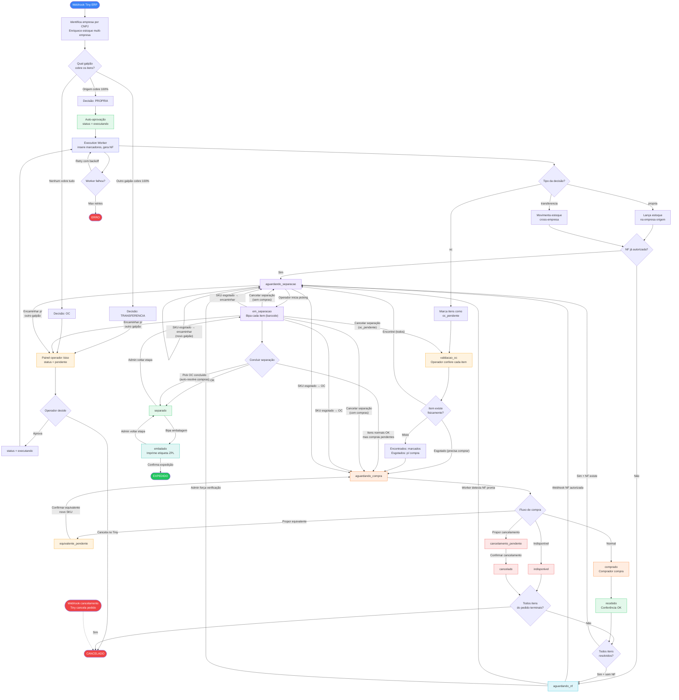

# Ciclo de Vida Completo de um Pedido

Um fluxograma com todos os caminhos possíveis de um pedido dentro do SISO.

### Legenda

| Cor | Significado |
|---|---|
| Azul escuro | Entrada/saída do sistema |
| Roxo | Separação (picking) |
| Verde | Conclusão / sucesso |
| Laranja | Compras (OC) |
| Amarelo | Aguardando decisão / validação |
| Ciano | Aguardando NF |
| Vermelho | Erro / cancelamento |

### Notas

- **Webhook cancelamento** pode atingir o pedido em qualquer status (pendente, executando, ou qualquer status_separacao)
- **Admin voltar-etapa** pode mover entre qualquer status_separacao (não mostrado por completo para manter legibilidade)
- **Reiniciar** reseta progress de picks (em_separacao) ou bips (separado) sem mudar o status
- **Forçar pendente** = admin verifica NF no Tiny e força aguardando_nf → aguardando_separacao
