# SISO — Fluxos Completos do Sistema

## 1. Visao Geral — Macro Flow

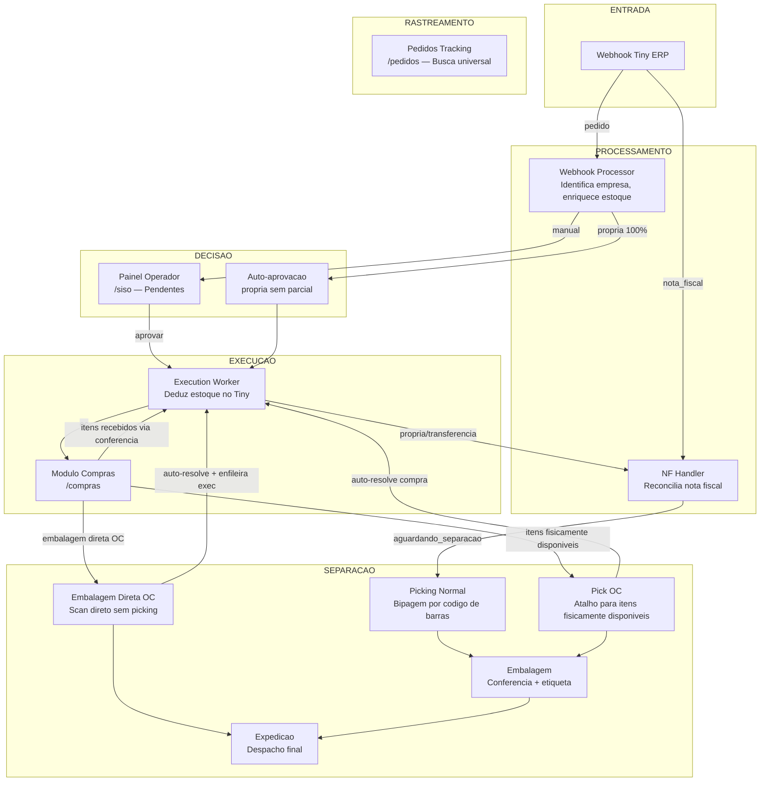

---

## 2. Fluxo de Webhook (Entrada de Pedidos)

Quando o Tiny ERP dispara um webhook, o sistema identifica se e um **pedido** ou **nota fiscal**, faz deduplicacao, enriquece com estoque de todas as empresas do grupo e calcula a sugestao de decisao.

- **Auto-aprovacao** so acontece quando o galpao de origem tem 100% dos itens (propria sem parcial).
- Todos os outros casos vao para o painel do operador como `pendente`.

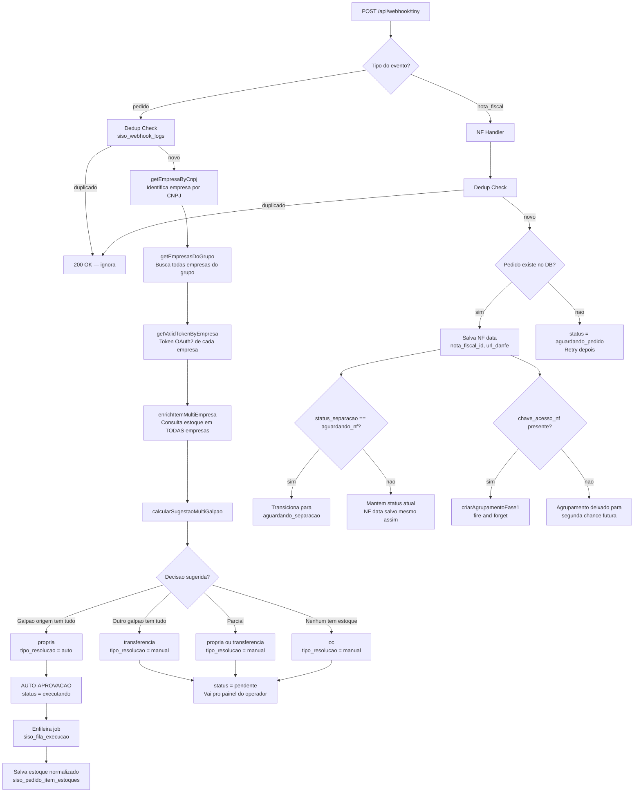

### Logica de decisao detalhada

| Cenario | Decisao | Resolucao | Auto? |
|---|---|---|---|
| Galpao de origem tem 100% dos itens | `propria` | `auto` | Sim |
| Outro galpao tem 100% | `transferencia` | `manual` | Nao |
| Nenhum galpao tem 100%, parcial | `propria` ou `transferencia` (quem cobre mais) | `manual` | Nao |
| Nenhum galpao tem estoque | `oc` (ordem de compra) | `manual` | Nao |

---

## 3. Fluxo de Aprovacao + Execution Worker

Apos o operador aprovar no painel, o pedido entra na fila de execucao. O worker deduz estoque no Tiny ERP conforme o tipo de decisao.

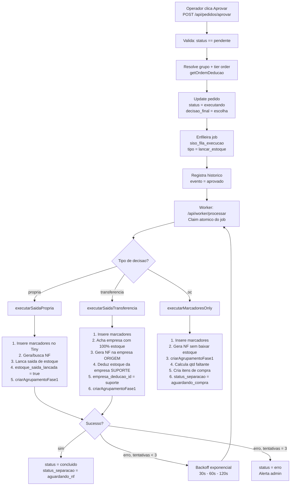

### Detalhes do Execution Worker

| Decisao | O que faz no Tiny | Empresa de deducao | Agrupamento |
|---|---|---|---|
| `propria` | Gera NF + lanca saida (tipo S) | Empresa de origem | Fase 1 apos estoque |
| `transferencia` | Gera NF na origem + deduz estoque no suporte | Empresa do outro galpao | Fase 1 apos estoque |
| `oc` | Marcadores + gera NF (sem estoque) | Nenhuma (aguarda compra) | Fase 1 se NF persistida |

> **OC na aprovacao:** `executarMarcadoresOnly` agora gera NF (via `gerarNotaFiscalPedido`, idempotente) e tenta `criarAgrupamentoFase1` ANTES de resolver itens de compra. Falha de NF nao bloqueia compra. Estoque de OC continua diferido para o Ciclo 2 (apos `compras-release`). O Ciclo 2 detecta NF existente e pula direto para baixa de estoque.
>
> **Failure isolation:** `criarAgrupamentoFase1` e fire-and-forget (nunca lanca excecao). Falha de agrupamento nunca causa retry do job apos `estoque_lancado`/`estoque_saida_lancada` ja persistidos.

### Retry com backoff exponencial

| Tentativa | Delay | Acao |
|---|---|---|
| 1 | 30 segundos | Retry automatico |
| 2 | 60 segundos | Retry automatico |
| 3 | 120 segundos | Retry automatico |
| 4+ | — | status = erro, alerta admin |

---

## 4. Fluxo de Separacao (Picking - Embalagem - Expedicao)

O fluxo de separacao usa **wave picking** com bipagem por codigo de barras. Multiplos pedidos sao processados simultaneamente num checklist consolidado por SKU. O checklist mostra TODOS os itens, incluindo itens OC com badges de status de compra.

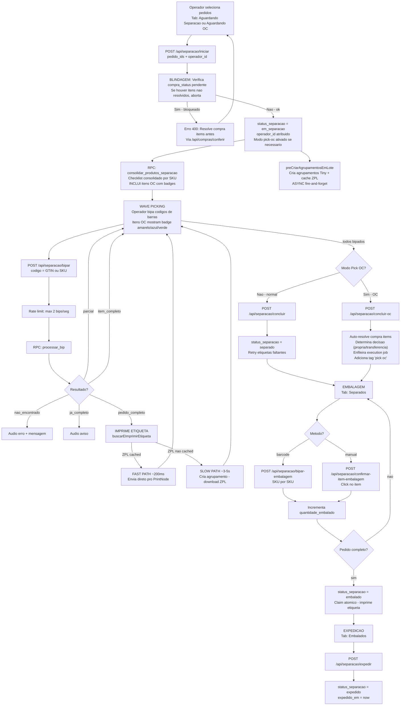

### Maquina de estados da separacao

```mermaid
stateDiagram-v2
    [*] --> aguardando_compra: OC pendente
    [*] --> aguardando_nf: Aprovado, esperando NF
    [*] --> aguardando_separacao: NF chegou ou auto-aprovado

    aguardando_compra --> aguardando_nf: Compra concluida via conferencia
    aguardando_compra --> aguardando_separacao: Compra concluida + NF ja chegou
    aguardando_nf --> aguardando_separacao: Webhook NF recebido
    aguardando_separacao --> em_separacao: Operador inicia picking
    em_separacao --> separado: Todos itens bipados + concluir
    em_separacao --> pendente_realocacao: Short pick sem cobertura no galpao
    pendente_realocacao --> em_separacao: Desfazer parcial ou supervisor reabre
    separado --> embalado: Todos itens embalados
    embalado --> expedido: Operador despacha
    expedido --> [*]

    em_separacao --> aguardando_separacao: Forcar pendente
    separado --> em_separacao: Voltar etapa

    aguardando_compra --> em_separacao: Pick OC - inicia separacao OC<br/>Operador resolve compra items primeiro
    em_separacao --> separado: Concluir OC - auto-resolve compra
    note right of aguardando_compra: Pick OC: atalho para separar<br/>itens OC fisicamente disponiveis<br/>Blindagem: itens com compra pendente<br/>nao transitam para em_separacao
    note right of pendente_realocacao: Short pick: operador encontrou menos<br/>unidades que o pedido + galpao nao tem<br/>cobertura em nenhuma outra localizacao
```

### Acoes especiais durante separacao

| Acao | Endpoint | Entrada | Efeito |
|---|---|---|---|
| Desfazer bip | `POST /api/separacao/desfazer-bip` | pedido_id, codigo | Reverte ultima bipagem, atualiza quantidade_bipada |
| Produto esgotado | `POST /api/separacao/produto-esgotado` | pedido_id, item_id | Marca item como indisponivel, desconta do checklist |
| Reimprimir etiqueta | `POST /api/separacao/reimprimir` | pedido_id, printer_id | Reenvia ZPL cacheado para PrintNode |
| Forcar pendente | `POST /api/separacao/forcar-pendente` | pedido_ids | Volta pedido(s) para aguardando_separacao, reseta marcacoes |
| Voltar etapa | `POST /api/separacao/voltar-etapa` | pedido_id | Retrocede um status (embalado → separado, separado → em_separacao) |
| Cancelar separacao | `POST /api/separacao/cancelar` | pedido_ids | Cancela separacao em andamento, volta para aguardando_separacao |
| Reiniciar separacao | `POST /api/separacao/reiniciar` | pedido_ids | Reseta marcacoes (separacao_marcado=false) mantendo status em_separacao |
| Concluir separacao | `POST /api/separacao/concluir` | pedido_ids | Conclui picking normal: valida todos itens marcados, move para separado |
| Concluir OC | `POST /api/separacao/concluir-oc` | pedido_ids, operador_id | Conclui pick OC: auto-resolve compra items, enfileira execucao, adiciona tag 'pick oc' |
| Encaminhar | `POST /api/separacao/encaminhar` | pedido_id, galpao_destino_id | Encaminha pedido para outro galpao, reseta separacao |
| Marcar item | `POST /api/separacao/marcar-item` | item_id | Marca item como separacao_marcado=true via API (alternativa ao scan) |

### Pick OC — Atalho de Separacao para Itens Aguardando Compra

Quando os itens estao fisicamente disponiveis no galpao (ex.: fornecedor entregou antes), o operador pode separar diretamente sem esperar o fluxo formal de compras via conferencia.

#### Fluxo Completo com Blindagem

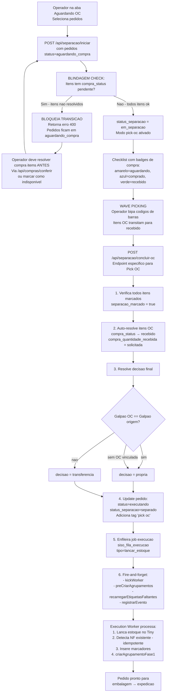

#### Regras Importantes

1. **Blindagem:** Nenhum pedido com `compra_status IN ('aguardando_compra', 'comprado')` pode transicionar para `em_separacao` no fluxo normal
2. **Desbloqueio:** Operador deve resolver itens via `/api/compras/conferir` antes de tentar pick OC
3. **Auto-Resolucao:** `/api/separacao/concluir-oc` marca TODOS os itens OC como `recebido`
4. **Decisao:** Usa `galpao_id` da OC para determinar propria vs transferencia
5. **Tag:** Todos os pick OC recebem a tag `'pick oc'` para auditoria
6. **Execution:** Job fica na fila e é processado normalmente pelo execution worker

---

## 5. Fluxo de Compras (Ordem de Compra)

Quando um pedido tem decisao `oc`, os itens ficam aguardando compra. O operador/comprador cria ordens de compra agrupadas por fornecedor, recebe os itens na conferencia, e o sistema libera automaticamente os pedidos bloqueados.

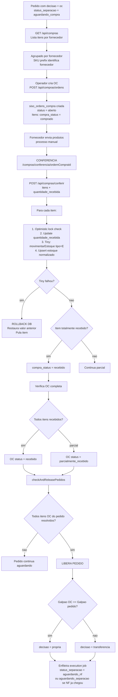

### Mapeamento SKU - Fornecedor

| Prefixo SKU | Fornecedor | Galpao padrao |
|---|---|---|
| `19` | Diversos | CWB |
| `EW` | Eletricway | SP |
| `LD` | LDRU | SP |
| `TH`, `TG` | Tiger | SP |
| `L0` | LEFS | SP |
| 6 digitos numericos | ACA | CWB |
| `G` | GAUSS | CWB |
| `M` | MRMK | SP |
| `CAK`, `CS` | Delphi | SP |

### Excecoes de compra

| Acao | Endpoint | Efeito |
|---|---|---|
| Item indisponivel | `POST /api/compras/itens/{id}/indisponivel` | Marca como indisponivel, reavalia pedido |
| Devolver item | `POST /api/compras/itens/{id}/devolver` | Reverte entrada no Tiny (saida estoque) |
| Trocar fornecedor | `POST /api/compras/itens/{id}/trocar-fornecedor` | Cancela e cria novo item para outro fornecedor |
| Produto equivalente | `POST /api/compras/itens/{id}/equivalente` | Substitui por produto alternativo |
| Cancelar item | `POST /api/compras/itens/{id}/cancelamento` | Cancela item da OC |

---

## 6. Fluxo de Autenticacao

Autenticacao customizada via PIN de 4 digitos (sem Supabase Auth). Sessoes duram 8 horas.

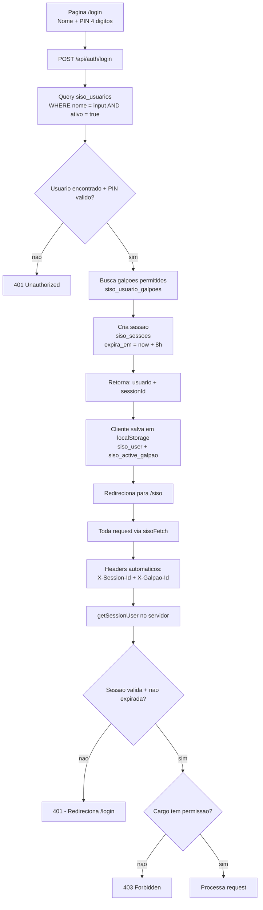

### Roles e permissoes

| Cargo | Acesso |
|---|---|
| `admin` | Tudo — configuracoes, usuarios, monitoramento, todos os modulos |
| `operador_cwb` | Pedidos do galpao CWB, separacao CWB |
| `operador_sp` | Pedidos do galpao SP, separacao SP |
| `comprador` | Modulo de compras (OC) |

---

## 7. Fluxo de Impressao de Etiquetas

O sistema usa uma estrategia de **pre-criacao lazy** para minimizar o tempo de impressao durante o picking. ZPL e cacheado no banco e enviado direto para a impressora termica via PrintNode.

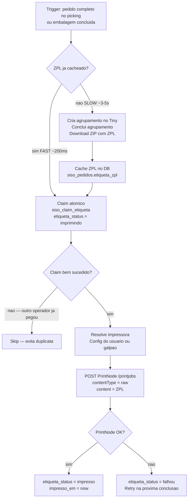

### Agrupamento fase 1 (antecipado)

Agrupamento fase 1 e criado assim que `nota_fiscal_id` + `chave_acesso_nf` estiverem persistidos, via `criarAgrupamentoFase1(pedidoId)`. Isso acontece no worker de aprovacao, webhook de NF, reconciliacao, ou `forcar-pendente` — bem antes do picking.

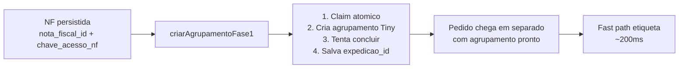

### Fallback em separado (fase 2)

Para pedidos sem agrupamento em `separado` (pedidos antigos, falha na fase 1), quatro endpoints orquestram fallback de criacao + fast path de etiqueta:

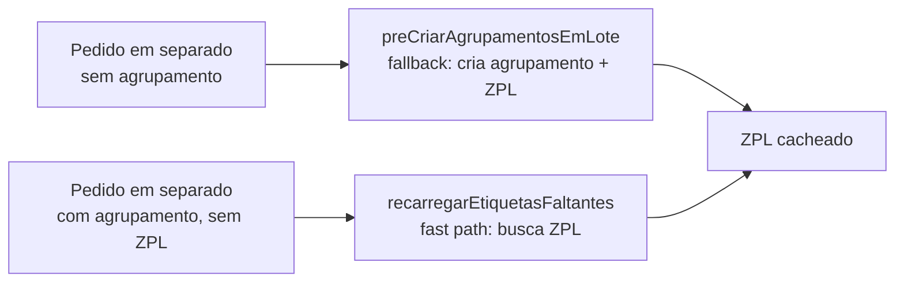

Quatro callers: `concluir`, `concluir-oc`, `retry-etiqueta`, `compras-embalagem`.

### Performance de impressao

| Caminho | Tempo | Quando acontece |
|---|---|---|
| **Fast path** | ~200ms | ZPL cacheado — maioria dos casos com agrupamento antecipado |
| **Slow path** | ~3-5s | Agrupamento nao criado previamente (pedidos antigos, falha fase 1) |
| **Retry** | Proxima conclusao | PrintNode falhou ou ZPL corrompido |

---

## 8. Modelo de Dados (Entidades Principais)

```mermaid
erDiagram
    siso_galpoes ||--o{ siso_empresas : "tem N"
    siso_empresas }o--|| siso_grupo_empresas : "pertence a 1 grupo"
    siso_grupo_empresas }o--|| siso_grupos : "grupo"

    siso_pedidos }o--|| siso_empresas : "empresa_origem"
    siso_pedidos ||--o{ siso_pedido_itens : "tem N itens"
    siso_pedido_itens ||--o{ siso_pedido_item_estoques : "estoque por empresa"
    siso_pedido_item_estoques }o--|| siso_empresas : "empresa"

    siso_pedidos ||--o{ siso_pedido_historico : "audit trail"
    siso_pedidos ||--o| siso_fila_execucao : "job de execucao"
    siso_pedido_itens }o--o| siso_ordens_compra : "OC vinculada"

    siso_empresas ||--o| siso_tiny_connections : "conexao Tiny"
    siso_usuarios ||--o{ siso_sessoes : "sessoes"

    siso_galpoes {
        uuid id PK
        string nome UK
        string descricao
        boolean ativo
    }

    siso_empresas {
        uuid id PK
        string nome
        string cnpj UK
        uuid galpao_id FK
        boolean ativo
    }

    siso_grupos {
        uuid id PK
        string nome UK
    }

    siso_grupo_empresas {
        uuid empresa_id FK_UK
        uuid grupo_id FK
        int tier
    }

    siso_pedidos {
        uuid id PK
        bigint numero_pedido_tiny
        string status
        string status_separacao
        string decisao_sugerida
        string decisao_final
        string tipo_resolucao
        uuid empresa_origem_id FK
        uuid separacao_galpao_id FK
        string etiqueta_zpl
        string etiqueta_status
        string agrupamento_expedicao_id
        bigint nota_fiscal_id
    }

    siso_pedido_itens {
        uuid id PK
        uuid pedido_id FK
        string produto_id
        string sku
        string descricao
        int quantidade
        boolean estoque_saida_lancada
        string compra_status
        int compra_quantidade_recebida
        uuid ordem_compra_id FK
        uuid empresa_deducao_id FK
    }

    siso_pedido_item_estoques {
        uuid pedido_id FK
        string produto_id
        uuid empresa_id FK
        float saldo
        float disponivel
        float reservado
    }

    siso_ordens_compra {
        uuid id PK
        string fornecedor
        uuid galpao_id FK
        string status
    }

    siso_fila_execucao {
        uuid id PK
        uuid pedido_id FK
        uuid empresa_id FK
        string tipo
        string decisao
        int tentativas
        timestamp proximo_em
        boolean processando
    }

    siso_usuarios {
        uuid id PK
        string nome UK
        string pin
        string cargo
        boolean ativo
    }

    siso_sessoes {
        uuid id PK
        uuid usuario_id FK
        timestamp expira_em
    }
```

---

## 9. Resumo de Todas as Transicoes de Status

### pedidos.status

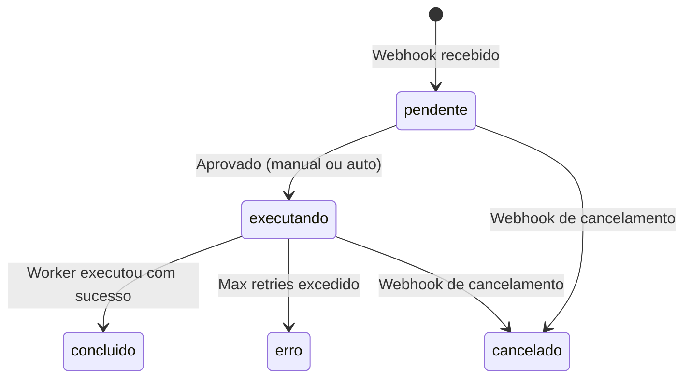

### pedidos.status_separacao

```mermaid
stateDiagram-v2
    [*] --> aguardando_compra: Decisao = OC
    [*] --> aguardando_nf: Decisao = propria/transferencia
    [*] --> aguardando_separacao: Auto-aprovado + NF simultanea

    aguardando_compra --> aguardando_nf: Todos itens OC recebidos via conferencia
    aguardando_compra --> aguardando_separacao: OC recebido + NF ja chegou
    aguardando_compra --> em_separacao: Operador inicia pick OC
    aguardando_compra --> embalado: Embalagem direta OC<br/>bipar-embalagem-oc
    aguardando_nf --> aguardando_separacao: Webhook NF processado
    aguardando_separacao --> em_separacao: Operador inicia picking
    em_separacao --> separado: Picking concluido via /concluir
    em_separacao --> separado: Pick OC concluido via /concluir-oc<br/>+ status=executando
    separado --> embalado: Embalagem concluida
    embalado --> expedido: Despacho realizado

    em_separacao --> aguardando_separacao: Forcar pendente / Cancelar
    em_separacao --> aguardando_compra: Forcar pendente (pick OC)
    separado --> em_separacao: Voltar etapa / Reiniciar

    note right of em_separacao: BLINDAGEM: pedidos com<br/>compra_status pendente nao<br/>transitam aqui automaticamente<br/>Operador deve resolver compra antes
```

### pedido_itens.compra_status

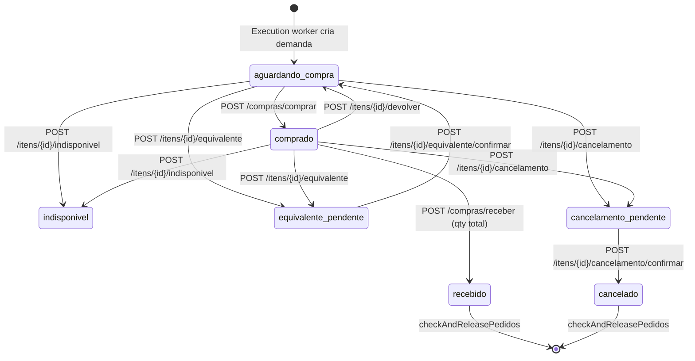

### Sistemas Externos Integrados

| Sistema | Protocolo | Funcao |
|---|---|---|
| **Tiny ERP v3** | REST API + OAuth2 (Keycloak) | Pedidos, NF, estoque, agrupamentos |
| **Supabase** | PostgreSQL + Realtime | Banco de dados, RPCs, subscriptions |
| **PrintNode** | REST API | Impressao termica (ZPL + PDF) |

---

## 10. Hierarquia Organizacional

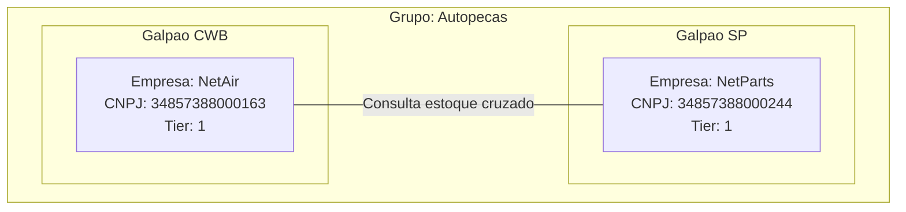

### Como funciona a consulta cruzada

1. Pedido chega para a **NetAir** (CWB)
2. Sistema consulta estoque na **NetAir** E na **NetParts** (mesmo grupo)
3. Agrega por galpao: estoque CWB vs estoque SP
4. Sugere decisao baseado em qual galpao cobre mais itens
5. Se CWB cobre 100% = `propria` (auto-aprova)
6. Se SP cobre 100% = `transferencia` (painel)
7. Nenhum cobre = `oc` (compra)

---

## 11. Agrupamento Antecipado (Fase 1) — Contrato

### Principios

1. **Estoque inalterado:** `propria` e `transferencia` continuam baixando estoque na aprovacao. OC continua diferindo estoque para o Ciclo 2 (apos `compras-release`)
2. **NF estendida para OC:** `executarMarcadoresOnly` agora gera NF (sem estoque) na aprovacao, criando reserva no Tiny
3. **Agrupamento antecipado:** criado assim que `nota_fiscal_id` + `chave_acesso_nf` estiverem persistidos, via helper `criarAgrupamentoFase1`
4. **Failure isolation:** agrupamento e fire-and-forget; falha nunca causa retry de job apos estoque persistido
5. **Segunda chance:** se NF nao estiver completa no worker, webhook de NF, reconciliacao e forcar-pendente criam agrupamento depois
6. **Fallback em separado:** `preCriarAgrupamentosEmLote` + `recarregarEtiquetasFaltantes` continuam como safety net

### Entrypoints de agrupamento fase 1

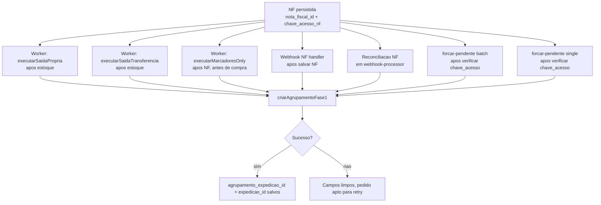

### Contrato de re-roteamento (encaminhar)

- **NF preservada:** `nota_fiscal_id`, `chave_acesso_nf`, `url_danfe` mantidos
- **Artefatos invalidados:** `agrupamento_expedicao_id`, `expedicao_id`, `etiqueta_url`, `etiqueta_zpl`, `etiqueta_status` limpos
- Worker recria agrupamento na re-aprovacao via `criarAgrupamentoFase1`

### Matriz de validacao

| Cenario | Comportamento esperado |
|---|---|
| Aprovacao propria | Marcadores → NF → estoque → agrupamento fase 1. Estoque inalterado |
| Aprovacao transferencia | Marcadores → NF → estoque → agrupamento fase 1. Estoque inalterado |
| Aprovacao OC | Marcadores → NF (sem estoque) → agrupamento fase 1 → itens de compra |
| OC com NF pendente SEFAZ | NF gerada mas chave_acesso indisponivel. Agrupamento por segunda chance |
| OC com falha de NF | Compra continua normal. NF + agrupamento no Ciclo 2 |
| Ciclo 2 apos compras-release | Worker detecta NF existente, pula para estoque. Agrupamento provavelmente ja existe |
| Falha do helper apos estoque | Job nao retenta. Pedido coberto pelo fallback em separado |
| Pending travado | `recuperarPendingTravados` destrava rows >5 min em todas as entradas |
| NF tardia por webhook | `nf-webhook-handler` cria agrupamento fire-and-forget |
| NF tardia por forcar-pendente | Ambas rotas criam agrupamento sem bloquear resposta admin |
| Pedido com agrupamento sem etiqueta | Fast path: `recarregarEtiquetasFaltantes` busca ZPL |
| Pedido antigo sem agrupamento | Fallback: `preCriarAgrupamentosEmLote` cria agrupamento + ZPL |
| Pedido reencaminhado | NF preservada, artefatos de expedição limpos. Worker recria agrupamento |

---

## 12. Pedidos Tracking — Rastreamento Universal

Modulo de busca e rastreamento de pedidos com filtros por status, decisao, empresa e busca textual (numero, EC, cliente, SKU).

### Paginas e endpoints

| Recurso | Funcao |
|---|---|
| `/pedidos` | Lista universal: abas Pedidos/Expedidos, busca, filtros |
| `/pedidos/[id]` | Detalhe: itens + estoque por galpao, timeline, observacoes, acoes |
| `GET /api/pedidos/tracking` | Lista paginada com busca textual e filtros |
| `GET /api/pedidos/[id]/detalhe` | Dados consolidados: pedido + itens + estoques + historico + observacoes |
| `GET/POST /api/pedidos/[id]/observacoes` | Listar e adicionar observacoes |

### Controle de acesso

| Cargo | Visibilidade |
|---|---|
| `admin` | Todos os pedidos |
| `operador_cwb/sp` | Apenas pedidos do seu galpao |
| `comprador` | Apenas pedidos com decisao_final = oc |

---

## 13. Embalagem Direta OC (bipar-embalagem-oc)

Atalho para embalar pedidos OC diretamente sem picking. Operador escaneia itens na pagina de embalagem, sistema auto-resolve compra e enfileira execucao.

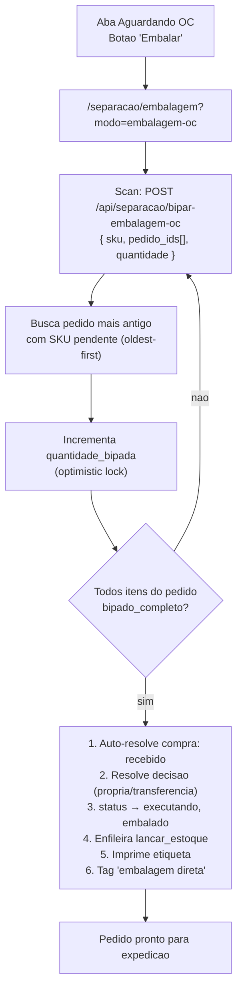

### Transicao de estado

`aguardando_compra` → `embalado` (pula picking inteiro)
