# SISO — Fluxos Completos do Sistema

## 1. Visao Geral — Macro Flow

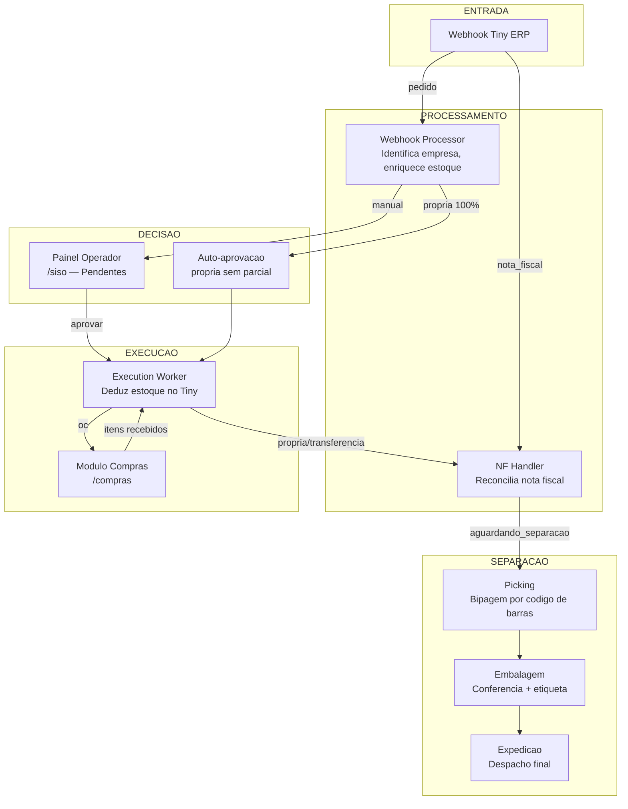

---

## 2. Fluxo de Webhook (Entrada de Pedidos)

Quando o Tiny ERP dispara um webhook, o sistema identifica se e um **pedido** ou **nota fiscal**, faz deduplicacao, enriquece com estoque de todas as empresas do grupo e calcula a sugestao de decisao.

- **Auto-aprovacao** so acontece quando o galpao de origem tem 100% dos itens (propria sem parcial).
- Todos os outros casos vao para o painel do operador como `pendente`.

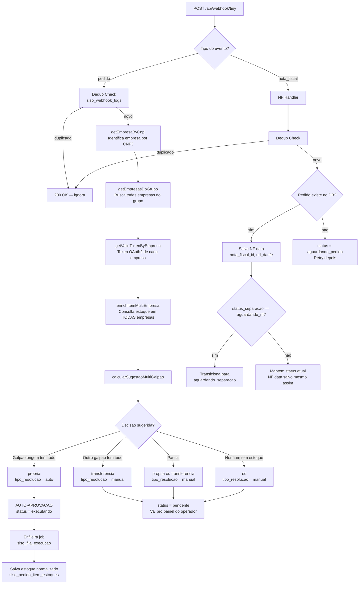

### Logica de decisao detalhada

| Cenario | Decisao | Resolucao | Auto? |
|---|---|---|---|
| Galpao de origem tem 100% dos itens | `propria` | `auto` | Sim |
| Outro galpao tem 100% | `transferencia` | `manual` | Nao |
| Nenhum galpao tem 100%, parcial | `propria` ou `transferencia` (quem cobre mais) | `manual` | Nao |
| Nenhum galpao tem estoque | `oc` (ordem de compra) | `manual` | Nao |

---

## 3. Fluxo de Aprovacao + Execution Worker

Apos o operador aprovar no painel, o pedido entra na fila de execucao. O worker deduz estoque no Tiny ERP conforme o tipo de decisao.

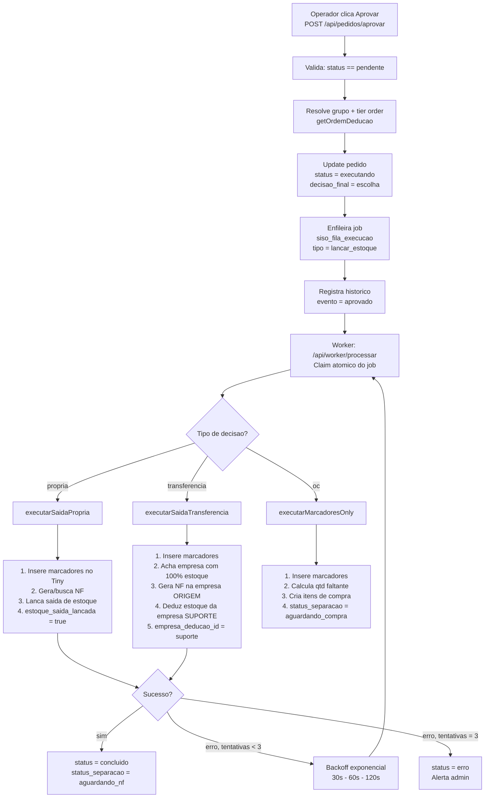

### Detalhes do Execution Worker

| Decisao | O que faz no Tiny | Empresa de deducao |
|---|---|---|
| `propria` | Gera NF + lanca saida (tipo S) | Empresa de origem |
| `transferencia` | Gera NF na origem + deduz estoque no suporte | Empresa do outro galpao |
| `oc` | Apenas marcadores | Nenhuma (aguarda compra) |

### Retry com backoff exponencial

| Tentativa | Delay | Acao |
|---|---|---|
| 1 | 30 segundos | Retry automatico |
| 2 | 60 segundos | Retry automatico |
| 3 | 120 segundos | Retry automatico |
| 4+ | — | status = erro, alerta admin |

---

## 4. Fluxo de Separacao (Picking - Embalagem - Expedicao)

O fluxo de separacao usa **wave picking** com bipagem por codigo de barras. Multiplos pedidos sao processados simultaneamente num checklist consolidado por SKU.

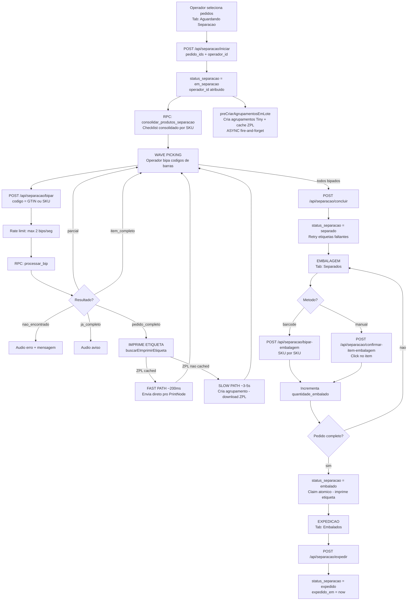

### Maquina de estados da separacao

```mermaid
stateDiagram-v2
    [*] --> aguardando_compra: OC pendente
    [*] --> aguardando_nf: Aprovado, esperando NF
    [*] --> aguardando_separacao: NF chegou ou auto-aprovado

    aguardando_compra --> aguardando_nf: Compra concluida
    aguardando_compra --> aguardando_separacao: Compra concluida + NF ja chegou
    aguardando_nf --> aguardando_separacao: Webhook NF recebido
    aguardando_separacao --> em_separacao: Operador inicia picking
    em_separacao --> separado: Todos itens bipados + concluido
    separado --> embalado: Todos itens embalados
    embalado --> expedido: Operador despacha
    expedido --> [*]

    em_separacao --> aguardando_separacao: Forcar pendente ou Reiniciar
    separado --> em_separacao: Voltar etapa

    aguardando_compra --> em_separacao: Pick OC (iniciar)
    note right of aguardando_compra: Pick OC: atalho para separar<br/>itens OC fisicamente disponiveis
```

### Acoes especiais durante separacao

| Acao | Endpoint | Efeito |
|---|---|---|
| Desfazer bip | `POST /api/separacao/desfazer-bip` | Reverte ultima bipagem |
| Produto esgotado | `POST /api/separacao/produto-esgotado` | Marca item como indisponivel |
| Reimprimir etiqueta | `POST /api/separacao/reimprimir` | Reenvia ZPL para PrintNode |
| Forcar pendente | `POST /api/separacao/forcar-pendente` | Volta pedido(s) para aguardando_separacao |
| Voltar etapa | `POST /api/separacao/voltar-etapa` | Retrocede um status |
| Cancelar separacao | `POST /api/separacao/cancelar` | Cancela separacao em andamento |
| Reiniciar separacao | `POST /api/separacao/reiniciar` | Reseta marcacoes e reinicia |
| Concluir OC | `POST /api/separacao/concluir-oc` | Conclui pick OC: auto-resolve compra, enfileira execucao |

### Pick OC — Atalho de Separacao para Itens Aguardando Compra

Quando os itens estao fisicamente disponiveis no galpao (ex.: fornecedor entregou antes), o operador pode separar diretamente sem esperar o fluxo formal de compras.

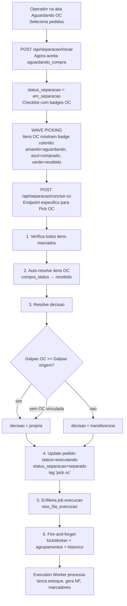

---

## 5. Fluxo de Compras (Ordem de Compra)

Quando um pedido tem decisao `oc`, os itens ficam aguardando compra. O operador/comprador cria ordens de compra agrupadas por fornecedor, recebe os itens na conferencia, e o sistema libera automaticamente os pedidos bloqueados.

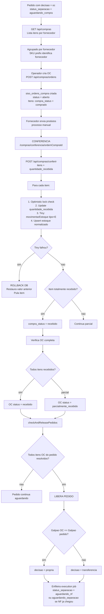

### Mapeamento SKU - Fornecedor

| Prefixo SKU | Fornecedor | Galpao padrao |
|---|---|---|
| `19` | Diversos | CWB |
| `EW` | Eletricway | SP |
| `LD` | LDRU | SP |
| `TH`, `TG` | Tiger | SP |
| `L0` | LEFS | SP |
| 6 digitos numericos | ACA | CWB |
| `G` | GAUSS | CWB |
| `M` | MRMK | SP |
| `CAK`, `CS` | Delphi | SP |

### Excecoes de compra

| Acao | Endpoint | Efeito |
|---|---|---|
| Item indisponivel | `POST /api/compras/itens/{id}/indisponivel` | Marca como indisponivel, reavalia pedido |
| Devolver item | `POST /api/compras/itens/{id}/devolver` | Reverte entrada no Tiny (saida estoque) |
| Trocar fornecedor | `POST /api/compras/itens/{id}/trocar-fornecedor` | Cancela e cria novo item para outro fornecedor |
| Produto equivalente | `POST /api/compras/itens/{id}/equivalente` | Substitui por produto alternativo |
| Cancelar item | `POST /api/compras/itens/{id}/cancelamento` | Cancela item da OC |

---

## 6. Fluxo de Autenticacao

Autenticacao customizada via PIN de 4 digitos (sem Supabase Auth). Sessoes duram 8 horas.

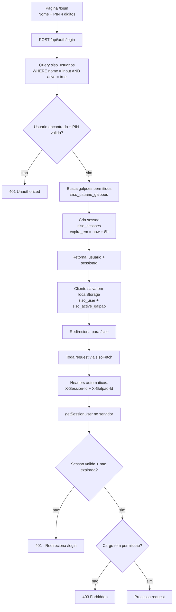

### Roles e permissoes

| Cargo | Acesso |
|---|---|
| `admin` | Tudo — configuracoes, usuarios, monitoramento, todos os modulos |
| `operador_cwb` | Pedidos do galpao CWB, separacao CWB |
| `operador_sp` | Pedidos do galpao SP, separacao SP |
| `comprador` | Modulo de compras (OC) |

---

## 7. Fluxo de Impressao de Etiquetas

O sistema usa uma estrategia de **pre-criacao lazy** para minimizar o tempo de impressao durante o picking. ZPL e cacheado no banco e enviado direto para a impressora termica via PrintNode.

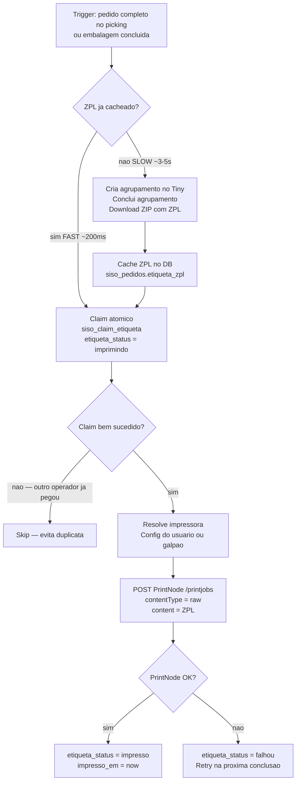

### Pre-criacao de agrupamentos (async)

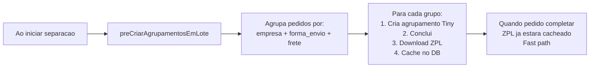

### Performance de impressao

| Caminho | Tempo | Quando acontece |
|---|---|---|
| **Fast path** | ~200ms | ZPL pre-cacheado (maioria dos casos) |
| **Slow path** | ~3-5s | Agrupamento nao criado previamente |
| **Retry** | Proxima conclusao | PrintNode falhou ou ZPL corrompido |

---

## 8. Modelo de Dados (Entidades Principais)

```mermaid
erDiagram
    siso_galpoes ||--o{ siso_empresas : "tem N"
    siso_empresas }o--|| siso_grupo_empresas : "pertence a 1 grupo"
    siso_grupo_empresas }o--|| siso_grupos : "grupo"

    siso_pedidos }o--|| siso_empresas : "empresa_origem"
    siso_pedidos ||--o{ siso_pedido_itens : "tem N itens"
    siso_pedido_itens ||--o{ siso_pedido_item_estoques : "estoque por empresa"
    siso_pedido_item_estoques }o--|| siso_empresas : "empresa"

    siso_pedidos ||--o{ siso_pedido_historico : "audit trail"
    siso_pedidos ||--o| siso_fila_execucao : "job de execucao"
    siso_pedido_itens }o--o| siso_ordens_compra : "OC vinculada"

    siso_empresas ||--o| siso_tiny_connections : "conexao Tiny"
    siso_usuarios ||--o{ siso_sessoes : "sessoes"

    siso_galpoes {
        uuid id PK
        string nome UK
        string descricao
        boolean ativo
    }

    siso_empresas {
        uuid id PK
        string nome
        string cnpj UK
        uuid galpao_id FK
        boolean ativo
    }

    siso_grupos {
        uuid id PK
        string nome UK
    }

    siso_grupo_empresas {
        uuid empresa_id FK_UK
        uuid grupo_id FK
        int tier
    }

    siso_pedidos {
        uuid id PK
        bigint numero_pedido_tiny
        string status
        string status_separacao
        string decisao_sugerida
        string decisao_final
        string tipo_resolucao
        uuid empresa_origem_id FK
        uuid separacao_galpao_id FK
        string etiqueta_zpl
        string etiqueta_status
        string agrupamento_expedicao_id
        bigint nota_fiscal_id
    }

    siso_pedido_itens {
        uuid id PK
        uuid pedido_id FK
        string produto_id
        string sku
        string descricao
        int quantidade
        boolean estoque_saida_lancada
        string compra_status
        int compra_quantidade_recebida
        uuid ordem_compra_id FK
        uuid empresa_deducao_id FK
    }

    siso_pedido_item_estoques {
        uuid pedido_id FK
        string produto_id
        uuid empresa_id FK
        float saldo
        float disponivel
        float reservado
    }

    siso_ordens_compra {
        uuid id PK
        string fornecedor
        uuid galpao_id FK
        string status
    }

    siso_fila_execucao {
        uuid id PK
        uuid pedido_id FK
        uuid empresa_id FK
        string tipo
        string decisao
        int tentativas
        timestamp proximo_em
        boolean processando
    }

    siso_usuarios {
        uuid id PK
        string nome UK
        string pin
        string cargo
        boolean ativo
    }

    siso_sessoes {
        uuid id PK
        uuid usuario_id FK
        timestamp expira_em
    }
```

---

## 9. Resumo de Todas as Transicoes de Status

### pedidos.status

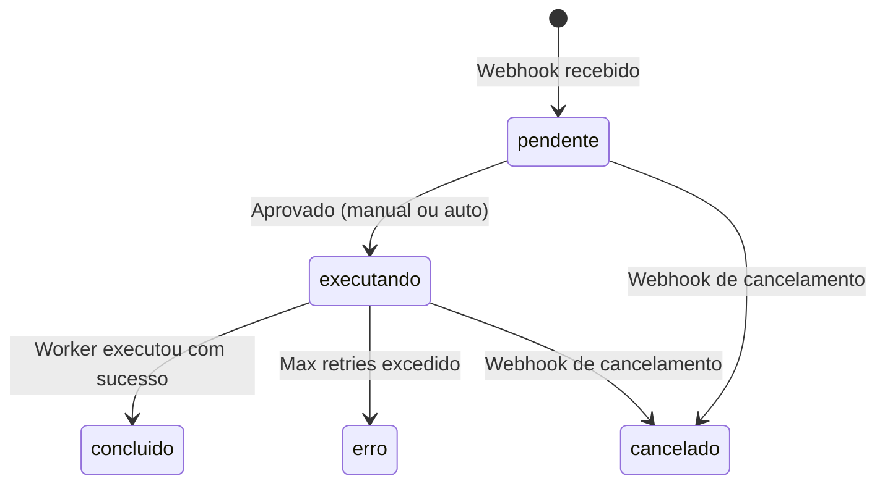

### pedidos.status_separacao

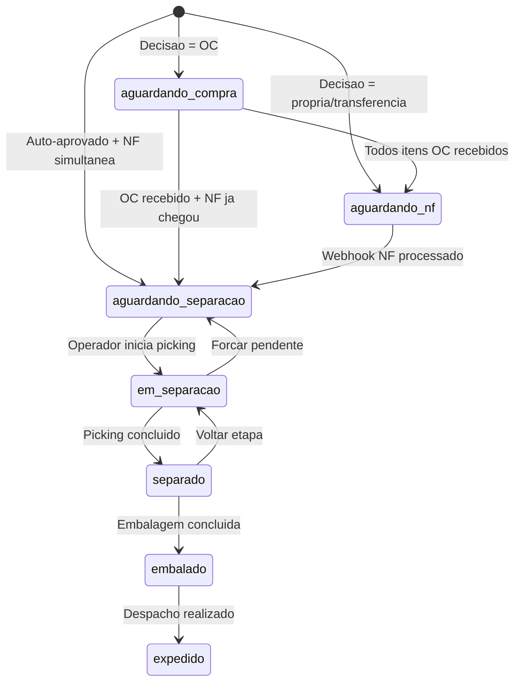

### pedido_itens.compra_status

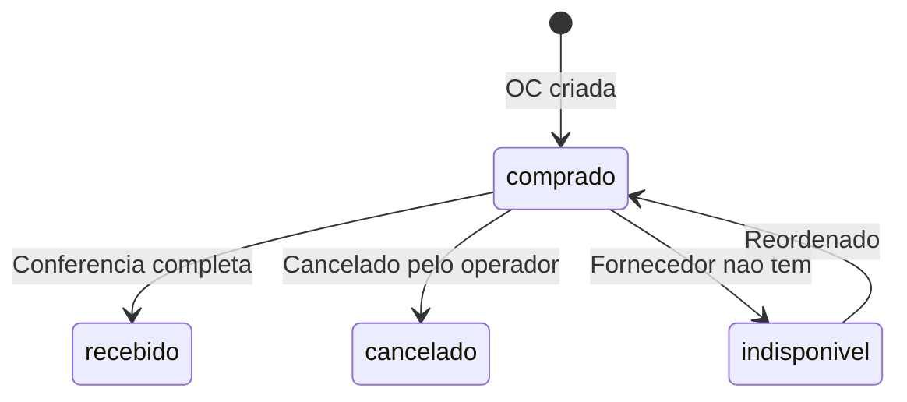

### Sistemas Externos Integrados

| Sistema | Protocolo | Funcao |
|---|---|---|
| **Tiny ERP v3** | REST API + OAuth2 (Keycloak) | Pedidos, NF, estoque, agrupamentos |
| **Supabase** | PostgreSQL + Realtime | Banco de dados, RPCs, subscriptions |
| **PrintNode** | REST API | Impressao termica (ZPL + PDF) |

---

## 10. Hierarquia Organizacional

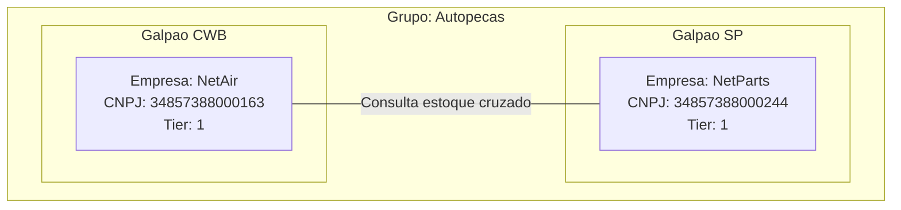

### Como funciona a consulta cruzada

1. Pedido chega para a **NetAir** (CWB)
2. Sistema consulta estoque na **NetAir** E na **NetParts** (mesmo grupo)
3. Agrega por galpao: estoque CWB vs estoque SP
4. Sugere decisao baseado em qual galpao cobre mais itens
5. Se CWB cobre 100% = `propria` (auto-aprova)
6. Se SP cobre 100% = `transferencia` (painel)
7. Nenhum cobre = `oc` (compra)
