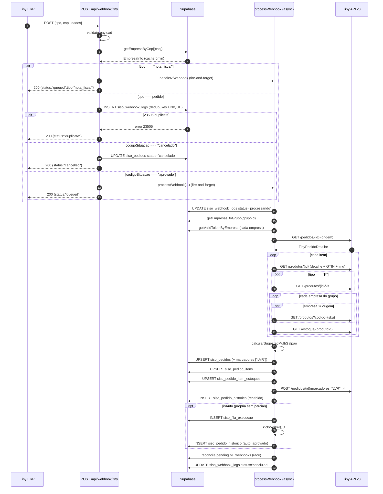
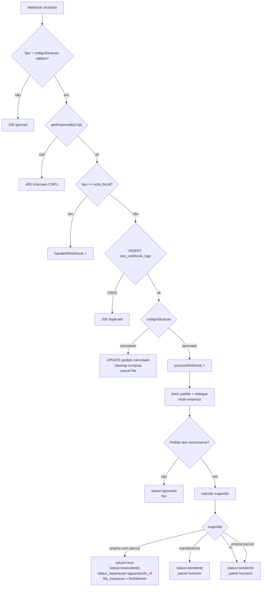
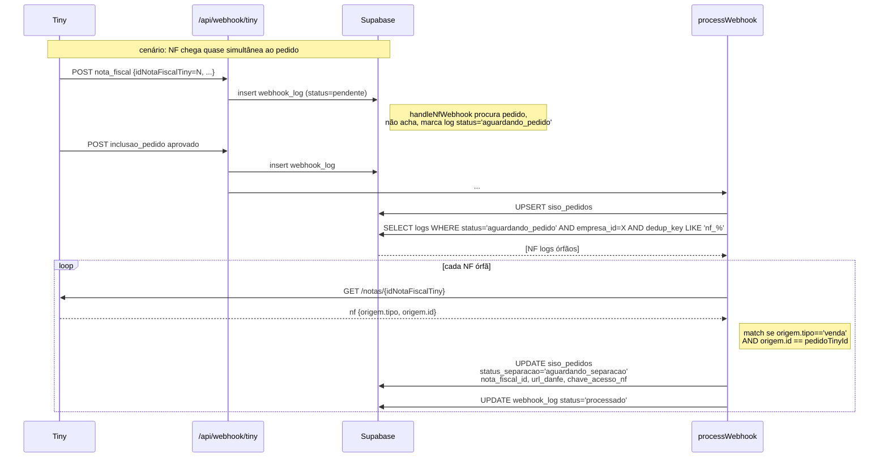
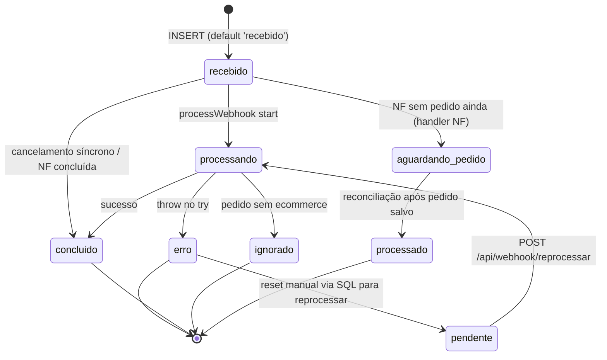
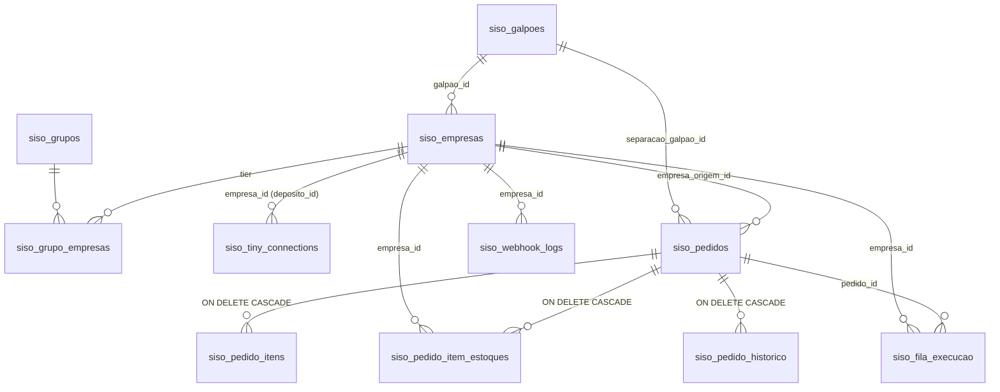

# Fluxo 01 — Webhook de Pedido (Tiny ERP)

> **Ground truth.** Este documento descreve com detalhes o ponto de entrada de pedidos no SISO: a recepção do webhook do Tiny ERP, a identificação da empresa por CNPJ, o enriquecimento de estoque multi-empresa, o cálculo de sugestão (`propria` / `transferencia` / `oc`) e a persistência do pedido em `siso_pedidos`. Não cobre webhooks de NF (doc 02), aprovação manual (doc 03) nem dedução de estoque (doc 04).

## Índice

1. [Visão geral](#1-visão-geral)
2. [Contrato do webhook (entrada)](#2-contrato-do-webhook-entrada)
3. [Recepção e validação (`POST /api/webhook/tiny`)](#3-recepção-e-validação-post-apiwebhooktiny)
4. [Identificação da empresa por CNPJ](#4-identificação-da-empresa-por-cnpj)
5. [Discriminação `pedido` vs `nota_fiscal`](#5-discriminação-pedido-vs-nota_fiscal)
6. [Deduplicação via `dedup_key`](#6-deduplicação-via-dedup_key)
7. [Tratamento de cancelamento](#7-tratamento-de-cancelamento)
8. [Fire-and-forget — disparo do processamento assíncrono](#8-fire-and-forget--disparo-do-processamento-assíncrono)
9. [Processamento assíncrono (`processWebhook`)](#9-processamento-assíncrono-processwebhook)
   - 9.1 [Resolução do grupo de empresas](#91-resolução-do-grupo-de-empresas)
   - 9.2 [Tokens OAuth2 e fila de rate limit](#92-tokens-oauth2-e-fila-de-rate-limit)
   - 9.3 [Fetch do pedido completo](#93-fetch-do-pedido-completo)
   - 9.4 [Filtro de pedidos não-marketplace](#94-filtro-de-pedidos-não-marketplace)
   - 9.5 [Expansão de kits (`tipo === "K"`)](#95-expansão-de-kits-tipo--k)
   - 9.6 [Enrichment de estoque multi-empresa](#96-enrichment-de-estoque-multi-empresa)
   - 9.7 [Agregação por galpão](#97-agregação-por-galpão)
   - 9.8 [Cálculo da sugestão](#98-cálculo-da-sugestão)
   - 9.9 [Persistência: `siso_pedidos`](#99-persistência-siso_pedidos)
   - 9.10 [Persistência: itens e estoques](#910-persistência-itens-e-estoques)
   - 9.11 [Marcador "LVR" no Tiny](#911-marcador-lvr-no-tiny)
   - 9.12 [Auto-aprovação e enfileiramento](#912-auto-aprovação-e-enfileiramento)
   - 9.13 [Histórico de eventos](#913-histórico-de-eventos)
   - 9.14 [Reconciliação de NFs órfãs](#914-reconciliação-de-nfs-órfãs)
   - 9.15 [Finalização do `webhook_log`](#915-finalização-do-webhook_log)
10. [Lógica de decisão (4 cenários)](#10-lógica-de-decisão-4-cenários)
11. [State diagram do `siso_webhook_logs`](#11-state-diagram-do-siso_webhook_logs)
12. [Reprocessamento manual (`POST /api/webhook/reprocessar`)](#12-reprocessamento-manual-post-apiwebhookreprocessar)
13. [Tratamento de erros e edge cases](#13-tratamento-de-erros-e-edge-cases)
14. [Logging e correlation IDs](#14-logging-e-correlation-ids)
15. [Side effects (resumo canônico)](#15-side-effects-resumo-canônico)

---

## 1. Visão geral

O Tiny ERP envia um `POST` para `https://<host>/api/webhook/tiny` sempre que ocorre um evento relevante (inclusão/atualização de pedido, emissão de nota fiscal). O endpoint:

1. Valida o payload (campos obrigatórios `tipo`, `cnpj`, `dados`).
2. Identifica a **empresa** pelo CNPJ usando `siso_empresas` (cache 5 min).
3. Discrimina o tipo:
   - `nota_fiscal` → delega para `handleNfWebhook` (doc 02) e responde `200`.
   - `inclusao_pedido` / `atualizacao_pedido` com `codigoSituacao ∈ {aprovado, cancelado}` → segue o fluxo de pedido.
4. Insere uma linha em `siso_webhook_logs` (com **dedup** automático via coluna gerada `dedup_key`).
5. Se duplicado (PG `23505`) → `200 {status:"duplicate"}` sem reprocessar.
6. Para `cancelado` → atualiza `siso_pedidos.status = 'cancelado'`, limpa fila de execução, faz cleanup de compras se aplicável.
7. Para `aprovado` → dispara `processWebhook(...)` em background (sem `await`) e retorna `200 {status:"queued"}` imediatamente.

O processamento assíncrono enriquece o pedido com estoque de **todas** as empresas do grupo, calcula uma sugestão de fulfillment, persiste em `siso_pedidos` + `siso_pedido_itens` + `siso_pedido_item_estoques`, dispara o marcador `LVR` no Tiny, e — caso a decisão seja `propria` sem parcial — auto-aprova e enfileira a dedução de estoque.

### 1.1 Sequence diagram (alto nível)



### 1.2 Flowchart de decisão



---

## 2. Contrato do webhook (entrada)

### 2.1 Headers

O Tiny não envia headers de autenticação (não há HMAC). A segurança vem da identificação por CNPJ — só processamos se o CNPJ corresponde a uma `siso_empresas.ativo = true`.

| Header | Valor esperado |
|---|---|
| `Content-Type` | `application/json` |

### 2.2 Body (payload)

Campos validados em `src/app/api/webhook/tiny/route.ts:36-43`:

```ts
{
  tipo: string,            // OBRIGATÓRIO: "inclusao_pedido" | "atualizacao_pedido" | "nota_fiscal"
  cnpj: string,            // OBRIGATÓRIO: CNPJ da conta Tiny (com ou sem máscara)
  dados: {                 // OBRIGATÓRIO
    id: string,            // ID do pedido (ou idNotaFiscalTiny no caso de NF)
    codigoSituacao?: string, // "aprovado" | "cancelado" | outro (ignorado)
    // ... demais campos do Tiny (não usados aqui)
  }
}
```

Para `tipo === "nota_fiscal"` o esquema esperado vem de `src/lib/nf-webhook-handler.ts` (campo `dados.idNotaFiscalTiny` obrigatório, `dados.urlDanfe`, `dados.chaveAcesso` opcionais).

### 2.3 Códigos de retorno

| Código | Body | Quando |
|---|---|---|
| `200` | `{status:"queued", pedidoId, empresaId, galpao, webhookLogId}` | Pedido aprovado enfileirado |
| `200` | `{status:"queued", tipo:"nota_fiscal"}` | NF enfileirada (doc 02) |
| `200` | `{status:"duplicate", pedidoId}` | `dedup_key` colidiu (PG `23505`) |
| `200` | `{status:"cancelled", pedidoId, previousStatus}` | Pedido encontrado e cancelado |
| `200` | `{status:"cancelled_unknown", pedidoId}` | Cancelamento de pedido nunca processado |
| `200` | `{status:"ignored", reason:"..."}` | `tipo` ou `codigoSituacao` não aceitos |
| `400` | `{error:"Invalid JSON"}` | Body não-JSON |
| `400` | `{error:"Missing required fields"}` | Faltam `tipo`, `cnpj` ou `dados` |
| `400` | `{error:"Unknown CNPJ: <cnpj>"}` | CNPJ não cadastrado em `siso_empresas` |
| `400` | `{error:"Missing dados.id"}` | Pedido sem `dados.id` |
| `400` | `{error:"Missing dados.idNotaFiscalTiny"}` | NF sem identificador |
| `500` | `{error:"Failed to log webhook"}` | Falha no INSERT (não-23505) em `siso_webhook_logs` |

---

## 3. Recepção e validação (`POST /api/webhook/tiny`)

Arquivo: `src/app/api/webhook/tiny/route.ts:20-314`.

| Etapa | Linhas | Descrição |
|---|---|---|
| Gerar `correlationId` | `:21` | `${timestamp}-${random}` para rastreio multi-step |
| `request.json()` | `:24-28` | 400 se inválido |
| Log raw payload | `:30-34` | `payload` truncado em 500 chars |
| Validar `tipo`/`cnpj`/`dados` | `:36-43` | 400 se faltam |
| `getEmpresaByCnpj(cnpj)` | `:46-53` | 400 se não encontrada |
| Discriminar `nota_fiscal` | `:56-79` | NF vai para handler dedicado, retorna 200 |
| Validar `codigoSituacao` | `:82-88` | Aceita apenas `aprovado` ou `cancelado` em `inclusao_pedido` ou `atualizacao_pedido` |
| Validar `dados.id` | `:90-93` | 400 se ausente |
| INSERT `siso_webhook_logs` | `:107-119` | Com payload completo |
| Tratar dedup (PG `23505`) | `:122-125` | 200 `duplicate` |
| Tratar cancelamento | `:148-281` | Ver §7 |
| Disparar `processWebhook` (async) | `:283-305` | Fire-and-forget |
| Retornar 200 imediato | `:307-313` | Não bloqueia o Tiny |

A regra de aceitação está hardcoded:

```ts
const tiposAceitos = ["atualizacao_pedido", "inclusao_pedido"];
const situacoesAceitas = ["aprovado", "cancelado"];
```

Qualquer outro evento (`em_separacao`, `enviado`, etc.) é descartado com `status:"ignored"`.

---

## 4. Identificação da empresa por CNPJ

Arquivo: `src/lib/empresa-lookup.ts`.

### 4.1 Função `getEmpresaByCnpj(cnpj)`

- Limpa máscara: `cnpj.replace(/\D/g, "")` (`:26-28`).
- **Cache em memória** com TTL 5 min (`CACHE_TTL_MS = 5 * 60 * 1000`, `:23`). Cache key = CNPJ limpo.
- Query Supabase com `select` aninhado (`:46-57`):

```ts
.from("siso_empresas")
.select(`
  id, nome, galpao_id,
  siso_galpoes!inner ( id, nome ),
  siso_grupo_empresas ( grupo_id, siso_grupos ( id, nome ) )
`)
.eq("cnpj", clean)
.eq("ativo", true)
.single();
```

- Retorna `EmpresaInfo`:

| Campo | Tipo | Origem |
|---|---|---|
| `empresaId` | `uuid` | `siso_empresas.id` |
| `empresaNome` | `string` | `siso_empresas.nome` |
| `galpaoId` | `uuid` | `siso_galpoes.id` |
| `galpaoNome` | `string` | `siso_galpoes.nome` (e.g. "CWB", "SP") |
| `grupoId` | `uuid \| null` | `siso_grupos.id` (null se empresa sem grupo) |
| `grupoNome` | `string \| null` | `siso_grupos.nome` |

- Trata variação do PostgREST: `siso_grupo_empresas` pode vir como objeto único ou array (`:64-67`).

### 4.2 Função `getEmpresaById(empresaId)`

Usada pelo reprocessamento (`/api/webhook/reprocessar`). Mesma lógica, busca por `id` em vez de `cnpj`. Cache compartilhado (`:130-133`).

### 4.3 Função `clearEmpresaCache()`

Limpa cache (usar após mudanças em `siso_empresas` ou `siso_grupo_empresas`).

### 4.4 Edge case: CNPJ desconhecido

Em `route.ts:46-53`:

```ts
const empresa = await getEmpresaByCnpj(cnpj);
if (!empresa) {
  logger.warn("webhook", `Received webhook from unknown CNPJ`, { cnpj, tipo });
  return NextResponse.json({ error: `Unknown CNPJ: ${cnpj}` }, { status: 400 });
}
```

**Importante:** o webhook é rejeitado com `400` (e não `200`) — o Tiny pode reentregar. Esse comportamento é intencional: assim o admin recebe alerta no painel de monitoramento do Tiny até que a empresa seja cadastrada via `/configuracoes`.

---

## 5. Discriminação `pedido` vs `nota_fiscal`

A primeira ramificação acontece **antes** da validação de `codigoSituacao` (`route.ts:55-79`):

```ts
if (tipo === "nota_fiscal") {
  // delega para handleNfWebhook(...)
  // retorna 200 {status:"queued",tipo:"nota_fiscal"}
}
```

A NF tem fluxo próprio (transição `aguardando_nf → aguardando_separacao`, salva `nota_fiscal_id`, `chave_acesso_nf`, `url_danfe`). Vide doc 02. **Este documento cobre apenas o caminho de pedido.**

---

## 6. Deduplicação via `dedup_key`

### 6.1 Coluna gerada

A tabela `siso_webhook_logs` possui:

```sql
dedup_key text GENERATED ALWAYS AS (
  tiny_pedido_id || ':' || tipo || ':' || COALESCE(codigo_situacao, '')
) STORED
```

E um índice único:

```sql
CREATE UNIQUE INDEX idx_siso_webhook_dedup
  ON siso_webhook_logs (dedup_key);
```

### 6.2 Exemplos reais

| `tiny_pedido_id` | `tipo` | `codigo_situacao` | `dedup_key` |
|---|---|---|---|
| `1045610187` | `inclusao_pedido` | `aprovado` | `1045610187:inclusao_pedido:aprovado` |
| `950575981` | `atualizacao_pedido` | `cancelado` | `950575981:atualizacao_pedido:cancelado` |
| `1045609728` | `nota_fiscal` | `null` | `1045609728:nota_fiscal:` |

### 6.3 Comportamento na inserção

`route.ts:107-143`:

```ts
const { data: logEntry, error: insertError } = await supabase
  .from("siso_webhook_logs")
  .insert({ tiny_pedido_id, cnpj, tipo, codigo_situacao, filial, empresa_id, payload })
  .select("id")
  .single();

if (insertError) {
  if (insertError.code === "23505") {  // unique_violation
    return NextResponse.json({ status: "duplicate", pedidoId });
  }
  // ... 500 com logError categoria "database"
}
```

### 6.4 Implicações

- O **mesmo pedido com a mesma situação** nunca é processado duas vezes mesmo que o Tiny reentregue.
- Mas o **mesmo pedido com situação diferente** (e.g. primeiro `aprovado`, depois `cancelado`) gera duas linhas — ambas processadas.
- O Tiny envia ambos `inclusao_pedido` e `atualizacao_pedido` para o mesmo pedido aprovado em momentos diferentes do ciclo — esses são **dedup_keys distintas** (`...inclusao_pedido:aprovado` vs `...atualizacao_pedido:aprovado`) e ambos serão processados. O `UPSERT` em `siso_pedidos` (`onConflict: "id"`, `:359`) absorve essa redundância sem criar duplicatas.

---

## 7. Tratamento de cancelamento

`route.ts:148-281`. Quando `codigoSituacao === "cancelado"` o handler executa **síncronamente** (não delega a `processWebhook`):

### 7.1 Pedido existente

1. Busca pedido (`select id, status, status_separacao`).
2. Monta `cancelUpdate`:
   - `status: 'cancelado'`
   - `processado_em: now()`
   - `status_separacao: null` (se havia)
3. **Cleanup de compras** (`:165-234`) se `status_separacao ∈ {aguardando_compra, comprado}`:
   - Busca itens com `compra_status IS NOT NULL`.
   - Sinaliza `compra_estoque_lancado_alerta = true` se algum tem `compra_quantidade_recebida > 0` (estoque já entrou no Tiny — exige reversão manual).
   - Coleta `affectedOcIds` distintos.
   - Limpa `compra_status` e `ordem_compra_id` dos itens.
   - Para cada OC afetada, conta itens restantes; se `0`, marca OC como `cancelado`.
4. `UPDATE siso_pedidos SET ... WHERE id = pedidoId`.
5. `UPDATE siso_fila_execucao SET status='cancelado' WHERE pedido_id=... AND status='pendente'`.
6. `UPDATE siso_webhook_logs SET status='concluido', processado_em=now()`.
7. Retorna `200 {status:"cancelled", pedidoId, previousStatus}`.

### 7.2 Pedido inexistente

Pedido nunca foi recebido ou foi expurgado. Marca `webhook_log` como `concluido` e retorna `200 {status:"cancelled_unknown", pedidoId}`.

### 7.3 Eventos não enviados ao histórico

O cancelamento via webhook **não** chama `registrarEvento('cancelado', ...)` — esse evento é registrado apenas em cancelamentos manuais via `/api/separacao/cancelar`. (Possível débito técnico — verificar se está alinhado com o produto.)

---

## 8. Fire-and-forget — disparo do processamento assíncrono

`route.ts:283-305`:

```ts
processWebhook(webhookLogId, pedidoId, empresa.empresaId, empresa.galpaoId, empresa.grupoId)
  .catch((err) => {
    logger.logError({
      error: err,
      source: "webhook",
      message: `Processing task failed for pedido ${pedidoId}`,
      category: "business_logic",
      pedidoId,
      empresaId: empresa.empresaId,
      empresaNome: empresa.empresaNome,
      galpaoNome: empresa.galpaoNome,
      correlationId,
      requestPath: "/api/webhook/tiny",
      requestMethod: "POST",
      metadata: { webhookLogId },
    });
  });

return NextResponse.json({ status: "queued", ... });
```

**Importante:**

- Não há `await` — a Promise é solta no event loop e o handler retorna `200` imediatamente.
- O `.catch` só captura erros que escapam de `processWebhook`. Erros internos são geralmente capturados no `try/catch` interno (`webhook-processor.ts:572-594`) e marcam o `webhook_log` como `erro`.
- O Tiny não bloqueia esperando o processamento (ele tem timeout próprio de poucos segundos).

---

## 9. Processamento assíncrono (`processWebhook`)

Arquivo: `src/lib/webhook-processor.ts:99-595`.

Assinatura:

```ts
async function processWebhook(
  webhookLogId: string,
  pedidoTinyId: string,
  empresaOrigemId: string,
  galpaoOrigemId: string,
  grupoId: string | null,
)
```

### 9.0 Marca o log como `processando`

`webhook-processor.ts:108-111`:

```ts
await supabase
  .from("siso_webhook_logs")
  .update({ status: "processando" })
  .eq("id", webhookLogId);
```

### 9.1 Resolução do grupo de empresas

`webhook-processor.ts:120-147`.

1. Busca `nome` do galpão de origem em `siso_galpoes` (default `"CWB"` se não achar — defesa contra dados inconsistentes).
2. Chama `getEmpresasDoGrupo(grupoId)` em `src/lib/grupo-resolver.ts:28-73`:
   - Cache em memória 5 min, key = `grupoId`.
   - Query `siso_grupo_empresas` JOIN `siso_empresas` JOIN `siso_galpoes` filtrando `ativo = true`.
   - Ordena por `tier ASC, empresaNome ASC` (determinístico).
3. Se `grupoId === null` (empresa sem grupo) → `empresasDoGrupo = []` (warning logado).

### 9.2 Tokens OAuth2 e fila de rate limit

`webhook-processor.ts:150-174`.

| Passo | Detalhe | Falha |
|---|---|---|
| `getValidTokenByEmpresa(empresaOrigemId)` | Busca conexão ativa em `siso_tiny_connections` por `empresa_id`, refresh automático com buffer 60s | **Throws** — aborta o processamento (vai para `catch` final) |
| Iterar empresas restantes do grupo | Mesma chamada para cada | Falha individual: empresa entra em `empresasIndisponiveis[]`, processamento continua |
| `getDepositoIdByEmpresa(empresaId)` | Lê `siso_tiny_connections.deposito_id` | Retorna `null` se não configurado (estoque ainda é lido, mas pega o primeiro depósito do array) |

A função `runWithEmpresa(empresaId, fn)` (`src/lib/tiny-queue.ts:56-61`) usa `AsyncLocalStorage` para marcar todas as chamadas dentro do callback como pertencentes àquela empresa. A fila singleton `tinyQueue` então:

- Limita a **55 req/min** por empresa (Tiny aceita 60, deixamos 5 de buffer).
- Limita a **5 requisições concorrentes** por empresa.
- Espaça uniformemente no minuto: `MIN_INTERVAL_MS = 60000/55 ≈ 1091ms`.
- `MAX_QUEUE_WAIT_MS = 120000` — requisições que esperam mais que 2 min são rejeitadas com erro.
- Em caso de `429` adicional, o `tinyFetch` (`src/lib/tiny-api.ts:42-90`) faz **defense-in-depth retry** até 3x respeitando `Retry-After`.

### 9.3 Fetch do pedido completo

`webhook-processor.ts:177-179`:

```ts
const pedido = await runWithEmpresa(empresaOrigemId, () =>
  getPedido(origemToken, pedidoTinyId),
);
```

`getPedido` (`tiny-api.ts:221-252`) faz `GET /pedidos/{id}` e normaliza:

| Campo `TinyPedidoDetalhe` | Origem |
|---|---|
| `id` | `raw.id` |
| `numero` | `raw.numeroPedido` |
| `data` | `raw.data` (e.g. `"2026-04-15"`) |
| `dataEnvio` | `raw.dataEnvio ?? raw.dataPrevista ?? null` |
| `idPedidoEcommerce` | `raw.ecommerce?.numeroPedidoEcommerce` |
| `nomeEcommerce` | `raw.ecommerce?.nome` |
| `cliente.nome` | `raw.cliente.nome ?? "Desconhecido"` |
| `cliente.cpfCnpj` | `raw.cliente.cpfCnpj` |
| `formaEnvio` | `raw.transportador.formaEnvio` |
| `formaFrete` | `raw.transportador.formaFrete` |
| `transportadorId` | `raw.transportador.id` |
| `itens[]` | `raw.itens` (cada um com `produto.id`, `produto.sku`, `produto.descricao`, `quantidade`) |

### 9.4 Filtro de pedidos não-marketplace

`webhook-processor.ts:182-199`:

```ts
if (!pedido.nomeEcommerce && !pedido.idPedidoEcommerce) {
  // pedido manual no Tiny — não entra no SISO
  await supabase.from("siso_webhook_logs").update({
    status: "ignorado",
    processado_em: new Date().toISOString(),
    erro: "Pedido sem ecommerce — não é marketplace",
  }).eq("id", webhookLogId);
  return;
}
```

Pedidos manuais (criados na interface do Tiny por humanos, sem origem em marketplace) são silenciosamente descartados. O log fica disponível para auditoria.

### 9.5 Expansão de kits (`tipo === "K"`)

`webhook-processor.ts:216-256`. Para cada item:

1. `getProdutoDetalhe(token, item.produto.id)` → retorna `{tipo, imagemUrl, gtin}`. Tipos do Tiny: `S` (simples), `K` (kit), `V` (variação), `F` (fabricado), `M` (matéria-prima).
2. Se `tipo === "K"`:
   - `sleep(500)` (espaçamento adicional).
   - `getProdutoKit(token, id)` → array de `{produto: {id, sku, descricao}, quantidade}`.
   - Cada componente vira um item independente com `quantidade = comp.quantidade * item.quantidade`.
   - O kit "pai" é descartado — apenas os componentes entram em `siso_pedido_itens`.
3. Se a busca de detalhe ou kit falha, o item segue como produto simples (não-bloqueante).

Para componentes de kit, `imagemUrl` e `gtin` são propositalmente `null` (a imagem/GTIN do kit não corresponde aos dos componentes). O loop que processa cada componente faz seu próprio `getProdutoDetalhe` quando necessário (`enrichItemMultiEmpresa`, `:691-704`).

### 9.6 Enrichment de estoque multi-empresa

Função `enrichItemMultiEmpresa` (`webhook-processor.ts:599-770`).

Para cada item × cada empresa do grupo:

1. **Resolver `produto_id` na empresa**:
   - Empresa de origem: usa `item.produto.id` direto.
   - Outras empresas: `buscarProdutoPorSku(token, sku)` → `GET /produtos?codigo={sku}&situacao=A`. Pega o primeiro hit. Se `null`, pula essa empresa.
2. **Buscar estoque**: `getEstoque(token, produtoId)` → `GET /estoque/{produtoId}`. Resposta:

```ts
{
  localizacao?: string,
  depositos: [
    { id: number, nome: string, saldo: number, reservado?: number }
  ]
}
```

3. **Selecionar depósito**: `pickDeposito(depositos, depositoId)`:
   - Se `depositoId !== null` → busca pelo ID configurado.
   - Senão → `depositos[0]`.
4. Calcula `disponivel = saldo - reservado`.
5. Push em `estoquesPorEmpresa: ItemEstoqueEmpresa[]`:

```ts
{
  empresaId, galpaoId, galpaoNome,
  produtoIdNaEmpresa,
  depositoId, depositoNome,
  saldo, reservado, disponivel,
  localizacao
}
```

Entre cada empresa há `await sleep(500)` para amortecer rajadas (somado ao throttling automático da `tinyQueue`).

### 9.7 Agregação por galpão

Após coletar estoques de todas as empresas, `agregarEstoquePorGalpao(estoques)` (`grupo-resolver.ts:119-169`) soma `saldo`, `reservado` e `disponivel` por `galpaoId`:

```ts
Map<galpaoId, {galpaoId, galpaoNome, saldo, reservado, disponivel}>
```

Para compatibilidade legada (`estoque_cwb_*` / `estoque_sp_*` em `siso_pedido_itens`), o processador procura aggregates por `galpaoNome === "CWB"` e `galpaoNome === "SP"` (`webhook-processor.ts:716-739`) e popula essas colunas. Esse mapeamento é o **único** ponto onde nomes de galpão aparecem hardcoded — toda lógica nova usa `siso_pedido_item_estoques`.

### 9.8 Cálculo da sugestão

Função `calcularSugestaoMultiGalpao` (`webhook-processor.ts:779-922`).

Tipos:

```ts
type Decisao = "propria" | "transferencia" | "oc";
interface SugestaoResult {
  sugestao: Decisao;
  motivo: string;       // string descritiva (vai para sugestao_motivo)
  parcial: boolean;     // true se nem origem nem outro galpão cobre 100%
  separacaoGalpaoId: string;  // galpão indicado para a separação
}
```

Algoritmo (resumo):

1. Caso degenerado: `itens.length === 0` → `sugestao=oc`, `motivo="Pedido sem itens"`, `separacaoGalpaoId = galpaoOrigemId`.
2. Soma `saldo` por `galpaoId` para cada item, considerando todas as empresas naquele galpão (suporta caso futuro de N empresas/galpão).
3. **Cenário A — origem cobre tudo**: `origemAtendeTudo` = `∀ item: ΣsaldoOrigem ≥ item.quantidade_pedida`.
   - `sugestao = "propria"`, `parcial = false`, `separacaoGalpaoId = galpaoOrigemId`.
4. **Cenário B — outro galpão cobre tudo**: itera `outrosGalpaoIds`. Primeiro que satisfaz `∀ item: Σsaldo ≥ qtd`.
   - `sugestao = "transferencia"`, `parcial = false`, `separacaoGalpaoId = outroGalpaoId`.
5. **Cenário C — nenhum galpão tem nada**: `nenhumaTemQualquer` = `∀ item: ΣsaldoTotal ≤ 0`.
   - `sugestao = "oc"`, `motivo` inclui fornecedores derivados de `getFornecedorBySku(sku)`.
   - `separacaoGalpaoId = galpaoOrigemId`.
6. **Cenário D — parcial**: nenhum cobre 100% mas algum tem alguma coisa.
   - `sugestao = "oc"` (sempre — transferência só vale para 100%).
   - `parcial = true`.
   - `motivo` lista cobertura por galpão e SKUs faltantes + fornecedores.
   - `separacaoGalpaoId = galpaoOrigemId`.

A motivação "transferência só vale para 100%" está documentada em `:902-903`:

```ts
// Transferencia ONLY when a galpão covers 100% (handled above).
// Partial: items without stock need purchasing → always suggest OC.
```

#### 9.8.1 Warnings de empresas indisponíveis

Se algum token de empresa do grupo falhou em §9.2, o nome é coletado em `empresasIndisponiveis[]`. Após `calcularSugestaoMultiGalpao`, o motivo recebe sufixo:

```ts
warnings.push(`Estoque não verificado: ${empresasIndisponiveis.join(", ")}`);
const motivoFinal = `${motivo} | ${warnings.join("; ")}`;
```

Isso aparece no painel `/siso` para o operador.

### 9.9 Persistência: `siso_pedidos`

`webhook-processor.ts:330-362` (UPSERT com `onConflict: "id"`).

```ts
{
  id: pedidoTinyId,
  numero: pedido.numero,
  data: formatDate(pedido.data),     // "2026-04-15" → "2026-04-15"
  filial_origem: galpaoOrigemNome,    // legacy "CWB" | "SP"
  empresa_origem_id: empresaOrigemId,
  id_pedido_ecommerce: pedido.idPedidoEcommerce ?? null,
  nome_ecommerce: pedido.nomeEcommerce ?? null,
  cliente_nome: pedido.cliente.nome,
  cliente_cpf_cnpj: pedido.cliente.cpfCnpj ?? null,
  forma_envio_id, forma_envio_descricao,
  forma_frete_id, transportador_id,
  sugestao,                           // "propria" | "transferencia" | "oc"
  sugestao_motivo: motivoFinal,
  status,                             // "executando" se isAuto, senão "pendente"
  tipo_resolucao: tipoResolucao,      // "auto" | null
  decisao_final: isAuto ? "propria" : null,
  separacao_galpao_id: separacaoGalpaoId,
  status_separacao: isAuto ? "aguardando_nf" : null,
  prazo_envio: pedido.dataEnvio ? parseTinyDateTime(pedido.dataEnvio) : null,
  processado_em: null,
  marcadores: isAuto ? [galpaoOrigemNome, "LVR"] : ["LVR"],
  payload_original: pedido,
}
```

Observações:

- **`status_separacao`**: começa em `aguardando_nf` apenas quando auto-aprovado. Pedidos pendentes (`status='pendente'`) ficam com `status_separacao = NULL` até serem aprovados manualmente. Decisões `oc` aprovadas vão para `aguardando_compra` (definido em outro fluxo, doc 04).
- **`marcadores`**: para auto-aprovados inclui o nome do galpão (`"CWB"` ou `"SP"`) + `"LVR"`. Para pendentes apenas `["LVR"]`. (A inserção desse marcador no Tiny é um efeito separado; veja §9.11.)
- **`prazo_envio`**: convertido de `"YYYY-MM-DD HH:MM:SS"` (BRT, sem timezone) para ISO `timestamptz` com offset `-03:00` via `parseTinyDateTime`.
- **`payload_original`**: snapshot do `TinyPedidoDetalhe` normalizado, útil para debugging.

### 9.10 Persistência: itens e estoques

`webhook-processor.ts:438-483`.

#### 9.10.1 `siso_pedido_itens` (legado, com FKs e dados denormalizados)

UPSERT por `onConflict: "pedido_id,produto_id"`. Campos relevantes (`ProcessedItem`):

| Campo | Descrição |
|---|---|
| `pedido_id`, `produto_id`, `produto_id_tiny` | IDs |
| `produto_id_suporte` | Primeiro `produto_id` encontrado em empresa **diferente** da origem (usado para transferências) |
| `sku`, `descricao`, `quantidade_pedida` | Dados básicos |
| `estoque_cwb_*` (saldo/reservado/disponivel/deposito_id/deposito_nome) | Agregados legados |
| `estoque_sp_*` | Idem |
| `cwb_atende`, `sp_atende` | Booleans (`disponivel >= quantidade_pedida`) |
| `fornecedor_oc` | Resultado de `getFornecedorBySku(sku)` (e.g. `"Diversos"`, `"GAUSS"`) |
| `localizacao_cwb`, `localizacao_sp` | String de localização (estante/prateleira) |
| `imagem_url`, `gtin` | Pré-buscados em `getProdutoDetalhe` |

> **Débito técnico:** as colunas `estoque_cwb_*` / `estoque_sp_*` estão deprecated. APIs novas devem ler de `siso_pedido_item_estoques`. CLAUDE.md menciona migração futura para removê-las.

#### 9.10.2 `siso_pedido_item_estoques` (normalizado, fonte canônica)

UPSERT por `onConflict: "pedido_id,produto_id,empresa_id"`. Uma linha por `(pedido, produto, empresa)`:

```ts
{
  pedido_id: pedidoTinyId,
  produto_id: expandedItem.produto.id,   // ID na empresa de origem
  empresa_id: est.empresaId,
  produto_id_na_empresa: est.produtoIdNaEmpresa,  // pode diferir de produto_id em empresas não-origem
  deposito_id, deposito_nome,
  saldo, reservado, disponivel,
  localizacao,
}
```

`produto_id_na_empresa` foi adicionado na migration `20260324_add_produto_id_na_empresa.sql` para suportar clonagem de produtos entre empresas (módulo Transferência) — esse é o ID que o Tiny da empresa-alvo conhece para aquele SKU.

### 9.11 Marcador "LVR" no Tiny

Histórico (commits): `899332b feat: insere marcador LVR no Tiny em todos os pedidos recebidos` e `770f17a feat: endpoint admin + script para backfill do marcador LVR`.

Implementação (`webhook-processor.ts:365-388`):

```ts
runWithEmpresa(empresaOrigemId, () =>
  criarMarcadoresPedido(origemToken, pedidoTinyId, ["LVR"]),
)
  .then(() => logger.info("processor", "Marcador LVR inserido no pedido Tiny", {...}))
  .catch((err) => {
    if (err.message.includes("400")) {
      // Idempotente: 400 = já existe
      logger.info("processor", "Marcador LVR já existe no pedido (idempotente)", {...});
    } else {
      logger.warn("processor", "Falha ao inserir marcador LVR no Tiny", {...});
    }
  });
```

Características:

- **Fire-and-forget**: o `.then/.catch` não é `await`-ado.
- **Aplicado a TODOS os pedidos**, mesmo os que ainda estão `pendente` no painel.
- **Idempotente**: se o marcador já existe no Tiny, retorna 400 e o log indica isso sem alarmar.
- **Endpoint Tiny**: `POST /pedidos/{id}/marcadores` com body `[{descricao:"LVR"}]` (`tiny-api.ts:489-500`).

O marcador serve como sinal visual no Tiny ERP que aquele pedido está sob controle do SISO (vs pedidos manuais ou processados por outros sistemas).

### 9.12 Auto-aprovação e enfileiramento

`webhook-processor.ts:322-326, 396-435`:

```ts
const isAuto = sugestao === "propria" && !parcial;
const status = isAuto ? "executando" : "pendente";
const tipoResolucao = isAuto ? "auto" : null;
```

Apenas o **Cenário A** (origem cobre 100%) gera auto-aprovação.

Quando `isAuto`:

1. `INSERT siso_fila_execucao`:

```ts
{
  pedido_id: pedidoTinyId,
  tipo: "lancar_estoque",
  filial_execucao: galpaoOrigemNome,   // legacy
  empresa_id: empresaOrigemId,
  decisao: "propria",
  // status default 'pendente', tentativas=0, max_tentativas=3
}
```

2. `kickWorker()` é chamado (`webhook-processor.ts:414`) para acordar o execution worker imediatamente. Erros do `kickWorker` são logados mas não interrompem o fluxo.

3. Histórico recebe evento `auto_aprovado` (§9.13).

A dedução real do estoque, as chamadas a `/pedidos/{id}/lancar-estoque`, retry exponencial e transição para `concluido` estão no doc 04 (execution worker).

### 9.13 Histórico de eventos

`webhook-processor.ts:390-402`. Sempre registra `recebido`. Adicionalmente, se `isAuto`, registra `auto_aprovado`.

```ts
registrarEvento({
  pedidoId: pedidoTinyId,
  evento: "recebido",
  detalhes: { sugestao, empresa: galpaoOrigemNome, ecommerce: pedido.nomeEcommerce },
}).catch(() => {});  // fire-and-forget

if (isAuto) {
  registrarEvento({
    pedidoId: pedidoTinyId,
    evento: "auto_aprovado",
    detalhes: { decisao: "propria", motivo: motivoFinal },
  }).catch(() => {});
}
```

Detalhes da função em `src/lib/historico-service.ts:43-74`. Insere em `siso_pedido_historico` (jsonb `detalhes`). Erros são logados como `warn` mas nunca propagam (fire-and-forget safe).

### 9.14 Reconciliação de NFs órfãs

`webhook-processor.ts:496-562`. Trata a race condition em que a NF chega **antes** do pedido ter sido salvo:



Lógica detalhada:

1. `SELECT id, payload FROM siso_webhook_logs WHERE status='aguardando_pedido' AND empresa_id=<origem> AND dedup_key LIKE 'nf_%'`.
2. Para cada candidato:
   - Extrai `idNotaFiscalTiny` do payload.
   - `obterNotaFiscal(token, idNotaFiscalTiny)` → confere `nf.origem.tipo === "venda"` E `nf.origem.id === pedidoTinyId`.
   - Se match:
     - `UPDATE siso_pedidos SET status_separacao='aguardando_separacao', nota_fiscal_id, url_danfe, chave_acesso_nf WHERE id=pedidoTinyId AND status_separacao='aguardando_nf'`.
     - `UPDATE siso_webhook_logs SET status='processado', processado_em=now()`.
     - Se `chaveAcesso` presente, dispara `criarAgrupamentoFase1(pedidoTinyId)` em fire-and-forget (etiquetas).
3. Erros são capturados localmente (`warn` log) e não interrompem o processamento principal.

**Nota:** o prefixo `nf_` em `dedup_key` é o que o `nf-webhook-handler` usa para gerar a chave de NFs (vs `tiny_pedido_id` do pedido). A coluna gerada `dedup_key` é construída a partir das colunas reais — para NFs o handler de NF preenche `tiny_pedido_id` com a string `nf_<idNotaFiscalTiny>`. Detalhes no doc 02.

### 9.15 Finalização do `webhook_log`

`webhook-processor.ts:486-493`:

```ts
await supabase.from("siso_webhook_logs").update({
  status: "concluido",
  empresa_id: empresaOrigemId,
  processado_em: new Date().toISOString(),
}).eq("id", webhookLogId);
```

Observe que `empresa_id` é (re)gravado aqui — o INSERT em §6 já gravou, mas esse update reforça (e cobre o caso de `empresa_id` ter sido `null` no insert original em algum cenário antigo de reprocessamento).

#### 9.15.1 Caminho de erro

Se qualquer `throw` escapou do try (`webhook-processor.ts:572-594`):

```ts
} catch (err) {
  const msg = serializeError(err);
  await supabase
    .from("siso_webhook_logs")
    .update({ status: "erro", erro: msg, processado_em: new Date().toISOString() })
    .eq("id", webhookLogId);
  logger.logError({
    error: err,
    source: "processor",
    message: "Webhook processing failed",
    category: msg.includes("token") ? "auth"
            : msg.includes("rate") || msg.includes("429") ? "infrastructure"
            : "external_api",
    severity: "critical",
    pedidoId, empresaId, correlationId, metadata: { webhookLogId },
  });
  throw err;
}
```

A categoria do erro é inferida da mensagem — `auth` para problemas de token, `infrastructure` para rate limit, `external_api` para o resto.

---

## 10. Lógica de decisão (4 cenários)

A tabela abaixo é a referência canônica para o painel `/siso` exibir badges:

| Cenário | Origem 100%? | Outro galpão 100%? | Algum galpão tem algo? | `sugestao` | `parcial` | `isAuto` | `separacaoGalpaoId` |
|---|---|---|---|---|---|---|---|
| **A — Própria total** | ✅ | — | — | `propria` | `false` | **true** | origem |
| **B — Transferência** | ❌ | ✅ | — | `transferencia` | `false` | false | outro galpão |
| **C — OC total** | ❌ | ❌ | ❌ (nenhum item em estoque) | `oc` | `false` | false | origem |
| **D — Parcial** | ❌ | ❌ | ✅ (parcial) | `oc` | **`true`** | false | origem |

**Regra-chave:** auto-aprovação ocorre **apenas em A**. Todo o resto vai para `pendente` no painel humano.

**Por que parcial vira OC e não "transferência parcial"?** Porque qualquer item ausente exige compra; a "transferência parcial" não resolve o pedido, então não vale a pena bloquear o galpão remoto. O motivo registrado lista quais SKUs precisam ser comprados.

### 10.1 Exemplo: 2 galpões (CWB origem, SP outro), 3 itens

| SKU | Pedido | CWB saldo | SP saldo | Cenário |
|---|---|---|---|---|
| `EW-1` | 2 | 5 | 3 | A (origem cobre tudo) → `propria` auto |
| `EW-1` | 2 | 0 | 3 | B (SP cobre tudo) → `transferencia` |
| `EW-1` | 2 | 0 | 0 | C → `oc` (Tiger) |
| `EW-1` | 2, `KT-9` 1 | 5/0 | 0/3 | D (CWB cobre 1/2, SP cobre 1/2) → `oc parcial` |

---

## 11. State diagram do `siso_webhook_logs`



> **Nota sobre `'recebido'` vs `'pendente'`**: o default da coluna é `'recebido'` (verificado via `pg_attribute`). No `route.ts:107-119` o INSERT não define `status`, então o default vale. O `processWebhook` faz a transição `'recebido' → 'processando'` no início (`:108-111`). O endpoint `/api/webhook/reprocessar` busca por `status='pendente'` — para reaproveitar logs antigos é necessário primeiro setar `status='pendente'` via SQL.

### 11.1 Transições válidas (resumo)

| De | Para | Origem |
|---|---|---|
| `recebido` | `processando` | `processWebhook` início |
| `recebido` | `concluido` | cancelamento síncrono em `route.ts` |
| `recebido` | `aguardando_pedido` | `handleNfWebhook` quando pedido ainda não existe |
| `processando` | `concluido` | sucesso em `processWebhook` |
| `processando` | `ignorado` | pedido sem `nomeEcommerce` |
| `processando` | `erro` | throw capturado |
| `aguardando_pedido` | `processado` | reconciliação NF após pedido salvo |
| `pendente` | `processando` | reprocessamento manual |

---

## 12. Reprocessamento manual (`POST /api/webhook/reprocessar`)

Arquivo: `src/app/api/webhook/reprocessar/route.ts`.

### 12.1 Caso de uso

Após corrigir um bug que causou `status='erro'` em vários webhook_logs, o admin pode:

1. Via SQL: `UPDATE siso_webhook_logs SET status='pendente', erro=NULL WHERE status='erro' AND <filtro>`.
2. `POST /api/webhook/reprocessar` para chamar `processWebhook` de novo para todos `(status='pendente', codigo_situacao='aprovado')`.

### 12.2 Fluxo

```ts
const { data: logs } = await supabase
  .from("siso_webhook_logs")
  .select("id, tiny_pedido_id, cnpj, empresa_id")
  .eq("codigo_situacao", "aprovado")
  .eq("status", "pendente")
  .order("criado_em", { ascending: true });

for (const log of logs) {
  let empresaId = log.empresa_id;
  let galpaoId = null, grupoId = null;

  if (!empresaId && log.cnpj) {
    const empresa = await getEmpresaByCnpj(log.cnpj);
    if (empresa) {
      empresaId = empresa.empresaId;
      galpaoId = empresa.galpaoId;
      grupoId = empresa.grupoId;
    }
  }
  if (!galpaoId) {
    const emp = await getEmpresaById(empresaId);
    galpaoId = emp?.galpaoId;
    grupoId = emp?.grupoId;
  }

  await processWebhook(log.id, log.tiny_pedido_id, empresaId, galpaoId, grupoId);
}
```

### 12.3 Limitações

- **Sequencial** (sem `Promise.all`) — para grandes lotes pode ser lento.
- Sem autenticação — endpoint não exige session header (debt). Recomendado proteger via reverse proxy ou adicionar `WORKER_SECRET`.
- Não filtra por `criado_em` — reprocessa **tudo** que está como `pendente`.

---

## 13. Tratamento de erros e edge cases

### 13.1 Empresa não encontrada por CNPJ

- Retorna `400` imediatamente em `route.ts:46-53`.
- Log: `webhook` source, level `warn`, message `"Received webhook from unknown CNPJ"`.
- **Não** insere `siso_webhook_logs` — se o admin cadastrar a empresa depois, o webhook é perdido (Tiny pode reentregar por timeout, mas sem garantia).

### 13.2 Webhook duplicado (`23505`)

- `siso_webhook_logs.dedup_key` UNIQUE → INSERT falha com PG `23505`.
- Retorna `200 {status:"duplicate", pedidoId}` (`route.ts:122-125`). Log nível `info`.
- O Tiny considera entregue.

### 13.3 Pedido não encontrado no Tiny (`GET /pedidos/{id} → 404`)

- `getPedido` lança erro com mensagem `"Tiny API GET /pedidos/{id} → 404"`.
- Capturado no `catch` de `processWebhook` (`:572-594`). `webhook_log` vai para `status='erro'`, `erro=<msg>`.
- Categoria do erro: `external_api`. Severity: `critical`. Persistido em `siso_erros` com stack trace.

### 13.4 Token Tiny expirado/inválido

- `getValidTokenByEmpresa` chama `getValidToken` que faz refresh automático com buffer 60s.
- Se refresh falha → throw `"Token refresh failed (...)"`.
- Capturado no catch de `processWebhook`. Categoria `auth`. Severity `critical`.
- Para empresas **secundárias** do grupo (não-origem): falha não interrompe; nome vai para `empresasIndisponiveis[]` (`webhook-processor.ts:159-174`) e o motivo da sugestão recebe `Estoque não verificado: <empresa>`.

### 13.5 Falha de rate limit (`429`)

- Tipicamente capturado pelo `tinyQueue` — não chega a sair como 429 no `tinyFetch`.
- Se mesmo assim escapar, `tinyFetch` retenta até 3x respeitando `Retry-After` (`tiny-api.ts:59-69`).
- Após 3 retries: throw `"Tiny API ... → 429 after 3 retries"`. Categoria do erro: `infrastructure`.
- A fila tem **timeout próprio** de 120s — se uma chamada espera mais que isso na queue, é rejeitada com `"Tiny API queue timeout (waited Ns)"` (`tiny-queue.ts:107-111`).

### 13.6 Empresa sem grupo (`grupoId === null`)

- `empresasDoGrupo = []`.
- `enrichItemMultiEmpresa` cai no fallback (`:633-635`):

```ts
const empresasParaConsultar = empresasDoGrupo.length > 0
  ? empresasDoGrupo
  : [{ empresaId: empresaOrigemId, galpaoId: galpaoOrigemId, ... }];
```

Apenas a empresa de origem é consultada; sugestão fica restrita a `propria` ou `oc`.

### 13.7 Pedido sem `nomeEcommerce`

- Ignorado em `webhook-processor.ts:182-199`.
- `webhook_log.status = 'ignorado'`, `erro = "Pedido sem ecommerce — não é marketplace"`.
- Não cria `siso_pedidos`.

### 13.8 Pedido sem itens (`pedido.itens.length === 0`)

- `enrichItemMultiEmpresa` não roda (loop vazio).
- `calcularSugestaoMultiGalpao` retorna sugestão `oc` com motivo `"Pedido sem itens — verificar manualmente"` (`:794-801`).
- Pedido é salvo como `pendente`.

### 13.9 Kit sem componentes

- Se `getProdutoKit` retorna `[]`, o item segue como produto simples (não há fallback explícito — o `expandedItems = [item]` original permanece).

### 13.10 Produto não encontrado em empresa não-origem

- `buscarProdutoPorSku` retorna `null` → `continue` (`:653-654`).
- A empresa não contribui com estoque para aquele item. Nada é gravado em `siso_pedido_item_estoques` para `(pedido, produto, empresa)` quando o produto não existe lá.

### 13.11 Falha em `getProdutoDetalhe` ou `getProdutoKit`

- Try/catch silencioso (`:222-256`). O item é tratado como simples sem imagem/GTIN.

### 13.12 Cancelamento de pedido com estoque já lançado em compras

- Flag `compra_estoque_lancado_alerta = true` é setado no pedido.
- Operador deve reverter manualmente no Tiny (estornar entrada de estoque das compras já recebidas).

### 13.13 Race condition: NF chega antes do pedido

- Ver §9.14. Reconciliação automática.

### 13.14 Race condition: dois webhooks `inclusao_pedido aprovado` e `atualizacao_pedido aprovado` para o mesmo pedido

- Dedup_keys diferentes → ambos são processados.
- Ambos chamam `UPSERT siso_pedidos onConflict='id'` — o segundo sobrescreve o primeiro com dados do mesmo Tiny pedido (idempotente).
- Ambos inserem em `siso_fila_execucao` se `isAuto` — pode gerar duas entradas! O execution worker (doc 04) deve ter idempotência via `estoque_lancado` no item para tolerar isso, mas é um ponto de atenção.

---

## 14. Logging e correlation IDs

### 14.1 `correlationId`

Gerado em `route.ts:21` via `generateCorrelationId()` (`logger.ts:75-79`):

```ts
const id = `${Date.now()}-${Math.random().toString(36).slice(2, 8)}`;
```

Armazenado em variável de módulo (`_correlationId` em `logger.ts:72`) — atenção: **não** é per-request com `AsyncLocalStorage`; pode ser sobrescrito por requests concorrentes. Para o webhook em particular isso é tolerável porque o handler é curto e o trabalho real está em `processWebhook` que pega o ID via `getCorrelationId()` no momento do error log.

### 14.2 Log keys (sources)

| `source` | Onde |
|---|---|
| `webhook` | `route.ts` (validação, dedup, cancelamento) |
| `processor` | `webhook-processor.ts` (todo o trabalho assíncrono) |
| `oauth` | `tiny-oauth.ts` (refresh de tokens) |
| `tiny-queue` | `tiny-queue.ts` (rate limit) |
| `historico` | `historico-service.ts` (eventos) |
| `reprocessar` | `webhook/reprocessar/route.ts` |

### 14.3 Eventos de log típicos (sucesso)

```
INFO  webhook   Raw payload received          {keys, payload}
INFO  webhook   Webhook received              {pedidoId, empresaId, galpao, codigoSituacao}
INFO  processor Processing webhook            {pedidoId, empresaId, webhookLogId}
INFO  processor Marcador LVR inserido         {pedidoId, empresaId}
INFO  processor Order auto-approved → ...     {pedidoId, sugestao, motivo}
                ou
INFO  processor Order queued for human review {pedidoId, sugestao, motivo, parcial}
INFO  processor Webhook processing complete   {pedidoId, status, sugestao}
```

### 14.4 Categorias de erro

Em `logError`:

- `validation` — payload malformado
- `database` — falhas de UPSERT em Supabase
- `external_api` — falhas em chamadas Tiny diferentes de auth/rate
- `auth` — token (refresh, missing)
- `infrastructure` — rate limit, queue timeout
- `business_logic` — falha no `processWebhook` que escapa do `.catch` do `route.ts`
- `unknown` — fallback

### 14.5 Persistência

- `siso_logs`: todas as chamadas a `logger.{info,warn,error}` (fire-and-forget).
- `siso_erros`: adicional, apenas para `logger.logError` — inclui stack trace, `correlation_id`, `error_code` (`23505` para Postgres, `HTTP_xxx` para HTTP errors), severidade, categoria.

---

## 15. Side effects (resumo canônico)

### 15.1 DB writes

Por ordem cronológica em um pedido aprovado novo:

| # | Operação | Tabela | Quando | Origem |
|---|---|---|---|---|
| 1 | INSERT | `siso_webhook_logs` | recepção do webhook | `route.ts:107-119` |
| 2 | UPDATE `status='processando'` | `siso_webhook_logs` | início do processamento async | `webhook-processor.ts:108-111` |
| 3 | UPSERT (onConflict `id`) | `siso_pedidos` | após cálculo da sugestão | `webhook-processor.ts:330-360` |
| 4 | INSERT | `siso_pedido_historico` (evento `recebido`) | sempre | `webhook-processor.ts:390-394` |
| 5 | INSERT | `siso_pedido_historico` (evento `auto_aprovado`) | apenas se `isAuto` | `webhook-processor.ts:396-402` |
| 6 | INSERT | `siso_fila_execucao` | apenas se `isAuto` | `webhook-processor.ts:406-412` |
| 7 | UPSERT (onConflict `pedido_id,produto_id`) loop | `siso_pedido_itens` | um por item (kit expandido) | `webhook-processor.ts:438-461` |
| 8 | UPSERT (onConflict `pedido_id,produto_id,empresa_id`) batch | `siso_pedido_item_estoques` | um por (item × empresa) com produto encontrado | `webhook-processor.ts:464-483` |
| 9 | UPDATE `status='concluido'` | `siso_webhook_logs` | finalização | `webhook-processor.ts:486-493` |
| 10 (opcional) | UPDATE `status_separacao='aguardando_separacao' + nota_fiscal_id + url_danfe + chave_acesso_nf` | `siso_pedidos` | reconciliação de NF órfã | `webhook-processor.ts:526-537` |
| 11 (opcional) | UPDATE `status='processado'` | `siso_webhook_logs` (NF órfã) | idem | `webhook-processor.ts:540-543` |
| 12 (background) | INSERT | `siso_logs` | cada `logger.{info,warn,error}` | `logger.ts:162-213` |
| 13 (background) | INSERT | `siso_erros` | apenas `logger.logError` | `logger.ts:216-271` |

#### Em caso de cancelamento (síncrono em `route.ts`):

| # | Operação | Tabela | Origem |
|---|---|---|---|
| C1 | INSERT (com dedup) | `siso_webhook_logs` | `:107-119` |
| C2 | UPDATE compra fields | `siso_pedido_itens` | cleanup, `:205-212` |
| C3 | UPDATE `status='cancelado'` em OCs vazias | `siso_ordens_compra` | `:222-225` |
| C4 | UPDATE `status='cancelado'`, `processado_em` | `siso_pedidos` | `:237-240` |
| C5 | UPDATE `status='cancelado'` em jobs pendentes | `siso_fila_execucao` | `:242-249` |
| C6 | UPDATE `status='concluido'` | `siso_webhook_logs` | `:251-254` |

### 15.2 Chamadas externas

#### Tiny ERP API v3 (todas mediadas por `tinyQueue.execute(empresaId, ...)`):

| Chamada | Quando | Throttle |
|---|---|---|
| `GET /pedidos/{id}` | 1× por webhook (empresa origem) | 55/min/empresa |
| `GET /produtos/{id}` | 1× por item (empresa origem) — para detalhe (tipo + img + GTIN) | idem |
| `GET /produtos/{id}/kit` | 1× por item se `tipo === "K"` | idem |
| `GET /produtos?codigo={sku}&situacao=A` | N× (uma por empresa não-origem por item) | rateado pela empresa em questão |
| `GET /estoque/{produtoId}` | (N+1)× por item (origem + cada empresa do grupo onde o produto existe) | idem |
| `POST /pedidos/{id}/marcadores` (LVR) | 1× por webhook, fire-and-forget | empresa origem |
| `GET /notas/{id}` | apenas em §9.14 (reconciliação NF órfã) | empresa origem |

**Estimativa de custo Tiny por pedido aprovado** (3 itens, 2 empresas no grupo):

- 1 `GET /pedidos`
- 3 × `GET /produtos/{id}` (origem)
- 3 × 1 = 3 `GET /produtos?codigo=...` (1 empresa não-origem × 3 SKUs)
- 3 × 2 = 6 `GET /estoque/...` (origem + 1 não-origem por SKU)
- 1 `POST /pedidos/{id}/marcadores`

**Total: ~14 requisições.** Com o budget de 55/min/empresa, isso suporta ~3-4 pedidos/min/empresa em pico (o restante fica enfileirado). Para o volume operacional de ~500 pedidos/dia (~21/h, ~0.4/min) há folga confortável.

#### PrintNode

Não chamado neste fluxo (apenas após `aguardando_separacao` — ver doc 06).

---

## Apêndice A — Dependências de código (mapa rápido)

| Função | Arquivo | Linha | Papel |
|---|---|---|---|
| `POST /api/webhook/tiny` | `src/app/api/webhook/tiny/route.ts` | `:20-314` | Receptor HTTP |
| `getEmpresaByCnpj` | `src/lib/empresa-lookup.ts` | `:33-82` | CNPJ → EmpresaInfo (cache 5min) |
| `getEmpresaById` | `src/lib/empresa-lookup.ts` | `:87-135` | ID → EmpresaInfo |
| `processWebhook` | `src/lib/webhook-processor.ts` | `:99-595` | Orquestrador async |
| `enrichItemMultiEmpresa` | `src/lib/webhook-processor.ts` | `:599-770` | Estoque por item × empresa |
| `calcularSugestaoMultiGalpao` | `src/lib/webhook-processor.ts` | `:779-922` | Lógica de decisão |
| `parseTinyDateTime` | `src/lib/webhook-processor.ts` | `:28-37` | "YYYY-MM-DD HH:MM:SS" → ISO |
| `getEmpresasDoGrupo` | `src/lib/grupo-resolver.ts` | `:28-73` | Grupo → empresas (tier asc) |
| `agregarEstoquePorGalpao` | `src/lib/grupo-resolver.ts` | `:119-169` | Soma estoques por galpão |
| `getValidTokenByEmpresa` | `src/lib/tiny-oauth.ts` | `:188-204` | Token OAuth2 |
| `getValidToken` | `src/lib/tiny-oauth.ts` | `:111-180` | Refresh com buffer 60s |
| `runWithEmpresa` | `src/lib/tiny-queue.ts` | `:56-61` | AsyncLocalStorage scope |
| `tinyQueue.execute` | `src/lib/tiny-queue.ts` | `:193-195` | Rate limit 55/min |
| `getPedido` | `src/lib/tiny-api.ts` | `:221-252` | `GET /pedidos/{id}` |
| `getEstoque` | `src/lib/tiny-api.ts` | `:255-260` | `GET /estoque/{id}` |
| `buscarProdutoPorSku` | `src/lib/tiny-api.ts` | `:305-315` | `GET /produtos?codigo={sku}` |
| `getProdutoDetalhe` | `src/lib/tiny-api.ts` | `:270-284` | `GET /produtos/{id}` (tipo+img+gtin) |
| `getProdutoKit` | `src/lib/tiny-api.ts` | `:297-302` | `GET /produtos/{id}/kit` |
| `criarMarcadoresPedido` | `src/lib/tiny-api.ts` | `:489-500` | `POST /pedidos/{id}/marcadores` |
| `obterNotaFiscal` | `src/lib/tiny-api.ts` | `:479-484` | `GET /notas/{id}` (reconciliação) |
| `registrarEvento` | `src/lib/historico-service.ts` | `:43-74` | INSERT em `siso_pedido_historico` |
| `kickWorker` | `src/lib/execution-worker.ts` | (doc 04) | Acorda execution worker |
| `criarAgrupamentoFase1` | `src/lib/agrupamento-service.ts` | (doc 06) | Pré-cria expedição Tiny |
| `getFornecedorBySku` | `src/lib/sku-fornecedor.ts` | — | Mapa de prefixo SKU → fornecedor |
| `logger.{info,warn,error,logError}` | `src/lib/logger.ts` | `:289-338` | Logging estruturado |
| `generateCorrelationId` | `src/lib/logger.ts` | `:75-79` | Trace ID |

## Apêndice B — Tabelas Postgres tocadas (FKs e constraints relevantes)



### B.1 `siso_webhook_logs` (referência para este fluxo)

| Coluna | Tipo | Default | Notas |
|---|---|---|---|
| `id` | `uuid` | `gen_random_uuid()` | PK |
| `tiny_pedido_id` | `text` NOT NULL | — | ID Tiny do pedido (ou `nf_<id>` para NF) |
| `cnpj` | `text` NOT NULL | — | CNPJ da conta de origem |
| `tipo` | `text` NOT NULL | — | `inclusao_pedido` \| `atualizacao_pedido` \| `nota_fiscal` |
| `codigo_situacao` | `text` NULL | — | `aprovado` \| `cancelado` \| NULL (NF) |
| `filial` | enum `USER-DEFINED` NULL | — | Legacy `CWB`/`SP` (ainda preenchido) |
| `empresa_id` | `uuid` NULL → `siso_empresas.id` | — | Preenchido no INSERT do route, reforçado no UPDATE final |
| `status` | `text` NOT NULL | `'recebido'` | `recebido`, `processando`, `concluido`, `erro`, `ignorado`, `aguardando_pedido`, `processado`, `pendente` |
| `payload` | `jsonb` NOT NULL | — | Webhook body completo |
| `dedup_key` | `text` NULL **GENERATED STORED** | `tiny_pedido_id || ':' || tipo || ':' || COALESCE(codigo_situacao, '')` | UNIQUE INDEX `idx_siso_webhook_dedup` |
| `erro` | `text` NULL | — | Mensagem em caso de falha |
| `processado_em` | `timestamptz` NULL | — | Setado no UPDATE final |
| `criado_em` | `timestamptz` NOT NULL | `now()` | Indexado DESC (`idx_siso_webhook_logs_criado`) |

---

## Apêndice C — Glossário rápido

| Termo | Definição |
|---|---|
| **CNPJ** | Identificador da conta Tiny (= empresa). Formato 14 dígitos, máscara opcional. |
| **Galpão** | Local físico (CWB, SP). FK em `siso_galpoes`. |
| **Empresa** | Conta Tiny com CNPJ próprio (NetAir, NetParts). FK em `siso_empresas`. Pertence a 1 galpão. |
| **Grupo** | Conjunto de empresas que compartilham consulta de estoque (Autopecas). FK em `siso_grupos`. Empresa pertence a 0 ou 1 grupo. |
| **Tier** | Prioridade de dedução de estoque dentro do grupo (`siso_grupo_empresas.tier`). Empresa de origem ganha tier 1 override em runtime. |
| **Decisão** (`decisao`) | `propria` (origem fulfillment), `transferencia` (outro galpão entrega), `oc` (compra de fornecedor). |
| **Sugestão** | Decisão **calculada pelo sistema** (vs `decisao_final` que vem do operador ou auto-aprovação). |
| **Auto-aprovação** | Apenas `propria` sem `parcial`. Pula painel humano e enfileira execução direto. |
| **`isAuto`** | Boolean derivado em runtime: `sugestao === "propria" && !parcial`. |
| **`parcial`** | True quando nem origem nem outro galpão cobre 100% mas há **algum** estoque. Sempre vira `oc`. |
| **`status` (pedido)** | `pendente` \| `executando` \| `concluido` \| `cancelado` \| `erro`. |
| **`status_separacao`** | NULL (pendente), `aguardando_compra`, `aguardando_nf`, `aguardando_separacao`, `em_separacao`, `separado`, `embalado`, `expedido`. |
| **`dedup_key`** | Coluna gerada `pedido_id:tipo:situacao` com UNIQUE INDEX. Garante idempotência por evento. |
| **LVR** | Marcador inserido em **todos** os pedidos no Tiny ERP, indicando que estão sob controle do SISO. |
| **Marketplace** | Pedido com `nomeEcommerce` ou `idPedidoEcommerce` preenchido. Pedidos manuais (sem ecommerce) são ignorados. |
| **`runWithEmpresa`** | Wrapper que ativa rate-limit e queue per-empresa via `AsyncLocalStorage`. |
| **`correlationId`** | ID gerado por request para rastrear logs multi-step. Salvo em `siso_logs.metadata` e `siso_erros.correlation_id`. |
| **`fire-and-forget`** | Promise lançada sem `await`. Erros são capturados em `.catch` para logging mas não propagam. |

---

**Fim do documento 01.** Próximo: [`02-webhook-nota-fiscal.md`](02-webhook-nota-fiscal.md) — recepção e reconciliação de NFs do Tiny.
