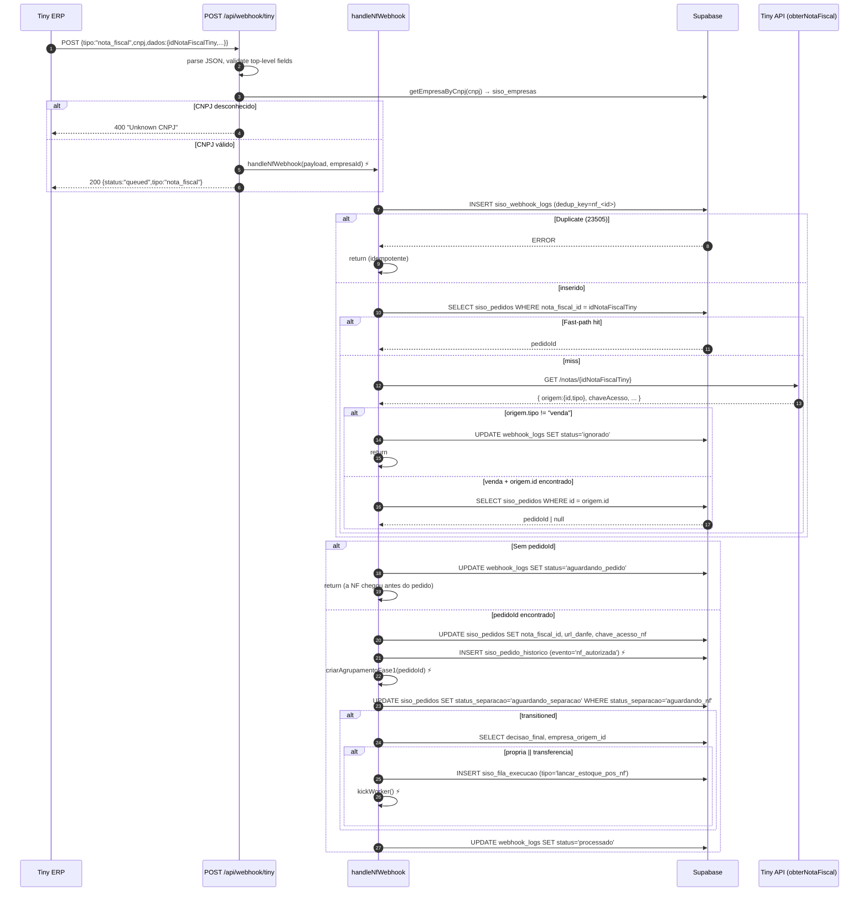
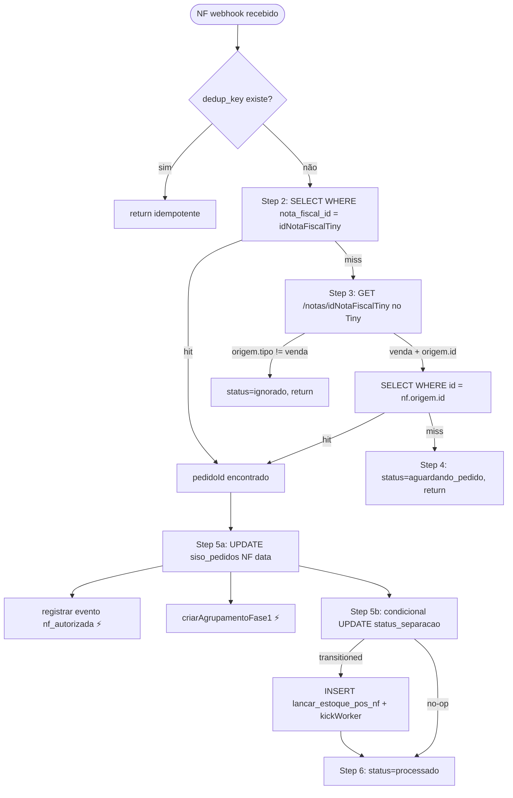
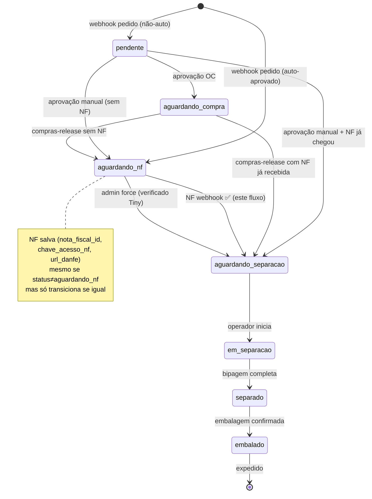
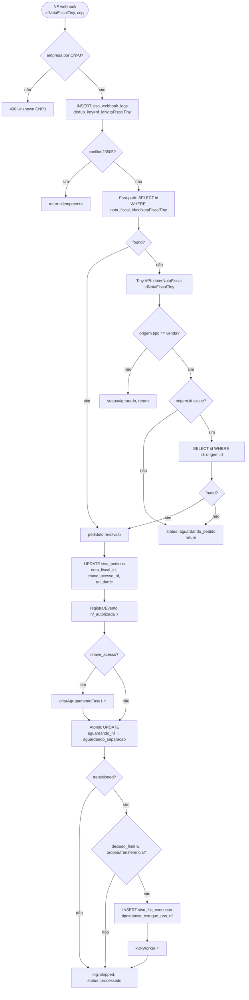
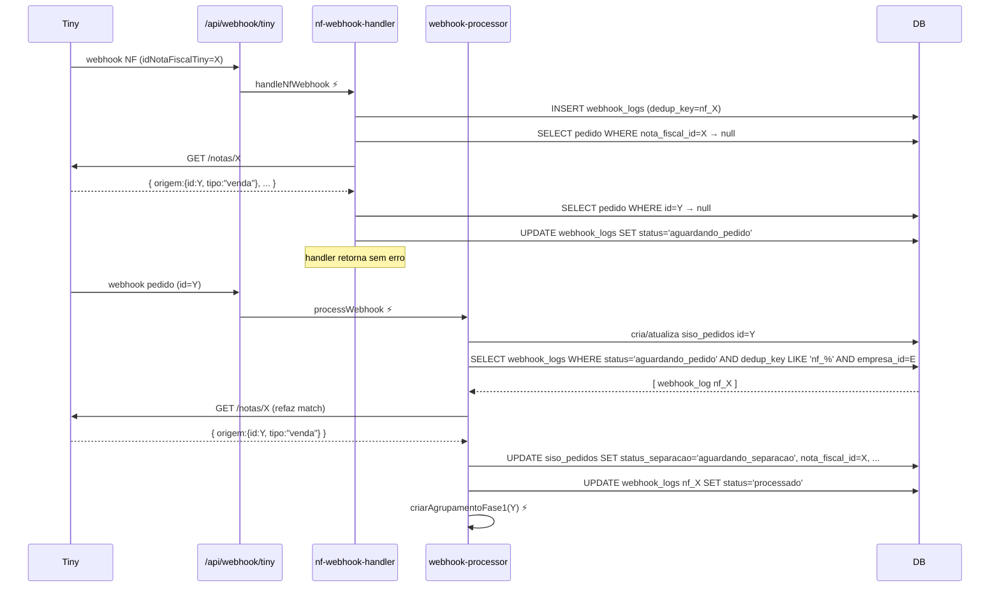

# 02 — Webhook de Nota Fiscal (Tiny ERP)

> **Resumo executivo:** O webhook de nota fiscal é o gatilho que libera o pedido para separação. Sem ele, todo pedido recém-aprovado fica preso em `status_separacao = aguardando_nf`. Quando o Tiny notifica que a NF foi autorizada pela SEFAZ, este fluxo identifica o pedido correspondente, persiste os campos da NF (`nota_fiscal_id`, `chave_acesso_nf`, `url_danfe`) e transiciona o pedido para `aguardando_separacao`, enfileirando o job pós-NF de lançamento de estoque quando aplicável. Também trata corridas onde a NF chega antes do pedido.

---

## Sumário (TOC)

1. [Por que existe](#1-por-que-existe)
2. [Entrada e discriminação do payload](#2-entrada-e-discriminação-do-payload)
3. [Contrato do payload de NF](#3-contrato-do-payload-de-nf)
4. [Diagrama de sequência (Tiny → API → Handler → DB)](#4-diagrama-de-sequência-tiny--api--handler--db)
5. [Cenários de chegada da NF](#5-cenários-de-chegada-da-nf)
   - 5.1 [NF chega depois do pedido (caso normal)](#51-nf-chega-depois-do-pedido-caso-normal)
   - 5.2 [NF chega antes do pedido (race)](#52-nf-chega-antes-do-pedido-race)
   - 5.3 [NF de pedido cancelado / status errado](#53-nf-de-pedido-cancelado--status-errado)
   - 5.4 [NF duplicada — dedup](#54-nf-duplicada--dedup)
   - 5.5 [NF que não é de venda — `origem.tipo != "venda"`](#55-nf-que-não-é-de-venda--origemtipo--venda)
6. [Reconciliação: matching pedido ↔ NF](#6-reconciliação-matching-pedido--nf)
7. [Atualização de `siso_pedidos`](#7-atualização-de-siso_pedidos)
8. [Side effects pós-NF](#8-side-effects-pós-nf)
9. [Histórico — `siso_pedido_historico`](#9-histórico--siso_pedido_historico)
10. [Diagramas de matching e estado](#10-diagramas-de-matching-e-estado)
11. [Tabelas afetadas e colunas escritas](#11-tabelas-afetadas-e-colunas-escritas)
12. [Logging e correlation IDs](#12-logging-e-correlation-ids)
13. [Casos de erro](#13-casos-de-erro)
14. [Side effects (resumo)](#14-side-effects-resumo)
15. [Erros conhecidos](#15-erros-conhecidos)

---

## 1. Por que existe

No fluxo padrão SISO, depois da decisão (`propria` / `transferencia` / `oc`) o `execution-worker` é responsável por **gerar a NF no Tiny** (`POST /pedidos/{id}/gerar-nota-fiscal`). Isso devolve apenas `{ id, numero, serie }` — a SEFAZ ainda **não autorizou**. Sem `chave_acesso_nf` válida não é possível:

- Imprimir a etiqueta de expedição (a etiqueta carrega a chave da NF).
- Lançar estoque pela NF (`/notas/{notaId}/lancar-estoque`).
- Pré-criar o `agrupamento` no Tiny (depende de NF autorizada).

Por isso o pedido entra em **`status_separacao = aguardando_nf`** após a aprovação. O Tiny dispara um webhook `tipo: "nota_fiscal"` quando a SEFAZ autoriza (situação 6 — Autorizada — ou 7 — Emitida DANFE), e este handler:

1. Atualiza `siso_pedidos` com `nota_fiscal_id`, `chave_acesso_nf`, `url_danfe`.
2. Transiciona `aguardando_nf → aguardando_separacao` (gatilho atômico via `WHERE status_separacao = 'aguardando_nf'`).
3. Enfileira o job `lancar_estoque_pos_nf` (próprias e transferências) que efetivamente baixa estoque.
4. Dispara fase-1 do `agrupamento` (cria agrupamento Tiny e descobre `expedicao_id`).

Referência: `src/lib/nf-webhook-handler.ts:1-249`.

> **Regra invariante:** A transição `aguardando_nf → aguardando_separacao` **só** acontece via webhook (ou via override admin que valida NF no Tiny). O `execution-worker` salva `chave_acesso_nf` quando consegue, mas **nunca** transiciona status. Ver `execution-worker.ts:65-79` (comentário: *"Transition aguardando_nf → aguardando_separacao happens ONLY via NF webhook"*).

---

## 2. Entrada e discriminação do payload

O endpoint **único** de webhook do Tiny é `POST /api/webhook/tiny` (`src/app/api/webhook/tiny/route.ts`). Ele recebe **dois tipos** de eventos: pedido (`tipo: "atualizacao_pedido"` ou `"inclusao_pedido"`) e NF (`tipo: "nota_fiscal"`). A discriminação é feita logo após a identificação da empresa por CNPJ:

```ts
// src/app/api/webhook/tiny/route.ts:56-79
if (tipo === "nota_fiscal") {
  const nfPayload = payload as unknown as NfWebhookPayload;
  if (!nfPayload.dados?.idNotaFiscalTiny) {
    return NextResponse.json({ error: "Missing dados.idNotaFiscalTiny" }, { status: 400 });
  }
  handleNfWebhook(nfPayload, empresa.empresaId).catch((err) => { /* logError */ });
  return NextResponse.json({ status: "queued", tipo: "nota_fiscal" });
}
```

**Pré-condições obrigatórias** antes do handler ser chamado:

| Campo | Origem | Validação |
|---|---|---|
| `tipo` | top-level | === `"nota_fiscal"` |
| `cnpj` | top-level | resolve via `getEmpresaByCnpj()` em `siso_empresas` |
| `dados.idNotaFiscalTiny` | nested | obrigatório, numérico |

Se o CNPJ não existir em `siso_empresas`, o webhook é rejeitado com `400 Unknown CNPJ` (`route.ts:46-53`). O handler é fire-and-forget — o endpoint sempre responde **200** imediatamente para o Tiny não retentar.

---

## 3. Contrato do payload de NF

Definição em TypeScript (`src/lib/nf-webhook-handler.ts:20-32`):

```ts
export interface NfWebhookPayload {
  cnpj: string;          // CNPJ da empresa emissora — usado para resolver siso_empresas
  tipo: string;          // sempre "nota_fiscal" neste fluxo
  dados: {
    idNotaFiscalTiny: number;   // ID interno da NF no Tiny (PK)
    numero?: string;            // Número fiscal
    serie?: string;             // Série
    urlDanfe?: string;          // URL pública da DANFE em PDF
    chaveAcesso?: string;       // Chave de acesso 44 dígitos (NFe)
    dataEmissao?: string;       // ISO date
    valorNota?: number;         // Valor total
  };
}
```

**Exemplo realista** (sanitizado):

```json
{
  "cnpj": "34857388000163",
  "tipo": "nota_fiscal",
  "dados": {
    "idNotaFiscalTiny": 871234567,
    "numero": "1024",
    "serie": "1",
    "urlDanfe": "https://erp.tiny.com.br/danfe/abc123.pdf",
    "chaveAcesso": "41260512345678000199550010000010241000000123",
    "dataEmissao": "2026-05-06T10:30:00-03:00",
    "valorNota": 187.50
  }
}
```

> **O Tiny envia este webhook somente quando a SEFAZ autoriza a NF.** Não há eventos para "NF rejeitada" via webhook — falhas de SEFAZ ficam visíveis ao consultar `obterNotaFiscal()` (campo `situacao`).

---

## 4. Diagrama de sequência (Tiny → API → Handler → DB)



---

## 5. Cenários de chegada da NF

### 5.1 NF chega depois do pedido (caso normal)

Sequência canônica:

1. Webhook de pedido cria/atualiza `siso_pedidos` (`status_separacao = aguardando_nf` se auto-aprovado).
2. Operador (ou auto-aprovação) enfileira `lancar_estoque` em `siso_fila_execucao`.
3. `execution-worker` chama `gerarNotaFiscalPedido()` → `siso_pedidos.nota_fiscal_id` preenchido.
4. Worker chama `enriquecerDadosNf()` que tenta `obterNotaFiscal(notaId)`. Se a NF já estiver autorizada (raro, segundos), salva `chave_acesso_nf`. **Não transiciona status.**
5. Tiny envia webhook `tipo:"nota_fiscal"` quando SEFAZ autoriza (geralmente segundos a minutos depois).
6. Handler entra no **fast-path** (`nf-webhook-handler.ts:74-78`): `WHERE nota_fiscal_id = idNotaFiscalTiny` retorna o pedido.
7. Atualiza `nota_fiscal_id`, `chave_acesso_nf`, `url_danfe`, transiciona, enfileira `lancar_estoque_pos_nf`.

Ver `nf-webhook-handler.ts:73-80` (fast-path) e `:138-146` (update sempre executado).

### 5.2 NF chega antes do pedido (race)

A janela de corrida existe porque o webhook de pedido roda processamento assíncrono pesado (busca pedido, enriquece estoque, salva itens). Em raras ocasiões a NF é autorizada e seu webhook chega **antes** do pedido estar persistido no banco.

Comportamento (`nf-webhook-handler.ts:82-136`):

1. Fast-path falha (não há pedido com `nota_fiscal_id` correspondente).
2. **Fallback via Tiny API**: chama `obterNotaFiscal(idNotaFiscalTiny)`. Se `nf.origem.id` existe e o pedido com aquele `id` existe em `siso_pedidos`, casa.
3. Se o pedido **ainda não existe**, marca o webhook log com `status = 'aguardando_pedido'` e retorna sem erro.
4. Quando o webhook de pedido eventualmente chega, o `webhook-processor` faz **reconciliação reversa** (`webhook-processor.ts:495-562`): consulta `siso_webhook_logs` por `status='aguardando_pedido' AND dedup_key LIKE 'nf_%' AND empresa_id = X`, refaz o match via Tiny, e se confirmar `nf.origem.id == pedidoTinyId`, faz a transição.

Esquema textual:

```
T0  NF webhook   → pedido não existe → webhook_logs.status='aguardando_pedido'
T1  Pedido webhook → cria siso_pedidos
T2  webhook-processor varre logs 'aguardando_pedido' e reconcilia
```

> Esta reconciliação é executada **após** o `INSERT` do pedido, no mesmo handler do webhook de pedido. Mesmo que o pedido seja criado em estado `pendente` (não auto-aprovado, sem `status_separacao`), a NF é gravada — e quando o operador aprovar, o endpoint `/api/pedidos/aprovar` decide `aguardando_nf` ou `aguardando_separacao` com base em `nota_fiscal_id && chave_acesso_nf` (`aprovar/route.ts:143-148`).

### 5.3 NF de pedido cancelado / status errado

O handler **sempre** persiste os dados da NF em `siso_pedidos` (Step 5a, `:138-146`), independentemente do `status` ou `status_separacao` atual. A transição para `aguardando_separacao` é condicional:

```ts
// nf-webhook-handler.ts:167-173
const { data: transitioned } = await supabase
  .from("siso_pedidos")
  .update({ status_separacao: "aguardando_separacao" })
  .eq("id", pedidoId)
  .eq("status_separacao", "aguardando_nf")   // só transiciona se estiver em aguardando_nf
  .select("id")
  .maybeSingle();
```

Tabela de comportamento por status atual:

| `status_separacao` quando NF chega | NF data salva? | Transiciona? | Job `lancar_estoque_pos_nf`? |
|---|:---:|:---:|:---:|
| `aguardando_nf` | sim | **sim** | sim (se decisão é própria/transferência) |
| `aguardando_separacao` | sim | não (idempotente) | não |
| `em_separacao` | sim | não | não |
| `separado` / `embalado` | sim | não | não |
| `aguardando_compra` (OC pendente) | sim | não (pedido ainda não saiu de OC) | não |
| `validacao_oc` | sim | não | não |
| `null` (pedido `pendente`/`cancelado`) | sim | não | não |

A linha do log para os casos sem transição é (`:237-241`): *"Pedido not in aguardando_nf — NF saved, transition skipped"*. Pedidos cancelados (`status='cancelado', status_separacao=null`) recebem os dados da NF mas nada mais acontece — a NF cancelada/devolvida deve ser tratada manualmente pelo operador no Tiny.

### 5.4 NF duplicada — dedup

A unicidade é garantida pelo índice em `siso_webhook_logs.dedup_key`. Para NFs, `dedup_key` é uma coluna gerada como `'nf_' || tiny_pedido_id` (no insert, `tiny_pedido_id = String(idNotaFiscalTiny)`). Ver `:42-69`:

```ts
const { data: logEntry, error: insertError } = await supabase
  .from("siso_webhook_logs")
  .insert({
    tiny_pedido_id: String(idNotaFiscalTiny),
    cnpj: payload.cnpj,
    tipo: "nota_fiscal",
    empresa_id: empresaId,
    payload,
  })
  .select("id").single();

if (insertError?.code === "23505") {
  logger.info("nf-webhook", "Duplicate NF webhook ignored", { ... });
  return;   // idempotente, nada a fazer
}
```

Reentregas pelo Tiny (timeout, retry) batem `23505` (unique violation) e o handler retorna silenciosamente. O webhook de pedido usa lógica análoga (`route.ts:121-124`) para sua própria dedup.

### 5.5 NF que não é de venda — `origem.tipo != "venda"`

O Tiny também emite webhooks de NF para outros tipos (devolução, NF de compra, NF complementar). Apenas `origem.tipo === "venda"` segue o fluxo. Se a fallback API revela outro tipo, o webhook é marcado como `ignorado`:

```ts
// nf-webhook-handler.ts:90-102
if (nf.origem?.tipo !== "venda") {
  logger.info("nf-webhook", "NF is not from a sale — ignoring", { idNotaFiscalTiny, origemTipo, empresaId });
  await supabase.from("siso_webhook_logs")
    .update({ status: "ignorado", processado_em: new Date().toISOString() })
    .eq("id", webhookLogId);
  return;
}
```

Este filtro só é aplicado **no fallback** (Step 3). No fast-path (a NF já está casada com um pedido SISO), assumimos `venda` por construção — pedidos SISO sempre são vendas.

---

## 6. Reconciliação: matching pedido ↔ NF

O handler tem **três caminhos de matching** em ordem de preferência:



**Critérios de match resumidos:**

| Etapa | Critério | Custo | Sucesso esperado |
|---|---|---|---|
| 2. Fast-path | `siso_pedidos.nota_fiscal_id = idNotaFiscalTiny` | 1 SQL | ~99% (worker já gravou `nota_fiscal_id` antes do webhook chegar) |
| 3a. Tiny API filtro | `nf.origem.tipo === "venda"` | 1 chamada Tiny | filtra NFs de devolução, compra, etc. |
| 3b. Slow-path | `siso_pedidos.id = nf.origem.id` | 1 chamada Tiny + 1 SQL | NFs criadas externamente (ex.: PDV Tiny) ou race condition |
| 4. Aguarda | `webhook_logs.status = 'aguardando_pedido'` | 1 SQL | NF chegou antes do pedido — reconciliado pelo `webhook-processor` |

> O campo `nf.origem.id` corresponde ao **`pedido_id` interno do Tiny**, que é exatamente o valor usado como PK em `siso_pedidos.id` (criado pelo webhook de pedido com `dados.id`). Não há mapeamento por `numero` — sempre por ID interno.

---

## 7. Atualização de `siso_pedidos`

Em **dois passos** distintos (`nf-webhook-handler.ts:138-173`):

**Passo 5a — sempre executa (idempotente)**

| Coluna | Valor | Origem |
|---|---|---|
| `nota_fiscal_id` | `String(idNotaFiscalTiny)` | `payload.dados.idNotaFiscalTiny` |
| `url_danfe` | `urlDanfe ?? null` | `payload.dados.urlDanfe` |
| `chave_acesso_nf` | `chaveAcesso ?? null` | `payload.dados.chaveAcesso` |

```ts
await supabase
  .from("siso_pedidos")
  .update({
    nota_fiscal_id: String(idNotaFiscalTiny),
    url_danfe: urlDanfe ?? null,
    chave_acesso_nf: chaveAcesso ?? null,
  })
  .eq("id", pedidoId);
```

**Passo 5b — condicional (apenas se `status_separacao = aguardando_nf`)**

| Coluna | Valor | Pré-condição |
|---|---|---|
| `status_separacao` | `'aguardando_separacao'` | atual = `'aguardando_nf'` |

A condição `WHERE status_separacao = 'aguardando_nf'` no UPDATE é a **proteção atômica** contra transições espúrias. Se o pedido já avançou para `em_separacao` (raro, mas possível com força-pendente admin) ou recuou para `cancelado`, o UPDATE é no-op.

> Campos **NÃO escritos** pelo handler: `numero` (NF), `serie`, `data_emissao`, `valor_nota`. Não existem colunas para esses campos em `siso_pedidos` (verificável em `database-schema.md` — apenas `nota_fiscal_id`, `chave_acesso_nf`, `url_danfe`).

---

## 8. Side effects pós-NF

Disparados **dentro** do mesmo handler, fire-and-forget (⚡) ou síncronos:

### 8.1 Histórico — `siso_pedido_historico`

```ts
// nf-webhook-handler.ts:148-152 — fire-and-forget (catch silencioso)
registrarEvento({
  pedidoId,
  evento: "nf_autorizada",
  detalhes: { idNotaFiscalTiny, chaveAcesso },
}).catch(() => {});
```

Evento registrado **sempre** que um pedido é encontrado, mesmo que a transição não aconteça (Passo 5a). Tipo `EventoPedido = "nf_autorizada"` definido em `historico-service.ts:13-37`.

### 8.2 Agrupamento Tiny (fase 1)

```ts
// nf-webhook-handler.ts:160-164
if (chaveAcesso) {
  criarAgrupamentoFase1(pedidoId).catch(() => {});
}
```

`criarAgrupamentoFase1()` (`agrupamento-service.ts:219`) cria atomicamente o **agrupamento de expedição** no Tiny e descobre o `expedicao_id` antecipadamente. Isso elimina o atraso na hora da impressão da etiqueta — o ZPL fica pronto para download. O método é idempotente (claim atômico via RPC `siso_claim_pedidos_para_agrupamento`).

> **Gate**: se `chave_acesso_nf` é `null` (raro — Tiny pode mandar webhook só com `urlDanfe`), o agrupamento é pulado e tentado em "segunda chance" no momento da conclusão de separação (`preCriarAgrupamentosEmLote`).

### 8.3 Job de lançamento de estoque pós-NF

Apenas se a transição aconteceu **e** `decisao_final ∈ {"propria", "transferencia"}`:

```ts
// nf-webhook-handler.ts:184-234
if (pedidoData && ["propria", "transferencia"].includes(pedidoData.decisao_final ?? "")) {
  let jobEmpresaId = empresaId;
  if (pedidoData.decisao_final === "transferencia") {
    // Para transferência, recupera empresa do job lancar_estoque original (a empresa de suporte)
    const { data: originalJob } = await supabase
      .from("siso_fila_execucao")
      .select("empresa_id")
      .eq("pedido_id", pedidoId)
      .eq("tipo", "lancar_estoque")
      .eq("decisao", "transferencia")
      .order("criado_em", { ascending: false })
      .limit(1).maybeSingle();
    if (originalJob) jobEmpresaId = originalJob.empresa_id;
  }

  await supabase.from("siso_fila_execucao").insert({
    pedido_id: pedidoId,
    tipo: "lancar_estoque_pos_nf",
    empresa_id: jobEmpresaId,
    decisao: pedidoData.decisao_final,
    atualizado_em: new Date().toISOString(),
  });
  kickWorker().catch(() => {});
}
```

| Decisão | `empresa_id` do job | Handler que processa |
|---|---|---|
| `propria` | `empresaId` do webhook (= empresa origem) | `executarEstoquePosNfPropria` (`execution-worker.ts:757`) |
| `transferencia` | `empresa_id` da empresa de suporte (do job `lancar_estoque` anterior) | `executarEstoquePosNfTransferencia` (`execution-worker.ts:798`) |
| `oc` | — (não enfileira aqui) | Estoque é deduzido no Ciclo 2 após `compras-release` |

`kickWorker()` (`execution-worker.ts:1067`) acorda o worker para processar imediatamente sem esperar o tick.

> **Por que transferência precisa da `empresa_id` da suporte?** O job `lancar_estoque_pos_nf` para transferência precisa autenticar no Tiny **da empresa de suporte** para movimentar estoque dela (saída física). Se usássemos a empresa origem, o token autenticaria na conta errada.

### 8.4 Atualização do log do webhook

```ts
// nf-webhook-handler.ts:245-248
await supabase
  .from("siso_webhook_logs")
  .update({ status: "processado", processado_em: new Date().toISOString() })
  .eq("id", webhookLogId);
```

Estados terminais possíveis em `siso_webhook_logs.status` para tipo `nota_fiscal`:

| Status | Quando |
|---|---|
| `pendente` (default) | recém-inserido — não deveria persistir após o handler retornar |
| `processado` | match e atualização concluída |
| `ignorado` | `nf.origem.tipo != "venda"` |
| `aguardando_pedido` | NF chegou antes do pedido — aguarda reconciliação |
| `erro` | nunca setado pelo handler — se exceção propaga, fica `pendente` (caller no `route.ts` chama `logger.logError`) |

---

## 9. Histórico — `siso_pedido_historico`

Linha gerada por NF autorizada:

| Coluna | Valor |
|---|---|
| `pedido_id` | UUID do pedido SISO |
| `evento` | `'nf_autorizada'` |
| `usuario_id` / `usuario_nome` | `null` (evento de sistema, sem operador) |
| `detalhes` | `{ idNotaFiscalTiny, chaveAcesso }` |
| `criado_em` | `now()` |

Quando admin força via `PATCH /api/separacao/{pedidoId}/forcar-pendente` ou `POST /api/separacao/forcar-pendente`, o detalhe inclui `{ forcado: true, verificado_tiny: true }` com `usuario_id`/`usuario_nome` da sessão admin (`forcar-pendente/route.ts:124-132`).

> O evento `aguardando_separacao` da `EventoPedido` enum **não** é gravado por este handler — quem grava é o flow de iniciar separação. A NF apenas faz o pedido ficar elegível.

---

## 10. Diagramas de matching e estado

### 10.1 State diagram — transição via NF webhook



### 10.2 Flowchart — algoritmo de matching pedido↔NF



### 10.3 Sequence — race entre pedido e NF



Esta reconciliação reversa está em `src/lib/webhook-processor.ts:495-562`.

---

## 11. Tabelas afetadas e colunas escritas

### 11.1 `siso_webhook_logs`

| Quando | Operação | Colunas |
|---|---|---|
| Step 1 | `INSERT` | `tiny_pedido_id` (= `String(idNotaFiscalTiny)`), `cnpj`, `tipo='nota_fiscal'`, `empresa_id`, `payload` |
| Step 6 | `UPDATE` | `status='processado'`, `processado_em=now()` |
| Step 4 (race) | `UPDATE` | `status='aguardando_pedido'` |
| Step 3 (não venda) | `UPDATE` | `status='ignorado'`, `processado_em=now()` |

`dedup_key` é coluna **gerada** (`'nf_' || tiny_pedido_id`) — não é escrita diretamente. Unique index garante idempotência.

### 11.2 `siso_pedidos`

| Quando | Colunas escritas |
|---|---|
| Step 5a (sempre) | `nota_fiscal_id`, `url_danfe`, `chave_acesso_nf` |
| Step 5b (condicional) | `status_separacao = 'aguardando_separacao'` |

### 11.3 `siso_pedido_historico`

| Quando | Linha inserida |
|---|---|
| Step 5a (sempre, fire-and-forget) | `evento='nf_autorizada', detalhes={idNotaFiscalTiny, chaveAcesso}` |

### 11.4 `siso_fila_execucao`

| Quando | Linha inserida |
|---|---|
| Step 5b (após transição, decisão própria/transferência) | `tipo='lancar_estoque_pos_nf'`, `pedido_id`, `empresa_id`, `decisao`, `status='pendente'` (default), `atualizado_em=now()` |

### 11.5 `siso_pedidos` (via `criarAgrupamentoFase1`, fire-and-forget)

| Quando | Coluna |
|---|---|
| Após criar agrupamento Tiny | `agrupamento_expedicao_id` (recebe `'pending'` durante claim, depois ID real ou `'expedido_externo'`) |

---

## 12. Logging e correlation IDs

### 12.1 Correlation ID

Gerado em `route.ts:21` no início do request (`generateCorrelationId()` → `${Date.now()}-${random}`). Anexado automaticamente a todas as chamadas `logger.logError` no mesmo request graças ao `_correlationId` global em `logger.ts:72-89`.

> Importante: o `correlationId` é **request-scoped via singleton** no módulo. Em ambiente serverless (Next.js Route Handlers), isso é seguro porque cada invocação tem seu próprio module instance. Em runtime tradicional Node.js single-process, há risco de cross-contamination — não é o caso atual.

### 12.2 Eventos de log emitidos pelo handler

`source = "nf-webhook"` em todos. Estrutura JSON via `console.log` + `siso_logs`.

| Mensagem | Nível | Contexto |
|---|---|---|
| `"Duplicate NF webhook ignored"` | `info` | dedup_key conflict |
| `"Failed to insert webhook log"` | `error` | falha 23505 não — outra falha de DB |
| `"NF is not from a sale — ignoring"` | `info` | `origem.tipo != "venda"` |
| `"Fallback NF lookup failed"` | `warn` | erro chamando `obterNotaFiscal` |
| `"No matching pedido found — saving for retry"` | `info` | race condition, status=aguardando_pedido |
| `"NF data saved on pedido"` | `info` | step 5a concluído |
| `"Pedido transitioned aguardando_nf → aguardando_separacao"` | `info` | step 5b sucesso |
| `"Job lancar_estoque_pos_nf enfileirado"` | `info` | step 5b job inserido |
| `"Falha ao enfileirar lancar_estoque_pos_nf..."` | `error` (via `logError`) | INSERT em fila falhou |
| `"Pedido not in aguardando_nf — NF saved, transition skipped"` | `info` | status atual ≠ aguardando_nf |

### 12.3 Erros estruturados

O caller (`route.ts:63-76`) protege a invocação fire-and-forget:

```ts
handleNfWebhook(nfPayload, empresa.empresaId).catch((err) => {
  logger.logError({
    error: err,
    source: "webhook",
    message: "NF webhook processing failed",
    category: "external_api",
    pedidoId: String(nfPayload.dados.idNotaFiscalTiny),
    empresaId: empresa.empresaId,
    correlationId,
    requestPath: "/api/webhook/tiny",
    requestMethod: "POST",
    metadata: { tipo: "nota_fiscal" },
  });
});
```

Resultado: linhas em `siso_logs` (level=error) e **`siso_erros`** com `category='external_api'`, `severity='error'`, `correlation_id`, `stack_trace`. Permite consultas tipo *"todos erros de NF webhook nas últimas 24h"*.

---

## 13. Casos de erro

### 13.1 Payload inválido (top-level)

| Falha | Resposta |
|---|---|
| JSON malformado | `400 { error: "Invalid JSON" }` |
| `tipo` ausente / `cnpj` ausente / `dados` ausente | `400 { error: "Missing required fields" }` |
| CNPJ não cadastrado em `siso_empresas` | `400 { error: "Unknown CNPJ: <cnpj>" }` |
| `dados.idNotaFiscalTiny` ausente (após discriminação) | `400 { error: "Missing dados.idNotaFiscalTiny" }` |

Todas estas verificações são síncronas no `route.ts` antes de chamar o handler, então o Tiny **vê** o 400 e pode retentar (ou alertar).

### 13.2 NF para pedido inexistente

Cenário 5.2 (race) — `webhook_logs.status = 'aguardando_pedido'`, retorna 200, será reconciliado pelo `webhook-processor`.

> Caso o pedido **nunca** chegue (ex.: Tiny não dispara o webhook de pedido por algum bug), o webhook log fica órfão indefinidamente. A reconciliação só acontece quando algum pedido com `empresa_id` correspondente é processado. Ver fluxo 10 para reconciliação manual.

### 13.3 NF para pedido em status incorreto

Step 5a sempre persiste os dados. Step 5b é no-op se `status_separacao != 'aguardando_nf'`. Não há erro reportado — log informativo *"NF saved, transition skipped"*.

### 13.4 Falha ao chamar Tiny no fallback

```ts
// nf-webhook-handler.ts:116-122
} catch (err) {
  logger.warn("nf-webhook", "Fallback NF lookup failed", { ... });
}
```

A falha é **não-fatal**: `pedidoId` permanece `null` e o handler segue para Step 4 (`status='aguardando_pedido'`). A reconciliação posterior pode resolver.

### 13.5 Falha ao inserir job pós-NF

```ts
// nf-webhook-handler.ts:215-226
if (insertErr) {
  logger.logError({
    error: new Error(insertErr.message),
    source: "nf-webhook",
    message: `Falha ao enfileirar lancar_estoque_pos_nf para pedido ${pedidoId}`,
    category: "database",
    pedidoId,
    metadata: { decisao, empresaId, code: insertErr.code },
  });
  return;
}
```

`return` antes do Step 6 — o webhook log fica `pendente` em vez de `processado`. Útil para diagnóstico (queries `WHERE status='pendente' AND tipo='nota_fiscal' AND criado_em < now() - interval '5 minutes'` podem disparar alerta).

### 13.6 Pedido sem `decisao_final`

Se `decisao_final` é `null` (pedido em estado inválido pós-aprovação) ou `"oc"`, o job **não** é enfileirado. Para `oc`, isso é por design: estoque é deduzido pelo `compras-release` quando todos os itens forem recebidos.

### 13.7 Override admin (forcar-pendente)

Quando admin usa `PATCH /api/separacao/{pedidoId}/forcar-pendente`:

1. Valida sessão admin (`session.cargos.includes("admin")`).
2. Valida `status_separacao === 'aguardando_nf'`.
3. **Consulta Tiny ao vivo** (`obterNotaFiscal`) para confirmar `situacao ∈ [6, 7]`.
4. Se autorizada, faz a transição e dispara `criarAgrupamentoFase1` (mesmo side effect do webhook).

Diferenças vs. webhook:

- **Não enfileira `lancar_estoque_pos_nf`** — fluxo admin assume que o operador sabe o que está fazendo. Se isso travar a separação, o pedido fica em separação mas estoque não é baixado. Ver erro conhecido em `tasks/prd-validacao-oc-separacao.md` se aplicável.
- Registra evento `nf_autorizada` com `detalhes.forcado=true`.

---

## 14. Side effects (resumo)

| # | Side effect | Quando | Tipo | Falha bloqueia? |
|---|---|---|---|---|
| 1 | INSERT `siso_webhook_logs` | sempre (entrada) | síncrono | sim — sem log, sem dedup |
| 2 | Chamada Tiny `GET /notas/{id}` | fast-path falha | síncrono | não — degrada para race |
| 3 | UPDATE `siso_pedidos` (NF data) | pedido encontrado | síncrono | sim |
| 4 | INSERT `siso_pedido_historico` `nf_autorizada` | pedido encontrado | ⚡ fire-and-forget | não |
| 5 | `criarAgrupamentoFase1(pedidoId)` | pedido encontrado + chave_acesso | ⚡ fire-and-forget | não |
| 6 | UPDATE `siso_pedidos` `status_separacao` | atual = `aguardando_nf` | síncrono | sim (mas é UPDATE atômico) |
| 7 | INSERT `siso_fila_execucao` `lancar_estoque_pos_nf` | transitioned + propria/transferencia | síncrono | sim — error logado, retorna sem step 8 |
| 8 | `kickWorker()` | step 7 sucesso | ⚡ fire-and-forget | não |
| 9 | UPDATE `siso_webhook_logs` `processado` | sucesso final | síncrono | não |

---

## 15. Erros conhecidos

> Consulte `erros-conhecidos.yaml` na raiz do projeto antes de debugar — muitos cenários abaixo já têm fix documentado.

### 15.1 NF travada em `aguardando_pedido` indefinidamente

**Sintoma:** Webhook de NF chegou, foi marcado `aguardando_pedido`, e nunca foi reconciliado.

**Causas conhecidas:**

- O pedido foi rejeitado pelo `webhook-processor` (ex.: `codigoSituacao='cancelado'` antes de chegar `aprovado`).
- Empresa não está configurada em `siso_grupo_empresas` — `webhook-processor` falha em `getOrdemDeducao`.
- `siso_tiny_connections` da empresa está inválida — `obterNotaFiscal` no fallback falha em ambos os lados (NF webhook e reconciliação posterior).

**Diagnóstico:**

```sql
SELECT id, criado_em, dedup_key, payload->'dados'->>'idNotaFiscalTiny' AS nf_id, empresa_id
FROM siso_webhook_logs
WHERE tipo = 'nota_fiscal' AND status = 'aguardando_pedido' AND criado_em < now() - interval '1 hour';
```

**Fix manual:** Disparar reconciliação pelo `POST /api/reconciliacao` ou processar o webhook de pedido manualmente via `POST /api/webhook/reprocessar`.

### 15.2 Pedido com `nota_fiscal_id` salvo mas sem `chave_acesso_nf`

**Sintoma:** `siso_pedidos.nota_fiscal_id IS NOT NULL` mas `chave_acesso_nf IS NULL`. Agrupamento não foi criado, etiqueta não imprime.

**Causa:** O `execution-worker` gerou a NF (Tiny devolve só `{id,numero,serie}`) mas a SEFAZ ainda não autorizou. Webhook de NF não chegou (atraso anormal de SEFAZ ou bug na configuração de webhook do Tiny).

**Fix:**

1. Admin pode usar `POST /api/separacao/forcar-pendente` (`forcar-pendente/route.ts`) — consulta Tiny ao vivo para verificar `situacao` e força transição se autorizada.
2. Backfill: `POST /api/admin/backfill-agrupamentos` itera pedidos com `nota_fiscal_id IS NOT NULL AND chave_acesso_nf IS NOT NULL` em `aguardando_nf` para tentar reagrupamento (`backfill-agrupamentos/route.ts:40-45`).

### 15.3 Webhook duplicado de NF para empresas diferentes

Não acontece — `dedup_key = 'nf_' || tiny_pedido_id` é unique global. Mas o `idNotaFiscalTiny` é único por instância Tiny, então em teoria duas empresas Tiny **diferentes** poderiam compartilhar IDs (extremamente improvável, mas conceitualmente possível). O CNPJ no payload protege contra cross-empresa: o handler usa `empresa_id` resolvido do CNPJ, não do `dedup_key`.

### 15.4 NF de devolução tratada como NF de venda

Não acontece via fast-path (NFs de devolução não são geradas pelo SISO, então `nota_fiscal_id` nunca casa). No fallback, o filtro `origem.tipo === "venda"` exclui devoluções. Ver `:90-102`.

### 15.5 Transição acontece duas vezes (idempotência)

O UPDATE com `WHERE status_separacao = 'aguardando_nf'` é atômico. Reentregas do Tiny são idempotentes — a segunda invocação não dispara o INSERT em `siso_fila_execucao` porque `transitioned` é null. **Exceção**: se a primeira invocação falhou *após* o UPDATE de transição mas *antes* do INSERT na fila, a segunda invocação verá `status_separacao = 'aguardando_separacao'` e **não** insere o job. Resultado: pedido em separação sem job de baixa de estoque. Mitigação: monitorar `siso_pedidos` em `aguardando_separacao` ou superior sem `estoque_lancado=true` há > 1h.

### 15.6 `kickWorker()` falha silenciosa

`kickWorker().catch(() => {})` — se o worker não acordar, o job fica `pendente` na fila e será capturado pelo próximo tick (configurado em `worker/processar/route.ts`). Não há perda de dados, apenas atraso de execução.

---

**Arquivos referenciados:**

- `src/app/api/webhook/tiny/route.ts:1-323` — entrada e discriminação
- `src/lib/nf-webhook-handler.ts:1-249` — handler principal
- `src/lib/webhook-processor.ts:495-562` — reconciliação reversa pós-pedido
- `src/lib/execution-worker.ts:65-83`, `:343-380`, `:594-596`, `:715-752`, `:757-796` — geração NF e jobs pós-NF
- `src/lib/agrupamento-service.ts:219-330` — fase 1 do agrupamento
- `src/lib/historico-service.ts:13-74` — eventos de histórico
- `src/lib/logger.ts:319-337` — `logError` estruturado
- `src/lib/tiny-api.ts:461-484` — `obterNotaFiscal`, contrato `TinyNotaFiscal`
- `src/app/api/separacao/forcar-pendente/route.ts:1-155` — override em lote
- `src/app/api/separacao/[pedidoId]/forcar-pendente/route.ts:1-129` — override single
- `src/app/api/admin/backfill-agrupamentos/route.ts` — backfill de agrupamentos
- `src/app/api/pedidos/aprovar/route.ts:140-148` — decisão `aguardando_nf` vs. `aguardando_separacao` na aprovação manual
- `src/lib/compras-release.ts:144-152` — caminho OC pós-recebimento
- `docs/database-schema.md` (linhas 745-776 — siso_webhook_logs; linhas 60-72 — colunas NF em siso_pedidos)
