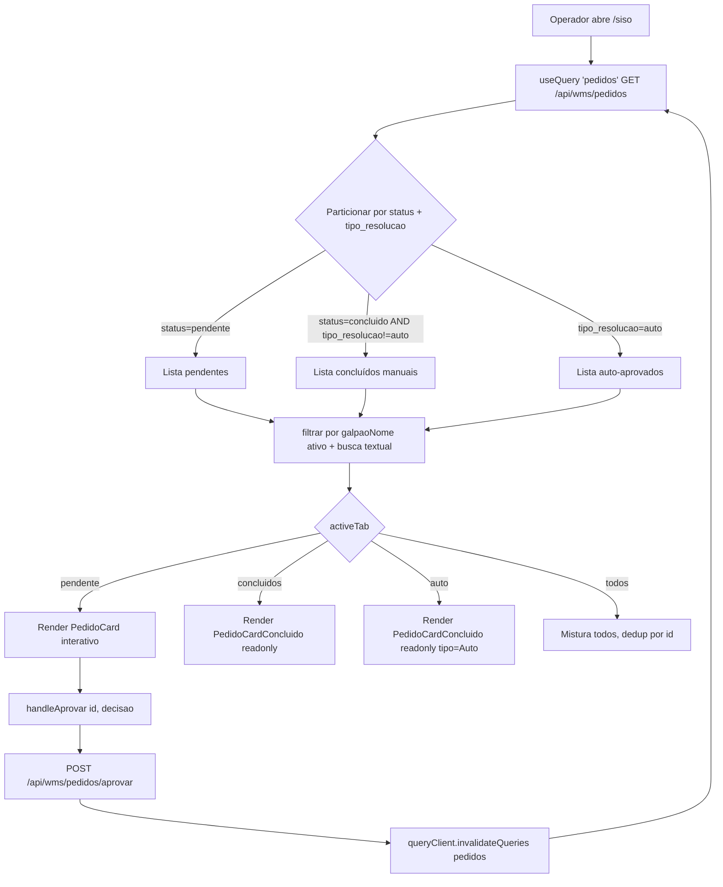
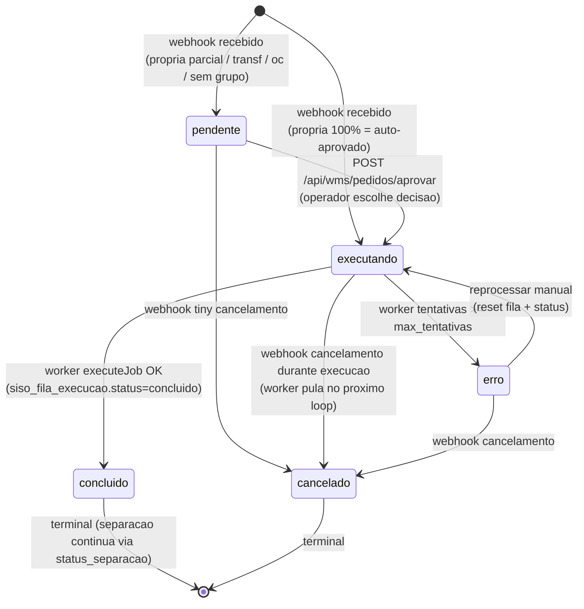
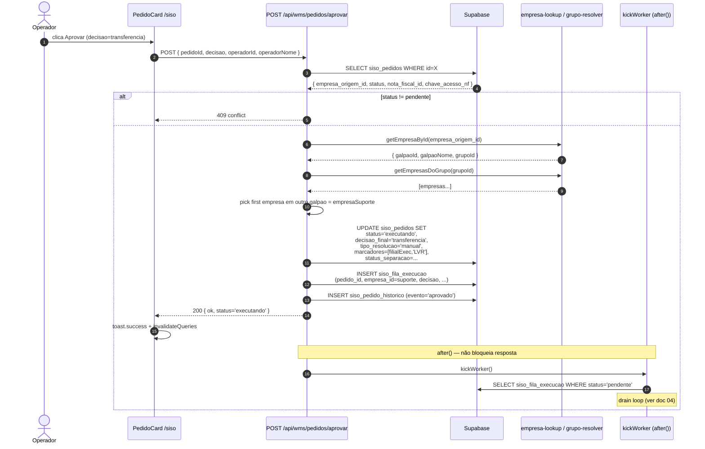

# Fluxo 03 — Aprovação & Decisão (`/siso`)

> Painel principal do operador: aprovação manual de pedidos, escolha de decisão (`propria` / `transferencia` / `oc`), filtro role-based e enfileiramento para o execution worker.

---

## Sumário (TOC)

- [1. Visão geral do painel `/siso`](#1-visão-geral-do-painel-siso)
- [2. As três (quatro) tabs do painel](#2-as-três-quatro-tabs-do-painel)
  - [2.1 Tab `Pendente`](#21-tab-pendente)
  - [2.2 Tab `Concluídos`](#22-tab-concluídos)
  - [2.3 Tab `Auto`](#23-tab-auto)
  - [2.4 Tab `Todos` (composição)](#24-tab-todos-composição)
- [3. Filtro role-based](#3-filtro-role-based)
- [4. Card de pedido pendente — UI](#4-card-de-pedido-pendente--ui)
  - [4.1 Anatomia do card](#41-anatomia-do-card)
  - [4.2 Pílulas de estoque por galpão](#42-pílulas-de-estoque-por-galpão)
  - [4.3 Edição inline de saldo (`/api/wms/tiny/stock/ajustar`)](#43-edição-inline-de-saldo-apitinystockajustar)
  - [4.4 Troca de SKU (`/api/wms/compras/trocar-sku`)](#44-troca-de-sku-apicomprastrocar-sku)
  - [4.5 Dropdown de decisão e override](#45-dropdown-de-decisão-e-override)
- [5. Card de pedido concluído](#5-card-de-pedido-concluído)
- [6. Listagem `GET /api/wms/pedidos`](#6-listagem-get-apipedidos)
- [7. Aprovação manual `POST /api/wms/pedidos/aprovar`](#7-aprovação-manual-post-apipedidosaprovar)
  - [7.1 Contrato request/response](#71-contrato-requestresponse)
  - [7.2 Validações](#72-validações)
  - [7.3 Resolução de empresa de execução](#73-resolução-de-empresa-de-execução)
  - [7.4 Marcadores enviados ao Tiny](#74-marcadores-enviados-ao-tiny)
  - [7.5 Atualização de `siso_pedidos`](#75-atualização-de-siso_pedidos)
  - [7.6 Insert em `siso_fila_execucao`](#76-insert-em-siso_fila_execucao)
  - [7.7 Kick do worker (`after()`)](#77-kick-do-worker-after)
- [8. Auto-aprovação vs aprovação manual](#8-auto-aprovação-vs-aprovação-manual)
- [9. Cancelamento via webhook](#9-cancelamento-via-webhook)
- [10. Histórico (`siso_pedido_historico`)](#10-histórico-siso_pedido_historico)
- [11. Diagramas](#11-diagramas)
- [12. Side effects](#12-side-effects)
- [13. Erros conhecidos](#13-erros-conhecidos)

---

## 1. Visão geral do painel `/siso`

`src/app/siso/page.tsx:30` é o componente raiz do dashboard. É um painel client-side (Next.js App Router, `"use client"`) que:

1. Faz **polling** de `GET /api/wms/pedidos` a cada 30s via TanStack React Query (`refetchInterval: 30_000`, `src/app/siso/page.tsx:36-41`).
2. Particiona os pedidos retornados em três conjuntos disjuntos: `pendentes`, `concluidos` (manual), `auto` (auto-aprovados — `tipoResolucao === "auto"`).
3. Aplica **filtro por galpão ativo** (do `<GalpaoSelector />` no header) + busca textual livre (`cliente.nome`, `idPedidoEcommerce`, `numero`, `sku`) — `src/app/siso/page.tsx:58-92`.
4. Renderiza pedidos pendentes no `<PedidoCard>` (interativo, com aprovação) e os demais no `<PedidoCardConcluido>` (read-only, expandível).

A página inteira é embrulhada pelo `<AppShell>` (`src/components/app-shell.tsx`), que faz checagem de sessão e renderiza header/breadcrumbs.

```ts
// src/app/siso/page.tsx:36-41
const { data: allPedidos = [], isRefetching } = useQuery({
  queryKey: ["pedidos"],
  queryFn: fetchPedidos,
  enabled: !!user,
  refetchInterval: 30_000,
});
```

A invalidação manual (botão `RefreshCw`) chama `queryClient.invalidateQueries({ queryKey: ["pedidos"] })` — não há WebSocket/Realtime nesse painel; a feed é puramente polling. (Realtime é usado no módulo de separação, não aqui.)

---

## 2. As três (quatro) tabs do painel

A definição das tabs está em `src/app/siso/page.tsx:94-99`:

```ts
const tabs: Tab[] = [
  { id: "todos",      label: "Todos",      count: todosFiltrados.length },
  { id: "pendente",   label: "Pendente",   count: pendentesFiltrados.length },
  { id: "concluidos", label: "Concluídos", count: concluidosFiltrados.length },
  { id: "auto",       label: "Auto",       count: autoFiltrados.length },
];
```

A tab `auto` é **escondida** se o usuário só tem cargo `comprador` (não tem outros papéis):

```ts
// src/app/siso/page.tsx:101-104
const onlyComprador = userCargos.length === 1 && userCargos[0] === "comprador";
const visibleTabs = onlyComprador ? tabs.filter((t) => t.id !== "auto") : tabs;
```

### 2.1 Tab `Pendente`

- Filtra por `p.status === "pendente"` (`src/app/siso/page.tsx:44-47`).
- Renderiza `<PedidoCard>` para cada pedido — card **interativo** com botão "Aprovar" e dropdown de decisão.
- É a tab "viva" do operador: tudo que o webhook não conseguiu auto-aprovar cai aqui.
- Sem itens: mostra `<EmptyState message="Nenhum pedido pendente no momento." />`.

### 2.2 Tab `Concluídos`

- Filtra por `p.status === "concluido" && p.tipoResolucao !== "auto"` (`src/app/siso/page.tsx:48-51`).
- Apenas pedidos **manualmente aprovados** já concluídos pelo worker.
- Renderiza `<PedidoCardConcluido>` — card colapsado por padrão, expansível.
- Mostra `tipoResolucao === "manual"` + nome do operador (`pedido.operador`).

### 2.3 Tab `Auto`

- Filtra por `p.tipoResolucao === "auto"` (`src/app/siso/page.tsx:52-55`).
- **Não filtra por status** — capta tanto auto-aprovados em execução quanto concluídos.
- Operadores enxergam os pedidos que o sistema processou sem revisão humana.
- Útil para auditoria: o time de operação consegue conferir o que o webhook decidiu sozinho.

### 2.4 Tab `Todos` (composição)

- União dos três conjuntos filtrados, **deduplicada por `id`** mantendo a ordem (pendente → concluído → auto):

```ts
// src/app/siso/page.tsx:81-92
const seen = new Set<string>();
const result: Pedido[] = [];
for (const p of [...pendentesFiltrados, ...concluidosFiltrados, ...autoFiltrados]) {
  if (!seen.has(p.id)) {
    seen.add(p.id);
    result.push(p);
  }
}
```

- Renderiza `<PedidoCard>` para os ainda `pendente` e `<PedidoCardConcluido>` para o resto, no mesmo container compactado.

---

## 3. Filtro role-based

A função `filtrarPendentesGalpao` / `filtrarConcluidosGalpao` / `filtrarAutoGalpao` em `src/lib/filtrar-pedidos.ts:9-40` filtra por **galpão ativo** (vindo do `GalpaoSelector` no header). Quando `galpaoNome` é `null` (admin selecionou "Todos"), retorna a lista inteira.

A regra implementada hoje no painel é simples: **todo pedido pertence ao seu galpão de origem (`p.filialOrigem`)**, independente de a decisão ser `propria`, `transferencia` ou `oc`. O galpão de origem é quem decide e quem opera o ciclo.

```ts
// src/lib/filtrar-pedidos.ts:9-17
export function filtrarPendentesGalpao(pedidos: Pedido[], galpaoNome: string | null): Pedido[] {
  if (!galpaoNome) return pedidos;
  return pedidos.filter((p) => {
    const sugestao = p.sugestao;
    // Transferencia: quem aprova é o galpão de ORIGEM (quem recebeu o pedido)
    // Propria / OC / outros: também o galpão de origem
    return p.filialOrigem === galpaoNome;
  });
}
```

Existe um conjunto **legado** (`filtrarPendentes`, `filtrarConcluidos`, `filtrarAuto`) marcado `@deprecated` em `src/lib/filtrar-pedidos.ts:42-154` que opera por `cargo`:

| Cargo | Pendentes | Concluídos | Auto |
|---|---|---|---|
| `admin` | tudo | tudo | tudo |
| `operador_cwb` | `filialOrigem === "CWB"` | idem | idem |
| `operador_sp` | `filialOrigem === "SP"` | idem | idem |
| `comprador` | apenas `sugestao === "oc"` | apenas `decisaoFinal === "oc"` | (vazio — não vê auto) |

> **Estado atual:** o painel real usa o filtro por galpão (mais flexível para multi-galpão futuro). O comportamento por cargo segue acessível via deprecated helpers e é a base conceitual do `GalpaoSelector` (admin → seleciona qualquer; operadores → travados no seu galpão; comprador → tab `auto` sumida).

---

## 4. Card de pedido pendente — UI

`src/components/pedido/pedido-card.tsx:655-790` (`<PedidoCard>`).

### 4.1 Anatomia do card

```
┌────────────────────────────────────────────────────────────────┐
│ ▌ #12345  EC 9912  José Silva                NETAIR  ML  → CWB │  ← Header
│ ─────────────────────────────────────────────────────────────  │
│ ┌──┐ MK1234  Filtro de óleo Honda                              │  ← Item row
│ │16│ 📍 A2-04   ▏ CWB 5  SP 0                                  │
│ └──┘                                                           │
│ ┌──┐ TG999  Pastilha freio                                     │
│ │ 1│ 🛒 OC  📍 SP: B1-09  ▏ CWB 0  SP 2                        │
│ └──┘                                                           │
│ ─────────────────────────────────────────────────────────────  │
│ <ObservacoesTimeline>                                          │
│ ─────────────────────────────────────────────────────────────  │
│ 📦 Própria CWB ▾                                  [ Aprovar → ]│  ← Action row
└────────────────────────────────────────────────────────────────┘
```

A **strip vertical** colorida do lado esquerdo (`getDecisaoStripColor`) reflete em tempo real a decisão escolhida — muda de cor ao trocar via dropdown. Header tem:

- `#número` (numero Tiny) + `EC ...` (id_pedido_ecommerce)
- nome do cliente (truncado)
- `empresaOrigemNome` (badge cinza, ex: `NETAIR`)
- `ecommerceAbbr` (`ML`, `SP`, `WS`...) com cor pelo marketplace (`getEcommerceColors`)
- seta `→` + galpão de origem com cor dedicada (`getFilialColors`)
- se `pedido.encaminhado_de` existir: badge roxo "Encaminhado de X"

### 4.2 Pílulas de estoque por galpão

Cada item renderiza um conjunto de `<EditableStockPill>` — uma por galpão presente no map `item.estoques`. As cores das pílulas:

| Estado | Cor | Significado |
|---|---|---|
| `disponivel == null` | cinza `—` | API nem retornou estoque (empresa indisponível) |
| `disponivel === 0` | vermelho | sem estoque |
| `disponivel >= quantidadePedida` | verde | atende |
| `0 < disponivel < quantidadePedida` | âmbar | parcial |

A pílula do galpão **relevante** para a decisão escolhida fica destacada (label em `text-zinc-600` ao invés de `text-ink-faint`):

- decisão `propria` → galpão de origem é o relevante;
- decisão `transferencia` → todos os outros galpões são relevantes;
- decisão `oc` → nenhum (a OC ignora estoque presente).

Quando **nenhum galpão atende** (`!Object.values(item.estoques).some((g) => g.atende)`), o card mostra um badge âmbar "🛒 OC" + as localizações de cada galpão que tenha localização, indicando ao operador que aquele item provavelmente irá para compra (`src/components/pedido/pedido-card.tsx:437-446`).

### 4.3 Edição inline de saldo (`/api/wms/tiny/stock/ajustar`)

Clique no número da pílula → input editável → Enter envia `POST /api/wms/tiny/stock/ajustar`:

```ts
// src/components/pedido/pedido-card.tsx:183-187
fetch("/api/wms/tiny/stock/ajustar", {
  method: "POST",
  headers: { "Content-Type": "application/json" },
  body: JSON.stringify({ pedidoId, produtoId, galpao, quantidade: novoSaldo, tipo: "B" }),
});
```

`tipo: "B"` = **balance** (ajuste para saldo absoluto, não delta). O backend chama `movimentarEstoque` no Tiny e retorna `{ saldo, reservado, disponivel }` atualizados, que substituem o estado local da pílula. Isso permite o operador "consertar" a oferta sem sair do card antes de aprovar.

> Produtos com `produtoId === 0` (sem ID Tiny) ficam **read-only** com tooltip explicativo (`src/components/pedido/pedido-card.tsx:251-262`).

### 4.4 Troca de SKU (`/api/wms/compras/trocar-sku`)

Lápis ao lado do badge de SKU → input → Enter chama `POST /api/wms/compras/trocar-sku`:

```ts
// src/components/pedido/pedido-card.tsx:332-336
sisoFetch("/api/wms/compras/trocar-sku", {
  method: "POST",
  headers: { "Content-Type": "application/json" },
  body: JSON.stringify({ item_ids: [item.itemId], novo_sku: newSku.trim() }),
});
```

Útil quando o SKU vendido no marketplace está errado/legado e precisa ser corrigido antes da aprovação.

### 4.5 Dropdown de decisão e override

A decisão **default** ao montar o card:

```ts
// src/components/pedido/pedido-card.tsx:656-661
const hasItemSemEstoque = pedido.itens.some(
  (item) => !Object.values(item.estoques).some((g) => g.atende),
);
const [decisao, setDecisao] = useState<Decisao>(
  hasItemSemEstoque ? "oc" : pedido.sugestao,
);
```

Ou seja: se **algum item não tem estoque em galpão nenhum**, default = `oc`. Caso contrário, segue a sugestão calculada pelo webhook (`pedido.sugestao`).

O `<DecisaoDropdown>` (`src/components/pedido/pedido-card.tsx:486-553`) abre um popover com as **alternativas** à decisão atual. Cada alternativa indica disponibilidade via `decisaoIsAvailable`:

- `oc` → sempre disponível
- `propria` → `galpaoAtendeTudo(itens, filialOrigem)` (origem cobre 100%)
- `transferencia` → existe **outro** galpão que cobre 100%

Alternativas indisponíveis são mostradas mas com `cursor-not-allowed opacity-40` + texto "sem estoque". O operador **pode override** a sugestão livremente — o backend não rejeita se a decisão escolhida não tem estoque (cabe ao worker tentar e falhar com retry).

Botão `Aprovar` chama `handleAprovar(pedido.id, decisao)` → toaster `toast.success/error` → `queryClient.invalidateQueries(["pedidos"])`.

---

## 5. Card de pedido concluído

`src/components/pedido/pedido-card-concluido.tsx:189-344` (`<PedidoCardConcluido>`).

- Linha resumo clicável (`onClick={() => setExpanded((v) => !v)}`).
- Mostra: `#numero`, cliente, `ecommerceAbbr`, galpão de origem, decisão final (`DECISAO_LABELS[decisao]`), checkmark, "Auto" (azul) ou `Manual (operador)`, hora processada (`formatTime(processadoEm)`).
- Decisão exibida: `pedido.decisaoFinal ?? pedido.sugestao` (queda para sugestão se a final ainda não foi salva).
- Ao expandir: `sugestaoMotivo`, todas as linhas de produto em modo read-only (`<ProductRowReadonly>`), marcadores e `erro` se houver.
- Pílulas de estoque são `<StockPill>` (sem edição) — apenas leitura.

---

## 6. Listagem `GET /api/wms/pedidos`

`src/app/api/wms/pedidos/route.ts:157-204`.

**Query params:**
- `?status=pendente,executando` — filtro CSV opcional.

**Sem filtro:** retorna **todos** os pedidos ativos (`status in ('pendente','executando','erro')`) **+** os 150 mais recentes em outros status (`concluido`, `cancelado`). Isso evita o LIMIT esconder pendentes em momentos de alto volume.

```ts
// src/app/api/wms/pedidos/route.ts:181-193
const activeStatuses = ["pendente", "executando", "erro"];
const [activeResult, recentResult] = await Promise.all([
  supabase.from("siso_pedidos")
    .select("*, siso_empresas(nome)")
    .in("status", activeStatuses)
    .order("criado_em", { ascending: false }),
  supabase.from("siso_pedidos")
    .select("*, siso_empresas(nome)")
    .not("status", "in", `(${activeStatuses.join(",")})`)
    .order("criado_em", { ascending: false })
    .limit(150),
]);
```

**Joins paralelos** em `buildResponse` (`src/app/api/wms/pedidos/route.ts:16-143`):

1. `siso_pedido_itens` — produtos do pedido (id, produto_id, sku, descricao, quantidade_pedida, fornecedor_oc, imagem_url).
2. `siso_pedido_item_estoques` com `siso_empresas!inner(galpao_id, siso_galpoes!inner(nome))` — estoque normalizado por empresa, agregando para o `nome` do galpão.

Para cada item, **agrega o estoque por galpão** (somando saldo/reservado/disponivel se a mesma empresa tiver mais de um depósito por galpão; pega a primeira `localizacao` não-nula). Resultado: `estoques: Record<string, GalpaoEstoque>` keyed by galpão name — **dinâmico**, sem hardcode CWB/SP.

A resposta é mapeada para o tipo `Pedido` (camelCase) usado no frontend (`src/types/index.ts`). Campos relevantes: `id`, `numero`, `data`, `filialOrigem`, `empresaOrigemId/Nome`, `idPedidoEcommerce`, `nomeEcommerce`, `cliente`, `formaEnvio`, `itens[]`, `sugestao`, `sugestaoMotivo`, `status`, `tipoResolucao`, `decisaoFinal`, `operador`, `processadoEm`, `marcadores`, `erro`, `criadoEm`, `encaminhado_de`.

---

## 7. Aprovação manual `POST /api/wms/pedidos/aprovar`

`src/app/api/wms/pedidos/aprovar/route.ts:20-219`.

### 7.1 Contrato request/response

**Request body:**

```json
{
  "pedidoId": "string",
  "decisao": "propria" | "transferencia" | "oc",
  "operadorId": "uuid?",
  "operadorNome": "string?"
}
```

**Response (200):**

```json
{
  "ok": true,
  "pedidoId": "...",
  "decisao": "propria",
  "filialExecucao": "CWB",
  "empresaExecucaoId": "uuid",
  "status": "executando"
}
```

**Erros:**

| Status | Causa |
|---|---|
| 400 | JSON inválido, `pedidoId`/`decisao` faltando, decisão fora do enum |
| 404 | Pedido não encontrado, ou `empresa_origem_id` aponta para empresa inexistente |
| 409 | Pedido não está em status `pendente` |
| 422 | Pedido sem `empresa_origem_id` (webhook precisa ser reprocessado) |
| 500 | Falha no `UPDATE` do supabase |

### 7.2 Validações

```ts
// src/app/api/wms/pedidos/aprovar/route.ts:36-72
if (!pedidoId || !decisao) → 400
if (!["propria","transferencia","oc"].includes(decisao)) → 400
SELECT pedido by id → if missing → 404
if (pedido.status !== "pendente") → 409
if (!pedido.empresa_origem_id) → 422
const empresaOrigem = await getEmpresaById(pedido.empresa_origem_id);
if (!empresaOrigem) → 404
```

### 7.3 Resolução de empresa de execução

```ts
// src/app/api/wms/pedidos/aprovar/route.ts:92-125
if (decisao === "propria" || decisao === "oc") {
  empresaExecucaoId = pedido.empresa_origem_id;
  filialExecucao    = filialOrigem;
  separacaoGalpaoId = empresaOrigem.galpaoId;
} else {
  // transferencia: empresa de OUTRO galpão dentro do mesmo grupo
  const empresasDoGrupo = empresaOrigem.grupoId
    ? await getEmpresasDoGrupo(empresaOrigem.grupoId) : [];
  const empresaSuporte = empresasDoGrupo.find(
    (e) => e.galpaoId !== empresaOrigem.galpaoId,
  );
  if (empresaSuporte) {
    empresaExecucaoId = empresaSuporte.empresaId;
    filialExecucao    = empresaSuporte.galpaoNome;
    separacaoGalpaoId = empresaSuporte.galpaoId;
  } else {
    // Fallback warn-log: usa origem mesmo
    empresaExecucaoId = pedido.empresa_origem_id;
    filialExecucao    = filialOrigem;
    separacaoGalpaoId = empresaOrigem.galpaoId;
  }
}
```

> **Observação importante:** essa resolução de "empresa suporte" é **frouxa** — apenas pega a primeira empresa em outro galpão do grupo (sem ordenar por tier, sem checar se cobre 100%). A escolha real da empresa que vai sofrer dedução é feita só depois, no worker (`executarEstoquePosNfTransferencia`, `src/lib/execution-worker.ts:885-918`), que percorre `getOrdemDeducao` e procura uma empresa que **cubra 100% dos itens**.

### 7.4 Marcadores enviados ao Tiny

```ts
// src/app/api/wms/pedidos/aprovar/route.ts:128-130
const marcadores: string[] =
  decisao === "oc"
    ? ["OC", filialOrigem, "LVR"]
    : [filialExecucao, "LVR"];
```

- `LVR` é inserido pelo `webhook-processor` ao receber o pedido (já no Tiny). Aqui é incluído no array do banco para consistência; o filtro em `inserirMarcadoresTiny` (`src/lib/execution-worker.ts:322-340`) remove `LVR` antes do POST batch para evitar 400 de duplicação.
- `OC` indica ao Tiny que esse pedido virou ordem de compra interna.
- `filialOrigem`/`filialExecucao` (ex: `CWB`, `SP`) marcam fisicamente onde o pedido será separado.

### 7.5 Atualização de `siso_pedidos`

```ts
// src/app/api/wms/pedidos/aprovar/route.ts:133-150
UPDATE siso_pedidos SET
  status              = 'executando',
  decisao_final       = <decisao>,
  operador_id         = <id>,
  operador_nome       = <nome>,
  tipo_resolucao      = 'manual',
  marcadores          = <array>,
  separacao_galpao_id = <galpao>,
  status_separacao    = decisao === 'oc' ? null
                      : (nota_fiscal_id && chave_acesso_nf) ? 'aguardando_separacao'
                      : 'aguardando_nf'
WHERE id = <pedidoId>;
```

A lógica de `status_separacao` reflete o estado atual do pedido na hora da aprovação:

- `oc` → `null` (entra no fluxo de compras antes; é o worker que decide se vira `validacao_oc` ou `aguardando_nf`).
- não-OC + NF já autorizada (tem `chave_acesso_nf` e `nota_fiscal_id`) → já vai para `aguardando_separacao`.
- não-OC + sem NF → fica em `aguardando_nf` aguardando webhook do Tiny.

### 7.6 Insert em `siso_fila_execucao`

```ts
// src/app/api/wms/pedidos/aprovar/route.ts:164-174
INSERT INTO siso_fila_execucao (
  pedido_id, tipo, filial_execucao, empresa_id, decisao,
  operador_id, operador_nome
) VALUES (
  <pedidoId>, 'lancar_estoque', <filial>, <empresa_exec_id>, <decisao>,
  <op_id>, <op_nome>
);
```

Defaults da tabela: `status='pendente'`, `tentativas=0`, `max_tentativas=3`, `prioridade=false`. Ver schema completo em `docs/database-schema.md` § `siso_fila_execucao`.

> **Falha do queue insert é tolerada**: se der erro o status do pedido já está como `executando` e pode ser reprocessado manualmente. O endpoint loga e segue (`src/app/api/wms/pedidos/aprovar/route.ts:176-183`).

### 7.7 Kick do worker (`after()`)

```ts
// src/app/api/wms/pedidos/aprovar/route.ts:202-209
after(() => {
  kickWorker().catch((err) => {
    logger.error("aprovar", "Worker kick failed", {
      pedidoId,
      error: err instanceof Error ? err.message : String(err),
    });
  });
});
```

`after()` é uma API do Next.js 15+ que executa código **após** a resposta HTTP ser enviada — não bloqueia a resposta. `kickWorker()` (singleton, ver doc 04) drena toda a fila pendente. Se o worker já estiver rodando, o kick é no-op (a próxima iteração pega o novo job).

A resposta HTTP retorna `200 ok` em milissegundos enquanto o worker processa em background.

---

## 8. Auto-aprovação vs aprovação manual

Auto-aprovação acontece **dentro do `webhook-processor`** quando a sugestão é `propria` E não é parcial (`src/lib/webhook-processor.ts:322-326`):

```ts
const isAuto = sugestao === "propria" && !parcial;
const status = isAuto ? "executando" : "pendente";
const tipoResolucao = isAuto ? "auto" : null;
```

| Aspecto | Auto-aprovação | Aprovação manual |
|---|---|---|
| **Origem** | `src/lib/webhook-processor.ts:404-419` | `src/app/api/wms/pedidos/aprovar/route.ts:131-209` |
| **Trigger** | Webhook Tiny (`pedido.alterado`/`pedido.incluido`) | Operador clica `Aprovar` no `/siso` |
| **Status inicial** | `executando` (já cria com esse status) | `pendente` → `executando` |
| **`tipo_resolucao`** | `"auto"` | `"manual"` |
| **`decisao_final`** | sempre `"propria"` (única que auto-aprova) | qualquer das três |
| **`operador_*`** | `null` | preenchido com `id`/`nome` da sessão |
| **`marcadores`** iniciais | `[galpaoOrigemNome, "LVR"]` | `["OC", filialOrigem, "LVR"]` se OC, senão `[filialExecucao, "LVR"]` |
| **`status_separacao`** | `"aguardando_nf"` (assume vai gerar NF) | `null` se OC, `aguardando_separacao` se NF pronta, senão `aguardando_nf` |
| **Empresa de execução** | sempre origem (porque é `propria`) | resolvida em runtime conforme decisão |
| **Insert na fila** | sim (`empresa_id=origem`, `decisao='propria'`) | sim |
| **Kick worker** | sim (`kickWorker().catch(...)`) | sim, via `after()` |
| **Evento histórico** | `recebido` + `auto_aprovado` | `aprovado` (já que `recebido` foi gravado antes) |
| **Visível em** | tab `Auto` | tab `Concluídos` (após worker completar) |

> Comportamento intencional: o operador **nunca** vê pedidos auto-aprovados como pendentes. Eles passam direto pelo webhook → fila → worker → conclusão.

---

## 9. Cancelamento via webhook

`src/app/api/wms/webhook/tiny/route.ts:147-260`. Quando o Tiny envia webhook com `codigoSituacao === "cancelado"`:

1. `SELECT siso_pedidos WHERE id = pedidoId` — se o pedido já existe localmente.
2. Se o pedido **estava em fluxo de compras** (`status_separacao IN ('aguardando_compra','comprado')`):
   - Verifica se já houve `compra_quantidade_recebida > 0` em algum item → seta `compra_estoque_lancado_alerta = true` (alerta UI).
   - Coleta `ordem_compra_id` distintos, limpa `compra_status` e `ordem_compra_id` em todos itens do pedido.
   - Para cada OC afetada, conta itens restantes — se 0, marca `siso_ordens_compra.status = 'cancelado'`.
3. `UPDATE siso_pedidos SET status='cancelado', processado_em=now(), status_separacao=null`.
4. `UPDATE siso_fila_execucao SET status='cancelado' WHERE pedido_id=X AND status='pendente'` — cancela jobs ainda não processados.
5. `UPDATE siso_webhook_logs SET status='concluido'`.

> **Race condition tratada no worker:** se um job já estiver `executando` quando o cancelamento chega, o próprio worker (em `processQueue`, `src/lib/execution-worker.ts:151-165`) verifica `siso_pedidos.status === 'cancelado'` antes de chamar Tiny, e só nesse caso marca o job como `cancelado` e pula. Isso evita lançar estoque/NF para um pedido cancelado.

Para o painel `/siso`, pedidos cancelados aparecem **fora** das três tabs principais (não são `pendente`, não foram processados manualmente nem auto). Eles estão em `Todos` indiretamente via "recentes" da listagem — mas a UI atualmente não tem tab dedicada a eles (são visíveis em `/pedidos` no tracking universal).

---

## 10. Histórico (`siso_pedido_historico`)

A aprovação manual grava **um único evento** via `registrarEvento` (fire-and-forget):

```ts
// src/app/api/wms/pedidos/aprovar/route.ts:185-191
registrarEvento({
  pedidoId,
  evento: "aprovado",
  usuarioId: operadorId,
  usuarioNome: operadorNome,
  detalhes: { decisao, filialExecucao, empresaExecucaoId },
}).catch(() => {});
```

A função (`src/lib/historico-service.ts:43-74`) faz `INSERT INTO siso_pedido_historico (pedido_id, evento, usuario_id, usuario_nome, detalhes)`. Em caso de falha, apenas loga warn — nunca quebra a aprovação.

Tipos de evento usados no fluxo de aprovação (`src/lib/historico-service.ts:13-37`):

| Evento | Quando |
|---|---|
| `recebido` | webhook-processor, ao criar o pedido |
| `auto_aprovado` | webhook-processor, se `propria` + cobre 100% |
| `aprovado` | endpoint `/api/wms/pedidos/aprovar` |
| `aguardando_nf` | (gravado pelo worker / NF webhook handler) |
| `cancelado` | (não gravado explicitamente no fluxo de cancel — só status) |
| `erro` | (gravado em pontos específicos, ex: separação) |
| `status_revertido` | endpoint `forcar-pendente` |

A timeline de eventos é exposta em `GET /api/wms/pedidos/[id]/historico` e renderizada no detail do pedido (`/pedidos/[id]`).

---

## 11. Diagramas

### 11.1 Fluxo geral das tabs



### 11.2 State diagram do `siso_pedidos.status`



### 11.3 Sequence — aprovação manual (decisão `transferencia`)



---

## 12. Side effects

| Acão | Side effect |
|---|---|
| Operador abre `/siso` | Polling 30s `GET /api/wms/pedidos` (200 pedidos default), invalidação no `RefreshCw`. |
| Render do `<PedidoCard>` | Sub-fetch de observações via `<ObservacoesTimeline pedidoId={...}>` (não documentado aqui — ver `/api/wms/pedidos/[id]/observacoes`). |
| Click em pílula de estoque | `POST /api/wms/tiny/stock/ajustar` → chama Tiny `movimentarEstoque(tipo='B')` → atualiza `siso_pedido_item_estoques`. |
| Click no lápis de SKU | `POST /api/wms/compras/trocar-sku` → atualiza `siso_pedido_itens.sku` + reconsulta produto Tiny. |
| Click `Aprovar` | `POST /api/wms/pedidos/aprovar` → UPDATE `siso_pedidos`, INSERT `siso_fila_execucao`, INSERT `siso_pedido_historico`, kick worker via `after()`. |
| Aprovação `transferencia` sem empresa suporte | Logger warn `"Transferência sem empresa suporte — fallback para origem"`. Worker depois falhará e levará job para retry/erro. |
| Pedido auto-aprovado pelo webhook | Já entra com `status='executando'`, `tipo_resolucao='auto'`, `decisao_final='propria'`, marcadores `[galpao,'LVR']`, fila inserida, worker kicked. Aparece direto na tab `Auto`. |
| Webhook `cancelado` | Atualiza `siso_pedidos.status='cancelado'`, cancela jobs pendentes, limpa `compra_status` se em fluxo de compras, cancela OCs órfãs. |
| Worker termina o job | `siso_pedidos.status='concluido'`, `processado_em=now()`. Pedido sai da tab `Pendente` e entra em `Concluídos`/`Auto`. |

---

## 13. Erros conhecidos

> Sempre conferir `erros-conhecidos.yaml` na raiz antes de debugar. Os itens abaixo refletem comportamentos do código atual (`2026-05`).

### 13.1 `422 Pedido sem empresa_origem_id`

**Causa:** webhook antigo (anterior à migração de hierarquia) gravou pedido sem `empresa_origem_id`. **Fix:** reprocessar webhook via `/api/wms/webhook/reprocessar` ou rodar reconciliação. Não tem mais como aparecer em pedidos novos (webhook-processor exige `empresaOrigemId` antes de inserir).

### 13.2 Aprovação `transferencia` para grupo single-galpão

`src/app/api/wms/pedidos/aprovar/route.ts:115-124` cai no fallback "usa origem mesmo" + warn log. O operador **consegue aprovar**, mas o worker depois lança erro porque `executarSaidaTransferencia` precisa de `getOrdemDeducao` retornando empresas de outros galpões. **Mitigação UX:** o `<DecisaoDropdown>` desabilita `transferencia` se `decisaoIsAvailable` retornar false (nenhum galpão alternativo cobre tudo) — `src/components/pedido/pedido-card.tsx:511-548`.

### 13.3 Operador escolhe decisão sem estoque

O backend **não valida** se a decisão escolhida é factível. Resultado: o pedido entra em `executando`, o worker tenta, falha ao chamar Tiny (`movimentarEstoque` retorna erro de saldo), faz retry exponencial (até `max_tentativas=3`), e termina em `status='erro'`. O operador vê o pedido voltando como `erro` na tab `Todos` (não na `Pendente`). **Mitigação:** o card pendente já marca alternativas indisponíveis com "sem estoque" cinza.

### 13.4 Auto-aprovação aparece em `Concluídos`

Não pode acontecer pelo filtro (`tipoResolucao !== "auto"`). Se aparecer: bug no webhook-processor que setou `tipo_resolucao` errado. Verificar `src/lib/webhook-processor.ts:325`.

### 13.5 Edição inline de saldo retorna `produtoId === 0`

Produtos sem ID Tiny (campo `produto_id` em `siso_pedido_itens` ficou `0` por falha de match) ficam read-only com tooltip "Produto sem ID no Tiny — não é possível editar" (`src/components/pedido/pedido-card.tsx:251-262`). Operador precisa primeiro corrigir o SKU via lápis para forçar o re-match.

### 13.6 Listagem trunca pedidos antigos

`/api/wms/pedidos` retorna **todos** ativos + apenas 150 dos não-ativos mais recentes (`src/app/api/wms/pedidos/route.ts:182-194`). Pedido `concluido` antigo sumir da tab `Concluídos` é **comportamento esperado** — para histórico completo, usar `/pedidos` (tracking universal) com filtros.

### 13.7 Múltiplas tabs abertas → race no `invalidateQueries`

`refetchInterval: 30s` em N tabs causa N fetches simultâneos. Backend tolera (joins paralelos), mas pode aumentar custo. Não é bloqueante. Solução futura: TanStack `broadcastQueryClient`.

### 13.8 `tipo_resolucao=null` em pedidos pendentes

Pedidos `status='pendente'` têm `tipo_resolucao=null` (só vira `'manual'` ao aprovar ou `'auto'` se webhook auto-aprova). O filtro do painel para a tab `Auto` é `tipoResolucao === "auto"` — pendentes nunca caem ali, correto. Só atenção ao escrever queries: para "todos os manuais incluindo em execução" usar `tipo_resolucao = 'manual' OR (status = 'pendente')`.

---

**Ver também:** `docs/fluxos/04-execucao-worker.md` (o que acontece depois do `INSERT siso_fila_execucao`); `docs/fluxos/01-webhook-recepcao.md`, `02-decisao-sugestao.md` (de onde vem o pedido); `docs/database-schema.md` (`siso_pedidos`, `siso_fila_execucao`, `siso_pedido_historico`).
