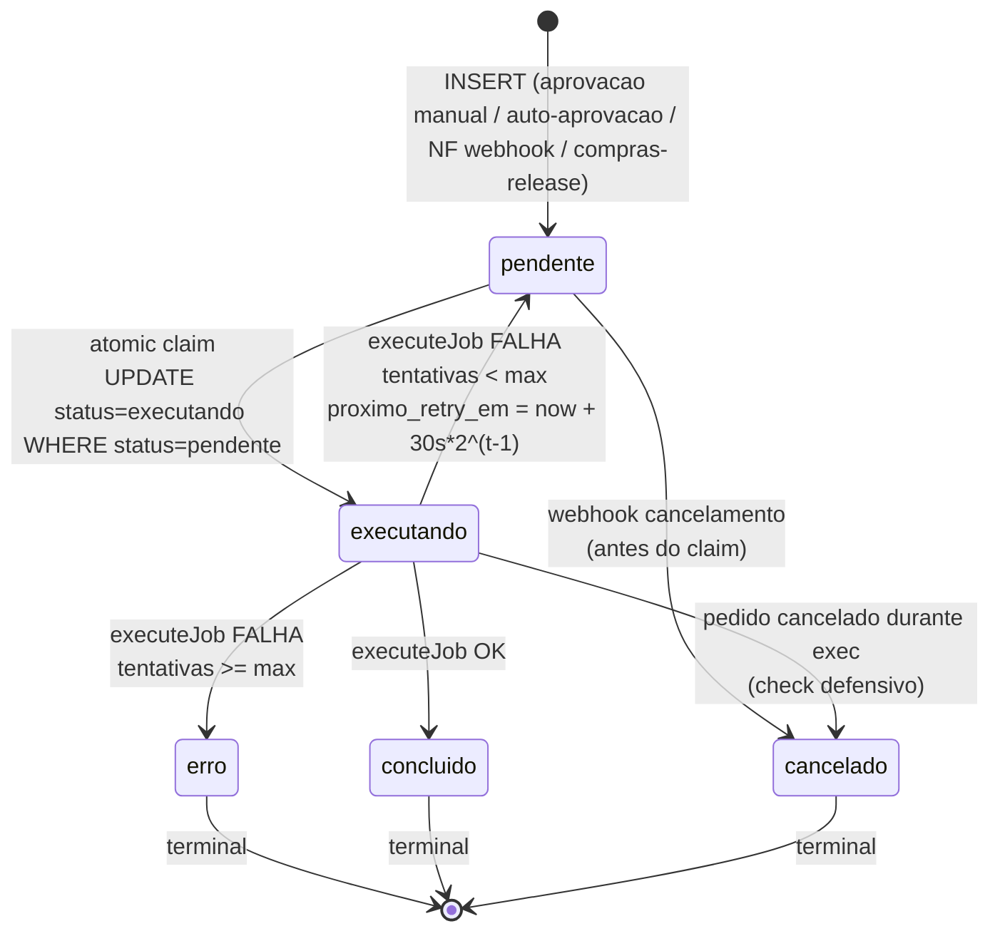
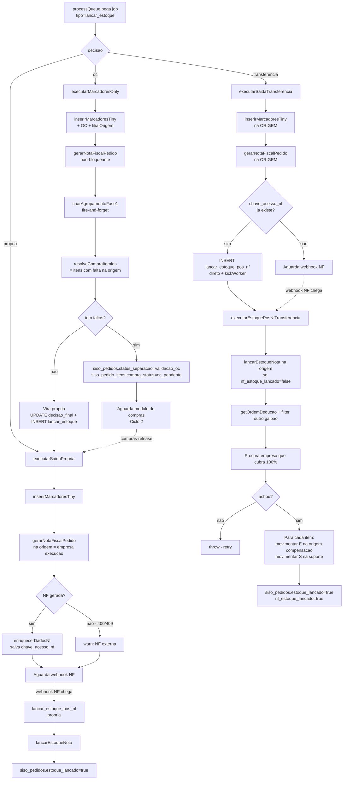
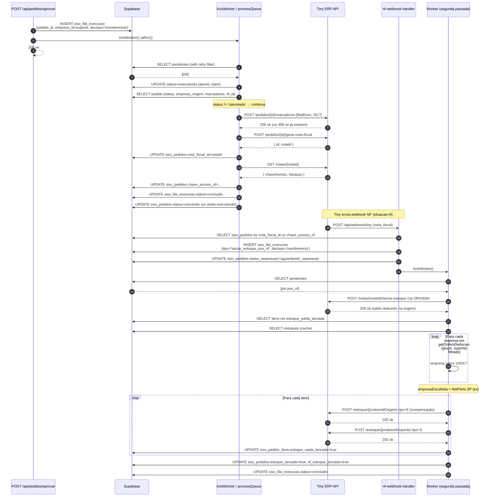

# Fluxo 04 — Execution Worker (`siso_fila_execucao`)

> Worker singleton que consome a fila `siso_fila_execucao` pós-aprovação. Insere marcadores no Tiny, gera nota fiscal, e (após autorização SEFAZ via webhook) lança estoque. Suporta três decisões: `propria`, `transferencia`, `oc`.

---

## Sumário (TOC)

- [1. Visão geral](#1-visão-geral)
- [2. Trigger do worker (`/api/worker/processar`)](#2-trigger-do-worker-apiworkerprocessar)
- [3. Fila `siso_fila_execucao`](#3-fila-siso_fila_execucao)
- [4. Loop principal (`processQueue`)](#4-loop-principal-processqueue)
  - [4.1 Pull com prioridade](#41-pull-com-prioridade)
  - [4.2 Atomic claim](#42-atomic-claim)
  - [4.3 Cancelamento defensivo](#43-cancelamento-defensivo)
  - [4.4 Retry exponencial](#44-retry-exponencial)
- [5. Singleton drain (`kickWorker`)](#5-singleton-drain-kickworker)
- [6. Tipos de job](#6-tipos-de-job)
- [7. Decisão `propria`](#7-decisão-propria)
- [8. Decisão `transferencia`](#8-decisão-transferencia)
  - [8.1 Tier-based deduction (exemplo)](#81-tier-based-deduction-exemplo)
- [9. Decisão `oc`](#9-decisão-oc)
- [10. Job `lancar_estoque_pos_nf`](#10-job-lancar_estoque_pos_nf)
- [11. Idempotência e atomicidade](#11-idempotência-e-atomicidade)
- [12. Sucesso parcial e itens OC mistos](#12-sucesso-parcial-e-itens-oc-mistos)
- [13. Logging, métricas e correlação](#13-logging-métricas-e-correlação)
- [14. Diagramas](#14-diagramas)
- [15. Side effects](#15-side-effects)
- [16. Erros conhecidos](#16-erros-conhecidos)

---

## 1. Visão geral

O execution worker é o componente que faz o **lançamento físico** das operações no Tiny ERP depois que o operador (ou auto-aprovação) decidiu o que fazer com um pedido. Ele é dirigido por uma fila simples (`siso_fila_execucao`), executa um job por vez (com batch opcional), respeita rate limit por empresa, e tem retry exponencial.

**Arquivos centrais:**
- `src/app/api/worker/processar/route.ts` — endpoint HTTP que dispara o loop.
- `src/lib/execution-worker.ts` — implementação completa: `processQueue`, `kickWorker`, `executeJob` e os 3 caminhos de decisão.
- `src/lib/grupo-resolver.ts:94-114` — `getOrdemDeducao` (ordem de tier).
- `src/lib/tiny-api.ts` — clientes Tiny (`criarMarcadoresPedido`, `gerarNotaFiscal`, `lancarEstoqueNota`, `movimentarEstoque`, `obterNotaFiscal`).
- `src/lib/tiny-queue.ts` (`runWithEmpresa`) — rate limiter por empresa.
- `src/lib/tiny-oauth.ts` — `getValidTokenByEmpresa` (refresh automático).
- `src/lib/agrupamento-service.ts` — fase-1 do agrupamento de expedição (chamado após NF gerada).

**Princípio:** o worker **não bloqueia** a resposta de quem o aciona. Aprovação retorna `200` e dispara `kickWorker()` via `after()`. O cron pode chamar a cada 10s independente. Auto-aprovação no webhook idem.

---

## 2. Trigger do worker (`/api/worker/processar`)

`src/app/api/worker/processar/route.ts:19-66`.

### 2.1 `POST /api/worker/processar`

**Quem chama:**
- **Cron externo** (Easypanel, GitHub Actions, etc.) chamando a cada ~10s para garantir que jobs com `proximo_retry_em` no passado sejam pegos mesmo sem trigger interno.
- **`/api/pedidos/aprovar`** dispara `kickWorker()` em `after()` (não chama HTTP, chama direto a função).
- **`webhook-processor`** dispara `kickWorker()` em auto-aprovação (idem, função direta).
- **Botão de monitoramento** (admin) pode chamar manualmente.

**Auth opcional:** se `WORKER_SECRET` estiver definido em env, exige `Authorization: Bearer <secret>`. Sem env var, qualquer um pode chamar (apenas dispara o loop, não retorna dados sensíveis).

**Query params:**
- `?limit=N` — máximo de jobs a processar nessa chamada (default 5, cap em 20).
- `?limit=0` — modo "drain": dispara `kickWorker()` (singleton drain loop) e retorna imediatamente `{ status: "draining" }`.

**Response:**

```json
{
  "processed": 2,
  "errors": 0,
  "skipped": 1,
  "rateLimited": false,
  "jobs": [
    { "id": "...", "pedidoId": "...", "status": "concluido" },
    { "id": "...", "pedidoId": "...", "status": "retry", "erro": "..." }
  ]
}
```

### 2.2 `GET /api/worker/processar`

Health check. Retorna:

```json
{
  "status": "ok",
  "service": "SISO Execution Worker",
  "usage": "POST to process pending jobs from siso_fila_execucao"
}
```

Útil para monitoramento de uptime sem disparar processamento.

---

## 3. Fila `siso_fila_execucao`

Schema completo em `docs/database-schema.md` § `siso_fila_execucao`. Resumo dos campos relevantes para o worker:

| Coluna | Tipo | Uso |
|---|---|---|
| `id` | uuid PK | identificador do job |
| `pedido_id` | text | FK soft para `siso_pedidos.id` |
| `tipo` | text | `'lancar_estoque'` ou `'lancar_estoque_pos_nf'` |
| `empresa_id` | uuid | empresa que vai sofrer dedução / Tiny token |
| `decisao` | text | `'propria'` / `'transferencia'` / `'oc'` |
| `status` | text | `pendente` → `executando` → `concluido` / `erro` / `cancelado` |
| `tentativas` | int | contador de retries |
| `max_tentativas` | int | default `3` |
| `prioridade` | bool | `true` = pula na frente |
| `proximo_retry_em` | timestamptz | exponencial backoff |
| `erro` | text | mensagem da última falha |
| `executado_em` | timestamptz | quando concluiu |

**Constraint:** `decisao IN ('propria','transferencia','oc')`, `status IN ('pendente','executando','concluido','erro','cancelado')`.

**Index hot path:** `idx_fila_status_retry (status, proximo_retry_em) WHERE status='pendente'` — o SELECT do worker bate exatamente nesse partial index.

---

## 4. Loop principal (`processQueue`)

`src/lib/execution-worker.ts:106-268`. Recebe um `limit` e processa **até** N jobs em sequência.

### 4.1 Pull com prioridade

```ts
// src/lib/execution-worker.ts:117-126
const { data: jobs } = await supabase
  .from("siso_fila_execucao")
  .select("id, pedido_id, tipo, empresa_id, decisao, tentativas, max_tentativas")
  .eq("status", "pendente")
  .or(`proximo_retry_em.is.null,proximo_retry_em.lte.${now}`)
  .order("prioridade", { ascending: false })
  .order("criado_em", { ascending: true })
  .limit(limit);
```

A query:
- Pega só jobs `status='pendente'`.
- Inclui jobs com `proximo_retry_em` no passado **OU** `null` (primeira tentativa).
- Ordena `prioridade DESC` (jobs com `prioridade=true` primeiro), depois `criado_em ASC` (FIFO).
- Limita a `limit` (default 5 quando chamado via processQueue direto, e dentro do drain loop também 5).

### 4.2 Atomic claim

Para evitar dois workers concorrentes pegarem o mesmo job, cada job é **claimed** via UPDATE condicional:

```ts
// src/lib/execution-worker.ts:133-143
const { data: claimed } = await supabase
  .from("siso_fila_execucao")
  .update({ status: "executando", atualizado_em: new Date().toISOString() })
  .eq("id", job.id)
  .eq("status", "pendente")  // double-check
  .select("id")
  .single();

if (!claimed) {
  result.skipped++;
  continue;
}
```

Se outro processo já alterou para `executando`, o `eq("status","pendente")` falha, `claimed` vem null e o job é skipped no loop atual.

### 4.3 Cancelamento defensivo

Antes de chamar Tiny, verifica se o pedido foi cancelado:

```ts
// src/lib/execution-worker.ts:151-165
const { data: orderCheck } = await supabase
  .from("siso_pedidos")
  .select("status")
  .eq("id", job.pedido_id)
  .single();

if (orderCheck?.status === "cancelado") {
  await supabase.from("siso_fila_execucao")
    .update({ status: "cancelado", atualizado_em: new Date().toISOString() })
    .eq("id", job.id);
  result.skipped++;
  continue;
}
```

Cobre a race: webhook de cancelamento chega depois que o claim acontece mas antes de chamar Tiny.

### 4.4 Retry exponencial

Em caso de erro no `executeJob`:

```ts
// src/lib/execution-worker.ts:204-234
const tentativas = job.tentativas + 1;
const maxed = tentativas >= job.max_tentativas;
const retryDelay = Math.min(30_000 * Math.pow(2, tentativas - 1), 120_000);

UPDATE siso_fila_execucao SET
  status            = maxed ? 'erro' : 'pendente',
  tentativas        = <tentativas>,
  erro              = <errorMsg>,
  proximo_retry_em  = maxed ? null : now() + retryDelay
WHERE id = job.id;

if (maxed) {
  UPDATE siso_pedidos SET status='erro', erro=<msg> WHERE id=pedido_id;
}
```

**Backoff:**
- tentativa 1 falha → next em 30s
- tentativa 2 falha → next em 60s
- tentativa 3 falha → status `erro`, pedido também vai pra `erro` no `siso_pedidos`.

(O comentário na schema fala "60s → 300s → 1800s" mas o código atual usa `30_000 * 2^(t-1)` cap em 120s.)

> **Loop pause de 2s entre jobs**: `await new Promise((r) => setTimeout(r, 2000))` (`src/lib/execution-worker.ts:202`) — espaça as requests pra Tiny entre jobs no mesmo batch.

---

## 5. Singleton drain (`kickWorker`)

`src/lib/execution-worker.ts:1066-1085`.

```ts
let _draining = false;

export async function kickWorker(): Promise<void> {
  if (_draining) return;          // singleton — concurrent kicks são no-op
  _draining = true;
  try {
    while (true) {
      const result = await processQueue(5);
      if (result.processed === 0 && result.errors === 0) break;
      await sleep(500);           // 500ms entre batches
    }
  } finally {
    _draining = false;
  }
}
```

**Garantias:**
- Apenas **uma** instância do drain loop por processo Node.js (`_draining` flag).
- Drena até `processQueue` retornar zero processados e zero erros.
- Concurrent calls retornam imediatamente (no-op) — o loop em andamento já vai pegar novos jobs inseridos em iteração subsequente.

> **Limitação multi-instância:** o flag `_draining` é em memória. Se houver múltiplas instâncias do app (load balancer, etc.), cada uma tem seu próprio `_draining`. O atomic claim (UPDATE com `eq status=pendente`) ainda evita execução duplicada do mesmo job.

---

## 6. Tipos de job

`src/lib/execution-worker.ts:272-310`. O `executeJob` despacha em dois eixos: `tipo` × `decisao`.

| `tipo` | `decisao` | Função | O que faz |
|---|---|---|---|
| `lancar_estoque` | `propria` | `executarSaidaPropria` | marcadores → gerar NF → aguarda webhook NF |
| `lancar_estoque` | `transferencia` | `executarSaidaTransferencia` | marcadores na origem → gerar NF na origem → aguarda webhook NF (ou cria job pos_nf direto se NF já autorizada) |
| `lancar_estoque` | `oc` | `executarMarcadoresOnly` | marcadores → tenta gerar NF (não bloqueante) → resolver itens de compra |
| `lancar_estoque_pos_nf` | `propria` | `executarEstoquePosNfPropria` | `lancarEstoqueNota` (idempotente via `estoque_lancado`) |
| `lancar_estoque_pos_nf` | `transferencia` | `executarEstoquePosNfTransferencia` | `lancarEstoqueNota` na origem + compensações + escolha empresa suporte + saída física no Tiny da empresa suporte |

Decisões/tipos desconhecidos geram `logger.warn` ou `throw new Error("Tipo de job desconhecido")`.

> **Constraint do banco** (`siso_fila_execucao.tipo`): originalmente só `'lancar_estoque'`. O `lancar_estoque_pos_nf` é inserido pelo próprio worker (após NF webhook) e exige migration que ampliou o CHECK constraint. Ver `docs/database-schema.md` § migrations recentes.

---

## 7. Decisão `propria`

`src/lib/execution-worker.ts:384-432` (`executarSaidaPropria`).

**Pré-condições:**
- `siso_pedidos.estoque_lancado` deve ser `false` (idempotência).
- Pedido tem `marcadores: string[]` populados pela aprovação.

**Passos:**

1. **Idempotência:** se `pedido.estoque_lancado === true`, log info e retorna sem fazer nada (caso de retry).
2. **Token Tiny** da empresa de execução: `getValidTokenByEmpresa(job.empresa_id)`.
3. **Inserir marcadores** no pedido Tiny via `criarMarcadoresPedido`. `LVR` é filtrado (já foi inserido pelo webhook-processor). Se Tiny retornar 400, assume que já existem (idempotente).
4. **Gerar NF** via `gerarNotaFiscal(token, pedidoId)`:
   - Se `nota_fiscal_id` já existe (de uma execução anterior), retorna esse id sem chamar Tiny.
   - Em sucesso, salva `siso_pedidos.nota_fiscal_id`.
   - Em 400/409 com mensagem "nota fiscal" / "Já existe": loga warn (`NF já existente externamente`) e retorna `null`.
5. **Enriquecer dados NF** via `obterNotaFiscal(token, notaId)`. Se `chaveAcesso` veio populada, salva `siso_pedidos.chave_acesso_nf`.
6. **NÃO lança estoque aqui.** A função retorna após salvar `chave_acesso_nf`. O lançamento real (`lancarEstoqueNota`) só acontece quando o **webhook de NF do Tiny** chega — esse webhook (`nf-webhook-handler.ts`) cria um job `lancar_estoque_pos_nf` que vai disparar `executarEstoquePosNfPropria`.

> Comentário do código (`src/lib/execution-worker.ts:423-424`): *"Save chave_acesso_nf if available, but do NOT post stock or transition status. Stock posting (lancarEstoqueNota) and transition happen ONLY via NF webhook."*

**Side effect importante:** ao final do `executeJob` no `processQueue`, o status do `siso_pedidos` é atualizado para `concluido` apenas se ainda estava `executando`. Mas o `status_separacao` continua em `aguardando_nf` até o webhook NF chegar.

---

## 8. Decisão `transferencia`

`src/lib/execution-worker.ts:676-753` (`executarSaidaTransferencia`).

**Conceito:** o pedido entrou na empresa A (origem, que vendeu) mas vai ser fisicamente atendido por uma empresa B em outro galpão (suporte). Para manter contabilidade Tiny correta:

- A NF é emitida pela **origem** (porque foi quem vendeu).
- O `lancarEstoqueNota` deduz saldo na origem (que talvez nem tenha tido o produto).
- Compensação `tipo='E'` (entrada) na origem para "devolver" o saldo deduzido.
- Saída física `tipo='S'` na empresa suporte (o produto realmente sai dela).

Mas tudo isso é executado **só depois** do webhook de NF autorizada. Aqui no `lancar_estoque` apenas:

1. Lê pedido com `numero, empresa_origem_id, marcadores, nota_fiscal_id`.
2. `getEmpresaById(pedido.empresa_origem_id)` → empresa origem.
3. `getValidTokenByEmpresa(origemId)` → token da origem.
4. `inserirMarcadoresTiny` no pedido da **origem**.
5. `gerarNotaFiscalPedido` na **origem** (cria reserva no Tiny, mas não deduz saldo até autorização).
6. `enriquecerDadosNf` para salvar `chave_acesso_nf`.
7. **Atalho importante:** se `chave_acesso_nf` já está salva no banco (caso de re-aprovação após `encaminhar`, ou SEFAZ tão rápido que respondeu antes do webhook), **insere job `lancar_estoque_pos_nf` direto** e dá `kickWorker()`. Caso contrário aguarda o webhook NF normal.

```ts
// src/lib/execution-worker.ts:725-746
if (pedidoCheck?.chave_acesso_nf) {
  await supabase.from("siso_fila_execucao").insert({
    pedido_id: job.pedido_id,
    tipo: "lancar_estoque_pos_nf",
    empresa_id: job.empresa_id,
    decisao: job.decisao,
    atualizado_em: new Date().toISOString(),
  });
  kickWorker().catch(() => {});
}
```

### 8.1 Tier-based deduction (exemplo)

A escolha real da **empresa suporte** acontece em `executarEstoquePosNfTransferencia` (`src/lib/execution-worker.ts:798-1058`). O algoritmo:

1. Carrega `getOrdemDeducao(grupoId, empresaSuporte.id)` — `src/lib/grupo-resolver.ts:94-114`. A ordem é:
   - empresa de origem em primeiro (mas é filtrada fora no passo 2);
   - depois empresas do mesmo galpão da origem (mas também filtradas fora);
   - depois empresas em outros galpões, ordenadas por `tier ASC`.
2. **Filtra empresas do galpão de origem fora**: `empresasDeducao = ordemDeducao.filter((e) => e.galpaoId !== empresaOrigem.galpaoId)`. Transferência sempre sai de **outro galpão**.
3. **Procura uma empresa que cubra 100% dos itens**:

```ts
// src/lib/execution-worker.ts:885-897
let empresaEscolhida = null;
for (const emp of empresasDeducao) {
  const cobreTudo = itens.every((item) => {
    const est = estoques?.find(
      (e) => e.empresa_id === emp.empresaId && e.produto_id === item.produto_id,
    );
    return est && est.disponivel >= (item.quantidade_pedida as number);
  });
  if (cobreTudo) { empresaEscolhida = emp; break; }
}
```

Se nenhuma cobre 100%, **lança erro** com diagnóstico de cobertura por empresa, ex: `Nenhuma empresa cobre 100% dos itens para transferência (NetParts: 2/3, OutraEmp: 1/3)`. O job vai pra retry exponencial.

**Exemplo concreto** (NetAir + NetParts no grupo Autopecas):

```
Cenário: pedido recebido pela NetAir (galpão CWB, tier 1).
Operador escolheu transferência.
Itens: A (qty 2), B (qty 1).
Estoques:
  NetAir CWB:    A=0, B=0
  NetParts SP:   A=5, B=3
  (Hipotético) NetParts Filial 2 (mesmo galpão SP, tier 2): A=10, B=10
```

1. `getOrdemDeducao(grupo, supEmpresa)` retorna: `[supEmpresa, ...mesmoGalpao, ...outros]`.
2. Filtra fora `galpaoId === CWB` → sobra `[NetParts SP, NetParts Filial 2]` em ordem de tier.
3. NetParts SP cobre A=5≥2 ✓ B=3≥1 ✓ → **escolhida**.
4. Sai do loop, vai deduzir tudo da NetParts SP.

Se NetParts SP tivesse `A=1, B=3` (cobre só B), o loop tentaria NetParts Filial 2 (A=10, B=10) → **escolhida** porque cobre 100%.

> **Nota:** a lógica atual exige uma única empresa cobrir tudo. **Não distribui** os itens entre múltiplas empresas.

**Sequência completa do `executarEstoquePosNfTransferencia`:**

1. Idempotência: se `pedido.estoque_lancado` já é `true`, retorna.
2. Se `precisaLancarNf = !pedido.nf_estoque_lancado`: chama `lancarEstoqueNota(origemToken, notaIdOrigem)` na origem. Isso deduz saldo na origem (limpa a reserva).
3. Lê itens com `estoque_saida_lancada = false/null` (idempotência por item).
4. Lê todos os estoques do pedido em `siso_pedido_item_estoques` (cache que veio do webhook).
5. Roda algoritmo de cobertura → `empresaEscolhida`.
6. Para cada item:
   - Se `produto_id_na_empresa` já está em cache, usa direto. Senão, `buscarProdutoPorSku(token, sku)` na empresa suporte.
   - **Se `precisaLancarNf`** (primeira execução): `movimentarEstoque(origemToken, produtoIdOrigem, { tipo: 'E', quantidade, deposito: depositoIdOrigem, observacoes: 'Compensação...' })` na origem. Isso devolve o saldo que `lancarEstoqueNota` tirou. Falha aqui é **não-crítica** (warn log, segue).
   - `movimentarEstoque(supToken, produtoIdNaEmpresa, { tipo: 'S', quantidade, deposito: depositoSup, observacoes: 'Saída para atender pedido X' })` na suporte. **Crítico** — falha aqui aborta o job (mas itens já bem-sucedidos ficam marcados `estoque_saida_lancada=true`).
   - Marca `siso_pedido_itens.estoque_saida_lancada=true, empresa_deducao_id=<suporte>`.
   - `sleep(500)` entre itens (rate-limit-friendly).
7. Se houve qualquer erro em iteração de item, ao final lança `Error("Falha em N de M itens (SKUs: ...)")` → retry.
8. Se tudo ok: `siso_pedidos.estoque_lancado=true, nf_estoque_lancado=true`.

---

## 9. Decisão `oc`

`src/lib/execution-worker.ts:531-668` (`executarMarcadoresOnly`).

OC = "ordem de compra interna". O pedido foi vendido mas a empresa não tem o produto, vai precisar comprar do fornecedor para atender. O fluxo aqui não deduz estoque (porque não tem) e direciona o pedido para o módulo de compras.

**Passos:**

1. Lê `marcadores`, `empresa_origem_id`, `nota_fiscal_id`.
2. `getValidTokenByEmpresa(empresa_id)` (que aqui = origem, porque OC sempre executa na origem).
3. `inserirMarcadoresTiny` → grava `OC`, `<filialOrigem>` no pedido Tiny.
4. **NF generation (não-bloqueante):** desde a refatoração mais recente, OC também tenta gerar NF logo na aprovação:
   - Cria reserva no Tiny (sem deduzir saldo).
   - Em sucesso, salva `nota_fiscal_id` e `chave_acesso_nf`.
   - Roda `criarAgrupamentoFase1(pedido_id)` (fire-and-forget, nunca lança).
   - **Se falhar**, loga warn e segue para resolução de itens (não bloqueia).
5. **Resolve itens de compra** via `resolveCompraItemIds` (`src/lib/execution-worker.ts:436-529`):
   - Lê todos itens em `siso_pedido_itens`.
   - Lê estoque na empresa de origem em `siso_pedido_item_estoques`.
   - Para cada item, calcula **quantidade faltante** = `quantidade_pedida - min(disponivel_origem, quantidade_pedida)`.
   - Aloca o disponível da origem entre repetições do mesmo SKU (caso o pedido tenha 2 linhas do mesmo produto).
   - Retorna lista de `{ id, quantidadeSolicitada, sku }` apenas com itens com falta real (`> 0`).
6. **Caso A — sem faltas reais (`compraDemandas.length === 0`):**
   - Tudo era atendível pela origem; o operador errou ao escolher OC.
   - Limpa campos `compra_*` em todos itens.
   - `UPDATE siso_pedidos SET decisao_final='propria', status='executando', status_separacao='aguardando_nf'`.
   - Insere novo job `lancar_estoque` decisao=`propria` (se ainda não houver pendente/executando).
   - Loga `"Pedido OC sem faltas reais; liberado direto para fluxo proprio"`.
7. **Caso B — tem faltas:**
   - `UPDATE siso_pedidos SET status_separacao='validacao_oc'`.
   - Para cada `demanda`: `UPDATE siso_pedido_itens SET compra_status='oc_pendente', compra_quantidade_solicitada=<qty>, compra_solicitada_em=now(), fornecedor_oc=<getFornecedorBySku(sku).fornecedor>`.
   - Loga `"Pedido OC enviado para modulo de compras"` com `itensCompra`, `quantidadeSolicitadaTotal`.

`getFornecedorBySku` (`src/lib/sku-fornecedor.ts:80-94`) mapeia o prefixo do SKU para `{ fornecedor, filialOC }`. Mapeamento longest-match-first sobre `PREFIX_MAP` (3-char antes de 2-char). SKUs all-digits 6-char → ACA. Default: Diversos / CWB.

> **Stock deduction for OC** acontece em "Ciclo 2" — depois que o módulo de compras receber as mercadorias, `compras-release.ts` reativa a execução. Esse ciclo está fora do escopo do worker tradicional e é coberto pelo doc 07 (compras).

---

## 10. Job `lancar_estoque_pos_nf`

Acionado pelo handler de webhook de NF (`src/lib/nf-webhook-handler.ts`) quando o Tiny envia `nota_fiscal.alterada` com situação 6 (Autorizada) ou 7 (Emitida Danfe).

### 10.1 `propria` — `executarEstoquePosNfPropria`

`src/lib/execution-worker.ts:757-796`. Simples:

```ts
SELECT nota_fiscal_id, estoque_lancado FROM siso_pedidos WHERE id=X;

if (estoque_lancado === true) return;       // idempotente
if (!nota_fiscal_id) throw Error;

await runWithEmpresa(empresa_id, () => lancarEstoqueNota(token, notaId));

UPDATE siso_pedidos SET estoque_lancado=true WHERE id=X;
```

`lancarEstoqueNota` é o endpoint Tiny `POST /notas/{id}/lancar-estoque` (`src/lib/tiny-api.ts:522-530`). Ele dispara as movimentações fiscais (saída pelo CFOP da NF), deduzindo saldo da empresa.

### 10.2 `transferencia` — `executarEstoquePosNfTransferencia`

Já detalhado em [§ 8.1](#81-tier-based-deduction-exemplo). É o caminho mais complexo de todo o worker.

---

## 11. Idempotência e atomicidade

O worker **não é transacional** — não existe rollback automático se a metade dos itens deu certo e a outra metade falhou. A estratégia é **idempotência por flag**:

| Flag | Onde | Significado |
|---|---|---|
| `siso_pedidos.estoque_lancado` | tabela | NF da origem foi `lancarEstoqueNota`-ada **e** todos os itens foram processados. Bloqueia retry inteiro. |
| `siso_pedidos.nf_estoque_lancado` | tabela | apenas a `lancarEstoqueNota` da origem foi feita (em transferência, separa do "saídas físicas"). Permite re-execução parcial após `encaminhar`. |
| `siso_pedido_itens.estoque_saida_lancada` | tabela | item específico já teve saída `tipo='S'` na empresa suporte. Skip no retry. |
| `siso_pedido_itens.compra_status` | tabela | item está em fluxo de compras (oc_pendente, comprado, etc). |
| `siso_pedidos.nota_fiscal_id` | tabela | NF já gerada — `gerarNotaFiscalPedido` retorna sem chamar Tiny. |

**Cenários de falha parcial:**

- **NF gerada + erro no `enriquecerDadosNf`**: NF persistida, próximo retry pula a geração (idempotente). `chave_acesso_nf` virá na próxima vez ou via webhook.
- **NF gerada + erro no `lancarEstoqueNota` (própria)**: marca `estoque_lancado=false`, retry tenta de novo. `lancarEstoqueNota` no Tiny é idempotente em alguns casos (NF já com estoque lançado retorna erro específico que ainda não tratamos diferente).
- **Transferência: NF lançada na origem + alguns itens com `S` na suporte + erro em algum item**: `nf_estoque_lancado=true`, alguns `estoque_saida_lancada=true`, throw → retry. Próxima execução pula `lancarEstoqueNota` (já feita), pula compensação (precisaLancarNf=false), processa só os itens restantes.
- **Compensação `tipo='E'` falha na origem**: warn log, segue. **Não retry**. Pode causar saldo "fantasma" negativo na origem que precisa de ajuste manual.
- **Movimentação `tipo='S'` falha na suporte**: marca o item como falho mas não como `estoque_saida_lancada`. No retry, será tentado de novo. `movimentarEstoque` no Tiny **não é idempotente** — duas chamadas geram dois lançamentos. A flag `estoque_saida_lancada` é a única proteção.

> **Risco real:** se o flag de idempotência não for setado mas a chamada Tiny já tiver sucedido (ex: timeout no upstream antes do response chegar mas o Tiny já gravou), o retry vai duplicar o lançamento. Mitigação atual: timeouts estendidos no `tiny-api.ts` + monitoramento manual via `siso_erros`. Mitigação futura: tornar `movimentarEstoque` idempotente via `idLancamento` salvo localmente.

---

## 12. Sucesso parcial e itens OC mistos

**Cenário:** pedido tem 3 itens, origem tem estoque para 2 deles. Operador escolheu `propria` mas o sistema deveria ter sugerido `oc` (ou parcial).

Hoje o worker `executarSaidaPropria` **não mistura** com OC: se `propria` foi escolhida, ele gera NF de tudo, dependente do Tiny aceitar (Tiny pode até aceitar gerar NF com saldo negativo dependendo da configuração, gerando saldo negativo na empresa).

**Cenário OC com itens parcialmente cobertos:** `executarMarcadoresOnly` já trata. `resolveCompraItemIds` calcula as faltas. Se nenhum item tem falta real → vira `propria`. Se alguns têm → entra em `validacao_oc`, e os itens com `compra_status` ficam visíveis no módulo de compras. Os itens **sem falta** continuam sendo atendidos pela origem (não vão pra compras).

**Estado depois do `validacao_oc`:** o operador na separação valida cada item OC (encontrou? esgotou?). Quando todos os items OC estão `comprado` (chegou do fornecedor), `compras-release.ts` cria um job `lancar_estoque` decisao=`propria` para liberar o pedido para separação normal.

> Esse Ciclo 2 (compras → release → execution worker novamente) está documentado no doc 07 (compras). Aqui só registramos que **o worker pode ser invocado mais de uma vez para o mesmo pedido** ao longo do ciclo de vida.

---

## 13. Logging, métricas e correlação

### 13.1 `logger.info`

Casos:
- `"Job completed"` — sucesso, com `jobId, pedidoId, empresaId, decisao`.
- `"NF gerada, aguardando webhook para lançar estoque (...)"` — após NF gerada.
- `"Estoque lançado via NF pós-autorização (...)"` — após `lancarEstoqueNota` ok.
- `"Empresa escolhida para transferência: X"` — com `pedidoId, empresaId, totalItens`.
- `"Saída lançada: SKU x10 de NetParts SP"` — por item.
- `"Pedido OC enviado para modulo de compras"` — com `itensCompra, quantidadeSolicitadaTotal`.

### 13.2 `logger.warn`

- `"Marcadores já existem no pedido (idempotente)"` — Tiny 400.
- `"NF já existente externamente"` — race com NF gerada manualmente.
- `"Falha na entrada compensatória na origem"` — `tipo='E'` falhou.
- `"NF externa — aguardando webhook para lançar estoque"` — `gerarNotaFiscalPedido` retornou null.

### 13.3 `logger.logError` — categorias estruturadas

`src/lib/execution-worker.ts:244-264`. Categoriza falhas para `siso_erros`:

| Categoria | Padrão de detecção |
|---|---|
| `auth` | mensagem contém "token" ou "Token" |
| `infrastructure` | mensagem contém "rate" ou "429" |
| `external_api` | qualquer outro erro de chamada Tiny |
| `business_logic` | usado em "Produto não encontrado na empresa suporte" |

`severity`: `critical` se `maxed=true`, senão `error`.

Metadados anexados: `{ jobId, decisao, tentativas, maxed, retryDelay }`.

### 13.4 `ProcessResult`

Retornado por `processQueue`:

```ts
{
  processed: 2,         // jobs concluídos com sucesso
  errors: 1,            // jobs que falharam (independente de retry ou maxed)
  skipped: 0,           // claim race ou pedido cancelado
  rateLimited: false,   // (nunca setado true no código atual)
  jobs: [...]           // detalhes por job processado
}
```

### 13.5 Correlation IDs

O webhook do Tiny gera um `correlationId` (`generateCorrelationId()` em `src/lib/logger.ts`) na entrada e o passa para `logError` ao longo do request. Mas **o worker não propaga esse correlationId** entre o webhook que enfileirou o job e a execução do job. Cada chamada de `processQueue` é seu próprio contexto.

> Para rastreio end-to-end, usar `pedido_id` como chave (vai em todos os logs do worker).

---

## 14. Diagramas

### 14.1 State diagram — `siso_fila_execucao`



### 14.2 Flowchart — três caminhos de decisão



### 14.3 Sequence — transferência ponta-a-ponta



---

## 15. Side effects

| Operação | Side effect |
|---|---|
| Worker pega job | `UPDATE siso_fila_execucao SET status='executando'`. |
| Worker termina ok | `UPDATE siso_fila_execucao SET status='concluido', executado_em=now()` + `UPDATE siso_pedidos SET status='concluido', processado_em=now() WHERE status='executando'`. |
| Worker falha (não maxed) | `UPDATE siso_fila_execucao SET status='pendente', tentativas+=1, proximo_retry_em=now+delay, erro=msg`. |
| Worker falha (maxed) | `UPDATE siso_fila_execucao SET status='erro'` + `UPDATE siso_pedidos SET status='erro', erro=...`. |
| `inserirMarcadoresTiny` ok | Marcadores criados no pedido Tiny via `POST /pedidos/{id}/marcadores`. |
| `gerarNotaFiscalPedido` ok | NF criada no Tiny + `siso_pedidos.nota_fiscal_id=...`. |
| `enriquecerDadosNf` | `siso_pedidos.chave_acesso_nf=...` se Tiny retornou chave. |
| `lancarEstoqueNota` ok (própria) | Saldo deduzido na empresa de origem via NF + `siso_pedidos.estoque_lancado=true`. |
| `movimentarEstoque tipo=E` (transferência) | Saldo +qty na origem (compensação) + `idLancamento` retornado mas não persistido. |
| `movimentarEstoque tipo=S` (transferência) | Saldo -qty na empresa suporte + `siso_pedido_itens.estoque_saida_lancada=true, empresa_deducao_id=<sup>`. |
| OC sem faltas reais | `siso_pedidos.decisao_final='propria', status_separacao='aguardando_nf'` + `INSERT siso_fila_execucao` (decisao=propria). |
| OC com faltas | `siso_pedidos.status_separacao='validacao_oc'` + `siso_pedido_itens.compra_status='oc_pendente', fornecedor_oc=...`. |
| Webhook NF chega | (em outro fluxo) `INSERT siso_fila_execucao tipo='lancar_estoque_pos_nf'` + transição `status_separacao='aguardando_separacao'`. |
| Pedido cancelado durante execução | `UPDATE siso_fila_execucao.status='cancelado'` + skip silencioso. |

---

## 16. Erros conhecidos

> Ver `erros-conhecidos.yaml` na raiz para histórico completo.

### 16.1 `Token expirado` (categoria `auth`)

`getValidTokenByEmpresa` faz refresh com 60s de buffer. Se o refresh token estiver inválido (admin revogou no Keycloak), o job falha com `auth` category e vai pra retry. Não recupera sozinho — admin precisa re-autorizar OAuth na conexão Tiny via `/configuracoes`.

### 16.2 `429 Too Many Requests` (categoria `infrastructure`)

`runWithEmpresa` (`src/lib/tiny-queue.ts`) limita a ~5 req/s por empresa. Se o cron externo + auto-aprovações estourarem, Tiny retorna 429. O retry exponencial cobre, mas múltiplos jobs simultâneos para a mesma empresa podem ficar em loop de retry. Mitigação: `kickWorker` usa singleton e `sleep(2000)` entre jobs, mas o `processQueue` direto de cron paralelo não tem essa proteção. Considerar usar só drain mode.

### 16.3 `Nenhuma empresa cobre 100% dos itens para transferência`

Lançado em `executarEstoquePosNfTransferencia:909`. Significa que entre o momento da aprovação e a autorização da NF, o estoque das empresas suporte mudou (outro pedido consumiu). Hoje vai pra retry → `erro`. **Mitigação manual:** usar `forcar-pendente` no painel para reverter o pedido para `pendente` e o operador re-decidir.

### 16.4 Compensação `tipo='E'` falha mas saída `tipo='S'` ok

Saldo "fantasma" negativo na origem. Falha **não-crítica** apenas loga warn e não retry. Precisa de ajuste manual via inventário ou via `POST /api/tiny/stock/ajustar`. Detectar via `siso_logs` filtrando por `"Falha na entrada compensatória"`.

### 16.5 Worker em multi-instância

`_draining` é flag em memória — se houver 2+ instâncias do app (replicação horizontal), cada uma drena em paralelo. Isso é **seguro** (atomic claim previne dupla execução) mas pode dobrar a carga no Tiny. Mitigação: rodar cron externo apenas em uma instância, ou usar Redis lock.

### 16.6 `lancar_estoque_pos_nf` com `decisao='oc'`

Não está implementado (`src/lib/execution-worker.ts:301-307` → warn e return). Se um job desse tipo aparecer (provável bug em algum reprocessamento), o worker apenas loga e marca o job como concluído. **Não deveria acontecer** — webhook NF para OC não cria job pos_nf porque OC só lança estoque após compras-release (caminho diferente).

### 16.7 NF gerada mas SEFAZ rejeita (situacao=5)

Webhook chega com situação ≠ 6/7. `enriquecerDadosNf` salva `chave_acesso_nf` mas NÃO transiciona status. O pedido fica em `aguardando_nf` indefinidamente até alguém intervir manualmente no Tiny (corrigir + retransmitir) e o webhook chegar de novo com sit=6.

### 16.8 `gerarNotaFiscal` retorna 200 mas Tiny manda webhook NF antes do worker salvar `nota_fiscal_id`

Race rara: handler do webhook tenta correlacionar pelo `chave_acesso_nf` (não pelo id), e nesse momento ainda não salvamos. O webhook fica órfão e a próxima execução do worker vai gerar NF "extra" (Tiny vai retornar 400 "Já existe" → trata idempotência). Mitigação: o webhook handler tem retry interno e a reconciliação periódica resolve.

### 16.9 `sleep(500)` entre itens em transferências grandes

Pedido com 50 itens em transferência → ~50 × (compensação + saída + sleep) = ~75s só de pauses. Se algum item falhar próximo do final, retry inteiro precisa esperar de novo. Não é bloqueante mas fica caro. Considerar paralelização limitada (Promise.all com pool de 3).

### 16.10 `criarAgrupamentoFase1` failure não retry

OC chama `criarAgrupamentoFase1` em `executarMarcadoresOnly` mas **explicitamente não-bloqueante**. Se o agrupamento falha (Tiny instável), o ZPL não é cacheado antecipadamente e a impressão de etiqueta na separação vai pegar o caminho lento (síncrono na hora). Não é erro do worker, é otimização perdida.

---

**Ver também:** `docs/fluxos/03-aprovacao-decisao.md` (de onde vem o `INSERT siso_fila_execucao`); `docs/fluxos/05-separacao.md` (o que acontece após `status_separacao='aguardando_separacao'`); `docs/fluxos/07-compras.md` (Ciclo 2 do OC); `docs/database-schema.md` (`siso_fila_execucao`, `siso_pedidos`, `siso_pedido_itens`); `src/lib/tiny-api.ts` (clientes Tiny); `src/lib/grupo-resolver.ts` (`getOrdemDeducao`).
