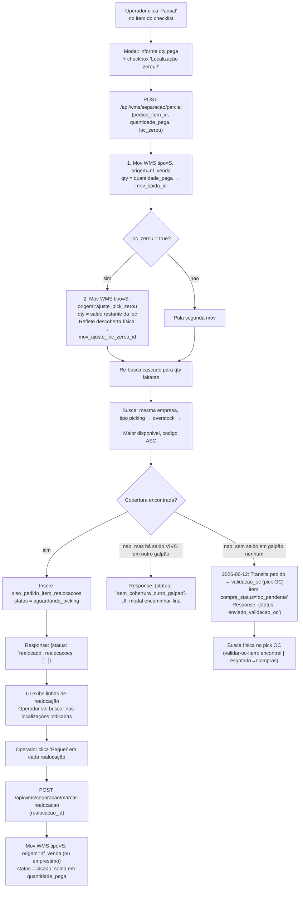
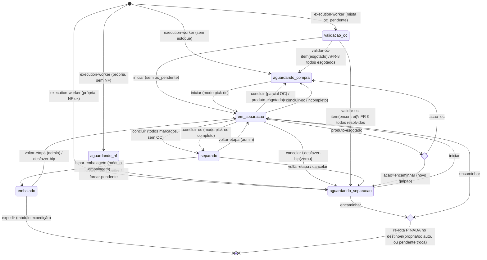
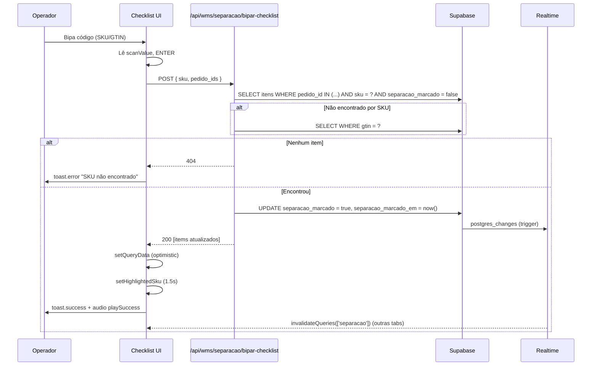
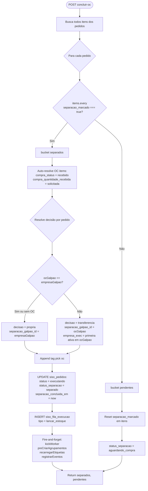
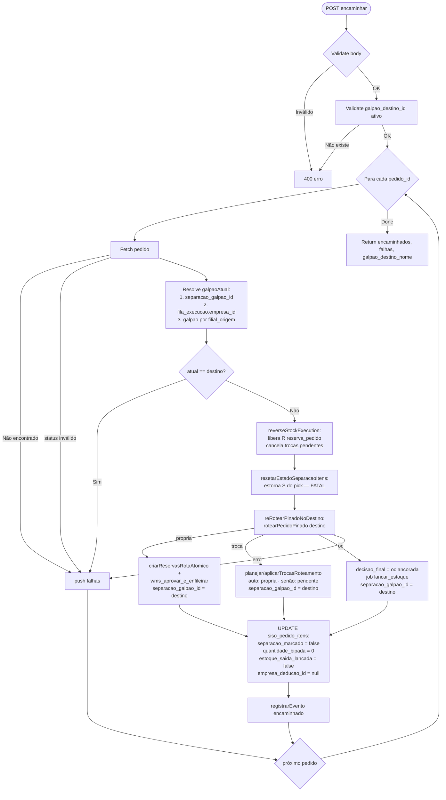
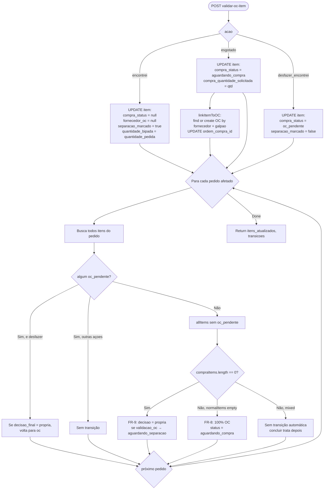

# Fluxo 05 — Separação (Wave Picking) com Bipagem

> Módulo de separação física: dashboard `/separacao`, checklist de wave picking, bipagem por código de barras, validação OC inline, encaminhamento entre galpões, ações administrativas e realtime cross-operador.

**Endpoints cobertos:**
`GET /api/wms/separacao` · `POST /api/wms/separacao/iniciar` · `POST /api/wms/separacao/bipar` · `POST /api/wms/separacao/bipar-checklist` · `POST /api/wms/separacao/marcar-item` · `POST /api/wms/separacao/desfazer-bip` · `POST /api/wms/separacao/concluir` · `POST /api/wms/separacao/concluir-oc` · `GET /api/wms/separacao/checklist-items` · `POST /api/wms/separacao/encaminhar` · `POST /api/wms/separacao/cancelar` · `POST /api/wms/separacao/reiniciar` · `POST /api/wms/separacao/voltar-etapa` · `GET|POST /api/wms/separacao/tags` · `POST /api/wms/separacao/produto-esgotado` · `POST /api/wms/separacao/validar-oc-item` · `POST /api/wms/separacao/forcar-pendente` (batch) · `PATCH /api/wms/separacao/{pedidoId}/forcar-pendente` (single) · `POST /api/wms/separacao/localizacao` · `POST /api/wms/separacao/parcial` · `POST /api/wms/separacao/marcar-realocacao` · `DELETE /api/wms/separacao/realocacao/[id]` · `POST /api/wms/separacao/desfazer-parcial`

---

## Sumário

1. [Visão geral](#1-visão-geral)
2. [Estados de separação e transições](#2-estados-de-separação-e-transições)
3. [Dashboard `/separacao`](#3-dashboard-separacao)
4. [Iniciar separação](#4-iniciar-separação)
5. [Checklist de wave picking](#5-checklist-de-wave-picking)
6. [Bipagem](#6-bipagem)
7. [Marcar / Desmarcar item manualmente](#7-marcar--desmarcar-item-manualmente)
8. [Desfazer bipagem](#8-desfazer-bipagem)
9. [Concluir separação (normal)](#9-concluir-separação-normal)
10. [Concluir separação OC (`pick-oc`)](#10-concluir-separação-oc-pick-oc)
11. [Validação OC inline (`validar-oc-item`)](#11-validação-oc-inline-validar-oc-item)
12. [Produto esgotado](#12-produto-esgotado)
12a. [Short pick + re-alocação por localização](#12a-short-pick--re-alocação-por-localização)
13. [Encaminhar pedido para outro galpão](#13-encaminhar-pedido-para-outro-galpão)
14. [Cancelar separação](#14-cancelar-separação)
15. [Reiniciar progresso](#15-reiniciar-progresso)
16. [Voltar/avançar etapa (admin)](#16-voltaravançar-etapa-admin)
17. [Forçar pendente (NF)](#17-forçar-pendente-nf)
18. [Tags de separação](#18-tags-de-separação)
19. [Atualizar localização](#19-atualizar-localização)
20. [Realtime cross-operador](#20-realtime-cross-operador)
21. [Filtragem por role](#21-filtragem-por-role)
22. [Diagramas Mermaid](#22-diagramas-mermaid)
23. [Tabelas escritas / colunas afetadas](#23-tabelas-escritas--colunas-afetadas)
24. [Side effects](#24-side-effects)
25. [Erros conhecidos e armadilhas](#25-erros-conhecidos-e-armadilhas)

---

## 1. Visão geral

O módulo de separação é a etapa onde o pedido (já aprovado e com NF emitida) deixa o domínio do "fluxo lógico" e entra no "fluxo físico" do galpão. A interface é otimizada para wave picking: o operador seleciona vários pedidos, o sistema consolida itens por SKU/localização, e o operador "varre" o galpão bipando os códigos de barras na ordem da localização.

Arquitetura ponta a ponta:

```
[Dashboard /separacao]            (lista por status, filtros, ações em lote)
        |
        v  Separar selecionados
[POST /api/wms/separacao/iniciar]     (transita para em_separacao)
        |
        v  router.push
[Checklist /separacao/checklist?pedidos=...]
        |
        ├─> bipar  ─────> [POST /api/wms/separacao/bipar-checklist] (auto-marca SKU em todos pedidos)
        ├─> click  ─────> [POST /api/wms/separacao/marcar-item]     (toggle manual)
        ├─> esgotado ───> [POST /api/wms/separacao/produto-esgotado]  (modal: encaminhar | OC)
        ├─> OC encontrei─> [POST /api/wms/separacao/validar-oc-item]  (acao=encontrei|esgotado)
        ├─> editar loc.─> [POST /api/wms/separacao/localizacao]      (atualiza Tiny + DB)
        ├─> reiniciar ──> [POST /api/wms/separacao/reiniciar]
        ├─> cancelar  ──> [POST /api/wms/separacao/cancelar]
        └─> concluir  ──> [POST /api/wms/separacao/concluir | concluir-oc]
                                |
                                v
                        siso_pedidos.status_separacao = 'separado'
                        + dispara preCriarAgrupamentosEmLote (fire-and-forget)
                        + dispara recarregarEtiquetasFaltantes (fire-and-forget)
```

**Conceitos-chave:**

- **Wave picking**: vários pedidos picados simultaneamente, consolidando produtos iguais. A consolidação é feita pela RPC `siso_consolidar_produtos_separacao`.
- **Galpão de separação** (`siso_pedidos.separacao_galpao_id`): pode ser **diferente** do galpão da empresa de origem — é o caso de transferência, onde o galpão B separa um pedido da empresa A.
- **Empresa "que separa"** (não a `empresa_origem_id`): primeira empresa ativa do `separacao_galpao_id`. Determina localização e estoque a exibir no checklist (ver `checklist-items/route.ts:71`).
- **Bipagem dupla**: existem 2 endpoints de bip, um pro fluxo "tab pendentes" (`bipar`) e outro pro fluxo wave picking (`bipar-checklist`). Eles atuam em colunas diferentes (ver §6).
- **`separacao_tags` (text[])**: tags de UX criadas pelo operador (`pick oc`, `urgente`, etc.). Não são `marcadores` do Tiny (essas vêm via webhook).

---

## 2. Estados de separação e transições

A coluna canônica é `siso_pedidos.status_separacao`. O type é `StatusSeparacao` em `src/types/index.ts`.

```
aguardando_compra   → fila de itens OC (compras module trabalha aqui)
aguardando_nf       → pedido aprovado, esperando webhook de nota fiscal
validacao_oc        → pedido com `oc_pendente` em separação física (sub-tipo de aguardando_separacao)
aguardando_separacao → pronto pra operador picar
em_separacao         → wave picking em andamento
pendente_realocacao  → short pick aconteceu e galpão não tem cobertura para qty restante; aguardando ação do supervisor
separado             → todos itens marcados, pronto pra embalar
embalado             → embalagem concluída, pronto pra expedir
```

| De | Para | Endpoint que dispara | Notas |
|---|---|---|---|
| (criação no execution-worker) | `aguardando_compra` | `lib/execution-worker.ts` | itens OC sem estoque |
| (criação no execution-worker) | `aguardando_nf` | `lib/execution-worker.ts` | pedido próprio, NF não chegou |
| `aguardando_nf` | `aguardando_separacao` | `lib/nf-webhook-handler.ts` (auto) **ou** `forcar-pendente` (admin) | webhook NF autoriza (situação 6/7) |
| `aguardando_separacao` | `em_separacao` | `POST /api/wms/separacao/iniciar` | operador clica "Separar" |
| `validacao_oc` | `em_separacao` | `POST /api/wms/separacao/iniciar` | só se não houver `oc_pendente` ainda pendente |
| `em_separacao` | `separado` | `POST /api/wms/separacao/concluir` | todos `separacao_marcado=true` |
| `em_separacao` | `aguardando_compra` | `POST /api/wms/separacao/concluir` | partial pause: tem itens `aguardando_compra`/`comprado`/`oc_pendente` |
| `em_separacao` | `pendente_realocacao` | `POST /api/wms/separacao/parcial` | short pick + galpão sem cobertura pra qty restante |
| `em_separacao` | `validacao_oc` | `POST /api/wms/separacao/parcial` (loc_zerou) | **2026-06-12:** cascade esgotou sem cobertura de sistema em galpão nenhum → vai pro pick OC pra busca física antes de comprar (loc cadastrada pode estar errada); item vira `compra_status='oc_pendente'`. Só "esgotado" no pick OC → Compras. |
| `pendente_realocacao` | `em_separacao` | `POST /api/wms/separacao/desfazer-parcial` | operador desfaz o short pick |
| `em_separacao` | `aguardando_separacao` | `POST /api/wms/separacao/cancelar` | reset de todos os checks + estorno de movs WMS |
| `em_separacao` | `aguardando_separacao` | `POST /api/wms/separacao/desfazer-bip` | só se total de bipados zerar |
| `em_separacao` | `aguardando_compra` (ou `validacao_oc`) | `POST /api/wms/separacao/produto-esgotado` (acao=oc) | SKU sem estoque, vira OC |
| `em_separacao` | `aguardando_compra` | `POST /api/wms/separacao/concluir-oc` | pick-oc com itens incompletos volta |
| `validacao_oc` | `aguardando_separacao` | `POST /api/wms/separacao/validar-oc-item` (acao=encontrei) | todos OC resolvidos como "encontrei" |
| `validacao_oc` | `aguardando_compra` | `POST /api/wms/separacao/validar-oc-item` (acao=esgotado) | todos confirmados esgotado, 100% OC |
| qualquer | qualquer | `POST /api/wms/separacao/voltar-etapa` | admin only |
| `aguardando_separacao`/`em_separacao`/`pendente_realocacao` | re-rota PINADA no destino (`propria`/`oc` auto, ou `pendente` troca) | `POST /api/wms/separacao/encaminhar` | libera R, reseta itens, ancora no destino |
| `separado` | `embalado` | `POST /api/wms/separacao/embalar` (módulo embalagem) | fluxo coberto em `06-embalagem-expedicao-etiquetas.md` |

> O type interno do dashboard (`VisibleSeparacaoTab`, `page.tsx:23`) consolida `aguardando_separacao + validacao_oc` em uma única tab. A coluna `validacao_oc` existe pra distinguir, no card, "OC pendente validação física" (cor âmbar) vs "Pronto para separar".

---

## 3. Dashboard `/separacao`

**Fonte:** `src/app/separacao/page.tsx`

### 3.1 Tabs

São 6 tabs visíveis (`TAB_CONFIG`, `page.tsx:42`):

| ID | Label | Status que agrega |
|---|---|---|
| `aguardando_compra` | Aguardando OC | `aguardando_compra` |
| `aguardando_nf` | Aguardando NF | `aguardando_nf` |
| `aguardando_separacao` | Aguardando Separação | `aguardando_separacao` + `validacao_oc` |
| `em_separacao` | Em Separação | `em_separacao` |
| `separado` | Separados | `separado` |
| `embalado` | Embalados | `embalado` |

A contagem por tab vem de `counts: SeparacaoCounts` no payload do `GET /api/wms/separacao`. Cada tab roda HEAD queries paralelas (`route.ts:117`).

### 3.2 Filtros

Aplicados no servidor (`route.ts:54`):

- **`empresa_origem_id`** — dropdown gerado dinamicamente das empresas presentes em separação
- **`marketplace`** — `Mercado Livre` ou `Shopee` (ilike em `nome_ecommerce`)
- **`busca`** — match em `numero`, `id_pedido_ecommerce`, `cliente_nome`, **e** SKU/GTIN do item (pré-fetch em `siso_pedido_itens`, depois aplica `id.in(...)`)
- **`tag`** — `siso_pedidos.separacao_tags @> [tag]`
- **`sort`** — `data_pedido` (default), `localizacao`, `sku`
- **`fornecedor`** (cliente only, tab `aguardando_compra`) — filtra por `fornecedor_oc` dos itens

Para `aguardando_compra` há filtragem especial por destino do fornecedor (`route.ts:378`): cada item tem um SKU prefixado, `getFornecedorBySku(sku).filialOC` decide o galpão de origem da OC; só aparecem pedidos cujos itens pertencem ao galpão ativo. Por isso a contagem dessa tab também é recalculada (`route.ts:226`).

### 3.3 Ações em lote por tab

Definidas via `MOVE_TARGETS` (`page.tsx:108`) para o botão "Mover X pedido(s)" (admin only):

| Tab | Botão "Separar" | Botão "Embalar" | Move (admin) | Outros |
|---|---|---|---|---|
| `aguardando_compra` | "Separar (pick-oc)" → `iniciar` + checklist em modo `pick-oc` | "Embalar X" (apenas pedidos com `nf_emitida && agrupamento_criado` — chamados "engatilhados") | forward: aguardando_separacao, em_separacao | — |
| `aguardando_nf` | — | — | forward: aguardando_separacao..embalado | "Forçar pendente" (admin) |
| `aguardando_separacao` | "Separar X" → `iniciar` + checklist | — | back: aguardando_compra, aguardando_nf · forward: em_separacao..embalado | — |
| `em_separacao` | "Retomar X" (mesmo endpoint `iniciar`) | — | back: aguardando_compra, aguardando_separacao · forward: separado, embalado | — |
| `separado` | — | "Embalar todos" / "Embalar com etiqueta" | back: em_separacao, aguardando_separacao · forward: embalado | "Gerar X etiqueta(s)" (retry) |
| `embalado` | — | — | back: separado, aguardando_separacao | "Imprimir X" + "Retry etiqueta" |

### 3.4 Cards de pedido

Cada `<SeparacaoCard>` (`src/components/separacao/separacao-card.tsx`) exibe:

- Cabeçalho: `#numero`, cliente, badge de status, indicadores N/A/E (NF/Agrupamento/Etiqueta)
- Linha de metadados: marketplace, empresa, transferência, "Encaminhado de", forma de envio
- Para `em_separacao`: barra de progresso `itens_marcados / total_itens`
- Para `aguardando_compra`/`validacao_oc`: tabela embutida de itens com `compra_status`, `fornecedor_oc`, badges coloridos
- Painel expansível com lista detalhada (vai pra `/api/wms/separacao/checklist-items?pedidos={id}`)
- Botão de retry etiqueta (quando `(separado || embalado) && !etiqueta_pronta`)
- Kebab "Encaminhar para {galpao}" (só `aguardando_separacao`/`em_separacao`)
- Botão de imprimir (só `embalado` com etiqueta pronta)
- Botão de Timeline (`History` icon) → carrega `/api/wms/pedidos/{id}/historico`

### 3.5 Refetch e realtime

- React Query: `refetchInterval: 10000` (`page.tsx:334`)
- Realtime: hook `useRealtimeSeparacao()` (`page.tsx:230`) — qualquer UPDATE em `siso_pedidos` invalida `["separacao"]`

---

## 4. Iniciar separação

**Endpoint:** `POST /api/wms/separacao/iniciar`

### 4.1 Contrato

```ts
// Request
{ pedido_ids: string[], operador_id: string }

// Response 200
{ pedido_ids: string[], produtos: ProdutoConsolidado[] }

// ProdutoConsolidado
{
  produto_id: string;
  descricao: string;
  sku: string;
  gtin: string | null;
  quantidade_total: number;   // soma de todas as ocorrências entre os pedidos
  unidade: string;            // 'UN' default
  localizacao: string | null;
}
```

### 4.2 Validações (`iniciar/route.ts:46`)

1. Sessão válida (`X-Session-Id`)
2. `pedido_ids` array de strings, não vazio; `operador_id` string
3. Todos os pedidos devem existir
4. `status_separacao` ∈ `{aguardando_separacao, aguardando_compra, em_separacao, validacao_oc}`

### 4.3 Lógica (`iniciar/route.ts:89`)

```ts
// BLINDAGEM: pedidos com itens compra_status ∈ {aguardando_compra, comprado}
// NUNCA transitam para em_separacao. Permanecem em aguardando_compra
// e só avançam via concluir-oc.
const { data: pendingCompraRows } = await supabase
  .from("siso_pedido_itens")
  .select("pedido_id")
  .in("pedido_id", pedido_ids)
  .in("compra_status", ["aguardando_compra", "comprado"]);
```

- Pedidos em `aguardando_separacao`/`validacao_oc` **sem itens OC pendentes** transitam para `em_separacao` com `separacao_operador_id` e `separacao_iniciada_em` setados.
- Pedidos já em `em_separacao` ou `aguardando_compra` **não atualizam status** (idempotente — usuário pode "retomar").
- Em seguida chama RPC `siso_consolidar_produtos_separacao(p_pedido_ids, p_order_by='localizacao')` que retorna a lista consolidada por SKU.

### 4.4 Side effects

- UPDATE `siso_pedidos.status_separacao`, `separacao_operador_id`, `separacao_iniciada_em`
- INSERT em `siso_pedido_historico` (`evento = "separacao_iniciada"`, fire-and-forget)

### 4.5 Frontend

A `/separacao/checklist` chama `iniciar` no mount também (`checklist/page.tsx:131`) com `iniciarCalled.current` guard. Erros 400 (já em separação) são silenciados — é intencional, permite que outros operadores reabram a wave.

---

## 5. Checklist de wave picking

**Página:** `src/app/separacao/checklist/page.tsx`
**Endpoint backend:** `GET /api/wms/separacao/checklist-items?pedidos=id1,id2&modo=pick-oc?`

### 5.1 Pipeline de carregamento

1. Browser monta URL: `/separacao/checklist?pedidos=A,B,C&modo=pick-oc?`
2. `iniciarCalled` ref garante uma chamada de `iniciar` (silenciada em caso de 400)
3. Query `["checklist-items", galpao, pedidos]` busca itens
4. Items são consolidados por `produto_id` (`checklist/page.tsx:168`):
   ```ts
   const key = `${item.produto_id}_${isOc ? "oc" : "normal"}`;
   ```
   Itens OC ficam em chave separada — vão pra seção "Conferência OC" (caixa âmbar).

### 5.2 Resolução do "empresa que separa"

Em `checklist-items/route.ts:71`:

```ts
// Para cada pedido, descobre a primeira empresa ativa do separacao_galpao_id.
// Em transferência: empresa B (galpão B), não a empresa A da origem.
const { data: empresasInGalpoes } = await supabase
  .from("siso_empresas")
  .select("id, galpao_id")
  .in("galpao_id", uniqueGalpaoIds)
  .eq("ativo", true);
```

A localização e o saldo retornados são **dessa empresa** — não da origem. Isso garante que o operador veja a etiqueta de prateleira do galpão onde está fisicamente.

Fallback: se `separacao_galpao_id` for `null`, usa `empresa_origem_id` (compatibilidade com pedidos antigos).

### 5.3 Filtragem de itens visíveis

`checklist-items/route.ts:146`:

```ts
const visibleItems = items.filter((item) => {
  if (item.compra_status === "indisponivel" || item.compra_status === "cancelado") return false;
  if (!isPickOC) {
    const pedidoStatus = pedidoStatusMap.get(item.pedido_id);
    if (pedidoStatus === "aguardando_compra") {
      return item.compra_status == null;  // só itens normais
    }
  }
  return true;
});
```

- Modo normal em `aguardando_compra`: esconde itens OC, mostra só os "normais" (já picados, esperando OC chegar).
- Modo `pick-oc` ou `embalagem-oc`: mostra **todos** itens (incluindo OC) — operador pode picar fisicamente quando o produto chegou.

### 5.4 UI: barra de progresso, scan input, ordenação

- Progresso: `marcadoProducts / totalProducts` (linhas distintas, não somatório de quantidades)
- Scan input: `<input autoFocus>` com `onKeyDown=Enter → handleScan()`
- Ordenação: `localizacao` (natural sort B-2 < B-10), `sku`, `descricao`

### 5.5 Edição inline

Cada linha do checklist permite:

- **Editar localização** (`Pencil` icon ao lado): abre input, ENTER salva via `POST /api/wms/separacao/localizacao` (atualiza Tiny + DB)
- **Editar saldo** (`Pencil` no badge de estoque): chama `POST /api/wms/tiny/stock/ajustar` (cobertura no doc do módulo de inventário)
- **Esgotado**: para item normal abre modal com alternativas; para item OC chama direto `validar-oc-item` (acao=esgotado)

### 5.6 Conclusão

```ts
const endpoint = isPickOC ? "/api/wms/separacao/concluir-oc" : "/api/wms/separacao/concluir";
```

Mesmo body em ambos: `{ pedido_ids }`. Resposta tem 3 listas: `separados`, `pendentes`, `aguardandoCompra` (somente em `concluir`).

---

## 6. Bipagem

Existem **dois endpoints** de bipagem com semânticas distintas. Na prática o checklist usa `bipar-checklist`, mas o `bipar` (RPC `siso_processar_bip`) é mantido pra fluxo legado de "tab pendentes" e tem rate limit + impressão automática de etiqueta.

### 6.1 `POST /api/wms/separacao/bipar-checklist` (wave picking moderno)

**Source:** `src/app/api/wms/separacao/bipar-checklist/route.ts`

Contrato:

```ts
{ sku: string, pedido_ids: string[] }
// → 200: array de itens atualizados
// → 404: "Nenhum item encontrado com este SKU/GTIN nos pedidos selecionados"
```

Lógica:

1. Procura itens em `siso_pedido_itens` com `pedido_id ∈ pedido_ids`, `separacao_marcado = false`, `sku = código`.
2. Se vazio, tenta `gtin = código`.
3. Filtra itens com `compra_status = "cancelado"` (ignora cancelados).
4. UPDATE `separacao_marcado = true`, `separacao_marcado_em = now()` em **todos** os itens encontrados.

> **Não atualiza `quantidade_bipada`** — só toggle de `separacao_marcado`. A quantidade total de "vezes que precisaria bipar" do SKU é exibida no badge da linha (consolidação client-side).

UX no `checklist/page.tsx:281`:

```ts
// Optimistic update local (apenas itens normais, OC ignorados)
queryClient.setQueryData(queryKey, ...mark all items with this SKU);
toast.success(`Item marcado: ${sku}`);
// Highlight visual (blue ring) por 1.5s
setHighlightedSku(matchedProduct.produto_id);
```

### 6.2 `POST /api/wms/separacao/bipar` (RPC legacy)

**Source:** `src/app/api/wms/separacao/bipar/route.ts`

Usado pelo componente `<ScanInput>` (legado, não usado no checklist atual). Tem rate limit (`checkBipRateLimit`, 2 bips/s por sessão), bloqueia admin, e chama RPC `siso_processar_bip(p_codigo, p_usuario_id, p_galpao_id)`.

Status RPC → resposta HTTP:

| Status RPC | HTTP | Significado |
|---|---|---|
| `parcial` | 200 | bipou 1 unidade, faltam mais |
| `item_completo` | 200 | item completo (todas qty bipadas), pedido ainda incompleto |
| `pedido_completo` | 200 | todas as qty de todos os itens bipadas → dispara `buscarEImprimirEtiqueta()` (PrintNode) |
| `nao_encontrado` | 404 | SKU/GTIN não encontrado em pedido em separação no galpão |
| `ja_completo` | 409 | item já está com qty_bipada = qty_pedida |

> **Diferença crítica vs `bipar-checklist`**: este atualiza `quantidade_bipada` (incremento), trabalha no escopo do `galpao_id` da sessão, e dispara impressão de etiqueta no fim. É bipagem "uma unidade por vez".

### 6.3 Audio feedback

`src/components/separacao/audio-feedback.ts` — Web Audio API (sem arquivos):

| Função | Tom | Duração | Uso |
|---|---|---|---|
| `playSuccess()` | 880Hz | 100ms | Bip parcial / item completo |
| `playError()` | 220Hz×2 | 200ms+200ms | SKU não encontrado |
| `playComplete()` | 440 → 880 → 1320Hz | melodia ascendente | Pedido completo |
| `playAlreadyDone()` | 440Hz | 200ms | Item já bipado |
| `playDuplicate()` | 880Hz×2 | 100ms+100ms | Inventário (não usado em separação) |

### 6.4 Scan input UX (legado `<ScanInput>`)

`src/components/separacao/scan-input.tsx`:
- `inputMode="none"` evita teclado virtual em mobile (espera leitor físico)
- `autoFocus` e `disabled={processing}`
- Toast de "Bip registrado" tem botão **Desfazer** (chama `desfazer-bip`)

---

## 7. Marcar / Desmarcar item manualmente

**Endpoint:** `POST /api/wms/separacao/marcar-item`

```ts
{ pedido_item_id: string, marcado: boolean }
// → 200: item atualizado
// → 400: "Pedido deve estar com status 'em_separacao' ou 'aguardando_separacao'"
// → 404: "Item nao encontrado" / "Pedido nao encontrado"
```

### Validações (`marcar-item/route.ts:32`)

1. Body válido
2. Item existe → busca `pedido_id`
3. `pedido.status_separacao` ∈ `{em_separacao, aguardando_separacao, aguardando_compra}`

### Side effects

- UPDATE `siso_pedido_itens.separacao_marcado` + `separacao_marcado_em`
- **Não altera `quantidade_bipada`** — apenas o toggle visual de "selecionado"

### Uso no frontend (`checklist/page.tsx:234`)

Optimistic update (atualiza cache antes do fetch). Em caso de erro, invalida `["checklist-items"]` para reverter.

> Para itens OC (`compra_status = "oc_pendente"`), o click roteia para `validar-oc-item` em vez de `marcar-item` (`checklist/page.tsx:776`).

---

## 8. Desfazer bipagem

**Endpoint:** `POST /api/wms/separacao/desfazer-bip`

```ts
{ pedido_id: string, produto_id: number }
// → 200: { pedido_id, produto_id, quantidade_bipada, bipado_completo, status_separacao }
// → 400: "item não tem bips para desfazer"
// → 403: "admin não pode desfazer bip diretamente" / "pedido não pertence ao seu galpão"
// → 404: "pedido não encontrado" / "item não encontrado neste pedido"
```

### Validações (`desfazer-bip/route.ts:48`)

1. Sessão exige `session.galpaoId` (admin sem galpão é bloqueado)
2. `pedido.separacao_galpao_id === session.galpaoId`
3. `quantidade_bipada > 0`

### Lógica (`desfazer-bip/route.ts:93`)

```ts
const newBipada = currentBipada - 1;
const newBipadoCompleto = newBipada >= item.quantidade_pedida;
```

Decrementa em 1. Se `pedido` está `embalado`:

- `status_separacao = "em_separacao"`
- `embalagem_concluida_em = null`
- `etiqueta_status = null` (via RPC `siso_set_etiqueta_status` por causa de cache do PostgREST)

Se `pedido` está `em_separacao` e a soma de **todas** as `quantidade_bipada` zerou:

- `status_separacao = "aguardando_separacao"`
- `separacao_operador_id = null`, `separacao_iniciada_em = null`

### Notas

- Atua em `quantidade_bipada` (RPC bipar), não em `separacao_marcado` (bipar-checklist). É herança do fluxo legado.
- Toast "Desfazer" do `<ScanInput>` chama esse endpoint com referência ao último item bipado.

---

## 9. Concluir separação (normal)

**Endpoint:** `POST /api/wms/separacao/concluir`

```ts
{ pedido_ids: string[] }
// → 200: { separados: string[], aguardandoCompra: string[], pendentes: string[] }
```

### Lógica de classificação (`concluir/route.ts:76`)

Para cada pedido, busca itens e divide em:

```ts
const compraItems = pedidoItems.filter((i) =>
  i.compra_status === "aguardando_compra" ||
  i.compra_status === "comprado" ||
  i.compra_status === "oc_pendente"
);
const normalItems = pedidoItems.filter((i) => !compraItems.includes(i));

const allNormalMarcado = normalItems.length > 0
  ? normalItems.every((i) => i.separacao_marcado === true)
  : true;

if (!allNormalMarcado)        pendentes.push(pid);
else if (compraItems.length)   aguardandoCompra.push(pid);  // partial pause
else                           separados.push(pid);          // 100% done
```

### Transições

| Caso | Update |
|---|---|
| `separados` (todos itens normais marcados, sem OC) | `status_separacao = 'separado'`, `separacao_concluida_em = now()` |
| `aguardandoCompra` (parte normal feita, OC pendente) | `status_separacao = 'aguardando_compra'`, **NÃO** seta `separacao_concluida_em`, **NÃO** reseta `separacao_marcado` (preserva pick state) |
| `pendentes` (faltam itens normais) | nenhum update |

### Side effects (fire-and-forget)

```ts
preCriarAgrupamentosEmLote(separados);     // cria agrupamento Tiny + downloads ZPL
recarregarEtiquetasFaltantes(separados);   // re-tenta ZPL pra agrupamentos sem ZPL
registrarEventos(separados, 'separacao_concluida');
registrarEventos(aguardandoCompra, 'separacao_aguardando_compra');
```

### Frontend

`/separacao/checklist` renderiza toast composto (`checklist/page.tsx:366`):
> `"3 separado(s), 1 aguardando compra, 0 pendente(s)"`

E redireciona: se só foi pra OC, vai pra tab `aguardando_compra`; senão, `separado`.

---

## 10. Concluir separação OC (`pick-oc`)

**Endpoint:** `POST /api/wms/separacao/concluir-oc`

Diferente do `concluir`: aqui o operador picou os itens OC (que já chegaram do fornecedor) usando o checklist. O endpoint **auto-resolve** os itens marcando-os como `recebido` e enfileira a execução do estoque.

### Contrato

```ts
{ pedido_ids: string[], operador_id?: string }
// → 200: { separados: string[], pendentes: string[] }
```

### Pipeline (`concluir-oc/route.ts:46`)

1. **Busca todos itens** dos pedidos.
2. **Classifica**: pedido só vai pra `separados` se `items.every(i => i.separacao_marcado === true)`. Caso contrário volta pra `aguardando_compra` (com reset de `separacao_marcado`).
3. **Auto-resolve OC items**: para cada item de pedido em `separados` com `compra_status` ∈ {qualquer ≠ recebido/cancelado}:
   ```sql
   UPDATE siso_pedido_itens SET
     compra_status = 'recebido',
     compra_quantidade_recebida = compra_quantidade_solicitada
   WHERE id = item.id
   ```
4. **Resolve `decisao_final`** por pedido (`concluir-oc/route.ts:208`):
   - Coleta `ordem_compra_id` único por pedido
   - Busca `galpao_id` da OC e da empresa origem
   - Se mesmo galpão (ou sem OC): `decisao = 'propria'`, `separacao_galpao_id = pedidoGalpaoId`
   - Se diferente: `decisao = 'transferencia'`, `separacao_galpao_id = ocGalpaoId`, `empresa_id` da execução = primeira empresa ativa do `ocGalpaoId`
5. **Append tag** `pick oc` em `separacao_tags` (idempotente)
6. **UPDATE pedido**:
   ```sql
   UPDATE siso_pedidos SET
     decisao_final = ...,
     status = 'executando',
     status_separacao = 'separado',
     separacao_concluida_em = now(),
     separacao_galpao_id = ...,
     separacao_tags = ['pick oc', ...currentTags]
   WHERE id = pedido.id
   ```
7. **Insert na fila de execução**:
   ```sql
   INSERT INTO siso_fila_execucao (pedido_id, tipo, empresa_id, decisao, status)
   VALUES (..., 'lancar_estoque', empresaExecId, decisao, 'pendente')
   ```
8. **Side effects fire-and-forget**:
   - `kickWorker()` — dispara worker de execução
   - `preCriarAgrupamentosEmLote(separados)`
   - `recarregarEtiquetasFaltantes(separados)`
   - `registrarEventos('separacao_oc_concluida')`

### Diferenças vs `concluir` normal

| Aspecto | `concluir` | `concluir-oc` |
|---|---|---|
| Validação | `normalItems.every(marcado)` | `allItems.every(marcado)` (incluindo OC) |
| Auto-resolve OC | Não | Sim (vira `recebido`) |
| `decisao_final` | mantida | recalculada (propria/transferencia) |
| Tag aplicada | nenhuma | `pick oc` |
| Worker kick | implícito (compras módulo) | explícito (`kickWorker()`) |

---

## 11. Validação OC inline (`validar-oc-item`)

**Endpoint:** `POST /api/wms/separacao/validar-oc-item`

Usado durante a fase `validacao_oc` (operador está conferindo itens OC fisicamente — alguns chegaram, outros não). É a porta de entrada para 2 cenários físicos: "achei o item no galpão" e "confirmo que está esgotado".

### Contrato

```ts
{
  item_ids: (string|number)[],
  acao: 'encontrei' | 'esgotado' | 'desfazer_encontrei'
}
// → 200: { itens_atualizados: number, transicoes: [{pedido_id, novo_status}] }
```

### Ação `encontrei` (FR-9)

Operador achou o item no estoque. Update do item:

```ts
compra_status = null
fornecedor_oc = null
compra_quantidade_solicitada = null
compra_solicitada_em = null
ordem_compra_id = null
separacao_marcado = true
bipado_completo = true
quantidade_bipada = quantidade_pedida
```

Histórico: `evento = 'oc_item_encontrado'`.

### Ação `esgotado`

Operador confirma que está esgotado mesmo. Update:

```ts
compra_status = 'aguardando_compra'
compra_quantidade_solicitada = quantidade_pedida
compra_solicitada_em = now()
fornecedor_oc = item.fornecedor_oc || getFornecedorBySku(sku).fornecedor
```

Em seguida chama `linkItemToOC()` (`validar-oc-item/route.ts:307`) que:
- Busca OC draft existente para `(fornecedor, galpao_id)` ou `(fornecedor, empresa_id)`
- Se não existir, INSERT em `siso_ordens_compra` com `status = 'aguardando_compra'`
- Vincula `siso_pedido_itens.ordem_compra_id`

Histórico: `evento = 'oc_item_confirmado'`.

### Ação `desfazer_encontrei`

Reverte um "encontrei" — restaura `compra_status = 'oc_pendente'` (e `decisao_final = 'oc'` se foi flipped pra `propria`).

### Auto-transições por pedido (`validar-oc-item/route.ts:200`)

Após processar item(ns), para cada pedido afetado:

1. Busca **todos** os itens
2. `hasOcPendente = items.some(i => i.compra_status === 'oc_pendente')`
3. Se `hasOcPendente && acao !== 'desfazer_encontrei'` → continua (não transita)
4. Se `compraItems.length === 0` (todos OC viraram normais):
   - `decisao_final = 'propria'` (FR-9 flip)
   - Se status era `validacao_oc` → `aguardando_separacao`
5. Se `normalItems.length === 0` (100% OC, todos confirmados esgotado):
   - `status_separacao = 'aguardando_compra'`, reseta operador/iniciada_em (FR-8)

### Frontend (`checklist/page.tsx:670`)

Optimistic updates:
- `encontrei`: marca `separacao_marcado = true` (verde) — **fica na seção OC**
- `esgotado`: remove o item do cache — **desaparece** da lista
- `desfazer_encontrei`: desmarca

Se `result.transicoes` cobre todos os `pedidoIds`, redireciona pra `/separacao` com toast "Todos os itens OC resolvidos".

---

## 12. Produto esgotado

**Endpoint:** `POST /api/wms/separacao/produto-esgotado`

3 modos baseados em `acao`:

### 12.1 Preview (sem `acao`)

```ts
{ sku: string }
// → 200: { pedidos_afetados, itens_afetados, galpoes_alternativos: [{galpao_id, galpao_nome}] }
```

Procura todos os pedidos em status ativo (`aguardando_nf`, `aguardando_separacao`, `em_separacao`) com aquele SKU, conta itens, e busca `siso_pedido_item_estoques` agregando saldo por galpão (excluindo o galpão atual). Retorna alternativas com `saldo_total > 0`.

### 12.2 `acao: 'oc'`

```ts
{ sku: string, acao: 'oc' }
// → 200: { pedidos_afetados, itens_afetados, ordem_compra_id }
```

Para todos os itens com aquele SKU em pedidos ativos:
- UPDATE `compra_status = 'aguardando_compra'`, `fornecedor_oc = getFornecedorBySku(sku)`, `compra_quantidade_solicitada = quantidade_pedida`
- Reseta separation state (todos os itens dos pedidos afetados)
- Move pedidos pra `aguardando_compra`
- Encontra ou cria OC pra `(fornecedor, galpao_id)` e vincula `ordem_compra_id`

### 12.3 `acao: 'encaminhar'`

```ts
{ sku: string, acao: 'encaminhar', galpao_destino_id: string }
// → 200: { pedidos_afetados, itens_afetados, galpao_destino_nome }
```

Para todos os pedidos afetados:
- Reset de `separacao_marcado`, `quantidade_bipada` em todos os itens
- UPDATE `status_separacao = 'aguardando_separacao'`, `separacao_galpao_id = galpao_destino_id`, reseta operador/iniciada_em

### Diferença vs `encaminhar` (§13)

`produto-esgotado:encaminhar` é por SKU (afeta múltiplos pedidos com aquele SKU); `encaminhar` (§13) é por pedido. Também: não estorna estoque (Tiny) nem reseta `decisao_final`.

### Frontend (`checklist/page.tsx:592`)

Fluxo modal:

1. Click "Esgotado" no item
2. Chama preview, abre modal com lista de galpões alternativos + opção "Criar OC"
3. Operador escolhe → segunda chamada com `acao` setado

---

## 12a. Short pick + re-alocação por localização

Quando o operador encontra **menos unidades do que o pedido exige** na localização indicada pelo sistema, ele usa o botão "Parcial" no checklist. O sistema gera as movimentações WMS, descobre automaticamente localizações alternativas em cascata, e exibe as realocações na interface.

### 12a.1 Fluxo de curto pick



### 12a.2 Regras de re-busca cascade

| Prioridade | Critério |
|---|---|
| 1 | Mesma empresa (dona) que está separando |
| 2 | Empresas parceiras via `siso_emprestimo_regras` |
| 3 | Dentro de cada empresa: tipo `picking` > `overstock` > `recebimento` > `expedicao` > `quarentena` |
| 4 | Dentro do mesmo tipo: maior `disponivel` primeiro, depois `localizacao_codigo` ASC |

Cada localização que cobre a qty gera uma linha em `siso_pedido_item_realocacoes` com `is_emprestimo=true/false`.

### 12a.3 Desfazer parcial

```
POST /api/wms/separacao/desfazer-parcial { pedido_item_id }
```

- Bloqueado se alguma realocação já está `picado` (não é possível reverter pick físico automaticamente)
- Estorna `mov_saida_id` + `mov_ajuste_loc_zerou_id` se presente
- Cancela realocações `aguardando_picking`
- Reseta todos os campos `separacao_parcial*` do item
- Se pedido estava em `pendente_realocacao` → volta para `em_separacao`

### 12a.4 Cancelar onda com parciais

`POST /api/wms/separacao/cancelar` agora estorna automaticamente:
- `mov_saida_id` de cada item marcado (incluindo via parcial)
- Movs das realocações já `picado`
- **NÃO** estorna `mov_ajuste_loc_zerou_id` — essa mov reflete descoberta física real (localização realmente estava vazia)

### 12a.5 Tabelas afetadas

| Tabela | Operação |
|---|---|
| `siso_movimentacoes` | INSERT (mov_saida, mov_ajuste_loc_zerou, estornos) |
| `siso_pedido_itens` | UPDATE (separacao_parcial, quantidade_pega, parcial_*, mov_saida_id, mov_ajuste_loc_zerou_id) |
| `siso_pedido_item_realocacoes` | INSERT (aguardando_picking) / UPDATE (picado/cancelado) |
| `siso_pedidos` | UPDATE status_separacao (pendente_realocacao ↔ em_separacao) |
| `siso_pedido_historico` | INSERT (parcial_loc_zerou, realocacao_picada, etc.) |

---

## 13. Encaminhar pedido para outro galpão

**Endpoint:** `POST /api/wms/separacao/encaminhar`

```ts
{ pedido_ids: string[], galpao_destino_id: string }
// → 200: { ok, encaminhados: string[], falhas: [{id, erro}], galpao_destino_nome }
```

### Validações (`encaminhar/route.ts:30`)

1. Sessão válida
2. `pedido_ids` array não-vazio de strings
3. `galpao_destino_id` existe e `ativo = true`
4. Por pedido: `status_separacao` ∈ `{aguardando_separacao, em_separacao}`
5. `galpaoAtual.id !== galpao_destino_id`

### Pipeline por pedido (`encaminhar/route.ts:112`)

1. **Resolve galpão atual** (`resolveGalpaoAtual`):
   - Tenta `pedido.separacao_galpao_id` → busca em `siso_galpoes`
   - Fallback: última entrada em `siso_fila_execucao` → empresa → galpão
   - Último: `siso_galpoes WHERE nome = pedido.filial_origem`
2. **Reverte reservas** (`reverseStockExecution`):
   - Libera todas as R `reserva_pedido` vivas via `estornarReservaIndividual` (idempotente; `logError` LOUD em R não-liberada = reservado fantasma no galpão origem).
   - `cancelarTrocasPendentesDoPedido` (libera R `reserva_troca`).
   - **Sem Tiny**: estoque vive 100% no ledger WMS (estorno via Tiny removido 2026-05-28).
3. **Reset de estado de separação** (`resetarEstadoSeparacaoItens`, `motivo:'encaminhar'`): estorna as S do pick, cancela realocs, reseta campos do item. **Erro aqui é FATAL** (re-lança → pedido intacto, não migra).
4. **Re-rota PINADA no destino** (`reRotearPinadoNoDestino`, plano 2026-06-25 — substitui o reset legado que zerava `separacao_galpao_id` e virava `pendente`/`transferencia` re-roteável por geo-priority LIVRE, o bug que isto mata):
   - `rotearPedidoPinado(galpaoDestinoId, itens)`: `galpoes=[destino]` + `preferenciais=[destino]` ⇒ `geoPriority=0` ⇒ decisão só `propria` | `oc`. **Nunca `transferencia`.** Itens via `resolverProdutoEfetivoDoItem` (substituto > tiny > SKU).
   - **propria** (destino cobre): `criarReservasRotaAtomico` (R na loc) + `wms_aprovar_e_enfileirar` (`decisao='propria'`, `separacao_galpao_id=destino`, `status_separacao = NF? 'aguardando_separacao' : 'aguardando_nf'`, `marcadores=[destino,'LVR']`) + job `lancar_estoque`.
   - **troca** (equivalente no destino, sem remota): `planejarTrocaRoteamento` + `aplicarTrocasRoteamento(forcarPendente:false)`. `todosAuto` → vira propria; senão → `pendente` + `sugestao='troca_equivalente'`, **`separacao_galpao_id` JÁ pinado no destino** + R `reserva_troca`.
   - **oc** (sem cobertura nem cross): `decisao_final='oc'`, `separacao_galpao_id=destino`, `status='executando'`, `status_separacao=null` (worker → `validacao_oc` ancorado no destino), `marcadores=['OC',destino,'LVR']`, job `lancar_estoque decisao='oc'`.
   - **Falha não move**: roteia (read-only) → reservas (rollback atômico) → SÓ ENTÃO escreve status/galpão. Lança em qualquer passo → `catch` registra em `falhas[]`, pedido não migra.
   > **Campos limpos**: `etiqueta_status` (reimprimir), operador/timestamps de separação, `encaminhado_de=galpaoAtual.nome`.
   > **Preserva**: `nota_fiscal_id`, `chave_acesso_nf`, `url_danfe`, `agrupamento_expedicao_id`, `etiqueta_zpl`, `etiqueta_url` — pertencem ao pedido (NF), não ao galpão.
5. **Reset de itens**: `separacao_marcado = false`, `quantidade_bipada = 0`, `bipado_completo = false`, `estoque_saida_lancada = false`, `empresa_deducao_id = null`
6. **Histórico**: `evento = 'encaminhado'`, `detalhes: { origem, destino, decisao_anterior, decisao_nova }`

### Efeito no painel

O pedido já fica **ancorado no galpão destino** (`separacao_galpao_id=destino`), não mais "pendente sem galpão". Caminho normal: `propria`/`oc` auto-aprovam (`status=executando`) e entram direto na fila do destino (Separação galpão-scoped); só `troca_equivalente` cai no painel `/wms/trocas` (já pinado). O badge "Enc. de {galpaoAtual}" é exibido no card.

---

## 14. Cancelar separação

**Endpoint:** `POST /api/wms/separacao/cancelar`

```ts
{ pedido_ids: string[] }
// → 200: { ok, pedido_ids }
```

### Lógica (`cancelar/route.ts:33`)

1. Reset todos os itens dos pedidos: `separacao_marcado = false`, `separacao_marcado_em = null`
2. Para cada pedido, classifica em 3 buckets baseado em `siso_pedido_itens.compra_status`:
   - tem `oc_pendente` → vai pra `validacao_oc`
   - tem outros compra status (≠ recebido) → `aguardando_compra`
   - sem compra → `aguardando_separacao`
3. UPDATE em batch por bucket: `status_separacao = ...`, `separacao_operador_id = null`, `separacao_iniciada_em = null`

### Diferença vs `desfazer-bip` total

`cancelar` força transição (independe se algum item foi marcado). `desfazer-bip` é por unidade e só transita se `total_bipados = 0`.

### Diferença vs `encaminhar`

`cancelar` mantém o pedido no mesmo galpão (apenas reseta progresso). `encaminhar` muda o destino e reverte estoque.

---

## 15. Reiniciar progresso

**Endpoint:** `POST /api/wms/separacao/reiniciar`

```ts
{ pedido_ids: string[], etapa: 'separacao' | 'embalagem' }
// → 200: { ok, pedido_ids, etapa }
// → 400: "Pedidos devem estar com status 'em_separacao' para reiniciar separacao" (ou separado p/ embalagem)
```

### Validação (`reiniciar/route.ts:46`)

```ts
const expectedStatus = etapa === 'separacao' ? 'em_separacao' : 'separado';
// Todos os pedidos devem estar nesse status — caso contrário 400 com lista
```

### Reset

| Etapa | Colunas resetadas em `siso_pedido_itens` |
|---|---|
| `separacao` | `separacao_marcado = false`, `separacao_marcado_em = null` |
| `embalagem` | `quantidade_bipada = 0`, `bipado_completo = false` |

> **Não muda `status_separacao`**. Diferente de `cancelar`, que volta a fila.

UX: botão "Reiniciar progresso" no checklist. Confirmação `window.confirm()` antes (`checklist/page.tsx:391`).

---

## 16. Voltar/avançar etapa (admin)

**Endpoint:** `POST /api/wms/separacao/voltar-etapa`

Só **admin** pode chamar. Move pedido(s) para qualquer status de separação.

### Contrato

```ts
{ pedido_ids: string[], novo_status: StatusSeparacao }
// (legacy: pedido_id: string aceito também)
// → 200: { ok, pedidos_atualizados: string[], total: number, novo_status }
// → 400: "nenhum pedido pode ser movido para esse status"
// → 403: "apenas admin pode alterar etapa"
```

### `STATUS_ORDER` (`voltar-etapa/route.ts:18`)

```ts
[ 'aguardando_compra', 'aguardando_nf', 'validacao_oc',
  'aguardando_separacao', 'em_separacao', 'separado', 'embalado' ]
```

### Limpeza ao voltar (`goingBack`)

Por target index:

| Target | Limpa em `siso_pedidos` | Limpa em `siso_pedido_itens` |
|---|---|---|
| ≤ `aguardando_separacao` | `separacao_iniciada_em`, `separacao_concluida_em`, `separacao_operador_id`, `embalagem_concluida_em` | `separacao_marcado`, `separacao_marcado_em`, `quantidade_bipada`, `bipado_completo`, `bipado_em`, `bipado_por` |
| ≤ `em_separacao` | `separacao_concluida_em`, `embalagem_concluida_em` | `quantidade_bipada`, `bipado_completo`, `bipado_em`, `bipado_por` |
| ≤ `separado` | `embalagem_concluida_em` | `bipado_completo`, `bipado_em`, `bipado_por` |

> **Etiqueta/agrupamento NUNCA é limpo** — comentário do código: "Keep etiqueta/agrupamento data — never clear cached ZPL labels".

> `etiqueta_status` é setado pra `null` via RPC `siso_set_etiqueta_status` (workaround do cache do PostgREST), mas só ao voltar.

### Set ao avançar (`goingForward`)

| Target | Set em `siso_pedidos` | Set em `siso_pedido_itens` |
|---|---|---|
| ≥ `em_separacao` | `separacao_iniciada_em = now`, `separacao_operador_id = admin.id` | — |
| ≥ `separado` | `separacao_concluida_em = now` | `separacao_marcado = true`, `separacao_marcado_em = now` (somente onde era false) |
| ≥ `embalado` | `embalagem_concluida_em = now` | `quantidade_bipada = quantidade_pedida`, `bipado_completo = true`, `bipado_em = now`, `bipado_por = admin.id` |

### Histórico

`evento = 'status_revertido'`, detalhes: `{ de, para, direcao: 'avanco' | 'retorno' }`.

### Frontend (`page.tsx:1473-1547`)

`<MoveButton>` aparece em todas as tabs para admin. Mostra dropdown dividido em "Voltar para" e "Avancar para" baseado em `MOVE_TARGETS[activeTab]`.

---

## 17. Forçar pendente (NF)

Dois endpoints para a mesma operação: tirar pedido de `aguardando_nf` → `aguardando_separacao` consultando o Tiny pra confirmar que NF está autorizada (situação 6 ou 7).

### 17.1 Batch: `POST /api/wms/separacao/forcar-pendente`

```ts
{ pedido_ids: string[] }
// → 200: {
//     ok,
//     pedidos_atualizados: string[],
//     pedidos_nf_nao_autorizada: [{id, situacao}],
//     pedidos_sem_nf: string[],
//     total: number
//   }
// → 403: "apenas admin pode forçar pendente"
```

Pipeline (`forcar-pendente/route.ts:53`):

1. Filtra apenas pedidos em `aguardando_nf` no DB
2. Para cada pedido:
   - Sem `nota_fiscal_id` ou `empresa_origem_id` → bucket `semNf`
   - Chama Tiny: `obterNotaFiscal(token, nota_fiscal_id)` (com `runWithEmpresa`)
   - Se `nf.situacao ∉ [6, 7]` → bucket `naoAutorizados`
   - Senão UPDATE `status_separacao = 'aguardando_separacao'`, `chave_acesso_nf = nf.chaveAcesso` → bucket `updatedIds`
3. Side effect (per pedido autorizado): `criarAgrupamentoFase1(pedido.id)` fire-and-forget
4. Histórico: `evento = 'nf_autorizada'`, `detalhes: { forcado: true, verificado_tiny: true }`

### 17.2 Single: `PATCH /api/wms/separacao/{pedidoId}/forcar-pendente`

Idêntico, mas pra 1 pedido. Retorna 400 se status atual ≠ `aguardando_nf` ou se NF não está autorizada.

### Frontend

- Tab `aguardando_nf` no dashboard tem botão "Forçar pendente (X)" (admin only) que chama o batch (`page.tsx:1386`).
- Componente legado `<TabAguardandoNf>` chama o single via PATCH por linha.

---

## 18. Tags de separação

Tags de UX criadas pelo operador (NÃO são `marcadores` do Tiny). Salvas em `siso_pedidos.separacao_tags text[]`.

### 18.1 `GET /api/wms/separacao/tags`

Lista todas as tags únicas usadas no escopo de separação. Filtragem por galpão se não for admin (`tags/route.ts:30`).

```ts
// → 200: { tags: string[] }
```

### 18.2 `POST /api/wms/separacao/tags`

```ts
{ pedido_ids: string[], tags: string[], action: 'add' | 'remove' | 'set' }
// → 200: { ok, action, tags, total }
```

Sanitização: `trim().toLowerCase()`, max 50 chars, remove vazios.

- `add`: append único (Set merge)
- `remove`: filtra os indicados
- `set`: substitui todo o array

### Frontend

- Dashboard: botão `Tag (X)` quando há seleção. Modal com input + lista de tags existentes (quick-add) + lista de tags presentes na seleção (quick-remove).
- `concluir-oc` automaticamente adiciona tag `pick oc` aos pedidos finalizados (§10).

---

## 19. Atualizar localização

**Endpoint:** `POST /api/wms/separacao/localizacao`

```ts
{ produto_id: number, localizacao: string, empresa_id: string }
// → 200: { ok: true }
// → 500: erro Tiny ou DB
```

### Pipeline (`localizacao/route.ts:46`)

1. **Tiny**: `atualizarLocalizacaoProduto(token, produto_id, trimmed)` via `runWithEmpresa(empresa_id, ...)`. Se falhar → 500 imediato.
2. **DB**: UPDATE `siso_pedido_item_estoques.localizacao` em todas as linhas com `(produto_id, empresa_id)` matching. Se falhar → log warn (não falha endpoint, Tiny já foi atualizado).

### Frontend (`checklist/page.tsx:464`)

Inline edit no row: click no `<Pencil>` ao lado do badge de localização → input → ENTER salva. `window.confirm()` antes para evitar erro de digitação.

> Atualiza pra todas as ocorrências do produto na empresa (não só pra esse pedido).

---

## 20. Realtime cross-operador

**Hook:** `src/hooks/use-realtime-separacao.ts`

```ts
supabase
  .channel('siso_pedidos_changes')
  .on('postgres_changes', { event: '*', schema: 'public', table: 'siso_pedidos' },
      () => queryClient.invalidateQueries({ queryKey: ['separacao'] }))
  .subscribe();
```

Subscribe a **todos** os UPDATEs em `siso_pedidos` (independente de operação ou row). Toda mudança invalida a query `['separacao']` que dispara refetch.

**Side effects observados:**

- Quando operador A clica "Separar" e move 5 pedidos → operador B vê os contadores atualizando em tempo real
- Quando operador A finaliza separação → operador B vê pedido sumir da tab "Em Separação" e aparecer em "Separados"
- Cardinalidade alta — cada bipagem em `bipar` triggera UPDATE de pedido (via RPC). Pode gerar spam de invalidations.
- Para escopos mais granulares (ex: contagem por galpão), o filtro continua sendo client-side via `activeGalpaoId` na query key.

**Limitações:**

- Não há filtro por galpão no canal — todos os browsers recebem todos os eventos
- O hook só vive enquanto a página está montada
- Backup é `refetchInterval: 10000` no React Query (`page.tsx:334`)

---

## 21. Filtragem por role

A filtragem ocorre no `GET /api/wms/separacao` (`route.ts:67`):

```ts
const isAdmin = session.cargos.includes('admin');
const activeGalpaoId = session.galpaoId;

if (!isAdmin && !activeGalpaoId) {
  // operador sem galpão ativo → empty + error 'galpao_nao_selecionado'
  return { counts: empty, pedidos: [], empresas: [], error: 'galpao_nao_selecionado' };
}

// Aplica filtro:
if (activeGalpaoId && !isAguardandoCompraOnly) {
  pedidosQuery = pedidosQuery.eq('separacao_galpao_id', activeGalpaoId);
}
```

| Cargo | Vê |
|---|---|
| `admin` | tudo (sem filtro de galpão) |
| `operador_cwb` | só pedidos com `separacao_galpao_id = galpao_cwb_id` |
| `operador_sp` | só pedidos com `separacao_galpao_id = galpao_sp_id` |
| `comprador` | mesmo filtro de galpão; aba `aguardando_compra` é a principal |

> Para `aguardando_compra`, o filtro `separacao_galpao_id` é **substituído** por filtro de destino do fornecedor (`getFornecedorBySku(sku).filialOC`), porque o `separacao_galpao_id` ainda não foi definido para itens em compra (`route.ts:122`).

### Endpoints com restrição admin-only

- `POST /api/wms/separacao/voltar-etapa` (`voltar-etapa/route.ts:34`)
- `POST /api/wms/separacao/forcar-pendente` (`forcar-pendente/route.ts:29`)
- `PATCH /api/wms/separacao/[pedidoId]/forcar-pendente` (`[pedidoId]/forcar-pendente/route.ts:29`)

### Endpoints com restrição "tem galpão"

- `POST /api/wms/separacao/bipar` (`bipar/route.ts:33`) — admin sem galpão é bloqueado
- `POST /api/wms/separacao/desfazer-bip` (`desfazer-bip/route.ts:21`) — idem

### Endpoints sem auth de role

- `bipar-checklist`, `marcar-item`, `concluir`, `concluir-oc`, `cancelar`, `reiniciar`, `tags`, `validar-oc-item`, `produto-esgotado`, `localizacao`, `encaminhar` — exigem sessão válida (não-`admin` exige `galpaoId`), mas qualquer cargo pode chamar.

---

## 22. Diagramas Mermaid

### 22.1 State diagram completo



### 22.2 Sequence: bipagem no checklist



### 22.3 Flowchart: concluir-oc



### 22.4 Flowchart: encaminhar



### 22.5 Flowchart: validar-oc-item (validacao_oc → transição)



---

## 23. Tabelas escritas / colunas afetadas

### `siso_pedidos`

| Coluna | Escrita por |
|---|---|
| `status_separacao` | iniciar, concluir, concluir-oc, cancelar, encaminhar, voltar-etapa, validar-oc-item, produto-esgotado, forcar-pendente |
| `decisao_final` | concluir-oc, encaminhar (propria/oc/null-troca), validar-oc-item |
| `separacao_galpao_id` | concluir-oc, encaminhar (=destino), produto-esgotado |
| `separacao_operador_id` | iniciar, voltar-etapa, *cancelar/produto-esgotado/encaminhar (null)* |
| `separacao_iniciada_em` | iniciar, voltar-etapa |
| `separacao_concluida_em` | concluir, concluir-oc, voltar-etapa |
| `separacao_tags` | concluir-oc (auto `pick oc`), tags |
| `embalagem_concluida_em` | desfazer-bip (null), encaminhar (null), voltar-etapa |
| `etiqueta_status` | desfazer-bip (null via RPC), encaminhar (null), voltar-etapa (null via RPC) |
| `chave_acesso_nf` | forcar-pendente (single + batch) |
| `encaminhado_de` | encaminhar |
| `status` | concluir-oc (`'executando'`), encaminhar (`'executando'` propria/oc · `'pendente'` troca) |
| `sugestao` | encaminhar |
| `estoque_lancado` | encaminhar (false) |

### `siso_pedido_itens`

| Coluna | Escrita por |
|---|---|
| `separacao_marcado` | bipar-checklist, marcar-item, validar-oc-item, cancelar (false), reiniciar (false), encaminhar (false), produto-esgotado (false), voltar-etapa, concluir-oc (reset pendentes) |
| `separacao_marcado_em` | idem |
| `quantidade_bipada` | bipar (RPC), desfazer-bip, validar-oc-item (encontrei), reiniciar(embalagem) (0), encaminhar (0), voltar-etapa |
| `bipado_completo` | bipar (RPC), desfazer-bip, validar-oc-item (encontrei), reiniciar(embalagem) (false), encaminhar (false), voltar-etapa |
| `bipado_em` | bipar (RPC), voltar-etapa |
| `bipado_por` | bipar (RPC), voltar-etapa |
| `compra_status` | validar-oc-item, produto-esgotado |
| `fornecedor_oc` | validar-oc-item, produto-esgotado |
| `compra_quantidade_solicitada` | validar-oc-item, produto-esgotado |
| `compra_quantidade_recebida` | concluir-oc (auto-resolve recebido) |
| `compra_solicitada_em` | validar-oc-item, produto-esgotado |
| `ordem_compra_id` | validar-oc-item (linkItemToOC), produto-esgotado |
| `estoque_saida_lancada` | encaminhar (false) |
| `empresa_deducao_id` | encaminhar (null) |

### `siso_pedido_item_estoques`

- `localizacao` — `POST /api/wms/separacao/localizacao` (também atualiza Tiny)

### `siso_fila_execucao`

- INSERT — `concluir-oc` (`tipo='lancar_estoque'`, `status='pendente'`)

### `siso_ordens_compra`

- INSERT — `validar-oc-item:esgotado` e `produto-esgotado:oc` (criação automática de OC se não houver draft)

### `siso_pedido_historico`

Eventos disparados via `registrarEvento`/`registrarEventos`:

- `separacao_iniciada` — iniciar
- `separacao_concluida` — concluir
- `separacao_aguardando_compra` — concluir (parcial OC)
- `separacao_oc_concluida` — concluir-oc
- `oc_item_encontrado` — validar-oc-item:encontrei
- `oc_item_confirmado` — validar-oc-item:esgotado
- `oc_item_desfazer_encontrado` — validar-oc-item:desfazer_encontrei
- `encaminhado` — encaminhar
- `nf_autorizada` — forcar-pendente
- `status_revertido` — voltar-etapa

---

## 24. Side effects

### 24.1 Fire-and-forget (não falham o request)

- `preCriarAgrupamentosEmLote(pedidoIds)` — concluir, concluir-oc → cria agrupamento Tiny + downloads ZPL
- `recarregarEtiquetasFaltantes(pedidoIds)` — concluir, concluir-oc → re-tenta ZPL pra agrupamentos antigos
- `kickWorker()` — concluir-oc → dispara `/api/wms/worker/processar`
- `criarAgrupamentoFase1(pedidoId)` — forcar-pendente (single + batch)
- `registrarEvento(s)` — todos os endpoints com mudança significativa
- DB write em `siso_pedido_item_estoques.localizacao` — localizacao (Tiny já foi)

### 24.2 Síncronos (falham se erro)

- Tiny `atualizarLocalizacaoProduto` — `localizacao` endpoint
- Tiny `obterNotaFiscal` — `forcar-pendente`

### 24.3 Por canal Realtime

- `siso_pedidos` UPDATE → invalidação de `['separacao']` em todos os browsers conectados

### 24.4 Encadeamento de status

- `concluir-oc` → INSERT `siso_fila_execucao` → worker pickup → `tinyApi.movimentarEstoque` → `pedidos.estoque_lancado = true`
- `concluir` (sem OC) → atualizar status para `separado` → operador pode embalar

---

## 25. Erros conhecidos e armadilhas

### 25.1 Bipagem dupla (`bipar` vs `bipar-checklist`)

Os 2 endpoints atuam em **colunas diferentes**:

- `bipar` (RPC): incrementa `quantidade_bipada` por unidade, dispara impressão se zerar `itens_faltam`. Tem rate limit.
- `bipar-checklist`: toggle de `separacao_marcado` em todos os itens com aquele SKU em batch. Sem rate limit.

A página `/separacao/checklist` usa `bipar-checklist`. O componente `<ScanInput>` (`tab-pendentes.tsx`) usa `bipar` — mas o `tab-pendentes` está obsoleto (a flow atual é checklist). Mantém a confusão se alguém procurar onde mexer.

### 25.2 BLINDAGEM em `iniciar`

Pedidos com `compra_status ∈ {aguardando_compra, comprado}` são intencionalmente **bloqueados** de transitar para `em_separacao` via `iniciar` (`iniciar/route.ts:91`). Eles só avançam via `concluir-oc`. Se um operador tentar "Separar" um pedido nessa condição, o status fica como estava (silenciosamente) — só pedidos elegíveis transitam.

### 25.3 `aguardando_compra` sem `separacao_galpao_id`

Pedidos em `aguardando_compra` ainda **não têm `separacao_galpao_id` definido** (só ganham quando entram em separação). Por isso o `GET /api/wms/separacao` filtra essa tab por **destino do fornecedor** (`getFornecedorBySku(sku).filialOC`), não por galpão da pedido. A contagem é recalculada (`route.ts:226`).

### 25.4 PostgREST cache em `etiqueta_status`

Há código que limpa `etiqueta_status` via RPC `siso_set_etiqueta_status(pedido_id, null)` em vez de UPDATE direto (encontrado em `desfazer-bip`, `voltar-etapa`). Isso é um workaround para cache do PostgREST quando a coluna foi adicionada via migração e o cliente não viu. Manter o padrão ao mexer.

### 25.5 `concluir-oc` itera updates em loop

`concluir-oc/route.ts:140` faz N+1 updates (um por item OC) em vez de batch. Isso é proposital — cada item tem `compra_quantidade_solicitada` próprio. Performance pode sofrer com muitos itens. Otimização possível: agrupar por valor e fazer batch.

### 25.6 Duas telas legadas

- `<TabPendentes>` + `<PedidoSeparacaoCard>` + `<ScanInput>`: usadas no fluxo antigo (1 pedido por vez). Não estão integradas no `/separacao` atual.
- `<TabAguardandoNf>`: chamava o endpoint single PATCH. Substituído pelo botão de batch no dashboard.

Essas existem mas não são montadas. Cuidado ao "limpar" pra não quebrar testes ou rotas obsoletas.

### 25.7 `encaminhar` preserva NF e ZPL

Após encaminhamento, o pedido é re-roteado PINADO no destino (propria/oc auto-aprovam; só troca exige painel) com NF + agrupamento + ZPL preservados. Operador no novo galpão NÃO precisa esperar nova NF. **Mas** `etiqueta_status` é zerado, então a etiqueta precisa ser reimpressa no destino.

### 25.8 Auto-criação de OC

Tanto `validar-oc-item:esgotado` quanto `produto-esgotado:oc` tentam encontrar/criar `siso_ordens_compra` (status `aguardando_compra`) baseado em `(fornecedor, galpao_id)`. Se a inserção falhar, o item fica em `aguardando_compra` mas sem `ordem_compra_id` — log warn não-crítico. Pode causar item órfão visível na tab de compras sem agrupamento.

### 25.9 Localização atualiza globalmente por (produto+empresa)

`POST /api/wms/separacao/localizacao` atualiza **todas** as ocorrências de `(produto_id, empresa_id)` em `siso_pedido_item_estoques`, não só pra esse pedido. Faz sentido — uma prateleira é a prateleira. Mas se o produto está em 2 lugares (raro), só fica uma localização registrada.

### 25.10 Realtime não filtra por galpão

`use-realtime-separacao.ts:18` faz subscribe em `*` na tabela `siso_pedidos`. Em galpões com 500 pedidos/dia (~1 update por minuto + bipagens), o canal recebe **todos** os eventos. Filtragem é client-side via `activeGalpaoId` na query key. Se a frota crescer significativamente, considerar `filter: 'separacao_galpao_id=eq....'` no `.on()`.

### 25.11 `validacao_oc` é status invisível para tabs

A tab "Aguardando Separação" agrega `aguardando_separacao + validacao_oc` (`page.tsx:35`). O dashboard exibe os dois juntos com badge diferenciado ("OC Pendente" vs "Pronto para separar") no card. Mas o type `VisibleSeparacaoTab` não inclui `validacao_oc` separadamente — pra navegar pra ela é necessário usar `voltar-etapa` admin.

### 25.12 Marcadores Tiny vs separacao_tags

São colunas distintas:
- `siso_pedidos.marcadores text[]` — vem do Tiny (webhook), inclui marcador `LVR` que é inserido pelo SISO via API (commit `899332b`).
- `siso_pedidos.separacao_tags text[]` — criado pelo operador no dashboard (ou auto `pick oc` em `concluir-oc`).

O dashboard exibe os dois lado a lado, mas só `separacao_tags` é editável via UI.

### 25.13 Erros conhecidos no `erros-conhecidos.yaml`

Recomenda-se consultar `erros-conhecidos.yaml` na raiz do projeto antes de debugar erros de separação. Cada fix relacionado a esse fluxo deve ter entrada lá.

---

**Documentação relacionada:**
- `docs/fluxos/01-webhook-pedido.md` — origem dos pedidos
- `docs/fluxos/02-webhook-nota-fiscal.md` — transição `aguardando_nf → aguardando_separacao`
- `docs/fluxos/03-aprovacao-decisao.md` — aprovação que gera o pedido
- `docs/fluxos/04-execucao-worker.md` — execução pós-aprovação que gera os status iniciais
- `docs/fluxos/06-embalagem-expedicao-etiquetas.md` — `separado → embalado → expedido`
- `docs/fluxos/07-compras-v2.md` — módulo que resolve `aguardando_compra`
- `docs/api-reference-complete.md` — contratos completos de todos os endpoints
- `docs/database-schema.md` — schema das tabelas afetadas
