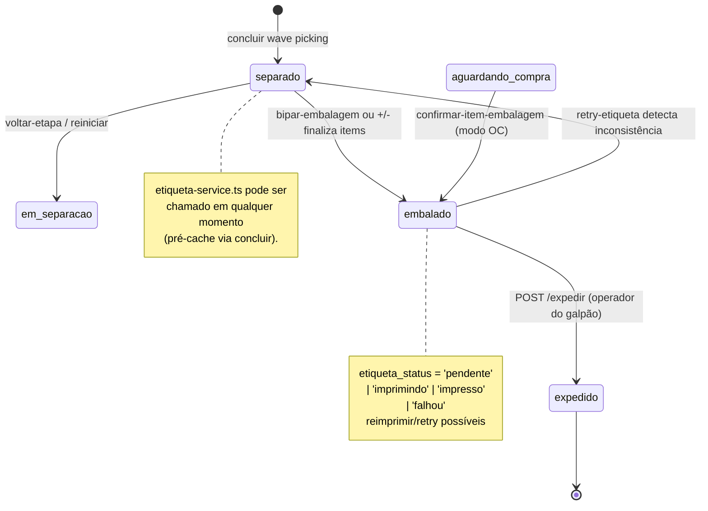
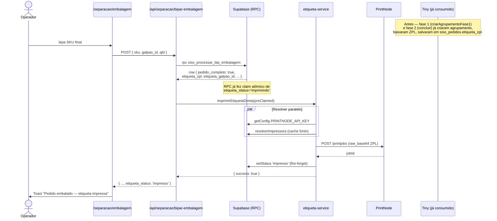
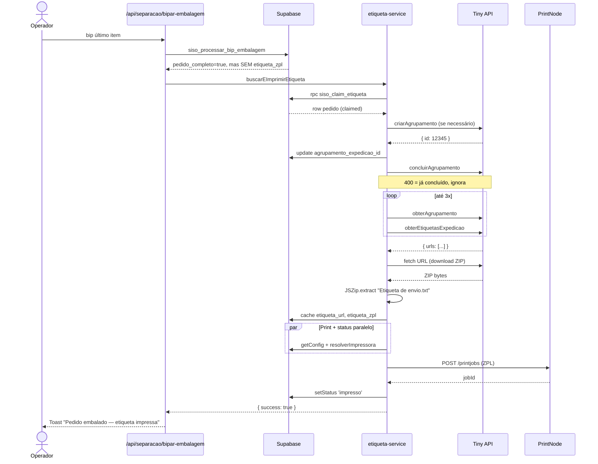

# 06 — Embalagem, Expedição e Etiquetas

> Cobertura: post-separação. Bipagem de embalagem, conferência item-a-item, transição `separado` → `embalado` → `expedido`, pré-cache de etiquetas (agrupamento Tiny), impressão via PrintNode (caminho rápido vs. lento), retry/reimpressão e o módulo de etiquetas de endereço de armazém.
>
> **Não cobre**: picking/wave-picking (ver `05-separacao-wave-picking.md`), compras/OC (ver `07-compras-v2.md`), webhook de NF que precede embalagem (ver `02-webhook-nota-fiscal.md`).

## Sumário

- [1. Visão geral e estado da arte](#1-visão-geral-e-estado-da-arte)
- [2. Modelo de dados relevante](#2-modelo-de-dados-relevante)
- [3. Pré-cache de etiquetas (agrupamento Tiny)](#3-pré-cache-de-etiquetas-agrupamento-tiny)
  - [3.1 Por que existe](#31-por-que-existe)
  - [3.2 Fase 1 — `criarAgrupamentoFase1`](#32-fase-1--criaragrupamentofase1)
  - [3.3 Fase 2 — `preCriarAgrupamentosEmLote` + `recarregarEtiquetasFaltantes`](#33-fase-2--precriaragrupamentosemlote--recarregaretiquetasfaltantes)
  - [3.4 Atomic claim e recuperação de `pending`](#34-atomic-claim-e-recuperação-de-pending)
  - [3.5 Falhas comuns](#35-falhas-comuns)
- [4. Embalagem](#4-embalagem)
  - [4.1 Quando um pedido entra em embalagem](#41-quando-um-pedido-entra-em-embalagem)
  - [4.2 UI `/separacao/embalagem`](#42-ui-separacaoembalagem)
  - [4.3 `POST /api/separacao/bipar-embalagem`](#43-post-apiseparacaobipar-embalagem)
  - [4.4 `POST /api/separacao/confirmar-item-embalagem`](#44-post-apiseparacaoconfirmar-item-embalagem)
  - [4.5 Conferência: contagem real e itens ocultos](#45-conferência-contagem-real-e-itens-ocultos)
  - [4.6 Caminho OC: embalagem direta `aguardando_compra` → `embalado`](#46-caminho-oc-embalagem-direta-aguardando_compra--embalado)
- [5. Impressão de etiqueta no momento da embalagem](#5-impressão-de-etiqueta-no-momento-da-embalagem)
  - [5.1 Fast path — ZPL pré-cacheado](#51-fast-path--zpl-pré-cacheado)
  - [5.2 Slow path — `buscarEImprimirEtiqueta`](#52-slow-path--buscareimprimiretiqueta)
  - [5.3 `imprimirEtiquetaDireta` (claim atômico no RPC)](#53-imprimiretiquetadireta-claim-atômico-no-rpc)
- [6. Expedição](#6-expedição)
  - [6.1 `POST /api/separacao/expedir`](#61-post-apiseparacaoexpedir)
  - [6.2 UI tab `embalados` e batch expedir](#62-ui-tab-embalados-e-batch-expedir)
- [7. Reimpressão e retry](#7-reimpressão-e-retry)
  - [7.1 `POST /api/separacao/reimprimir`](#71-post-apiseparacaoreimprimir)
  - [7.2 `POST /api/separacao/retry-etiqueta`](#72-post-apiseparacaoretry-etiqueta)
- [8. Integração PrintNode](#8-integração-printnode)
  - [8.1 Configuração](#81-configuração)
  - [8.2 Resolução de impressora](#82-resolução-de-impressora)
  - [8.3 PDF vs ZPL (raw_base64)](#83-pdf-vs-zpl-raw_base64)
  - [8.4 Falhas e retry de rede](#84-falhas-e-retry-de-rede)
- [9. Etiquetas de endereço (`/etiquetas`)](#9-etiquetas-de-endereço-etiquetas)
  - [9.1 Geração de endereços](#91-geração-de-endereços)
  - [9.2 Layouts: pequena (2/label) e grande (1/label rotacionada)](#92-layouts-pequena-2label-e-grande-1label-rotacionada)
  - [9.3 Preview e impressão](#93-preview-e-impressão)
- [10. Histórico de eventos](#10-histórico-de-eventos)
- [11. Diagramas](#11-diagramas)
  - [11.1 State machine `separado` → `embalado` → `expedido`](#111-state-machine-separado--embalado--expedido)
  - [11.2 Sequence: agrupamento + cache + expedição (fast path)](#112-sequence-agrupamento--cache--expedição-fast-path)
  - [11.3 Sequence: expedição sem cache (slow path)](#113-sequence-expedição-sem-cache-slow-path)
  - [11.4 Flowchart de retry/reimpressão](#114-flowchart-de-retryreimpressão)
- [12. Side effects e tabelas escritas](#12-side-effects-e-tabelas-escritas)
- [13. Erros conhecidos](#13-erros-conhecidos)

---

## 1. Visão geral e estado da arte

A embalagem é a etapa **pós-picking** e antecede a expedição. Conceitualmente:

| Etapa | Status | UI | Endpoint(s) crítico(s) | Responsável |
|---|---|---|---|---|
| Pacote pronto para embalar | `separado` | `/separacao/embalagem?pedidos=...` | `bipar-embalagem`, `confirmar-item-embalagem` | Operador do galpão |
| Pacote embalado, aguardando despacho | `embalado` | `/separacao` (tab Embalados) | `reimprimir`, `expedir` | Operador do galpão |
| Pacote despachado | `expedido` | `/separacao` (tab Expedidos) | (terminal) | Operador do galpão |

A **etiqueta de envio** é uma chave central: idealmente cacheada antes do operador completar a embalagem, para que o instante de bip do último item dispare uma impressão em ~200 ms. Se o cache falhar, o sistema cai em um fallback síncrono (~3-5 s) que cria/recupera o agrupamento Tiny e baixa o ZPL on-demand.

Existe também um módulo paralelo, **etiquetas de endereço** (`/etiquetas`), que gera ZPL a partir de uma faixa de endereços de armazém (corredor × horizontal × vertical) e envia via PrintNode. Não interage com pedidos — é puro utilitário operacional.

Refs:
- `src/app/separacao/embalagem/page.tsx`
- `src/lib/etiqueta-service.ts`
- `src/lib/agrupamento-service.ts`
- `src/lib/printnode.ts`

---

## 2. Modelo de dados relevante

Colunas de `siso_pedidos` envolvidas (ver `docs/database-schema.md` linhas 65-75 e 99):

| Coluna | Tipo | Significado |
|---|---|---|
| `status_separacao` | text | `aguardando_compra` / `aguardando_separacao` / `em_separacao` / `separado` / `embalado` / `expedido` |
| `embalagem_concluida_em` | timestamptz | Carimbo de quando o último item da embalagem foi bipado |
| `embalagem_operador_id` | uuid (FK `siso_usuarios.id`) | Operador que fechou a embalagem (pode diferir de `separacao_operador_id`) |
| `etiqueta_status` | text | `pendente` / `imprimindo` / `impresso` / `falhou` (CHECK constraint) |
| `etiqueta_url` | text | URL retornada por `obterEtiquetasExpedicao` no Tiny |
| `etiqueta_zpl` | text | ZPL bruto cacheado, extraído do ZIP servido em `etiqueta_url` |
| `agrupamento_expedicao_id` | text | ID do agrupamento Tiny (1:1 com pedido). Sentinela `'pending'` durante claim atômico, `'expedido_externo'` se NF já foi expedida fora do SISO |
| `expedicao_id` | text | ID da expedição dentro do agrupamento. Permite o fast path do retry pular `obterAgrupamento` |
| `agrupamento_tiny_id` | bigint | **DEPRECATED** — antigo, substituído por `agrupamento_expedicao_id` |
| `forma_envio_id`, `forma_frete_id`, `transportador_id` | text | Metadata de envio capturado da NF Tiny, repassado ao criar agrupamento |
| `nota_fiscal_id`, `chave_acesso_nf` | bigint, text | Pré-requisitos para criar agrupamento (ambos NOT NULL gate) |
| `separacao_galpao_id` | uuid | Galpão onde a embalagem é executada — usado para resolver impressora |
| `separacao_operador_id` | uuid | Pode override impressora do galpão na resolução |
| `separacao_tags` | text[] | Tags livres; `"embalagem direta"` é injetada pelo caminho OC |

Itens (`siso_pedido_itens`):

| Coluna | Significado |
|---|---|
| `quantidade_pedida` | Quantidade do pedido original |
| `quantidade_bipada` | Atualizada por bip e +/- na UI de embalagem |
| `bipado_completo` | `quantidade_bipada >= quantidade_pedida` |
| `compra_status` | `null` / `pendente` / `comprado` / `recebido` / `indisponivel` / `cancelado`. Itens em `indisponivel`/`cancelado` são **excluídos da contagem de conclusão** |

RPCs PL/pgSQL chave (migrações):
- `siso_processar_bip_embalagem(p_sku, p_galpao_id, p_quantidade, p_operador_id)` → `supabase/migrations/20260311_fn_processar_bip_embalagem.sql` (versão final em `20260323_fix_bip_embalagem_case_insensitive.sql`).
- `siso_claim_etiqueta(p_pedido_id)` → `supabase/migrations/20260316_etiqueta_status_rpc_functions.sql:8`. Retorna pedido completo se conseguir claim atômico.
- `siso_set_etiqueta_status(p_pedido_id, p_status)` → mesma migração, linha 37.
- `siso_claim_pedidos_para_agrupamento(p_pedido_ids text[])` → mesma migração, linha 54 (corrigida em `20260316_fix_agrupamento_use_nf_ids.sql`).

---

## 3. Pré-cache de etiquetas (agrupamento Tiny)

### 3.1 Por que existe

Sem cache, a sequência ao bipar o último item da embalagem seria:

1. `criarAgrupamento(token, [nf_id], forma_frete_id?)` no Tiny
2. `concluirAgrupamento(token, agrup_id)` (idempotente, pode 400)
3. `obterAgrupamento(token, agrup_id)` para descobrir `expedicao_id`
4. `obterEtiquetasExpedicao(token, agrup_id, exp_id)` → URL do ZIP
5. `fetch(url)` → 15s timeout, descompactar JSZip
6. `enviarImpressaoZpl(...)` para PrintNode

Total: ~3-5s contendo 4-5 chamadas Tiny + 1 download HTTP + 1 chamada PrintNode. O operador **espera** com a caixa fechada na mão.

A solução: disparar fire-and-forget tudo até e inclusive (5) **muito antes** do bip final, deixando apenas (6) para o momento crítico. Latência crítica cai para ~200 ms.

Ref: cabeçalho de `src/lib/agrupamento-service.ts:1-13` e `src/lib/etiqueta-service.ts:1-11`.

### 3.2 Fase 1 — `criarAgrupamentoFase1`

A **fase 1** roda assim que a NF persiste — bem antes do operador iniciar o picking. Seu único trabalho é **descobrir e gravar o `agrupamento_expedicao_id` e `expedicao_id`**, mas **não** baixa o ZPL ainda (ZPL é caro, e nem sempre o pedido vai ser embalado).

Entrypoints fire-and-forget:
- `src/lib/execution-worker.ts:565` — após enriquecer NF no worker (`propria`/`transferencia`/`oc`).
- `src/lib/nf-webhook-handler.ts:163` — quando o webhook de NF chega após o pedido.
- `src/lib/webhook-processor.ts:547` — reconciliação de NF dentro do webhook de pedido.
- `src/app/api/separacao/forcar-pendente/route.ts:110` e `[pedidoId]/forcar-pendente/route.ts:119` — após override manual de NF.
- `src/app/api/admin/backfill-agrupamentos/route.ts:85` — endpoint de backfill admin.

Gates (em ordem, `agrupamento-service.ts`):
1. Pedido encontrado.
2. `nota_fiscal_id IS NOT NULL` **e** `chave_acesso_nf IS NOT NULL`. Se há `nota_fiscal_id` mas a chave é NULL, roda o **self-heal** (`recuperarChavesAcessoFaltantes`): refetcha a NF no Tiny e, se situação 6/7 com `chaveAcesso`, persiste a chave e segue. Se mesmo assim faltar chave (NF não autorizada / webhook ainda não chegou), deixa para o "second-chance" (fase 2 no `concluir`).
3. Idempotência: se `agrupamento_expedicao_id` já existe e ≠ `'pending'`, sai.
4. `recuperarPendingTravados` — se há `'pending'` há mais de 5 minutos, libera (crash recovery).
5. Atomic claim via `siso_claim_pedidos_para_agrupamento([pedidoId])` — só uma instância concorrente avança.

Fluxo após o claim:
- `criarAgrupamento(token, [p.nota_fiscal_id], formaFrete)` no Tiny → grava string id.
- Se Tiny erra com `"já foi expedida"`, marca `agrupamento_expedicao_id = 'expedido_externo'` e termina.
- `concluirAgrupamento(...)` — pode 400 (Mercado Envios faz pickup automático). Tratado como warning, não-fatal.
- `obterAgrupamento(...)` para descobrir a primeira expedição → grava `expedicao_id`.
- **Não baixa ZPL.** Fase 2 fará isso.

Em qualquer falha após o claim, limpa os IDs (`agrupamento_expedicao_id = NULL, expedicao_id = NULL`) só onde o estado ainda é `'pending'`, para permitir nova tentativa.

### 3.3 Fase 2 — `preCriarAgrupamentosEmLote` + `recarregarEtiquetasFaltantes`

A **fase 2** roda quando o pedido transita para `separado`. Tem dois objetivos:

1. **`preCriarAgrupamentosEmLote(pedidoIds[])`** (`agrupamento-service.ts`) — recria agrupamentos para pedidos que perderam fase 1 (e.g. NF chegou tarde, restart durante fase 1, ou backfill). Usa o mesmo `siso_claim_pedidos_para_agrupamento`. Para cada pedido, cria agrupamento, conclui, descobre expedição, **e nesta passada baixa+cacheia o ZPL** via `obterEtiquetasExpedicao` + `baixarZpl`.
   - **Self-heal de chave de acesso** (`recuperarChavesAcessoFaltantes`): antes do gate de NF completa, pedidos com `nota_fiscal_id` preenchido mas `chave_acesso_nf` NULL têm a NF refetchada do Tiny (`obterNotaFiscal`). Se a situação for 6/7 (Autorizada/Emitida Danfe) e houver `chaveAcesso`, persiste a chave (update guardado com `IS NULL`, idempotente com o webhook) e o pedido passa o gate na mesma chamada. Cobre o caso de webhook `nota_fiscal` nunca entregue, que antes travava o pedido para sempre com `etiqueta_status = 'falhou'`.
2. **`recarregarEtiquetasFaltantes(pedidoIds[])`** (`agrupamento-service.ts:121-202`) — para pedidos que **já têm `agrupamento_expedicao_id`** numérico mas estão sem `etiqueta_zpl`, redownload. Casos comuns: rede instável durante fase 1, ZIP corrompido.

Entrypoints fire-and-forget:
- `src/app/api/separacao/concluir/route.ts:202-212` — após concluir wave picking. Roda **ambos** em sequência.
- `src/app/api/separacao/concluir-oc/route.ts:310-316` — caminho OC equivalente.
- `src/lib/compras-embalagem.ts:198-206` — quando OC foi recebida e itens estão prontos para embalar.
- `src/app/api/separacao/retry-etiqueta/route.ts:167-199` — retry manual.

`recarregarEtiquetasFaltantes` filtra primeiro pedidos com `agrupamento_expedicao_id` numérico (`/^\d+$/`); os com `'pending'` ou `'expedido_externo'` são pulados com warning. Para cada pedido válido, chama `retryAgrupamento`:
1. `concluirAgrupamento` — 404 → limpa IDs (re-criação), 400 → segue (já concluído), outros erros → throw.
2. Se `expedicao_id` já gravado → `fetchAndSaveLabel` direto (rápido).
3. Senão → `obterAgrupamento` para descobrir → `fetchAndSaveLabel`.

`fetchAndSaveLabel` (`agrupamento-service.ts:602-639`): `obterEtiquetasExpedicao` → URL → `baixarZpl(url)` → `salvarEtiqueta`. `salvarEtiqueta` (linha 641-662) **só** grava `etiqueta_zpl` se o download foi bem-sucedido — caso contrário, deixa null para o próximo retry. Nunca salva URL com ZPL nulo (URL pode estar stale).

### 3.4 Atomic claim e recuperação de `pending`

O sentinel `'pending'` é gravado em `agrupamento_expedicao_id` **antes** de chamar o Tiny. Isso permite:
- Detecção de chamadas concorrentes (segunda chamada vê `'pending'` no claim e sai).
- Recovery de crash: se um processo morreu entre o claim e o save do ID real, `recuperarPendingTravados` (`agrupamento-service.ts:671-689`) zera `'pending'` que estão há **>5 min** sem update, permitindo retry.

```sql
-- Esqueleto de siso_claim_pedidos_para_agrupamento (ver 20260316_fix_agrupamento_use_nf_ids.sql)
UPDATE siso_pedidos
SET agrupamento_expedicao_id = 'pending', updated_at = NOW()
WHERE id = ANY(p_pedido_ids)
  AND empresa_origem_id IS NOT NULL
  AND nota_fiscal_id IS NOT NULL
  AND (agrupamento_expedicao_id IS NULL)
RETURNING id, numero, empresa_origem_id, nota_fiscal_id, forma_envio_id, forma_frete_id, transportador_id;
```

Como o RPC é atômico (UPDATE...RETURNING), só um caller recebe linhas; demais recebem array vazio.

### 3.5 Falhas comuns

| Causa | Sintoma DB | Estratégia |
|---|---|---|
| NF não chegou ainda | `agrupamento_expedicao_id IS NULL` | Esperar webhook de NF (fluxo 02). Fase 1 será disparada de novo. |
| NF expedida fora do SISO | `agrupamento_expedicao_id = 'expedido_externo'` | Manual: zerar e refazer, ou aceitar que a etiqueta não será impressa pelo SISO. |
| Crash durante criação | `agrupamento_expedicao_id = 'pending'` por >5 min | `recuperarPendingTravados` libera no próximo entrypoint. |
| ZIP corrompido / rede flaky | `agrupamento_expedicao_id = "12345"`, `etiqueta_zpl IS NULL` | `recarregarEtiquetasFaltantes` no `concluir` ou retry manual. |
| Agrupamento removido no Tiny | 404 em `concluirAgrupamento` | `retryAgrupamento` zera os IDs para re-criação. |

---

## 4. Embalagem

### 4.1 Quando um pedido entra em embalagem

Pré-requisito: `status_separacao = 'separado'` (caminho normal) **ou** `'aguardando_compra'` (caminho de embalagem direta OC).

A entrada para a UI é a tab **"Pendentes" da embalagem** em `/separacao` (filtro por `status_separacao = 'separado'`). O operador seleciona um ou mais pedidos e navega para `/separacao/embalagem?pedidos=ID1,ID2,...`. Não há endpoint dedicado de "iniciar embalagem" — a transição `em_separacao → separado` ocorre em `concluir` (fluxo 05), e `separado → embalado` ocorre **dentro** dos endpoints de embalagem ao detectar conclusão.

### 4.2 UI `/separacao/embalagem`

Arquivo: `src/app/separacao/embalagem/page.tsx`.

Componentes principais:
- **Scan input** (`scanRef`) — autofocus permanente. `keydown` global no window redireciona caracteres imprimíveis para o input se ele perder foco (`page.tsx:108-118`). Click em qualquer área não-clicável também refoca (`page.tsx:493-499`).
- **Quantidade do bip** — `scanQty` (default 1, número editável ao lado do input). Aplicada ao próximo bip e zerada após.
- **Card "último bip"** — quando um bip retorna sucesso, o pedido bipado é renderizado expandido no topo, fora da lista normal, com highlight azul por 2s (`page.tsx:538-561`).
- **Lista de pedidos** — separada em duas seções: **Pendentes** (status `separado`) e **Embalados** (transitaram durante a sessão). O `completedIds: Set<string>` mantém em memória os pedidos completos da sessão; `completedPedidoData: Map` guarda os dados originais para que o pedido continue visível mesmo após o `useQuery` deixar de retorná-lo.
- **`EmbalagemOrderRow`** (`page.tsx:655-834`) — header expansível com `numero`, NF, EC (clicável para copiar), cliente, empresa origem, contagem `itens_bipados/total_itens`. Expandido mostra `EmbalagemItemRow` para cada item.
- **`EmbalagemItemRow`** (`page.tsx:838-939`) — imagem (clicável para zoom), descrição, SKU (clicável para copiar), localização, contagem `bipada/pedida`, e botões **+/-** para ajuste manual.
- **Botão Reimprimir** — aparece em pedidos completos expandidos. Chama `POST /api/separacao/reimprimir`.
- **Botão "Reiniciar progresso"** — chama `POST /api/separacao/reiniciar` com `etapa: "embalagem"` para os pedidos ativos. Zerar pode ser destrutivo: confirmation `window.confirm`.

Dados:
- `useQuery(["embalagem-pedidos", ...])` chama `GET /api/separacao?status_separacao=separado` (ou `aguardando_compra` no modo OC), `refetchInterval: 5000`.
- `useQuery(["embalagem-items", ...])` chama `GET /api/separacao/checklist-items?pedidos=ID1,ID2,...` para os itens. `staleTime: 30_000`.

Diferenças vs. picking (fluxo 05):
- **Picking** mostra produto/localização para coleta no armazém; SKU é validado contra item em `siso_pedido_itens.bipado` (campo separado de `bipado_completo`).
- **Embalagem** mostra imagem/conferência; SKU é validado contra `bipado_completo`. Bipar mais que `quantidade_pedida` é bloqueado.
- **Picking** usa `marcar-item` / `bipar` / `desfazer-bip`. **Embalagem** usa `bipar-embalagem` / `confirmar-item-embalagem`.
- **Picking** termina com `concluir`. **Embalagem** **não tem endpoint explícito de conclusão** — a transição para `embalado` é detectada **dentro** dos próprios endpoints quando todos os items packáveis ficam `bipado_completo = true`.

### 4.3 `POST /api/separacao/bipar-embalagem`

Arquivo: `src/app/api/separacao/bipar-embalagem/route.ts`.

Headers: `X-Session-Id`. Body: `{ sku: string, galpao_id?: string, quantidade?: number }`.

Fluxo (`route.ts:20-192`):

1. Sessão valida (`getSessionUser`, 401 se inválida).
2. Body valida (`sku` obrigatório, `quantidade` default 1).
3. `sku` é uppercased e trimmed.
4. **RPC `siso_processar_bip_embalagem`** (`route.ts:46-54`) faz tudo atomicamente:
   - Encontra o **pedido mais antigo** (`status_separacao = 'separado'`) cujo item tenha esse SKU/GTIN, `bipado_completo = false`, e `compra_status NOT IN ('indisponivel','cancelado')`.
   - Filtra por `separacao_galpao_id = p_galpao_id` se fornecido (case-insensitive desde `20260323_fix_bip_embalagem_case_insensitive.sql`).
   - Incrementa `quantidade_bipada` por `p_quantidade` (limita ao máximo `quantidade_pedida`).
   - Marca `bipado_completo = true` se atingir.
   - Verifica se TODOS os items packáveis do pedido estão `bipado_completo`. Se sim, transita o pedido para `embalado` e seta `embalagem_concluida_em`, `embalagem_operador_id` (em uma única transação).
   - **Se transitar para `embalado`**, faz claim atômico de `etiqueta_status = 'imprimindo'` (lógica idêntica ao `siso_claim_etiqueta`) e retorna campos para impressão direta — ver migração `20260317_optimize_bip_embalagem_merge_etiqueta_claim.sql`.
5. Se RPC retorna array vazio: faz **diagnóstico** consultando `siso_pedido_itens` por SKU e GTIN para construir mensagem útil ("já bipado", "outro galpão", "status X", "item indisponível"). Retorna 404 com a mensagem (`route.ts:66-138`).
6. Se RPC retorna linha:
   - `pedido_completo = false`: registra log e retorna o resultado.
   - `pedido_completo = true`: registra evento `embalagem_concluida` (fire-and-forget), e **espera** a impressão da etiqueta antes de responder. O caminho da etiqueta depende do que o RPC retornou:
     - **Direta** (`row.etiqueta_empresa_origem_id && row.etiqueta_galpao_id`): chama `imprimirEtiquetaDireta(...)` com os dados pré-claimados — pula RPC `siso_claim_etiqueta` (`route.ts:165-176`).
     - **Indireta**: chama `buscarEImprimirEtiqueta(pedidoId, session.id)` que faz seu próprio claim.
   - Resposta inclui `etiqueta_status: 'impresso' | 'falhou'` e `etiqueta_erro` se aplicável.

Resposta de sucesso (`BipEmbalagemResult`):
```json
{
  "pedido_id": "uuid",
  "produto_id": "uuid",
  "quantidade_bipada": 3,
  "bipado_completo": true,
  "pedido_completo": false
}
```
Ou, se `pedido_completo: true`:
```json
{
  ...,
  "pedido_completo": true,
  "etiqueta_status": "impresso",
  "etiqueta_erro": null
}
```

Erros:
- 401 `sessao_invalida`
- 400 `'sku' (string) é obrigatório`
- 404 com mensagem diagnóstica (`Nenhum pedido com este SKU pendente de embalagem` ou `SKU encontrado mas não disponível: #1234: já bipado, ...`)
- 500 erro interno

### 4.4 `POST /api/separacao/confirmar-item-embalagem`

Arquivo: `src/app/api/separacao/confirmar-item-embalagem/route.ts`.

Headers: `X-Session-Id`. Body: `{ pedido_item_id: string, quantidade: number }`.

Confirma manualmente via botões **+/-**. Diferenças vs. `bipar-embalagem`:
- **Identifica item explicitamente** por `pedido_item_id` (não busca por SKU).
- **Aceita delta negativo** — `quantidade: -1` decrementa. `Math.max(0, current + delta)` garante não-negativo.
- **Não usa RPC** — faz `UPDATE` direto em `siso_pedido_itens` e `COUNT` separado para verificar conclusão (`route.ts:88-128`).
- **Aceita `aguardando_compra`** além de `separado` — habilita o caminho OC ("embalagem direta") ver §4.6.

Lógica (`route.ts:18-330`):

1. Sessão valida.
2. Carrega item + pedido pai (single queries, `route.ts:43-68`).
3. Valida pedido em `separado` ou `aguardando_compra` (caminho OC). Outros status: 400.
4. Calcula `newBipada = max(0, current + delta)`, `bipado_completo = newBipada >= quantidade_pedida`.
5. UPDATE em `siso_pedido_itens`.
6. **COUNT** de items com `bipado_completo = false` que **não** estão `indisponivel`/`cancelado`. A consulta usa `.or("compra_status.is.null,compra_status.not.in.(indisponivel,cancelado)")` para incluir `NULL` (que SQL trata especialmente em `NOT IN`) — ver `route.ts:111-117` e migração `20260318_fix_embalagem_hidden_items_count.sql`.
7. Se `pendingCount === 0`:
   - **Caminho OC** (`isOC = true`): ver §4.6.
   - **Caminho normal**: UPDATE pedido para `status_separacao = 'embalado'`, registra evento `embalagem_concluida`, chama `buscarEImprimirEtiqueta`. Retorna com `etiqueta_status`.
8. Se ainda há items pendentes: retorna sem dispatcho de etiqueta.

### 4.5 Conferência: contagem real e itens ocultos

A regra-chave para detectar conclusão é: **um pedido está completo quando todos os items que **não** estão `compra_status IN ('indisponivel', 'cancelado')` têm `bipado_completo = true`.

Isso é necessário porque OC pode marcar items como `indisponivel` (fornecedor não tinha) ou `cancelado` (operador cancelou item específico). Esses items ficam ocultos da UI de embalagem mas existem no DB. Sem o filtro, o pedido nunca seria fechado.

Implementação:
- No RPC PL/pgSQL `siso_processar_bip_embalagem` (versão final em `20260318_compras_excecoes.sql:156`).
- No endpoint de confirmação, replicado em SQL: `route.ts:111-117` (com OR para tratar NULL).

Quantidades também respeitam: **`Math.max(0, current + delta)`** no decremento manual, e a RPC trunca em `quantidade_pedida`.

### 4.6 Caminho OC: embalagem direta `aguardando_compra` → `embalado`

Quando um pedido OC tem itens parciais ou o operador decide embalar direto sem passar pelo wave picking normal, o status é `aguardando_compra`. A UI de embalagem aceita esse status com `?modo=embalagem-oc`. O endpoint `confirmar-item-embalagem` detecta `isOC = true` e dispara um pipeline expandido (`route.ts:131-273`):

1. **Auto-resolve compra**: marca todos os items com `compra_status NOT IN ('recebido','cancelado')` como `recebido`, com `compra_quantidade_recebida = compra_quantidade_solicitada`.
2. **Determina decisão final**:
   - Carrega o galpão da empresa origem (`empresa_origem_id` → `siso_empresas.galpao_id`).
   - Carrega galpões das ordens de compra do pedido.
   - Se todas as OCs estão no mesmo galpão da origem → `decisao = 'propria'`, `separacao_galpao_id = pedidoGalpaoId`.
   - Se as OCs estão em outro galpão → `decisao = 'transferencia'`, `separacao_galpao_id = ocGalpaoId`, `empresa_id` da execução vira a primeira empresa ativa do galpão da OC.
3. **Update pedido**: `status = 'executando'`, `status_separacao = 'embalado'`, `decisao_final`, `separacao_galpao_id`, `embalagem_concluida_em/operador_id`, e injeta tag `"embalagem direta"` em `separacao_tags` (idempotente).
4. **Enfileira execução**: insert em `siso_fila_execucao` com `tipo: 'lancar_estoque'`, `decisao` calculada.
5. **Imprime etiqueta**: fast path se `etiqueta_zpl` ou `etiqueta_url` já cacheado, senão `buscarEImprimirEtiqueta`.
6. **Registra evento** `embalagem_direta_concluida` com `decisao` e `etiquetaStatus`.
7. **`kickWorker()`** fire-and-forget para acordar o worker imediatamente.

Resposta inclui `etiqueta_status` e `etiqueta_erro`.

> Note: o caminho OC **não** é exposto via `bipar-embalagem` — apenas via `confirmar-item-embalagem`. A UI do modo OC usa `bipar-embalagem-oc` (endpoint separado, não documentado aqui pois pertence ao fluxo 07).

---

## 5. Impressão de etiqueta no momento da embalagem

### 5.1 Fast path — ZPL pré-cacheado

Pré-requisitos:
- `etiqueta_zpl IS NOT NULL` em `siso_pedidos`.
- Impressora resolvida.
- `PRINTNODE_API_KEY` configurada.

Sequência (`etiqueta-service.ts:118-191`):
1. `Promise.all` em paralelo:
   - `zpl` direto do `pedido.etiqueta_zpl`.
   - `getConfig("PRINTNODE_API_KEY")`.
   - `resolverImpressora(operadorId, galpaoId)`.
2. `enviarImpressaoZpl({ apiKey, printerId, zpl, titulo })`.
3. Fire-and-forget: `setStatus(supabase, pedidoId, "impresso")` + `registrarEvento("etiqueta_impressa")`.
4. Retorna `{ success: true }`.

Latência observada: ~200 ms (claim + resolve paralelo + PrintNode HTTP).

### 5.2 Slow path — `buscarEImprimirEtiqueta`

Quando `etiqueta_zpl IS NULL`, cai no fallback (`etiqueta-service.ts:370-461`).

1. `siso_claim_etiqueta(pedidoId)` — RPC atômico que move `etiqueta_status = 'pendente' → 'imprimindo'` e retorna a linha. Concorrentes recebem `null`.
2. Se já não tinha empresa, galpão, ou ZPL final, marca `falhou` e retorna.
3. **`resolverZplFallback`**:
   - `getValidTokenByEmpresa(empresaOrigemId)`.
   - Dentro de `runWithEmpresa(empresaId, ...)` (rate limit por empresa, fluxo 04):
     - Se `agrupamento_expedicao_id` existe (numérico): reutiliza, senão `criarNovoAgrupamento`.
     - `concluirAgrupamento` (não-fatal, 400 = já concluído).
     - **Loop até 3 tentativas com backoff** (`2000 * attempt` ms): `obterAgrupamento` para descobrir expedição que case com `nota_fiscal_id` ou `id` do pedido → `obterEtiquetasExpedicao(...)` → URL.
     - Se 404 do agrupamento, cria novo e continua.
     - Se "não foi concluído", aguarda e retenta.
   - `baixarZpl(url)` — fetch com 15s timeout, JSZip extrai `Etiqueta de envio.txt` (ou primeiro `.txt`/`.zpl`), valida que começa com `^` ou `~` (`etiqueta-download.ts:101-106`).
   - **Cache**: UPDATE `etiqueta_url`, `etiqueta_zpl` no pedido para reusos futuros.
4. Após resolver ZPL: mesmo passo do fast path (envia para PrintNode, atualiza status).

Latência observada: ~3-5s no caso normal, até ~10s se houver retry com backoff.

### 5.3 `imprimirEtiquetaDireta` (claim atômico no RPC)

Usado quando o RPC `siso_processar_bip_embalagem` já fez o claim atômico de `etiqueta_status = 'imprimindo'` e retornou os dados na mesma transação que mudou o pedido para `embalado` (otimização de `20260317_optimize_bip_embalagem_merge_etiqueta_claim.sql`).

Salva ~30-50ms ao pular o roundtrip `siso_claim_etiqueta`. Implementação em `etiqueta-service.ts:225-309`. A interface `EtiquetaPreClaimed` (linhas 38-47) recebe os dados pré-claimados:

```ts
export interface EtiquetaPreClaimed {
  pedidoId: string;
  numero: string;
  empresaOrigemId: string;
  agrupamentoExpedicaoId: string | null;
  etiquetaZpl: string | null;
  etiquetaUrl: string | null;
  separacaoGalpaoId: string;
  separacaoOperadorId: string | null;
}
```

Comportamento idêntico ao `buscarEImprimirEtiqueta` mas sem o claim RPC.

---

## 6. Expedição

### 6.1 `POST /api/separacao/expedir`

Arquivo: `src/app/api/separacao/expedir/route.ts`.

Headers: `X-Session-Id`. Body: `{ pedido_ids: string[] }`.

Único papel: transitar `embalado → expedido`. **Não** comunica com Tiny — a transição é puramente interna ao SISO.

Fluxo (`route.ts:14-149`):
1. Sessão valida.
2. **Bloqueia admin** (`!session.galpaoId`) com 403 `admin não pode expedir diretamente` — admin não tem galpão associado e a expedição requer galpão para auditoria.
3. Body valida: array não-vazio de strings.
4. Carrega pedidos em `pedido_ids`.
5. Valida que **todos** pertencem ao galpão do operador (`separacao_galpao_id === session.galpaoId`). Pedidos de outro galpão: 403 com lista.
6. Detecta IDs ausentes do DB: 404.
7. Valida que **todos** estão `status_separacao = 'embalado'`. Outros status: 400.
8. UPDATE em batch: `status_separacao = 'expedido' WHERE id IN (...) AND status_separacao = 'embalado'` (cláusula extra previne race).
9. Resposta: `{ updated: count }`.

Não registra evento explícito (transição final, sem retorno). Não imprime nada. Não notifica Tiny.

### 6.2 UI tab `embalados` e batch expedir

Arquivo: `src/components/separacao/tab-embalados.tsx`.

Layout: lista de cards com checkbox por pedido, rótulo "Embalado às HH:MM", ação **"Expedir"** individual, e ações de etiqueta.

Operações:
- **Selecionar todos** + checkbox por linha. Suporta **Shift+click** para seleção em range (`tab-embalados.tsx:46-65`).
- **Expedir Selecionados (N)** — chama `POST /api/separacao/expedir` com array. Não exibido para admin.
- **Expedir individual** — single-pedido também via mesmo endpoint.
- **Reimprimir / Tentar Novamente** — chama `POST /api/separacao/reimprimir`. Botão muda visual conforme status:
  - `etiqueta_status = 'falhou'` → botão vermelho "Tentar Novamente" com texto.
  - `etiqueta_status = 'impresso'` → ícone Printer pequeno.
  - Outros → ícone disabled (40% opacity).

Após expedir, chama `onUpdated()` que invalida queries da página `/separacao` para refrescar a lista.

---

## 7. Reimpressão e retry

### 7.1 `POST /api/separacao/reimprimir`

Arquivo: `src/app/api/separacao/reimprimir/route.ts`.

Headers: `X-Session-Id`. Body: `{ pedido_id: string }`.

Reimpressão sob demanda — usado pelo botão na UI de embalagem (após sucesso) e pela tab Embalados (etiqueta falhou ou já impressa, quer cópia).

Fluxo (`route.ts:23-131`):
1. Sessão valida.
2. Carrega pedido com colunas críticas. 404 se não existe.
3. **Permissão de galpão**: não-admin precisa que `separacao_galpao_id === session.galpaoId`. 403 senão.
4. **Status guard**: `status_separacao` deve ser `embalado`. Senão 400 com `pedido_nao_embalado`.
5. **Branching pelo cache**:
   - **Sem `etiqueta_zpl`**: chama `buscarEImprimirEtiqueta(pedidoId, session.id)` (slow path completo). Confere se `etiqueta_zpl` foi gravado para responder `impresso` ou `falhou`.
   - **Com `etiqueta_zpl`**: caminho rápido — resolve API key + impressora em paralelo, **`splitZplLabels(...)[0]`** garante UMA etiqueta (segurança contra cache contendo várias) com tratamento especial Shopee, e `enviarImpressaoZpl` direto.
6. Atualiza `etiqueta_status` fire-and-forget (`impresso` ou `falhou`).
7. Resposta: `{ status: 'impresso' | 'falhou', jobId?, error? }`.

`splitZplLabels` (em `etiqueta-download.ts:120-145`): split por `^XA...^XZ`. **Não** divide labels Shopee (contêm `~DG`) porque `~DG` baixa raster gráfico, `^XG` imprime, `^ID` limpa — separar quebra a sequência. Em cache normal Tiny (envio + DANFE), reimprimir só envia o primeiro (etiqueta de envio).

### 7.2 `POST /api/separacao/retry-etiqueta`

Arquivo: `src/app/api/separacao/retry-etiqueta/route.ts`.

Headers: `X-Session-Id`. Body: `{ pedido_id: string }` ou `{ pedido_ids: string[] }`.

**Não imprime nada** — apenas tenta recuperar/recriar agrupamento e ZPL para pedidos `separado` ou `embalado` que ficaram sem cache. Útil para batch-recovery quando a fase 2 não rodou (ex.: deploy interrompeu o `concluir`).

Fluxo (`route.ts:76-332`):

1. Sessão valida; aceita `pedido_id` ou `pedido_ids`.
2. Carrega pedidos. 404 para IDs ausentes.
3. **Permissão de galpão**: não-admin valida `separacao_galpao_id` em todos. 403 senão.
4. **Status guard**: aceita `separado` **e** `embalado`. Outros: 400.
5. `targetIds` = pedidos sem `etiqueta_zpl`. Para esses:
   - `preCriarAgrupamentosEmLote(targetIds)` — recria agrupamento se faltar.
   - `recarregarEtiquetasFaltantes(targetIds)` — recarrega ZPL.
   - Segunda passada: pedidos ainda sem ZPL **e** sem agrupamento → uma rodada extra das mesmas funções.
6. Carrega estado final.
7. **Restauração de status**: se um pedido estava `separado` antes mas agora aparece `embalado` (raro, pode acontecer se um bip simultâneo ocorreu), o endpoint **reverte** para `separado` zerando `embalagem_concluida_em`. Logger registra. Esse caminho **não** existe no `reimprimir` — é específico do retry.
8. Classifica cada pedido em `recuperada`, `ja_disponivel`, `em_andamento` (`agrupamento_expedicao_id = 'pending'`) ou `falhou`.
9. Atualiza `etiqueta_status` em massa via `siso_set_etiqueta_status`:
   - `recuperada` ou `em_andamento` → `pendente` (passa a estar pronta para impressão futura).
   - `falhou` → `falhou`.
10. Responde com resumo + lista detalhada.

Resposta:
```json
{
  "total": 3,
  "recuperadas": 2,
  "ja_disponiveis": 0,
  "em_andamento": 1,
  "falhas": 0,
  "pedidos": [
    {
      "id": "uuid",
      "numero": "12345",
      "status": "recuperada",
      "etiqueta_pronta": true,
      "agrupamento_expedicao_id": "9876",
      "expedicao_id": "5432"
    }
  ]
}
```

---

## 8. Integração PrintNode

### 8.1 Configuração

API key salva em `siso_configuracoes` sob a chave `PRINTNODE_API_KEY` (uppercase no `etiqueta-service.ts`) **ou** `printnode_api_key` (lowercase no `etiquetas-endereco/imprimir`). Ambas formas existem em produção; o `getConfig` consulta literalmente a chave passada. **Cuidado** ao migrar — convém padronizar.

CRUD via `/api/admin/printnode/api-key`. Listar impressoras: `/api/admin/printnode/printers`. Testar conexão: `/api/admin/printnode/test`.

Cliente PrintNode (`src/lib/printnode.ts`):
- Base URL: `https://api.printnode.com`.
- Auth: HTTP Basic com `apiKey:` em base64 (sem senha).
- Endpoints usados:
  - `GET /whoami` — `testarConexao` (validação).
  - `GET /printers` — `listarImpressoras`.
  - `POST /printjobs` — `enviarImpressao` (PDF) e `enviarImpressaoZpl` (ZPL raw).

### 8.2 Resolução de impressora

Função: `resolverImpressora(usuarioId, galpaoId)` em `printnode.ts:251-293`.

Prioridade:
1. `siso_usuarios.printnode_printer_id` do operador — override pessoal (se cada estação física tem sua impressora).
2. `siso_galpoes.printnode_printer_id` do galpão — fallback.
3. `null` (sem impressora configurada → falha controlada).

**Cache em memória de 5 minutos** (`printerCache`, key `usuarioId|galpaoId`). Reduz round-trips em sessões de embalagem de alta cadência. Invalidado por `invalidarCacheImpressora()` (chamado após save de config).

Variante para etiquetas-endereço: pode receber `printer_id` explícito do form — se não, faz fallback para `resolverImpressora(session.id, session.galpaoId)`. Em `tipo: 'pequena'`, `printer_id` é **obrigatório** (não tem fallback) porque é frequentemente uma impressora pequena dedicada.

### 8.3 PDF vs ZPL (raw_base64)

| Função | Content-Type PrintNode | Conteúdo |
|---|---|---|
| `enviarImpressao` | `pdf_uri` | URL pública do PDF |
| `enviarImpressaoZpl` | `raw_base64` | ZPL em base64, encaminhado bruto pela impressora térmica |

Para etiquetas Tiny e etiquetas de endereço, sempre usamos `raw_base64`. A impressora deve ser térmica suportando ZPL (Zebra, TSC, etc.). PrintNode não renderiza — apenas faz transporte.

Body do printjob ZPL inclui:
- `printerId`: int.
- `contentType: "raw_base64"`.
- `content`: ZPL em base64.
- `title`: para mostrar na fila do PrintNode.
- `source: "SISO Separacao"`.
- `expireAfter: 300` (5min) — descarta job se a impressora não pegar.

### 8.4 Falhas e retry de rede

`enviarImpressao*` (`printnode.ts:128-168` e `197-237`):
- Timeout 10s via `AbortSignal.timeout(10_000)`.
- 1 retry **apenas** se `TypeError` (falha de fetch, e.g. DNS) ou `AbortError` (timeout). Outros erros (4xx/5xx PrintNode) propagam imediatamente.
- Retry logado como warn.

Falhas comuns observadas:
- **Impressora offline** (state ≠ `online`): PrintNode aceita o job mas não imprime; o `expireAfter: 300` faz o job descartar. SISO marca `etiqueta_status = 'impresso'` (porque o POST passou) — **inconsistência conhecida**, operador precisa olhar a fila PrintNode.
- **API key inválida**: 403 com mensagem JSON.
- **Printer ID inválido**: 422 ou erro genérico — retorna `falhou` no SISO.
- **Computer offline** (a máquina que conecta a impressora ao PrintNode): jobs ficam enfileirados, similar a printer offline.

---

## 9. Etiquetas de endereço (`/etiquetas`)

Módulo paralelo, sem relação com pedidos. Gera ZPL para etiquetar prateleiras/posições no armazém.

### 9.1 Geração de endereços

Arquivo: `src/lib/zpl-endereco.ts`.

Estrutura `EnderecoRange`:
```ts
{
  corredorInicio: string,    // "A" ou "1"
  corredorFim: string,       // "Z" ou "20"
  horizontalInicio: number,  // 1
  horizontalFim: number,     // 20
  verticalInicio: number,    // 1
  verticalFim: number,       // 5
}
```

`getCorridorRange(start, end)`:
- Ambos iguais → `[start]`.
- Ambos numéricos → range numérico (suporta direção crescente ou decrescente).
- Ambos letras únicas → range A–Z.
- Outro caso → `[start]`.

`gerarEnderecos(range)`: produto cartesiano corredor × horizontal × vertical, formato `CORRIDOR-HH-V` (horizontal padStart 2 com `0`, vertical sem pad).

Exemplo: `A-01-1, A-01-2, A-02-1, ..., A-20-5, B-01-1, ...`.

### 9.2 Layouts: pequena (2/label) e grande (1/label rotacionada)

**Pequena** (`gerarZplPequena`, `zpl-endereco.ts:76-106`):
- 100 mm × 23 mm (812 × 184 dots a 203 dpi).
- Dois endereços por etiqueta (lado a lado), com Code 128 + QR para cada.
- Última etiqueta: se total ímpar, único endereço.

**Grande** (`gerarZplGrande`, `zpl-endereco.ts:112-129`):
- 4" × 6" (~812 × 1218 dots).
- Um endereço por etiqueta, **rotacionado** 90° (`^FWR`).
- Texto grande (`^CF0,250`), Code 128 alto (`^BCR,200`), QR (`^BQN,2,10`).
- Visível de longe — para corredores e topos de prateleira.

### 9.3 Preview e impressão

UI: `src/app/etiquetas/page.tsx`. Tabs `pequena` / `grande` com forms separados (refs `rangePequenaRef` / `rangeGrandeRef` preservam params entre tabs).

Componentes:
- `EtiquetaEnderecoForm` (`src/components/etiquetas/etiqueta-endereco-form.tsx`) — três campos de range (corredor, horizontal, vertical). Submit chama `POST /api/etiquetas-endereco/preview`.
- `EnderecoPreview` (`src/components/etiquetas/endereco-preview.tsx`) — exibe pílulas com cada endereço, contagem total, **dropdown de impressora** (carregado de `/api/admin/printnode/printers`), warning se `total > 100`. Botão "Imprimir N etiquetas" chama `POST /api/etiquetas-endereco/imprimir`.

**`POST /api/etiquetas-endereco/preview`** (`src/app/api/etiquetas-endereco/preview/route.ts`):
- Valida campos obrigatórios (`corredor_inicio/fim` strings, `horizontal_*`/`vertical_*` numbers, start ≤ end).
- Resposta: `{ enderecos[], total, total_labels_pequena, total_labels_grande }`.

**`POST /api/etiquetas-endereco/imprimir`** (`src/app/api/etiquetas-endereco/imprimir/route.ts`):
- Valida igual ao preview, mais `tipo: 'pequena' | 'grande'` e `printer_id?`.
- `tipo: 'pequena'` requer `printer_id` — falha com `Nenhuma impressora configurada` senão.
- `tipo: 'grande'` aceita `printer_id` ou cai em `resolverImpressora(session.id, session.galpaoId)`.
- Pega `apiKey = getConfig("printnode_api_key")` (note: lowercase aqui, ver §8.1).
- `enviarImpressaoZpl({ apiKey, printerId, zpl, titulo: "Etiquetas Endereço {tipo} — N labels" })`.
- Resposta: `{ ok: true, job_id, total_labels }`.

Auth: qualquer usuário logado (sem role-check).

---

## 10. Histórico de eventos

Eventos do fluxo de embalagem registrados em `siso_pedido_historico` via `registrarEvento` (`src/lib/historico-service.ts:43-74`):

| Evento | Quem dispara | Detalhes |
|---|---|---|
| `embalagem_iniciada` | (não usado neste fluxo — não há endpoint de iniciar embalagem) | — |
| `embalagem_concluida` | `bipar-embalagem` quando `pedido_completo=true`; `confirmar-item-embalagem` no caminho normal | `{ sku?, galpao_id? }` |
| `embalagem_direta_concluida` | `confirmar-item-embalagem` no caminho OC | `{ decisao, etiquetaStatus }` |
| `etiqueta_impressa` | `etiqueta-service.ts` (ambos `buscarEImprimirEtiqueta` e `imprimirEtiquetaDireta`) | `{ printerId, cached, directPath? }` |
| `etiqueta_falhou` | `etiqueta-service.ts` em qualquer erro do try/catch | `{ error: string }` |

Eventos **não registrados** (para conhecimento):
- Não há evento dedicado para `expedido` — a transição final `embalado → expedido` é gravada apenas como mudança de `status_separacao`.
- Reimpressão (`reimprimir`) **não** registra evento — apenas atualiza `etiqueta_status`. (Possível gap.)
- Retry (`retry-etiqueta`) **não** registra evento.

Todos os `registrarEvento` são fire-and-forget (`.catch(() => {})`) — falha de log nunca quebra o fluxo principal.

---

## 11. Diagramas

### 11.1 State machine `separado` → `embalado` → `expedido`



### 11.2 Sequence: agrupamento + cache + expedição (fast path)



Latência típica: **180-250 ms** end-to-end no fast path.

### 11.3 Sequence: expedição sem cache (slow path)



Latência típica: **3-5s**. Pode chegar a **10s** se houver retries de "não foi concluído" no Tiny.

### 11.4 Flowchart de retry/reimpressão

```mermaid
flowchart TD
    Start[Operador clica botão] --> Type{Tipo de ação?}

    Type -->|Reimprimir<br/>etiqueta cacheada| RP1[reimprimir route]
    Type -->|Tentar novamente<br/>após falha| RP1
    Type -->|Retry batch<br/>recovery| RT1[retry-etiqueta route]

    RP1 --> RP2{etiqueta_zpl<br/>cacheado?}
    RP2 -->|Sim| RP3[splitZplLabels[0]<br/>+ resolverImpressora<br/>+ getConfig]
    RP3 --> RP4[enviarImpressaoZpl]
    RP4 --> RP5[setStatus impresso]
    RP5 --> RPDone[Resposta<br/>impresso]

    RP2 -->|Não| SP1[buscarEImprimirEtiqueta]
    SP1 --> SP2[Slow path completo<br/>Tiny + download + cache]
    SP2 --> SP3{etiqueta_zpl<br/>persistido?}
    SP3 -->|Sim| RPDone
    SP3 -->|Não| RPFail[Resposta<br/>falhou]

    RT1 --> RT2{Cada pedido:<br/>tem ZPL?}
    RT2 -->|Sim| RT3[ja_disponivel]
    RT2 -->|Não| RT4[preCriarAgrupamentos<br/>EmLote]
    RT4 --> RT5[recarregarEtiquetas<br/>Faltantes]
    RT5 --> RT6{Agora tem ZPL?}
    RT6 -->|Sim| RT7[recuperada]
    RT6 -->|agrupamento<br/>pendente| RT8[em_andamento]
    RT6 -->|Não| RT9[falhou]

    RT3 & RT7 & RT8 & RT9 --> RT10[Atualiza etiqueta_status<br/>em massa]
    RT10 --> RTDone[Resumo de classificação]

    style RPDone fill:#10b981,color:#fff
    style RTDone fill:#10b981,color:#fff
    style RPFail fill:#ef4444,color:#fff
```

---

## 12. Side effects e tabelas escritas

| Operação | Tabelas/RPCs | Side effect |
|---|---|---|
| `bipar-embalagem` (incompleto) | `siso_pedido_itens` (UPDATE quantidade_bipada, bipado_completo via RPC) | — |
| `bipar-embalagem` (completa pedido) | `siso_pedido_itens`, `siso_pedidos` (UPDATE status_separacao='embalado', embalagem_concluida_em, embalagem_operador_id, etiqueta_status='imprimindo'), `siso_pedido_historico` (INSERT embalagem_concluida) | Imprime via PrintNode (sync). Em sucesso: UPDATE etiqueta_status='impresso' + INSERT etiqueta_impressa. Em falha: UPDATE etiqueta_status='falhou' + INSERT etiqueta_falhou. |
| `confirmar-item-embalagem` (caminho normal) | mesmo que acima | mesmo que acima |
| `confirmar-item-embalagem` (caminho OC) | `siso_pedido_itens` (compra_status='recebido' batch), `siso_pedidos` (status='executando', status_separacao='embalado', decisao_final, separacao_galpao_id, separacao_tags ⊕ 'embalagem direta'), `siso_fila_execucao` (INSERT lancar_estoque), `siso_pedido_historico` (embalagem_direta_concluida) | `kickWorker()` async. Imprime etiqueta. |
| `expedir` | `siso_pedidos` (UPDATE status_separacao='expedido') | Nenhum side effect externo. |
| `reimprimir` (com cache) | `siso_pedidos` (UPDATE etiqueta_status via RPC siso_set_etiqueta_status) | Imprime via PrintNode. |
| `reimprimir` (sem cache) | mesmo que slow path completo | Cria agrupamento Tiny, baixa ZPL, cacheia, imprime. |
| `retry-etiqueta` | `siso_pedidos` (potencialmente UPDATE agrupamento_expedicao_id, expedicao_id, etiqueta_url, etiqueta_zpl, etiqueta_status, status_separacao reverso) | Múltiplas chamadas Tiny (criar/concluir/obter/baixar). Não imprime. |
| `criarAgrupamentoFase1` | `siso_pedidos` (claim 'pending' → id real, expedicao_id) | Tiny criar+concluir+obter. |
| `preCriarAgrupamentosEmLote` | mesmo + `etiqueta_url`, `etiqueta_zpl` cache | Tiny + download ZIP. |
| `recarregarEtiquetasFaltantes` | `siso_pedidos` (etiqueta_url, etiqueta_zpl, expedicao_id) | Tiny obter + download ZIP. |
| `etiquetas-endereco/imprimir` | nenhuma (puro stateless) | PrintNode envio. |
| `etiquetas-endereco/preview` | nenhuma | — |

Tabelas-chave alteradas no fluxo:
- **`siso_pedidos`**: `status_separacao`, `embalagem_concluida_em`, `embalagem_operador_id`, `etiqueta_status`, `etiqueta_url`, `etiqueta_zpl`, `agrupamento_expedicao_id`, `expedicao_id`, `decisao_final`, `separacao_galpao_id`, `separacao_tags`, `status` (caminho OC).
- **`siso_pedido_itens`**: `quantidade_bipada`, `bipado_completo`, `compra_status`, `compra_quantidade_recebida` (caminho OC).
- **`siso_pedido_historico`**: INSERT eventos.
- **`siso_fila_execucao`**: INSERT (caminho OC).
- **`siso_logs`** e **`siso_erros`**: via `logger.info/warn/error/logError`.

Não toca em `siso_pedido_item_estoques`, `siso_grupo_empresas`, `siso_galpoes`, etc.

---

## 13. Erros conhecidos

> Sempre consulte `erros-conhecidos.yaml` na raiz do projeto antes de debugar — pode ter sido resolvido.

| Sintoma | Causa raiz | Mitigação |
|---|---|---|
| Bip de embalagem retorna 404 mas SKU existe | RPC excluiu o item: `bipado_completo=true`, ou `status_separacao≠'separado'`, ou outro galpão, ou `compra_status` em `indisponivel/cancelado` | Endpoint constrói mensagem diagnóstica (`route.ts:66-138`). Operador vê "#1234: já bipado, ..." |
| Pedido completou items mas `status_separacao` não mudou | items `compra_status='indisponivel'` ainda contados (bug pré-`20260318_fix_embalagem_hidden_items_count.sql`) | Migração corrigiu o filtro. Endpoint usa `.or("compra_status.is.null,compra_status.not.in.(...)")` para tratar NULL. |
| Etiqueta nunca imprime, `etiqueta_status` fica `pendente` | Pedido sem `nota_fiscal_id` ou `chave_acesso_nf`. Fase 1 desistiu. | Esperar webhook de NF, ou endpoint admin `forcar-pendente` que dispara `criarAgrupamentoFase1`. |
| Webhook `nota_fiscal` nunca chega: NF autorizada no Tiny mas `chave_acesso_nf` NULL, retry sempre `falhas=1` | Chave só era persistida via webhook ou na geração da NF; sem webhook, gate de NF completa bloqueia para sempre | `recuperarChavesAcessoFaltantes` em `preCriarAgrupamentosEmLote` refetcha NF do Tiny e persiste a chave se situação 6/7. Basta rodar `retry-etiqueta`. |
| `agrupamento_expedicao_id = 'pending'` indefinidamente | Crash entre claim e save | `recuperarPendingTravados` libera após 5min em qualquer entrypoint que chame fase 1 ou 2. |
| Etiqueta diz "PrintNode 4xx" | API key revogada, printer ID stale, ou job rejeitado por formato | Re-testar via `/api/admin/printnode/test`, validar lista atual com `/printers`. |
| ZPL baixado mas vazio/inválido | ZIP corrompido, ou URL apontou para PDF (legacy/fallback) | `etiqueta-download.ts:101-106` valida com `^`/`~`. Retorna null, slow path tenta de novo no próximo retry. |
| Etiqueta Shopee duplica labels antigas na impressora | `splitZplLabels` separou bloco `~DG`/`^XG`/`^ID` perdendo cleanup | `splitZplLabels` agora trata `~DG` como bloco único (`etiqueta-download.ts:124-127`). |
| Reimpressão fast path imprime DANFE também | `etiqueta_zpl` cacheado contém múltiplos labels concatenados (envio + DANFE) | `reimprimir/route.ts:101` usa `splitZplLabels(...)[0]` para garantir só envio. |
| Operador admin recebe 403 ao tentar expedir | `expedir/route.ts:20-25` bloqueia admin (sem `galpaoId`) | Solicitar a um operador do galpão; admin coordena via dashboard. |
| Pedido `embalado` com etiqueta `falhou` perdido | UI mostra badge vermelho. Operador pressiona "Tentar Novamente" | `reimprimir` cuida tanto de cache quanto slow path. Em ambos casos atualiza `etiqueta_status`. |
| Agrupamento criado mas Tiny diz "NF já foi expedida" | NF foi expedida via outra ferramenta (browser direto no Tiny) | `agrupamento-service.ts:295-303 / 437-447` grava sentinel `'expedido_externo'`. Etiqueta não será impressa pelo SISO. Operador imprime manualmente no Tiny. |
| Inconsistência: `etiqueta_status='impresso'` mas impressora offline | PrintNode aceitou job, mas printer/computer offline; `expireAfter` descartou | Olhar fila PrintNode para diagnóstico. SISO não tem callback de status real do PrintNode. |
| `retry-etiqueta` reverte pedido `embalado → separado` | Race onde fase 2 bate exatamente com bip simultâneo | Endpoint `retry-etiqueta:230-262` detecta e zera `embalagem_concluida_em`, restaurando `separado`. |
| Etiqueta não imprime para pedido com NF Mercado Envios | `concluirAgrupamento` retorna 400 (Mercado Envios pickup automático) | `agrupamento-service.ts:317-326 / 466-472` trata como warning, segue para obter expedicao normalmente. |
| Etiquetas-endereço grandes não imprimem | `tipo: 'pequena'` requer `printer_id` body — sem fallback. `tipo: 'grande'` cai em `resolverImpressora`. | UI sempre passa `printer_id` selecionado pelo operador. |

### Checklist de diagnóstico para "etiqueta não saiu"

1. `siso_pedidos.status_separacao` = `embalado`?
2. `siso_pedidos.etiqueta_status` =? Se `pendente`, fase nunca rodou. Se `imprimindo`, hung. Se `falhou`, ver `siso_erros` filtrado por `pedido_id` e categoria `external_api` ou `config`.
3. `siso_pedidos.etiqueta_zpl IS NULL`? Se sim, fase 2 falhou; rodar `retry-etiqueta`.
4. `siso_pedidos.agrupamento_expedicao_id` =? `'pending'`/`'expedido_externo'` indica pontos específicos.
5. `siso_pedidos.nota_fiscal_id IS NULL`? Webhook de NF não chegou. Fluxo 02.
6. PrintNode API key configurado? `siso_configuracoes` para `PRINTNODE_API_KEY` ou `printnode_api_key`.
7. Impressora resolvida? Verificar `siso_usuarios.printnode_printer_id` (operador) e `siso_galpoes.printnode_printer_id` (fallback).
8. Computer/printer online? Olhar PrintNode dashboard.
9. `siso_logs` filtrado por `source IN ('etiqueta-service', 'agrupamento-service', 'separacao-reimprimir', 'separacao-retry-etiqueta', 'printnode')` e `pedido_id`.

---

## Apêndice — Mapa de arquivos

| Arquivo | Função |
|---|---|
| `src/app/separacao/embalagem/page.tsx` | UI de embalagem (bip + +/- + reimprimir + reiniciar) |
| `src/app/api/separacao/bipar-embalagem/route.ts` | Endpoint de bip principal (RPC PL/pgSQL) |
| `src/app/api/separacao/confirmar-item-embalagem/route.ts` | +/- manual + caminho OC direto |
| `src/app/api/separacao/expedir/route.ts` | `embalado → expedido` |
| `src/app/api/separacao/reimprimir/route.ts` | Reimpressão sob demanda |
| `src/app/api/separacao/retry-etiqueta/route.ts` | Recovery batch sem imprimir |
| `src/lib/etiqueta-service.ts` | Fast/slow path + claim atômico |
| `src/lib/agrupamento-service.ts` | Fase 1 + fase 2 do pré-cache |
| `src/lib/etiqueta-download.ts` | Download ZIP + extract ZPL + split |
| `src/lib/printnode.ts` | Cliente PrintNode + resolução de impressora |
| `src/lib/zpl-endereco.ts` | Geração ZPL para endereços de armazém |
| `src/app/api/etiquetas-endereco/preview/route.ts` | Preview de range |
| `src/app/api/etiquetas-endereco/imprimir/route.ts` | Imprime etiquetas de endereço |
| `src/app/etiquetas/page.tsx` | UI etiquetas-endereço |
| `src/components/etiquetas/etiqueta-endereco-form.tsx` | Form de range |
| `src/components/etiquetas/endereco-preview.tsx` | Preview + dropdown impressora |
| `src/components/separacao/tab-embalados.tsx` | Tab UI dos embalados (reimprimir + expedir) |
| `src/components/separacao/tab-expedidos.tsx` | Tab UI dos expedidos (read-only) |
| `src/lib/historico-service.ts` | `registrarEvento`/`registrarEventos` |
| `supabase/migrations/20260311_fn_processar_bip_embalagem.sql` | RPC base |
| `supabase/migrations/20260316_etiqueta_status_rpc_functions.sql` | RPCs de claim |
| `supabase/migrations/20260317_optimize_bip_embalagem_merge_etiqueta_claim.sql` | Otimização claim merged |
| `supabase/migrations/20260318_fix_embalagem_hidden_items_count.sql` | Ignorar items ocultos |
| `supabase/migrations/20260323_fix_bip_embalagem_case_insensitive.sql` | Match SKU case-insensitive |
| `supabase/migrations/20260316_fix_agrupamento_use_nf_ids.sql` | Claim de agrupamento usa NF |
