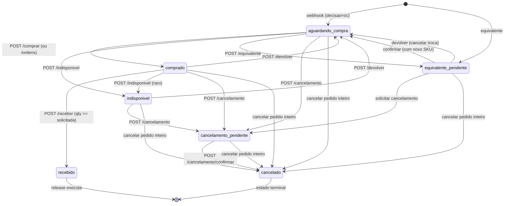
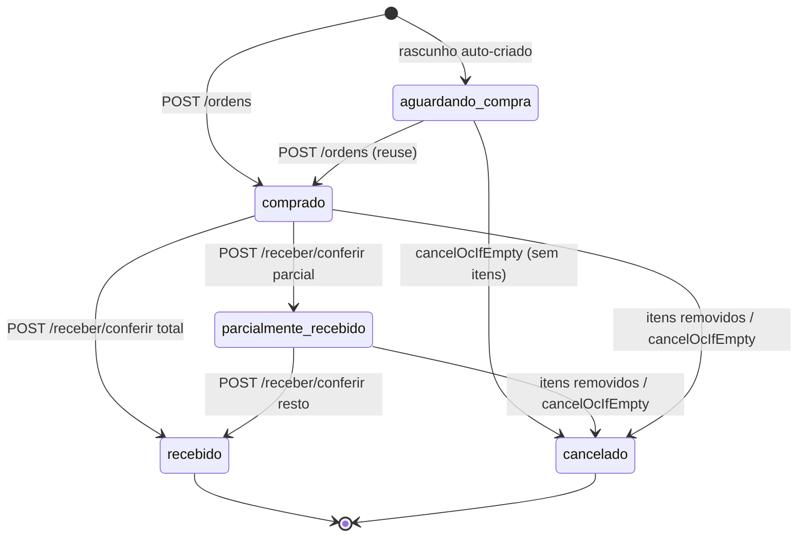
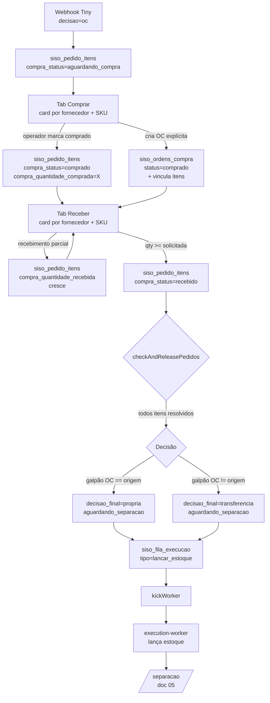
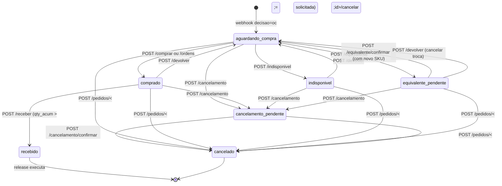
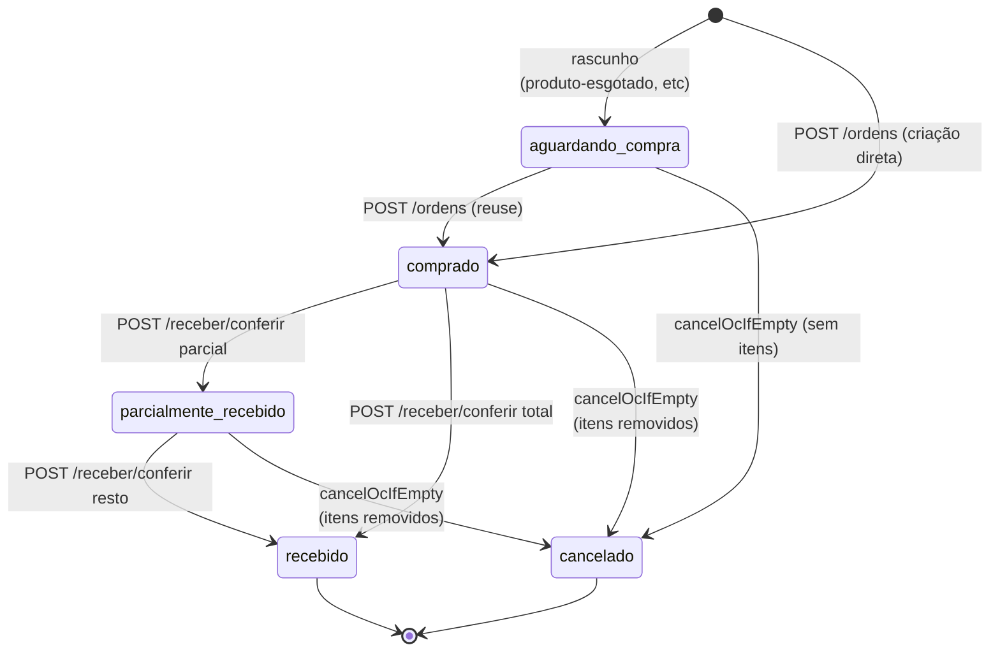
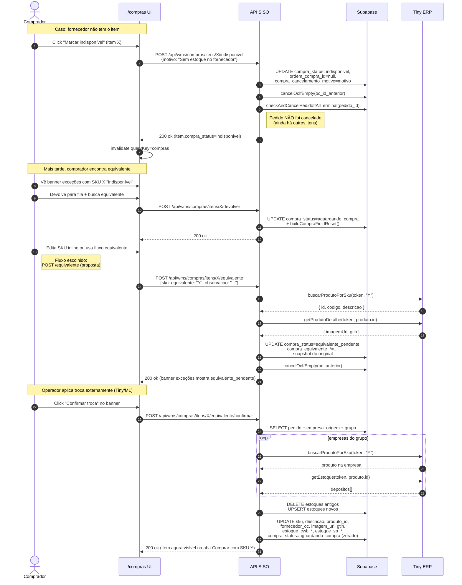
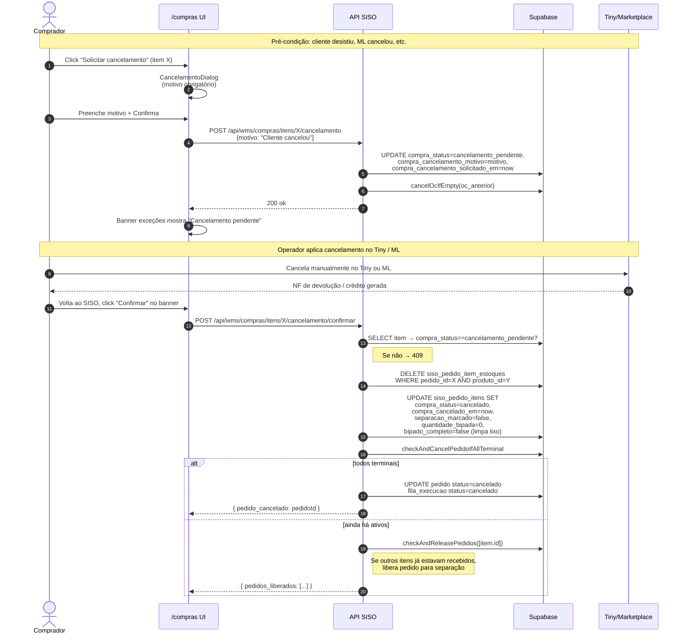

# 07 — Módulo de Compras v2

> Documento minucioso do módulo de **compras** do SISO. Cobre toda a UI (`/compras`), todas as rotas API (`/api/wms/compras/*`), as bibliotecas de domínio (`compras-release.ts`, `compras-equivalencia.ts`, `compras-embalagem.ts`, `compras-utils.ts`, `sku-fornecedor.ts`), os estados de itens e ordens de compra, exceções (indisponível / equivalente / cancelamento), troca de SKU, devolução, cancelamento de pedido inteiro, distribuição por aging, release de execução pós-recebimento e staging para embalagem direta.
>
> **Não cobre** a separação detalhada (doc [05](./05-separacao-wave-picking.md)) nem a embalagem/expedição (doc [06](./06-embalagem-expedicao-etiquetas.md)).

---

## Sumário

1. [Visão geral](#1-visão-geral)
2. [Mapeamento SKU → Fornecedor](#2-mapeamento-sku--fornecedor)
3. [Modelo de dados](#3-modelo-de-dados)
4. [Estados de item de compra](#4-estados-de-item-de-compra)
5. [Estados de OC](#5-estados-de-oc)
6. [Listagem unificada — `GET /api/wms/compras`](#6-listagem-unificada--get-apicompras)
7. [Tab "Comprar"](#7-tab-comprar)
8. [Tab "Aguardando recebimento" (Receber)](#8-tab-aguardando-recebimento-receber)
9. [Tab "Recebidos" (Histórico)](#9-tab-recebidos-histórico)
10. [Endpoint `/api/wms/compras/comprar` — marcar comprado por SKU](#10-endpoint-apicomprascomprar--marcar-comprado-por-sku)
11. [Endpoint `/api/wms/compras/receber` — receber por SKU](#11-endpoint-apicomprasreceber--receber-por-sku)
12. [Endpoint `/api/wms/compras/ordens` — criar OC explícita](#12-endpoint-apicomprasordens--criar-oc-explícita)
13. [Tela de conferência de OC `GET /api/wms/compras/conferencia/[id]`](#13-tela-de-conferência-de-oc-get-apicomprasconferenciaid)
14. [Endpoint deprecated `/api/wms/compras/conferir`](#14-endpoint-deprecated-apicomprasconferir)
15. [Exceção: Indisponível](#15-exceção-indisponível)
16. [Exceção: Equivalente (SKU alternativo)](#16-exceção-equivalente-sku-alternativo)
17. [Exceção: Cancelamento (item)](#17-exceção-cancelamento-item)
18. [Devolver item à fila](#18-devolver-item-à-fila)
19. [Trocar fornecedor (deprecated)](#19-trocar-fornecedor-deprecated)
20. [Cancelar pedido inteiro a partir de compras](#20-cancelar-pedido-inteiro-a-partir-de-compras)
21. [Trocar SKU (substituição direta)](#21-trocar-sku-substituição-direta)
22. [`compras-release.ts` — release pós-recebimento](#22-compras-releasets--release-pós-recebimento)
23. [`compras-equivalencia.ts` — sincronização do SKU equivalente](#23-compras-equivalenciats--sincronização-do-sku-equivalente)
24. [`compras-embalagem.ts` — staging para embalagem direta](#24-compras-embalagemts--staging-para-embalagem-direta)
25. [`compras-utils.ts` — utilitários transversais](#25-compras-utilsts--utilitários-transversais)
26. [Cargos permitidos](#26-cargos-permitidos)
27. [Distribuição por aging (FIFO)](#27-distribuição-por-aging-fifo)
28. [Diagramas Mermaid](#28-diagramas-mermaid)
29. [Side effects consolidados](#29-side-effects-consolidados)
30. [Erros conhecidos](#30-erros-conhecidos)
31. [Glossário](#31-glossário)

---

## 1. Visão geral

O módulo de compras resolve o caso em que **um pedido contém ao menos um item cuja decisão calculada foi `oc`** (purchase order — comprar do fornecedor). Diferente do fluxo `propria`/`transferencia`, esses itens não podem ser separados imediatamente: precisam ser comprados, recebidos no galpão correto, e só então o pedido é liberado para separação.

A v2 do módulo (em produção desde 2026-03-24) abandonou o modelo "OC implícita por filial + tela de conferência por OC" e adotou um modelo **consolidado por fornecedor + SKU**:

- A página `/compras` (arquivo: `src/app/compras/page.tsx`) tem **três abas**: `Comprar`, `Aguardando recebimento` e `Recebidos`.
- Cada aba renderiza **cards por fornecedor** com itens consolidados por SKU. Múltiplos pedidos diferentes que precisam do mesmo SKU aparecem agrupados em **uma única linha** com a quantidade somada e a lista dos pedidos blocados expandida abaixo.
- O comprador marca SKUs como comprados (em lote, multi-seleção com Shift-click) — o sistema **distribui** a quantidade comprada entre os pedidos pendentes seguindo a ordem do mais antigo (FIFO por `siso_pedidos.criado_em`).
- O recebimento segue a mesma lógica: distribui quantidade recebida por aging, suporta recebimento parcial, e ao completar todos os itens de compra de um pedido, dispara o **release** (transição `aguardando_compra` → `aguardando_nf` ou `aguardando_separacao` + insert na fila de execução).
- Exceções (item indisponível, troca por SKU equivalente, cancelamento externo do item) ficam num **banner de exceções** acima dos cards, exigindo confirmação manual do operador para sair do estado pendente.

A página é cliente puro (Next.js App Router `"use client"`) e usa TanStack React Query com `refetchInterval: 30_000` (60s para histórico). Cada mutação (`comprar`, `receber`, exceção) faz `queryClient.invalidateQueries(["compras"])`.

### Tabs e rota

| Tab UI | Param URL | Status do item carregado |
|---|---|---|
| Comprar | `?tab=comprar` (default) | `compra_status = 'aguardando_compra'` |
| Aguardando recebimento | `?tab=receber` | `compra_status = 'comprado'` |
| Recebidos | `?tab=historico` | `compra_status = 'recebido'`, paginação simples (limit 500) |

Aliases legados aceitos: `tab=pendentes` → `comprar`; `tab=recebidos` → `historico` (`src/app/api/wms/compras/route.ts:122-124`).

### Atores

- **`comprador`** — uso primário; marca itens como comprados, registra recebimento, lida com exceções.
- **`admin`** — superset; inclui ações de `comprador`. Também gerencia OCs e pode cancelar pedidos.
- **Demais cargos** (`operador_cwb`, `operador_sp`) — recebem 403 em todas as rotas via `hasComprasAccess()`.

---

## 2. Mapeamento SKU → Fornecedor

O fornecedor de uma linha de pedido é determinado **deterministicamente pelo prefixo do SKU**. A lógica está em `src/lib/sku-fornecedor.ts`. A função única exportada é `getFornecedorBySku(sku)` e retorna `{ fornecedor, filialOC }`. A propriedade `filialOC` é o **nome do galpão** sugerido para receber a OC (não o ID).

Tabela completa (sincronizada com `CLAUDE.md`):

| Prefixo | Fornecedor | Galpão (filialOC) |
|---|---|---|
| `19` | Diversos | CWB |
| `A1` | 141 | SP |
| `EW`, `TG` | Tiger | SP |
| `LD` | LDRU | SP |
| `L0` | LEFS | SP |
| `GB`, `GE`, `GS`, `GI` | GAUSS | CWB |
| `MK`, `M0`, `B0` | MRMK | SP |
| `CAK`, `CS` | Delphi | SP |
| `KT` | Kintop | SP |
| `MQ`, `APX`, `WDC`, `AT`, `FD`, `FI`, `GM`, `HO`, `HY`, `KI`, `MAN`, `MB`, `NI`, `PG`, `RN`, `SC`, `TO`, `UN`, `VO`, `VW`, `AG`, `BI`, `BA` | Multiqualita | CWB |
| 6 dígitos numéricos | ACA | CWB |
| (não bateu) | **Diversos** (CWB) | CWB |

### Regras importantes

- **Longest-prefix match.** Os prefixos são ordenados por tamanho decrescente e testados em sequência (`SORTED_PREFIXES`, `sku-fornecedor.ts:78`). Assim `MAN` (Multiqualita) bate antes de qualquer outra coisa que comece com `MA`. `CAK` bate antes de `CS`.
- **Case-insensitive.** O SKU é convertido para `toUpperCase()` antes de testar (`sku-fornecedor.ts:82`).
- **Default seguro.** Se nada bate e o SKU não é 6 dígitos puros, retorna `Diversos / CWB` (constante `DEFAULT`, `sku-fornecedor.ts:14`).
- **Galpão de OC vs galpão de origem.** O `filialOC` é o galpão *de recebimento físico* sugerido — onde o fornecedor entrega. Pode divergir do galpão de origem do pedido (que recebeu o pedido pela conta Tiny da empresa). Esse descasamento é o que decide entre `propria` e `transferencia` no release pós-OC (ver §22).
- **Onde é gravado.** O resultado de `getFornecedorBySku()` é gravado em `siso_pedido_itens.fornecedor_oc` durante o webhook (`webhook-processor.ts`) e regravado no fluxo `trocar-sku` quando o SKU é substituído (`src/app/api/wms/compras/trocar-sku/route.ts:189-192`).

---

## 3. Modelo de dados

Duas tabelas suportam todo o módulo:

### 3.1 `siso_pedido_itens` (extensão de compras)

Documentação geral em `docs/database-schema.md:109-193`. Colunas relevantes para este fluxo:

| Coluna | Tipo | Função |
|---|---|---|
| `id` | uuid PK | Identificador do item dentro do pedido |
| `pedido_id` | text FK → `siso_pedidos(id)` | Pedido pai |
| `produto_id` | bigint | Tiny product ID na empresa de origem |
| `produto_id_tiny` | bigint | Tiny product ID usado nas chamadas Tiny diretas (entrada/saída) |
| `produto_id_suporte` | bigint | Tiny product ID na empresa de suporte (cross-galpão) |
| `sku` | text | Código do produto (após troca de SKU, este campo reflete o novo SKU) |
| `descricao` | text | Descrição do produto |
| `imagem_url` | text | URL da imagem, exibida nos cards e na tela de conferência |
| `gtin` | text | Código de barras EAN |
| `quantidade_pedida` | integer | Quantidade originalmente vendida (imutável após criação) |
| `fornecedor_oc` | text | Nome do fornecedor (resultado de `getFornecedorBySku`). É o agrupador do card Comprar/Receber. |
| `ordem_compra_id` | uuid FK → `siso_ordens_compra(id)` | OC à qual o item pertence (pode ser null em `aguardando_compra`/`indisponivel`/`equivalente_pendente`/`cancelamento_pendente`/`cancelado`) |
| `compra_status` | text | Estado de compra do item — ver §4 |
| `compra_quantidade_solicitada` | integer NOT NULL DEFAULT 0 | Quantidade pedida ao fornecedor (definida no webhook quando vira OC) |
| `compra_quantidade_comprada` | integer | Quantidade efetivamente colocada no pedido ao fornecedor (pode diferir da solicitada se comprou mais para outros pedidos) |
| `compra_quantidade_recebida` | integer NOT NULL DEFAULT 0 | Quantidade recebida acumulada (suporta recebimento parcial) |
| `compra_solicitada_em` | timestamptz | Quando o item foi marcado como `aguardando_compra` (base para aging quando o pedido não tem `criado_em`) |
| `comprado_em` | timestamptz | Quando o operador marcou como `comprado` |
| `comprado_por` | uuid FK → `siso_usuarios(id)` | Quem marcou |
| `comprado_por_nome` | text | Denormalização do nome para UI |
| `recebido_em` | timestamptz | Quando completou o recebimento |
| `recebido_por` | uuid FK → `siso_usuarios(id)` | Quem confirmou |

#### Bloco de equivalente

Preenchidos quando o item entra em `equivalente_pendente`:

| Coluna | Função |
|---|---|
| `compra_equivalente_sku` | SKU sugerido como substituto |
| `compra_equivalente_descricao` | Descrição do equivalente (do Tiny) |
| `compra_equivalente_produto_id_tiny` | Tiny product ID do equivalente |
| `compra_equivalente_fornecedor` | Fornecedor do equivalente (default: `getFornecedorBySku(novo)`) |
| `compra_equivalente_imagem_url` | Imagem do equivalente |
| `compra_equivalente_gtin` | GTIN do equivalente |
| `compra_equivalente_observacao` | Justificativa do operador |
| `compra_equivalente_definido_em` | Timestamp |
| `compra_equivalente_definido_por` | Usuário |
| `compra_equivalente_sku_original` | Snapshot do SKU original (para reverter, auditoria) |
| `compra_equivalente_descricao_original` | Snapshot |
| `compra_equivalente_produto_id_original` | Snapshot |

#### Bloco de cancelamento

Preenchidos quando o item entra em `cancelamento_pendente` ou `cancelado`:

| Coluna | Função |
|---|---|
| `compra_cancelamento_motivo` | Motivo informado pelo operador (obrigatório no dialog) |
| `compra_cancelamento_solicitado_em` | Timestamp do `cancelamento_pendente` |
| `compra_cancelamento_solicitado_por` | Usuário que solicitou |
| `compra_cancelado_em` | Timestamp da confirmação (`cancelado`) |
| `compra_cancelado_por` | Usuário que confirmou |

### 3.2 `siso_ordens_compra`

Documentação em `docs/database-schema.md:449-481`.

| Coluna | Tipo | Função |
|---|---|---|
| `id` | uuid PK | OC ID |
| `fornecedor` | text | Nome do fornecedor (idêntico a `siso_pedido_itens.fornecedor_oc`) |
| `empresa_id` | uuid FK | Empresa de recebimento (a primeira ativa do galpão por `criado_em`) |
| `galpao_id` | uuid FK | Galpão físico que receberá os itens |
| `status` | text | Estado da OC — ver §5 |
| `observacao` | text | Texto livre opcional |
| `comprado_por` | uuid FK | Quem confirmou a compra |
| `comprado_em` | timestamptz | Quando |
| `created_at` | timestamptz | Insert original |

**Itens são vinculados via `siso_pedido_itens.ordem_compra_id`.** Não existe tabela `siso_ordem_compra_itens`.

### 3.3 `siso_pedidos` (campos relevantes)

| Campo | Função no fluxo de compras |
|---|---|
| `status` | `pendente` → `executando` → (`concluido` ou `cancelado`) |
| `status_separacao` | `aguardando_compra` enquanto há itens OC abertos; transita para `aguardando_nf` ou `aguardando_separacao` no release |
| `decisao_final` | Pode ser sobrescrita pelo release: `propria` ou `transferencia` dependendo do galpão da OC vs galpão de origem |
| `separacao_galpao_id` | Sobrescrito pelo galpão da OC quando há release cross-galpão |
| `compra_estoque_lancado_alerta` | Flag setada quando o pedido é cancelado mas já houve entrada física de estoque (atenção do estoquista) |

---

## 4. Estados de item de compra

Estados possíveis em `siso_pedido_itens.compra_status`:

| Status | Significado | Origem |
|---|---|---|
| `null` | Item sem fluxo de compras (decisão `propria` ou `transferencia`) | Default |
| `aguardando_compra` | Item está na fila para o comprador | Webhook ao detectar `oc` |
| `comprado` | Item foi marcado como comprado pelo operador, aguarda recebimento | `POST /api/wms/compras/comprar` ou `/api/wms/compras/ordens` |
| `recebido` | Quantidade recebida ≥ quantidade solicitada | `POST /api/wms/compras/receber` ou `/api/wms/compras/conferir` |
| `indisponivel` | Fornecedor não tem o item | `POST /api/wms/compras/itens/[id]/indisponivel` |
| `equivalente_pendente` | Operador propôs SKU equivalente, aguarda confirmação manual | `POST /api/wms/compras/itens/[id]/equivalente` |
| `cancelamento_pendente` | Operador solicitou cancelamento externo (Tiny/marketplace), aguarda confirmação | `POST /api/wms/compras/itens/[id]/cancelamento` |
| `cancelado` | Cancelamento confirmado externamente | `POST /api/wms/compras/itens/[id]/cancelamento/confirmar` ou via cancelamento do pedido inteiro |

### Constantes auxiliares (`compras-utils.ts`)

```ts
export const COMPRA_EXCEPTION_STATUSES = [
  "indisponivel",
  "equivalente_pendente",
  "cancelamento_pendente",
] as const;

const RESOLVED_RELEASE_STATUSES = new Set(["recebido", "cancelado"]);
const TERMINAL_COMPRA_STATUSES = new Set(["indisponivel", "cancelado"]);
```

- `COMPRA_EXCEPTION_STATUSES` — usado no contador de exceções e no banner.
- `isCompraResolvedForRelease(status)` — `true` se `recebido` ou `cancelado`. Critério de release pós-OC.
- `TERMINAL_COMPRA_STATUSES` — `indisponivel` ou `cancelado`. Se TODOS os itens do pedido caem aqui, o pedido inteiro é cancelado (`checkAndCancelPedidoIfAllTerminal`).

### Diagrama de transições (item)



### Tabela de transições

| De → Para | Endpoint | Side effects principais |
|---|---|---|
| `null` → `aguardando_compra` | webhook (`webhook-processor.ts`) | Define `fornecedor_oc`, `compra_quantidade_solicitada`, `compra_solicitada_em`. Pedido fica em `status_separacao=aguardando_compra`. |
| `aguardando_compra` → `comprado` | `POST /api/wms/compras/comprar` | Insere `comprado_em`, `comprado_por`, `comprado_por_nome`, `compra_quantidade_comprada`. **Não cria OC formal**. |
| `aguardando_compra` → `comprado` (com OC) | `POST /api/wms/compras/ordens` | Cria/atualiza `siso_ordens_compra`, popula `ordem_compra_id` no item. |
| `comprado` → `recebido` | `POST /api/wms/compras/receber` | Acumula `compra_quantidade_recebida`. Se ≥ solicitada → `recebido` + `recebido_em` + `recebido_por`. Chama `checkAndReleasePedidos`. |
| `recebido` → release | `compras-release.ts` | Pedido pai vai para `aguardando_nf` ou `aguardando_separacao` + insert na fila de execução. |
| `*` → `indisponivel` | `POST /api/wms/compras/itens/[id]/indisponivel` | Reset de campos de exceção, desvincula da OC, opcionalmente grava motivo. Recalcula status da OC. Pode cancelar pedido se todos itens forem terminais. |
| `*` → `equivalente_pendente` | `POST /api/wms/compras/itens/[id]/equivalente` | Lookup do SKU no Tiny da empresa de origem, salva snapshot do original, popula campos `compra_equivalente_*`. Bloqueia se já houve entrada de estoque. |
| `equivalente_pendente` → `aguardando_compra` | `POST /api/wms/compras/itens/[id]/equivalente/confirmar` | Aplica o equivalente (substitui `sku`/`descricao`/`produto_id`/imagem/gtin/estoques) e zera campos de exceção. |
| `*` → `cancelamento_pendente` | `POST /api/wms/compras/itens/[id]/cancelamento` | Marca cancelamento, opcionalmente com motivo. Recalcula OC. |
| `cancelamento_pendente` → `cancelado` | `POST /api/wms/compras/itens/[id]/cancelamento/confirmar` | Apaga linhas de estoque do item. Pode cancelar pedido se todos itens forem terminais; senão tenta release. |
| `*` → `aguardando_compra` (devolver) | `POST /api/wms/compras/itens/[id]/devolver` | Reset, volta o item para fila. Recalcula OC. |
| `comprado` → `aguardando_compra` (mudar fornecedor) | `POST /api/wms/compras/itens/[id]/trocar-fornecedor` (DEPRECATED) | Reset, troca `fornecedor_oc`. |

---

## 5. Estados de OC

Estados possíveis em `siso_ordens_compra.status`:

| Status | Significado |
|---|---|
| `aguardando_compra` | OC rascunho, ainda sem confirmação do comprador (auto-criada em fluxos como produto-esgotado) |
| `comprado` | Compra confirmada, aguardando entrega |
| `parcialmente_recebido` | Alguns itens recebidos, outros não |
| `recebido` | Todos os itens recebidos |
| `cancelado` | OC esvaziada (todos itens removidos) ou cancelada manualmente |

### Diagrama (OC)



### Recálculo automático: `cancelOcIfEmpty`

Localizado em `src/lib/compras-utils.ts:167-223`. **Apesar do nome, ele faz mais do que cancelar — recalcula o status da OC inteira.** Chamado após qualquer mutação que afete a vinculação `ordem_compra_id` (devolver, indisponível, equivalente, cancelamento, trocar-fornecedor, cancelar pedido).

Lógica:
1. Conta itens restantes vinculados àquela OC (`ordem_compra_id = oc_id`).
2. Se zero itens → status `cancelado`.
3. Se todos os restantes têm `compra_status = 'recebido'` → status `recebido`.
4. Se algum item tem `compra_quantidade_recebida > 0` (mas nem todos `recebido`) → status `parcialmente_recebido`.
5. Caso contrário → mantém o status atual (`return` sem update).

### Reuso de rascunho em `POST /ordens`

`src/app/api/wms/compras/ordens/route.ts:117-175` implementa lógica de reuso:
- Coleta `ordem_compra_id` distintos dos itens selecionados (filtra null).
- Filtra apenas OCs com `status='aguardando_compra'` (rascunhos auto-criados de fluxos como `produto-esgotado` da separação).
- Se exatamente **1 rascunho**: reutiliza, faz UPDATE para `status='comprado'`, popula `galpao_id`, `empresa_id`, `comprado_por`, `comprado_em`.
- Se **0 ou múltiplos rascunhos**: cria nova OC e depois **limpa rascunhos órfãos** (rascunhos que perderam todos os itens depois do bind ao novo OC).

---

## 6. Listagem unificada — `GET /api/wms/compras`

**Arquivo:** `src/app/api/wms/compras/route.ts:110-164`

**Auth:** `getSessionUser()` + `hasComprasAccess()` (admin ou comprador).

**Query params:**
- `tab` ∈ {`comprar` (default), `receber`, `historico`, `pendentes` (alias→comprar), `recebidos` (alias→historico)}.

**Resposta sempre inclui `counts`:**

```ts
{
  comprar: number,        // count where compra_status='aguardando_compra'
  receber: number,        // count where compra_status='comprado'
  excecoes: number,       // count where compra_status in EXCEPTION_STATUSES
  historico: number,      // count where compra_status='recebido'
  pedidos_bloqueados: number  // distinct pedido_id where compra_status in ('aguardando_compra','comprado')
}
```

`fetchCounts()` em `src/app/api/wms/compras/route.ts:168-203` faz 5 queries em paralelo (`Promise.all`).

### 6.1 `tab=comprar` — `fetchComprar()` (`route.ts:207-314`)

1. Busca `siso_pedido_itens` com `compra_status='aguardando_compra'`, joinando `siso_pedidos(numero, cliente_nome, criado_em)`.
2. Itera, agrupa por `fornecedor_oc` (ou "Sem fornecedor" se null).
3. Dentro de cada fornecedor, agrupa por `sku` consolidando `quantidade_necessaria += getCompraQuantidadeSolicitada(item)`.
4. Para cada SKU agrega a lista de `pedidos[]` (com `pedido_id`, `numero`, `cliente_nome`, `quantidade`, `aging_dias`, `item_id`).
5. Aging do SKU = `Math.max` de aging dos pedidos. Aging do fornecedor = max dos SKUs.
6. Resolve `galpao_sugerido_id` e `galpao_sugerido_nome` consultando `getFornecedorBySku(primeiro_sku).filialOC` e mapeando o nome para o ID via `siso_galpoes` (`loadGalpaoMap`).
7. Ordena fornecedores por `pedidos_bloqueados desc, aging_dias desc, fornecedor asc`.
8. Ordena SKUs do fornecedor por `aging_dias desc`.
9. Ordena pedidos do SKU por `aging_dias desc`.

Inclui também `excecoes[]` (ver §6.4).

### 6.2 `tab=receber` — `fetchReceber()` (`route.ts:318-466`)

Lê itens com `compra_status='comprado'`. Antes de processar, executa **auto-fix** de itens "presos":

```ts
// route.ts:330-360
for (const item of items) {
  const solicitada = compra_quantidade_solicitada || quantidade_pedida;
  const recebida   = compra_quantidade_recebida;
  if (recebida >= solicitada && solicitada > 0) {
    stuckIds.push(item.id);  // já cumprido mas ficou como 'comprado'
  }
}
if (stuckIds.length > 0) {
  await supabase.update({ compra_status: "recebido" }).in("id", stuckIds);
  checkAndReleasePedidos(stuckIds).catch(...);  // tenta liberar pedidos afetados
}
```

Esse auto-fix corrige drift causado por gravações antigas que não atualizaram `compra_status` corretamente. Os itens consertados são processados via `checkAndReleasePedidos` (fire-and-forget).

Depois do auto-fix, agrupamento por `fornecedor` → `sku` similar ao Comprar, mas com:
- `quantidade_comprada` (somatório de `compra_quantidade_comprada || compra_quantidade_solicitada`)
- `quantidade_recebida` (somatório de `compra_quantidade_recebida`)
- `quantidade_pendente = max(comprada - recebida, 0)` (calculado pós-loop)
- `comprado_em` (primeira data não-nula encontrada)

Aging baseado em `comprado_em` (não `criado_em` do pedido).

Ordenação: fornecedores por `aging_dias desc, fornecedor asc`.

### 6.3 `tab=historico` — `fetchHistorico()` (`route.ts:507-557`)

Lê itens com `compra_status='recebido'`, ordenado por `comprado_em desc`, limitado a 500 linhas.

Agrupa por chave `${fornecedor}||${data_recebimento_yyyy-mm-dd}`.

Cada grupo retorna:
```ts
{
  fornecedor: string,
  data_recebimento: "YYYY-MM-DD",  // truncado de comprado_em
  itens: [{ sku, descricao, quantidade_recebida, recebido_em }]
}
```

Ordenação: por `data_recebimento desc`.

### 6.4 Exceções — `fetchExcecoes()` (`route.ts:470-503`)

Acompanha o payload de `tab=comprar` (não tem aba dedicada).

Lê itens com `compra_status IN COMPRA_EXCEPTION_STATUSES` (`indisponivel`, `equivalente_pendente`, `cancelamento_pendente`), ordenado por `compra_solicitada_em asc` (mais antigos primeiro).

Cada exceção retorna:
```ts
{
  id, sku, descricao, imagem_url, compra_status,
  quantidade, aging_dias,
  fornecedor_oc, pedido_id, numero_pedido,
  compra_equivalente_sku, compra_equivalente_descricao,
  compra_equivalente_fornecedor, compra_equivalente_observacao,
  compra_cancelamento_motivo
}
```

### 6.5 Resposta consolidada

```jsonc
// tab=comprar
{
  "counts": { "comprar": 12, "receber": 5, "excecoes": 2, "historico": 87, "pedidos_bloqueados": 9 },
  "fornecedores": [
    {
      "fornecedor": "Tiger",
      "galpao_sugerido_id": "afd7097a-...",
      "galpao_sugerido_nome": "SP",
      "skus_count": 3,
      "pedidos_bloqueados": 5,
      "aging_dias": 4,
      "itens": [
        {
          "sku": "EW-12345",
          "descricao": "Filtro de óleo X",
          "imagem_url": "https://...",
          "quantidade_necessaria": 7,
          "aging_dias": 4,
          "pedidos": [
            { "pedido_id": "1234", "numero": "9876", "cliente_nome": "João", "quantidade": 2, "aging_dias": 4, "item_id": "uuid-..." },
            // ...
          ]
        }
      ]
    }
  ],
  "excecoes": [ /* ... */ ]
}
```

---

## 7. Tab "Comprar"

**Componente:** `src/components/compras/fornecedor-comprar-card.tsx`

### Layout

- **Header colapsável** com:
  - Nome do fornecedor.
  - Badge de galpão sugerido (`f.galpao_sugerido_nome`).
  - Contador `N SKUs`, `M pedidos bloqueados`.
  - Badge de aging (`agingBadgeClass` + `formatAging` em `src/components/compras/compras-helpers.ts`).
  - Borda esquerda colorida por aging (`agingColor`):
    - `< 1 dia` → emerald
    - `1-2 dias` → amber
    - `≥ 3 dias` → red
- **Body expandido** com:
  - Lista de itens (SKU consolidado).
  - Para cada item: checkbox, imagem (com `ProductImageZoom`), SKU + botão de edição inline, descrição, badges de quantidade necessária, lista compacta de pedidos blocados, `QtyInput`, `ItemContextMenu`.
  - Botão "Selecionar todos" / "Desmarcar todos" no header da seção (visível se há ≥2 itens).
- **Footer condicional** com botão `Marcar como comprado` (visível quando há ≥1 item selecionado).

### Interações

- **Multi-seleção com Shift-click** (`fornecedor-comprar-card.tsx:247-265`): clicar com Shift seleciona o intervalo do último checkbox clicado até o atual.
- **Edição inline de SKU**: clicar no ícone `Pencil` ao lado do SKU abre input que aceita Enter (confirma) / Esc (cancela). Confirmação dispara `POST /api/wms/compras/trocar-sku` (ver §21).
- **`QtyInput`** (`src/components/compras/qty-input.tsx`): permite ajustar a quantidade comprada (default = `quantidade_necessaria`). Útil quando o operador comprou mais ou menos do que precisava.
- **Context menu** (`ItemContextMenu` — `src/components/compras/item-context-menu.tsx`): botão `MoreHorizontal` abre menu com:
  - "Marcar indisponível" → abre `IndisponivelDialog`.
  - "Solicitar cancelamento" → abre `CancelamentoDialog`.
- **Marcar como comprado**: chama `POST /api/wms/compras/comprar` com `{ itens: [{ sku, quantidade_comprada }] }`. Após sucesso, `invalidate()` e fecha expandido.

### Banner de exceções (§15-17)

`src/components/compras/excecoes-banner.tsx`. Renderizado quando `excecoes.length > 0`. Agrupa por status (`cancelamento_pendente`, `equivalente_pendente`, `indisponivel`) e oferece ações inline:
- Confirmar cancelamento.
- Confirmar troca de SKU.
- Cancelar troca / devolver para fila.

---

## 8. Tab "Aguardando recebimento" (Receber)

**Componente:** `src/components/compras/fornecedor-receber-card.tsx`

### Layout

- Borda esquerda **azul fixa** (`border-l-sky-400`) — não usa color por aging neste card.
- Header colapsável com fornecedor + galpão sugerido + contador `N item(ns) pendente(s)` + aging baseado em `comprado_em`.
- Body expandido com itens consolidados por SKU, mostrando:
  - Imagem.
  - SKU + descrição.
  - Badges de progresso: `Comprado: X`, `Recebido: Y/X`, `Faltam: Z` (se pendente > 0).
  - Lista compacta de pedidos.
  - `QtyInput` com `min=0` e `max = max(quantidade_pendente, quantidade_comprada)`.

### Interações

- **Receber todos** / **Limpar todos**: botão de toggle no header da seção. Preenche todos os campos com `max(quantidade_pendente, quantidade_comprada)` ou zera.
- **Confirmar recebimento**: chama `POST /api/wms/compras/receber` com `{ itens: [{ sku, quantidade_recebida }] }` apenas para SKUs com qty > 0.

---

## 9. Tab "Recebidos" (Histórico)

Renderizada inline em `src/app/compras/page.tsx:230-277`. Não tem componente dedicado por simplicidade (só leitura).

- Para cada grupo `${fornecedor}||${data}`, mostra header com fornecedor + data formatada.
- Lista plana de itens com SKU, descrição e badge `quantidade_recebida un`.
- Refetch a cada 60s (mais lento que as outras tabs).

---

## 10. Endpoint `/api/wms/compras/comprar` — marcar comprado por SKU

**Arquivo:** `src/app/api/wms/compras/comprar/route.ts`

**Método:** POST.

**Auth:** apenas `admin` ou `comprador` (verificação inline mais restrita que `hasComprasAccess`):

```ts
if (!cargos.includes("admin") && !cargos.includes("comprador")) {
  return 403;
}
```

**Request body:**

```ts
{
  itens: Array<{ sku: string, quantidade_comprada: number }>
}
```

### Lógica

Para cada `{sku, quantidade_comprada}` no body:

1. Busca itens com `sku=X AND compra_status='aguardando_compra'`, joinando `siso_pedidos(criado_em)`.
2. Ordena ascending por `criado_em` (mais antigo primeiro = maior prioridade — **FIFO por aging**).
3. Distribui `quantidade_comprada` entre os itens:
   ```ts
   for item in sorted:
     qtyParaEsteItem = min(remaining, item.quantidade_solicitada)
     UPDATE siso_pedido_itens SET
       compra_status = 'comprado',
       compra_quantidade_comprada = qtyParaEsteItem,
       comprado_em = now,
       comprado_por = session.id,
       comprado_por_nome = session.nome
     WHERE id = item.id;
     remaining -= qtyParaEsteItem
     if remaining <= 0: break
   ```
4. Acumula `{sku, itens_marcados, quantidade_alocada, quantidade_excedente}` no array `resultados`.

### Response

```ts
{
  ok: true,
  resultados: Array<{
    sku: string,
    itens_marcados: number,
    quantidade_alocada: number,
    quantidade_excedente: number  // se vc digitou mais do que precisava
  }>
}
```

### Side effects

- 📝 `siso_pedido_itens` UPDATE (campos: `compra_status`, `compra_quantidade_comprada`, `comprado_em`, `comprado_por`, `comprado_por_nome`).
- 📝 `siso_logs` info `compras-comprar`.
- **Não cria** OC formal. Não popula `ordem_compra_id`.
- **Não chama Tiny** (só DB).

### Observação importante

Como esse endpoint **não cria OC formal**, os itens passam de `aguardando_compra` para `comprado` mas continuam com `ordem_compra_id = null` (ou com o rascunho que já tinham). O fluxo de **release** (§22) consulta `compra_items.ordem_compra_id` para resolver o galpão da OC. Se todos os itens de um pedido vieram via `/comprar` sem OC, o release NÃO consegue resolver o galpão da OC e o pedido não é liberado. Por isso o uso na prática é:
- `/api/wms/compras/comprar` — atalho rápido, mas requer que algum item da mesma OC tenha `ordem_compra_id` definido para o release funcionar.
- `/api/wms/compras/ordens` — fluxo completo que sempre cria/atualiza a OC.

---

## 11. Endpoint `/api/wms/compras/receber` — receber por SKU

**Arquivo:** `src/app/api/wms/compras/receber/route.ts`

**Método:** POST.

**Auth:** `hasComprasAccess` (admin ou comprador).

**Request body:**

```ts
{
  itens: Array<{
    sku: string,
    quantidade_recebida: number,
    observacao?: string  // grava em compra_equivalente_observacao (sic — campo reaproveitado)
  }>
}
```

### Lógica

Para cada `{sku, quantidade_recebida}`:

1. Busca itens com `sku=X AND compra_status='comprado'`, joinando `siso_pedidos(criado_em)`.
2. Ordena ascending por `criado_em` (FIFO).
3. Distribui `quantidade_recebida`:
   ```ts
   for item in sorted:
     solicitada = compra_quantidade_solicitada || quantidade_pedida
     jaRecebido = compra_quantidade_recebida
     faltante   = max(solicitada - jaRecebido, 0)
     if faltante <= 0: continue

     qtyParaEsteItem = min(remaining, faltante)
     novoRecebido    = jaRecebido + qtyParaEsteItem
     todosRecebidos  = novoRecebido >= solicitada

     UPDATE siso_pedido_itens SET
       compra_quantidade_recebida = novoRecebido,
       (todosRecebidos ? compra_status = 'recebido' : (mantém 'comprado'))
     WHERE id = item.id;

     allAffectedItemIds.push(item.id)
     remaining -= qtyParaEsteItem
     if remaining <= 0: break
   ```
4. Após loop: `pedidosDesbloqueados = await checkAndReleasePedidos(allAffectedItemIds)`.

### Response

```ts
{
  ok: true,
  recebimento: Array<{ sku, itens_atualizados, quantidade_alocada }>,
  pedidos_desbloqueados: string[]  // pedidos que foram liberados pelo release
}
```

### Side effects

- 📝 `siso_pedido_itens` UPDATE (`compra_quantidade_recebida`, possivelmente `compra_status='recebido'`).
- 📝 `compra_equivalente_observacao` recebe `observacao` se enviada (campo reaproveitado).
- 📝 Via `checkAndReleasePedidos`:
  - 📝 `siso_pedidos.status='executando'`, `status_separacao='aguardando_nf'` ou `'aguardando_separacao'`.
  - 📝 `siso_pedidos.decisao_final` recalculada (`propria` ou `transferencia`).
  - 📝 `siso_pedidos.separacao_galpao_id` sobrescrito pelo galpão da OC.
  - 📝 INSERT em `siso_fila_execucao` com `tipo='lancar_estoque'`.
  - ⚡ `kickWorker()` (fire-and-forget) para processar a fila.
- 📝 Via `cancelOcIfEmpty` (não chamado neste endpoint, mas o `comprado→recebido` pode disparar `OC=recebido` via outras vias).
- 📝 `siso_logs` info `compras-receber`.

### Importante

- **Não chama Tiny** para entrada de estoque. Diferente do `/api/wms/compras/conferir` (deprecated, §14) que chamava `movimentarEstoque` tipo `E` e fazia rollback se Tiny falhasse. Aqui o estoque é apenas atualizado em `siso_pedido_itens` e a entrada formal no Tiny acontece **depois** via worker (`execution-worker.ts`).
- Suporta **recebimento parcial** (qty < solicitada). O item permanece em `comprado` até qty acumulada >= solicitada.
- Não há cap explícito por SKU global — o cap é por item via `min(remaining, faltante)`.

---

## 12. Endpoint `/api/wms/compras/ordens` — criar OC explícita

**Arquivo:** `src/app/api/wms/compras/ordens/route.ts`

**Método:** POST.

**Auth:** `hasComprasAccess`.

**Request body:**

```ts
{
  fornecedor: string,           // obrigatório
  galpao_id: string,            // obrigatório (UUID do galpão de recebimento)
  empresa_id?: string,          // legacy, ignorado
  observacao?: string,
  item_ids?: string[]           // se omitido: todos os itens 'aguardando_compra' do fornecedor
}
```

### Lógica

1. Valida `fornecedor` e `galpao_id`.
2. Resolve `empresaId` = primeira empresa ativa do galpão (`siso_empresas` ordenado por `criado_em asc`, limit 1). Determinístico.
3. Busca itens `aguardando_compra` para o fornecedor:
   - Se `item_ids` foi enviado, filtra `id IN item_ids`.
   - Caso contrário, pega TODOS.
4. Coleta `ordem_compra_id` distintos não-null dos itens encontrados.
5. Filtra rascunhos: OCs com `status='aguardando_compra'` entre as encontradas.
6. **Se exatamente 1 rascunho** → reutiliza:
   ```sql
   UPDATE siso_ordens_compra SET
     status='comprado',
     galpao_id=?, empresa_id=?,
     observacao=?, comprado_por=?, comprado_em=now
   WHERE id = existingOcId;
   ```
7. **Senão** → cria nova OC:
   ```sql
   INSERT INTO siso_ordens_compra (fornecedor, galpao_id, empresa_id, status='comprado', ...)
   ```
8. Vincula todos os itens: `UPDATE siso_pedido_itens SET ordem_compra_id=?, compra_status='comprado', comprado_em=now, comprado_por=? WHERE id IN (allItemIds)`.
9. Limpa rascunhos órfãos (sem itens) — pode haver múltiplos se o pedido veio de fluxos `produto-esgotado` que dispersaram itens.

### Response

```ts
{
  ok: true,
  ordem_compra: { id, fornecedor, galpao_id, empresa_id, status, observacao, comprado_por, comprado_em, created_at },
  itens_vinculados: number,
  quantidade_total: number  // soma de getCompraQuantidadeSolicitada
}
```

### Casos especiais

- Se `item_ids.length > 0` e nem todos foram retornados (ex: alguns já passaram para outro status), retorna **409 Conflict**: "Alguns itens selecionados nao estao mais aguardando compra para este fornecedor".
- Se nenhum item bate, retorna **400 Bad Request**.

### Side effects

- 📝 `siso_ordens_compra` INSERT ou UPDATE.
- 📝 `siso_pedido_itens` UPDATE (`ordem_compra_id`, `compra_status`, `comprado_em`, `comprado_por`).
- 📝 Possível DELETE de OCs órfãs.
- 📝 `siso_logs` info `compras-ordens`.

---

## 13. Tela de conferência de OC `GET /api/wms/compras/conferencia/[id]`

**Arquivo:** `src/app/api/wms/compras/conferencia/[ordemCompraId]/route.ts`

> **Status:** Endpoint preservado por compatibilidade. A página correspondente `src/app/compras/conferencia/[ordemCompraId]/page.tsx` **não existe mais** na v2 — o uso atual é apenas via integração específica ou para visualização debug. O fluxo de recebimento principal usa `POST /api/wms/compras/receber` agrupado por SKU.

**Método:** GET.

**Auth:** `hasComprasAccess`.

### Resposta

```ts
{
  ordem_compra: {
    id, fornecedor, galpao_id, galpao_nome, status, observacao,
    comprado_por_nome, comprado_em, created_at
  },
  itens: ConferenciaItem[]
}
```

Onde `ConferenciaItem` (definido em `src/types/index.ts`):
```ts
{
  item_id: string,
  sku: string, descricao: string, imagem: string|null,
  quantidade_esperada: number,
  quantidade_ja_recebida: number,
  quantidade_restante: number,
  produto_id_tiny: number|null,
  pedidos: Array<{ pedido_id: string, numero_pedido: string, quantidade: number }>
}
```

### Filtros aplicados

- `ordem_compra_id = X`.
- `compra_status = 'comprado'` (itens já recebidos não aparecem).

---

## 14. Endpoint deprecated `/api/wms/compras/conferir`

**Arquivo:** `src/app/api/wms/compras/conferir/route.ts`

> **Status:** DEPRECATED. Mantido para compatibilidade com integrações antigas. **Substituído por `POST /api/wms/compras/receber`** que é mais simples (agrupa por SKU em vez de OC) e não faz a chamada Tiny diretamente.

### Diferença chave entre os dois fluxos

| | `/api/wms/compras/conferir` (deprecated) | `/api/wms/compras/receber` (atual) |
|---|---|---|
| Granularidade | Por OC + lista de `item_id` | Por SKU global (sem OC) |
| Chama Tiny? | Sim, `movimentarEstoque` tipo `E` | Não — entrada feita pelo worker depois |
| Optimistic lock? | Sim, via WHERE `compra_quantidade_recebida = previo` | Não |
| Rollback? | Sim, se Tiny falhar reverte UPDATE | N/A |
| Recalcula status OC? | Sim, no fim | N/A (não tem OC) |
| Atualiza estoque snapshot? | Sim, `siso_pedido_item_estoques` | Não |
| Sleep entre Tiny? | 500ms | N/A |
| Trigger release? | Sim, `checkAndReleasePedidos` | Sim |

### Lógica do `/conferir`

Ver `src/app/api/wms/compras/conferir/route.ts:40-344`. Resumo:

1. Busca OC + galpão + empresa de recebimento (primeira ativa do galpão).
2. Pega `deposito_id` da `siso_tiny_connections` da empresa.
3. Pega token Tiny via `getValidTokenByEmpresa`.
4. Para cada item:
   - **DB FIRST** com optimistic lock: UPDATE `compra_quantidade_recebida` WHERE valor antigo bate.
   - Se conflito → log warn + skip.
   - **Tiny depois**: chama `movimentarEstoque(token, produto_id_tiny, { tipo: 'E', quantidade, deposito, observacoes })`.
   - Se Tiny falha → rollback DB (volta o valor recebido + status `comprado`).
   - Atualiza snapshot em `siso_pedido_item_estoques` com `saldo=novaQtdRecebida` no empresa de recebimento.
   - Sleep 500ms (não no último).
5. Recalcula status da OC (`recebido`/`parcialmente_recebido`).
6. `checkAndReleasePedidos(processedItemIds)`.

### Response

```ts
{
  processados: number,
  erros: number,
  erros_detalhe: string[],
  itens_sem_produto_id: number,
  pedidos_liberados: string[]
}
```

---

## 15. Exceção: Indisponível

**Arquivo:** `src/app/api/wms/compras/itens/[itemId]/indisponivel/route.ts`

**Método:** POST.

**Body:** `{ motivo?: string }`

### Lógica

1. Busca item.
2. UPDATE em `siso_pedido_itens`:
   ```ts
   {
     ...buildCompraFieldReset(),  // zera campos de equivalente, cancelamento
     compra_status: "indisponivel",
     ordem_compra_id: null,
     compra_solicitada_em: prev || now,
     ...(motivo ? { compra_cancelamento_motivo: motivo } : {})  // (sic — reaproveitado)
   }
   ```
3. `cancelOcIfEmpty(supabase, ordemCompraIdAnterior)` — recalcula status da OC anterior.
4. `checkAndCancelPedidoIfAllTerminal(supabase, item.pedido_id)` — se TODOS os itens do pedido estão em estados terminais (`indisponivel` ou `cancelado`), cancela o pedido inteiro.

### Response

```ts
{
  ok: true,
  item: { id, sku, descricao, fornecedor_oc, compra_status, pedido_id },
  pedido_cancelado: pedidoId | null
}
```

### UI

Dialog `IndisponivelDialog` (`src/components/compras/indisponivel-dialog.tsx`):
- Confirma SKU + fornecedor.
- Textarea opcional para motivo.
- Botão vermelho "Confirmar".
- Itera por `itemIds[]` (caso o operador tenha selecionado múltiplos pedidos do mesmo SKU).
- Toast warning se `pedido_cancelado` retornado.

### Side effects consolidados

- 📝 `siso_pedido_itens` UPDATE (status, reset de campos, motivo).
- 📝 `siso_ordens_compra` UPDATE (status recalculado pelo `cancelOcIfEmpty`).
- 📝 Possível UPDATE de `siso_pedidos.status='cancelado'` se todos os itens forem terminais.
- 📝 Possível UPDATE de `siso_fila_execucao` para `cancelado`.
- 📝 `siso_logs` warn `compras-indisponivel`.

---

## 16. Exceção: Equivalente (SKU alternativo)

Fluxo de duas etapas:
1. **Propor:** `POST /api/wms/compras/itens/[id]/equivalente` → status `equivalente_pendente`.
2. **Confirmar:** `POST /api/wms/compras/itens/[id]/equivalente/confirmar` → aplica troca, status volta para `aguardando_compra`.

### 16.1 Propor — `POST /api/wms/compras/itens/[itemId]/equivalente`

**Arquivo:** `src/app/api/wms/compras/itens/[itemId]/equivalente/route.ts`

**Body:**
```ts
{
  sku_equivalente: string,           // obrigatório
  fornecedor_equivalente?: string,   // opcional, default = getFornecedorBySku(novo).fornecedor
  observacao?: string
}
```

### Lógica

1. Busca item, valida que `compra_quantidade_recebida === 0` (senão **409**: "Não é possível trocar por equivalente após entrada de estoque").
2. Busca pedido para obter `empresa_origem_id`.
3. Pega token Tiny da empresa de origem.
4. **Lookup Tiny:** `buscarProdutoPorSku(token, sku_equivalente)`. Se nulo → **404**.
5. Busca detalhe: `getProdutoDetalhe(token, produto.id)` — pega imagem, GTIN.
6. UPDATE em `siso_pedido_itens`:
   ```ts
   {
     compra_status: "equivalente_pendente",
     ordem_compra_id: null,
     comprado_em: null, comprado_por: null,
     recebido_em: null, recebido_por: null,
     compra_quantidade_recebida: 0,
     // novo equivalente
     compra_equivalente_sku: produto.codigo,
     compra_equivalente_descricao: produto.descricao,
     compra_equivalente_produto_id_tiny: produto.id,
     compra_equivalente_fornecedor: fornecedor,
     compra_equivalente_imagem_url: detalhe.imagemUrl,
     compra_equivalente_gtin: detalhe.gtin,
     compra_equivalente_observacao: observacao,
     compra_equivalente_definido_em: now,
     compra_equivalente_definido_por: usuario_id,
     // snapshot do original (para reverter)
     compra_equivalente_sku_original: item.sku,
     compra_equivalente_descricao_original: item.descricao,
     compra_equivalente_produto_id_original: item.produto_id,
     // limpa cancelamento se houver
     compra_cancelamento_motivo: null,
     compra_cancelamento_solicitado_em: null,
     compra_cancelamento_solicitado_por: null,
     compra_cancelado_em: null, compra_cancelado_por: null,
   }
   ```
7. `cancelOcIfEmpty(supabase, ordemCompraIdAnterior)`.

### 16.2 Confirmar — `POST /api/wms/compras/itens/[itemId]/equivalente/confirmar`

**Arquivo:** `src/app/api/wms/compras/itens/[itemId]/equivalente/confirmar/route.ts`

Confirma que **a troca já foi aplicada externamente** (no Tiny/marketplace), e sincroniza o item local com o equivalente. Esse é o passo onde a troca de SKU se materializa nos campos principais.

### Lógica

1. Valida `compra_status === 'equivalente_pendente'` e `compra_equivalente_sku != null`.
2. Busca pedido + empresa origem + galpão origem.
3. **Carrega dados completos do equivalente:**
   ```ts
   const equivalente = await carregarDadosEquivalentePorSku({
     empresaOrigemId, grupoId, galpaoOrigemId, galpaoOrigemNome, sku: compra_equivalente_sku,
   });
   ```
   Função em `src/lib/compras-equivalencia.ts` (§23) — consulta Tiny em todas as empresas do grupo, agrega estoques.
4. **Detecção de duplicata:** se já existe outro item no mesmo pedido com `produto_id = equivalente.produtoIdOrigem` (não o item atual), retorna **409**: "O pedido já possui outro item com este SKU equivalente. A fusão de itens ainda não é suportada automaticamente."
5. DELETE linhas antigas em `siso_pedido_item_estoques` para `(pedido_id, produto_id_anterior)`.
6. UPSERT linhas novas em `siso_pedido_item_estoques` com os estoques agregados do equivalente.
7. UPDATE em `siso_pedido_itens` substituindo todos os campos de produto + colunas legadas (`estoque_cwb_*`, `estoque_sp_*`, `cwb_atende`, `sp_atende`, `localizacao_*`):
   ```ts
   {
     produto_id: equivalente.produtoIdOrigem,
     produto_id_suporte: equivalente.produtoIdSuporte,
     produto_id_tiny: equivalente.produtoIdOrigem,
     sku: equivalente.sku,
     descricao: equivalente.descricao,
     fornecedor_oc: compra_equivalente_fornecedor || equivalente.fornecedor,
     imagem_url: equivalente.imagemUrl,
     gtin: equivalente.gtin,
     // legacy columns
     estoque_cwb_*, estoque_sp_*, cwb_atende, sp_atende, localizacao_*,
     // back to aguardando
     compra_status: "aguardando_compra",
     ordem_compra_id: null,
     compra_quantidade_solicitada: quantidadeNecessariaCompra,
     compra_solicitada_em: prev || now,
     comprado_em: null, comprado_por: null,
     recebido_em: null, recebido_por: null,
     compra_quantidade_recebida: 0,
     compra_cancelamento_motivo: null,
     // ... resto dos campos de cancelamento zerados
   }
   ```

### UI

- **Dialog** `EquivalenteDialog` (`src/components/compras/equivalente-dialog.tsx`): SKU original (read-only), input para SKU equivalente (autoFocus, uppercase), textarea para observação, botão amber "Registrar troca".
- **Banner de exceções** mostra equivalentes pendentes com ações:
  - "Confirmar troca" → `POST /equivalente/confirmar`.
  - "Cancelar troca" → `POST /devolver` (volta para `aguardando_compra` com SKU original — porque os campos `compra_equivalente_*` ainda não foram aplicados, o `devolver` só limpa o estado pendente).

### Side effects consolidados

- 📡 Tiny: `buscarProdutoPorSku` + `getProdutoDetalhe` (na empresa de origem).
- 📡 Tiny no confirmar: chamadas em **todas as empresas do grupo** via `carregarDadosEquivalentePorSku`.
- 📝 `siso_pedido_itens` UPDATE.
- 📝 `siso_pedido_item_estoques` DELETE + UPSERT.
- 📝 `siso_ordens_compra` UPDATE indireto via `cancelOcIfEmpty`.

---

## 17. Exceção: Cancelamento (item)

Fluxo de duas etapas:
1. **Solicitar:** `POST /api/wms/compras/itens/[id]/cancelamento` → status `cancelamento_pendente`.
2. **Confirmar:** `POST /api/wms/compras/itens/[id]/cancelamento/confirmar` → status `cancelado`.

### 17.1 Solicitar — `POST /api/wms/compras/itens/[itemId]/cancelamento`

**Arquivo:** `src/app/api/wms/compras/itens/[itemId]/cancelamento/route.ts`

**Body:** `{ motivo?: string }` (UI exige obrigatório, mas a API aceita null).

### Lógica

1. Busca item.
2. UPDATE:
   ```ts
   {
     ...buildCompraFieldReset(),
     compra_status: "cancelamento_pendente",
     ordem_compra_id: null,
     compra_cancelamento_motivo: motivo,
     compra_cancelamento_solicitado_em: now,
     compra_cancelamento_solicitado_por: usuario_id,
   }
   ```
3. `cancelOcIfEmpty(supabase, ordemCompraIdAnterior)`.

### 17.2 Confirmar — `POST /api/wms/compras/itens/[itemId]/cancelamento/confirmar`

**Arquivo:** `src/app/api/wms/compras/itens/[itemId]/cancelamento/confirmar/route.ts`

Confirma que o item **já foi cancelado externamente** (no Tiny/marketplace) e remove do fluxo.

### Lógica

1. Busca item.
2. Valida `compra_status === 'cancelamento_pendente'`. Se não, **409**.
3. **DELETE** linhas em `siso_pedido_item_estoques` para `(pedido_id, produto_id)`.
4. UPDATE:
   ```ts
   {
     compra_status: "cancelado",
     ordem_compra_id: null,
     compra_cancelado_em: now,
     compra_cancelado_por: session.id,
     // limpa qualquer estado de bipagem residual da separação
     separacao_marcado: false,
     separacao_marcado_em: null,
     quantidade_bipada: 0,
     bipado_completo: false,
     bipado_em: null, bipado_por: null,
   }
   ```
5. `checkAndCancelPedidoIfAllTerminal` — se todos itens do pedido são terminais, cancela pedido.
6. Se pedido não foi cancelado: `checkAndReleasePedidos([itemId])` — pode ser que o cancelamento desse item destrave outros itens já recebidos.

### Response

```ts
{
  ok: true,
  item: { id, sku, descricao, compra_status, compra_cancelamento_motivo },
  pedido_cancelado: pedidoId | null,
  pedidos_liberados: string[]
}
```

### UI

- **Dialog** `CancelamentoDialog` (`src/components/compras/cancelamento-dialog.tsx`): mensagem informativa ("Solicitar cancelamento externo do item X. O cancelamento deve ser feito no Tiny/marketplace antes de confirmar aqui."), textarea **obrigatória** para motivo, botão vermelho "Solicitar cancelamento".
- **Banner de exceções** mostra cancelamentos pendentes com ação "Confirmar".

---

## 18. Devolver item à fila

**Arquivo:** `src/app/api/wms/compras/itens/[itemId]/devolver/route.ts`

**Método:** POST.

**Sem body.**

Volta o item para `aguardando_compra` desfazendo:
- vinculação a OC (`ordem_compra_id = null`),
- timestamps de compra (`comprado_em`, `comprado_por`),
- campos de exceção via `buildCompraFieldReset()` (zera todos os equivalentes/cancelamentos).

### Lógica

1. Busca item.
2. UPDATE:
   ```ts
   {
     ...buildCompraFieldReset(),
     compra_status: "aguardando_compra",
     ordem_compra_id: null,
     comprado_em: null,
     comprado_por: null,
     compra_solicitada_em: prev || now,
   }
   ```
3. `cancelOcIfEmpty(supabase, ordemCompraIdAnterior)`.

### Casos de uso

- "Cancelar troca" no banner de equivalentes — desfaz o `equivalente_pendente`.
- "Devolver para fila" no banner de indisponíveis — pede para tentar de novo.
- Operador desistiu de comprar e quer devolver o item para o card.

### Response

```ts
{
  ok: true,
  item: { id, sku, descricao, fornecedor_oc, compra_status }
}
```

---

## 19. Trocar fornecedor (deprecated)

**Arquivo:** `src/app/api/wms/compras/itens/[itemId]/trocar-fornecedor/route.ts`

> **Status:** DEPRECATED. Substituído pelo fluxo de equivalente + trocar-sku. Mantido para compatibilidade com chamadas legadas.

**Body:**
```ts
{
  novo_fornecedor: string,            // obrigatório
  nova_ordem_compra_id?: string       // se fornecido, vincula a OC existente
}
```

### Lógica

1. Busca item.
2. UPDATE:
   ```ts
   {
     ...buildCompraFieldReset(),
     fornecedor_oc: novo_fornecedor,
     ...(nova_ordem_compra_id
       ? {
           ordem_compra_id: nova_ordem_compra_id,
           compra_status: "comprado",
           comprado_em: now,
         }
       : {
           ordem_compra_id: null,
           compra_status: "aguardando_compra",
           comprado_em: null,
           comprado_por: null,
           compra_solicitada_em: prev || now,
         }),
   }
   ```
3. Se OC anterior existia e é diferente da nova: `cancelOcIfEmpty(supabase, ordemCompraIdAnterior)`.

### Por que deprecated

- Mudar `fornecedor_oc` sem mudar o SKU não reflete a realidade — o SKU é a fonte da verdade do fornecedor (via `getFornecedorBySku`). Se o operador precisa mudar de fornecedor, tipicamente o SKU também muda → use `trocar-sku` ou `equivalente`.

---

## 20. Cancelar pedido inteiro a partir de compras

**Arquivo:** `src/app/api/wms/compras/pedidos/[pedidoId]/cancelar/route.ts`

**Método:** POST.

**Sem body.**

Cancela o pedido inteiro: marca todos os itens como `cancelado`, cancela OCs órfãs, cancela jobs pendentes na fila, e — **se o pedido ainda não estava cancelado no Tiny** — chama `atualizarStatusPedido` com `cancelado` na empresa de origem.

### Lógica

1. Busca pedido (`empresa_origem_id`, `status`, `status_separacao`).
2. Se `status !== 'cancelado'`:
   - Pega token Tiny via `getValidTokenByEmpresa(empresa_origem_id)`.
   - Chama `atualizarStatusPedido(token, pedidoId, 'cancelado')` via `runWithEmpresa` (rate limiting).
3. Busca itens com `compra_status` não-null (todos os com fluxo de compra).
4. Coleta `ordem_compra_id` distintos não-null → `affectedOcIds`.
5. Calcula `hadStockEntrada` (algum item com `compra_quantidade_recebida > 0`).
6. UPDATE em `siso_pedido_itens`:
   ```sql
   UPDATE SET compra_status='cancelado', ordem_compra_id=null
   WHERE pedido_id=? AND compra_status IS NOT NULL;
   ```
7. Para cada OC afetada: `cancelOcIfEmpty` (recalcula status).
8. UPDATE em `siso_pedidos`:
   ```ts
   {
     status: "cancelado",
     status_separacao: null,
     processado_em: now,
     compra_estoque_lancado_alerta: hadStockEntrada || undefined,
   }
   ```
9. UPDATE jobs pendentes em `siso_fila_execucao` para `cancelado`.

### Response

```ts
{
  ok: true,
  pedido_id: string,
  estoque_lancado_alerta: boolean   // true se houve entrada física
}
```

### Observação importante

`compra_estoque_lancado_alerta=true` sinaliza que **já houve entrada física** no Tiny pela rota antiga `/conferir`, então cancelar o pedido **não desfaz a entrada de estoque**. O estoquista precisa fazer ajuste manual ou inventário para corrigir. Este alerta aparece em telas de monitoramento.

### Side effects

- 📡 Tiny: `atualizarStatusPedido` (se não estava cancelado).
- 📝 `siso_pedido_itens` UPDATE em massa.
- 📝 `siso_ordens_compra` UPDATE indireto via `cancelOcIfEmpty` em loop.
- 📝 `siso_pedidos` UPDATE.
- 📝 `siso_fila_execucao` UPDATE.
- 📝 `siso_logs` warn `compras-cancelar-pedido`.

---

## 21. Trocar SKU (substituição direta)

**Arquivo:** `src/app/api/wms/compras/trocar-sku/route.ts`

**Método:** POST.

**Auth:** `hasComprasAccess`.

**Body:**
```ts
{
  item_ids: string[],   // siso_pedido_itens IDs
  novo_sku: string,
}
```

Diferente do **equivalente** (que é uma proposta com confirmação manual e exige que a troca seja feita externamente), o `trocar-sku` é uma **substituição direta e imediata** — usado quando o comprador descobre que digitou o SKU errado, ou quando o produto precisa ser trocado mas o operador quer aplicar localmente sem passar pelo workflow de equivalência.

### Lógica

1. Busca itens, joinando `siso_pedidos(empresa_origem_id)`.
2. Pega `empresa_origem_id` do primeiro item.
3. Resolve `novoFornecedor = getFornecedorBySku(novo_sku)`.
4. Resolve grupo da empresa, lista todas empresas do grupo.
5. Busca conexões Tiny ativas → mapa `empresa_id → deposito_id`.
6. **Para cada empresa do grupo:**
   - Pega token.
   - `buscarProdutoPorSku(token, novo_sku)`. Se null → próxima.
   - Se primeira que achou: pega descrição, `produtoId`, e tenta `getProdutoDetalhe` para imagem.
   - `getEstoque(token, produto.id)`.
   - Pega depósito configurado (ou primeiro).
   - Para cada `pedido_id` distinto, adiciona linha em `novosEstoques`.
7. Se não achou produto em nenhuma empresa → **404**: "SKU `X` não encontrado em nenhuma empresa do grupo".
8. UPDATE em `siso_pedido_itens`:
   ```ts
   {
     sku: novo_sku,
     descricao: novaDescricao,
     imagem_url: novaImagem,
     produto_id: novoProdutoId,
     fornecedor_oc: novoFornecedor.fornecedor
   }
   ```
9. **DELETE** linhas antigas em `siso_pedido_item_estoques` para `(pedido_id, produto_id_antigo)` (loop por `pedidoIds`).
10. **UPSERT** linhas novas em `siso_pedido_item_estoques`.

### Response

```ts
{
  ok: true,
  novo_sku: string,
  novo_fornecedor: string,
  descricao: string
}
```

### Diferença vs equivalente

| | `trocar-sku` | `equivalente` |
|---|---|---|
| Estado intermediário? | Não — troca direta | Sim — `equivalente_pendente` até confirmar |
| Bloqueia se já recebeu? | Não | Sim (409 se `compra_quantidade_recebida > 0`) |
| Snapshot do original? | Não | Sim (`compra_equivalente_*_original`) |
| Reset de status? | Não — mantém `compra_status` | Sim — volta para `aguardando_compra` |
| Quando usar | Comprador errou SKU; troca administrativa simples | Item indisponível mas tem produto similar; processo formal |

### UI

Edição inline no `FornecedorComprarCard` (ícone `Pencil` ao lado do SKU). Componentes adicionais: feedback toast com `SKU original → novo`.

### Side effects

- 📡 Tiny: `buscarProdutoPorSku` + `getProdutoDetalhe` + `getEstoque` em **cada empresa do grupo**.
- 📝 `siso_pedido_itens` UPDATE.
- 📝 `siso_pedido_item_estoques` DELETE + UPSERT.
- 📝 `siso_logs` info `compras-trocar-sku`.

---

## 22. `compras-release.ts` — release pós-recebimento

**Arquivo:** `src/lib/compras-release.ts`

Função pública: `checkAndReleasePedidos(itemIds: string[]): Promise<string[]>`. Retorna lista de `pedido_id` liberados.

Chamada por:
- `POST /api/wms/compras/receber` (`receber/route.ts:130`)
- `POST /api/wms/compras/conferir` (deprecated, `conferir/route.ts:317`)
- `POST /api/wms/compras/itens/[id]/cancelamento/confirmar` (`cancelamento/confirmar/route.ts:82`, somente se pedido NÃO foi cancelado)
- Auto-fix de itens "presos" em `route.ts:354`

### Definição de "release"

Um pedido é **liberado** quando:
1. Todos seus itens com `compra_status` não-null estão em estados resolvidos (`recebido` ou `cancelado` — `isCompraResolvedForRelease`).
2. Existe ao menos UM item ativo (não-cancelado ou sem `compra_status`).
3. O pedido está em `status_separacao IN ('aguardando_compra', 'comprado')`.

Se condição 2 falha (todos itens cancelados), o pedido NÃO é liberado pela `compras-release` — quem cancela o pedido é `checkAndCancelPedidoIfAllTerminal`.

Se já está em outro `status_separacao`, retorna sem fazer nada.

### Decisão `propria` vs `transferencia`

Após validar release:
1. Resolve **galpão da OC** via `resolveOcGalpaoId(supabase, items)` — pega `galpao_id` da OC. Se há OCs em galpões diferentes (raro mas possível), usa o primeiro e logga warn.
2. Resolve **galpão de origem do pedido** via `resolveEmpresaGalpaoId(supabase, empresa_origem_id)`.
3. Se ambos estão definidos:
   - `mesmoGalpao = ocGalpaoId === pedidoGalpaoId`.
   - `decisao = mesmoGalpao ? 'propria' : 'transferencia'`.
4. Se algum galpão é null → **abort**: log error e não libera (porque uma decisão errada gera mutações irreversíveis no Tiny).

### Empresa de execução

- Mesmo galpão → `empresaExecId = empresa_origem_id`.
- Galpão diferente → `empresaExecId = primeira empresa ativa do galpão da OC` (ordenada por `criado_em`).

### Verificação de NF antecipada

Webhook NF pode chegar antes do release. Se `siso_pedidos.nota_fiscal_id` já está preenchido, vai direto para `aguardando_separacao`. Senão, vai para `aguardando_nf`.

### Update final

```sql
UPDATE siso_pedidos SET
  decisao_final = ?,
  status = 'executando',
  status_separacao = ?,    -- 'aguardando_separacao' ou 'aguardando_nf'
  separacao_galpao_id = ?  -- galpão da OC
WHERE id = ?;
```

E insere job em `siso_fila_execucao`:
```sql
INSERT INTO siso_fila_execucao (pedido_id, tipo='lancar_estoque', empresa_id=?, decisao=?)
```

Por fim chama `kickWorker()` (fire-and-forget) para acordar o worker.

### Side effects

- 📝 `siso_pedidos` UPDATE (`status`, `status_separacao`, `decisao_final`, `separacao_galpao_id`).
- 📝 `siso_fila_execucao` INSERT.
- ⚡ `kickWorker()`.
- 📝 `siso_logs` info `compras-release`.

---

## 23. `compras-equivalencia.ts` — sincronização do SKU equivalente

**Arquivo:** `src/lib/compras-equivalencia.ts`

Função pública: `carregarDadosEquivalentePorSku({ empresaOrigemId, grupoId, galpaoOrigemId, galpaoOrigemNome, sku })`. Retorna `EquivalentSyncResult`.

### Lógica

1. Busca lista de empresas do grupo via `getEmpresasDoGrupo(grupoId)`. Fallback para `[empresaOrigem]` se grupo é null.
2. Pega token da empresa de origem, faz `buscarProdutoPorSku` para o SKU equivalente.
3. Se não acha → throw "SKU equivalente não encontrado na empresa de origem".
4. Busca detalhe do produto (imagem, GTIN).
5. Para cada empresa do grupo (incluindo origem):
   - Pega token.
   - Pega `deposito_id` da `siso_tiny_connections` ativa.
   - Busca produto no Tiny dessa empresa por SKU.
   - Se não acha → skip.
   - Se é a primeira empresa de suporte → grava `produtoIdSuporte`.
   - Busca estoque do produto.
   - Pega depósito (configurado ou primeiro).
   - Adiciona linha em `estoquesPorEmpresa`.
6. **Agrega por galpão** via `agregarEstoquePorGalpao` (de `grupo-resolver.ts`).
7. Mapeia para colunas legadas `estoque_cwb_*` e `estoque_sp_*` (procura agregados onde `galpao_nome === 'CWB'` e `=== 'SP'`).

### Resultado

```ts
EquivalentSyncResult {
  produtoIdOrigem: number,         // produto_id na empresa de origem
  produtoIdSuporte: number | null, // produto_id na empresa de suporte (primeira não-origem com produto)
  sku, descricao, fornecedor, imagemUrl, gtin,
  cwbAtende: boolean, spAtende: boolean,
  estoqueCwb*, estoqueSp*,
  localizacaoCwb, localizacaoSp,
  estoquesPorEmpresa: Array<{
    empresa_id, produto_id, deposito_id, deposito_nome,
    saldo, reservado, disponivel, localizacao, galpao_nome
  }>
}
```

### Limitações conhecidas

- A agregação para `estoque_cwb_*` / `estoque_sp_*` ainda é hardcoded por nome — futuro: usar IDs e tipos dinâmicos.
- Se o Tiny token de uma empresa falha, a empresa é silenciosamente ignorada (sem lançar erro).

---

## 24. `compras-embalagem.ts` — staging para embalagem direta

**Arquivo:** `src/lib/compras-embalagem.ts`

Função pública: `prepararPedidosDasOcsParaEmbalagem({ ordemCompraIds, usuarioId, usuarioNome })`. Retorna `PrepararPedidosParaEmbalagemResult`.

Disparada via endpoint `POST /api/wms/compras/preparar-embalagem`:

```ts
// src/app/api/wms/compras/preparar-embalagem/route.ts
{ ordem_compra_ids: string[] }  // body
```

### Quando usar

Esse fluxo é o **atalho de embalagem direta a partir de OCs**: o operador recebeu N OCs, e em vez de seguir o caminho normal `aguardando_separacao → em_separacao → separado`, quer pular direto para `separado` (pronto para embalagem) — porque o conteúdo das OCs já foi conferido na chegada e está fisicamente separado.

Casos de uso:
- Pequenas quantidades onde a separação por wave picking é desnecessária.
- OCs vindas de fornecedores que entregam pré-separadas por pedido.

### Lógica

1. Deduplica `ordem_compra_ids`.
2. Busca itens vinculados (qualquer `compra_status` exceto `cancelado`).
3. Coleta `pedido_ids` distintos.
4. Busca status atual de cada pedido (`status_separacao`, `separacao_galpao_id`, etc.).
5. Para cada pedido:
   - Se status NÃO está em `PACKABLE_STATUSES = {aguardando_separacao, em_separacao, separado}` → adiciona em `ignorados` com motivo:
     - `aguardando_nf` → "Pedido ainda aguardando NF para poder embalar".
     - Outro → "Pedido ainda não está pronto para embalagem direta".
   - Se status === `separado` → adiciona em `jaSeparados`, sem mexer.
   - Senão → adiciona em `paraPreparar`.
6. Verifica que todos pedidos prontos têm o **mesmo galpão**. Se há mais de um → throw "As OCs selecionadas liberam pedidos em galpões diferentes. Faça a embalagem por galpão." (HTTP 400 no endpoint).
7. Para cada pedido em `paraPreparar`:
   - UPDATE `siso_pedidos`:
     ```ts
     {
       status_separacao: "separado",
       separacao_concluida_em: now,
       ...(prev sem separacao_iniciada_em ? { separacao_iniciada_em: now } : {}),
       ...(usuarioId && prev sem operador ? { separacao_operador_id: usuarioId } : {}),
     }
     ```
8. UPDATE em massa em `siso_pedido_itens`:
   ```sql
   UPDATE SET separacao_marcado=true, separacao_marcado_em=now
   WHERE pedido_id IN paraPreparar.ids;
   ```
9. Registra eventos `separacao_concluida` em `siso_pedido_historico` (fire-and-forget) com `detalhes.origem='compras_oc'` e `ordem_compra_ids`.
10. Para todos pedidos prontos (incluindo `jaSeparados`):
    - ⚡ `preCriarAgrupamentosEmLote(pedidoIdsProntos)` — cria agrupamento Tiny + baixa ZPL (fire-and-forget).
    - ⚡ `recarregarEtiquetasFaltantes(pedidoIdsProntos)` — re-tenta etiquetas faltantes.

### Response

```ts
PrepararPedidosParaEmbalagemResult {
  pedido_ids: string[],          // todos prontos para embalagem (preparados + jaSeparados)
  preparados: string[],          // moveram de aguardando_separacao/em_separacao para separado
  ja_separados: string[],        // já estavam em separado
  ignorados: Array<{ pedido_id, status_atual, motivo }>,
  total_relacionados: number,    // total de pedidos vinculados às OCs
  galpao_id: string | null,
}
```

### Side effects

- 📝 `siso_pedidos` UPDATE em batch.
- 📝 `siso_pedido_itens` UPDATE em massa.
- 📝 `siso_pedido_historico` INSERT em batch (fire-and-forget).
- 📡 Tiny: `preCriarAgrupamentosEmLote` + `recarregarEtiquetasFaltantes` (fire-and-forget).
- 📝 `siso_logs` info `compras-embalagem`.

---

## 25. `compras-utils.ts` — utilitários transversais

**Arquivo:** `src/lib/compras-utils.ts`

### Constantes

```ts
COMPRAS_ALLOWED_CARGOS = ["admin", "comprador"] as const;
COMPRA_EXCEPTION_STATUSES = ["indisponivel", "equivalente_pendente", "cancelamento_pendente"] as const;
RESOLVED_RELEASE_STATUSES = new Set(["recebido", "cancelado"]);
TERMINAL_COMPRA_STATUSES  = new Set(["indisponivel", "cancelado"]);
```

### Funções

| Função | Função |
|---|---|
| `hasComprasAccess(cargo)` | Retorna `true` se o cargo (string ou array) inclui `admin` ou `comprador`. |
| `isCompraExceptionStatus(status)` | Retorna `true` se o status é uma das exceções. |
| `isCompraResolvedForRelease(status)` | Retorna `true` se `recebido` ou `cancelado`. Critério para release. |
| `getCompraQuantidadeSolicitada(item)` | Retorna `compra_quantidade_solicitada` se > 0; senão `quantidade_pedida` (fallback para itens criados antes da migração que não preencheram solicitada). |
| `getCompraQuantidadeRestante(item)` | `solicitada - recebida`, mínimo 0. |
| `getAgingDays(iso)` | Dias inteiros desde `iso` até agora. 0 se null/futuro. |
| `getCompraPrioridade({ agingDias, pedidosBloqueados, quantidadeTotal, hasException })` | Retorna `critica`, `alta` ou `normal`. Crítica se exceção, ou ≥3 dias, ou ≥4 pedidos, ou ≥12 unidades. |
| `buildCompraFieldReset()` | Objeto com todos os campos `compra_equivalente_*` e `compra_cancelamento_*` setados a `null` — usado em qualquer mutação que muda de estado para limpar lixo. |
| `checkAndCancelPedidoIfAllTerminal(supabase, pedidoId, source)` | Se TODOS os itens do pedido têm `compra_status IN ('indisponivel','cancelado')` ou nulo (já tratados), cancela pedido + cancela jobs pendentes. Retorna `{ pedidoCancelado: bool }`. |
| `cancelOcIfEmpty(supabase, ordemCompraId, source)` | Recalcula status da OC: `cancelado` se sem itens, `recebido` se todos `recebido`, `parcialmente_recebido` se algum recebido. |

### Lógica `checkAndCancelPedidoIfAllTerminal`

```ts
const allItems = ... where pedido_id=X;
const hasActiveItem = allItems.some(item =>
  item.compra_status === null ||                    // item sem fluxo OC
  !TERMINAL_COMPRA_STATUSES.has(item.compra_status) // ou em estado não-terminal
);
if (hasActiveItem) return { pedidoCancelado: false };

UPDATE siso_pedidos SET status='cancelado', status_separacao=null, processado_em=now;
UPDATE siso_fila_execucao SET status='cancelado' WHERE pedido_id=X AND status='pendente';
```

---

## 26. Cargos permitidos

| Endpoint | Auth |
|---|---|
| `GET /api/wms/compras` | `hasComprasAccess` (admin OU comprador) |
| `POST /api/wms/compras/comprar` | **STRICT**: admin OU comprador (verificação manual em vez de `hasComprasAccess`) |
| `POST /api/wms/compras/receber` | `hasComprasAccess` |
| `POST /api/wms/compras/ordens` | `hasComprasAccess` |
| `POST /api/wms/compras/preparar-embalagem` | `hasComprasAccess` |
| `POST /api/wms/compras/trocar-sku` | `hasComprasAccess` |
| `GET /api/wms/compras/conferencia/[id]` | `hasComprasAccess` |
| `POST /api/wms/compras/conferir` (deprecated) | `hasComprasAccess` |
| `POST /api/wms/compras/pedidos/[id]/cancelar` | `hasComprasAccess` |
| `POST /api/wms/compras/itens/[id]/indisponivel` | `hasComprasAccess` |
| `POST /api/wms/compras/itens/[id]/devolver` | `hasComprasAccess` |
| `POST /api/wms/compras/itens/[id]/cancelamento` | `hasComprasAccess` |
| `POST /api/wms/compras/itens/[id]/cancelamento/confirmar` | `hasComprasAccess` |
| `POST /api/wms/compras/itens/[id]/equivalente` | `hasComprasAccess` |
| `POST /api/wms/compras/itens/[id]/equivalente/confirmar` | `hasComprasAccess` |
| `POST /api/wms/compras/itens/[id]/trocar-fornecedor` (deprecated) | `hasComprasAccess` |

Todos retornam:
- **401** se não há sessão.
- **403** se cargo não permite.
- **400** para body inválido.
- **404** quando o item/OC/pedido não existe (`PGRST116`).
- **409** para conflitos (ex: optimistic lock, status incompatível).
- **500** para erros internos.

---

## 27. Distribuição por aging (FIFO)

Em endpoints `/comprar` e `/receber`, quando o operador envia um SKU com quantidade total, o backend distribui essa quantidade entre os itens pendentes seguindo **FIFO por `siso_pedidos.criado_em`**.

### Algoritmo

```ts
const sorted = orderItems.sort((a, b) => {
  const dateA = a.siso_pedidos?.criado_em ?? "";
  const dateB = b.siso_pedidos?.criado_em ?? "";
  return dateA.localeCompare(dateB);  // ascending (mais antigo primeiro)
});

let remaining = quantidadeInformada;
for (const item of sorted) {
  if (remaining <= 0) break;
  const qtyParaEsteItem = min(remaining, faltanteDoItem);
  // UPDATE
  remaining -= qtyParaEsteItem;
}
```

### Por que FIFO

- Garante que pedidos antigos (com aging maior) sejam atendidos antes de pedidos novos.
- Reduz risco de cancelamento de pedidos por SLA ultrapassado.
- Evita que um lote pequeno comprado fique parado em pedidos novos enquanto pedidos antigos esperam.

### Importante

- A ordenação é **estável** dentro do mesmo `criado_em` (raro, mas pode acontecer com webhooks paralelos).
- Não há "lock" entre `/comprar` e `/receber` — duas requests simultâneas podem competir. Em `/conferir` há optimistic lock; em `/comprar` e `/receber` não há explicitamente, mas a semântica é "primeiro que escreveu vence" e o segundo vai operar com base no estado atualizado (porque a busca é refeita).
- Se a quantidade fornecida pelo operador exceder a soma dos pendentes, a sobra fica em `quantidade_excedente` no response (apenas em `/comprar`).

---

## 28. Diagramas Mermaid

### 28.1 Fluxo macro Comprar → Receber → Liberar



### 28.2 State diagram do item de compra



### 28.3 State diagram da OC



### 28.4 Sequence: Indisponível → Equivalente → Confirmar



### 28.5 Sequence: Cancelamento → Confirmar



### 28.6 Fluxo distribuição FIFO em `/receber`

```mermaid
flowchart LR
    subgraph "Input do operador"
      I["{ sku: EW-12345, quantidade_recebida: 5 }"]
    end

    I --> Q["SELECT itens<br/>WHERE sku=EW-12345<br/>AND status=comprado<br/>JOIN pedidos(criado_em)"]
    Q --> S[Sort ASC criado_em]
    S --> L{remaining &gt; 0?}
    L -->|Item P1: faltante=2| U1[UPDATE qty_recebida += 2<br/>status=recebido]
    U1 -->|remaining=3| L
    L -->|Item P2: faltante=4| U2[UPDATE qty_recebida += 3<br/>(parcial)]
    U2 -->|remaining=0| L
    L -->|sair| CHK[checkAndReleasePedidos<br/>P1, P2]
    CHK --> R1{P1 todos resolvidos?}
    R1 -->|sim| REL[Release P1<br/>aguardando_nf]
    R1 -->|não| K
    CHK --> R2{P2 todos resolvidos?}
    R2 -->|não - P2 ainda parcial| K[fim]
    REL --> K
```

---

## 29. Side effects consolidados

| Ação | DB tables tocadas | Chamadas externas | Mutações de estado de pedido | Worker kick |
|---|---|---|---|---|
| `POST /comprar` | `siso_pedido_itens` | — | — | — |
| `POST /receber` | `siso_pedido_itens` | — | Pode liberar pedidos via `checkAndReleasePedidos` (UPDATE `status_separacao`, INSERT `siso_fila_execucao`) | Sim, se algum pedido foi liberado |
| `POST /ordens` | `siso_pedido_itens`, `siso_ordens_compra` | — | — | — |
| `POST /conferir` (deprecated) | `siso_pedido_itens`, `siso_ordens_compra`, `siso_pedido_item_estoques` | Tiny `movimentarEstoque` E (com rollback) | Liberar pedidos | Sim |
| `POST /preparar-embalagem` | `siso_pedidos`, `siso_pedido_itens`, `siso_pedido_historico` | Tiny: agrupamentos + ZPL (fire-and-forget) | `aguardando_separacao`/`em_separacao` → `separado` | — |
| `POST /trocar-sku` | `siso_pedido_itens`, `siso_pedido_item_estoques` | Tiny: `buscarProdutoPorSku`, `getProdutoDetalhe`, `getEstoque` em todas empresas do grupo | — | — |
| `POST /pedidos/[id]/cancelar` | `siso_pedidos`, `siso_pedido_itens`, `siso_ordens_compra`, `siso_fila_execucao` | Tiny: `atualizarStatusPedido` se ainda não cancelado | `pendente`/`executando` → `cancelado` | — |
| `POST /itens/[id]/indisponivel` | `siso_pedido_itens`, `siso_ordens_compra` (cancelOcIfEmpty), pode `siso_pedidos` + `siso_fila_execucao` (checkAndCancelPedido) | — | Pode cancelar pedido | — |
| `POST /itens/[id]/devolver` | `siso_pedido_itens`, `siso_ordens_compra` | — | — | — |
| `POST /itens/[id]/cancelamento` | `siso_pedido_itens`, `siso_ordens_compra` | — | — | — |
| `POST /itens/[id]/cancelamento/confirmar` | `siso_pedido_itens`, `siso_pedido_item_estoques` (DELETE), pode `siso_pedidos` + `siso_fila_execucao` | — | Pode cancelar OU liberar pedido | Sim, se libera |
| `POST /itens/[id]/equivalente` | `siso_pedido_itens`, `siso_ordens_compra` | Tiny: `buscarProdutoPorSku` + `getProdutoDetalhe` (empresa origem) | — | — |
| `POST /itens/[id]/equivalente/confirmar` | `siso_pedido_itens`, `siso_pedido_item_estoques` (DELETE+UPSERT) | Tiny: lookup completo em todas empresas do grupo | — | — |
| `POST /itens/[id]/trocar-fornecedor` (dep) | `siso_pedido_itens`, `siso_ordens_compra` | — | — | — |

### Tabelas escritas (visão por tabela)

#### `siso_pedido_itens`

Quase toda mutação grava aqui. Campos atualizados em **algum** caminho:
- `compra_status` (todos os endpoints de status)
- `compra_quantidade_solicitada` (raramente — equivalente/confirmar reseta)
- `compra_quantidade_comprada` (`/comprar`, `/ordens`)
- `compra_quantidade_recebida` (`/receber`, `/conferir`)
- `compra_solicitada_em` (qualquer reset que falhe back para fila)
- `comprado_em`, `comprado_por`, `comprado_por_nome` (`/comprar`, `/ordens`)
- `recebido_em`, `recebido_por` (`/conferir`)
- `ordem_compra_id` (set/null em quase todos)
- `fornecedor_oc` (`/trocar-fornecedor`, `/trocar-sku`, `/equivalente/confirmar`)
- `sku`, `descricao`, `produto_id`, `produto_id_tiny`, `imagem_url`, `gtin` (`/trocar-sku`, `/equivalente/confirmar`)
- Bloco `compra_equivalente_*` (set em `/equivalente`, reset em vários)
- Bloco `compra_cancelamento_*` (set em `/cancelamento`, set `compra_cancelado_*` em confirmar)
- `compra_cancelamento_motivo` reaproveitado em `/indisponivel` (sic)
- `separacao_marcado*`, `quantidade_bipada`, `bipado_*` (limpos em `cancelamento/confirmar`)
- `estoque_cwb_*`, `estoque_sp_*`, `cwb_atende`, `sp_atende`, `localizacao_*` (legacy, atualizados em `/equivalente/confirmar`)

#### `siso_ordens_compra`

- INSERT em `/ordens` (nova OC) e webhook (rascunhos auto-criados, indireto).
- UPDATE em `/ordens` (reuse rascunho).
- UPDATE de `status` via `cancelOcIfEmpty` em vários endpoints.
- UPDATE de `status` direto em `/conferir` ao final do processamento.
- DELETE de rascunhos órfãos em `/ordens`.

#### `siso_pedido_item_estoques`

- DELETE + UPSERT em `/trocar-sku`.
- DELETE + UPSERT em `/equivalente/confirmar`.
- DELETE em `/cancelamento/confirmar`.
- UPSERT em `/conferir` (snapshot da empresa de recebimento).

#### `siso_pedidos`

- UPDATE em `compras-release.ts` (decisão final, status, status_separacao, separacao_galpao_id).
- UPDATE em `checkAndCancelPedidoIfAllTerminal` (cancelado).
- UPDATE em `/pedidos/[id]/cancelar` (cancelado + flag `compra_estoque_lancado_alerta`).
- UPDATE em `compras-embalagem.ts` (status_separacao=separado).

#### `siso_fila_execucao`

- INSERT em `compras-release.ts` (job `lancar_estoque`).
- UPDATE para `cancelado` em `checkAndCancelPedidoIfAllTerminal`.
- UPDATE para `cancelado` em `/pedidos/[id]/cancelar`.

#### `siso_pedido_historico`

- INSERT em `compras-embalagem.ts` (evento `separacao_concluida` com `origem=compras_oc`, fire-and-forget).
- Endpoints individuais NÃO chamam `registrarEvento` diretamente (omissão histórica — pode ser adicionado em iterações futuras).

#### `siso_logs` / `siso_erros`

Todos os endpoints fazem `logger.info`/`warn`/`error` com `source` no padrão `compras-<acao>`. Erros graves vão também para `siso_erros` via `logger.logError` (não chamado neste módulo atualmente — usa `logger.error`).

---

## 30. Erros conhecidos

> Mantenha em sincronia com `erros-conhecidos.yaml` na raiz do projeto.

| Erro | Causa | Mitigação |
|---|---|---|
| `Pedido com OCs em galpões diferentes — usando o primeiro` (warn) | Múltiplos rascunhos da mesma `pedido_id` resolvidos para galpões distintos antes do release | Documentar conscientemente o uso de um único galpão por pedido em produção. Hoje só logga warn e usa o primeiro `galpao_id`. |
| `409 Conflict — Optimistic lock conflict` em `/conferir` | Duas chamadas concorrentes de recebimento sobre o mesmo item | Cliente deve retentar. Em UI atual o botão fica desabilitado durante request — só ocorre se múltiplos operadores recebem ao mesmo tempo. |
| `409 Conflict — O pedido já possui outro item com este SKU equivalente` em `/equivalente/confirmar` | Equivalente proposto já existe como item separado no mesmo pedido (ex: pedido com 2x EW-A; operador troca um para EW-B mas pedido também já tinha EW-B) | UI não bloqueia — operador precisa escolher outro equivalente OU mesclar manualmente (não suportado automaticamente). |
| `409 Conflict — Não é possível trocar por equivalente após entrada de estoque` | Item tem `compra_quantidade_recebida > 0` | Cancelar o item ou usar fluxo de cancelamento manual. |
| `compra_estoque_lancado_alerta=true` no pedido cancelado | Cancelar pedido após `/conferir` ter feito entrada Tiny | Estoquista precisa ajustar manualmente ou via inventário. |
| Item "preso" como `comprado` apesar de fully received | Drift histórico (gravações antigas) | Auto-fix executado em `fetchReceber()` a cada GET — corrige automaticamente e dispara release. |
| OCs órfãs com 0 itens | Rascunhos auto-criados que perderam todos os itens (devolver, indisponível, etc) | `cancelOcIfEmpty` recalcula; em `/ordens` há limpeza explícita de orphans. |
| `getValidTokenByEmpresa` falha em uma das empresas do grupo (em `/equivalente/confirmar` ou `/trocar-sku`) | Conexão Tiny inativa, refresh token expirado | Empresa silenciosamente ignorada (sem throw). Estoque não é coletado dessa empresa. **Risco:** sub-estimar disponibilidade. Monitorar em `siso_logs`. |
| FIFO não atende quando `criado_em` está NULL | Pedidos antigos pré-migração | Fallback para string vazia ordenando primeiro — comportamento aceitável (comprado primeiro). |
| Recebimento sobre-aloca ao operador errar a digitação | Operador digita 100 quando solicitada total é 5 | Em `/conferir` há cap por item via `min(remaining, faltante)`; em `/receber` o cap é por item mas `remaining` pode ficar não-alocado. **Não há cap global** — sobra fica em `quantidade_excedente` apenas em `/comprar`. |
| `produto_id_tiny=null` em `/conferir` | Item criado antes da migração que populou `produto_id_tiny` | Item é skipped no Tiny (`itensSemProdutoId++`), DB é atualizada normalmente. Operador precisa fazer entrada manual no Tiny. |

---

## 31. Glossário

| Termo | Definição |
|---|---|
| **OC** | Ordem de Compra. Representada por `siso_ordens_compra`. Agrupa itens de pedidos diferentes que serão comprados ao mesmo fornecedor. |
| **Fornecedor** | Resultado da função `getFornecedorBySku(sku)`. Não é uma entidade própria no banco — vive como string em `siso_pedido_itens.fornecedor_oc` e `siso_ordens_compra.fornecedor`. |
| **Galpão sugerido (filialOC)** | Galpão recomendado para receber a OC, baseado no SKU. Pode ser sobrescrito em `POST /ordens` via `galpao_id`. |
| **Aging** | Dias decorridos desde `siso_pedidos.criado_em` (em `/comprar`) ou `comprado_em` (em `/receber`). Drives priorização e cor da borda do card. |
| **Distribuição FIFO** | Algoritmo de alocação de quantidade comprada/recebida entre pedidos pendentes, ordenado por `criado_em` ascending. |
| **Rascunho de OC** | OC com `status='aguardando_compra'`. Auto-criada por fluxos como `produto-esgotado` da separação. Pode ser reutilizada em `/ordens`. |
| **Release** | Ação de transicionar pedido de `aguardando_compra` para `aguardando_nf` ou `aguardando_separacao` quando todos itens de compra foram resolvidos. Definida em `compras-release.ts`. |
| **Equivalente pendente** | Estado intermediário onde operador propôs SKU alternativo mas a troca ainda não foi aplicada externamente (no Tiny/marketplace). |
| **Cancelamento pendente** | Estado intermediário onde operador solicitou cancelamento externo do item (no marketplace) mas ainda não confirmou que foi feito. |
| **Estado terminal de item** | `cancelado` ou `indisponivel`. Se TODOS os itens do pedido forem terminais, o pedido inteiro é cancelado. |
| **Estado resolvido para release** | `recebido` ou `cancelado`. Critério para liberar pedido. |
| **Pedido bloqueado** | Pedido com pelo menos um item em `aguardando_compra` ou `comprado` (i.e., aguardando o fluxo de compras). Conta no `counts.pedidos_bloqueados`. |
| **Embalagem direta** | Atalho `compras-embalagem.ts` que pula `aguardando_separacao` → `em_separacao` → `separado` indo direto para `separado` quando OC já vem separada por pedido. |
| **`buildCompraFieldReset()`** | Helper que zera todos campos `compra_equivalente_*` e `compra_cancelamento_*`. Usado em mutações que mudam de estado para limpar lixo do estado anterior. |
| **`cancelOcIfEmpty`** | Apesar do nome, recalcula status da OC após mudança de itens — pode resultar em `cancelado`, `recebido` ou `parcialmente_recebido`. |
| **`checkAndCancelPedidoIfAllTerminal`** | Cancela pedido inteiro se todos itens estão em estados terminais (e não há itens não-OC ativos). |
| **`checkAndReleasePedidos`** | Verifica e libera pedidos cujos itens de compra estão todos resolvidos. Resolve `propria` vs `transferencia` baseado no galpão da OC. |

---

## Referências cruzadas

- **Doc 01** [`01-webhook-pedido.md`](./01-webhook-pedido.md) — onde `compra_status='aguardando_compra'` é definido inicialmente.
- **Doc 02** [`02-webhook-nota-fiscal.md`](./02-webhook-nota-fiscal.md) — interação NF antes/depois do release pós-OC.
- **Doc 03** [`03-aprovacao-decisao.md`](./03-aprovacao-decisao.md) — lógica de `decisao` que pode definir `oc`.
- **Doc 04** [`04-execucao-worker.md`](./04-execucao-worker.md) — worker que processa o job `lancar_estoque` enfileirado pelo release.
- **Doc 05** [`05-separacao-wave-picking.md`](./05-separacao-wave-picking.md) — fluxo de separação após release. Inclui `produto-esgotado` que cria rascunhos de OC retroativos.
- **Doc 06** [`06-embalagem-expedicao-etiquetas.md`](./06-embalagem-expedicao-etiquetas.md) — embalagem após `separado`. Atalho via `preparar-embalagem` documentado neste doc.
- **`docs/database-schema.md`** — schema completo das tabelas mencionadas.
- **`docs/api-reference-complete.md`** — contratos completos de cada endpoint.
- **`erros-conhecidos.yaml`** — registro de bugs corrigidos.
