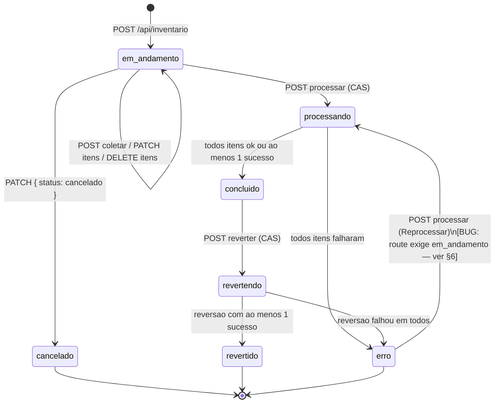
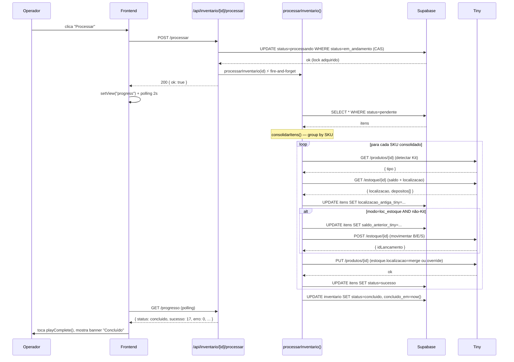
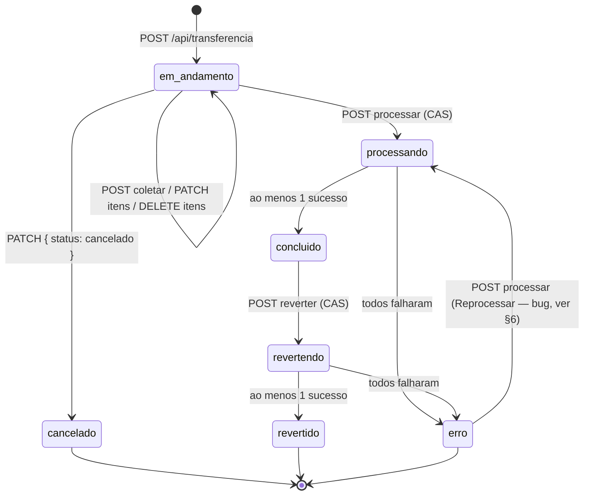
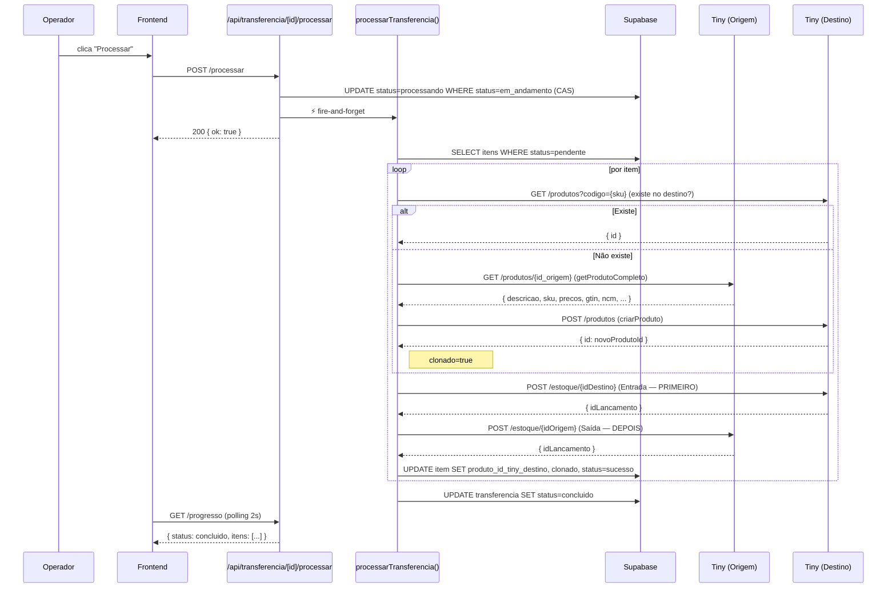
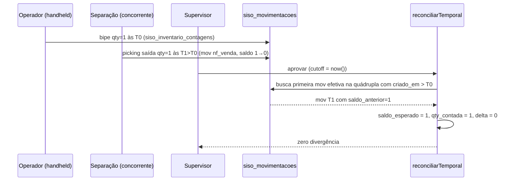

# 08 — Inventário e Transferência Inter-Galpão

> ⚠️ **DOCUMENTO OBSOLETO (2026-05-18, commit `f8b7dbb`)**: as páginas `/inventario` e `/transferencias` e as APIs `/api/inventario/*` e `/api/transferencia/*` (Tiny-based) foram apagadas. Substituídas por:
> - **Inventário v2** (pull queue + slots OP1-OP5 + claim hierárquico): `/wms/inventario/*` + `/api/wms/inventario/*` — escreve no ledger, sem Tiny.
> - **Transferências inter-galpão**: `/wms/transferir` + `/api/wms/transferir-galpao` e `/api/wms/transferencias/*` — par S+E no ledger.
>
> Esta página fica preservada como documentação histórica do desenho legado (Tiny-first). Para o desenho atual, consulte `CLAUDE.md` (seção WMS Plano 4 v2) e os specs em `docs/superpowers/`.

---

## Sumário

1. [Visão geral](#1-visão-geral)
2. [Inventário](#2-inventário)
   - 2.1 [Quando usar](#21-quando-usar)
   - 2.2 [Modelo de sessão](#22-modelo-de-sessão)
   - 2.3 [Fluxo: criação](#23-fluxo-criação-da-sessão)
   - 2.4 [Fluxo: coleta por bipagem](#24-fluxo-coleta-por-bipagem)
   - 2.5 [Fluxo: edição e remoção de itens](#25-fluxo-edição-e-remoção-de-itens)
   - 2.6 [Fluxo: processar (fire-and-forget)](#26-fluxo-processar-fire-and-forget)
   - 2.7 [Fluxo: polling de progresso](#27-fluxo-polling-de-progresso)
   - 2.8 [Fluxo: cancelar](#28-fluxo-cancelar)
   - 2.9 [Fluxo: reverter](#29-fluxo-reverter)
   - 2.10 [Diagrama de estados — inventário](#210-diagrama-de-estados--inventário)
   - 2.11 [Sequence — processamento de inventário](#211-sequence--processamento-de-inventário)
3. [Transferência inter-galpão](#3-transferência-inter-galpão)
   - 3.1 [Quando usar](#31-quando-usar)
   - 3.2 [Modelo de sessão](#32-modelo-de-sessão)
   - 3.3 [Fluxo: criação](#33-fluxo-criação-da-sessão)
   - 3.4 [Fluxo: coleta por bipagem](#34-fluxo-coleta-por-bipagem)
   - 3.5 [Fluxo: edição e remoção](#35-fluxo-edição-e-remoção-de-itens)
   - 3.6 [Fluxo: processar (fire-and-forget)](#36-fluxo-processar-fire-and-forget)
   - 3.7 [Polling de progresso](#37-polling-de-progresso)
   - 3.8 [Cancelar](#38-cancelar)
   - 3.9 [Fluxo: reverter](#39-fluxo-reverter)
   - 3.10 [Flag `clonado` e clonagem entre empresas](#310-flag-clonado-e-clonagem-entre-empresas)
   - 3.11 [Diagrama de estados — transferência](#311-diagrama-de-estados--transferência)
   - 3.12 [Sequence — processamento de transferência](#312-sequence--processamento-de-transferência)
4. [Inventário × Transferência — comparativo](#4-inventário--transferência--comparativo)
5. [Diferenças críticas frente a outros fluxos](#5-diferenças-críticas-frente-a-outros-fluxos)
6. [Limitações conhecidas](#6-limitações-conhecidas)
7. [Tabelas escritas e impacto](#7-tabelas-escritas-e-impacto)
8. [Logging](#8-logging)
9. [Erros conhecidos](#9-erros-conhecidos)
10. [Side effects — resumo](#10-side-effects--resumo)

---

## 1. Visão geral

O SISO contém duas operações de gestão manual de estoque que **não estão associadas a pedidos** — são sessões iniciadas pelo operador para reconciliar o estado físico do galpão com o Tiny ERP:

| Operação | Escopo | Finalidade |
|---|---|---|
| **Inventário** | 1 empresa, 1 depósito | Recontagem física e/ou retag de localização. Aplica `Balanço`, `Entrada` ou `Saída` no Tiny e/ou atualiza `localizacao` do produto. |
| **Transferência** | 2 empresas, 2 depósitos | Move estoque de uma empresa para outra (geralmente entre galpões diferentes). Aplica `Saída` na origem e `Entrada` no destino. |

### Padrão arquitetural compartilhado

Ambos seguem o mesmo padrão de "sessão de bipagem":

```
┌─────────────────────────────────────────────────────────────────┐
│  1. CRIAR sessão (form)                                         │
│     POST /api/{inventario|transferencia}                        │
│     status = "em_andamento"                                     │
├─────────────────────────────────────────────────────────────────┤
│  2. COLETAR itens via bipagem                                   │
│     POST /api/.../[id]/coletar                                  │
│     - busca produto no Tiny por SKU, fallback por GTIN          │
│     - insere em siso_*_itens (status="pendente")                │
│     PATCH /api/.../[id]/itens/[itemId]   (editar qty)           │
│     DELETE /api/.../[id]/itens/[itemId]  (remover)              │
├─────────────────────────────────────────────────────────────────┤
│  3. PROCESSAR ⚡ fire-and-forget                                │
│     POST /api/.../[id]/processar                                │
│     status: em_andamento → processando                          │
│     processador chama Tiny API por item                         │
│     status: processando → concluido | erro                      │
├─────────────────────────────────────────────────────────────────┤
│  4. POLLING de progresso                                        │
│     GET /api/.../[id]/progresso  (a cada 2s no frontend)        │
├─────────────────────────────────────────────────────────────────┤
│  5. (opcional) REVERTER ⚡                                      │
│     POST /api/.../[id]/reverter                                 │
│     status: concluido → revertendo → revertido | erro           │
│     processador desfaz no Tiny                                  │
└─────────────────────────────────────────────────────────────────┘
```

Dois fluxos paralelos com a mesma anatomia, mas semânticas distintas. **Eles não interagem entre si**, e nenhum dos dois consulta `siso_pedidos` — são puramente operações de gestão de estoque.

### Pontos comuns de implementação

- Frontend de progresso é compartilhado: `src/components/inventario/progresso-processamento.tsx` aceita `tipo: "inventario" | "transferencia"`.
- Ambos usam `runWithEmpresa(empresaId, fn)` (`src/lib/tiny-queue.ts`) para serializar chamadas Tiny por empresa, respeitando rate-limit.
- Ambos usam `getValidTokenByEmpresa(empresaId)` (`src/lib/tiny-oauth.ts`) — token fresco a cada chamada (lida com tokens que expiram durante processamento longo).
- Ambos chamam `processarX(id).catch(...)` sem `await` na route → fire-and-forget; o cliente acompanha por polling.
- Ambos usam **optimistic lock por CAS** (Compare-And-Swap) na transição para `processando` e `revertendo`.

---

## 2. Inventário

### 2.1 Quando usar

- **Recontagem física** de um depósito: operador percorre prateleiras com leitor, bipa cada produto, anota a localização e a quantidade. O sistema gera um `Balanço` no Tiny que zera o saldo anterior e seta o saldo contado.
- **Retag de localização**: operador apenas re-mapeia onde os produtos estão (modo `loc_only`), sem mexer no saldo.
- **Lançamento de Entrada/Saída** em massa: por exemplo, recebimento de mercadoria não amparado por NF, ou ajuste de saldo sem ser recontagem completa.

A documentação visível para o operador está em `src/app/inventario/page.tsx:28`.

### 2.2 Modelo de sessão

Tabelas: `siso_inventarios` e `siso_inventario_itens` (ver [docs/database-schema.md:486-558](../database-schema.md#siso_inventarios)).

**Campos da sessão (`siso_inventarios`):**

| Campo | Significado |
|---|---|
| `empresa_id` | Empresa-alvo (1 só, com seu próprio CNPJ e conta Tiny) |
| `galpao_id` | Resolvido a partir da `empresa_id` no momento da criação |
| `usuario_id` | Operador que criou — limita autorização para coletar / processar / reverter |
| `deposito_id` | Resolvido a partir de `siso_tiny_connections.deposito_id` da empresa (precisa estar configurado) |
| `modo` | `loc_only` (apenas localização) ou `loc_estoque` (localização + movimento de estoque) |
| `tipo_estoque` | `B` (Balanço), `E` (Entrada), `S` (Saída) — **obrigatório quando `modo = loc_estoque`** |
| `manter_localizacao_antiga` | Se `true`, faz merge da localização nova com a antiga ao salvar no Tiny; senão, sobrescreve |
| `observacoes` | Texto livre que vai no campo `observacoes` da movimentação no Tiny |
| `status` | `em_andamento` → `processando` → `concluido` ou `erro` ou `revertendo` ou `revertido`, ou `cancelado` (do `em_andamento`) |
| `processado_em` | Timestamp do início de processamento |
| `concluido_em` | Timestamp da última transição final |

**Estados:** `em_andamento`, `processando`, `concluido`, `erro`, `revertendo`, `revertido`, `cancelado`.

**Itens (`siso_inventario_itens`):**

| Campo | Significado |
|---|---|
| `inventario_id` | FK para a sessão |
| `produto_id_tiny` | ID do produto no Tiny (resolvido na bipagem) |
| `sku`, `nome_produto`, `ean` | Snapshot do produto |
| `localizacao` | Localização bipada (ex.: `A-01-1`) |
| `quantidade` | Quantidade contada |
| `status` | `pendente` → `processando` → `sucesso` ou `erro` |
| `erro_msg` | Mensagem de erro do Tiny se a chamada falhou |
| `localizacao_antiga_tiny` | Snapshot da localização anterior no Tiny (preenchido durante processamento, usado para reverter) |
| `saldo_anterior_tiny` | Snapshot do saldo no depósito antes do `Balanço` (usado para reverter) |

> **Importante:** **não há unique constraint** em `(inventario_id, sku)`. O mesmo SKU pode aparecer várias vezes na sessão — em localizações diferentes ou no mesmo bipe duplicado. A consolidação ocorre apenas no momento de processar (ver `consolidarItens` em `src/lib/inventario-processor.ts:44`).

### 2.3 Fluxo: criação da sessão

`POST /api/inventario` → `src/app/api/inventario/route.ts:119`

**Frontend:** `src/components/inventario/criar-inventario-form.tsx:23` apresenta o formulário com:
- Empresa (dropdown, filtrado pelo galpão ativo do usuário)
- Modo: `loc_estoque` ou `loc_only`
- Tipo de Estoque (apenas se `loc_estoque`): `B`, `E`, `S`
- Localização antiga: `Substituir` (false) ou `Manter antiga` (true)
- Observações (opcional)

**Validações no servidor (`src/app/api/inventario/route.ts:130-148`):**
- `empresa_id` obrigatório → 400
- `modo` obrigatório → 400
- `tipo_estoque` obrigatório se `modo === "loc_estoque"` → 400

**Resolução automática:**
- `galpao_id`: lê de `siso_empresas.galpao_id` (`route.ts:151-163`)
- `deposito_id`: lê de `siso_tiny_connections` da empresa (`route.ts:165-178`)
  - Se nenhuma conexão ativa ou se `deposito_id` não estiver configurado → erro `"Depósito não configurado para esta empresa"`

**Insert (`route.ts:181-205`):**
```sql
INSERT INTO siso_inventarios (
  empresa_id, galpao_id, usuario_id, deposito_id,
  modo, tipo_estoque, manter_localizacao_antiga,
  observacoes, status
) VALUES (
  ?, ?, session.id, ?,
  ?, ? (ou null se modo=loc_only), ?,
  ?, 'em_andamento'
)
```

A response inclui `id`, `empresa_id`, `galpao_id`, `deposito_id`, `modo`, `status` — usados pelo cliente para entrar na view de scan (`src/app/inventario/page.tsx:74`).

### 2.4 Fluxo: coleta por bipagem

`POST /api/inventario/[id]/coletar` → `src/app/api/inventario/[id]/coletar/route.ts:21`

**Frontend (`src/components/inventario/scan-inventario.tsx:49`):**

Layout:
- Campo "Localização" (sticky, em destaque) — operador define **antes** de começar a bipar; convertido para uppercase automaticamente.
- Campo SKU (desabilitado até a localização ser preenchida).
- Stepper de quantidade (default 1, ajustável com +/-).
- Lista de itens já bipados (newest first).

Cada Enter no campo SKU dispara `handleScan`:
1. Trim do código.
2. Se localização vazia → `toast.error("Defina uma localização")`.
3. POST `/api/inventario/[id]/coletar` com `{ codigo, localizacao, quantidade }`.

**Servidor (`route.ts:33-92`):**

1. Busca a sessão. Se não existe → 404.
2. Se `status !== "em_andamento"` → 400.
3. Se `usuario_id !== session.id` e não é admin → 403 (apenas o criador bipa).
4. Valida `localizacao` e `codigo` não vazios.
5. Pega token da empresa via `getValidTokenByEmpresa(inventario.empresa_id)`.
6. Busca produto no Tiny dentro de `runWithEmpresa(empresa_id, ...)`:
   - Primeiro `buscarProdutoPorSku(token, codigo)` (`tiny-api.ts:305`)
   - Se não achar, `buscarProdutoPorGtin(token, codigo)` (`tiny-api.ts:318`)
7. Se nenhum dos dois retornou → 404 "Produto não encontrado no Tiny".
8. Insere em `siso_inventario_itens`:
   ```sql
   INSERT INTO siso_inventario_itens (
     inventario_id, produto_id_tiny, sku, nome_produto,
     ean, localizacao, quantidade
   ) VALUES (?, produto.id, produto.codigo, produto.descricao,
            (gtin se buscou por gtin, senão null),
            localizacao, quantidade ?? 1)
   ```
   `status` default = `'pendente'`.
9. **Detecção de duplicata** (`route.ts:130-142`): faz um `SELECT ... WHERE inventario_id=? AND ilike sku=? AND id<>itemRecente`. Se encontrar, devolve `ja_escaneado=true` + `localizacoes_anteriores` para o frontend tocar `playDuplicate()` e mostrar toast "SKU já escaneado neste inventário".
10. `count(*)` total na sessão para devolver `total_itens`.

**Resposta:**
```json
{
  "item": { "id", "produto_id_tiny", "sku", "nome_produto",
            "ean", "localizacao", "quantidade", "status", "created_at" },
  "ja_escaneado": false | true,
  "localizacoes_anteriores": ["A-01-1 (×2)", "B-03-1 (×5)"],
  "total_itens": 17
}
```

**Feedback de áudio (frontend):**
- Sucesso novo SKU → `playSuccess()`
- SKU duplicado → `playDuplicate()`
- Erro / 404 / connection failure → `playError()`

(Helpers em `src/components/separacao/audio-feedback.ts`.)

### 2.5 Fluxo: edição e remoção de itens

`PATCH /api/inventario/[id]/itens/[itemId]` (editar quantidade) e `DELETE` (remover) — ambos em `src/app/api/inventario/[id]/itens/[itemId]/route.ts`.

Regras (idênticas para PATCH e DELETE):
- Sessão precisa existir e estar `em_andamento` → senão 400.
- Apenas o criador (ou admin) pode modificar → senão 403.
- PATCH valida `quantidade >= 1` (`route.ts:58-63`).
- DELETE devolve `total_itens` recontado.

Frontend: cada item da lista tem badge `×{quantidade}` clicável (`scan-inventario.tsx:354-364`) que vira input numérico inline (Enter ou blur salva), e ícone de lixeira para deletar (`:374-382`).

### 2.6 Fluxo: processar (fire-and-forget)

`POST /api/inventario/[id]/processar` → `src/app/api/inventario/[id]/processar/route.ts:13`

**Pré-validações:**
1. Sessão existe → senão 404.
2. `status === "em_andamento"` → senão 400.
3. `usuario_id === session.id` ou admin → senão 403.
4. **Tem ao menos 1 item** → senão 400 ("Inventário não possui itens para processar").

**Optimistic lock — CAS (`route.ts:69-83`):**
```sql
UPDATE siso_inventarios
SET status='processando', processado_em=now()
WHERE id=? AND status='em_andamento'
RETURNING id
```
Se nenhum row retornar → 409 "Inventário já está sendo processado". Garante que duas requisições simultâneas não disparem dois processamentos.

**Disparo:**
```ts
processarInventario(id).catch((err) => logger.logError({...}))
```
Sem `await`. Resposta HTTP volta imediatamente: `{ ok: true, message: "Processamento iniciado" }`.

#### `processarInventario` — `src/lib/inventario-processor.ts:99`

A função executa em background no mesmo processo Node.js (Next.js mantém o promise vivo entre requests). **Não há job queue persistente** — se o processo morrer no meio, a sessão fica em `processando` e os itens em estados mistos. Recovery é manual: atualmente o processador só busca itens `pendente` (`processor.ts:131-135`), o que dá ao operador a opção de re-disparar `POST /processar`... porém após o CAS o status já é `processando`, então o re-disparo retorna 409. **Nesse caso é preciso intervir no DB para reverter o status, ou criar nova sessão.**

(O endpoint `POST /processar` no estado `erro` é permitido pela UI ("Reprocessar" em `progresso-processamento.tsx:155-167`), mas no servidor a guard `status !== "em_andamento"` rejeita. Isso é um bug latente no fluxo "Reprocessar".)

**Pipeline interno (`processor.ts:99-280`):**

1. **`UPDATE siso_inventarios SET status='processando', processado_em=now()`** — redundante porque o route já fez (CAS), mas é idempotente.
2. Carrega sessão com joins de empresa e usuário (`processor.ts:114-118`).
3. Carrega **apenas itens `pendente`** (`processor.ts:131-135`) — possibilita "checkpoint/resume" se for re-disparado.
4. Se 0 itens pendentes → marca `status='concluido'` e retorna.
5. **Consolida itens por SKU** (`consolidarItens`, `processor.ts:44-95`):
   - Agrupa case-insensitive por SKU (uppercase como key).
   - Soma `quantidade_total` (todas as linhas do mesmo SKU somam).
   - Junta localizações únicas, sort natural, separador `"; "`.
   - Reúne `itens_ids` (todos os UUIDs originais, para update em massa).
6. Monta string de observação:
   ```
   "Inventário SISO - YYYY-MM-DD - {operador}{ - {observacoes} se tiver}"
   ```
7. **Para cada item consolidado** (loop sequencial):
   1. Se `produto_id_tiny` ausente → marca todos os UUIDs como `erro` com `"produto_id_tiny não encontrado"`.
   2. Pega token fresco (`getValidTokenByEmpresa`) — feito **dentro do loop** para sobreviver à expiração de token em sessões longas.
   3. Dentro de `runWithEmpresa(empresa_id, async () => {...})`:
      - **`getProdutoDetalhe(token, produto_id_tiny)`** → lê `tipo` (`K` = Kit). Kit não recebe movimento de estoque (estoque é dos componentes, não do kit).
      - **`getEstoque(token, produto_id_tiny)`** → captura:
        - `localizacao` atual → salva em `localizacao_antiga_tiny` em **todas** as linhas do consolidado (`processor.ts:191-194`).
      - **Se `modo === "loc_estoque" && !isKit`:**
        - Acha o depósito da sessão dentro de `estoque.depositos` para pegar `saldo` atual → salva em `saldo_anterior_tiny` em todas as linhas.
        - Chama `movimentarEstoque(token, produto_id_tiny, { tipo, quantidade: quantidade_total, deposito: { id }, observacoes })` — endpoint `POST /estoque/{produtoId}` no Tiny.
      - **Calcula localização final:**
        - Se `manter_localizacao_antiga === true` E havia localização antiga → faz merge: split por `"; "`, dedup, sort, join. Resultado: localização antiga preservada + novas localizações inseridas, em ordem alfabética.
        - Senão → usa apenas as localizações da sessão (sobrescreve).
      - **`atualizarLocalizacaoProduto(token, produto_id_tiny, localizacaoFinal)`** — `PUT /produtos/{id}` com `estoque.localizacao`.
   4. Se tudo deu certo → `UPDATE siso_inventario_itens SET status='sucesso' WHERE id IN (...)`.
   5. Set `anySuccess = true`.
8. **Em caso de exceção** dentro do try (`processor.ts:253-268`):
   - `UPDATE siso_inventario_itens SET status='erro', erro_msg=err.message WHERE id IN (...)`.
   - `logger.logError({ source: 'inventario', category: 'external_api', ... })`.
   - **Loop continua para os próximos consolidados** (não aborta a sessão).
9. **Status final:**
   - `concluido` se ao menos 1 sucesso (`anySuccess === true`).
   - `erro` se **todos** falharam.
   - `concluido_em = now()`.

#### Side effects dos passos no Tiny

| Passo | Endpoint Tiny | Efeito |
|---|---|---|
| `getProdutoDetalhe` | `GET /produtos/{id}` | leitura de tipo (Kit?) e gtin |
| `getEstoque` | `GET /estoque/{id}` | leitura de saldo + depósitos |
| `movimentarEstoque` | `POST /estoque/{id}` | **lança movimento `B`/`E`/`S` no depósito**, retorna `idLancamento` |
| `atualizarLocalizacaoProduto` | `PUT /produtos/{id}` | grava `estoque.localizacao` |

> **Atenção:** o `Balanço` (tipo `B`) **substitui** o saldo do depósito pelo valor passado. `Entrada` (`E`) e `Saída` (`S`) **somam ou subtraem** do saldo atual.

### 2.7 Fluxo: polling de progresso

`GET /api/inventario/[id]/progresso` → `src/app/api/inventario/[id]/progresso/route.ts:13`

**Frontend (`progresso-processamento.tsx:52-64`):**

```tsx
useQuery({
  queryKey: ["inventario-progresso", sessionId],
  queryFn: () => sisoFetch(`/api/inventario/${sessionId}/progresso`),
  refetchInterval: (q) =>
    (q.state.data?.status === "processando" || q.state.data?.status === "revertendo") ? 2000 : false,
});
```

Polling de **2 segundos** enquanto `processando` ou `revertendo`; pára quando termina.

**Resposta:**
```json
{
  "status": "processando",
  "total": 17,
  "processados": 9,
  "sucesso": 8,
  "erro": 1,
  "itens": [
    {
      "sku": "EW1234",
      "nome_produto": "Filtro de óleo",
      "quantidade_total": 5,
      "localizacoes": "A-01-1; A-02-3",
      "status": "sucesso",
      "erro_msg": null
    }, ...
  ]
}
```

A consolidação para a view de progresso (`route.ts:75-125`) é **diferente** da do processador: agrupa por SKU para a UI mostrar uma linha por SKU (com `localizacoes` separadas por `"; "`), e o status agregado segue a regra:
- Qualquer `sucesso` → `sucesso` (verde).
- Senão qualquer `erro` → `erro` (vermelho com `erro_msg` no tooltip).
- Senão qualquer `processando` → `processando` (loader azul).
- Senão `pendente`.

Ao detectar `status === "concluido" || "revertido"` o frontend toca som via `playComplete()` uma única vez (`progresso-processamento.tsx:67-74`).

### 2.8 Fluxo: cancelar

`PATCH /api/inventario/[id]` com body `{ status: "cancelado" }` — `src/app/api/inventario/[id]/route.ts:89`

**Regras:**
- Apenas criador ou admin (`route.ts:117-123`).
- **Só permite se `status === "em_andamento"`** (`route.ts:132-138`). Não dá para cancelar uma sessão em processamento ou já concluída.
- Update: `status='cancelado'`, `concluido_em=now()`.

A sessão e seus itens permanecem no DB para histórico — **nada é desfeito no Tiny** porque nenhuma chamada Tiny foi feita ainda.

### 2.9 Fluxo: reverter

`POST /api/inventario/[id]/reverter` → `src/app/api/inventario/[id]/reverter/route.ts:13`

**Pré-validações:**
1. Sessão existe → senão 404.
2. `status === "concluido"` → senão 400 ("Só é possível reverter inventários concluídos").
3. Apenas criador ou admin → senão 403.

**Optimistic lock CAS (`route.ts:56-70`):**
```sql
UPDATE siso_inventarios SET status='revertendo'
WHERE id=? AND status='concluido' RETURNING id
```
Se 0 rows → 409 "Inventário já está sendo revertido".

**Disparo:**
```ts
reverterInventario(id).catch(...)
```
Fire-and-forget. Cliente acompanha pelo mesmo `/progresso`.

#### `reverterInventario` — `src/lib/inventario-processor.ts:289`

1. `UPDATE siso_inventarios SET status='revertendo'` (idempotente).
2. Carrega sessão (com `usuario` join).
3. Carrega **apenas itens com `status='sucesso'`** (`processor.ts:317-322`) — só esses foram aplicados no Tiny e portanto só esses precisam ser desfeitos.
4. Se 0 itens → marca `status='revertido'` e retorna.
5. Consolida pelos mesmos critérios de processamento.
6. Para cada item consolidado, dentro de `runWithEmpresa`:
   - **a. Restaurar localização**: pega `localizacao_antiga_tiny` da primeira linha do grupo (todas têm o mesmo valor, salvo no processamento) e chama `atualizarLocalizacaoProduto(token, produto_id_tiny, locAnterior)`.
   - **b. Reverter movimento de estoque** (apenas se `modo === "loc_estoque"` e produto **não** é Kit):
     | Tipo original | Reversão |
     |---|---|
     | `B` (Balanço) | Novo `B` com `saldo_anterior_tiny` (volta ao saldo pré-inventário) |
     | `E` (Entrada) | `S` (Saída) com `quantidade_total` (deduz o que entrou) |
     | `S` (Saída) | `E` (Entrada) com `quantidade_total` (recoloca o que saiu) |
   - **c. Marca itens como `pendente`** novamente (`status='pendente', erro_msg=null`) — o que torna a sessão potencialmente "re-processável", embora o status da sessão fique `revertido`.
7. Em caso de exceção: marca itens como `erro` com `erro_msg`, log, continua o loop.
8. Status final: `revertido` se houve ao menos 1 sucesso; `erro` se todos falharam.

> **Limitação semântica do Balanço:** se entre o processamento e a reversão alguém tiver lançado outras movimentações no Tiny (entradas/saídas de NF, outras movimentações manuais), o `saldo_anterior_tiny` salvo no processamento já estará desatualizado. A reversão ainda assim aplica o saldo antigo, podendo introduzir divergência. Não há validação para isso.

### 2.10 Diagrama de estados — inventário



### 2.11 Sequence — processamento de inventário



---

## 3. Transferência inter-galpão

### 3.1 Quando usar

Mover estoque de uma `empresa A` para uma `empresa B` quando o produto sai fisicamente de um galpão e chega no outro. Casos típicos:

- Reposição entre galpões (CWB ↔ SP).
- Empréstimo entre empresas do mesmo grupo (mas operacionalmente, este fluxo aplica `Saída` definitiva na origem e `Entrada` definitiva no destino — não há flag de "empréstimo a devolver").
- Acertos manuais de divergência entre empresas.

> **Não confundir com `decisao = "transferencia"` em pedidos** (ver §5). Aquela é uma marcação de pedido; **esta é uma operação manual independente**.

UI: `src/app/transferencias/page.tsx:26`.

### 3.2 Modelo de sessão

Tabelas: `siso_transferencias` e `siso_transferencia_itens` (ver [docs/database-schema.md:561-633](../database-schema.md#siso_transferencias)).

**Campos da sessão (`siso_transferencias`):**

| Campo | Significado |
|---|---|
| `empresa_origem_id` | Empresa de onde sai o estoque |
| `empresa_destino_id` | Empresa para onde vai o estoque |
| `galpao_origem_id`, `galpao_destino_id` | Resolvidos a partir das empresas |
| `usuario_id` | Operador |
| `deposito_origem_id`, `deposito_destino_id` | Resolvidos a partir das `siso_tiny_connections` de cada empresa |
| `observacoes` | Texto livre |
| `status` | `em_andamento` → `processando` → `concluido` ou `erro` ou `revertendo` ou `revertido` ou `cancelado` |
| `processado_em`, `concluido_em` | Timestamps |

**Estados:** mesmos da tabela de inventário.

**Itens (`siso_transferencia_itens`):**

| Campo | Significado |
|---|---|
| `produto_id_tiny_origem` | ID no Tiny da empresa origem (capturado na bipagem) |
| `produto_id_tiny_destino` | ID no Tiny da empresa destino — preenchido durante processamento (ou mesmo SKU encontrado no destino, ou novo produto clonado) |
| `sku`, `nome_produto`, `ean` | Snapshot do produto da origem |
| `quantidade` | Quantidade a transferir (não há "consolidação" — cada linha é independente) |
| `clonado` | `true` se o processador teve que **criar** o produto na empresa destino (não existia lá ainda) |
| `status`, `erro_msg` | Igual ao inventário |

> **Importante:** transferência **não consolida itens** ao processar — cada linha em `siso_transferencia_itens` vira **uma chamada de Saída + uma chamada de Entrada** no Tiny. Bipar o mesmo SKU duas vezes resulta em dois movimentos separados (um por linha). Não há `unique constraint` em `(transferencia_id, sku)`.

### 3.3 Fluxo: criação da sessão

`POST /api/transferencia` → `src/app/api/transferencia/route.ts:127`

**Frontend (`src/components/transferencia/criar-transferencia-form.tsx:21`):**

- Empresa Origem: filtrada pelo galpão ativo do usuário (auto-seleciona se há só 1).
- Empresa Destino: dropdown com todas as empresas ativas, exceto a origem (auto-seleciona se há só 1 candidata).
- Observações (opcional).

**Validações no servidor:**
- `empresa_origem_id` obrigatório → 400.
- `empresa_destino_id` obrigatório → 400.
- `empresa_origem_id !== empresa_destino_id` → 400 ("Origem e destino devem ser diferentes").
- Cada empresa precisa existir → 400.
- Cada empresa precisa ter `siso_tiny_connections.deposito_id` configurado → 400.

**Insert (`route.ts:214-230`):**
```sql
INSERT INTO siso_transferencias (
  empresa_origem_id, empresa_destino_id,
  galpao_origem_id, galpao_destino_id,
  usuario_id,
  deposito_origem_id, deposito_destino_id,
  observacoes, status
) VALUES (..., 'em_andamento')
```

A response retorna `id` + `empresa_origem_id` (usado para entrar na view de scan).

### 3.4 Fluxo: coleta por bipagem

`POST /api/transferencia/[id]/coletar` → `src/app/api/transferencia/[id]/coletar/route.ts:18`

**Frontend (`src/components/transferencia/scan-transferencia.tsx:29`):**

Layout mais simples que o de inventário:
- **Sem campo de localização** (transferência não rastreia localização).
- Campo SKU em foco automático ao montar.
- Stepper de quantidade.
- Lista de itens (newest first), com edição inline e delete.

Cada Enter dispara `handleScan`:
- POST `{ codigo, quantidade }`.

**Servidor (`route.ts:30-89`):**

1. Sessão existe? → senão 404.
2. `status === "em_andamento"`? → senão 400.
3. `usuario_id === session.id` ou admin? → senão 403.
4. `codigo` válido?
5. **Busca produto SOMENTE NA EMPRESA ORIGEM**:
   ```ts
   const { token } = await getValidTokenByEmpresa(empresa_origem_id);
   await runWithEmpresa(empresa_origem_id, async () => {
     bySku = await buscarProdutoPorSku(token, codigo);
     if (bySku) return { ...bySku, searchedByGtin: false };
     byGtin = await buscarProdutoPorGtin(token, codigo);
     if (byGtin) return { ...byGtin, searchedByGtin: true };
   });
   ```
   Se nenhum dos dois → 404 "Produto não encontrado no Tiny".
6. Insert:
   ```sql
   INSERT INTO siso_transferencia_itens (
     transferencia_id, produto_id_tiny_origem, sku,
     nome_produto, ean, quantidade
   ) VALUES (..., 1)
   ```
   `produto_id_tiny_destino` é deixado nulo até o processamento.
7. Devolve `{ item, total_itens }`. **Não há detecção de duplicata** — diferente do inventário, no transferência cada bipe é tratado como linha independente.

### 3.5 Fluxo: edição e remoção de itens

`PATCH` e `DELETE` em `src/app/api/transferencia/[id]/itens/[itemId]/route.ts`. Idênticos em comportamento ao inventário (validação de status, ownership, etc.).

### 3.6 Fluxo: processar (fire-and-forget)

`POST /api/transferencia/[id]/processar` → `src/app/api/transferencia/[id]/processar/route.ts:13`

Pré-validações idênticas ao inventário (status `em_andamento`, ownership, ao menos 1 item, CAS para `processando`).

Disparo:
```ts
processarTransferencia(id).catch(logger.logError(...))
```

#### `processarTransferencia` — `src/lib/transferencia-processor.ts:29`

1. `UPDATE status='processando', processado_em=now()` (idempotente).
2. Carrega sessão com joins de `galpao_origem`, `galpao_destino`, `usuario`.
3. Carrega **apenas itens `pendente`**.
4. Se 0 → marca `concluido` e retorna.
5. Monta strings de observação:
   ```
   obsSaida   = "Transferência SISO para {galpaoDestinoNome} - YYYY-MM-DD - {operador}"
   obsEntrada = "Transferência SISO de {galpaoOrigemNome} - YYYY-MM-DD - {operador}"
   ```
6. **Para cada item** (loop sequencial):
   1. **Resolver produto no destino:**
      - `buscarProdutoPorSku(tokenDestino, item.sku)` em `runWithEmpresa(empresa_destino_id, ...)`.
      - Se encontrou → `produtoIdDestino = found.id`, `clonado = false`.
      - Se **NÃO** encontrou → **clonar** (ver §3.10):
        - `getProdutoCompleto(tokenOrigem, produto_id_tiny_origem)` na origem (descricao, sku, precos, gtin, unidade, ncm, origem).
        - `criarProduto(tokenDestino, { descricao, sku, preco: precos.preco || 0.01, gtin, unidade, ncm, origem })` no destino.
        - `produtoIdDestino = novoProduto.id`, `clonado = true`.
   2. **`Entrada` no destino PRIMEIRO** (`processor.ts:144-157`):
      ```ts
      movimentarEstoque(tokenDestino, produtoIdDestino, {
        tipo: "E",
        quantidade: item.quantidade,
        deposito: { id: deposito_destino_id },
        observacoes: obsEntrada,
      });
      ```
      > **Comentário no código (`processor.ts:144`):** "Entry stock to destination FIRST — safer: if this fails, no stock is lost". Lógica: se a `Saída` falhasse antes da `Entrada` ter sido feita, o estoque sumiria (tirou da origem mas não chegou no destino). Fazendo `Entrada` primeiro, na pior das hipóteses temos estoque duplicado (em ambos), o que é mais fácil de detectar e corrigir do que estoque perdido.
   3. **`Saída` na origem APÓS** (`processor.ts:159-172`):
      ```ts
      movimentarEstoque(tokenOrigem, produto_id_tiny_origem, {
        tipo: "S",
        quantidade: item.quantidade,
        deposito: { id: deposito_origem_id },
        observacoes: obsSaida,
      });
      ```
   4. `UPDATE siso_transferencia_itens SET produto_id_tiny_destino, clonado, status='sucesso' WHERE id=?`.
7. Em caso de exceção: marca o item como `erro` com `erro_msg`, log, **continua o loop** com os outros itens.
8. Status final: `concluido` se ao menos 1 sucesso, `erro` se todos falharam, `concluido_em = now()`.

> **Risco de inconsistência (assumido):** se o `POST /estoque/{id}` da Saída falhar **depois** da Entrada ter sucedido, o produto está duplicado (no destino e na origem). O sistema marca o item como `erro` com a `erro_msg` da Saída, mas a `Entrada` já efetivada **não é revertida**. Operação ainda manual nesse caso (operador precisa fazer ajuste manual, ou disparar Reverter — mas Reverter só atua sobre itens `sucesso`, não os `erro`).

### 3.7 Polling de progresso

`GET /api/transferencia/[id]/progresso` → `src/app/api/transferencia/[id]/progresso/route.ts:13`

Estrutura igual à do inventário, **mas a UI mostra uma linha por item** (não consolida por SKU): cada linha em `siso_transferencia_itens` é uma linha na resposta (`route.ts:79-94`). O campo `localizacoes` vem sempre como `""`.

Front-end usa o **mesmo componente** `ProgressoProcessamento` (`progresso-processamento.tsx:43`) com prop `tipo="transferencia"` — ele monta a URL como `/api/transferencia/${id}/progresso`.

### 3.8 Cancelar

`PATCH /api/transferencia/[id]` com `{ status: "cancelado" }` — só permite `em_andamento` → `cancelado`. Igual ao inventário.

### 3.9 Fluxo: reverter

`POST /api/transferencia/[id]/reverter` → `src/app/api/transferencia/[id]/reverter/route.ts:13`

Pré-validações:
- `status === "concluido"`.
- Criador ou admin.
- CAS para `revertendo`.

#### `reverterTransferencia` — `src/lib/transferencia-processor.ts:221`

1. `UPDATE status='revertendo'`.
2. Carrega sessão.
3. Carrega **apenas itens `sucesso`**.
4. Se 0 → marca `revertido` e retorna.
5. Para cada item:
   - **Validação:** `produto_id_tiny_destino` existe (foi resolvido no processamento)? Se não → marca como `erro` "produto_id_tiny_destino ausente".
   - **`Entrada` na origem** (devolvendo o que saiu):
     ```ts
     movimentarEstoque(tokenOrigem, produto_id_tiny_origem, { tipo: "E", quantidade, deposito, observacoes: "Reversão Transferência SISO - ..." })
     ```
   - **`Saída` no destino** (retirando o que entrou):
     ```ts
     movimentarEstoque(tokenDestino, produto_id_tiny_destino, { tipo: "S", quantidade, deposito, observacoes: "Reversão Transferência SISO - ..." })
     ```
   - Marca item como `pendente` (mesmo padrão do inventário).
6. Em erro: marca item como `erro`, continua.
7. Status final: `revertido` (se ao menos 1) ou `erro`, `concluido_em = now()`.

> **A reversão NÃO desfaz a clonagem do produto no destino.** Se o produto foi criado lá pela primeira vez, a entrada do `criarProduto` permanece (apenas o saldo é zerado pela `Saída`). Isso é intencional: o mesmo SKU pode ser usado em transferências futuras sem precisar ser recriado, e o `criarProduto` é uma operação custosa.

### 3.10 Flag `clonado` e clonagem entre empresas

Quando o operador bipa um SKU que existe na origem mas não na empresa destino, o processador automaticamente o cria no destino via `criarProduto` em `src/lib/tiny-api.ts:363`.

**Campos copiados (do `getProdutoCompleto` na origem):**
- `descricao`
- `sku`
- `precos.preco` (cai para `0.01` se nulo)
- `gtin`
- `unidade`
- `ncm`
- `origem`

**Campos NÃO copiados:** categoria, fornecedores, marca, anexos/imagens, kit components, dimensões, etc. — produtos clonados ficam com a metadata mínima e podem precisar ser completados manualmente no Tiny depois.

Após o clone, `produto_id_tiny_destino` é gravado na linha do item e `clonado = true` para auditoria.

### 3.11 Diagrama de estados — transferência



### 3.12 Sequence — processamento de transferência



---

## 4. Inventário × Transferência — comparativo

| Aspecto | Inventário | Transferência |
|---|---|---|
| **Escopo** | 1 empresa | 2 empresas (origem + destino) |
| **Tabelas** | `siso_inventarios`, `siso_inventario_itens` | `siso_transferencias`, `siso_transferencia_itens` |
| **Campo localização** | Sim (obrigatório no scan) | Não |
| **Modos** | `loc_only` ou `loc_estoque` | (sem modo — sempre faz movimentos de estoque) |
| **Tipo de movimento** | `B`, `E` ou `S` (escolhido na criação) | Sempre `E` no destino + `S` na origem |
| **Consolidação por SKU** | Sim, no processamento (`consolidarItens`) — soma quantidade, junta localizações | Não — cada linha = um movimento separado |
| **Detecção de duplicata na bipagem** | Sim (toast amarelo, `playDuplicate`) | Não (cada bipe = nova linha sem aviso) |
| **Tratamento de Kit** | Pula `movimentarEstoque` (mas atualiza localização) | (não há detecção de Kit) |
| **Snapshot para reverter** | `localizacao_antiga_tiny`, `saldo_anterior_tiny` | Apenas `produto_id_tiny_destino` é gravado |
| **Cria produtos no Tiny** | Não | Sim, via `criarProduto` se SKU não existe no destino (`clonado=true`) |
| **Side effect adicional** | `PUT /produtos/{id}` para `estoque.localizacao` | Apenas `POST /estoque/{id}` (movimento) |
| **Filtro de visibilidade (galpão)** | `galpao_id = session.galpaoId` | `galpao_origem_id = session.galpaoId OR galpao_destino_id = session.galpaoId` |
| **Reversão** | `B`→reaplicar saldo antigo; `E`→`S`; `S`→`E` + restaurar localização antiga | `E` na origem + `S` no destino (não desfaz clonagem) |
| **Frontend de progresso** | Mesmo componente (`ProgressoProcessamento`) com `tipo="inventario"` — agrega por SKU | Mesmo componente com `tipo="transferencia"` — uma linha por item |

### Comparativo de chamadas Tiny por item

**Inventário (`loc_estoque`, não-Kit):**
1. `GET /produtos/{id}` (detalhe — detecta Kit)
2. `GET /estoque/{id}` (saldo + localização atual)
3. `POST /estoque/{id}` (movimento `B`/`E`/`S`)
4. `PUT /produtos/{id}` (atualiza localização)

→ 4 chamadas / 2 leituras + 2 escritas / **1 empresa**.

**Transferência (item já existente no destino):**
1. `GET /produtos?codigo={sku}` (busca SKU no destino)
2. `POST /estoque/{idDestino}` (Entrada)
3. `POST /estoque/{idOrigem}` (Saída)

→ 3 chamadas / 1 leitura + 2 escritas / **2 empresas**.

**Transferência (clonagem):**
1. `GET /produtos?codigo={sku}` no destino → vazio
2. `GET /produtos/{idOrigem}` (full data)
3. `POST /produtos` no destino (criar)
4. `POST /estoque/{idNovoDestino}` (Entrada)
5. `POST /estoque/{idOrigem}` (Saída)

→ 5 chamadas / 2 leituras + 3 escritas / **2 empresas**.

---

## 5. Diferenças críticas frente a outros fluxos

### vs. `decisao = "transferencia"` (fluxo de pedido — ver doc 04)

| | `decisao=transferencia` (pedido) | Transferência manual (este doc) |
|---|---|---|
| **O que é** | Marcação no `siso_pedidos` indicando que o pedido será atendido por outra empresa do mesmo grupo | Sessão criada manualmente em `siso_transferencias` |
| **Origem** | Webhook do Tiny + `webhook-processor.ts` (suggestion engine) ou aprovação humana | Operador no `/transferencias` |
| **Tabela** | `siso_pedidos.decisao = 'transferencia'` | `siso_transferencias` |
| **Quando movimenta estoque** | Na execução (deduz estoque na empresa que dedicou tier no grupo) — ver `execution-worker.ts:278` | Imediatamente no processamento da sessão |
| **Vinculado a pedido?** | Sim (1:1 com `siso_pedidos.id`) | Não — não tem `pedido_id` |
| **NF gerada?** | Sim, na execução | Não — apenas movimentos brutos no Tiny |

**Conclusão:** uma transferência **de pedido** é uma decisão sobre qual empresa do grupo paga a dedução, mas o produto fisicamente **já está** na empresa que vai expedir. **Transferência manual** é uma operação para ajustar estoque entre empresas que **fisicamente** moveram produto.

### vs. encaminhar pedido (`/api/wms/separacao/encaminhar` — ver doc 05)

`encaminhar` é uma operação dentro do fluxo de **separação** que muda o galpão executor de um pedido em andamento (ex.: o galpão CWB começou a separar mas percebeu que o produto está faltando, e encaminha o pedido para SP). Ele atualiza `siso_pedidos.empresa_origem_id` ou `empresa_deducao_id`, mas **não movimenta estoque** entre Tiny accounts. Não confunde com transferência manual.

### vs. lançamento de estoque na execução (`execution-worker.ts`)

A execução do pedido aplica `lancarEstoque(token, pedidoId)` (Tiny: `POST /pedidos/{id}/lancar-estoque`) — efeito colateral do **pedido**. Inventário e transferência usam `movimentarEstoque(token, produtoId, ...)` (Tiny: `POST /estoque/{produtoId}`) — efeito direto no **produto**, sem amarração a pedido.

---

## 6. Limitações conhecidas

### 6.1 Não há reserva-aware: pode movimentar SKU já reservado a pedido

Os processadores de inventário e transferência **não consultam** `siso_pedido_item_estoques`, `siso_pedidos.status`, ou qualquer flag de reserva. Eles lidam diretamente com o saldo do depósito no Tiny.

**Cenário problemático:**
1. Pedido X aprovado → `siso_pedidos.status = 'executando'`, `siso_pedido_item_estoques` reserva 5 unidades do SKU `ABC` na empresa NetAir.
2. Operador inicia inventário e bipa `ABC` na NetAir com `quantidade=3`, modo `loc_estoque`, tipo `B` (Balanço).
3. Inventário processa → Tiny grava saldo = 3 → ainda há 5 reservadas no nosso DB.
4. Pedido X tenta deduzir → falha, ou deduz e o saldo no Tiny vira negativo.

**Mitigação operacional:** o operador deve evitar fazer inventário/transferência durante horário de movimento alto, ou pelo menos não sobre SKUs com pedidos pendentes. **Não há proteção no código.**

### 6.2 Bug latente no botão "Reprocessar"

Quando uma sessão termina com `status='erro'`, a UI (`progresso-processamento.tsx:155-167`) oferece um botão "Reprocessar" que envia `POST /processar`. Mas o servidor (`processar/route.ts:40-45`) tem a guard `status !== "em_andamento"` e devolve 400. Logo, o botão na prática **não funciona** — o operador vê o toast "Inventário não está em andamento".

**Workaround:** intervenção manual no DB para resetar `status='em_andamento'` antes de reprocessar. Não documentado para usuário final.

### 6.3 Crash no meio do processamento deixa sessão travada

Como o processamento é fire-and-forget no mesmo processo Node.js sem job queue persistente, se o servidor morrer (deploy, OOM, crash), a sessão fica em `processando` indefinidamente. Não há job de auto-recovery. Itens com `status='processando'` (transient) também ficariam órfãos — embora na prática o processador não escreve `status='processando'` em itens individuais, apenas em itens `pendente` → `sucesso/erro`.

**Mitigação:** intervenção manual no DB para restaurar `status='em_andamento'`.

### 6.4 `clonado` na transferência não tem rollback

Reverter uma transferência **não apaga** o produto criado na empresa destino. Se a transferência for revertida e o produto nunca mais for utilizado, ele fica órfão no Tiny do destino com saldo zero (e potencialmente sem categoria/fornecedor — ver §3.10). Isso é intencional — o produto pode ser reutilizado no futuro — mas pode poluir o catálogo.

### 6.5 Reversão de Balanço não considera movimentações intermediárias

Após o processamento de um Balanço (tipo `B`), o saldo no Tiny pode mudar antes da reversão (outras NFs, outros movimentos manuais). A reversão sempre aplica `saldo_anterior_tiny` capturado no processamento, ignorando essas mudanças. Pode introduzir divergência. Não é validado.

### 6.6 Transferência: cada bipe gera um movimento separado no Tiny

Se o operador bipa o SKU `ABC` 5 vezes (ou bipar 1× com qty=5), o resultado é diferente:
- **5 bipes de qty=1** → 5 linhas em `siso_transferencia_itens` → 10 chamadas no Tiny (5 `Saídas` + 5 `Entradas`).
- **1 bipe de qty=5** → 1 linha → 2 chamadas.

Não há consolidação. Operador deve ser orientado a usar o stepper de quantidade.

### 6.7 Transferência: falha de Saída após Entrada bem-sucedida não auto-reverte

Ver §3.6 (passo 6.iii). Se a `Entrada` no destino sucedeu mas a `Saída` na origem falhou, o estoque está **duplicado**. O item é marcado `erro` mas a `Entrada` permanece. Operador precisa fazer ajuste manual fora do sistema.

---

## 7. Tabelas escritas e impacto

### Inventário

| Tabela | Operações | Quando |
|---|---|---|
| `siso_inventarios` | `INSERT` | criação da sessão |
| `siso_inventarios` | `UPDATE status` | cancelar, processar (CAS), reverter (CAS), término do processamento, término da reversão |
| `siso_inventarios` | `UPDATE observacoes` | PATCH |
| `siso_inventario_itens` | `INSERT` | bipagem (coletar) |
| `siso_inventario_itens` | `UPDATE quantidade` | PATCH item |
| `siso_inventario_itens` | `DELETE` | DELETE item |
| `siso_inventario_itens` | `UPDATE localizacao_antiga_tiny, saldo_anterior_tiny` | durante processamento (snapshot pré-Tiny) |
| `siso_inventario_itens` | `UPDATE status` | durante processamento (`pendente` → `sucesso`/`erro`) e reversão (`sucesso` → `pendente`/`erro`) |
| `siso_logs` | `INSERT` | logger.info / logger.error |
| `siso_erros` | `INSERT` | logger.logError em caso de exceção |

### Transferência

| Tabela | Operações | Quando |
|---|---|---|
| `siso_transferencias` | `INSERT` | criação |
| `siso_transferencias` | `UPDATE status` | cancelar, processar (CAS), reverter (CAS), término do processamento, término da reversão |
| `siso_transferencias` | `UPDATE observacoes` | PATCH |
| `siso_transferencia_itens` | `INSERT` | bipagem |
| `siso_transferencia_itens` | `UPDATE quantidade` | PATCH item |
| `siso_transferencia_itens` | `DELETE` | DELETE item |
| `siso_transferencia_itens` | `UPDATE produto_id_tiny_destino, clonado, status` | durante processamento (resolução do produto destino + sucesso/erro) |
| `siso_transferencia_itens` | `UPDATE status` | durante reversão (`sucesso` → `pendente`/`erro`) |
| `siso_logs` | `INSERT` | logger.info / logger.error |
| `siso_erros` | `INSERT` | logger.logError |

### Side effects no Tiny ERP

| Endpoint | Inventário | Transferência |
|---|---|---|
| `GET /produtos/{id}` (detalhe) | sim (detectar Kit) | sim (clonar quando SKU ausente no destino) |
| `GET /produtos?codigo={sku}` | sim (bipagem) | sim (bipagem na origem + busca no destino) |
| `GET /produtos?gtin={ean}` | sim (fallback bipagem) | sim (fallback bipagem) |
| `GET /estoque/{id}` | sim (snapshot saldo + localização) | não |
| `POST /estoque/{id}` (movimento `B`/`E`/`S`) | sim (1× por SKU consolidado) | sim (2× por linha: Entrada + Saída) |
| `PUT /produtos/{id}` (localização) | sim (1× por SKU) | não |
| `POST /produtos` (criar) | não | sim (1× por SKU clonado) |

---

## 8. Logging

Todos os pontos relevantes usam o `logger` em `src/lib/logger.ts`.

**Inventário:**

| Source | Quando | Nível |
|---|---|---|
| `inventario-list` | erro listando | `error` |
| `inventario-create` | criação ok / erro | `info` / `error` |
| `inventario-detail` | erro buscando detalhe | `error` |
| `inventario-update` | PATCH ok / erro | `info` / `error` |
| `inventario-coletar` | erro insert / erro inesperado | `error` |
| `inventario-item-patch` | erro update item | `error` |
| `inventario-item-delete` | erro delete | `error` |
| `inventario-processar` | iniciado / erro inesperado | `info` / `error` |
| `inventario-progresso` | erro inesperado | `error` |
| `inventario-reverter` | iniciado / erro inesperado | `info` / `error` |
| `inventario` | falha em processar/reverter (com category=`infrastructure`); falha por SKU em external_api | `logError` (vai pra `siso_erros`) |

**Transferência:** `transferencia-list`, `transferencia-create`, `transferencia-detail`, `transferencia-update`, `transferencia-coletar`, `transferencia-item-patch`, `transferencia-item-delete`, `transferencia-processar`, `transferencia-progresso`, `transferencia-reverter`. Plus `source: "transferencia"` para `logError` em falhas externas.

**Categorias usadas (`siso_erros.categoria`):**
- `database` — sessão não encontrada para processar/reverter (improvável se o CAS funciona).
- `external_api` — falha em chamada Tiny por SKU (cobre 99% dos erros operacionais).
- `infrastructure` — exception não tratada do top-level do processador.

**Metadata sempre inclui:** `inventarioId` ou `transferenciaId`, `sku` quando aplicável.

---

## 9. Erros conhecidos

> Consultar `erros-conhecidos.yaml` na raiz do projeto para entries diretamente correlatas. Os mais frequentes:

| Sintoma | Causa provável | Mitigação |
|---|---|---|
| `"Depósito não configurado para esta empresa"` ao criar sessão | `siso_tiny_connections.deposito_id` é null para a empresa | Configurar conexão Tiny em `/configuracoes` antes de iniciar inventário/transferência |
| `"Produto não encontrado no Tiny"` na bipagem | SKU/EAN não cadastrado na empresa em foco (origem na transferência), ou produto inativo (`situacao !== "A"`) | Cadastrar/ativar o produto no Tiny |
| `"Inventário já está sendo processado"` (HTTP 409) | Duas requisições simultâneas; CAS impede a segunda. Esperado. | Aguardar polling indicar conclusão |
| Sessão fica em `processando` indefinidamente | Crash do servidor durante processamento | Restaurar `status='em_andamento'` no DB e re-disparar |
| `"erro_msg": "Mercado Livre stock not available"` (transferência) | Tentativa de Saída com quantidade > saldo disponível na origem | Operador conferir saldo físico, ajustar qty, reprocessar manualmente |
| Item fica como `erro` com `produto_id_tiny não encontrado` | `produto_id_tiny` foi nullado entre bipagem e processamento (improvável; bug se ocorrer) | Investigar logs de coleta |
| Reversão deixa saldo divergente | Movimentações intermediárias entre processamento e reversão; `saldo_anterior_tiny` desatualizado | Acertar manualmente no Tiny ou via novo inventário tipo `B` |
| Botão "Reprocessar" no estado `erro` retorna 400 | Bug §6.2 — guard `status !== "em_andamento"` bloqueia | Workaround DB |

---

## 10. Side effects — resumo

### Inventário
- 📝 INSERT/UPDATE em `siso_inventarios` e `siso_inventario_itens`
- 📡 Tiny: `GET /produtos/{id}`, `GET /estoque/{id}`, `POST /estoque/{id}` (movimento), `PUT /produtos/{id}` (localização)
- 📝 Snapshots de `localizacao_antiga_tiny` e `saldo_anterior_tiny` para suportar reversão
- 📝 `siso_logs` e `siso_erros`

### Transferência
- 📝 INSERT/UPDATE em `siso_transferencias` e `siso_transferencia_itens`
- 📡 Tiny (origem): `GET /produtos?codigo={sku}`, `GET /produtos/{id}` (full quando clonando), `POST /estoque/{id}` (Saída)
- 📡 Tiny (destino): `GET /produtos?codigo={sku}`, `POST /produtos` (clonagem), `POST /estoque/{id}` (Entrada)
- 🔒 Auth: cargo `admin`, `operador_cwb`, `operador_sp` (operador vê apenas sessões do seu galpão; admin vê tudo). Apenas o criador (ou admin) pode bipar/processar/cancelar/reverter.
- ⚡ Fire-and-forget: processamento e reversão não bloqueiam a request.

---

**Arquivos referenciados:**

- UI:
  - `src/app/inventario/page.tsx`
  - `src/app/transferencias/page.tsx`
  - `src/components/inventario/criar-inventario-form.tsx`
  - `src/components/inventario/scan-inventario.tsx`
  - `src/components/inventario/inventario-card.tsx`
  - `src/components/inventario/progresso-processamento.tsx` (compartilhado)
  - `src/components/transferencia/criar-transferencia-form.tsx`
  - `src/components/transferencia/scan-transferencia.tsx`
  - `src/components/transferencia/transferencia-card.tsx`
- API:
  - `src/app/api/inventario/route.ts`
  - `src/app/api/inventario/[id]/route.ts`
  - `src/app/api/inventario/[id]/coletar/route.ts`
  - `src/app/api/inventario/[id]/itens/[itemId]/route.ts`
  - `src/app/api/inventario/[id]/processar/route.ts`
  - `src/app/api/inventario/[id]/progresso/route.ts`
  - `src/app/api/inventario/[id]/reverter/route.ts`
  - `src/app/api/transferencia/route.ts`
  - `src/app/api/transferencia/[id]/route.ts`
  - `src/app/api/transferencia/[id]/coletar/route.ts`
  - `src/app/api/transferencia/[id]/itens/[itemId]/route.ts`
  - `src/app/api/transferencia/[id]/processar/route.ts`
  - `src/app/api/transferencia/[id]/progresso/route.ts`
  - `src/app/api/transferencia/[id]/reverter/route.ts`
- Lib:
  - `src/lib/inventario-processor.ts`
  - `src/lib/transferencia-processor.ts`
  - `src/lib/tiny-api.ts` (`movimentarEstoque:437`, `atualizarLocalizacaoProduto:625`, `getEstoque:255`, `getProdutoDetalhe:270`, `buscarProdutoPorSku:305`, `buscarProdutoPorGtin:318`, `getProdutoCompleto:343`, `criarProduto:363`)
  - `src/lib/tiny-oauth.ts` (`getValidTokenByEmpresa`)
  - `src/lib/tiny-queue.ts` (`runWithEmpresa`)
- DB:
  - [`docs/database-schema.md` §siso_inventarios](../database-schema.md#siso_inventarios), §siso_inventario_itens, §siso_transferencias, §siso_transferencia_itens

### Reconciliação temporal (estoque online)



A reconstrução do saldo no instante do bipe é o que permite que picking, recebimento e inventário rodem em paralelo sem fricção.
