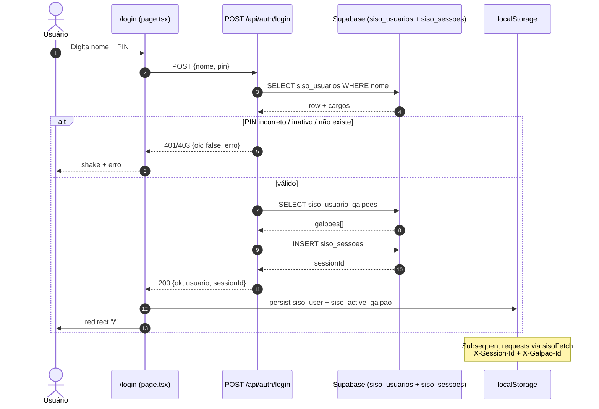
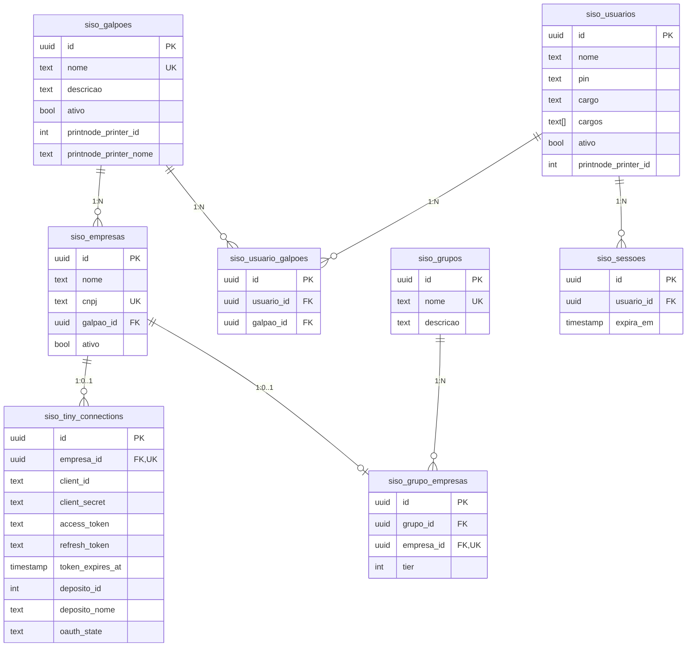
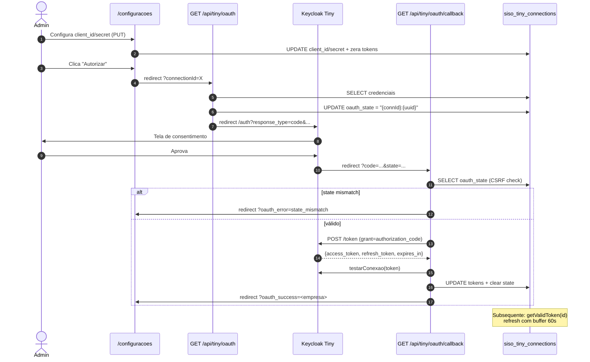

# 09 — Autenticação, Configuração e Hierarquia

> Doc da família **Fluxos do SISO**. Cobre autenticação por PIN, sessões, papéis (cargos), filtragem por papel/galpão, gestão da hierarquia **Galpão > Empresa > Grupo**, integração OAuth2 com **Tiny ERP** por empresa, configuração de **PrintNode** e CRUD de usuários.
>
> Pré-requisitos: conhecimento básico de Next.js App Router, Supabase service-role client, OAuth2 Authorization Code Flow.

## Sumário

1. [Visão geral](#1-visão-geral)
2. [Autenticação por PIN](#2-autenticação-por-pin)
   - [2.1 Por que custom (e não Supabase Auth)](#21-por-que-custom-e-não-supabase-auth)
   - [2.2 Endpoint POST /api/auth/login](#22-endpoint-post-apiauthlogin)
   - [2.3 AuthProvider, sessão e localStorage](#23-authprovider-sessão-e-localstorage)
   - [2.4 sisoFetch wrapper](#24-sisofetch-wrapper)
   - [2.5 getSessionUser e validação no servidor](#25-getsessionuser-e-validação-no-servidor)
   - [2.6 Expiração e renovação](#26-expiração-e-renovação)
   - [2.7 Diagrama: fluxo de login](#27-diagrama-fluxo-de-login)
3. [Roles (Cargos)](#3-roles-cargos)
   - [3.1 Cargos suportados](#31-cargos-suportados)
   - [3.2 Tabela de permissões](#32-tabela-de-permissões)
   - [3.3 Filtragem role-based de pedidos](#33-filtragem-role-based-de-pedidos)
   - [3.4 Páginas admin-only](#34-páginas-admin-only)
4. [Hierarquia Galpão > Empresa > Grupo](#4-hierarquia-galpão--empresa--grupo)
   - [4.1 Modelo conceitual](#41-modelo-conceitual)
   - [4.2 CRUD em /configuracoes](#42-crud-em-configuracoes)
   - [4.3 Endpoint GET /api/admin/galpoes (hierarquia)](#43-endpoint-get-apiadmingalpoes-hierarquia)
   - [4.4 CRUD de empresas](#44-crud-de-empresas)
   - [4.5 CRUD de grupos e tier](#45-crud-de-grupos-e-tier)
   - [4.6 Diagrama ER simplificado](#46-diagrama-er-simplificado)
5. [Tiny OAuth2 (per empresa)](#5-tiny-oauth2-per-empresa)
   - [5.1 Por que OAuth2 e não API key](#51-por-que-oauth2-e-não-api-key)
   - [5.2 Configuração inicial da conexão](#52-configuração-inicial-da-conexão)
   - [5.3 Fluxo de autorização (Authorization Code)](#53-fluxo-de-autorização-authorization-code)
   - [5.4 Refresh automático com buffer de 60s](#54-refresh-automático-com-buffer-de-60s)
   - [5.5 Test connection](#55-test-connection)
   - [5.6 Seleção de depósito](#56-seleção-de-depósito)
   - [5.7 Diagrama: OAuth2 por empresa](#57-diagrama-oauth2-por-empresa)
6. [PrintNode](#6-printnode)
   - [6.1 API Key global](#61-api-key-global)
   - [6.2 Listagem e teste de impressoras](#62-listagem-e-teste-de-impressoras)
   - [6.3 Impressora padrão por galpão](#63-impressora-padrão-por-galpão)
   - [6.4 Override por usuário](#64-override-por-usuário)
7. [Usuários](#7-usuários)
   - [7.1 Modelo de dados](#71-modelo-de-dados)
   - [7.2 CRUD admin-only](#72-crud-admin-only)
   - [7.3 Multi-cargo e multi-galpão](#73-multi-cargo-e-multi-galpão)
8. [Side effects](#8-side-effects)
9. [Erros conhecidos](#9-erros-conhecidos)

---

## 1. Visão geral

O módulo de autenticação e configuração estabelece **quem pode operar o SISO**, **em que escopo** (galpão, empresa, grupo) e **com quais credenciais externas** (Tiny, PrintNode). Ele é a fundação que sustenta os fluxos 01–08:

- Sem `siso_usuarios` + `siso_sessoes`, nenhuma chamada autenticada (`getSessionUser`) funciona.
- Sem `siso_galpoes` + `siso_empresas`, o webhook do Tiny não consegue resolver `empresaId` por CNPJ (ver `01-webhook-pedido.md`).
- Sem `siso_grupos` + `siso_grupo_empresas`, o `grupo-resolver.ts` não consegue agregar estoque entre empresas (ver `04-execucao-worker.md`).
- Sem `siso_tiny_connections` autorizadas via OAuth2, nenhum `tinyFetch` sobrevive (ver `01-webhook-pedido.md` § Identificação).
- Sem `PRINTNODE_API_KEY` em `siso_configuracoes` + `printnode_printer_id` em galpão/usuário, etiquetas não saem (ver `06-embalagem-expedicao-etiquetas.md`).

A arquitetura é **dois eixos ortogonais**:

```
        Eixo de identidade            ×             Eixo de escopo
        ─────────────────                            ───────────────
        siso_usuarios (PIN)                          siso_galpoes
        siso_sessoes (token)                         siso_empresas (CNPJ)
        cargos[] (admin/operador/                    siso_grupos
                  comprador/legacy)                  siso_grupo_empresas (tier)
        siso_usuario_galpoes (M:N)                   siso_tiny_connections (OAuth2)
```

Cada usuário tem um conjunto de **cargos** (capacidades) e um conjunto de **galpões permitidos** (escopo). Cada empresa tem **um galpão pai** + **opcionalmente um grupo** (com tier). Cada conexão Tiny é **per empresa** (não per galpão), porque cada empresa tem seu próprio CNPJ + conta Tiny + token OAuth2.

---

## 2. Autenticação por PIN

### 2.1 Por que custom (e não Supabase Auth)

O SISO não usa Supabase Auth. As razões registradas no código:

1. **Operação chão-de-fábrica.** Operadores entram dezenas de vezes por dia, em terminais compartilhados. Email + senha é caro de digitar e exige reset por e-mail; PIN de 4 dígitos resolve em 2s.
2. **Sem self-signup.** Todo usuário é cadastrado por admin (`/admin/usuarios`). Não há fluxo público de cadastro, esqueci-senha, magic-link.
3. **Acoplamento direto a `siso_usuarios`.** O modelo de cargos + galpões é altamente custom; integrar com a tabela `auth.users` do Supabase exigiria joins extras a cada request.
4. **Sessão controlada do lado do servidor.** `siso_sessoes` é uma tabela própria com TTL (`expira_em`), permitindo invalidar sessões em massa via SQL ou política de limpeza.
5. **Service-role onipresente.** Todas as rotas usam `createServiceClient()` (service-role), que ignora RLS. A verificação de identidade fica explícita em cada handler via `getSessionUser(request)`.

Trade-off: sem Supabase Auth não há OAuth social, MFA, password policies ou recuperação automática. Para esse domínio, é desejável.

### 2.2 Endpoint POST /api/auth/login

Definido em `src/app/api/auth/login/route.ts:10-100`. Fluxo:

1. **Parse do body** — `{ nome, pin }`. Erros 400 se JSON inválido ou campos ausentes.
2. **Lookup em `siso_usuarios`** — `select id, nome, pin, cargo, cargos, ativo where nome = $1 single()`.
3. **Validações:**
   - 401 `Usuário não encontrado` se row inexistente.
   - 403 `Usuário desativado` se `ativo = false`.
   - 401 `PIN incorreto` se `usuario.pin !== pin`. ⚠️ **Comparação em texto puro** (PIN não é hashed — ver § 8 Side effects).
4. **Resolução de galpões permitidos** — JOIN em `siso_usuario_galpoes` filtrando por `usuario_id`. Lista ordenada por `nome` em pt-BR é embutida no payload.
5. **Criação de sessão** — `INSERT INTO siso_sessoes(usuario_id)` retornando `id`. Se falhar, 500 + `logger.error("auth/login", ...)`.
6. **Resposta** — `{ ok: true, usuario: { id, nome, cargo, cargos, galpoes }, sessionId }`.

Repare:
- O `cargo` (singular) é mantido em `siso_usuarios.cargo` por compatibilidade com migrações antigas; o array `cargos` é a fonte de verdade nova.
- `cargos: usuario.cargos?.length ? usuario.cargos : [usuario.cargo]` garante backward-compat para rows pré-migração de multi-cargo.

### 2.3 AuthProvider, sessão e localStorage

`src/lib/auth-context.tsx:102-197` define o `AuthProvider`. Pontos-chave:

- **`STORAGE_KEY = "siso_user"`** (`auth-context.tsx:39`) — armazena o objeto `AuthUser` em `localStorage`.
- **`GALPAO_KEY = "siso_active_galpao"`** (`auth-context.tsx:40`) — armazena o `galpaoId` ativo (filtro de UI).
- **Hidratação evitando mismatch** — `useHydrated()` em `auth-context.tsx:96-100` usa `useSyncExternalStore` para distinguir SSR (false) de cliente (true) sem hydration warnings.
- **`resolveInitialGalpaoId(galpoes, cargos, stored)`** (`auth-context.tsx:81-94`):
  - Se usuário tem 0 galpões → null (admin com `cargos=['admin']` típico).
  - Se stored é válido (presente em `galpoes`) → mantém.
  - Se tem 1 galpão → seleciona.
  - Se admin → null (vê todos).
  - Senão → primeiro galpão.
- **`login(nome, pin)`** (`auth-context.tsx:136-171`):
  1. POST `/api/auth/login`.
  2. Constrói `AuthUser` com `cargos` resolvidos.
  3. Persiste em `localStorage[STORAGE_KEY]`.
  4. Resolve galpão inicial e persiste em `localStorage[GALPAO_KEY]`.
  5. `queryClient.invalidateQueries()` força refetch de tudo.
- **`logout()`** (`auth-context.tsx:173-179`) — remove ambas chaves, zera estado, `queryClient.clear()`.
- **`setActiveGalpao(galpaoId)`** (`auth-context.tsx:116-132`) — valida e persiste novo galpão ativo, depois invalida queries (forçando refetch com novo `X-Galpao-Id`).

### 2.4 sisoFetch wrapper

Definido em `auth-context.tsx:209-224`. É o **fetch padrão de toda chamada autenticada** do frontend:

```ts
export function sisoFetch(url, init?) {
  const stored = getStoredUser();
  const sessionId = stored?.sessionId;
  if (!sessionId) return fetch(url, init);

  const headers = new Headers(init?.headers);
  headers.set("X-Session-Id", sessionId);

  const galpaoId = getStoredGalpaoId();
  if (galpaoId) headers.set("X-Galpao-Id", galpaoId);

  return fetch(url, { ...init, headers });
}
```

- Se o usuário não está logado, faz fetch normal (rotas públicas).
- Se logado, anexa `X-Session-Id` e (se houver) `X-Galpao-Id`.
- **Não** faz refresh automático em 401 — qualquer rota deve revalidar e o usuário será redirecionado a `/login` via `AppShell`.

### 2.5 getSessionUser e validação no servidor

`src/lib/session.ts:22-99` é o **gateway server-side** chamado em quase toda rota protegida.

```ts
export interface SessionUser {
  id: string;
  nome: string;
  cargo: string;
  cargos: string[];
  galpaoId: string | null;
}
```

Algoritmo:

1. Lê `X-Session-Id` do header. Se ausente → null.
2. JOIN `siso_sessoes → siso_usuarios` filtrando por `id = sessionId AND expira_em > now()`. Se não existe ou expirou → null + `logger.warn("session", "Session not found or expired")`.
3. Resolve `cargos` (com fallback para `[cargo]` legado).
4. **Resolução de galpão**, em ordem de prioridade:
   - **(a) `X-Galpao-Id` header** (`session.ts:56-76`): se presente, valida via `siso_usuario_galpoes` que esse galpão pertence ao usuário. Se OK → usa.
   - **(b) Fallback legado por cargo** (`session.ts:78-90`): se `cargos` inclui `operador_cwb` → galpão "CWB"; `operador_sp` → galpão "SP". Lookup em `siso_galpoes.nome`.
   - **(c) Senão** → `galpaoId: null` (admin/comprador típico).
5. Retorna `SessionUser`.

Side effect importante: **não atualiza `expira_em` automaticamente** — sessões são fixed-TTL. Renovação ocorre apenas em novo login.

### 2.6 Expiração e renovação

- `siso_sessoes.expira_em` é definido por DEFAULT na coluna (TTL configurável; tipicamente alguns dias).
- `getSessionUser` filtra por `expira_em > now()` (`session.ts:36`). Sessão expirada → 401.
- Não há endpoint de refresh. Em 401, o frontend redireciona a `/login` (via `AppShell`).
- Logout simplesmente remove `localStorage`. A row em `siso_sessoes` continua até expirar — é seguro porque ninguém mais terá o `sessionId`.

> **Recomendação operacional:** policies de limpeza periódica (CRON ou trigger) para sessões expiradas. Atualmente não há. A tabela cresce monotônica.

### 2.7 Diagrama: fluxo de login



---

## 3. Roles (Cargos)

### 3.1 Cargos suportados

Definidos em `src/types/index.ts:463`:

```ts
export type Cargo = "admin" | "operador" | "operador_cwb" | "operador_sp" | "comprador";
```

| Cargo | Significado | Origem |
|---|---|---|
| `admin` | Acesso total. Vê todos galpões. Único cargo que pode CRUD usuários e ler `siso_erros`. | Cargo principal. |
| `operador` | Cargo novo, multi-galpão. Vê pedidos dos galpões em `siso_usuario_galpoes`. Pode operar separação, embalagem, expedição. | Migração 2026-Q1. |
| `operador_cwb` | **Legado.** Operador exclusivo do galpão CWB. Resolvido por nome de galpão em `session.ts:80-90`. | Pré-multi-galpão. |
| `operador_sp` | **Legado.** Operador exclusivo do galpão SP. | Pré-multi-galpão. |
| `comprador` | Vê apenas pedidos com `decisao_final = 'oc'` e itens de compra. Sem acesso a separação. | Cargo desde início. |

> ⚠️ Os cargos `operador_cwb`/`operador_sp` permanecem aceitos em validação (`VALID_CARGOS` em `src/app/api/admin/usuarios/route.ts:4`) e em `filtrar-pedidos.ts` para backward-compat, mas o frontend de criação/edição (`src/app/admin/usuarios/page.tsx:38`) só expõe `admin | operador | comprador`. Editar um usuário legado normaliza para `operador` (`page.tsx:601-606`).

### 3.2 Tabela de permissões

| Capacidade | admin | operador | operador_cwb/sp | comprador |
|---|:---:|:---:|:---:|:---:|
| Acessar `/siso` (painel de pedidos pendentes) | ✓ | ✓ (filtrado por galpão) | ✓ (CWB ou SP) | ✓ (apenas `oc`) |
| Acessar `/separacao`, `/separacao/checklist`, `/separacao/embalagem` | ✓ | ✓ | ✓ | ✗ |
| Acessar `/compras` e `/compras/conferencia/[id]` | ✓ | ✓ | ✓ | ✓ |
| Acessar `/inventario` e `/transferencias` | ✓ | ✓ | ✓ | ✗ |
| Acessar `/etiquetas` | ✓ | ✓ | ✓ | ✗ |
| Acessar `/pedidos` (universal tracking) | ✓ | ✓ (filtrado) | ✓ (filtrado) | ✓ (apenas `oc`) |
| Acessar `/painel/operacao` (Painel Operacional) | ✓ | ✓ | ✓ | ✗ |
| Acessar `/painel/gerencial` (Painel Gerencial) | ✓ | ✗ | ✗ | ✗ |
| Acessar `/configuracoes` | ✓ | ✗ | ✗ | ✗ |
| Acessar `/admin/usuarios` | ✓ | ✗ | ✗ | ✗ |
| CRUD `siso_galpoes`, `siso_empresas`, `siso_grupos` | ✓ | ✗ | ✗ | ✗ |
| Salvar/remover PrintNode API key | ✓ | ✗ | ✗ | ✗ |
| Listar impressoras / testar conexão PrintNode | ✓ | ✗ | ✗ | ✗ |
| Configurar credenciais OAuth2 Tiny | ✓ | ✗ | ✗ | ✗ |
| Aprovar/rejeitar pedidos | ✓ | ✓ (do galpão) | ✓ (do galpão) | ✓ (apenas `oc`) |

Observações:
- A maioria das verificações de admin é feita **no servidor** lendo o cargo via `siso_usuarios.cargos`. Algumas rotas PrintNode usam `x-siso-user-id` header (legado) em vez de `X-Session-Id` (`api/admin/printnode/api-key/route.ts:12-26`).
- O frontend filtra UI antes do request, mas a checagem definitiva é sempre no backend.

### 3.3 Filtragem role-based de pedidos

Existem **duas estratégias** convivendo em `src/lib/filtrar-pedidos.ts`:

#### 3.3.1 Por galpão (atual)

Funções `filtrarPendentesGalpao`, `filtrarConcluidosGalpao`, `filtrarAutoGalpao` (`filtrar-pedidos.ts:9-40`):

- Recebem `galpaoNome: string | null`. Se `null` (admin “Todos”), retorna tudo.
- Filtram por `pedido.filialOrigem === galpaoNome`.
- Para `concluidos`, considera `decisaoFinal ?? sugestao` e mantém apenas `propria` ou `transferencia` no galpão de origem (OC volta para a aba de compras).

#### 3.3.2 Por cargo (deprecated)

Funções `filtrarPendentes`, `filtrarConcluidos`, `filtrarAuto` (`filtrar-pedidos.ts:59-154`) — marcadas como `@deprecated`. Mapeiam:

- `admin` → tudo.
- `comprador` → `sugestao === "oc"` (pendentes) / `decisaoFinal === "oc"` (concluídos).
- `operador_cwb` → `filialOrigem === "CWB"`. Idem `operador_sp`.

São mantidas porque alguns componentes ainda recebem `cargos` em vez de `galpaoNome`. A migração para a versão por galpão está em andamento.

#### 3.3.3 Aplicação no backend (`/api/pedidos/tracking`)

`src/app/api/pedidos/tracking/route.ts:99-109` aplica filtragem coerente:

```
isAdmin       → sem filtro de empresa
isComprador   → q.eq("decisao_final", "oc")
operador      → q.in("empresa_origem_id", empresaIdsDoGalpao)
```

Onde `empresaIdsDoGalpao` é resolvido via SELECT em `siso_empresas WHERE galpao_id = session.galpaoId` (`tracking/route.ts:182-191`).

A mesma estratégia aparece em `/api/pedidos/[id]/detalhe` (`detalhe/route.ts:52-70`) e `/api/dashboard/counts` (`counts/route.ts:21-89`).

### 3.4 Páginas admin-only

- `/admin/usuarios` — `<AppShell requireAdmin={true}>` em `src/app/admin/usuarios/page.tsx:94`.
- `/configuracoes` — não tem `requireAdmin`, mas componentes internos verificam:
  - `PrintNodeSection` retorna `null` se `!cargos.includes("admin")` (`printnode-section.tsx:54`).
  - `GalpoesEmpresasSection` exibe tudo independente de cargo (mas as ações POST falham 401/403 sem `X-Session-Id` admin).
- `/painel/gerencial` — admin-only (acesso restringido na UI; sem `requireAdmin` formal mas dados são executivos).

`AppShell.requireAdmin` redireciona usuários não-admin de volta a `/`.

---

## 4. Hierarquia Galpão > Empresa > Grupo

### 4.1 Modelo conceitual

| Conceito | Tabela | Responsabilidade |
|---|---|---|
| **Galpão** | `siso_galpoes` | Local físico (CWB, SP, BH...). Pode ter N empresas. Tem impressora padrão (`printnode_printer_id`). |
| **Empresa** | `siso_empresas` | Conta Tiny com CNPJ próprio (NetAir, NetParts...). FK obrigatória para `galpao_id`. Possui no máximo 1 conexão Tiny ativa. |
| **Grupo** | `siso_grupos` | Agrupamento de afinidade de negócio (Autopeças, Eletrodomésticos...). Empresas do mesmo grupo **consultam estoque entre si**. |
| **Tier** | `siso_grupo_empresas.tier` | Prioridade de dedução de estoque dentro do grupo. Tier 1 deduz primeiro. **Em runtime**, a empresa que recebeu o pedido sempre é tier 1 (override). |

A regra de afinidade é simples: **se uma empresa NetAir (CWB) recebe um pedido de produto que ela não tem, mas a empresa NetParts (SP) tem — e ambas estão no mesmo grupo — o sistema sugere transferência**. Sem grupo, não há consulta cruzada.

Detalhamento e ordem de dedução estão em `04-execucao-worker.md` § Tier-based deduction.

### 4.2 CRUD em /configuracoes

`src/app/configuracoes/page.tsx:20-141` é a página de configuração unificada. Estrutura:

1. **Links rápidos** para `/admin/usuarios` e `/monitoramento` (linhas 91-112).
2. **WebhookUrlCard** (linha 115) — exibe a URL pública `${origin}/api/webhook/tiny` para colar no Tiny. A mesma URL atende todas as empresas (identificação por CNPJ no payload).
3. **GalpoesEmpresasSection** (linha 118) — lista hierarquia, permite criar galpões/empresas/conexões.
4. **GruposSection** (linha 126) — CRUD de grupos e associação de empresas (com tier).
5. **PrintNodeSection** (linha 134) — admin-only. API key, impressoras, override por usuário.

Carregamento inicial (`fetchAll`, `page.tsx:36-59`) faz 4 fetches em paralelo:

```
GET /api/tiny/connections   → conexões
GET /api/admin/galpoes       → galpões com empresas + conexões + grupos aninhados
GET /api/admin/grupos        → grupos com tier por empresa
GET /api/admin/usuarios      → usuários com galpões (para PrintNode override)
```

### 4.3 Endpoint GET /api/admin/galpoes (hierarquia)

`src/app/api/admin/galpoes/route.ts:8-70` retorna a árvore inteira:

```sql
siso_galpoes
  └── siso_empresas
       ├── siso_grupo_empresas
       │    └── siso_grupos (id, nome)
       └── siso_tiny_connections (id, ativo, ultimo_teste_ok,
                                  is_authorized:access_token,
                                  deposito_id, deposito_nome)
```

Transformações no servidor (`route.ts:34-67`):
- Cada empresa ganha `grupo: { id, nome } | null` e `tier: number | null` (do primeiro `siso_grupo_empresas`).
- Conexão Tiny vira `conexao: { id, ativo, conectado: !!access_token, ultimoTesteOk, depositoId, depositoNome } | null`.
- O `is_authorized:access_token` no SELECT é uma renomeação Postgres-style: a coluna `access_token` é exposta como booleano-ish via cast no client (presença = autorizado).

POST cria galpão simples (`route.ts:76-99`):
- Body: `{ nome, descricao? }`. Trim obrigatório.
- 23505 (unique violation) → 409 “Já existe um galpão com esse nome”.
- Retorna `{ id, nome }`.

PUT em `[id]/route.ts:7-38`:
- Body parcial: `nome`, `descricao`, `ativo`, `printnode_printer_id`, `printnode_printer_nome`.
- Atualiza `atualizado_em` automaticamente.

> ⚠️ Não existe DELETE de galpão. Para "remover", use `PUT { ativo: false }`. Empresas vinculadas continuam, mas perdem visibilidade.

### 4.4 CRUD de empresas

`src/app/api/admin/empresas/route.ts`:

- **GET** (`route.ts:8-17`) — lista plana de `siso_empresas`. Ordenado por `nome`.
- **POST** (`route.ts:22-57`) — body `{ nome, cnpj, galpao_id }`:
  1. Sanitiza CNPJ via `cleanCnpj = cnpj.replace(/\D/g, "")`.
  2. Insert. 23505 → 409 “CNPJ já cadastrado”.
  3. **Cria automaticamente uma row em `siso_tiny_connections`** com `filial: "CWB"` (placeholder legado), `nome_empresa`, `cnpj`, `token: ""`, `empresa_id`. A conexão fica não-autorizada (sem `client_id`/`client_secret`/`access_token`).
  4. `clearEmpresaCache()` (`empresa-lookup.ts`) — derruba cache de CNPJ→empresa para que próximo webhook reconheça a nova empresa.
- **PUT em `[id]/route.ts:7-35`** — body parcial `{ nome?, galpao_id?, ativo? }`. Atualiza `atualizado_em`. Limpa cache.
- Não existe DELETE.

Para "desconectar" uma empresa (remover credenciais Tiny + desativar), use **DELETE /api/tiny/connections** (`src/app/api/tiny/connections/route.ts:109-143`):
1. Deleta row de `siso_tiny_connections`.
2. UPDATE `siso_empresas SET ativo = false`.
3. `clearEmpresaCache()`.

### 4.5 CRUD de grupos e tier

#### 4.5.1 Grupos

`src/app/api/admin/grupos/route.ts`:

- **GET** (`route.ts:7-22`) — lista grupos com `siso_grupo_empresas` aninhado, cada um com tier + empresa básica (id, nome, cnpj). Ordenado por nome.
- **POST** (`route.ts:27-50`) — body `{ nome, descricao? }`. 23505 → 409.
- **PUT [id]** (`[id]/route.ts:7-32`) — body parcial `{ nome?, descricao? }`.
- Não existe DELETE.

#### 4.5.2 Empresas dentro de grupo

`src/app/api/admin/grupos/[id]/empresas/route.ts:9-44`:
- **POST** body `{ empresa_id, tier? = 1 }`. 23505 → 409 “Empresa já pertence a um grupo” (cada empresa só pode estar em um grupo). `clearGrupoCache()` invalida cache de resolução.

`src/app/api/admin/grupos/[id]/empresas/[empresaId]/route.ts`:
- **PUT** (`route.ts:9-36`) — body `{ tier }`. Validação: `tier >= 1`. `clearGrupoCache()`.
- **DELETE** (`route.ts:42-61`) — remove empresa do grupo. `clearGrupoCache()`.

> Importante: a empresa **continua existindo**; apenas a relação com o grupo é apagada. Empresa sem grupo não participa de consultas cross-empresa de estoque.

### 4.6 Diagrama ER simplificado



---

## 5. Tiny OAuth2 (per empresa)

### 5.1 Por que OAuth2 e não API key

O Tiny ERP v3 substituiu API keys por OAuth2 (Authorization Code) com Keycloak. Motivos:

1. **Multi-tenant nativo.** Cada empresa cadastra um app no portal Tiny e gera um par `client_id`/`client_secret`. Cada par autentica apenas a empresa dona. Não há risco de uma empresa ler dados de outra.
2. **Tokens de curta vida.** `access_token` expira em ~3600s e exige `refresh_token`. Em caso de vazamento, a janela de exposição é mínima.
3. **Revogação granular.** Revogar uma empresa não afeta as outras (cada empresa tem seu refresh próprio).
4. **Padrão de mercado.** Permite usar bibliotecas OAuth2 padrão (URLSearchParams + `application/x-www-form-urlencoded`).

Trade-off: o flow exige um **redirect Tiny → SISO**, o que demanda a URL pública estar acessível e cadastrada no app Tiny.

### 5.2 Configuração inicial da conexão

A row em `siso_tiny_connections` é criada automaticamente quando uma empresa é criada (ver § 4.4). Inicialmente fica vazia (`client_id = NULL`, `access_token = NULL`).

Na UI (`/configuracoes`), o admin clica em uma empresa, expande, e:

1. **Configura credenciais** (`ConnectionCard.handleSaveCredentials`, `connection-card.tsx:80-110`):
   - PUT `/api/tiny/connections` com `{ id, client_id, client_secret }`.
   - Backend (`src/app/api/tiny/connections/route.ts:149-204`) atualiza `client_id` + `client_secret` e **zera tokens existentes** (`access_token`, `refresh_token`, `token_expires_at`, `token`, `ultimo_teste_em`, `ultimo_teste_ok`). Isso força nova autorização.
2. **Copia URL de redirect** (`ConnectionCard:71-78`) — `${origin}/api/tiny/oauth/callback`. O admin cola essa URL no portal Tiny.
3. **Clica em "Autorizar"** (`ConnectionCard.handleAuthorize`, `connection-card.tsx:112-114`) — navega o browser para `/api/tiny/oauth?connectionId=X`.

### 5.3 Fluxo de autorização (Authorization Code)

#### 5.3.1 Iniciação — `GET /api/tiny/oauth`

`src/app/api/tiny/oauth/route.ts:11-63`:

1. Lê `connectionId` da query.
2. SELECT `siso_tiny_connections`. 404 se não existe; 400 se sem `client_id`/`client_secret`.
3. **Gera state CSRF** — `${connectionId}:${crypto.randomUUID()}` (`route.ts:42`). Salva em `siso_tiny_connections.oauth_state`.
4. Resolve **redirect URI público** lendo `x-forwarded-proto` + `x-forwarded-host` (suporte a reverse proxy):
   ```
   redirectUri = `${proto}://${host}/api/tiny/oauth/callback`
   ```
5. Constrói URL de authorize via `buildAuthorizeUrl` (`tiny-oauth.ts:26-38`):
   ```
   https://accounts.tiny.com.br/realms/tiny/protocol/openid-connect/auth
     ?response_type=code
     &client_id={clientId}
     &redirect_uri={redirectUri}
     &scope=openid
     &state={state}
   ```
6. **`NextResponse.redirect(authorizeUrl)`** — browser vai para Keycloak.

#### 5.3.2 Callback — `GET /api/tiny/oauth/callback`

`src/app/api/tiny/oauth/callback/route.ts:12-91`:

1. Extrai `code`, `state`, `error` da query.
2. Reconstrói `publicOrigin` (mesma lógica de `x-forwarded-*`).
3. Trata erro do provedor: redirect `/configuracoes?oauth_error=<msg>`.
4. Extrai `connectionId` do prefixo do `state` (parte antes do `:`).
5. **Validação CSRF**: SELECT em `siso_tiny_connections WHERE id = connectionId`, compara `oauth_state`. Mismatch → redirect `?oauth_error=state_mismatch`.
6. **Troca code por tokens** via `exchangeCodeForTokens` (`tiny-oauth.ts:49-75`):
   ```
   POST https://accounts.tiny.com.br/realms/tiny/protocol/openid-connect/token
     Content-Type: application/x-www-form-urlencoded

     grant_type=authorization_code
     &code={code}
     &client_id={clientId}
     &client_secret={clientSecret}
     &redirect_uri={redirectUri}
   ```
   Resposta: `{ access_token, refresh_token, expires_in, token_type }`.
7. **Testa imediatamente** o token via `testarConexao(access_token)` (`callback/route.ts:66`).
8. UPDATE `siso_tiny_connections` com tokens, expiry, limpa `oauth_state`, registra `ultimo_teste_em` + `ultimo_teste_ok`.
9. Redirect `/configuracoes?oauth_success=<filial>`.

A tela `/configuracoes` lê `searchParams` (`page.tsx:65-77`) e exibe toast de sucesso.

### 5.4 Refresh automático com buffer de 60s

`src/lib/tiny-oauth.ts:111-180` é a função central usada por **todas** as chamadas Tiny:

```ts
export async function getValidToken(connectionId: string): Promise<string> {
  // 1. SELECT access_token, refresh_token, token_expires_at, client_id, client_secret
  // 2. Valida que tokens existem e credenciais estão configuradas
  // 3. Se token_expires_at > now + 60_000ms → retorna access_token atual
  // 4. Senão → POST refresh_token → UPDATE → retorna novo access_token
}
```

Pontos:
- **Buffer de 60s** (`tiny-oauth.ts:136`) evita race condition: se a request demora >5s, o token ainda está válido durante toda a chamada.
- Erros de refresh são logados via `logger.logError({ category: "auth", severity: "critical" })` e re-lançados — quem chamar precisa tratar.
- O endpoint Keycloak rota refresh: `POST .../token` com `grant_type=refresh_token`.
- Tokens novos sobrescrevem `access_token` + `refresh_token` (refresh tokens são rotativos no Tiny).

A função wrapper `getValidTokenByEmpresa(empresaId)` (`tiny-oauth.ts:188-204`) faz o lookup `empresa_id → connection_id → token`. É o entrypoint usado em `webhook-processor.ts`, `execution-worker.ts`, `agrupamento-service.ts`, etc.

### 5.5 Test connection

`POST /api/tiny/test-connection` (`src/app/api/tiny/test-connection/route.ts:11-41`):

1. Body `{ connectionId }`.
2. `getValidToken(connectionId)` — força refresh se necessário.
3. `testarConexao(token)` em `tiny-api.ts` (faz GET em endpoint leve).
4. UPDATE `ultimo_teste_em` + `ultimo_teste_ok` em `siso_tiny_connections`.
5. Retorna `{ ok, nome?, erro? }`.

Útil para diagnosticar:
- **Credenciais erradas** — refresh falha, exception é capturada e retorna `{ ok: false, erro }`.
- **Token revogado pelo Tiny** — refresh retorna 400/401 do Keycloak.
- **Empresa não autorizada** — `getValidToken` lança `Connection not authorized`.

### 5.6 Seleção de depósito

Cada empresa Tiny tem múltiplos depósitos (warehouses). O SISO precisa saber **qual depósito** ler para estoque e movimentações.

`GET /api/tiny/deposits?connectionId=X` (`src/app/api/tiny/deposits/route.ts:11-41`):
1. Verifica que conexão existe e está autorizada.
2. `getValidToken` + `listarDepositos(token)` (em `tiny-api.ts`).
3. Retorna `[{ id, nome }]`.

> O Tiny v3 **não tem endpoint dedicado `/depositos`**. `listarDepositos` faz GET em `/estoque/{produtoId}` e extrai o array `depositos[]` do retorno (qualquer produto serve, contanto que tenha estoque).

A UI `DepositoSelector` (`src/components/configuracoes/deposito-selector.tsx`) renderiza um `<select>` e salva via PUT `/api/tiny/connections` `{ id, deposito_id, deposito_nome }`.

Sem depósito configurado, `webhook-processor.ts` e `execution-worker.ts` falham em encontrar a coluna `depositos` correta para enriquecer estoque.

### 5.7 Diagrama: OAuth2 por empresa



---

## 6. PrintNode

### 6.1 API Key global

A API key do PrintNode é **única para o sistema** (não per empresa). Reside em `siso_configuracoes` com chave `PRINTNODE_API_KEY`.

`/api/admin/printnode/api-key`:

- **GET** (`api-key/route.ts:11-39`):
  - Auth via header `x-siso-user-id` (legado — não usa `X-Session-Id`).
  - SELECT `siso_usuarios` → valida cargo `admin`.
  - Lê via `getConfig("PRINTNODE_API_KEY")`.
  - Retorna `{ configured: bool, masked: string | null }` — a key real **nunca** retorna; só uma máscara estilo `••••••••AB12`.
- **PUT** (`api-key/route.ts:46-71`) — body `{ api_key }`. Salva via `setConfig`.
- **DELETE** (`api-key/route.ts:77-97`) — `deleteConfig`. Limpa state na UI.

### 6.2 Listagem e teste de impressoras

- **POST `/api/admin/printnode/test`** (`test/route.ts:11-39`) — testa conexão via `testarConexao(apiKey)` em `lib/printnode.ts`. Retorna `{ ok, email?, error? }`.
- **GET `/api/admin/printnode/printers`** (`printers/route.ts:11-44`) — lista impressoras visíveis via `listarImpressoras(apiKey)`. Cada printer: `{ id, name, computer, state }`.

Ambos exigem cargo `admin` e API key configurada.

### 6.3 Impressora padrão por galpão

A impressora padrão é configurada por galpão (`siso_galpoes.printnode_printer_id`):

- UI em `PrintNodeSection.handleGalpaoPrinterChange` (`printnode-section.tsx:169-189`).
- PUT `/api/admin/galpoes/[id]` `{ printnode_printer_id, printnode_printer_nome }`.

Quando uma etiqueta precisa imprimir, o sistema resolve a impressora seguindo prioridade:

1. Impressora do **usuário** que fez a operação (se `siso_usuarios.printnode_printer_id` setado).
2. Impressora do **galpão** ativo (se setado).
3. Falha — exibe alerta "Galpão sem impressora configurada".

A regra de fallback é implementada em `lib/etiqueta-service.ts` (ver `06-embalagem-expedicao-etiquetas.md`).

### 6.4 Override por usuário

Cada usuário pode ter sua própria impressora preferida (útil quando opera em estação fixa):

- UI em `PrintNodeSection.handleUsuarioPrinterChange` (`printnode-section.tsx:191-212`).
- PUT `/api/admin/usuarios` `{ id, printnode_printer_id, printnode_printer_nome }`.

Override vazio (`null`) → usa o padrão do galpão.

---

## 7. Usuários

### 7.1 Modelo de dados

`siso_usuarios`:

```
id                       uuid PK
nome                     text UNIQUE (login)
pin                      text (4 dígitos, NÃO hashed)
cargo                    text   (legado, primeiro cargo)
cargos                   text[] (fonte de verdade)
ativo                    bool
criado_em                timestamp
atualizado_em            timestamp
printnode_printer_id     int    nullable
printnode_printer_nome   text   nullable
```

`siso_usuario_galpoes`:

```
id            uuid PK
usuario_id    uuid FK → siso_usuarios
galpao_id     uuid FK → siso_galpoes
UNIQUE (usuario_id, galpao_id)
```

`siso_sessoes`:

```
id            uuid PK    (sessionId enviado em X-Session-Id)
usuario_id    uuid FK
expira_em     timestamp  (TTL via DEFAULT)
criado_em     timestamp
```

### 7.2 CRUD admin-only

`src/app/api/admin/usuarios/route.ts`:

- **GET** (`route.ts:10-43`):
  - SELECT `siso_usuarios` (sem PIN). JOIN `siso_usuario_galpoes` para anexar galpões.
  - Normaliza `cargos = cargos?.length ? cargos : [cargo]`.
- **POST** (`route.ts:50-103`):
  - Body `{ nome, pin, cargos: string[] | cargo: string, galpao_ids? }`.
  - Validações:
    - `pin` exatamente 4 dígitos numéricos.
    - cada cargo em `VALID_CARGOS` (`route.ts:4`).
  - Insert + insert em batch em `siso_usuario_galpoes` se houver `galpao_ids`.
- **PUT** (`route.ts:110-183`):
  - Body parcial. `id` obrigatório.
  - Se `cargos` ou `cargo` mudou, valida e atualiza ambos (mantém legado em sync).
  - Se `galpao_ids` presente: DELETE all + INSERT novos (replace strategy).
  - Atualiza `atualizado_em`.
- **DELETE `?id=<uuid>`** (`route.ts:189-203`):
  - Delete físico. Galpão associations cascateiam.

### 7.3 Multi-cargo e multi-galpão

A UI em `/admin/usuarios` (`page.tsx:240-386`) suporta:

- **Multi-cargo** — botões toggle (`CargoMultiSelect`, `page.tsx:151-191`). Não permite remover o último cargo.
- **Multi-galpão** — apenas se `cargos.includes("operador")` (`page.tsx:257`). UI `GalpaoMultiSelect` (`page.tsx:195-238`).

Restrições:
- Usuário não pode editar a si mesmo (botões "Editar"/"Desativar"/"Excluir" omitidos quando `usuario.id === user?.id`, `page.tsx:530-579`).
- Cargos legados `operador_cwb`/`operador_sp` são normalizados para `operador` ao editar (`page.tsx:601-606`).

---

## 8. Side effects

### Em login bem-sucedido
- 📝 INSERT `siso_sessoes` (`auth/login/route.ts:71-87`).
- 📝 SELECT `siso_usuario_galpoes` JOIN `siso_galpoes`.
- 💾 `localStorage.siso_user` = JSON do usuário com sessionId.
- 💾 `localStorage.siso_active_galpao` = galpão resolvido (ou removido se null).
- 🔄 `queryClient.invalidateQueries()` força refetch global.

### Em criação/edição de empresa
- 📝 INSERT/UPDATE `siso_empresas`.
- 📝 INSERT `siso_tiny_connections` (placeholder, no caso de POST).
- 🧹 `clearEmpresaCache()` — invalida cache em `empresa-lookup.ts`.

### Em criação/edição de empresa em grupo
- 📝 INSERT/UPDATE/DELETE `siso_grupo_empresas`.
- 🧹 `clearGrupoCache()` — invalida cache em `grupo-resolver.ts`.

### Em PUT credenciais Tiny (client_id/secret)
- 📝 UPDATE `siso_tiny_connections.client_id`, `.client_secret`.
- 🧹 **Zera** `access_token`, `refresh_token`, `token_expires_at`, `token`, `ultimo_teste_em`, `ultimo_teste_ok`.
- A próxima chamada `getValidToken` falhará com `Connection not authorized`, forçando re-autorização.

### Em OAuth callback bem-sucedido
- 📝 UPDATE `siso_tiny_connections` com tokens, expiry, `oauth_state = NULL`, `ultimo_teste_em`, `ultimo_teste_ok`.
- 📡 POST Keycloak `/token` (troca code).
- 📡 GET Tiny test endpoint (`testarConexao`).
- ↩️ Redirect 302 para `/configuracoes?oauth_success=<filial>`.

### Em refresh de token
- 📡 POST Keycloak `/token` (`grant_type=refresh_token`).
- 📝 UPDATE `siso_tiny_connections.access_token`, `.refresh_token`, `.token_expires_at`.
- 📝 INSERT `siso_logs` (info "Token refreshed successfully") + (em falha) `siso_erros` via `logger.logError({ category: "auth", severity: "critical" })`.

### Em criação/edição de usuário
- 📝 INSERT/UPDATE `siso_usuarios`.
- 📝 DELETE/INSERT `siso_usuario_galpoes` (replace).

### Em DELETE de conexão Tiny
- 📝 DELETE `siso_tiny_connections WHERE empresa_id = X`.
- 📝 UPDATE `siso_empresas SET ativo = false`.
- 🧹 `clearEmpresaCache()`.

### Segurança
- ⚠️ **PIN é armazenado em texto puro**. A coluna `siso_usuarios.pin` é `text`, sem hash. A comparação em `auth/login/route.ts:48` é byte-a-byte. Mitigações praticadas:
  - PIN curto (4 dígitos) tem alfabeto pequeno; brute-force por API tem custo razoável mas é detectável (não há rate-limiting explícito de login).
  - Usuários ativos são sempre cadastrados por admin; não há vazamento por self-signup.
  - `localStorage.siso_user` contém PIN? **Não** — apenas `id`, `nome`, `cargo`, `cargos`, `sessionId`, `galpoes`. PIN nunca sai do servidor após validação.
- ⚠️ **Sessão sem rotação**. Mesma `sessionId` é usada até `expira_em`. Se vazar, atacante pode reusar até a expiração.
- ⚠️ **Sem CSRF para mutations**. Service-role + ausência de cookies (header-based) reduzem o risco; mas APIs com `X-Session-Id` são vulneráveis a abuso se header for replicado.
- ✅ **CSRF para OAuth** — `oauth_state` (`route.ts:42`) protege o callback contra cross-site reuse.

---

## 9. Erros conhecidos

A base de conhecimento `erros-conhecidos.yaml` (raiz do projeto) catalogou as seguintes ocorrências relevantes a este módulo:

| ID | Categoria | Sintoma | Causa raiz | Fix |
|---|---|---|---|---|
| `localizacao-sku-nulo-tiny-put` | external_api | `Tiny PUT /produtos/{id} 400: campo sku — não deve ser nulo` | `atualizarLocalizacaoProduto` lia `descricao` mas não `sku`; Tiny v3 exige sku no PUT | Inclui `sku` no GET prévio e no body PUT |

Erros sintomáticos relacionados a auth/configuração que **não** estão no YAML mas são frequentes em campo:

- **`Connection not authorized — complete OAuth2 flow first`** (`tiny-oauth.ts:124`):
  - Causa típica: admin alterou `client_id`/`client_secret` (PUT zera tokens) e não re-autorizou.
  - Fix operacional: `/configuracoes` → empresa → "Autorizar".

- **`Token refresh failed (400/401)`** (`tiny-oauth.ts:99`):
  - Causa típica: admin desconectou o app do Tiny; refresh_token foi revogado; relógio do servidor desincronizado.
  - Fix operacional: re-autorizar.

- **`Acesso restrito` (403) em rotas PrintNode**:
  - Causa: header `x-siso-user-id` ausente ou usuário não-admin.
  - Fix: garantir que a UI esteja chamando com `user.id` no header.

- **Operador legado (`operador_cwb`/`operador_sp`) sem galpão associado**:
  - Causa: usuário pré-migração não foi atualizado para `cargos: ["operador"]` + `galpao_ids`.
  - Fix: `session.ts:78-90` faz fallback nominal por nome do galpão. Se o galpão "CWB"/"SP" foi renomeado, a resolução falha e `galpaoId = null`.

- **CNPJ duplicado ao criar empresa**:
  - Causa: empresa com mesmo CNPJ já existe (eventualmente em outro galpão).
  - Fix: `siso_empresas.cnpj` é UNIQUE global. Reaproveitar a existente ou desativar a duplicada.

- **`Empresa já pertence a um grupo` ao tentar adicionar empresa em segundo grupo**:
  - Causa: `siso_grupo_empresas.empresa_id` é UNIQUE — uma empresa só pode estar em **um** grupo.
  - Fix: remover do grupo atual antes de adicionar ao novo.

### Convenção de log

Toda falha de auth deve ir para `siso_erros` via `logger.logError({ category: "auth", ... })`. Exemplos no código:

- `tiny-oauth.ts:151-159` — refresh failure marcado como `critical`.
- `auth/login/route.ts:78-83` — falha de criação de sessão é `error`.
- `session.ts:39` — sessão expirada é `warn` (não vai para `siso_erros`).

Para diagnosticar problemas de login/sessão em campo, consultar `siso_logs WHERE source = 'session' OR source = 'auth/login'` ordenado por timestamp DESC.

---

> **Próximos fluxos:** veja `10-dashboards-tracking-observabilidade.md` para o painel operacional, gerencial, tracking universal de pedidos, observações e logging estruturado.
