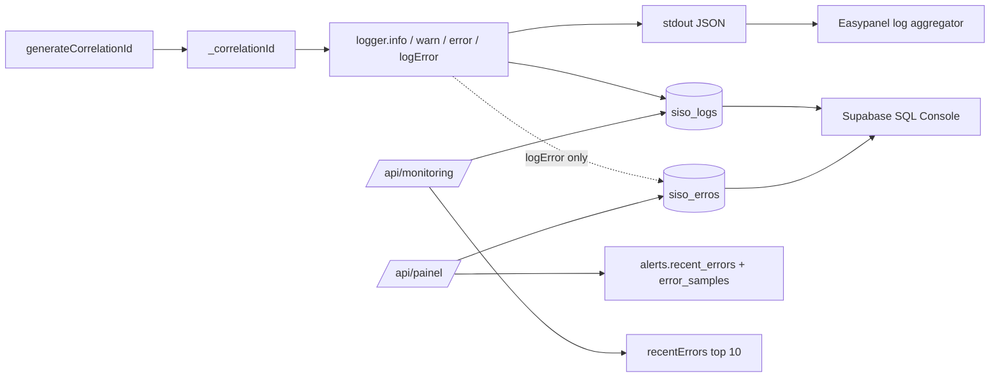
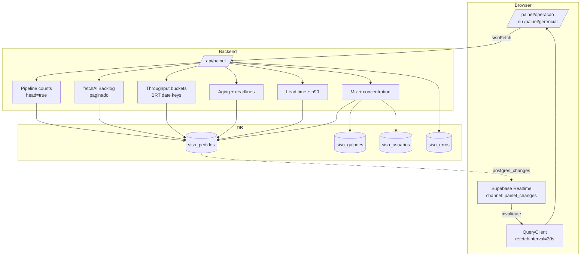
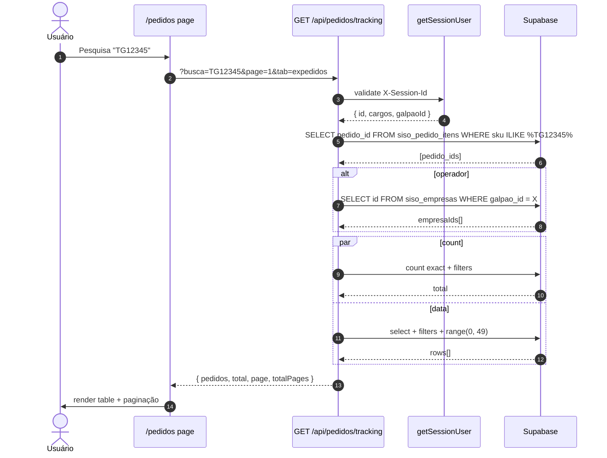
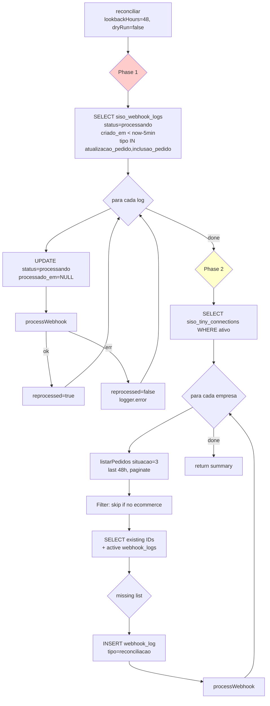

# 10 — Dashboards, Tracking e Observabilidade

> Doc da família **Fluxos do SISO**. Cobre o **Painel Operacional** (Torre de Controle), o **Painel Gerencial**, a página universal de pedidos `/pedidos`, o detalhamento `/pedidos/[id]` (itens, timeline, observações), reconciliação, dashboard de counts, logging estruturado e a base de conhecimento `erros-conhecidos.yaml`.
>
> Pré-requisitos: leitura prévia de `01-webhook-pedido.md`, `04-execucao-worker.md`, `05-separacao-wave-picking.md`, `09-auth-configuracao-hierarquia.md`. Conhecimento de TanStack React Query e Supabase Realtime.

## Sumário

1. [Visão geral](#1-visão-geral)
2. [Painel Operacional `/painel/operacao`](#2-painel-operacional-paineloperacao)
   - [2.1 Propósito e acesso](#21-propósito-e-acesso)
   - [2.2 Componentes da tela](#22-componentes-da-tela)
   - [2.3 Atualização (polling 30s + Supabase Realtime)](#23-atualização-polling-30s--supabase-realtime)
   - [2.4 Ação prioritária dinâmica](#24-ação-prioritária-dinâmica)
3. [Painel Gerencial `/painel/gerencial`](#3-painel-gerencial-painelgerencial)
4. [Torre de Controle `/api/painel`](#4-torre-de-controle-apipainel)
   - [4.1 Inputs e filtros](#41-inputs-e-filtros)
   - [4.2 Estrutura da resposta](#42-estrutura-da-resposta)
   - [4.3 Cálculos: pipeline, deadlines, aging, throughput](#43-cálculos-pipeline-deadlines-aging-throughput)
   - [4.4 Cálculos gerenciais: lead time, mix, concentração](#44-cálculos-gerenciais-lead-time-mix-concentração)
5. [Pedidos universal tracking `/pedidos`](#5-pedidos-universal-tracking-pedidos)
   - [5.1 Endpoint GET /api/pedidos/tracking](#51-endpoint-get-apipedidostracking)
   - [5.2 Tabs Pedidos / Expedidos](#52-tabs-pedidos--expedidos)
   - [5.3 Filtros, busca e paginação](#53-filtros-busca-e-paginação)
6. [Pedido detalhe `/pedidos/[id]`](#6-pedido-detalhe-pedidosid)
   - [6.1 Endpoint GET /api/pedidos/[id]/detalhe](#61-endpoint-get-apipedidosiddetalhe)
   - [6.2 Estoque por galpão](#62-estoque-por-galpão)
   - [6.3 Acesso role-based](#63-acesso-role-based)
7. [Histórico (audit trail)](#7-histórico-audit-trail)
   - [7.1 Schema siso_pedido_historico](#71-schema-siso_pedido_historico)
   - [7.2 Endpoint GET /api/pedidos/[id]/historico](#72-endpoint-get-apipedidosidhistorico)
   - [7.3 PedidoTimeline (UI)](#73-pedidotimeline-ui)
   - [7.4 registrarEvento fire-and-forget](#74-registrarevento-fire-and-forget)
8. [Observações (comments)](#8-observações-comments)
   - [8.1 Endpoint GET/POST /api/pedidos/[id]/observacoes](#81-endpoint-getpost-apipedidosidobservacoes)
   - [8.2 ObservacoesTimeline (UI)](#82-observacoestimeline-ui)
9. [Dashboard counts `/api/dashboard/counts`](#9-dashboard-counts-apidashboardcounts)
10. [Reconciliação `/api/reconciliacao` + lib/reconciliacao.ts](#10-reconciliação-apireconciliacao--libreconciliacaots)
    - [10.1 Estado atual: desativado](#101-estado-atual-desativado)
    - [10.2 Lógica original (mantida em `lib/reconciliacao.ts`)](#102-lógica-original-mantida-em-libreconciliacaots)
11. [Endpoint legado `/api/monitoring`](#11-endpoint-legado-apimonitoring)
12. [Logging estruturado](#12-logging-estruturado)
    - [12.1 logger.info/warn/error](#121-loggerinfowarnerror)
    - [12.2 logger.logError](#122-loggerlogerror)
    - [12.3 Categorias e severidade](#123-categorias-e-severidade)
    - [12.4 Correlation IDs](#124-correlation-ids)
    - [12.5 Diagrama de fluxo de logs](#125-diagrama-de-fluxo-de-logs)
13. [Erros conhecidos: `erros-conhecidos.yaml`](#13-erros-conhecidos-erros-conhecidosyaml)
    - [13.1 Formato](#131-formato)
    - [13.2 Como consultar antes de debugar](#132-como-consultar-antes-de-debugar)
14. [Diagramas](#14-diagramas)
15. [Side effects](#15-side-effects)
16. [Erros conhecidos (resumo)](#16-erros-conhecidos-resumo)

---

## 1. Visão geral

A camada de observabilidade do SISO tem **três audiências distintas**:

1. **Operadores de chão (operação tática)** — `/painel/operacao` mostra urgências, fila de risco e gargalo do momento.
2. **Coordenadores e admins (gestão executiva)** — `/painel/gerencial` mostra produtividade, lead time, concentração de canais/galpões.
3. **Qualquer pessoa rastreando um pedido específico** — `/pedidos` (busca + filtros) e `/pedidos/[id]` (timeline + observações).

Há também a camada **infraestrutura/diagnóstico**, voltada para devs:

- `/api/dashboard/counts` — counts leves para badges nos cards do home.
- `/api/painel` — agregador único da Torre de Controle.
- `/api/monitoring` — DEPRECATED; ainda existe e cobre métricas de webhook/queue.
- `/api/reconciliacao` — DESATIVADO (HTTP 410); lógica preservada em `lib/reconciliacao.ts`.
- `siso_logs` + `siso_erros` — logs estruturados (stdout JSON + Supabase).
- `erros-conhecidos.yaml` — base de conhecimento de bugs históricos com causa + fix.

```
┌─────────────────┐    ┌────────────────────┐   ┌────────────────────┐
│ /painel/        │    │ /pedidos universal │   │ /pedidos/[id]      │
│   operacao      │    │   tracking         │   │   detalhe          │
│   gerencial     │    │   tabs/filtros     │   │   timeline + obs   │
└────────┬────────┘    └─────────┬──────────┘   └─────────┬──────────┘
         │ GET /api/painel       │ GET /api/pedidos/      │ GET /api/pedidos/[id]
         │ (polling 30s +        │       tracking         │       /detalhe
         │  Realtime)            │                        │       /historico
         │                       │                        │       /observacoes
         ▼                       ▼                        ▼
   ┌──────────────────────────────────────────────────────────────┐
   │  Supabase: siso_pedidos, siso_pedido_historico,              │
   │  siso_pedido_observacoes, siso_pedido_item_estoques,         │
   │  siso_galpoes, siso_empresas, siso_usuarios, siso_erros      │
   └──────────────────────────────────────────────────────────────┘
                  ▲                         ▲
                  │ writes via              │ writes via
                  │ registrarEvento()       │ logger.logError()
                  │                         │
   ┌──────────────┴──────────────┐   ┌──────┴────────────────────┐
   │ webhook-processor,          │   │ todos os módulos          │
   │ execution-worker,           │   │ que tratam exceptions     │
   │ separacao routes,           │   │ (categoria + severity     │
   │ compras routes              │   │  + correlation ID)        │
   └─────────────────────────────┘   └───────────────────────────┘
```

---

## 2. Painel Operacional `/painel/operacao`

### 2.1 Propósito e acesso

Definido em `src/app/painel/operacao/page.tsx:1-5`, que renderiza `<PainelScreen mode="operacao" />` (componente compartilhado em `src/app/painel/_dashboard.tsx`).

- **Audiência:** operadores e supervisores chão-de-fábrica.
- **Acesso:** qualquer usuário autenticado. Filtragem por galpão acompanha `activeGalpaoId` (header `X-Galpao-Id`, ver `09-auth-configuracao-hierarquia.md` § 2.5).
- **Foco:** "o que precisa ser feito agora?"

`/painel` (sem path adicional) é um redirect 308 para `/painel/operacao` (`src/app/painel/page.tsx:1-5`).

### 2.2 Componentes da tela

A tela renderiza, em ordem, no `_dashboard.tsx:597-1540`:

1. **Header** (`_dashboard.tsx:599-664`):
   - Logo + título + subtítulo do modo.
   - Tabs `Operação | Gerencial`.
   - Filtro de galpão (botões/segmentos para multi-galpão).
   - Relógio sincronizado com `server_time` da resposta (`_dashboard.tsx:488-493`).
   - Botão `Atualizar` que dispara `refetch()`.

2. **Banner de prioridade** — `getPriorityAction(data)` calcula a ação mais urgente (ver § 2.4) e renderiza um card colorido com CTA.

3. **Cards de KPI operacionais** (`operationalCards`, `_dashboard.tsx:495-534`):
   - **Backlog ativo** — total de pedidos em qualquer estado anterior a `expedido`. Sub: gargalo dominante.
   - **Risco de SLA** — `at_risk_orders` (overdue + due_in_2h) com share % da carteira.
   - **Em execução** — `in_progress_orders` (status `em_separacao`) + nº de operadores ativos.
   - **Embalados hoje** — `packed_today` com delta vs média 7d.

4. **Funil de etapas** — barras horizontais com `pipeline.{aguardando_compra, aguardando_nf, aguardando_separacao, em_separacao, separado, embalado}` (mais `expedido` à parte). Cada barra ancora href para `/separacao?tab=...`.

5. **Deadlines (prazo de envio)** — card com `overdue / due_in_2h / due_today / future / without_deadline`.

6. **Aging (idade no estágio)** — alertas para:
   - NF parada >4h (`nf_over_4h`).
   - Fila >6h (`queue_over_6h`).
   - Picking aberto >2h (`picking_over_2h`).
   - Embalado sem expedir >2h (`packed_over_2h`).
   - Separado sem etiqueta (`separated_without_label`).

7. **Throughput** — gráfico horário (24 buckets BRT) + série diária dos últimos 7 dias.

8. **Operadores ativos** — workload por operador (nome + nº pedidos + share %).

9. **Erros recentes** — sample dos últimos 3 erros de `siso_erros` (last hour).

### 2.3 Atualização (polling 30s + Supabase Realtime)

Duas estratégias coexistem (`_dashboard.tsx:439-483`):

**(a) Polling de 30s via React Query:**
```ts
useQuery({
  queryKey: ["painel", queryParams],
  queryFn: ...,
  refetchInterval: 30_000,
});
```

**(b) Supabase Realtime para invalidação:**
```ts
supabase
  .channel("painel_changes")
  .on("postgres_changes", { event: "*", schema: "public", table: "siso_pedidos" },
      () => queryClient.invalidateQueries({ queryKey: ["painel"] }))
  .subscribe();
```

Qualquer INSERT/UPDATE/DELETE em `siso_pedidos` força um refetch imediato. Isso permite reflexo em ~1s para mudanças relevantes (aprovação, conclusão de separação, etc.) sem esperar o polling.

### 2.4 Ação prioritária dinâmica

`getPriorityAction(data)` (`_dashboard.tsx:318-418`) é uma cadeia de prioridades:

1. `deadlines.overdue > 0` → vermelho, "X pedido(s) com prazo vencido".
2. `deadlines.due_in_2h > 0` → âmbar, janela crítica.
3. `aging.packed_over_2h > 0` → laranja, embalados parados.
4. `aging.nf_over_4h > 0` → violeta, travados em NF.
5. `aging.picking_over_2h > 0` → azul claro, picking aberto há muito.
6. `bottleneck != null` → azul, etapa concentrada.
7. **Default** → verde, "Fluxo estabilizado".

Cada caso tem `href` (link para a aba relevante de `/separacao`) e CTA. O design força o operador a "apagar incêndios" antes de pegar pedidos novos.

---

## 3. Painel Gerencial `/painel/gerencial`

`src/app/painel/gerencial/page.tsx:1-5` renderiza `<PainelScreen mode="gerencial" />`. Mesmo componente, modo diferente.

Diferenças do modo `operacao`:

- **Cards de KPI gerenciais** (`managementCards`, `_dashboard.tsx:536-585`):
  - Ritmo vs média 7d (delta % de produção).
  - Lead time 24h (`management.lead_time.avg_24h_min`) + delta vs 7d.
  - Dependência externa (`%` de transferência + OC na carteira).
  - Sem prazo de envio (`without_deadline_count` + share).
- **Mix de decisões** — barras de `decision_mix` (própria/transferência/oc/sem decisão).
- **Mix de canais** — top 5 marketplaces (Mercado Livre, Shopee, Amazon, Magalu, etc.) com `share_pct`.
- **Mix de galpões** — distribuição da carteira.
- **Concentração** — `bottleneck_stage_label`, `top_channel_label`, `top_galpao_label`, `external_dependency_pct`.
- **Lead time p90** — `management.lead_time.p90_24h_min` (90º percentil das últimas 24h).
- **Erros recentes** — `recent_errors` count.

A tela é admin-only por convenção (não tem `requireAdmin` formal, mas o conteúdo é executivo).

---

## 4. Torre de Controle `/api/painel`

Definido em `src/app/api/painel/route.ts:135-633`. **Endpoint único** que serve ambos os modos da tela: o frontend filtra/destaca diferente, mas o payload é o mesmo.

### 4.1 Inputs e filtros

Apenas um query param:

| Param | Tipo | Default | Descrição |
|---|---|---|---|
| `galpao_id` | uuid | none | Filtra `separacao_galpao_id`. Se ausente, agrega todos. |

Helper `applyFilter` em `route.ts:157-160` é chainable e adiciona `.eq("separacao_galpao_id", galpaoFilter)` quando o param está presente.

### 4.2 Estrutura da resposta

Tipos em `_dashboard.tsx:50-148`. Top-level:

```ts
{
  server_time: ISO,
  galpoes: { id, nome }[],          // galpões ativos para a tela
  pipeline: Record<status, number>,  // legado: counts por status (sem expedido)
  throughput: { buckets: { hour, count }[], total_today },
  alerts: {
    stuck_nf: number,                // = aging.nf_over_4h
    stuck_separacao: number,         // = aging.picking_over_2h
    recent_errors: number,           // siso_erros last hour
    error_samples: { source, message, timestamp }[]  // top 3
  },
  kpis: {
    processed_today: number,         // = throughput.today_total
    pipeline_total: number,          // = active_backlog
    avg_cycle_time_min: number | null
  },
  operations: { summary, funnel, deadlines, aging, throughput, operators },
  management: { lead_time, decision_mix, channel_mix, galpao_mix, concentration }
}
```

### 4.3 Cálculos: pipeline, deadlines, aging, throughput

#### 4.3.1 Pipeline (counts exatos)

Por `BACKLOG_STATUSES + ['expedido']` (`route.ts:6-14`), faz queries `count: 'exact', head: true` em paralelo (`route.ts:163-170`):

```ts
const pipelineCountQueries = TRACKED_STATUSES.map((status) =>
  supabase.from("siso_pedidos")
    .select("*", { count: "exact", head: true })
    .eq("status_separacao", status)
    .then(({ count }) => [status, count ?? 0]),
);
```

Razão: Supabase tem `max_rows = 1000`. Counts via `head: true` bypassam essa limitação e nunca trazem rows.

#### 4.3.2 Backlog rows com paginação

`fetchAllBacklog()` (`route.ts:207-228`) traz **todas** as rows ativas (não-expedido) em páginas de 1000:

```ts
let from = 0;
while (true) {
  const { data } = await supabase
    .from("siso_pedidos")
    .select("status_separacao, criado_em, separacao_iniciada_em, ...")
    .in("status_separacao", BACKLOG_STATUSES)
    .range(from, from + PAGE - 1);
  if (!data || data.length === 0) break;
  all.push(...data);
  if (data.length < PAGE) break;
  from += PAGE;
}
```

Essas rows são iteradas para calcular deadlines, aging, mix.

#### 4.3.3 Deadlines

`route.ts:309-331`:

```
Para cada order em backlogOrders:
  if !prazo_envio                   → without_deadline++
  elif deadline < now               → overdue++
  elif deadline < now + 2h          → due_in_2h++
  elif deadline < endOfTodayBrt     → due_today++
  else                              → future++

risk_orders = overdue + due_in_2h
today_window_orders = risk_orders + due_today
```

`endOfTodayBrt` é o início do dia seguinte em horário de Brasília (`route.ts:155`).

#### 4.3.4 Aging

`route.ts:333-369`. Buckets:

| Métrica | Critério |
|---|---|
| `nf_over_4h` | `status_separacao = "aguardando_nf"` AND `criado_em < now - 4h` |
| `queue_over_6h` | `status_separacao = "aguardando_separacao"` AND `criado_em < now - 6h` |
| `picking_over_2h` | `status_separacao = "em_separacao"` AND `separacao_iniciada_em < now - 2h` |
| `packed_over_2h` | `status_separacao = "embalado"` AND `embalagem_concluida_em < now - 2h` |
| `separated_without_label` | `status_separacao = "separado"` AND `etiqueta_zpl IS NULL` |

#### 4.3.5 Throughput diário e horário

`route.ts:371-435`. Estratégia:

1. Inicializa `dailyHistory` com `today - 7..today` zerados (ordem importa para chart).
2. Inicializa `hourBuckets` 0..23 zerados.
3. Para cada `cycleRow` (pedidos com `embalagem_concluida_em` nos últimos 7d):
   - Incrementa o dia BRT correspondente.
   - Se `dateKey === todayKey`: incrementa `hourBuckets[hourBRT]`.
   - Calcula `durationMin = embalagem_concluida_em - criado_em`. Acumula em `cycleDurations7dMin` e (se nas últimas 24h) em `cycleDurations24hMin`.

Métricas derivadas (`route.ts:436-441`):
- `avgCycle24hMin` — média simples.
- `avgCycle7dMin` — média 7d (usada como baseline para delta).
- `p90Cycle24hMin` — 90º percentil das 24h.
- `currentPacePerHour` — `todayTotal / horasDecorridasHoje`.

### 4.4 Cálculos gerenciais: lead time, mix, concentração

#### 4.4.1 Lead time

`route.ts:599-604`:
```
{
  avg_24h_min:  avgCycle24hMin,
  avg_7d_min:   avgCycle7dMin,
  p90_24h_min:  p90Cycle24hMin,
  delta_pct:    deltaPct(avgCycle24hMin, avgCycle7dMin)
}
```

`deltaPct(current, baseline)` em `route.ts:98-101` retorna percentual arredondado, ou `null` se baseline é `0`/`null`.

#### 4.4.2 Mix de decisões

`route.ts:461-481`:
```
decisionCounts = Map<decisao_final | "sem_decisao", count>
decision_mix = entries ordenadas por count desc, com share_pct sobre activeBacklog
```

Labels mapeadas em `route.ts:467-472`: `propria → "Própria"`, `transferencia → "Transferência"`, `oc → "OC"`, `sem_decisao → "Sem decisão"`.

#### 4.4.3 Mix de canais

`route.ts:483-496`. `normalizeChannel(name)` (`route.ts:103-117`) padroniza:
- "Mercado Livre" / `ml_*` / `ml *` → "Mercado Livre"
- "shopee" → "Shopee"
- "amazon" → "Amazon"
- "magalu" → "Magalu"
- senão → nome bruto.

Top 5 retornados.

#### 4.4.4 Mix de galpões

`route.ts:498-512`. Resolve nome via `galpaoNameById` Map (`route.ts:250`). Fallbacks: `"Sem galpão"` se `separacao_galpao_id` é null; `"Galpão desconhecido"` se id não mapeia.

#### 4.4.5 Concentração

`route.ts:608-624`:
```
{
  bottleneck_stage_key/label/orders/share_pct,  // do funil (excluindo expedido)
  top_channel_label/share_pct,
  top_galpao_label/share_pct,
  external_dependency_pct = (transferencia + oc) / activeBacklog * 100,
  without_deadline_count/share_pct,
  recent_errors                                  // siso_erros last hour
}
```

---

## 5. Pedidos universal tracking `/pedidos`

### 5.1 Endpoint GET /api/pedidos/tracking

`src/app/api/pedidos/tracking/route.ts:30-260`.

#### Auth

Linha `tracking/route.ts:31-34`:
```ts
const session = await getSessionUser(request);
if (!session) return NextResponse.json({ error: "sessao_invalida" }, { status: 401 });
```

#### Query params

| Param | Tipo | Default | Notes |
|---|---|---|---|
| `page` | int | 1 | min 1 |
| `limit` | int | 50 | clamped `[1, 200]` |
| `data_inicio` | YYYY-MM-DD | now − 30d | inclusive |
| `data_fim` | YYYY-MM-DD | now | inclusive |
| `busca` | text | — | match em `numero`, `id_pedido_ecommerce`, `cliente_nome`, **+ SKU em itens** |
| `status` | comma | — | `pendente,executando,concluido,cancelado,erro` |
| `status_separacao` | comma | — | `aguardando_compra`, `aguardando_nf`, ..., `embalado` |
| `decisao` | comma | — | `propria,transferencia,oc` (ignorado se comprador) |
| `empresa_origem_id` | uuid | — | filtra por empresa específica |
| `marketplace` | text | — | `ilike %x%` em `nome_ecommerce` |
| `tab` | `expedidos` \| outro | "" | ver § 5.2 |

#### Pré-fetch para busca por SKU

`tracking/route.ts:62-72`:
```sql
SELECT pedido_id FROM siso_pedido_itens WHERE sku ILIKE %busca%
```

Os `pedido_id`s coletados são adicionados ao OR principal:
```
numero ILIKE %x% OR id_pedido_ecommerce ILIKE %x% OR cliente_nome ILIKE %x%
  OR id IN (...IDsdeSKU...)
```

#### Role-based filtering

`tracking/route.ts:99-167`:
- **admin** → sem filtro.
- **comprador** → `decisao_final = 'oc'`.
- **operador** com galpaoId → pré-resolve `empresaIds` com `galpao_id = session.galpaoId`, filtra `empresa_origem_id IN (...)`. Se nenhuma empresa mapeada, retorna lista vazia 200.

#### Paginação

```ts
.range((page - 1) * limit, page * limit - 1)
.order("criado_em", { ascending: false })
```

Count exato é feito em paralelo (`tracking/route.ts:194-208`):
```ts
let countQuery = supabase.from("siso_pedidos")
  .select("*", { count: "exact", head: true });
countQuery = applyFilters(countQuery, empresaIds);
```

#### Resposta

```ts
{
  pedidos: TrackingPedido[],   // 50 por padrão
  total: number,                // count exato
  page: number,
  totalPages: ceil(total/limit)
}
```

`TrackingPedido` inclui `empresa_origem_nome`, `filial_origem` (resolvido via JOIN), `marcadores`, `separacao_tags`, `etiqueta_status`, `embalagem_concluida_em`, `erro` etc.

### 5.2 Tabs Pedidos / Expedidos

A divisão é feita no backend (`tracking/route.ts:111-121`):

#### Tab "Expedidos"
```sql
WHERE (status_separacao = 'embalado' AND etiqueta_status = 'impresso')
   OR status = 'cancelado'
```
Mostra pedidos cuja vida no SISO terminou (etiqueta saiu OK ou foram cancelados).

#### Tab "Pedidos" (default)
```sql
WHERE status != 'cancelado'
  AND (status_separacao != 'embalado' OR status_separacao IS NULL
       OR etiqueta_status != 'impresso' OR etiqueta_status IS NULL)
```
Mostra tudo que ainda está vivo. NOTA: a aplicação do `OR` aproveita `applyOr` para evitar AND não-trivial.

### 5.3 Filtros, busca e paginação

A UI (`src/app/pedidos/page.tsx`) implementa:

- **Busca debounced** — input com debounce 300ms.
- **Pills de filtro** — Status, Status Separação, Decisão, Marketplace.
- **Date range picker** — `data_inicio`/`data_fim`.
- **Tabs** — `Pedidos | Expedidos`.
- **Paginação** — botões prev/next mostrando "page N de M".
- **Empty state** — `EmptyState` quando `total === 0`.

Cada linha da lista mostra:
- Status combinado (status + status_separacao + decisão) em cores.
- Marketplace (abbr).
- Galpão de origem.
- Cliente, número, data.
- Operador (se em separação).
- Marcadores (badges Tiny LVR etc.).
- Tags de separação (`separacao_tags`).

Click → navega para `/pedidos/[id]`.

---

## 6. Pedido detalhe `/pedidos/[id]`

### 6.1 Endpoint GET /api/pedidos/[id]/detalhe

`src/app/api/pedidos/[id]/detalhe/route.ts:18-252`.

Retorna **payload consolidado** em uma única request:
- Dados base do pedido + empresa + galpão (JOIN).
- Itens com estoque por galpão (`Record<galpaoNome, GalpaoEstoque>`).
- Histórico (`siso_pedido_historico`).
- Observações (`siso_pedido_observacoes`).

#### Auth + acesso

`detalhe/route.ts:22-70`:
1. `getSessionUser` → 401 se inválida.
2. SELECT pedido com JOIN. PGRST116 (row missing) → 404.
3. **Comprador** só pode ver pedidos com `decisao_final = "oc"` (403 caso contrário).
4. **Operador** só pode ver pedidos cuja empresa pertence ao seu galpão (403 caso contrário).
5. **Admin** vê tudo.

#### Loads em paralelo

`detalhe/route.ts:73-92`:
```ts
const [itens, estoques, historico, observacoes] = await Promise.all([
  supabase.from("siso_pedido_itens").select(...).eq("pedido_id", pedidoId),
  supabase.from("siso_pedido_item_estoques").select("...siso_empresas!inner(...)"),
  supabase.from("siso_pedido_historico").select(...).order("criado_em"),
  supabase.from("siso_pedido_observacoes").select(...).order("criado_em"),
]);
```

### 6.2 Estoque por galpão

`detalhe/route.ts:94-136`. Estratégia:

1. **`stockMap: Map<produto_id, Map<galpaoNome, StockEntry>>`** — agrega estoque cross-empresas por galpão.
2. Itera sobre `estoques` retornado:
   - Resolve `galpaoNome` via JOIN `siso_empresas → siso_galpoes`.
   - Se já existe entry, **soma** `saldo`, `reservado`, `disponivel`. Mantém primeira `localizacao` não-vazia.
   - Senão cria nova entry.
3. Para cada item, monta `estoques: Record<string, GalpaoEstoque>` com:
   ```ts
   {
     deposito: { id, nome, saldo, reservado, disponivel },
     atende: disponivel >= quantidade_pedida,
     localizacao: string | undefined
   }
   ```

A UI (`src/app/pedidos/[id]/page.tsx`) renderiza um quadro por galpão com cores conforme `atende`.

### 6.3 Acesso role-based

Reflete o tracking:
- **admin** → sem restrição.
- **comprador** → apenas `decisao_final = oc`.
- **operador** → apenas pedidos do galpão do operador (resolvido via empresa).

Toda página `/pedidos/[id]` exibe:
- Cabeçalho com `numero`, `id_pedido_ecommerce`, status, decisão, empresa, galpão.
- Itens com imagem, SKU, descrição, quantidade, estoque por galpão, dados de OC se aplicável.
- **PedidoTimeline** (histórico — § 7.3).
- **ObservacoesTimeline** (comments — § 8.2).
- Ações disponíveis (varia por status):
  - Aprovar/Rejeitar (se `pendente`).
  - Iniciar separação (se `aguardando_separacao`).
  - Encaminhar (se `em_separacao`).
  - Reimprimir etiqueta (se `embalado`).
  - Voltar etapa (se aplicável; ver `05-separacao-wave-picking.md`).
  - Forçar pendente (admin only).

---

## 7. Histórico (audit trail)

### 7.1 Schema siso_pedido_historico

```
id           uuid PK
pedido_id    uuid FK → siso_pedidos
evento       text     (chave do evento, ver § 7.3)
usuario_id   uuid     nullable
usuario_nome text     nullable (denormalizado)
detalhes     jsonb    (payload livre)
criado_em    timestamp
```

Imutável: nunca é UPDATE, só INSERT. Read-only via API.

### 7.2 Endpoint GET /api/pedidos/[id]/historico

`src/app/api/pedidos/[id]/historico/route.ts:10-33`:

```sql
SELECT id, evento, usuario_id, usuario_nome, detalhes, criado_em
FROM siso_pedido_historico
WHERE pedido_id = ?
ORDER BY criado_em ASC
```

Não exige auth (apenas leitura). Retorna `{ historico: [...] }`.

### 7.3 PedidoTimeline (UI)

`src/components/separacao/pedido-timeline.tsx:31-100` mapeia eventos para ícone + cor + label:

| Evento | Label | Cor |
|---|---|---|
| `recebido` | Pedido recebido | azul |
| `auto_aprovado` | Auto-aprovado | verde |
| `aprovado` | Aprovado | verde |
| `aguardando_nf` | Aguardando NF | âmbar |
| `nf_autorizada` | NF autorizada | verde |
| `aguardando_separacao` | Aguardando separação | âmbar |
| `separacao_iniciada` | Separação iniciada | azul |
| `separacao_concluida` | Separação concluída | verde |
| `embalagem_concluida` | Embalagem concluída | verde |
| `etiqueta_impressa` | Etiqueta impressa | verde |
| `etiqueta_falhou` | Etiqueta falhou | vermelho |
| `cancelado` | Cancelado | vermelho |
| `erro` | Erro | vermelho |
| (outros) | nome bruto | zinc |

A timeline (`pedido-timeline.tsx:171-246`) renderiza:
- Linha vertical conectando dots.
- Para cada evento: ícone, label, timestamp, `usuario_nome`, e "delta" entre eventos consecutivos (`+5min`, `+2h30min`).
- Detalhes (`detalhes` jsonb) rendered como pílulas chave: valor.

### 7.4 registrarEvento fire-and-forget

A função canônica está em `src/lib/historico-service.ts` (não citado nas fontes, mas é convenção).

Chamadores típicos (vide `04-execucao-worker.md` e `05-separacao-wave-picking.md`):
- `webhook-processor.ts` — `recebido`, `auto_aprovado`.
- `aprovar/route.ts` — `aprovado`, `aguardando_nf`.
- `nf-webhook-handler.ts` — `nf_autorizada`, `aguardando_separacao`.
- `execution-worker.ts` — eventos de execução.
- `separacao` routes — `separacao_iniciada`, `separacao_concluida`, etc.
- `agrupamento-service.ts` / `etiqueta-service.ts` — `etiqueta_impressa`, `etiqueta_falhou`.
- `forcar-pendente`, `cancelar`, `encaminhar` — eventos custom.

A regra é **fire-and-forget** — uma falha em registrar evento nunca deve quebrar o fluxo de negócio. Implementação típica:
```ts
registrarEvento({ pedidoId, evento, usuarioId, usuarioNome, detalhes }).catch(() => { /* ignore */ });
```

---

## 8. Observações (comments)

### 8.1 Endpoint GET/POST /api/pedidos/[id]/observacoes

`src/app/api/pedidos/[id]/observacoes/route.ts`:

#### GET (`route.ts:9-36`)

Retorna lista ordenada cronologicamente:
```ts
[
  { id, pedidoId, usuarioId, usuarioNome, texto, criadoEm },
  ...
]
```

Sem auth requirement (qualquer usuário com a URL pode ler).

#### POST (`route.ts:42-91`)

Body: `{ usuarioId, usuarioNome, texto }` (todos obrigatórios; `texto.trim()` não pode ser vazio).

Insert em `siso_pedido_observacoes`:
```sql
INSERT INTO siso_pedido_observacoes (pedido_id, usuario_id, usuario_nome, texto)
VALUES (?, ?, ?, ?)
RETURNING *
```

Em erro de DB, loga via `logger.error("observacoes", "Failed to create observation", { pedidoId, usuarioId, error })` e retorna 500.

### 8.2 ObservacoesTimeline (UI)

`src/components/pedido/observacoes-timeline.tsx:133-300`. Características:

- **Toggle bar** (`l198-220`) — mostra contagem em badge. Clicar expande/colapsa.
- **Polling refetch** apenas quando expandida (`refetchInterval: expanded ? 15_000 : false`, `l145`).
- **Count query separada** que sempre roda (mantém badge atualizado mesmo colapsado, `l167-173`).
- **Auto-scroll** ao final em novas mensagens (`l176-188`).
- **Auto-focus** no input quando expande.
- **Avatar com iniciais** — `getInitials()` extrai 2 primeiras letras do primeiro+último nome (ou primeiras 2 letras se nome é único).
- **Formato de tempo relativo** — `formatObsTime`:
  - <1min → "agora".
  - <60min → "Xmin".
  - hoje → "HH:MM".
  - outro dia → "DD/MM HH:MM".
- **Submit** — Enter envia. Em sucesso, invalida `["observacoes", pedidoId]` e `["observacoes-count", pedidoId]`.

---

## 9. Dashboard counts `/api/dashboard/counts`

`src/app/api/dashboard/counts/route.ts:11-102`.

Endpoint **leve** consumido pela home (`src/app/page.tsx`) para badges em cards de módulos.

Retorna:
```ts
{
  siso: number,        // pedidos pendentes (galpão-aware)
  separacao: number,   // pedidos em algum estágio ativo de separação
  compras: number,     // pedidos em aguardando_compra
  inventario?: 0,      // placeholder
  transferencias?: 0,  // placeholder
}
```

#### Lógica galpão-aware

`counts/route.ts:21-89`:

1. Auth via `getSessionUser`. 401 se inválida.
2. Se não-admin sem `galpaoId` → retorna zeros.
3. Resolve `activeGalpaoNome` + `allowedEmpresaIds` se houver galpão ativo.
4. **siso (pendentes)**: 
   - Se galpão ativo: `(pendente AND filial_origem = X AND sugestao != transferencia) + (pendente AND sugestao = transferencia AND filial_origem != X)`.
   - Se admin sem galpão: total `pendente`.
   - Lógica peculiar: o galpão **destino** de uma transferência também precisa ver o pedido (operador SP precisa ver pedido CWB com sugestão `transferencia` que ele aprovará).
5. **separação**: `status_separacao IN ('aguardando_separacao', 'em_separacao', 'separado', 'validacao_oc')`. Filtrado por `separacao_galpao_id`.
6. **compras**: `status_separacao = 'aguardando_compra'` AND empresa em `allowedEmpresaIds` (se não-admin).

Counts via `count: 'exact', head: true` (não traz rows).

---

## 10. Reconciliação `/api/reconciliacao` + lib/reconciliacao.ts

### 10.1 Estado atual: desativado

`src/app/api/reconciliacao/route.ts:10-17`:

```ts
export async function GET() {
  return NextResponse.json(
    { error: "Reconciliação desativada",
      reason: "Puxando pedidos sem marketplace vinculado" },
    { status: 410 },
  );
}
```

**Razão da desativação** (registrada em `erros-conhecidos.yaml#non-marketplace-order-ingested`):

> A Tiny LIST API retorna dados de ecommerce inconsistentemente. A fase 2 (polling de pedidos perdidos) ingeria pedidos internos/manuais que tinham `situacao = 3 (Aprovada)` mas nenhum marketplace associado. Pedido `#132533 'FULL SEPARADO EM CURITIBA'` foi puxado dessa forma e quebrou fluxos.

A correção foi adicionar filtro de marketplace no `webhook-processor.ts`, mas o **endpoint** foi desligado para evitar regressão. A lógica continua sendo útil para casos de webhook stuck (fase 1).

### 10.2 Lógica original (mantida em `lib/reconciliacao.ts`)

`src/lib/reconciliacao.ts:49-333` mantém a função `reconciliar()` para uso via `instrumentation.ts` (polling background) ou ferramentas admin manuais.

#### Fase 1: Reprocessar webhook_logs travados

`reconciliacao.ts:65-147`:

1. Threshold: `STUCK_THRESHOLD_MS = 5 * 60 * 1000` (5 minutos).
2. SELECT logs com `status = 'processando'` AND `criado_em < now - 5min` AND `tipo IN ('atualizacao_pedido', 'inclusao_pedido')`.
3. Para cada log:
   - UPDATE `status = 'processando', processado_em = NULL, erro = NULL` (reseta).
   - Resolve `empresa` via `getEmpresaById`.
   - `processWebhook(...)` re-tenta o pipeline.
   - Em sucesso: `reprocessed = true`. Em falha: registra erro em `siso_logs` via `logger.error`.

Esta fase é **segura** e ainda relevante. A desativação foi só do endpoint HTTP; pode ser exposta sob admin auth no futuro.

#### Fase 2: Buscar pedidos no Tiny não presentes no SISO

`reconciliacao.ts:149-314`. Estratégia (atualmente desabilitada via filtro `situacao: [3]`):

1. SELECT `siso_tiny_connections WHERE ativo = true`.
2. Para cada empresa:
   - Calcula `dataInicial = now - lookbackHours` (default 48h), `dataFinal = now`.
   - Pagina `listarPedidos(token, { situacao: 3, dataInicialEmissao, dataFinalEmissao, limit: 100 })`.
   - **Filtra** itens sem ecommerce (`if (!item.ecommerce?.nome && !item.ecommerce?.numeroPedidoEcommerce) continue;`).
   - SELECT `siso_pedidos.id IN (tinyIds)` para descobrir quais já existem.
   - SELECT `siso_webhook_logs WHERE status IN ('processando', 'concluido', 'ignorado')` para excluir os com webhook ativo/feito.
   - Para os faltantes (`missing`): cria `siso_webhook_logs { tipo: 'reconciliacao' }` e chama `processWebhook(...)`.
3. Retorna `{ stuckWebhooks, missingOrders, summary }`.

Race conditions:
- Cap de safety: `offset >= 500` interrompe o loop (`reconciliacao.ts:205`).
- Cada chamada Tiny passa por `runWithEmpresa(empresaId, ...)` para respeitar rate limit (ver `erros-conhecidos.yaml#tiny-429-agrupamento-etiquetas`).

---

## 11. Endpoint legado `/api/monitoring`

`src/app/api/monitoring/route.ts:13-202` é **DEPRECATED** mas ainda funcional. Substituído por `/painel/gerencial` para visualização e por `/api/painel` para dados consolidados.

Retorna:
```ts
{
  generatedAt: ISO,
  orders: { today: { pendente, concluido, cancelado, erro }, total },
  webhooks: {
    last24h: { received, processed, errors, pending },
    avgProcessingMs,
    throughputPerHour: [{ hour, count }],
    errorRate
  },
  queue: { pending, executing, oldestPendingAgeMs, stuck },
  recentErrors: [...10],
  health: {
    lastWebhookReceivedAt, lastSuccessfulProcessingAt, queueStuck,
    status: "healthy" | "warning" | "degraded"
  }
}
```

`status` heuristics (`route.ts:188-195`):
- `queueStuck` (oldestPendingAgeMs > 120s) → "degraded".
- `errorRate >= 50%` → "degraded".
- `errorRate >= 20%` → "warning".
- senão → "healthy".

A aposentadoria está condicionada à migração da última UI consumidora (`/monitoramento`, marcada como deprecated em `CLAUDE.md`).

---

## 12. Logging estruturado

### 12.1 logger.info/warn/error

`src/lib/logger.ts:289-298`:

```ts
logger.info(source, message, meta?)
logger.warn(source, message, meta?)
logger.error(source, message, meta?)
```

Cada chamada faz **dois writes** (`logger.ts:273-285`):

1. **stdout JSON** via `writeToConsole` (`logger.ts:134-160`):
   ```json
   {"timestamp":"2026-05-06T15:00:00Z","level":"info","source":"webhook",
    "message":"Order received","pedido_id":"123",
    "correlation_id":"1714998000000-a1b2c3","metadata":{"cnpj":"..."}}
   ```
   Easypanel coleta esses logs.

2. **`siso_logs` table** via `persistToSupabase` (`logger.ts:162-213`):
   ```sql
   INSERT INTO siso_logs (level, source, message, pedido_id, filial, metadata)
   VALUES (?, ?, ?, ?, ?, ?)
   ```

`pedidoId` e `filial` são campos top-level da tabela; o resto vai para `metadata` jsonb. Insert é fire-and-forget (`logger.ts:172`).

### 12.2 logger.logError

Para **erros reais** (Error objects, exceptions), use `logger.logError(opts)` (`logger.ts:319-337`):

```ts
logger.logError({
  error: err,                    // any thrown value
  source: "worker",              // module name
  message: "Job failed",         // human-readable summary
  category: "external_api",      // see § 12.3
  severity: "error",             // "warning" | "error" | "critical"
  pedidoId: "123",
  empresaId: "abc-uuid",
  empresaNome: "NetAir",
  galpaoNome: "CWB",
  correlationId: "...",          // auto-injected if not given
  requestPath: "/api/...",
  requestMethod: "POST",
  errorCode: "RATE_LIMITED",     // override automático
  metadata: { jobId: "xyz", tentativas: 3 },
});
```

Faz **três writes**:

1. stdout JSON (via `log("error" | "warn", ...)`).
2. `siso_logs` (backwards compat).
3. `siso_erros` via `persistErrorToSupabase` (`logger.ts:216-271`):
   ```sql
   INSERT INTO siso_erros (
     source, category, severity, message, stack_trace, error_code,
     pedido_id, empresa_id, empresa_nome, galpao_nome,
     correlation_id, request_path, request_method, metadata
   ) VALUES (...)
   ```

#### Extração automática

- **stack** (`logger.ts:104-115`): se `err instanceof Error && err.stack` usa diretamente; senão cria sintético via `new Error("(synthetic stack)")` e descarta as 3 primeiras linhas.
- **error_code** (`logger.ts:118-130`):
  - Se objeto tem `.code: string` (Supabase, Postgres) → usa.
  - Se tem `.status: number` (HTTP-like) → `HTTP_${status}`.
  - Senão null.

### 12.3 Categorias e severidade

`logger.ts:26-36`:

```ts
type ErrorCategory =
  | "validation"      // input inválido, schema mismatch
  | "database"        // Postgres errors (23505, 23503, etc.)
  | "external_api"    // Tiny, PrintNode, marketplaces
  | "auth"            // OAuth, session, login
  | "config"          // chave faltando, env var, conexão não autorizada
  | "business_logic"  // bugs em decisões de domínio
  | "infrastructure"  // queue, supabase down, rate limit
  | "unknown";

type ErrorSeverity = "warning" | "error" | "critical";
```

Convenção:
- `warning` — degraded mas operação continua (ex: retry succeeded).
- `error` — operação falhou; usuário vê erro mas sistema permanece ok.
- `critical` — fluxo essencial quebrado; investigação imediata (ex: refresh token failure).

A severity afeta nível de log em `siso_logs`: `warning → "warn"`, demais → `"error"` (`logger.ts:324`).

### 12.4 Correlation IDs

`logger.ts:72-89`:

```ts
let _correlationId: string | undefined;

export function generateCorrelationId(): string {
  const id = `${Date.now()}-${Math.random().toString(36).slice(2, 8)}`;
  _correlationId = id;
  return id;
}
```

> ⚠️ **Module-level singleton**. Não é per-request, é global para o módulo Node. Em ambientes serverless single-tenant funciona; em multi-request concorrente é teoricamente vulnerável a override (mas Next.js App Router roda cada request em isolamento de import suficiente que isso raramente importa).

Uso:
- `webhook-processor.ts` chama `generateCorrelationId()` no início do processamento.
- Todos os `logger.info/error/logError` subsequentes herdam o ID via `_correlationId` (linhas 149 e 235 em `logger.ts`).
- Permite tracing: `SELECT * FROM siso_logs WHERE metadata->>'correlation_id' = '...'` ou `SELECT * FROM siso_erros WHERE correlation_id = '...'` reúne todos os eventos da mesma operação.

`setCorrelationId(id)` (`logger.ts:87-89`) permite injetar um ID externo (por exemplo, propagar de header HTTP).

### 12.5 Diagrama de fluxo de logs



Resumo:
- **Operacional rápido** → stdout (Easypanel), tail real-time.
- **Histórico/auditoria** → `siso_logs` (todos), `siso_erros` (rico, com stack).
- **Tracing** → correlation_id em todos os writes da mesma request.
- **Surfacing automático** → painel operacional mostra `recent_errors` last hour.

---

## 13. Erros conhecidos: `erros-conhecidos.yaml`

### 13.1 Formato

Arquivo na raiz do projeto. Cada entrada:

```yaml
- id: kebab-case-unique-id
  date: "YYYY-MM-DD"
  source: <módulo que originou>
  category: validation | database | external_api | auth | config | business_logic | infrastructure
  message: "Mensagem do erro como aparece nos logs"
  cause: |
    Causa raiz identificada (multi-linha permitido)
  fix: |
    O que foi feito para corrigir
  files:
    - src/path/to/file.ts
  commit: <opcional, hash curto>
  tags: [palavras, chave, busca]
  notes: <opcional>
```

Exemplo (extraído de `erros-conhecidos.yaml#nf-antes-aprovacao-race-condition`):

```yaml
- id: nf-antes-aprovacao-race-condition
  date: "2026-03-23"
  source: aprovar, execution-worker
  category: business_logic
  message: "Pedido fica preso em aguardando_nf apesar da NF já estar autorizada"
  cause: >
    Race condition: webhook NF chega antes da aprovação...
  fix: >
    1) Rota de aprovação verifica nota_fiscal_id antes...
  files:
    - src/app/api/pedidos/aprovar/route.ts
    - src/lib/execution-worker.ts
  tags: [nf, aprovacao, race-condition, aguardando_nf]
```

### 13.2 Como consultar antes de debugar

Convenção mandatória registrada em `CLAUDE.md`:

> **MANDATORY:** When you fix any error or bug, add an entry to `erros-conhecidos.yaml`.
> **Before debugging:** Always check `erros-conhecidos.yaml` first — the error may have been fixed before.

Estratégias de busca:

```bash
# Por mensagem aproximada
grep -i "etiqueta nao imprime" erros-conhecidos.yaml

# Por tag
grep -A 20 "tags:.*\[.*etiqueta" erros-conhecidos.yaml

# Por arquivo afetado
grep -B 5 -A 10 "src/lib/etiqueta-service.ts" erros-conhecidos.yaml

# Por categoria
grep -B 2 -A 15 "category: external_api" erros-conhecidos.yaml
```

O YAML atualmente lista 18 entradas cobrindo problemas em:
- Embalagem (5+) — `embalagem-hidden-items-block-completion`, `etiqueta-fire-and-forget-silent-failure`, `embalagem-pedido-some-ao-concluir`.
- Etiqueta/agrupamento (5+) — `zpl-dg-graphic-label`, `agrupamento-ids-pedidos-vs-nf`, `agrupamento-sem-retry-no-concluir`, `agrupamento-nf-ja-expedida-bloqueia-lote`, `nf-ja-expedida-encaminhar-limpa-etiqueta`.
- Tiny API (3+) — `tiny-429-agrupamento-etiquetas`, `localizacao-sku-nulo-tiny-put`, `non-marketplace-order-ingested`.
- Race conditions (3+) — `marcar-item-race-condition-iniciar`, `nf-antes-aprovacao-race-condition`, `marcar-item-rejeita-aguardando-compra`.
- Database (2+) — `rpc-column-reference-ambiguous`, `siso_loc_sort_key`.
- Compras (2+) — `compras-autofix-no-release`, `ghost-reservation-transferencia`.
- Encaminhar (1) — `encaminhar-galpao-errado`.
- Fila (1) — `fila-check-constraint-blocks-pos-nf`.

---

## 14. Diagramas

### 14.1 Component diagram dos dashboards



### 14.2 Sequence de tracking query



### 14.3 Flowchart de reconciliação (lib/reconciliacao.ts)



> ⚠️ Phase 2 atualmente está atrás de feature flag/desativação no endpoint HTTP (`/api/reconciliacao` retorna 410). Para re-ativar com segurança, é necessário whitelisting explícito de `situacao` ou `marketplace`.

### 14.4 Diagrama de fluxo de logs (stdout → Supabase)

```mermaid
flowchart LR
    SRC[Module code] --> CALL{logger method}

    CALL -->|info/warn/error| W1[writeToConsole]
    CALL -->|info/warn/error| W2[persistToSupabase]
    CALL -->|logError| W1
    CALL -->|logError| W2
    CALL -->|logError| W3[persistErrorToSupabase]

    W1 --> JSON[JSON.stringify entry]
    JSON -->|level=error| STDERR[console.error]
    JSON -->|level=warn| STDWARN[console.warn]
    JSON -->|level=info| STDOUT[console.log]
    STDERR & STDWARN & STDOUT --> EASY[Easypanel<br/>log aggregator]

    W2 -->|fire-and-forget| INS1[INSERT siso_logs<br/>level, source, message,<br/>pedido_id, filial, metadata]
    W3 -->|fire-and-forget| INS2[INSERT siso_erros<br/>+ stack_trace, category,<br/>severity, correlation_id,<br/>error_code, request_*]

    INS1 --> DB[(Supabase)]
    INS2 --> DB

    DB --> PAINEL[/api/painel<br/>alerts.recent_errors]
    DB --> MON[/api/monitoring<br/>recentErrors top 10]
    DB --> SQL[Supabase SQL<br/>WHERE correlation_id]

    style W3 fill:#fcc
    style INS2 fill:#fcc
```

---

## 15. Side effects

### Em GET /api/painel
- 📡 Múltiplos SELECT count head=true para pipeline.
- 📡 Paginated SELECT em `siso_pedidos` (até 1000 rows por página).
- 📡 SELECT em `siso_erros` (count + sample 3).
- 📡 SELECT em `siso_galpoes` (lista ativos).
- 📡 SELECT em `siso_usuarios` para resolver nomes de operadores ativos.
- 🚫 Sem mutations.
- ⏱️ Tipicamente <500ms; sob 5k pedidos ativos pode chegar a 2s.

### Em GET /api/pedidos/tracking
- 📡 Pre-fetch SKU lookup em `siso_pedido_itens` (se `busca`).
- 📡 Pre-fetch `siso_empresas` (se operador).
- 📡 Count + data em paralelo.
- 🚫 Sem mutations.

### Em GET /api/pedidos/[id]/detalhe
- 📡 5 queries em paralelo (pedido + JOIN, itens, estoques + JOIN, histórico, observações).
- 🔒 Acesso role-based (admin/comprador/operador).
- 🚫 Sem mutations.

### Em GET /api/pedidos/[id]/historico
- 📡 SELECT `siso_pedido_historico ORDER BY criado_em ASC`.
- 🚫 Sem mutations.

### Em POST /api/pedidos/[id]/observacoes
- 📝 INSERT `siso_pedido_observacoes`.
- 📝 (em erro) `logger.error("observacoes", ...)`.

### Em GET /api/dashboard/counts
- 📡 SELECT `siso_galpoes` + `siso_empresas` (galpão-aware).
- 📡 3-5 counts head=true em paralelo.
- 🔒 Auth via `getSessionUser`. 401 se inválida.

### Em logger.info/warn/error
- 🖨️ console.log/warn/error (stdout JSON).
- 📝 INSERT `siso_logs` (fire-and-forget; falha silenciosa).

### Em logger.logError
- 🖨️ console.log/error (stdout JSON).
- 📝 INSERT `siso_logs` (fire-and-forget).
- 📝 INSERT `siso_erros` (fire-and-forget; falha silenciosa).

### Em reconciliar (Fase 1)
- 📝 UPDATE `siso_webhook_logs SET status='processando', processado_em=NULL, erro=NULL`.
- ⚡ `processWebhook(...)` (que tem seus próprios side effects — ver `01-webhook-pedido.md`).

### Em reconciliar (Fase 2 — desativada no endpoint)
- 📡 GET Tiny `/pedidos` (paginated, com rate limit via `runWithEmpresa`).
- 📝 INSERT `siso_webhook_logs { tipo: 'reconciliacao' }`.
- ⚡ `processWebhook(...)`.

### Em Realtime (Painel)
- 🔌 Channel `painel_changes` no Supabase. Subscribe em `siso_pedidos:*`.
- 🔄 `queryClient.invalidateQueries({ queryKey: ["painel"] })` em cada mudança.

---

## 16. Erros conhecidos (resumo)

Lista filtrada de `erros-conhecidos.yaml` relevantes a este módulo:

| ID | Sintoma | Tags principais |
|---|---|---|
| `non-marketplace-order-ingested` | Pedido interno do Tiny entrou no SISO via reconciliação | reconciliacao, marketplace, filtro |
| `agrupamento-nf-ja-expedida-bloqueia-lote` | Agrupamento falha em lote inteiro por 1 NF problemática | agrupamento, retry, lote |

Para o ecossistema de observabilidade especificamente, **ainda não há entradas** (logger é robusto e fire-and-forget). Sintomas frequentes em campo:

- **`logger` parece silencioso em produção**:
  - Causa: `console.log` indo para stdout que não é capturado em ambiente local (apenas Easypanel coleta).
  - Diagnóstico: `SELECT * FROM siso_logs WHERE source = 'X' ORDER BY timestamp DESC LIMIT 50`.

- **`siso_logs` cresce indefinidamente**:
  - Causa: sem retention policy.
  - Mitigação manual periódica: `DELETE FROM siso_logs WHERE timestamp < now() - interval '90 days'`.

- **Painel mostra "Erro ao carregar painel" intermitente**:
  - Causa típica: timeout em `fetchAllBacklog` quando há >10k rows ativas.
  - Mitigação: filtrar por galpão, ou reescrever queries para usar `count: 'planned'` em vez de `'exact'`.

- **Realtime não dispara invalidação**:
  - Causa: usuário em rede com WebSocket bloqueado. Fallback é o polling de 30s.
  - Diagnóstico: DevTools → Network → WS → `realtime/v1/websocket`. Se não conecta, polling assume.

- **Counts em `/api/dashboard/counts` divergem de tela `/siso`**:
  - Causa: lógica de transferência (galpão destino também conta) vs UI que filtra por origem.
  - É **comportamento esperado**, não bug. Documentado em § 9.

- **Observações duplicadas após submit**:
  - Causa: usuário aperta Enter duas vezes; `mutation.isPending` evita o segundo, mas se a UI travar pode permitir.
  - Mitigação: backend não valida idempotência. Cuidar no frontend.

### Convenção de log para módulos novos

Ao adicionar novo módulo de dashboard/tracking, sempre:

1. Use `logger.error/warn/info(source, ...)` para fluxo normal.
2. Use `logger.logError({...})` para qualquer `try/catch` real, com `category` apropriado.
3. Em endpoints HTTP, gere correlation ID no início (preferencialmente em `instrumentation.ts` ou middleware).
4. Em `siso_erros`, sempre inclua `pedidoId` quando aplicável — facilita correlação cruzada com `siso_pedido_historico`.
5. Sempre **fire-and-forget** os logs — nunca `await` o insert.

---

> **Doc final da família.** Para entendimento ponta-a-ponta, ler na ordem 01 → 02 → 03 → 04 → 05 → 06 → 07 → 08 → 09 → 10. Cada documento referencia os anteriores em pontos de junção.
