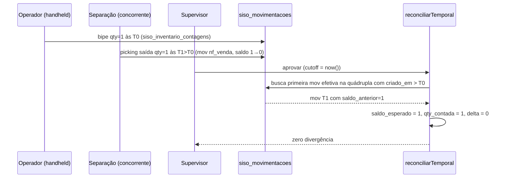

# Estoque Online — Reconciliação Temporal do Inventário

> **For agentic workers:** REQUIRED SUB-SKILL: Use `superpowers:subagent-driven-development` (recommended) or `superpowers:executing-plans` to implement this plan task-by-task. Steps use checkbox (`- [ ]`) syntax for tracking.

**Goal:** Permitir que operações (picking, recebimento, ajuste) e inventário rodem em paralelo sem gerar divergências fantasma. Quando uma mov ocorre entre o bipe da contagem e a aprovação da sessão, o sistema reconcilia temporalmente: `saldo_esperado = saldo_no_momento_do_bipe` (reconstruído a partir do ledger).

**Architecture:** Função pura `reconciliarTemporal(input)` no estilo `planejarMiniSwap` (testável em isolamento). Wrapper `computarDivergencias` carrega snapshot consistente do banco (`cutoff_em = now()`) e delega o cálculo. UI handheld ganha modal "loc vazia?" para distinguir loc visitada-e-vazia de loc não-visitada. Supervisor ganha feed ao vivo de eventos classificados (verde/amarelo/vermelho).

**Tech Stack:** TypeScript strict, Vitest (puro), Next.js App Router, Supabase Realtime, Tailwind CSS 4.

**Spec:** [`docs/superpowers/specs/2026-05-18-estoque-online-fluxo.html`](../specs/2026-05-18-estoque-online-fluxo.html)

---

## Arquivos

**Criar:**
- `src/lib/wms/inventario-reconciliacao.ts` — função pura `reconciliarTemporal`
- `src/lib/wms/inventario-reconciliacao.test.ts` — testes unitários (Vitest)
- `src/app/api/wms/inventario/[id]/eventos/route.ts` — feed do painel supervisor
- `src/components/wms/inventario/loc-vazia-modal.tsx` — modal "está vazia?"
- `src/components/wms/inventario/feed-eventos.tsx` — feed ao vivo classificado

**Modificar:**
- `src/lib/wms/inventario.ts` — refactor `computarDivergencias` para chamar a função pura
- `src/hooks/use-inventario-realtime.ts` — adicionar canal de `siso_movimentacoes`
- `src/app/wms/inventario/[id]/contar/page.tsx` — integrar modal no fluxo de finalizar
- `src/app/wms/inventario/[id]/page.tsx` — embutir `FeedEventos` no supervisor
- `erros-conhecidos.yaml` — entrada do bug original
- `docs/api-reference-complete.md` — documentar `/eventos`
- `docs/architecture-and-flows.md` — adicionar seção "Reconciliação temporal"
- `docs/fluxos-siso.md` — atualizar diagrama do inventário
- `CLAUDE.md` — atualizar Project Structure (novo lib + novo endpoint)

---

## FASE 1 — Algoritmo (TDD heavy)

Função pura sem I/O. Toda a complexidade temporal vive aqui. Toda task fecha em commit independente.

### Task 1.1: Esqueleto + tipos públicos + smoke test

**Files:**
- Create: `src/lib/wms/inventario-reconciliacao.ts`
- Create: `src/lib/wms/inventario-reconciliacao.test.ts`

- [ ] **Step 1: Criar tipos e skeleton vazio**

Escrever em `src/lib/wms/inventario-reconciliacao.ts`:

```typescript
// Função pura que reconcilia uma sessão de inventário temporalmente.
// Não toca em I/O — recebe snapshot, devolve divergências calculadas.
//
// Conceitos:
//   - Quádrupla = (localizacao_id, produto_id, empresa_dona_id, sessao)
//   - Cutoff = instante em que a aprovação foi disparada. Movs após o cutoff
//     ficam fora desta sessão.
//   - Saldo esperado = saldo na quádrupla no instante de T_ref:
//       T_ref = max(contado_em) das contagens da quádrupla, OU
//       contagem_finalizada_em da loc, se a quádrupla nasceu de "loc visitada
//       e vazia" sem bipes.
//     Para reconstruí-lo, pegamos o `saldo_anterior` da primeira mov
//     EFETIVA da quádrupla com `criado_em > T_ref`. Se não houver, usamos
//     o saldo atual.
//
// "Mov efetiva" = mov não-estornada (não é estorno E não foi estornada por
// outra) E não é da própria sessão (origem_tipo='inventario' + origem_id=sessao).

export interface ContagemInput {
  localizacao_id: string;
  produto_id: string;
  empresa_dona_id: string;
  qty_contada: number;
  contado_em: string; // ISO timestamp
}

export interface LocVisitadaInput {
  localizacao_id: string;
  contagem_finalizada_em: string; // ISO — só locs efetivamente visitadas
}

export interface SaldoAtualInput {
  localizacao_id: string;
  produto_id: string;
  empresa_dona_id: string;
  saldo: number;
  custo_medio: number;
}

export interface MovInput {
  id: string;
  localizacao_id: string;
  produto_id: string;
  empresa_dona_id: string;
  criado_em: string;
  saldo_anterior: number;
  saldo_posterior: number;
  origem_tipo: string;
  origem_id: string | null;
  estorno_de: string | null;
}

export interface ReconciliarInput {
  sessao_id: string;
  cutoff_em: string; // ISO
  contagens: ContagemInput[];
  locs_visitadas: LocVisitadaInput[];
  saldos_atuais: SaldoAtualInput[];
  movs: MovInput[];
}

export interface DivergenciaCalculada {
  localizacao_id: string;
  produto_id: string;
  empresa_dona_id: string;
  saldo_esperado: number;
  qty_contada_final: number;
  delta: number; // qty_contada - saldo_esperado
  valor_financeiro: number;
}

export function reconciliarTemporal(_input: ReconciliarInput): DivergenciaCalculada[] {
  return [];
}
```

- [ ] **Step 2: Escrever smoke test (RED)**

Escrever em `src/lib/wms/inventario-reconciliacao.test.ts`:

```typescript
import { describe, it, expect } from "vitest";
import { reconciliarTemporal } from "./inventario-reconciliacao";

const T0 = "2026-05-18T13:00:00.000Z";
const T1 = "2026-05-18T13:05:00.000Z";
const T2 = "2026-05-18T13:10:00.000Z";

const LOC = "loc-1";
const PROD = "prod-1";
const DONA = "dona-1";

describe("reconciliarTemporal — smoke", () => {
  it("retorna array vazio quando não há contagens nem locs visitadas", () => {
    const out = reconciliarTemporal({
      sessao_id: "s",
      cutoff_em: T2,
      contagens: [],
      locs_visitadas: [],
      saldos_atuais: [],
      movs: [],
    });
    expect(out).toEqual([]);
  });
});
```

- [ ] **Step 3: Rodar — espera PASS (impl vazia)**

Run: `npx vitest run src/lib/wms/inventario-reconciliacao.test.ts`
Expected: 1 passed (a função devolve `[]` e o teste espera `[]`).

- [ ] **Step 4: Commit**

```bash
git add src/lib/wms/inventario-reconciliacao.ts src/lib/wms/inventario-reconciliacao.test.ts
git commit -m "feat(wms/inventario): skeleton de reconciliarTemporal"
```

---

### Task 1.2: Caso base — sem movs após contagem

**Files:**
- Modify: `src/lib/wms/inventario-reconciliacao.test.ts`
- Modify: `src/lib/wms/inventario-reconciliacao.ts`

- [ ] **Step 1: Escrever teste (RED)**

Adicionar ao test file:

```typescript
describe("reconciliarTemporal — sem movs após contagem", () => {
  it("contagem == saldo_atual → não emite divergência", () => {
    const out = reconciliarTemporal({
      sessao_id: "s",
      cutoff_em: T2,
      contagens: [
        { localizacao_id: LOC, produto_id: PROD, empresa_dona_id: DONA, qty_contada: 5, contado_em: T1 },
      ],
      locs_visitadas: [{ localizacao_id: LOC, contagem_finalizada_em: T1 }],
      saldos_atuais: [
        { localizacao_id: LOC, produto_id: PROD, empresa_dona_id: DONA, saldo: 5, custo_medio: 10 },
      ],
      movs: [],
    });
    expect(out).toEqual([]);
  });

  it("contagem != saldo_atual sem movs → emite divergência com saldo_atual", () => {
    const out = reconciliarTemporal({
      sessao_id: "s",
      cutoff_em: T2,
      contagens: [
        { localizacao_id: LOC, produto_id: PROD, empresa_dona_id: DONA, qty_contada: 3, contado_em: T1 },
      ],
      locs_visitadas: [{ localizacao_id: LOC, contagem_finalizada_em: T1 }],
      saldos_atuais: [
        { localizacao_id: LOC, produto_id: PROD, empresa_dona_id: DONA, saldo: 5, custo_medio: 10 },
      ],
      movs: [],
    });
    expect(out).toEqual([
      {
        localizacao_id: LOC,
        produto_id: PROD,
        empresa_dona_id: DONA,
        saldo_esperado: 5,
        qty_contada_final: 3,
        delta: -2,
        valor_financeiro: -20,
      },
    ]);
  });
});
```

- [ ] **Step 2: Rodar — espera FAIL**

Run: `npx vitest run src/lib/wms/inventario-reconciliacao.test.ts`
Expected: 2 failed (smoke ainda passa).

- [ ] **Step 3: Implementar mínimo (GREEN)**

Substituir o corpo de `reconciliarTemporal` em `inventario-reconciliacao.ts`:

```typescript
export function reconciliarTemporal(input: ReconciliarInput): DivergenciaCalculada[] {
  const result: DivergenciaCalculada[] = [];

  // Agrega contagens por quádrupla
  const agregado = new Map<string, { loc: string; prod: string; dona: string; qty: number; t_ref: string }>();
  for (const c of input.contagens) {
    const k = `${c.localizacao_id}|${c.produto_id}|${c.empresa_dona_id}`;
    const cur = agregado.get(k);
    if (cur) {
      cur.qty += c.qty_contada;
      if (c.contado_em > cur.t_ref) cur.t_ref = c.contado_em;
    } else {
      agregado.set(k, {
        loc: c.localizacao_id,
        prod: c.produto_id,
        dona: c.empresa_dona_id,
        qty: c.qty_contada,
        t_ref: c.contado_em,
      });
    }
  }

  const saldoMap = new Map<string, { saldo: number; custo: number }>();
  for (const s of input.saldos_atuais) {
    saldoMap.set(`${s.localizacao_id}|${s.produto_id}|${s.empresa_dona_id}`, {
      saldo: s.saldo,
      custo: s.custo_medio,
    });
  }

  for (const v of agregado.values()) {
    const k = `${v.loc}|${v.prod}|${v.dona}`;
    const s = saldoMap.get(k);
    const saldo_atual = s?.saldo ?? 0;
    const custo = s?.custo ?? 0;
    const saldo_esperado = saldo_atual; // placeholder — task 1.3 traz a lógica temporal

    const delta = v.qty - saldo_esperado;
    if (delta === 0) continue;
    result.push({
      localizacao_id: v.loc,
      produto_id: v.prod,
      empresa_dona_id: v.dona,
      saldo_esperado,
      qty_contada_final: v.qty,
      delta,
      valor_financeiro: custo * delta,
    });
  }

  return result;
}
```

- [ ] **Step 4: Rodar — espera PASS**

Run: `npx vitest run src/lib/wms/inventario-reconciliacao.test.ts`
Expected: 3 passed.

- [ ] **Step 5: Commit**

```bash
git add src/lib/wms/inventario-reconciliacao.ts src/lib/wms/inventario-reconciliacao.test.ts
git commit -m "feat(wms/inventario): agregação de contagens + delta vs saldo atual"
```

---

### Task 1.3: Mov após contagem usa `saldo_anterior`

**Files:**
- Modify: `src/lib/wms/inventario-reconciliacao.test.ts`
- Modify: `src/lib/wms/inventario-reconciliacao.ts`

- [ ] **Step 1: Escrever teste (RED)**

Adicionar:

```typescript
describe("reconciliarTemporal — movs após contagem", () => {
  it("saída após contagem: saldo_esperado = saldo_anterior da mov", () => {
    // Reproduz o bug original: conta 1 às T1, picking sai 1 às T2, aprovação T_cutoff
    const out = reconciliarTemporal({
      sessao_id: "s",
      cutoff_em: "2026-05-18T13:20:00.000Z",
      contagens: [
        { localizacao_id: LOC, produto_id: PROD, empresa_dona_id: DONA, qty_contada: 1, contado_em: T0 },
      ],
      locs_visitadas: [{ localizacao_id: LOC, contagem_finalizada_em: T0 }],
      saldos_atuais: [
        { localizacao_id: LOC, produto_id: PROD, empresa_dona_id: DONA, saldo: 0, custo_medio: 10 },
      ],
      movs: [
        {
          id: "m1",
          localizacao_id: LOC,
          produto_id: PROD,
          empresa_dona_id: DONA,
          criado_em: T1,
          saldo_anterior: 1,
          saldo_posterior: 0,
          origem_tipo: "nf_venda",
          origem_id: "pedido:91130001",
          estorno_de: null,
        },
      ],
    });
    expect(out).toEqual([]); // saldo_esperado = 1, qty = 1 → delta = 0 → vazio
  });

  it("entrada após contagem: saldo_esperado < saldo_atual", () => {
    const out = reconciliarTemporal({
      sessao_id: "s",
      cutoff_em: "2026-05-18T13:20:00.000Z",
      contagens: [
        { localizacao_id: LOC, produto_id: PROD, empresa_dona_id: DONA, qty_contada: 3, contado_em: T0 },
      ],
      locs_visitadas: [{ localizacao_id: LOC, contagem_finalizada_em: T0 }],
      saldos_atuais: [
        { localizacao_id: LOC, produto_id: PROD, empresa_dona_id: DONA, saldo: 8, custo_medio: 10 },
      ],
      movs: [
        {
          id: "m2",
          localizacao_id: LOC,
          produto_id: PROD,
          empresa_dona_id: DONA,
          criado_em: T1,
          saldo_anterior: 3,
          saldo_posterior: 8,
          origem_tipo: "recebimento",
          origem_id: "guarda:abc",
          estorno_de: null,
        },
      ],
    });
    expect(out).toEqual([]); // saldo_esperado = 3, qty = 3 → delta = 0
  });
});
```

- [ ] **Step 2: Rodar — espera FAIL**

Run: `npx vitest run src/lib/wms/inventario-reconciliacao.test.ts`
Expected: 2 failed dos novos (`saldo_esperado` ainda usa saldo_atual).

- [ ] **Step 3: Implementar (GREEN)**

Substituir o cálculo de `saldo_esperado` no loop. Antes da declaração `for (const v of agregado.values())`, adicionar helper `primeiraMovApos` e usá-lo:

```typescript
// Helper: primeira mov "efetiva" na quádrupla com criado_em > t_ref
function primeiraMovEfetiva(
  movs: MovInput[],
  loc: string,
  prod: string,
  dona: string,
  t_ref: string,
  sessaoId: string,
  cutoff: string,
): MovInput | null {
  const candidatos = movs
    .filter(
      (m) =>
        m.localizacao_id === loc &&
        m.produto_id === prod &&
        m.empresa_dona_id === dona &&
        m.criado_em > t_ref &&
        m.criado_em <= cutoff &&
        m.estorno_de === null &&
        !(m.origem_tipo === "inventario" && m.origem_id === sessaoId),
    )
    .sort((a, b) => a.criado_em.localeCompare(b.criado_em));
  return candidatos[0] ?? null;
}
```

E dentro do loop, trocar:
```typescript
    const saldo_esperado = saldo_atual; // placeholder — task 1.3 traz a lógica temporal
```
por:
```typescript
    const proxima = primeiraMovEfetiva(input.movs, v.loc, v.prod, v.dona, v.t_ref, input.sessao_id, input.cutoff_em);
    const saldo_esperado = proxima ? proxima.saldo_anterior : saldo_atual;
```

- [ ] **Step 4: Rodar — espera PASS**

Run: `npx vitest run src/lib/wms/inventario-reconciliacao.test.ts`
Expected: 5 passed.

- [ ] **Step 5: Commit**

```bash
git add src/lib/wms/inventario-reconciliacao.ts src/lib/wms/inventario-reconciliacao.test.ts
git commit -m "feat(wms/inventario): saldo_esperado vem do ledger via primeira mov após T_ref"
```

---

### Task 1.4: Múltiplas movs — só a primeira importa

**Files:**
- Modify: `src/lib/wms/inventario-reconciliacao.test.ts`

- [ ] **Step 1: Escrever teste**

```typescript
describe("reconciliarTemporal — múltiplas movs após contagem", () => {
  it("usa saldo_anterior da PRIMEIRA mov após T_ref (a cadeia se contém)", () => {
    const out = reconciliarTemporal({
      sessao_id: "s",
      cutoff_em: "2026-05-18T13:30:00.000Z",
      contagens: [
        { localizacao_id: LOC, produto_id: PROD, empresa_dona_id: DONA, qty_contada: 10, contado_em: T0 },
      ],
      locs_visitadas: [{ localizacao_id: LOC, contagem_finalizada_em: T0 }],
      saldos_atuais: [
        { localizacao_id: LOC, produto_id: PROD, empresa_dona_id: DONA, saldo: 4, custo_medio: 10 },
      ],
      movs: [
        // saída 3 às T1 (saldo 10 → 7)
        { id: "m1", localizacao_id: LOC, produto_id: PROD, empresa_dona_id: DONA, criado_em: T1, saldo_anterior: 10, saldo_posterior: 7, origem_tipo: "nf_venda", origem_id: "p1", estorno_de: null },
        // saída 3 às T2 (saldo 7 → 4)
        { id: "m2", localizacao_id: LOC, produto_id: PROD, empresa_dona_id: DONA, criado_em: T2, saldo_anterior: 7, saldo_posterior: 4, origem_tipo: "nf_venda", origem_id: "p2", estorno_de: null },
      ],
    });
    // saldo_esperado = saldo_anterior de m1 = 10 → delta = 10 - 10 = 0
    expect(out).toEqual([]);
  });
});
```

- [ ] **Step 2: Rodar — espera PASS sem mudar código**

Run: `npx vitest run src/lib/wms/inventario-reconciliacao.test.ts`
Expected: 6 passed. (Lógica já está correta — escolher primeiramov por `criado_em` ASC.)

Se falhar, conferir o `sort` no helper.

- [ ] **Step 3: Commit**

```bash
git add src/lib/wms/inventario-reconciliacao.test.ts
git commit -m "test(wms/inventario): cobre cadeia de múltiplas movs após contagem"
```

---

### Task 1.5: Mov estornada — par ignorado

**Files:**
- Modify: `src/lib/wms/inventario-reconciliacao.test.ts`
- Modify: `src/lib/wms/inventario-reconciliacao.ts`

- [ ] **Step 1: Escrever teste (RED)**

```typescript
describe("reconciliarTemporal — estornos", () => {
  it("ignora mov estornada (par original + estorno se cancela)", () => {
    // Sequência: contagem T0=1 → saída 1 em T1 → estorno em T2 → saldo_atual=1
    const out = reconciliarTemporal({
      sessao_id: "s",
      cutoff_em: "2026-05-18T13:30:00.000Z",
      contagens: [
        { localizacao_id: LOC, produto_id: PROD, empresa_dona_id: DONA, qty_contada: 1, contado_em: T0 },
      ],
      locs_visitadas: [{ localizacao_id: LOC, contagem_finalizada_em: T0 }],
      saldos_atuais: [
        { localizacao_id: LOC, produto_id: PROD, empresa_dona_id: DONA, saldo: 1, custo_medio: 10 },
      ],
      movs: [
        // saída original em T1
        { id: "m1", localizacao_id: LOC, produto_id: PROD, empresa_dona_id: DONA, criado_em: T1, saldo_anterior: 1, saldo_posterior: 0, origem_tipo: "nf_venda", origem_id: "p1", estorno_de: null },
        // estorno de m1 em T2 (devolve qty)
        { id: "m2", localizacao_id: LOC, produto_id: PROD, empresa_dona_id: DONA, criado_em: T2, saldo_anterior: 0, saldo_posterior: 1, origem_tipo: "estorno", origem_id: "m1", estorno_de: "m1" },
      ],
    });
    // Par se cancela → não há mov efetiva → saldo_esperado = saldo_atual = 1
    // qty_contada = 1 → delta = 0 → []
    expect(out).toEqual([]);
  });
});
```

- [ ] **Step 2: Rodar — espera FAIL**

Run: `npx vitest run src/lib/wms/inventario-reconciliacao.test.ts`
Expected: 1 failed. (Hoje só filtramos `estorno_de === null`, então m1 é elegível e `saldo_anterior=1` → coincidentemente passa? Conferir output.)

Nota: se passar acidentalmente, ajustar o teste — usar saldo_atual diferente para forçar diferença. Trocar `saldo: 1` por `saldo: 5` e `qty_contada: 5`:
```typescript
        { localizacao_id: LOC, produto_id: PROD, empresa_dona_id: DONA, saldo: 5, custo_medio: 10 },
```
contagem:
```typescript
        { localizacao_id: LOC, produto_id: PROD, empresa_dona_id: DONA, qty_contada: 5, contado_em: T0 },
```
movs:
```typescript
        { id: "m1", ... saldo_anterior: 5, saldo_posterior: 4, ... },
        { id: "m2", ... saldo_anterior: 4, saldo_posterior: 5, estorno_de: "m1" },
```
Aí: sem o fix, m1 vira "primeira mov efetiva" → saldo_esperado=5 → delta=0 → falso positivo passa.
Com fix correto: m1 é estornada → não conta → saldo_esperado=saldo_atual=5 → delta=0. Resultado igual.

Caso difícil de fazer falhar com par puro porque `saldo_anterior` da original = saldo_atual. Vou usar caso com mov não-estornada DEPOIS do estorno:

```typescript
  it("ignora par estornado e usa mov posterior não-estornada", () => {
    const out = reconciliarTemporal({
      sessao_id: "s",
      cutoff_em: "2026-05-18T13:30:00.000Z",
      contagens: [
        { localizacao_id: LOC, produto_id: PROD, empresa_dona_id: DONA, qty_contada: 5, contado_em: T0 },
      ],
      locs_visitadas: [{ localizacao_id: LOC, contagem_finalizada_em: T0 }],
      saldos_atuais: [
        { localizacao_id: LOC, produto_id: PROD, empresa_dona_id: DONA, saldo: 3, custo_medio: 10 },
      ],
      movs: [
        // m1: saída de 1 em T1 (estornada depois)
        { id: "m1", localizacao_id: LOC, produto_id: PROD, empresa_dona_id: DONA, criado_em: T1, saldo_anterior: 5, saldo_posterior: 4, origem_tipo: "nf_venda", origem_id: "p1", estorno_de: null },
        // m2: estorno de m1 em T2
        { id: "m2", localizacao_id: LOC, produto_id: PROD, empresa_dona_id: DONA, criado_em: "2026-05-18T13:11:00.000Z", saldo_anterior: 4, saldo_posterior: 5, origem_tipo: "estorno", origem_id: "m1", estorno_de: "m1" },
        // m3: saída posterior REAL de 2 (saldo 5 → 3)
        { id: "m3", localizacao_id: LOC, produto_id: PROD, empresa_dona_id: DONA, criado_em: "2026-05-18T13:15:00.000Z", saldo_anterior: 5, saldo_posterior: 3, origem_tipo: "nf_venda", origem_id: "p2", estorno_de: null },
      ],
    });
    // saldo_esperado deve ser saldo_anterior de m3 = 5 (porque m1+m2 se cancelam)
    // qty_contada = 5 → delta = 0
    // Sem o fix: pega m1, saldo_esperado=5, delta=0 → também passa. Mas a INTENÇÃO é validar
    // que estamos pulando o par corretamente. Vou aliar com origem da própria sessão na próxima task.
    expect(out).toEqual([]);
  });
```

Caso definitivo para forçar fail: contagem == saldo_atual em cenário SEM movs efetivas, mas com par estornado no meio:

```typescript
  it("par estornado + sem movs reais: saldo_esperado = saldo_atual", () => {
    const out = reconciliarTemporal({
      sessao_id: "s",
      cutoff_em: "2026-05-18T13:30:00.000Z",
      contagens: [
        { localizacao_id: LOC, produto_id: PROD, empresa_dona_id: DONA, qty_contada: 7, contado_em: T0 },
      ],
      locs_visitadas: [{ localizacao_id: LOC, contagem_finalizada_em: T0 }],
      saldos_atuais: [
        { localizacao_id: LOC, produto_id: PROD, empresa_dona_id: DONA, saldo: 7, custo_medio: 10 },
      ],
      movs: [
        // m1: saída de 3 ENTRE contagem e cutoff
        { id: "m1", localizacao_id: LOC, produto_id: PROD, empresa_dona_id: DONA, criado_em: T1, saldo_anterior: 7, saldo_posterior: 4, origem_tipo: "nf_venda", origem_id: "p1", estorno_de: null },
        // m2: estorno de m1
        { id: "m2", localizacao_id: LOC, produto_id: PROD, empresa_dona_id: DONA, criado_em: T2, saldo_anterior: 4, saldo_posterior: 7, origem_tipo: "estorno", origem_id: "m1", estorno_de: "m1" },
      ],
    });
    // Saldo atual 7, contado 7, sem movs reais → delta=0 → []
    // SEM o fix: m1 é elegível (estorno_de null), saldo_anterior=7 → delta=0 → também passa.
    // Esse caso não consegue forçar fail com par puro. Marcar como teste de regressão.
    expect(out).toEqual([]);
  });
```

Decisão: aceitar que o par puro é defensivamente correto (a primeira mov tem `saldo_anterior` igual ao saldo após par cancelado), MAS implementar o filtro mesmo assim por clareza semântica + caso (entrada estornada seguida de saída real, onde `saldo_anterior` da primeira não bate). Manter os 2 testes acima como regressão.

- [ ] **Step 3: Implementar filtro de pares estornados (GREEN)**

Em `primeiraMovEfetiva`, antes do `.filter(...)`, montar `estornadasIds`:

```typescript
function primeiraMovEfetiva(
  movs: MovInput[],
  loc: string,
  prod: string,
  dona: string,
  t_ref: string,
  sessaoId: string,
  cutoff: string,
): MovInput | null {
  // IDs de movs que foram alvo de estorno (campo estorno_de aponta pra elas)
  const estornadas = new Set<string>();
  for (const m of movs) {
    if (m.estorno_de) estornadas.add(m.estorno_de);
  }

  const candidatos = movs
    .filter(
      (m) =>
        m.localizacao_id === loc &&
        m.produto_id === prod &&
        m.empresa_dona_id === dona &&
        m.criado_em > t_ref &&
        m.criado_em <= cutoff &&
        m.estorno_de === null &&
        !estornadas.has(m.id) &&
        !(m.origem_tipo === "inventario" && m.origem_id === sessaoId),
    )
    .sort((a, b) => a.criado_em.localeCompare(b.criado_em));
  return candidatos[0] ?? null;
}
```

- [ ] **Step 4: Rodar — espera PASS**

Run: `npx vitest run src/lib/wms/inventario-reconciliacao.test.ts`
Expected: 8+ passed.

- [ ] **Step 5: Commit**

```bash
git add src/lib/wms/inventario-reconciliacao.ts src/lib/wms/inventario-reconciliacao.test.ts
git commit -m "feat(wms/inventario): filtra par estornado (original + estorno) da reconciliação"
```

---

### Task 1.6: Mov `origem='inventario'` da própria sessão é ignorada

**Files:**
- Modify: `src/lib/wms/inventario-reconciliacao.test.ts`

- [ ] **Step 1: Escrever teste**

```typescript
describe("reconciliarTemporal — movs da própria sessão", () => {
  it("ignora mov origem='inventario' com origem_id == sessao_id (caso re-aprovação)", () => {
    const out = reconciliarTemporal({
      sessao_id: "sess-1",
      cutoff_em: "2026-05-18T13:30:00.000Z",
      contagens: [
        { localizacao_id: LOC, produto_id: PROD, empresa_dona_id: DONA, qty_contada: 5, contado_em: T0 },
      ],
      locs_visitadas: [{ localizacao_id: LOC, contagem_finalizada_em: T0 }],
      saldos_atuais: [
        { localizacao_id: LOC, produto_id: PROD, empresa_dona_id: DONA, saldo: 5, custo_medio: 10 },
      ],
      movs: [
        // Mov de inventário aplicado pela MESMA sessão (em re-aprovação)
        { id: "m1", localizacao_id: LOC, produto_id: PROD, empresa_dona_id: DONA, criado_em: T1, saldo_anterior: 3, saldo_posterior: 5, origem_tipo: "inventario", origem_id: "sess-1", estorno_de: null },
      ],
    });
    // Ignora m1 → saldo_esperado = saldo_atual = 5 → delta = 0 → []
    expect(out).toEqual([]);
  });

  it("considera mov origem='inventario' de OUTRA sessão", () => {
    const out = reconciliarTemporal({
      sessao_id: "sess-1",
      cutoff_em: "2026-05-18T13:30:00.000Z",
      contagens: [
        { localizacao_id: LOC, produto_id: PROD, empresa_dona_id: DONA, qty_contada: 3, contado_em: T0 },
      ],
      locs_visitadas: [{ localizacao_id: LOC, contagem_finalizada_em: T0 }],
      saldos_atuais: [
        { localizacao_id: LOC, produto_id: PROD, empresa_dona_id: DONA, saldo: 5, custo_medio: 10 },
      ],
      movs: [
        { id: "m1", localizacao_id: LOC, produto_id: PROD, empresa_dona_id: DONA, criado_em: T1, saldo_anterior: 3, saldo_posterior: 5, origem_tipo: "inventario", origem_id: "sess-OUTRA", estorno_de: null },
      ],
    });
    // m1 é considerada → saldo_esperado = 3 → delta = 0 → []
    expect(out).toEqual([]);
  });
});
```

- [ ] **Step 2: Rodar — espera PASS** (lógica já implementada em 1.5)

Run: `npx vitest run src/lib/wms/inventario-reconciliacao.test.ts`
Expected: 10+ passed.

- [ ] **Step 3: Commit**

```bash
git add src/lib/wms/inventario-reconciliacao.test.ts
git commit -m "test(wms/inventario): regressão pra movs da própria sessão (idempotência)"
```

---

### Task 1.7: Cutoff descarta movs após o snapshot

**Files:**
- Modify: `src/lib/wms/inventario-reconciliacao.test.ts`

- [ ] **Step 1: Escrever teste**

```typescript
describe("reconciliarTemporal — cutoff_em", () => {
  it("mov criada após cutoff_em é ignorada", () => {
    const out = reconciliarTemporal({
      sessao_id: "s",
      cutoff_em: T1, // cutoff antes da mov
      contagens: [
        { localizacao_id: LOC, produto_id: PROD, empresa_dona_id: DONA, qty_contada: 5, contado_em: T0 },
      ],
      locs_visitadas: [{ localizacao_id: LOC, contagem_finalizada_em: T0 }],
      saldos_atuais: [
        { localizacao_id: LOC, produto_id: PROD, empresa_dona_id: DONA, saldo: 2, custo_medio: 10 },
      ],
      movs: [
        // saída após cutoff
        { id: "m1", localizacao_id: LOC, produto_id: PROD, empresa_dona_id: DONA, criado_em: T2, saldo_anterior: 5, saldo_posterior: 2, origem_tipo: "nf_venda", origem_id: "p1", estorno_de: null },
      ],
    });
    // Mov após cutoff → ignorada → saldo_esperado=saldo_atual=2, qty=5, delta=+3
    expect(out).toEqual([
      {
        localizacao_id: LOC,
        produto_id: PROD,
        empresa_dona_id: DONA,
        saldo_esperado: 2,
        qty_contada_final: 5,
        delta: 3,
        valor_financeiro: 30,
      },
    ]);
  });
});
```

- [ ] **Step 2: Rodar — espera PASS** (cutoff já implementado em 1.3)

Run: `npx vitest run src/lib/wms/inventario-reconciliacao.test.ts`
Expected: 11+ passed.

- [ ] **Step 3: Commit**

```bash
git add src/lib/wms/inventario-reconciliacao.test.ts
git commit -m "test(wms/inventario): cutoff descarta movs criadas depois do snapshot"
```

---

### Task 1.8: Loc visitada e vazia — entrada após visita não é divergência

**Files:**
- Modify: `src/lib/wms/inventario-reconciliacao.test.ts`
- Modify: `src/lib/wms/inventario-reconciliacao.ts`

- [ ] **Step 1: Escrever teste (RED)**

```typescript
describe("reconciliarTemporal — loc visitada vazia", () => {
  it("loc visitada sem contagens + entrada após visita → não emite divergência", () => {
    const out = reconciliarTemporal({
      sessao_id: "s",
      cutoff_em: "2026-05-18T13:30:00.000Z",
      contagens: [], // operador encerrou sem bipar (confirmou modal "vazia")
      locs_visitadas: [{ localizacao_id: LOC, contagem_finalizada_em: T1 }],
      saldos_atuais: [
        { localizacao_id: LOC, produto_id: PROD, empresa_dona_id: DONA, saldo: 3, custo_medio: 10 },
      ],
      movs: [
        // Entrada DEPOIS da visita — não conta como sumiço
        { id: "m1", localizacao_id: LOC, produto_id: PROD, empresa_dona_id: DONA, criado_em: T2, saldo_anterior: 0, saldo_posterior: 3, origem_tipo: "recebimento", origem_id: "g1", estorno_de: null },
      ],
    });
    expect(out).toEqual([]);
  });

  it("loc visitada sem contagens + saldo > 0 SEM entrada após visita → divergência qty=0", () => {
    const out = reconciliarTemporal({
      sessao_id: "s",
      cutoff_em: "2026-05-18T13:30:00.000Z",
      contagens: [],
      locs_visitadas: [{ localizacao_id: LOC, contagem_finalizada_em: T2 }],
      saldos_atuais: [
        { localizacao_id: LOC, produto_id: PROD, empresa_dona_id: DONA, saldo: 3, custo_medio: 10 },
      ],
      movs: [], // saldo é antigo, persiste desde antes da sessão
    });
    expect(out).toEqual([
      {
        localizacao_id: LOC,
        produto_id: PROD,
        empresa_dona_id: DONA,
        saldo_esperado: 3,
        qty_contada_final: 0,
        delta: -3,
        valor_financeiro: -30,
      },
    ]);
  });
});
```

- [ ] **Step 2: Rodar — espera FAIL**

Run: `npx vitest run src/lib/wms/inventario-reconciliacao.test.ts`
Expected: 2 failed.

- [ ] **Step 3: Implementar bloco de "locs visitadas vazias" (GREEN)**

Após o agregado de contagens e ANTES do loop principal, adicionar:

```typescript
  // Para cada loc visitada, descobrir quádruplas SEM contagem mas com
  // saldo presente AGORA → divergência candidata com qty=0.
  // T_ref = contagem_finalizada_em da loc.
  const locsVisitadasMap = new Map<string, string>();
  for (const lv of input.locs_visitadas) {
    locsVisitadasMap.set(lv.localizacao_id, lv.contagem_finalizada_em);
  }

  for (const s of input.saldos_atuais) {
    if (s.saldo <= 0) continue;
    const k = `${s.localizacao_id}|${s.produto_id}|${s.empresa_dona_id}`;
    if (agregado.has(k)) continue;
    const finalizadaEm = locsVisitadasMap.get(s.localizacao_id);
    if (!finalizadaEm) continue; // loc não visitada → ignora
    agregado.set(k, {
      loc: s.localizacao_id,
      prod: s.produto_id,
      dona: s.empresa_dona_id,
      qty: 0,
      t_ref: finalizadaEm,
    });
  }
```

- [ ] **Step 4: Rodar — espera PASS**

Run: `npx vitest run src/lib/wms/inventario-reconciliacao.test.ts`
Expected: 13+ passed.

- [ ] **Step 5: Commit**

```bash
git add src/lib/wms/inventario-reconciliacao.ts src/lib/wms/inventario-reconciliacao.test.ts
git commit -m "feat(wms/inventario): loc visitada vazia gera divergência só se saldo persistia desde antes"
```

---

### Task 1.9: Loc não visitada é ignorada

**Files:**
- Modify: `src/lib/wms/inventario-reconciliacao.test.ts`

- [ ] **Step 1: Escrever teste**

```typescript
describe("reconciliarTemporal — loc não visitada", () => {
  it("loc sem entry em locs_visitadas + sem contagens → sempre ignorada", () => {
    const out = reconciliarTemporal({
      sessao_id: "s",
      cutoff_em: "2026-05-18T13:30:00.000Z",
      contagens: [],
      locs_visitadas: [], // nenhuma loc finalizada
      saldos_atuais: [
        { localizacao_id: LOC, produto_id: PROD, empresa_dona_id: DONA, saldo: 99, custo_medio: 10 },
      ],
      movs: [],
    });
    expect(out).toEqual([]);
  });
});
```

- [ ] **Step 2: Rodar — espera PASS**

Run: `npx vitest run src/lib/wms/inventario-reconciliacao.test.ts`
Expected: 14+ passed.

- [ ] **Step 3: Commit**

```bash
git add src/lib/wms/inventario-reconciliacao.test.ts
git commit -m "test(wms/inventario): loc não visitada é completamente ignorada"
```

---

### Task 1.10: Múltiplas contagens da mesma quádrupla

**Files:**
- Modify: `src/lib/wms/inventario-reconciliacao.test.ts`

- [ ] **Step 1: Escrever teste**

```typescript
describe("reconciliarTemporal — múltiplas contagens da mesma quádrupla", () => {
  it("soma qtys e usa max(contado_em) como T_ref", () => {
    const out = reconciliarTemporal({
      sessao_id: "s",
      cutoff_em: "2026-05-18T13:30:00.000Z",
      contagens: [
        // Mesma quádrupla bipada 3 vezes (caso edge: dois operadores)
        { localizacao_id: LOC, produto_id: PROD, empresa_dona_id: DONA, qty_contada: 2, contado_em: T0 },
        { localizacao_id: LOC, produto_id: PROD, empresa_dona_id: DONA, qty_contada: 1, contado_em: T1 },
        { localizacao_id: LOC, produto_id: PROD, empresa_dona_id: DONA, qty_contada: 1, contado_em: "2026-05-18T13:07:00.000Z" },
      ],
      locs_visitadas: [{ localizacao_id: LOC, contagem_finalizada_em: T1 }],
      saldos_atuais: [
        { localizacao_id: LOC, produto_id: PROD, empresa_dona_id: DONA, saldo: 2, custo_medio: 10 },
      ],
      movs: [
        // Saída de 2 depois da última contagem (T_ref = T1)
        { id: "m1", localizacao_id: LOC, produto_id: PROD, empresa_dona_id: DONA, criado_em: T2, saldo_anterior: 4, saldo_posterior: 2, origem_tipo: "nf_venda", origem_id: "p1", estorno_de: null },
      ],
    });
    // qty agregada = 2+1+1 = 4. T_ref = T1 (max). Primeira mov após T1 é m1, saldo_anterior=4.
    // delta = 4 - 4 = 0 → []
    expect(out).toEqual([]);
  });
});
```

- [ ] **Step 2: Rodar — espera PASS**

Run: `npx vitest run src/lib/wms/inventario-reconciliacao.test.ts`
Expected: 15+ passed.

- [ ] **Step 3: Commit**

```bash
git add src/lib/wms/inventario-reconciliacao.test.ts
git commit -m "test(wms/inventario): regressão pra múltiplas contagens da mesma quádrupla"
```

---

### Task 1.11: Cenário composto — reproduz exatamente o bug original (item 001233)

**Files:**
- Modify: `src/lib/wms/inventario-reconciliacao.test.ts`

- [ ] **Step 1: Escrever teste de regressão fim-a-fim**

```typescript
describe("reconciliarTemporal — regressão: bug do item 001233 (sessão 6282e654)", () => {
  it("contagem → picking → cutoff: ZERO divergência (antes era +1 fake)", () => {
    // Replay literal:
    //   18:08:30  conta 1 unidade
    //   18:10:36  picking sai 1 (saldo 1→0) origem=nf_venda pedido:91130001
    //   18:13:28  aprovação (cutoff)
    const T_CONT = "2026-05-18T18:08:30.000Z";
    const T_PICK = "2026-05-18T18:10:36.000Z";
    const T_CUTOFF = "2026-05-18T18:13:28.000Z";

    const out = reconciliarTemporal({
      sessao_id: "6282e654-f778-4a11-9d47-4b1ec12ad9a4",
      cutoff_em: T_CUTOFF,
      contagens: [
        { localizacao_id: "e64758ac-028e-4471-9150-e202f72d1cf6", produto_id: "59c90d29-7a04-40b9-9f8e-47e8756b0eec", empresa_dona_id: "4473ca97-67e7-44e5-a192-ec756146b691", qty_contada: 1, contado_em: T_CONT },
      ],
      locs_visitadas: [{ localizacao_id: "e64758ac-028e-4471-9150-e202f72d1cf6", contagem_finalizada_em: T_CONT }],
      saldos_atuais: [
        { localizacao_id: "e64758ac-028e-4471-9150-e202f72d1cf6", produto_id: "59c90d29-7a04-40b9-9f8e-47e8756b0eec", empresa_dona_id: "4473ca97-67e7-44e5-a192-ec756146b691", saldo: 0, custo_medio: 25 },
      ],
      movs: [
        { id: "2bf9a187", localizacao_id: "e64758ac-028e-4471-9150-e202f72d1cf6", produto_id: "59c90d29-7a04-40b9-9f8e-47e8756b0eec", empresa_dona_id: "4473ca97-67e7-44e5-a192-ec756146b691", criado_em: T_PICK, saldo_anterior: 1, saldo_posterior: 0, origem_tipo: "nf_venda", origem_id: "pedido:91130001", estorno_de: null },
      ],
    });
    expect(out).toEqual([]);
  });
});
```

- [ ] **Step 2: Rodar — espera PASS**

Run: `npx vitest run src/lib/wms/inventario-reconciliacao.test.ts`
Expected: 16+ passed.

- [ ] **Step 3: Commit**

```bash
git add src/lib/wms/inventario-reconciliacao.test.ts
git commit -m "test(wms/inventario): regressão pro bug original do item 001233"
```

---

## FASE 2 — Backend wiring

Substituir o `computarDivergencias` para usar `reconciliarTemporal`. O custo, tolerância e persistência ficam no wrapper.

### Task 2.1: Refactor `computarDivergencias` para carregar snapshot e delegar

**Files:**
- Modify: `src/lib/wms/inventario.ts` (linhas 519-731)

- [ ] **Step 1: Substituir o corpo de `computarDivergencias`**

Apagar todo o conteúdo da função (de `const sb = createServiceClient();` até `}` final, incluindo a atualização de status/operadores) e reescrever:

```typescript
import { reconciliarTemporal } from "./inventario-reconciliacao";
// (adicionar import no topo do arquivo)

export async function computarDivergencias(
  sessaoId: string,
  opts: ComputarDivergenciasOpts = {},
): Promise<void> {
  const sb = createServiceClient();
  const parcial = opts.parcial === true;
  const cutoff_em = new Date().toISOString();

  // 1. Carrega locs da sessão (filtrando por modo parcial)
  const locsQuery = sb
    .from("siso_inventario_localizacoes")
    .select("localizacao_id, status, contagem_finalizada_em")
    .eq("sessao_id", sessaoId);

  const { data: locsSessao } = parcial
    ? await locsQuery.in("status", ["contada", "aprovada"])
    : await locsQuery;

  const locsRows = (locsSessao ?? []) as Array<{
    localizacao_id: string;
    status: string;
    contagem_finalizada_em: string | null;
  }>;

  // Em parcial sem locs → só fecha sessão
  if (parcial && locsRows.length === 0) {
    await sb
      .from("siso_inventario_sessoes")
      .update({ status: "revisao", finalizada_em: new Date().toISOString() })
      .eq("id", sessaoId);
    await sb
      .from("siso_inventario_operadores")
      .update({ finalizado_em: new Date().toISOString() })
      .eq("sessao_id", sessaoId)
      .is("finalizado_em", null);
    return;
  }

  const locIds = locsRows.map((l) => l.localizacao_id);
  const locsVisitadas = locsRows
    .filter((l) => l.contagem_finalizada_em !== null)
    .map((l) => ({
      localizacao_id: l.localizacao_id,
      contagem_finalizada_em: l.contagem_finalizada_em as string,
    }));

  // 2. Contagens
  const { data: contagensRaw } = await sb
    .from("siso_inventario_contagens")
    .select("localizacao_id, produto_id, empresa_dona_id, qty_contada, criado_em")
    .eq("sessao_id", sessaoId);

  const contagens = ((contagensRaw ?? []) as Array<{
    localizacao_id: string;
    produto_id: string;
    empresa_dona_id: string;
    qty_contada: number;
    criado_em: string;
  }>).map((c) => ({
    localizacao_id: c.localizacao_id,
    produto_id: c.produto_id,
    empresa_dona_id: c.empresa_dona_id,
    qty_contada: Number(c.qty_contada),
    contado_em: c.criado_em,
  }));

  // 3. Saldos atuais (filtra por empresa_dona da sessão se houver)
  const { data: sessao } = await sb
    .from("siso_inventario_sessoes")
    .select("empresa_dona_id, tolerancia_pct, tolerancia_qty_min, exige_aprovacao_acima_valor")
    .eq("id", sessaoId)
    .single();
  const s = sessao as {
    empresa_dona_id: string | null;
    tolerancia_pct: number;
    tolerancia_qty_min: number;
    exige_aprovacao_acima_valor: number | null;
  } | null;

  let saldoQuery = sb
    .from("siso_estoque")
    .select("produto_id, empresa_dona_id, localizacao_id, saldo, custo_medio")
    .in("localizacao_id", locIds.length > 0 ? locIds : ["00000000-0000-0000-0000-000000000000"])
    .gt("saldo", 0);
  if (s?.empresa_dona_id) {
    saldoQuery = saldoQuery.eq("empresa_dona_id", s.empresa_dona_id);
  }
  const { data: saldosRaw } = await saldoQuery;
  const saldos_atuais = ((saldosRaw ?? []) as Array<{
    produto_id: string;
    empresa_dona_id: string;
    localizacao_id: string;
    saldo: number;
    custo_medio: number;
  }>).map((r) => ({
    localizacao_id: r.localizacao_id,
    produto_id: r.produto_id,
    empresa_dona_id: r.empresa_dona_id,
    saldo: Number(r.saldo),
    custo_medio: Number(r.custo_medio),
  }));

  // 4. Movs ledger nas locs da sessão, criadas após a contagem mais antiga
  //    e até cutoff. Reduz volume — não precisa varrer tudo.
  const minContado = contagens.length > 0
    ? contagens.map((c) => c.contado_em).sort()[0]
    : null;
  const dataLimiteInferior = minContado ?? cutoff_em; // se sem contagens, query vazia
  let movs: Array<{
    id: string;
    localizacao_id: string;
    produto_id: string;
    empresa_dona_id: string;
    criado_em: string;
    saldo_anterior: number;
    saldo_posterior: number;
    origem_tipo: string;
    origem_id: string | null;
    estorno_de: string | null;
  }> = [];
  if (locIds.length > 0 && minContado) {
    const { data: movsRaw } = await sb
      .from("siso_movimentacoes")
      .select("id, localizacao_id, produto_id, empresa_dona_id, criado_em, saldo_anterior, saldo_posterior, origem_tipo, origem_id, estorno_de")
      .in("localizacao_id", locIds)
      .gte("criado_em", dataLimiteInferior)
      .lte("criado_em", cutoff_em);
    movs = ((movsRaw ?? []) as typeof movs).map((m) => ({
      ...m,
      saldo_anterior: Number(m.saldo_anterior),
      saldo_posterior: Number(m.saldo_posterior),
    }));
  }

  // 5. Função pura
  const divergencias = reconciliarTemporal({
    sessao_id: sessaoId,
    cutoff_em,
    contagens,
    locs_visitadas: locsVisitadas,
    saldos_atuais,
    movs,
  });

  // 6. Persiste divergências aplicando tolerância
  // Primeiro, limpa divergências não-aplicadas pra essas quádruplas (re-run)
  for (const d of divergencias) {
    await sb
      .from("siso_inventario_divergencias")
      .delete()
      .match({
        sessao_id: sessaoId,
        localizacao_id: d.localizacao_id,
        produto_id: d.produto_id,
        empresa_dona_id: d.empresa_dona_id,
      })
      .neq("status", "aplicada");
  }

  for (const d of divergencias) {
    const delta_pct =
      d.saldo_esperado === 0 ? null : Math.abs((d.delta / d.saldo_esperado) * 100);
    const dentroTol =
      (s?.tolerancia_pct ?? 0) > 0 && delta_pct !== null
        ? delta_pct <= s!.tolerancia_pct
        : Math.abs(d.delta) <= (s?.tolerancia_qty_min ?? 0);
    const acimaValor =
      s?.exige_aprovacao_acima_valor != null &&
      Math.abs(d.valor_financeiro) > Number(s.exige_aprovacao_acima_valor);
    const status: "aprovada" | "pendente" =
      dentroTol && !acimaValor ? "aprovada" : "pendente";

    await sb.from("siso_inventario_divergencias").upsert(
      {
        sessao_id: sessaoId,
        localizacao_id: d.localizacao_id,
        produto_id: d.produto_id,
        empresa_dona_id: d.empresa_dona_id,
        saldo_sistema: d.saldo_esperado,
        qty_contada_final: d.qty_contada_final,
        valor_financeiro: d.valor_financeiro,
        status,
      },
      { onConflict: "sessao_id,localizacao_id,produto_id,empresa_dona_id" },
    );
  }

  await sb
    .from("siso_inventario_sessoes")
    .update({ status: "revisao", finalizada_em: new Date().toISOString() })
    .eq("id", sessaoId);

  await sb
    .from("siso_inventario_operadores")
    .update({ finalizado_em: new Date().toISOString() })
    .eq("sessao_id", sessaoId)
    .is("finalizado_em", null);
}
```

**NOTA semântica:** `siso_inventario_divergencias.saldo_sistema` passa a guardar o `saldo_esperado_no_bipe`, NÃO o saldo atual. O nome da coluna fica desatualizado mas mantemos por compat — futura migration pode renomear pra `saldo_esperado`.

- [ ] **Step 2: Verificar compilação**

Run: `npx tsc --noEmit`
Expected: sem erros novos.

- [ ] **Step 3: Rodar testes unitários do lib**

Run: `npx vitest run src/lib/wms`
Expected: todos passam (inclui os 16+ novos).

- [ ] **Step 4: Commit**

```bash
git add src/lib/wms/inventario.ts
git commit -m "feat(wms/inventario): computarDivergencias delega cálculo a reconciliarTemporal"
```

---

### Task 2.2: Smoke E2E manual em staging

**Files:** nenhum (validação manual)

- [ ] **Step 1: Subir dev local apontando pra staging**

Run: `npm run dev`
Expected: server em http://localhost:3000.

- [ ] **Step 2: Reproduzir cenário do bug**

1. Abrir sessão nova no staging.
2. Contar 1 unidade do SKU 001233 na A-01-3.
3. Disparar pedido teste que pegue essa unidade.
4. Confirmar aprovação da sessão.

Expected: aprovação retorna ZERO divergências para 001233.

- [ ] **Step 3: Confirmar via SQL no staging**

Rodar via MCP supabase:
```sql
SELECT d.*, p.sku
FROM siso_inventario_divergencias d
JOIN siso_produtos p ON p.id = d.produto_id
WHERE d.sessao_id = '<nova_sessao>'
  AND p.sku = '001233';
```
Expected: 0 linhas.

- [ ] **Step 4: Commit nota de validação**

(Nenhum commit — apenas anotar em `erros-conhecidos.yaml` na fase 5.)

---

## FASE 3 — UI Handheld: modal "loc vazia?"

### Task 3.1: Componente `LocVaziaModal`

**Files:**
- Create: `src/components/wms/inventario/loc-vazia-modal.tsx`

- [ ] **Step 1: Criar componente**

```typescript
"use client";

interface Props {
  locCodigo: string;
  onConfirmar: () => void;
  onCancelar: () => void;
  loading?: boolean;
}

export function LocVaziaModal({ locCodigo, onConfirmar, onCancelar, loading }: Props) {
  return (
    <div className="fixed inset-0 z-50 flex items-center justify-center bg-black/60">
      <div className="w-full max-w-sm rounded-2xl bg-white p-6 dark:bg-zinc-900">
        <div className="text-center text-5xl">📭</div>
        <h2 className="mt-4 text-center text-xl font-bold">
          Localização <span className="font-mono">{locCodigo}</span> está vazia?
        </h2>
        <p className="mt-2 text-center text-sm text-zinc-600 dark:text-zinc-400">
          Você não bipou nada. Confirme que conferiu a prateleira e ela está realmente vazia.
        </p>
        <div className="mt-6 flex flex-col gap-2">
          <button
            type="button"
            disabled={loading}
            onClick={onConfirmar}
            className="w-full rounded-lg bg-green-600 px-4 py-3 font-semibold text-white hover:bg-green-700 disabled:opacity-50"
          >
            Sim, está vazia
          </button>
          <button
            type="button"
            disabled={loading}
            onClick={onCancelar}
            className="w-full rounded-lg border border-zinc-300 px-4 py-3 font-semibold hover:bg-zinc-50 disabled:opacity-50 dark:border-zinc-700 dark:hover:bg-zinc-800"
          >
            Não, voltar pra contar
          </button>
        </div>
      </div>
    </div>
  );
}
```

- [ ] **Step 2: Commit**

```bash
git add src/components/wms/inventario/loc-vazia-modal.tsx
git commit -m "feat(wms/inventario): modal de confirmação loc vazia"
```

---

### Task 3.2: Integrar modal em `contar/page.tsx`

**Files:**
- Modify: `src/app/wms/inventario/[id]/contar/page.tsx`

- [ ] **Step 1: Importar e adicionar estado**

No topo do arquivo, adicionar:
```typescript
import { LocVaziaModal } from "@/components/wms/inventario/loc-vazia-modal";
```

No corpo do componente (perto dos outros `useState`), adicionar:
```typescript
  const [modalVazia, setModalVazia] = useState(false);
```

- [ ] **Step 2: Interceptar clique no botão finalizar**

Localizar o botão "Finalizar" (próximo da linha 861 do arquivo). Substituir o `onClick={() => finalizarLoc.mutate()}` (ou equivalente — busque por `finalizarLoc.mutate`) por:

```typescript
            onClick={() => {
              if (contagens.length === 0) {
                setModalVazia(true);
              } else {
                finalizarLoc.mutate();
              }
            }}
```

- [ ] **Step 3: Renderizar modal**

No final do JSX da página (antes do último `</div>` de root), adicionar:

```tsx
      {modalVazia && locAtual && (
        <LocVaziaModal
          locCodigo={locAtual.codigo}
          loading={finalizarLoc.isPending}
          onConfirmar={() => {
            setModalVazia(false);
            finalizarLoc.mutate();
          }}
          onCancelar={() => setModalVazia(false)}
        />
      )}
```

- [ ] **Step 4: Verificar compilação**

Run: `npx tsc --noEmit`
Expected: sem erros.

- [ ] **Step 5: Smoke manual**

Run: `npm run dev` (se já não estiver), abrir `/wms/inventario/<id>/contar`.
- Puxar loc, NÃO bipar nada, clicar "Finalizar" → modal aparece.
- "Não, voltar" → fecha modal, fica na loc.
- "Sim, está vazia" → finaliza loc.

- [ ] **Step 6: Commit**

```bash
git add src/app/wms/inventario/\[id\]/contar/page.tsx
git commit -m "feat(wms/inventario): modal confirma loc vazia ao finalizar sem bipes"
```

---

## FASE 4 — Painel supervisor: feed ao vivo classificado

### Task 4.1: Endpoint `/api/wms/inventario/[id]/eventos`

**Files:**
- Create: `src/app/api/wms/inventario/[id]/eventos/route.ts`

- [ ] **Step 1: Criar endpoint**

```typescript
import { NextRequest, NextResponse } from "next/server";
import { requireWarehouseAccess } from "@/lib/wms/auth";
import { createServiceClient } from "@/lib/supabase-server";
import { wmsErrorResponse } from "@/lib/wms/api-errors";

// GET /api/wms/inventario/[id]/eventos?limit=50
// Retorna últimas N movs do galpão da sessão (criadas após o início da sessão),
// com classificação verde / amarelo / vermelho baseada no estado da loc.
export async function GET(
  req: NextRequest,
  { params }: { params: Promise<{ id: string }> },
) {
  const auth = await requireWarehouseAccess(req);
  if (!auth.ok) return auth.response;

  const { id } = await params;
  const limit = Math.min(200, Number(new URL(req.url).searchParams.get("limit") ?? "50"));

  try {
    const sb = createServiceClient();

    const { data: sessao } = await sb
      .from("siso_inventario_sessoes")
      .select("galpao_id, iniciada_em, criado_em")
      .eq("id", id)
      .single();
    if (!sessao) {
      return NextResponse.json({ error: "sessão não encontrada" }, { status: 404 });
    }
    const inicio = (sessao as { iniciada_em: string | null; criado_em: string }).iniciada_em
      ?? (sessao as { criado_em: string }).criado_em;
    const galpaoId = (sessao as { galpao_id: string }).galpao_id;

    // Estado das locs da sessão (pra classificar)
    const { data: locs } = await sb
      .from("siso_inventario_localizacoes")
      .select("localizacao_id, contagem_finalizada_em")
      .eq("sessao_id", id);
    const finalizadaMap = new Map<string, string>();
    for (const l of (locs ?? []) as Array<{ localizacao_id: string; contagem_finalizada_em: string | null }>) {
      if (l.contagem_finalizada_em) finalizadaMap.set(l.localizacao_id, l.contagem_finalizada_em);
    }

    // Movs do galpão criadas após o início
    const { data: movs } = await sb
      .from("siso_movimentacoes")
      .select("id, localizacao_id, produto_id, empresa_dona_id, tipo, origem_tipo, origem_id, quantidade, saldo_anterior, saldo_posterior, criado_em, estorno_de, siso_produtos!inner(sku, descricao), siso_localizacoes!inner(codigo, galpao_id)")
      .eq("siso_localizacoes.galpao_id", galpaoId)
      .gte("criado_em", inicio)
      .order("criado_em", { ascending: false })
      .limit(limit);

    type MovRow = {
      id: string;
      localizacao_id: string;
      produto_id: string;
      empresa_dona_id: string;
      tipo: string;
      origem_tipo: string;
      origem_id: string | null;
      quantidade: number;
      saldo_anterior: number;
      saldo_posterior: number;
      criado_em: string;
      estorno_de: string | null;
      siso_produtos: { sku: string; descricao: string } | { sku: string; descricao: string }[];
      siso_localizacoes: { codigo: string } | { codigo: string }[];
    };

    const eventos = ((movs ?? []) as MovRow[]).map((m) => {
      const finalizadaEm = finalizadaMap.get(m.localizacao_id);
      let cor: "verde" | "amarelo" | "vermelho" = "verde";
      if (m.origem_tipo === "inventario") {
        cor = "verde"; // contagem normal
      } else if (finalizadaEm && m.criado_em > finalizadaEm) {
        cor = "vermelho"; // mov em loc já contada — sistema reconcilia
      } else if (finalizadaEm) {
        cor = "amarelo"; // mov em loc contada mas antes da finalização (ainda em jogo)
      } else {
        cor = "amarelo"; // mov em loc ainda não contada
      }
      const p = Array.isArray(m.siso_produtos) ? m.siso_produtos[0] : m.siso_produtos;
      const l = Array.isArray(m.siso_localizacoes) ? m.siso_localizacoes[0] : m.siso_localizacoes;
      return {
        id: m.id,
        cor,
        tipo: m.tipo,
        origem_tipo: m.origem_tipo,
        origem_id: m.origem_id,
        loc_codigo: l?.codigo,
        sku: p?.sku,
        descricao: p?.descricao,
        quantidade: Number(m.quantidade),
        saldo_anterior: Number(m.saldo_anterior),
        saldo_posterior: Number(m.saldo_posterior),
        criado_em: m.criado_em,
      };
    });

    return NextResponse.json({ eventos });
  } catch (e) {
    return wmsErrorResponse({
      source: "wms.inventario.eventos",
      error: e,
      status: 500,
      requestPath: `/api/wms/inventario/${id}/eventos`,
      requestMethod: "GET",
      metadata: { sessao_id: id },
    });
  }
}
```

- [ ] **Step 2: Verificar compilação**

Run: `npx tsc --noEmit`
Expected: sem erros.

- [ ] **Step 3: Smoke (curl)**

Run (com auth real):
```bash
curl -s -H "X-Session-Id: <ID>" http://localhost:3000/api/wms/inventario/<sessao>/eventos | head -c 500
```
Expected: JSON `{ eventos: [...] }`.

- [ ] **Step 4: Commit**

```bash
git add src/app/api/wms/inventario/\[id\]/eventos/route.ts
git commit -m "feat(wms/inventario): endpoint /eventos pro feed classificado do supervisor"
```

---

### Task 4.2: Componente `FeedEventos`

**Files:**
- Create: `src/components/wms/inventario/feed-eventos.tsx`

- [ ] **Step 1: Criar componente**

```typescript
"use client";
import { useEffect, useState } from "react";
import { wmsApi } from "@/lib/wms/api-client";

interface Evento {
  id: string;
  cor: "verde" | "amarelo" | "vermelho";
  tipo: string;
  origem_tipo: string;
  origem_id: string | null;
  loc_codigo: string;
  sku: string;
  descricao: string;
  quantidade: number;
  saldo_anterior: number;
  saldo_posterior: number;
  criado_em: string;
}

interface Props {
  sessaoId: string;
}

const cores: Record<Evento["cor"], string> = {
  verde: "bg-green-100 text-green-700 dark:bg-green-900/30 dark:text-green-400",
  amarelo: "bg-amber-100 text-amber-700 dark:bg-amber-900/30 dark:text-amber-400",
  vermelho: "bg-red-100 text-red-700 dark:bg-red-900/30 dark:text-red-400",
};

const icones: Record<Evento["cor"], string> = {
  verde: "✓",
  amarelo: "↗",
  vermelho: "⚠",
};

function relativo(iso: string): string {
  const d = new Date(iso);
  return d.toLocaleTimeString("pt-BR", { hour: "2-digit", minute: "2-digit", second: "2-digit" });
}

function descricaoEvento(e: Evento): string {
  if (e.origem_tipo === "inventario") return `bipe ${e.quantidade}× ${e.sku} em ${e.loc_codigo}`;
  if (e.origem_tipo === "nf_venda") return `saída ${e.quantidade}× ${e.sku} de ${e.loc_codigo} · pedido ${e.origem_id ?? ""}`;
  if (e.origem_tipo === "recebimento") return `entrada ${e.quantidade}× ${e.sku} em ${e.loc_codigo}`;
  return `${e.tipo} ${e.quantidade}× ${e.sku} em ${e.loc_codigo} · ${e.origem_tipo}`;
}

export function FeedEventos({ sessaoId }: Props) {
  const [eventos, setEventos] = useState<Evento[]>([]);

  useEffect(() => {
    let cancelled = false;
    async function carregar() {
      try {
        const r = await wmsApi<{ eventos: Evento[] }>(
          `/api/wms/inventario/${sessaoId}/eventos?limit=50`,
        );
        if (!cancelled) setEventos(r.eventos);
      } catch {
        // silencioso
      }
    }
    carregar();
    const t = setInterval(carregar, 5000);
    return () => {
      cancelled = true;
      clearInterval(t);
    };
  }, [sessaoId]);

  if (eventos.length === 0) {
    return (
      <div className="rounded-xl border border-zinc-200 bg-zinc-50 p-8 text-center text-sm text-zinc-500 dark:border-zinc-800 dark:bg-zinc-950">
        Sem eventos ainda. A sessão tá quieta.
      </div>
    );
  }

  return (
    <div className="rounded-xl bg-zinc-950 p-4 font-mono text-sm text-zinc-200">
      <div className="mb-3 flex items-center justify-between text-xs uppercase tracking-wider text-zinc-500">
        <span><span className="mr-2 inline-block h-2 w-2 animate-pulse rounded-full bg-green-500" />ao vivo</span>
        <span>{eventos.length} eventos</span>
      </div>
      <div className="space-y-1">
        {eventos.map((e) => (
          <div key={e.id} className="flex gap-3 py-1">
            <span className="text-zinc-500">{relativo(e.criado_em)}</span>
            <span className={`rounded px-2 ${cores[e.cor]}`}>
              {icones[e.cor]} {descricaoEvento(e)}
            </span>
          </div>
        ))}
      </div>
    </div>
  );
}
```

- [ ] **Step 2: Commit**

```bash
git add src/components/wms/inventario/feed-eventos.tsx
git commit -m "feat(wms/inventario): componente FeedEventos com classificação verde/amarelo/vermelho"
```

---

### Task 4.3: Embutir `FeedEventos` no supervisor

**Files:**
- Modify: `src/app/wms/inventario/[id]/page.tsx`

- [ ] **Step 1: Localizar o JSX da página supervisor**

Run: `grep -n "FeedEventos\|Operadores\|Slots" /Users/eryk/Documents/ESTOQUE/src/app/wms/inventario/\[id\]/page.tsx | head`
Identificar onde encerra a seção dos operadores/slots e onde começa a próxima seção.

- [ ] **Step 2: Adicionar import + componente**

No topo do arquivo:
```typescript
import { FeedEventos } from "@/components/wms/inventario/feed-eventos";
```

Inserir nova seção depois do bloco de operadores (procurar comentário tipo `{/* Operadores */}` ou similar):
```tsx
        <section className="mt-8">
          <h2 className="mb-3 text-lg font-semibold">Painel ao vivo</h2>
          <FeedEventos sessaoId={id} />
        </section>
```

(Onde `id` é o `sessaoId` extraído de `useParams` / `params.id`. Adaptar nome conforme variável local.)

- [ ] **Step 3: Verificar compilação**

Run: `npx tsc --noEmit`
Expected: sem erros.

- [ ] **Step 4: Smoke**

Run: `npm run dev` (se já não estiver).
Abrir `/wms/inventario/<id>` (supervisor) e:
- Em outra aba, fazer um bipe na sessão → evento aparece em até 5s.
- Disparar um pedido que pegue de uma loc da sessão → evento aparece classificado conforme estado da loc (vermelho se loc já contada, amarelo senão).

- [ ] **Step 5: Commit**

```bash
git add src/app/wms/inventario/\[id\]/page.tsx
git commit -m "feat(wms/inventario): supervisor mostra feed ao vivo classificado"
```

---

## FASE 5 — Documentação + erros conhecidos

### Task 5.1: Atualizar `erros-conhecidos.yaml`

**Files:**
- Modify: `/Users/eryk/Documents/ESTOQUE/erros-conhecidos.yaml`

- [ ] **Step 1: Adicionar entrada no fim do arquivo**

```yaml
- id: ERR-2026-05-18-001
  date: 2026-05-18
  source: wms.inventario.computar_divergencias
  category: business_logic
  message: "Inventário com operação concorrente gera divergências fake (saldo_esperado lê siso_estoque atual, não saldo no bipe)"
  cause: |
    computarDivergencias comparava qty_contada com siso_estoque.saldo atual no
    momento da aprovação. Se uma mov (picking/recebimento/etc) ocorresse entre
    o bipe e a aprovação, o saldo já havia mudado e a comparação ficava errada.
    O algoritmo temporal previsto na spec (saldo_esperado = saldo no momento do
    bipe, reconstruído via siso_movimentacoes.saldo_anterior da primeira mov
    após T_count) nunca foi implementado.
  fix: |
    - Nova função pura reconciliarTemporal em src/lib/wms/inventario-reconciliacao.ts
    - Refactor de computarDivergencias pra fazer snapshot cutoff_em=now() e delegar
    - Loc visitada-e-vazia (sem bipes) só gera divergência se saldo já existia antes
      de contagem_finalizada_em
    - Loc não visitada (contagem_finalizada_em IS NULL) é completamente ignorada
    - Movs estornadas (par original+estorno) são desconsideradas
    - Movs origem='inventario' da própria sessão são desconsideradas (idempotência)
  files:
    - src/lib/wms/inventario-reconciliacao.ts
    - src/lib/wms/inventario-reconciliacao.test.ts
    - src/lib/wms/inventario.ts
  tags: [inventario, reconciliacao-temporal, estoque-online, picking-concorrente, divergencia-fake]
  observacao: |
    Estoque fantasma criado pela sessão 6282e654 (1× SKU 001233 em A-01-3,
    mov 62bb5c59-323e-4308-b605-a2cb426bc791) NÃO foi estornado neste fix.
    Decisão do usuário em 2026-05-18 — tratar caso a caso via /wms/ajuste.
```

- [ ] **Step 2: Commit**

```bash
git add erros-conhecidos.yaml
git commit -m "docs(erros): registra bug de reconciliação temporal do inventário"
```

---

### Task 5.2: Atualizar `docs/architecture-and-flows.md`

**Files:**
- Modify: `docs/architecture-and-flows.md`

- [ ] **Step 1: Adicionar seção "Reconciliação temporal do inventário"**

Localizar a seção sobre inventário (busca: `grep -n "Inventário\|invent" docs/architecture-and-flows.md | head`). Adicionar subseção:

```markdown
### Reconciliação temporal (estoque online)

Inventário roda em paralelo com operação (picking, recebimento, ajustes). Não há freeze. Cada contagem grava `criado_em` em `siso_inventario_contagens`. No fechamento da sessão, `computarDivergencias` faz:

1. Snapshot `cutoff_em = now()` (imutável durante a execução).
2. Para cada quádrupla `(loc, produto, dona)` contada, calcula `T_ref = max(contado_em)`.
3. Busca em `siso_movimentacoes` a primeira mov "efetiva" na quádrupla com `criado_em > T_ref AND criado_em <= cutoff_em`. "Efetiva" = não estornada (nem é estorno) e não é da própria sessão.
4. `saldo_esperado` = `saldo_anterior` dessa mov, ou `saldo_atual` se não houver.
5. `delta = qty_contada - saldo_esperado`.

Locs visitadas (operador confirmou no modal "está vazia" ou bipou ao menos uma peça) com saldo > 0 mas sem contagens geram divergência `qty=0` **apenas se** o saldo já existia antes de `contagem_finalizada_em`. Entrada após a visita não conta.

Locs não visitadas (`contagem_finalizada_em IS NULL`) são totalmente ignoradas.

Movs criadas após `cutoff_em` ficam para a próxima sessão (princípio: aprovação congela o universo).

Implementação:
- Função pura: `src/lib/wms/inventario-reconciliacao.ts` (testada em `inventario-reconciliacao.test.ts`)
- Wrapper com I/O: `src/lib/wms/inventario.ts::computarDivergencias`
```

- [ ] **Step 2: Commit**

```bash
git add docs/architecture-and-flows.md
git commit -m "docs: explica reconciliação temporal do inventário"
```

---

### Task 5.3: Atualizar `CLAUDE.md`

**Files:**
- Modify: `CLAUDE.md`

- [ ] **Step 1: Atualizar Project Structure**

Localizar a seção `# ─── WMS library (src/lib/wms/) ───`. Adicionar linha:
```
    inventario-reconciliacao.ts    # Função PURA: reconcilia temporalmente (cutoff_em + saldo_no_bipe via ledger)
```

Na lista de APIs `/api/wms/inventario`, adicionar:
```
        inventario/[id]/eventos/route.ts   # GET — feed classificado verde/amarelo/vermelho pro supervisor
```

Na lista de components em `src/components/wms/`, adicionar:
```
      inventario/loc-vazia-modal.tsx       # Modal "está vazia?" handheld
      inventario/feed-eventos.tsx          # Feed ao vivo classificado pro supervisor
```

- [ ] **Step 2: Atualizar seção "In Progress / Minor" sobre o inventário**

Localizar o bullet `**WMS Plano 4 v2`. Adicionar abaixo:

```markdown
- **WMS Inventário · Reconciliação temporal (estoque online) — implementado em 2026-05-18.** Algoritmo `reconciliarTemporal` reconstrói saldo no instante do bipe usando `siso_movimentacoes.saldo_anterior` da primeira mov após `T_ref`. Pure function testada por TDD (16+ testes em `inventario-reconciliacao.test.ts`). `computarDivergencias` agora faz snapshot `cutoff_em` e delega cálculo. Handheld ganha modal "loc vazia?" pra distinguir loc visitada-vazia de não-visitada. Supervisor ganha feed ao vivo classificado (verde/amarelo/vermelho) em `/api/wms/inventario/[id]/eventos`. Spec: `docs/superpowers/specs/2026-05-18-estoque-online-fluxo.html`. Plano: `docs/superpowers/plans/2026-05-18-estoque-online.md`.
```

- [ ] **Step 3: Commit**

```bash
git add CLAUDE.md
git commit -m "docs(claude): registra reconciliação temporal do inventário"
```

---

### Task 5.4: Atualizar `docs/api-reference-complete.md`

**Files:**
- Modify: `docs/api-reference-complete.md`

- [ ] **Step 1: Adicionar entrada pro novo endpoint**

Localizar a seção `### /api/wms/inventario/*`. Adicionar:

```markdown
### `GET /api/wms/inventario/[id]/eventos`

**Auth:** `requireWarehouseAccess`
**Query params:** `limit` (default 50, max 200)

**Response:**
```json
{
  "eventos": [
    {
      "id": "uuid",
      "cor": "verde|amarelo|vermelho",
      "tipo": "E|S|R|L",
      "origem_tipo": "nf_venda|recebimento|inventario|...",
      "origem_id": "string|null",
      "loc_codigo": "A-01-3",
      "sku": "001233",
      "descricao": "MASCARA AC FORD FIESTA",
      "quantidade": 1,
      "saldo_anterior": 1,
      "saldo_posterior": 0,
      "criado_em": "2026-05-18T18:10:36Z"
    }
  ]
}
```

**Classificação:**
- 🟢 verde: contagem normal (origem=inventario) ou mov em loc ainda em jogo
- 🟡 amarelo: mov em loc não visitada ou em janela contagem_iniciada → contagem_finalizada
- 🔴 vermelho: mov em loc já visitada (contagem_finalizada_em < criado_em) — sistema reconcilia

**Business logic:** lista as N últimas movs do galpão da sessão criadas desde `iniciada_em`. Usado pelo painel ao vivo do supervisor.
```

- [ ] **Step 2: Commit**

```bash
git add docs/api-reference-complete.md
git commit -m "docs(api): documenta /api/wms/inventario/[id]/eventos"
```

---

### Task 5.5: Atualizar `docs/fluxos-siso.md`

**Files:**
- Modify: `docs/fluxos-siso.md`

- [ ] **Step 1: Adicionar diagrama Mermaid pro fluxo**

Localizar seção do inventário (`grep -n "inventário\|inventario" docs/fluxos-siso.md | head`). Adicionar antes ou após o diagrama existente:

````markdown
### Reconciliação temporal (estoque online)



A reconstrução do saldo no instante do bipe é o que permite que picking, recebimento e inventário rodem em paralelo sem fricção.
````

- [ ] **Step 2: Commit**

```bash
git add docs/fluxos-siso.md
git commit -m "docs(fluxos): diagrama sequence da reconciliação temporal"
```

---

### Task 5.6: PR final

**Files:** nenhum

- [ ] **Step 1: Confirmar branch + status**

Run: `git status && git log --oneline -20`
Expected: working tree limpo, commits da feature visíveis no topo.

- [ ] **Step 2: Rodar suíte completa**

Run: `npm run test`
Expected: tudo verde.

- [ ] **Step 3: Verificação final visual**

Abrir `/wms/inventario/<id>` (supervisor) e `/wms/inventario/<id>/contar` (handheld) e fazer um smoke completo: bipe + concorrência + finalizar vazia.

- [ ] **Step 4: Decisão de merge**

Usar `superpowers:finishing-a-development-branch` skill pra decidir merge/PR.

---

## Glossário

| Termo | Significado |
|---|---|
| **T_ref** | Tempo de referência da contagem na quádrupla. `max(contado_em)` se há contagens, `contagem_finalizada_em` da loc se loc visitada-vazia. |
| **cutoff_em** | Snapshot `now()` no início de `computarDivergencias`. Movs após esse instante ficam pra próxima sessão. |
| **Mov efetiva** | Mov no ledger que não é estorno, não foi estornada por outra, não é da própria sessão. Conta pro saldo real. |
| **Saldo esperado** | Saldo na quádrupla no instante T_ref. = `saldo_anterior` da primeira mov efetiva após T_ref, ou `saldo_atual` se não houver. |
| **Quádrupla** | `(localizacao_id, produto_id, empresa_dona_id)` — unidade atômica de estoque no WMS. |
| **Loc visitada** | Loc cuja `contagem_finalizada_em` foi setada (operador encerrou conscientemente, com ou sem bipes). |
